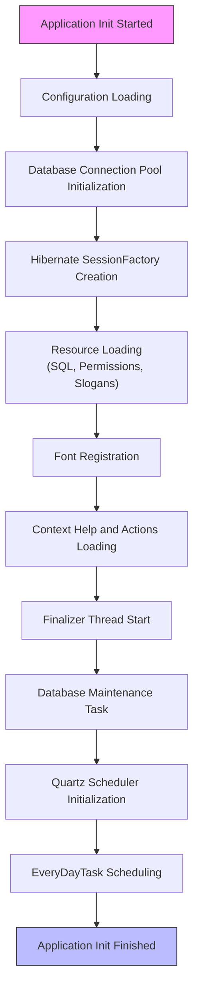
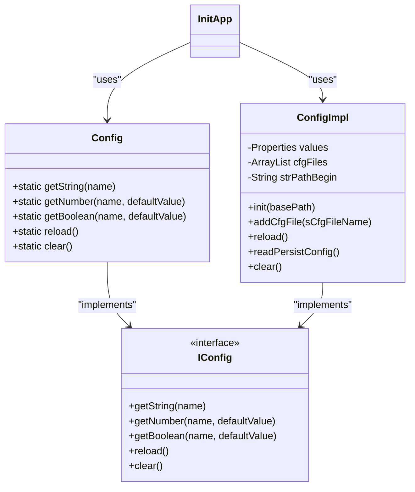
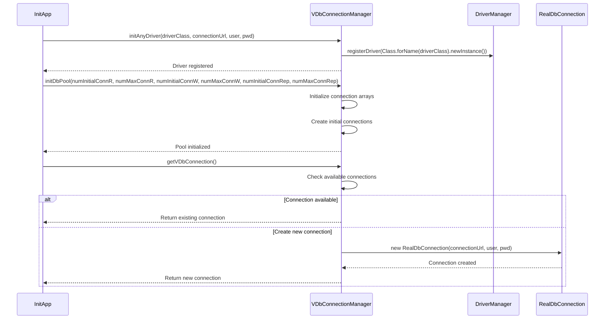
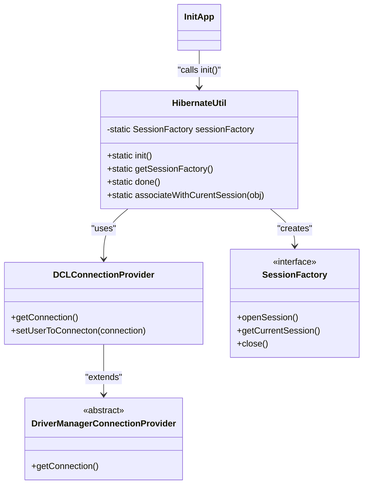
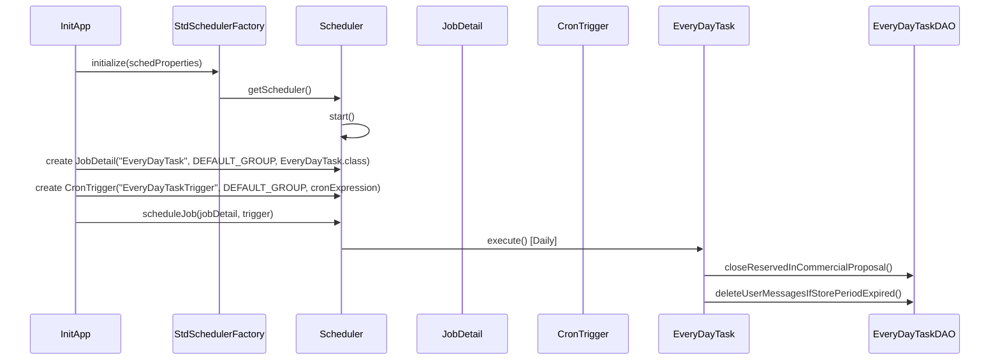
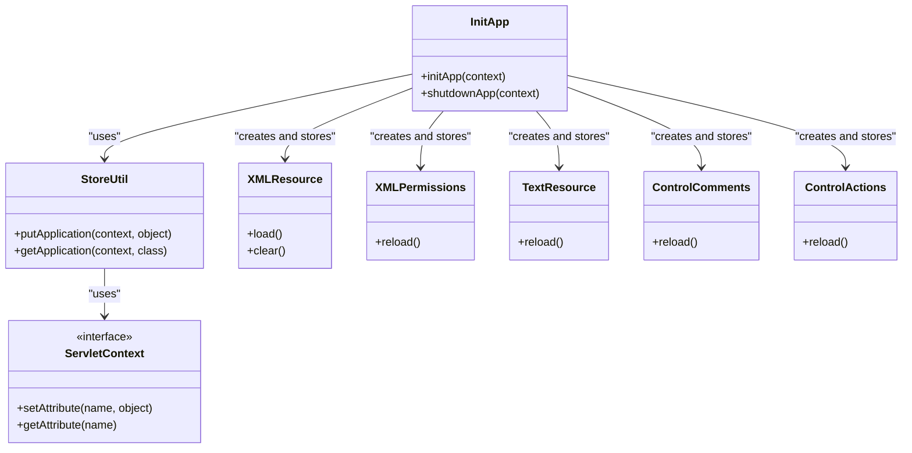
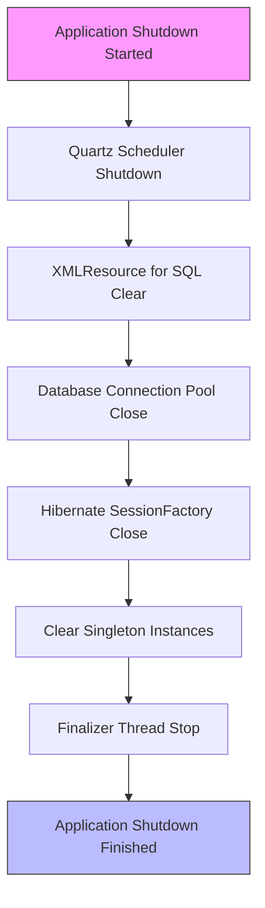

# Application Initialization

<cite>
**Referenced Files in This Document**   
- [InitApp.java](file://src/main/java/net/sam/dcl/servlets/InitApp.java)
- [Config.java](file://src/main/java/net/sam/dcl/config/Config.java)
- [ConfigImpl.java](file://src/main/java/net/sam/dcl/config/ConfigImpl.java)
- [VDbConnectionManager.java](file://src/main/java/net/sam/dcl/db/VDbConnectionManager.java)
- [HibernateUtil.java](file://src/main/java/net/sam/dcl/util/HibernateUtil.java)
- [EveryDayTask.java](file://src/main/java/net/sam/dcl/tasks/EveryDayTask.java)
- [application.properties](file://src/main/resources/application.properties)
- [hibernate.cfg.xml](file://src/main/resources/hibernate.cfg.xml)
- [web.xml](file://src/main/webapp/WEB-INF/web.xml)
</cite>

## Table of Contents
1. [Introduction](#introduction)
2. [Initialization Sequence](#initialization-sequence)
3. [Configuration Loading](#configuration-loading)
4. [Database Connection Management](#database-connection-management)
5. [Hibernate SessionFactory Initialization](#hibernate-sessionfactory-initialization)
6. [Quartz Job Scheduling](#quartz-job-scheduling)
7. [Application Context Setup](#application-context-setup)
8. [Component Usage Throughout Application Lifecycle](#component-usage-throughout-application-lifecycle)
9. [Common Startup Issues](#common-startup-issues)
10. [Performance Considerations](#performance-considerations)
11. [Shutdown Process](#shutdown-process)

## Introduction
The dcl_v3 application initialization process is orchestrated through the InitApp servlet, which serves as the startup entry point when the application deploys. This comprehensive initialization sequence ensures that all critical system components are properly configured and available for use throughout the application lifecycle. The process follows a well-defined order: loading configuration properties, establishing database connections, initializing ORM frameworks, and scheduling recurring tasks. This document details each phase of the initialization process, explaining how singleton instances are created for configuration management, database connectivity, and scheduled operations. Understanding this initialization flow is essential for maintaining system stability, diagnosing startup issues, and optimizing application performance.

**Section sources**
- [InitApp.java](file://src/main/java/net/sam/dcl/servlets/InitApp.java#L1-L50)
- [web.xml](file://src/main/webapp/WEB-INF/web.xml#L1-L20)

## Initialization Sequence
The application initialization follows a strict sequence of operations that ensures dependencies are resolved in the correct order. The process begins when the servlet container invokes the init method of InitApp, which is configured with a load-on-startup value of 1 in web.xml, ensuring it initializes before other servlets. The initialization sequence proceeds through several critical phases: configuration loading, database connection pool setup, Hibernate initialization, resource loading, and scheduler configuration. Each phase builds upon the previous one, creating a foundation for the application's operation. The process is logged extensively, providing visibility into each step's success or failure. If any phase encounters a critical error, the initialization terminates with a ServletException, preventing the application from starting in an inconsistent state. This sequential approach ensures that components are available when needed by subsequent initialization steps and during normal application operation.

**Diagram sources**
- [InitApp.java](file://src/main/java/net/sam/dcl/servlets/InitApp.java#L50-L150)

**Section sources**
- [InitApp.java](file://src/main/java/net/sam/dcl/servlets/InitApp.java#L50-L150)

## Configuration Loading
The configuration loading process begins with the creation of a ConfigImpl instance that serves as the concrete implementation of the IConfig interface. The system first determines the base path for configuration files by accessing the servlet context's real path and navigating to the parent directory. By default, configuration files are loaded from the conf directory, though this can be overridden through servlet context parameters. The primary configuration file, main.cfg, is loaded first, followed by additional configuration files specified in the config.file property, which supports multiple files separated by the pipe character. The ConfigImpl class maintains a collection of configuration files and reloads their properties into a central Properties object. Configuration values can contain the %HOME% placeholder, which is replaced with the base path during processing. After loading file-based configurations, the system retrieves additional configuration properties from the dcl_setting database table, merging them with the file-based settings. This two-tiered approach allows administrators to modify certain settings without requiring file system access. The Config class provides static methods for accessing configuration values, serving as a global point of access throughout the application.

**Diagram sources**
- [Config.java](file://src/main/java/net/sam/dcl/config/Config.java#L1-L30)
- [ConfigImpl.java](file://src/main/java/net/sam/dcl/config/ConfigImpl.java#L22-L100)

**Section sources**
- [InitApp.java](file://src/main/java/net/sam/dcl/servlets/InitApp.java#L70-L100)
- [Config.java](file://src/main/java/net/sam/dcl/config/Config.java#L1-L132)
- [ConfigImpl.java](file://src/main/java/net/sam/dcl/config/ConfigImpl.java#L22-L450)

## Database Connection Management
Database connection management is handled by the VDbConnectionManager class, which implements a connection pooling mechanism for the Firebird database. The initialization process begins by calling initAnyDriver with database connection parameters retrieved from the configuration, including the driver class name, connection URL, username, and password. This method registers the JDBC driver with the DriverManager. Following driver initialization, the system configures the connection pool with different connection types for various purposes: read operations, write operations, and reporting. The pool sizes are determined by configuration parameters such as dbconnect.rConnectNumber for read connections and dbconnect.wConnectNumber for write connections. The connection pool maintains separate arrays for different connection types, allowing the application to request connections optimized for specific operations. When a connection is requested through getVDbConnection, the manager either returns an available connection from the pool or creates a new one if the pool has capacity. The RealDbConnection class wraps the actual JDBC connection, providing additional functionality like connection tracking and automatic cleanup. This connection pooling strategy improves performance by reusing established connections and reduces the overhead of creating new connections for each database operation.

**Diagram sources**
- [InitApp.java](file://src/main/java/net/sam/dcl/servlets/InitApp.java#L105-L130)
- [VDbConnectionManager.java](file://src/main/java/net/sam/dcl/db/VDbConnectionManager.java#L1-L200)

**Section sources**
- [InitApp.java](file://src/main/java/net/sam/dcl/servlets/InitApp.java#L105-L130)
- [VDbConnectionManager.java](file://src/main/java/net/sam/dcl/db/VDbConnectionManager.java#L1-L1134)

## Hibernate SessionFactory Initialization
The Hibernate SessionFactory is initialized through the HibernateUtil class, which creates a singleton instance during application startup. The initialization process begins by creating a Configuration object using AnnotationConfiguration, which loads settings from hibernate.cfg.xml. The system then overrides key connection properties with values from the application configuration, including the connection URL, driver class, username, and password. A custom DCLConnectionProvider is set as the connection provider, which extends DriverManagerConnectionProvider to inject the current user context into database connections via a stored procedure call. This ensures that database operations can be traced to specific application users. The SessionFactory is built from the configured settings and stored as a static variable, making it globally accessible through the getSessionFactory method. This approach allows the application to use Hibernate's session management features while maintaining integration with the existing database connection pooling mechanism. The SessionFactory serves as a factory for Session instances, which are used throughout the application for database operations, transaction management, and object-relational mapping.

**Diagram sources**
- [HibernateUtil.java](file://src/main/java/net/sam/dcl/util/HibernateUtil.java#L1-L50)
- [InitApp.java](file://src/main/java/net/sam/dcl/servlets/InitApp.java#L135-L145)

**Section sources**
- [HibernateUtil.java](file://src/main/java/net/sam/dcl/util/HibernateUtil.java#L1-L132)
- [InitApp.java](file://src/main/java/net/sam/dcl/servlets/InitApp.java#L135-L145)

## Quartz Job Scheduling
The application uses Quartz for scheduling recurring tasks, with the EveryDayTask configured to run daily. During initialization, the system sets up a Quartz scheduler using RAMJobStore for job storage and SimpleThreadPool with three threads for job execution. The scheduler configuration is defined programmatically with properties that specify the job store and thread pool implementations. Once the scheduler is initialized and started, the system checks for the runEveryDayTaskCronScheduler configuration property, which contains the cron expression for task scheduling. If this property is defined, a JobDetail is created for the EveryDayTask class and scheduled with a CronTrigger using the specified expression. The EveryDayTask implements the StatefulJob interface, which prevents concurrent execution of the same job. The task performs maintenance operations such as closing reserved items in commercial proposals and deleting expired user messages. This scheduling mechanism allows the application to perform regular housekeeping tasks without requiring external cron jobs or manual intervention. The use of cron expressions provides flexibility in defining the execution schedule, allowing administrators to configure the timing through application properties.

**Diagram sources**
- [InitApp.java](file://src/main/java/net/sam/dcl/servlets/InitApp.java#L200-L250)
- [EveryDayTask.java](file://src/main/java/net/sam/dcl/tasks/EveryDayTask.java#L1-L20)

**Section sources**
- [InitApp.java](file://src/main/java/net/sam/dcl/servlets/InitApp.java#L200-L250)
- [EveryDayTask.java](file://src/main/java/net/sam/dcl/tasks/EveryDayTask.java#L1-L39)

## Application Context Setup
The application context is established by storing singleton instances of key components in the servlet context, making them accessible to all parts of the application. During initialization, the system creates and configures several critical components that are then stored using StoreUtil.putApplication. These include the XMLResource instance for SQL queries, XMLPermissions for access control, TextResource for slogans, ControlComments for context help, and ControlActions for action definitions. The Config class maintains a static reference to the ConfigImpl instance, providing global access to configuration settings. The VDbConnectionManager maintains static arrays for connection pools, while HibernateUtil holds the SessionFactory as a static variable. The FinalizerThread is started as a daemon thread to handle background cleanup operations. These singleton instances are designed to be thread-safe and remain available throughout the application lifecycle. This context setup pattern ensures that components are initialized once and reused, reducing resource consumption and ensuring consistency across different parts of the application. The use of the servlet context as a registry for these components follows standard Java EE patterns for web application initialization.

**Diagram sources**
- [InitApp.java](file://src/main/java/net/sam/dcl/servlets/InitApp.java#L150-L190)
- [StoreUtil.java](file://src/main/java/net/sam/dcl/util/StoreUtil.java#L1-L20)

**Section sources**
- [InitApp.java](file://src/main/java/net/sam/dcl/servlets/InitApp.java#L150-L190)

## Component Usage Throughout Application Lifecycle
Throughout the application lifecycle, the initialized components are accessed by various parts of the system to perform their functions. The Config class is used extensively across the codebase to retrieve configuration values, with methods like getString, getNumber, and getBoolean providing type-safe access to settings. Database operations use VDbConnectionManager.getVDbConnection() to obtain connections from the pool, ensuring efficient resource utilization. The Hibernate SessionFactory is accessed through HibernateUtil.getSessionFactory() to create sessions for ORM operations, with the current session pattern used in conjunction with the HibernateSessionFilter. Scheduled tasks like EveryDayTask execute their business logic through DAO classes that interact with the database using the connection pool. The XMLResource instance stored in the servlet context is used to retrieve SQL queries by name, allowing dynamic SQL execution without hardcoding queries in Java code. Permissions and access control are enforced using the XMLPermissions instance, which defines the application's security model. This widespread usage of the initialized components demonstrates how the startup process creates a foundation that supports the entire application's functionality.

**Section sources**
- [InitApp.java](file://src/main/java/net/sam/dcl/servlets/InitApp.java#L250-L300)
- [Config.java](file://src/main/java/net/sam/dcl/config/Config.java#L50-L100)
- [HibernateUtil.java](file://src/main/java/net/sam/dcl/util/HibernateUtil.java#L60-L80)

## Common Startup Issues
Several common startup issues can prevent the application from initializing successfully. Configuration loading failures may occur if the conf directory is missing, the main.cfg file cannot be read, or the %HOME% path resolution fails. Database connectivity problems can arise from incorrect connection parameters, network issues, database server unavailability, or authentication failures. These typically manifest as VDbException during the connection pool initialization phase. Scheduler initialization errors may occur if the Quartz configuration is invalid, the cron expression syntax is incorrect, or there are class loading issues with the EveryDayTask class. Hibernate initialization failures can result from incorrect database dialect settings, missing hibernate.cfg.xml, or connection parameter mismatches between the configuration and Hibernate settings. Resource loading issues may occur if the SQL resources, permission files, or slogan files are missing or have incorrect paths specified in the configuration. These startup issues are typically logged with ERROR level and result in a ServletException that prevents the application from starting. Proper monitoring of startup logs and validation of configuration files can help identify and resolve these issues before they impact application availability.

**Section sources**
- [InitApp.java](file://src/main/java/net/sam/dcl/servlets/InitApp.java#L120-L140)
- [InitApp.java](file://src/main/java/net/sam/dcl/servlets/InitApp.java#L220-L240)
- [VDbConnectionManager.java](file://src/main/java/net/sam/dcl/db/VDbConnectionManager.java#L50-L100)

## Performance Considerations
Several performance considerations can optimize the application startup time and resource allocation. Connection pool sizing should be tuned based on expected workload, with separate pools for read, write, and reporting operations to prevent resource contention. The initial connection count should be set to a reasonable value to avoid the overhead of creating connections on demand during peak load. Hibernate initialization can be optimized by ensuring the hibernate.cfg.xml file is properly configured and by using bytecode enhancement if appropriate. The number of Quartz scheduler threads should be balanced between concurrency needs and resource consumption. Configuration loading performance can be improved by minimizing the number of configuration files and optimizing the database query for persistent settings. The application should be monitored during startup to identify bottlenecks, with particular attention to database connection establishment and resource loading times. Caching strategies should be evaluated to determine if additional caching layers would benefit performance, though the current configuration disables Hibernate's second-level cache. These performance considerations help ensure that the application starts efficiently and can handle its expected workload without resource constraints.

**Section sources**
- [InitApp.java](file://src/main/java/net/sam/dcl/servlets/InitApp.java#L105-L130)
- [hibernate.cfg.xml](file://src/main/resources/hibernate.cfg.xml#L1-L20)
- [application.properties](file://src/main/resources/application.properties#L50-L60)

## Shutdown Process
The application shutdown process is triggered when the servlet container calls the destroy method of InitApp, which invokes shutdownApp with the servlet context. This process systematically releases resources in reverse order of their initialization. The Quartz scheduler is shut down first, stopping all scheduled jobs. The XMLResource for SQL queries is cleared, releasing any loaded SQL definitions. The database connection pool is closed by calling closeAllRealDbConnection on VDbConnectionManager, which terminates all active connections. The Hibernate SessionFactory is closed by calling HibernateUtil.done(), releasing any associated resources. Various singleton instances are cleared, including the permission checker, session booking, locked records, configuration, and outline. The FinalizerThread is stopped by calling join and stopExecution, allowing it to complete any pending cleanup operations. This orderly shutdown process ensures that all resources are properly released, transactions are completed, and data integrity is maintained. The extensive logging during shutdown provides visibility into the cleanup process and helps identify any issues that may occur during application termination.

**Diagram sources**
- [InitApp.java](file://src/main/java/net/sam/dcl/servlets/InitApp.java#L250-L300)

**Section sources**
- [InitApp.java](file://src/main/java/net/sam/dcl/servlets/InitApp.java#L250-L300)