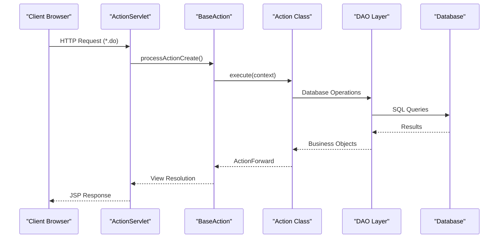
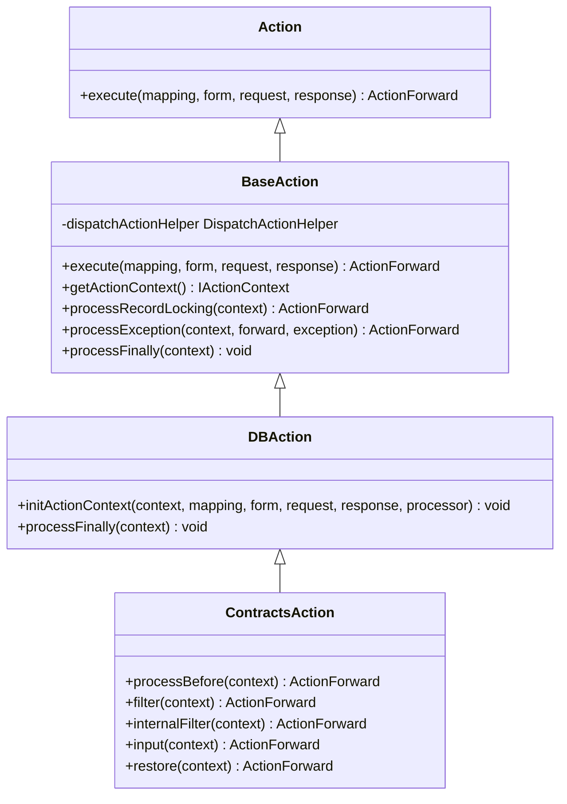
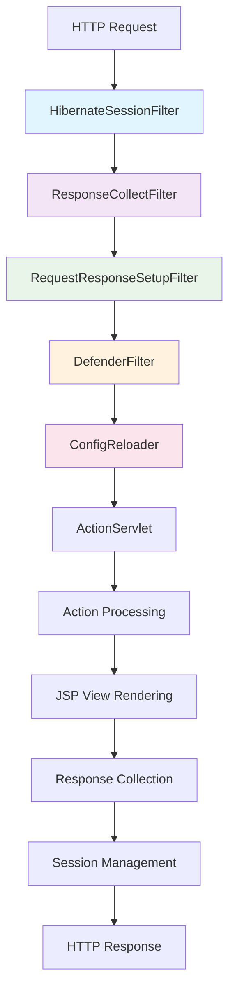
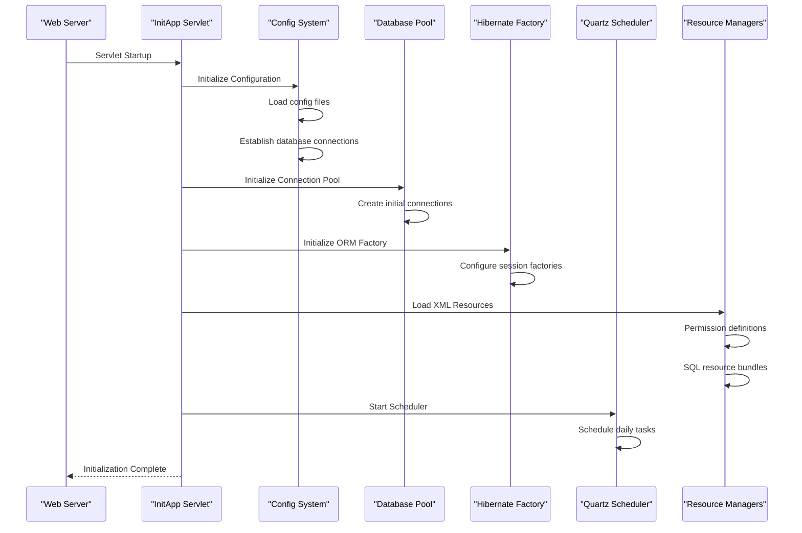
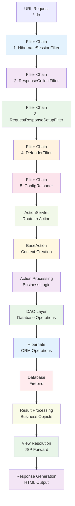
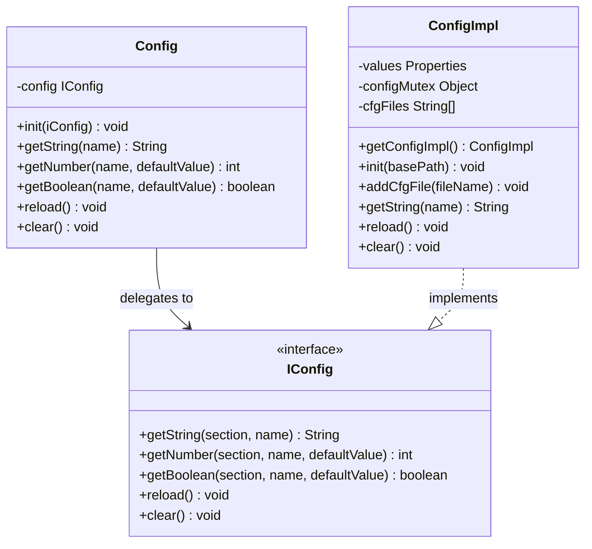
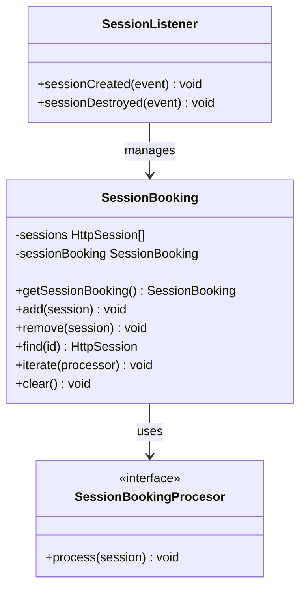
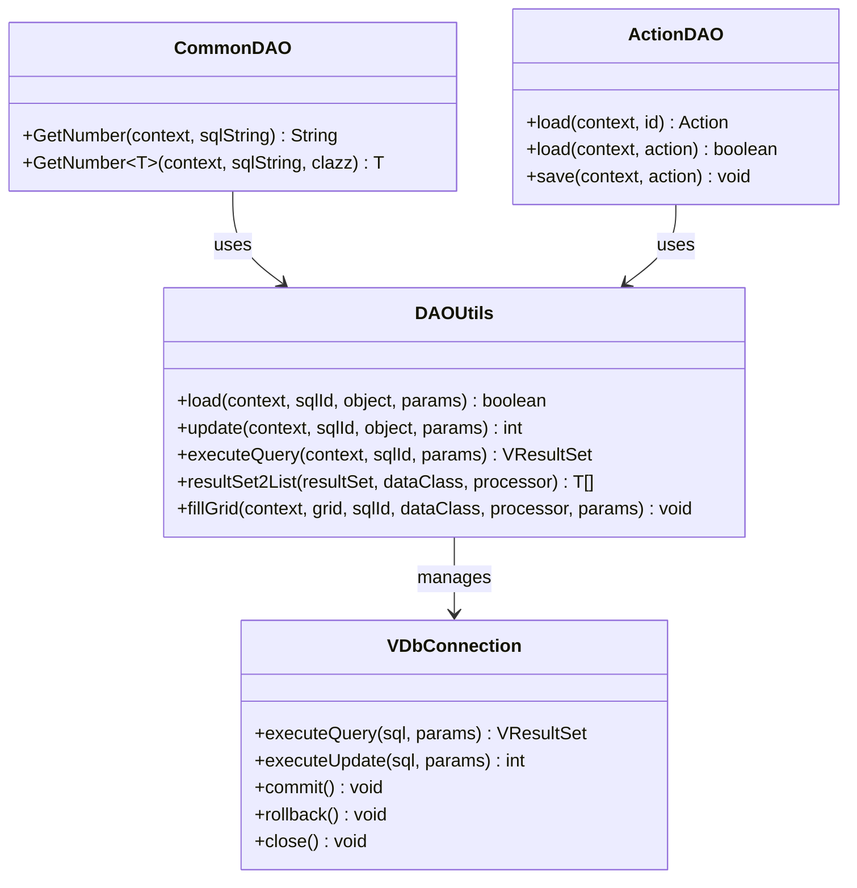
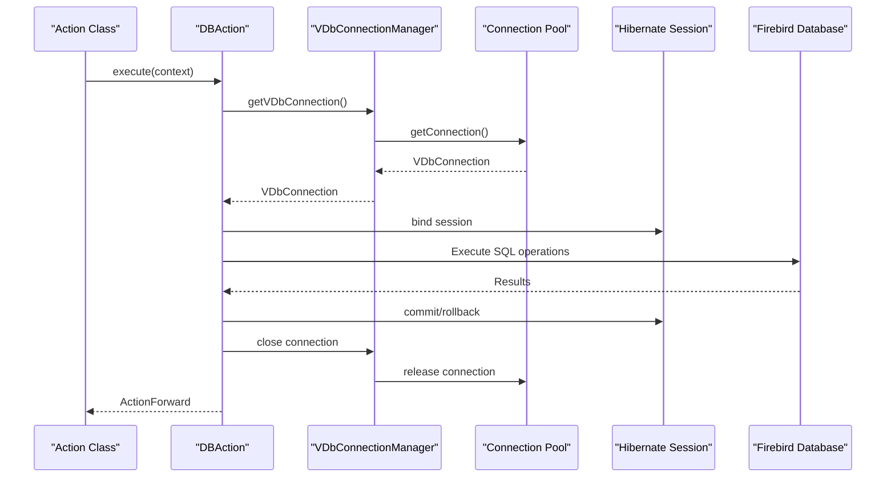

# Backend Architecture

<cite>
**Referenced Files in This Document**
- [web.xml](file://src/main/webapp/WEB-INF/web.xml)
- [InitApp.java](file://src/main/java/net/sam/dcl/servlets/InitApp.java)
- [BaseAction.java](file://src/main/java/net/sam/dcl/controller/actions/BaseAction.java)
- [HibernateSessionFilter.java](file://src/main/java/net/sam/dcl/filters/HibernateSessionFilter.java)
- [DefenderFilter.java](file://src/main/java/net/sam/dcl/filters/DefenderFilter.java)
- [RequestResponseSetupFilter.java](file://src/main/java/net/sam/dcl/filters/RequestResponseSetupFilter.java)
- [ResponseCollectFilter.java](file://src/main/java/net/sam/dcl/filters/ResponseCollectFilter.java)
- [ConfigReloader.java](file://src/main/java/net/sam/dcl/filters/ConfigReloader.java)
- [SessionBooking.java](file://src/main/java/net/sam/dcl/session/SessionBooking.java)
- [SessionListener.java](file://src/main/java/net/sam/dcl/session/SessionListener.java)
- [Config.java](file://src/main/java/net/sam/dcl/config/Config.java)
- [ConfigImpl.java](file://src/main/java/net/sam/dcl/config/ConfigImpl.java)
- [ContractsAction.java](file://src/main/java/net/sam/dcl/action/ContractsAction.java)
- [ActionDAO.java](file://src/main/java/net/sam/dcl/dao/ActionDAO.java)
- [CommonDAO.java](file://src/main/java/net/sam/dcl/dao/CommonDAO.java)
- [DBAction.java](file://src/main/java/net/sam/dcl/controller/actions/DBAction.java)
</cite>

## Table of Contents
1. [Introduction](#introduction)
2. [Struts 1.x MVC Architecture](#struts-1x-mvc-architecture)
3. [Filter Chain Execution Order](#filter-chain-execution-order)
4. [Application Initialization](#application-initialization)
5. [Request Processing Flow](#request-processing-flow)
6. [Architectural Patterns](#architectural-patterns)
7. [Data Access Layer](#data-access-layer)
8. [Troubleshooting Guide](#troubleshooting-guide)
9. [Best Practices](#best-practices)
10. [Conclusion](#conclusion)

## Introduction

The dcl_v3 backend architecture implements a robust Struts 1.x MVC framework with comprehensive filtering, session management, and database connectivity. Built on Java Servlet technology, this architecture provides a layered approach to web application development with clear separation of concerns and extensive customization capabilities.

The system follows established enterprise patterns including singleton configuration management, filter chain processing, and action-based request handling. The architecture supports complex business logic processing while maintaining clean separation between presentation, business, and data access layers.

## Struts 1.x MVC Architecture

### ActionServlet Routing

The Struts 1.x framework serves as the central controller in this architecture, routing requests through the ActionServlet to appropriate Action classes. The servlet configuration defines the core MVC processing pipeline:

**Diagram sources**
- [BaseAction.java](file://src/main/java/net/sam/dcl/controller/actions/BaseAction.java#L75-L200)
- [web.xml](file://src/main/webapp/WEB-INF/web.xml#L85-L100)

### BaseAction Class Hierarchy

The BaseAction class provides the foundation for all action implementations, offering sophisticated dispatch mechanisms and lifecycle management:

**Diagram sources**
- [BaseAction.java](file://src/main/java/net/sam/dcl/controller/actions/BaseAction.java#L25-L50)
- [DBAction.java](file://src/main/java/net/sam/dcl/controller/actions/DBAction.java#L15-L35)
- [ContractsAction.java](file://src/main/java/net/sam/dcl/action/ContractsAction.java#L20-L40)

**Section sources**
- [BaseAction.java](file://src/main/java/net/sam/dcl/controller/actions/BaseAction.java#L75-L200)
- [DBAction.java](file://src/main/java/net/sam/dcl/controller/actions/DBAction.java#L15-L35)

## Filter Chain Execution Order

The filter chain implements a sophisticated middleware processing system with specific execution order and responsibilities:

**Diagram sources**
- [web.xml](file://src/main/webapp/WEB-INF/web.xml#L20-L70)

### Filter Responsibilities

| Filter | Priority | Responsibility | Configuration |
|--------|----------|----------------|---------------|
| HibernateSessionFilter | 1 | Database session management and transaction control | Automatic session binding/unbinding |
| ResponseCollectFilter | 2 | Response caching and replay functionality | Conditional response collection |
| RequestResponseSetupFilter | 3 | Character encoding setup and logging | UTF-8 encoding enforcement |
| DefenderFilter | 4 | Authentication and permission checking | Login page redirection |
| ConfigReloader | 5 | Dynamic configuration reloading | Runtime config updates |

**Section sources**
- [web.xml](file://src/main/webapp/WEB-INF/web.xml#L20-L70)
- [HibernateSessionFilter.java](file://src/main/java/net/sam/dcl/filters/HibernateSessionFilter.java#L20-L50)
- [ResponseCollectFilter.java](file://src/main/java/net/sam/dcl/filters/ResponseCollectFilter.java#L30-L60)

## Application Initialization

### InitApp Servlet Configuration

The InitApp servlet serves as the primary application initializer, establishing the complete runtime environment:

**Diagram sources**
- [InitApp.java](file://src/main/java/net/sam/dcl/servlets/InitApp.java#L50-L150)

### Initialization Sequence Details

The initialization process follows a specific sequence to ensure proper dependency resolution:

1. **Configuration Loading**: Multiple configuration files loaded with hierarchical precedence
2. **Database Pool Setup**: Connection pools established with configurable parameters
3. **Hibernate Factory Creation**: ORM factory initialized with mapping configurations
4. **Resource Bundle Loading**: XML resources for permissions, SQL templates, and UI texts
5. **Scheduler Configuration**: Quartz scheduler initialized with cron-based tasks
6. **Cleanup Thread Setup**: Background thread for resource cleanup and monitoring

**Section sources**
- [InitApp.java](file://src/main/java/net/sam/dcl/servlets/InitApp.java#L50-L200)

## Request Processing Flow

### Complete Request Lifecycle

The request processing follows a comprehensive flow that demonstrates the integration between filters, actions, and data access:

**Diagram sources**
- [BaseAction.java](file://src/main/java/net/sam/dcl/controller/actions/BaseAction.java#L75-L200)
- [HibernateSessionFilter.java](file://src/main/java/net/sam/dcl/filters/HibernateSessionFilter.java#L25-L80)

### Practical Example: Contract Management Flow

Consider a typical contract management request flow:

1. **Request Reception**: `/contracts.do?dispatch=filter&status=active`
2. **Filter Processing**: All filters execute in configured order
3. **Action Selection**: ContractsAction selected based on URL mapping
4. **Context Preparation**: Action context created with request parameters
5. **Business Logic Execution**: Filter method processes contract queries
6. **Database Interaction**: DAO layer executes SQL queries via Hibernate
7. **Result Processing**: Contract objects populated from database results
8. **View Rendering**: JSP page generated with filtered contract data

**Section sources**
- [ContractsAction.java](file://src/main/java/net/sam/dcl/action/ContractsAction.java#L40-L80)
- [ActionDAO.java](file://src/main/java/net/sam/dcl/dao/ActionDAO.java#L10-L35)

## Architectural Patterns

### Singleton Pattern Implementation

The configuration system implements a classic singleton pattern with thread-safe access:

**Diagram sources**
- [Config.java](file://src/main/java/net/sam/dcl/config/Config.java#L10-L50)
- [ConfigImpl.java](file://src/main/java/net/sam/dcl/config/ConfigImpl.java#L20-L80)

### Session Booking Pattern

The SessionBooking class implements a custom singleton pattern for session management:

**Diagram sources**
- [SessionBooking.java](file://src/main/java/net/sam/dcl/session/SessionBooking.java#L20-L70)
- [SessionListener.java](file://src/main/java/net/sam/dcl/session/SessionListener.java#L15-L28)

**Section sources**
- [Config.java](file://src/main/java/net/sam/dcl/config/Config.java#L10-L100)
- [SessionBooking.java](file://src/main/java/net/sam/dcl/session/SessionBooking.java#L20-L99)

## Data Access Layer

### DAO Pattern Implementation

The data access layer follows established DAO patterns with comprehensive error handling and resource management:

**Diagram sources**
- [CommonDAO.java](file://src/main/java/net/sam/dcl/dao/CommonDAO.java#L10-L47)
- [ActionDAO.java](file://src/main/java/net/sam/dcl/dao/ActionDAO.java#L10-L36)

### Database Connection Management

The system implements sophisticated connection pooling with automatic resource management:

**Diagram sources**
- [DBAction.java](file://src/main/java/net/sam/dcl/controller/actions/DBAction.java#L20-L35)

**Section sources**
- [CommonDAO.java](file://src/main/java/net/sam/dcl/dao/CommonDAO.java#L10-L47)
- [ActionDAO.java](file://src/main/java/net/sam/dcl/dao/ActionDAO.java#L10-L36)
- [DBAction.java](file://src/main/java/net/sam/dcl/controller/actions/DBAction.java#L20-L35)

## Troubleshooting Guide

### Common Filter Configuration Issues

#### HibernateSessionFilter Problems

**Symptom**: Database transactions not committing properly
**Diagnosis**: Check filter chain order and exception handling
**Solution**: Verify HibernateSessionFilter is first in chain and proper exception handling

**Symptom**: Session leaks causing memory issues
**Diagnosis**: Monitor session binding/unbinding logs
**Solution**: Ensure proper session cleanup in finally blocks

#### DefenderFilter Authentication Issues

**Symptom**: Users redirected to login page unnecessarily
**Diagnosis**: Check permission configuration and user session state
**Solution**: Verify trusted directories configuration and session timeout settings

#### RequestResponseSetupFilter Encoding Problems

**Symptom**: Character encoding issues with international characters
**Diagnosis**: Check filter initialization parameters
**Solution**: Verify UTF-8 encoding configuration in web.xml

### Session Management Troubleshooting

#### Session Leaks

**Symptoms**: Memory consumption growing over time
**Diagnosis**: Monitor SessionBooking and SessionListener activity
**Solution**: Implement proper session cleanup in application shutdown

**Symptom**: Users experiencing unexpected logout
**Diagnosis**: Check session timeout configuration and inactivity intervals
**Solution**: Adjust session timeout settings and monitor session creation/destruction

#### Record Locking Issues

**Symptom**: Users unable to access locked records
**Diagnosis**: Monitor LockedRecords and synchronization objects
**Solution**: Implement proper lock timeout handling and user notification

### Database Connection Problems

#### Connection Pool Exhaustion

**Symptoms**: "Unable to get connection" errors
**Diagnosis**: Monitor connection pool statistics
**Solution**: Increase pool size or optimize connection usage patterns

**Symptom**: Long-running queries causing timeouts
**Diagnosis**: Check query execution times and database performance
**Solution**: Optimize SQL queries and implement connection timeout limits

**Section sources**
- [HibernateSessionFilter.java](file://src/main/java/net/sam/dcl/filters/HibernateSessionFilter.java#L40-L109)
- [SessionBooking.java](file://src/main/java/net/sam/dcl/session/SessionBooking.java#L60-L99)
- [InitApp.java](file://src/main/java/net/sam/dcl/servlets/InitApp.java#L200-L250)

## Best Practices

### Filter Chain Optimization

1. **Order Matters**: Maintain consistent filter execution order
2. **Early Termination**: Use filter conditions to skip unnecessary processing
3. **Resource Cleanup**: Always clean up resources in finally blocks
4. **Exception Handling**: Implement comprehensive exception handling

### Action Class Design

1. **Single Responsibility**: Each action handles one business operation
2. **Context Usage**: Leverage action context for consistent data access
3. **Error Handling**: Implement proper exception handling and user feedback
4. **Session Management**: Use appropriate session attributes for state management

### Database Access Patterns

1. **Connection Management**: Always close connections in finally blocks
2. **Transaction Boundaries**: Define clear transaction scopes
3. **Query Optimization**: Use prepared statements and parameterized queries
4. **Resource Loading**: Cache frequently accessed resources

### Configuration Management

1. **Hierarchical Loading**: Use configuration file precedence effectively
2. **Runtime Updates**: Implement configuration reloading for dynamic updates
3. **Environment Separation**: Maintain separate configurations for environments
4. **Validation**: Validate configuration parameters during startup

## Conclusion

The dcl_v3 backend architecture demonstrates a mature implementation of enterprise Java web application patterns. The Struts 1.x MVC framework provides robust request handling with comprehensive filter chain processing for cross-cutting concerns. The singleton patterns for configuration and session management ensure efficient resource utilization while maintaining thread safety.

The layered architecture separates presentation, business logic, and data access concerns effectively, enabling maintainable and extensible code. The comprehensive filter chain handles authentication, encoding, session management, and resource caching in a predictable order.

Key strengths include the sophisticated session booking system, robust database connection management, and flexible configuration system. The architecture supports complex business requirements while maintaining good performance characteristics through careful resource management and optimization patterns.

For future enhancements, consider modernizing to newer frameworks while preserving the established patterns, implementing comprehensive monitoring and logging, and enhancing security measures for production deployments.