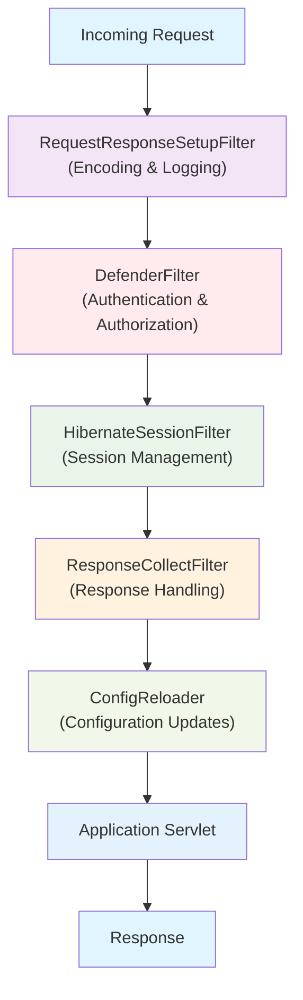
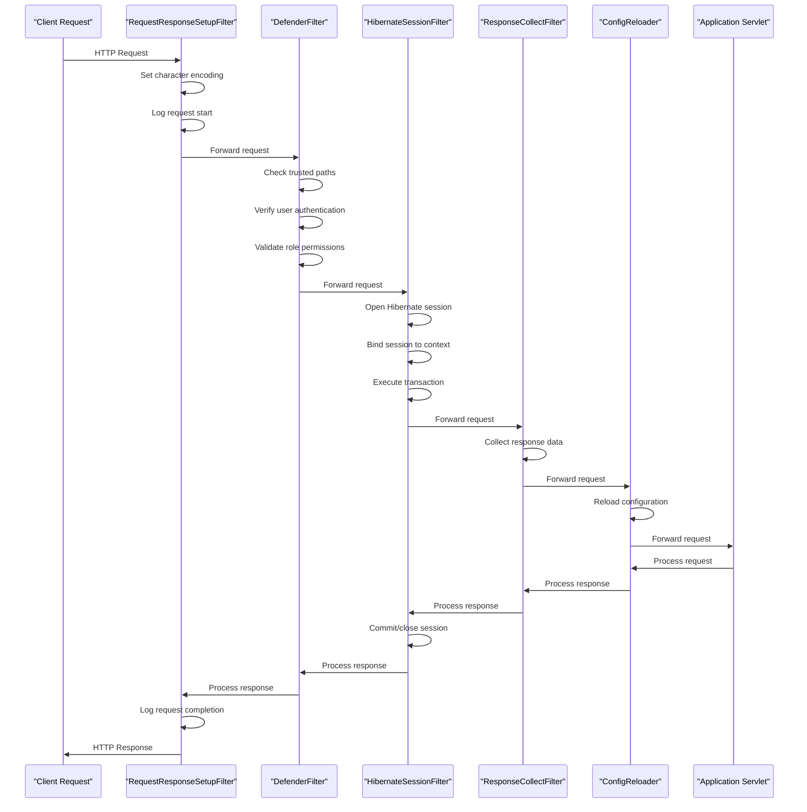
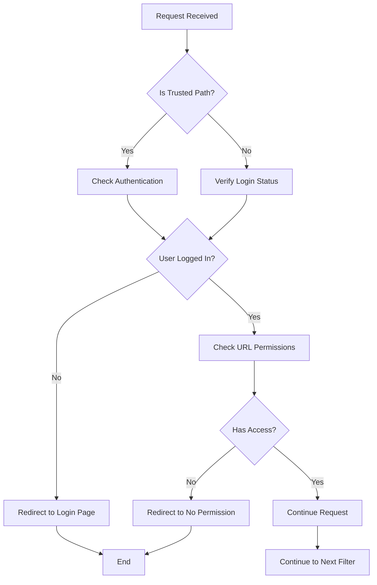
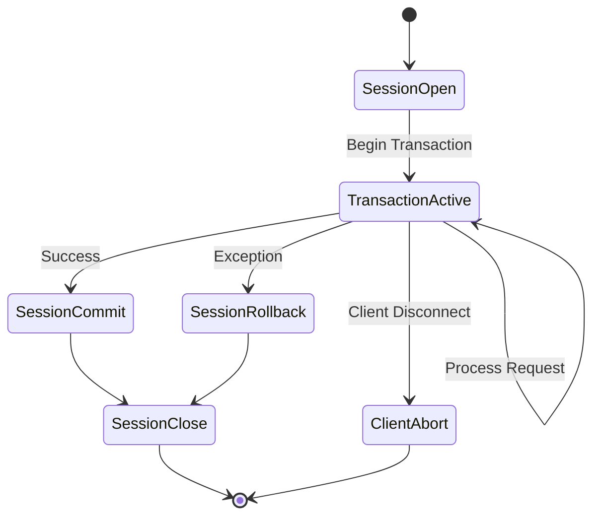
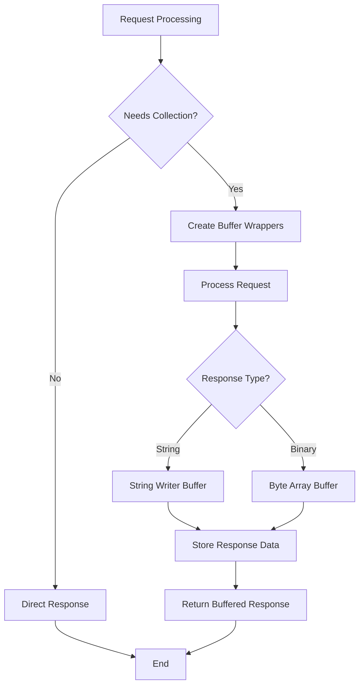
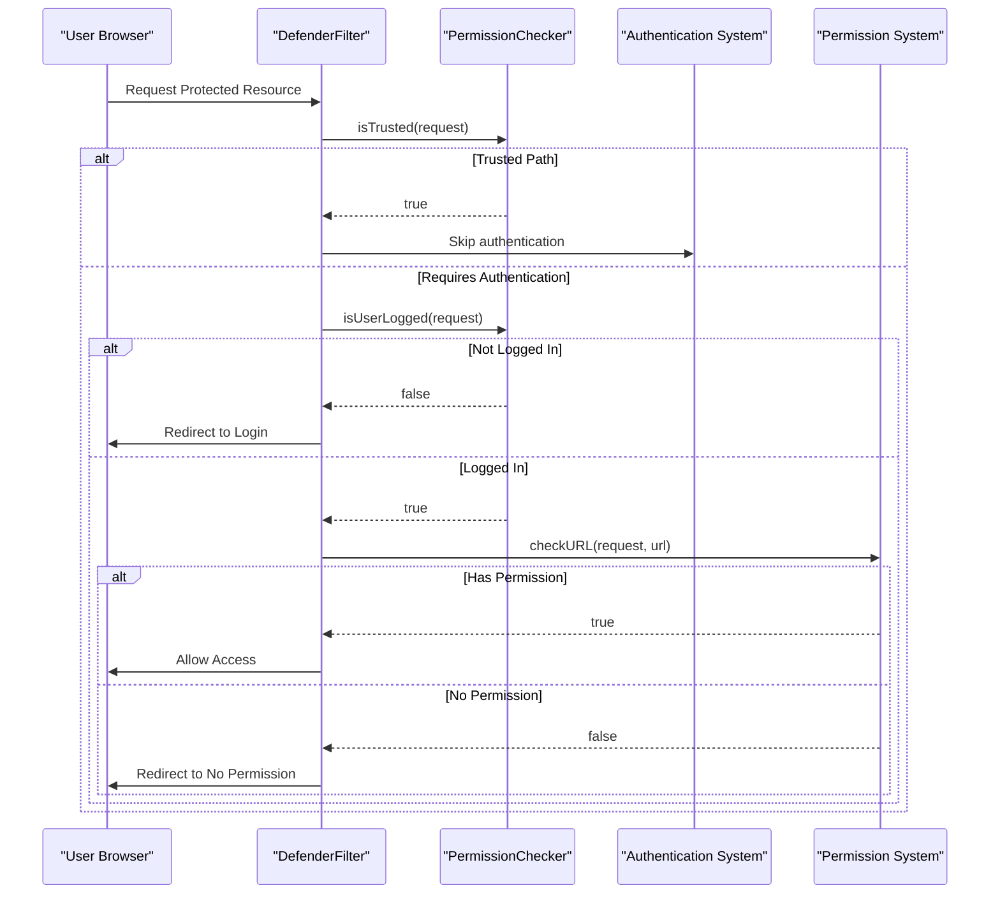
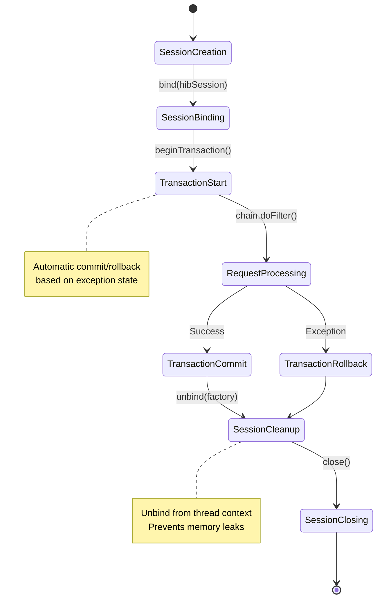

# Filter Chain

<cite>
**Referenced Files in This Document**
- [web.xml](file://src/main/webapp/WEB-INF/web.xml)
- [RequestResponseSetupFilter.java](file://src/main/java/net/sam/dcl/filters/RequestResponseSetupFilter.java)
- [DefenderFilter.java](file://src/main/java/net/sam/dcl/filters/DefenderFilter.java)
- [HibernateSessionFilter.java](file://src/main/java/net/sam/dcl/filters/HibernateSessionFilter.java)
- [ResponseCollectFilter.java](file://src/main/java/net/sam/dcl/filters/ResponseCollectFilter.java)
- [ConfigReloader.java](file://src/main/java/net/sam/dcl/filters/ConfigReloader.java)
- [PermissionChecker.java](file://src/main/java/net/sam/dcl/navigation/PermissionChecker.java)
- [XMLPermissions.java](file://src/main/java/net/sam/dcl/navigation/XMLPermissions.java)
- [Action.java](file://src/main/java/net/sam/dcl/navigation/Action.java)
- [HibernateUtil.java](file://src/main/java/net/sam/dcl/util/HibernateUtil.java)
- [UserUtil.java](file://src/main/java/net/sam/dcl/util/UserUtil.java)
</cite>

## Table of Contents
1. [Introduction](#introduction)
2. [Filter Chain Architecture](#filter-chain-architecture)
3. [Filter Execution Order](#filter-execution-order)
4. [Detailed Filter Analysis](#detailed-filter-analysis)
5. [Security Implementation](#security-implementation)
6. [Session Management](#session-management)
7. [Common Issues and Solutions](#common-issues-and-solutions)
8. [Best Practices](#best-practices)
9. [Performance Considerations](#performance-considerations)
10. [Troubleshooting Guide](#troubleshooting-guide)

## Introduction

The dcl_v3 application implements a sophisticated servlet filter chain that provides comprehensive request processing, security enforcement, and resource management. The filter chain follows a specific execution order designed to optimize performance while maintaining robust security controls and proper resource lifecycle management.

The filter chain consists of five primary filters that work together to handle request encoding, authentication, database session management, response collection, and configuration reloading. Each filter has distinct responsibilities and operates in a carefully orchestrated sequence to ensure optimal application behavior.

## Filter Chain Architecture

The filter chain architecture in dcl_v3 is built around a layered approach where each filter handles specific aspects of request processing. The architecture ensures that security measures are applied early in the request lifecycle, while resource management and cleanup occur efficiently.

**Diagram sources**
- [web.xml](file://src/main/webapp/WEB-INF/web.xml#L44-L74)

**Section sources**
- [web.xml](file://src/main/webapp/WEB-INF/web.xml#L1-L176)

## Filter Execution Order

The filter chain executes in a specific order defined in the web.xml configuration. Understanding this order is crucial for proper filter interaction and troubleshooting.

### Sequential Execution Pattern

**Diagram sources**
- [RequestResponseSetupFilter.java](file://src/main/java/net/sam/dcl/filters/RequestResponseSetupFilter.java#L25-L50)
- [DefenderFilter.java](file://src/main/java/net/sam/dcl/filters/DefenderFilter.java#L20-L70)
- [HibernateSessionFilter.java](file://src/main/java/net/sam/dcl/filters/HibernateSessionFilter.java#L20-L110)
- [ResponseCollectFilter.java](file://src/main/java/net/sam/dcl/filters/ResponseCollectFilter.java#L40-L85)
- [ConfigReloader.java](file://src/main/java/net/sam/dcl/filters/ConfigReloader.java#L25-L45)

**Section sources**
- [web.xml](file://src/main/webapp/WEB-INF/web.xml#L44-L74)

## Detailed Filter Analysis

### RequestResponseSetupFilter

The RequestResponseSetupFilter serves as the first line of defense in the filter chain, responsible for setting up request and response encoding, logging request information, and managing caching headers.

#### Key Responsibilities:
- **Character Encoding Management**: Sets UTF-8 encoding for both requests and responses
- **Request Logging**: Logs request URLs and session IDs for monitoring
- **Caching Control**: Applies cache-control headers for specific URIs
- **Performance Monitoring**: Tracks request processing time

#### Implementation Details:
The filter examines the request URI against configuration patterns to determine whether encoding should be applied. It also manages thread-local user context and performs basic request validation.

**Section sources**
- [RequestResponseSetupFilter.java](file://src/main/java/net/sam/dcl/filters/RequestResponseSetupFilter.java#L1-L72)

### DefenderFilter

The DefenderFilter implements the core security functionality, enforcing authentication and authorization controls across the application.

#### Security Architecture:

**Diagram sources**
- [DefenderFilter.java](file://src/main/java/net/sam/dcl/filters/DefenderFilter.java#L20-L70)
- [PermissionChecker.java](file://src/main/java/net/sam/dcl/navigation/PermissionChecker.java#L25-L100)

#### Authentication and Authorization Features:
- **Trusted Path Detection**: Identifies paths that require no authentication
- **User Authentication Verification**: Checks if user is logged in
- **Role-Based Access Control**: Validates user permissions for requested resources
- **Dynamic Permission Checking**: Uses XML-based permission definitions

#### Configuration Parameters:
- `login-page`: URL for authentication redirection
- `trusted-dirs`: Regular expression pattern for trusted directories
- `forward-no-perm-page`: URL for access denied scenarios

**Section sources**
- [DefenderFilter.java](file://src/main/java/net/sam/dcl/filters/DefenderFilter.java#L1-L70)
- [PermissionChecker.java](file://src/main/java/net/sam/dcl/navigation/PermissionChecker.java#L1-L104)

### HibernateSessionFilter

The HibernateSessionFilter manages Hibernate session lifecycle, ensuring proper database connection handling and transaction management.

#### Session Lifecycle Management:

**Diagram sources**
- [HibernateSessionFilter.java](file://src/main/java/net/sam/dcl/filters/HibernateSessionFilter.java#L25-L110)
- [HibernateUtil.java](file://src/main/java/net/sam/dcl/util/HibernateUtil.java#L25-L130)

#### Key Features:
- **Session Binding**: Associates Hibernate sessions with the current thread
- **Transaction Management**: Automatically commits or rolls back transactions
- **Exception Handling**: Gracefully handles client abort exceptions
- **Resource Cleanup**: Ensures proper session closure and context unbinding

#### Error Handling Capabilities:
The filter includes sophisticated exception handling to deal with various failure scenarios, including client disconnections and database errors.

**Section sources**
- [HibernateSessionFilter.java](file://src/main/java/net/sam/dcl/filters/HibernateSessionFilter.java#L1-L110)
- [HibernateUtil.java](file://src/main/java/net/sam/dcl/util/HibernateUtil.java#L1-L132)

### ResponseCollectFilter

The ResponseCollectFilter captures response data for potential reuse or caching, implementing a sophisticated response buffering mechanism.

#### Response Collection Mechanism:

**Diagram sources**
- [ResponseCollectFilter.java](file://src/main/java/net/sam/dcl/filters/ResponseCollectFilter.java#L40-L85)

#### Advanced Features:
- **Dual Buffering**: Supports both string and binary response types
- **Conditional Collection**: Only collects responses matching specific patterns
- **Memory Management**: Uses configurable buffer sizes to optimize memory usage
- **Response Reconstruction**: Can replay collected responses when needed

**Section sources**
- [ResponseCollectFilter.java](file://src/main/java/net/sam/dcl/filters/ResponseCollectFilter.java#L1-L108)

### ConfigReloader

The ConfigReloader filter provides dynamic configuration updates without requiring application restarts.

#### Configuration Management:
- **Hot Reloading**: Reloads configuration files during request processing
- **Resource Synchronization**: Updates multiple configuration resources simultaneously
- **Minimal Overhead**: Implements efficient reloading mechanisms

**Section sources**
- [ConfigReloader.java](file://src/main/java/net/sam/dcl/filters/ConfigReloader.java#L1-L46)

## Security Implementation

The security implementation in dcl_v3 relies heavily on the DefenderFilter and associated permission management systems.

### Authentication Flow

**Diagram sources**
- [DefenderFilter.java](file://src/main/java/net/sam/dcl/filters/DefenderFilter.java#L20-L70)
- [PermissionChecker.java](file://src/main/java/net/sam/dcl/navigation/PermissionChecker.java#L25-L100)

### Permission System Architecture

The permission system uses XML-based configuration to define access controls for different application actions and resources.

#### Permission Definition Structure:
- **Action Definitions**: Specify which URLs require permission checks
- **Role Assignments**: Associate actions with specific user roles
- **Hierarchical Access Control**: Supports role-based access with inheritance

**Section sources**
- [PermissionChecker.java](file://src/main/java/net/sam/dcl/navigation/PermissionChecker.java#L1-L104)
- [XMLPermissions.java](file://src/main/java/net/sam/dcl/navigation/XMLPermissions.java#L1-L154)
- [Action.java](file://src/main/java/net/sam/dcl/navigation/Action.java#L1-L47)

## Session Management

The HibernateSessionFilter implements comprehensive session management with automatic lifecycle control and resource cleanup.

### Session Lifecycle Management

**Diagram sources**
- [HibernateSessionFilter.java](file://src/main/java/net/sam/dcl/filters/HibernateSessionFilter.java#L25-L110)

### Exception Handling Strategy

The session filter implements sophisticated exception handling to manage various failure scenarios gracefully:

#### Client Abort Handling:
- Detects client disconnections
- Prevents unnecessary database operations
- Maintains clean session state

#### Transaction Management:
- Automatic transaction commit on successful requests
- Automatic rollback on exceptions
- Proper exception propagation for downstream filters

**Section sources**
- [HibernateSessionFilter.java](file://src/main/java/net/sam/dcl/filters/HibernateSessionFilter.java#L45-L85)

## Common Issues and Solutions

### Filter Ordering Problems

**Issue**: Filters executing in incorrect order causing security vulnerabilities or resource leaks.

**Symptoms**:
- Authentication bypasses
- Session leaks
- Incorrect response handling

**Solution**: Ensure proper filter ordering in web.xml as defined in the standard chain.

### Session Management Errors

**Issue**: Hibernate sessions not properly closed leading to resource leaks.

**Symptoms**:
- Database connection pool exhaustion
- Memory leaks
- Performance degradation

**Solution**: Verify HibernateSessionFilter is properly configured and exceptions are handled correctly.

### Authentication Bypass Vulnerabilities

**Issue**: Deficient authentication checks allowing unauthorized access.

**Symptoms**:
- Unauthorized access to protected resources
- Role-based access control failures

**Solution**: Review DefenderFilter configuration and permission system setup.

### Performance Degradation

**Issue**: Filter overhead impacting application performance.

**Symptoms**:
- Slow request processing
- High CPU usage
- Increased response times

**Solution**: Optimize filter configurations and implement appropriate caching strategies.

## Best Practices

### Filter Design Principles

1. **Single Responsibility**: Each filter should have a focused, well-defined purpose
2. **Exception Safety**: Implement robust exception handling to prevent resource leaks
3. **Performance Awareness**: Minimize overhead in the request processing pipeline
4. **Configuration Flexibility**: Provide adequate configuration options for different environments

### Security Best Practices

1. **Defense in Depth**: Implement multiple security layers beyond just authentication
2. **Least Privilege**: Grant users the minimum permissions required for their roles
3. **Secure Defaults**: Configure filters with secure default settings
4. **Audit Logging**: Implement comprehensive logging for security events

### Resource Management

1. **Proper Cleanup**: Ensure all resources are properly released in finally blocks
2. **Connection Pooling**: Utilize connection pooling for database connections
3. **Memory Management**: Implement appropriate buffer sizing for response collection
4. **Timeout Handling**: Set reasonable timeouts for all operations

## Performance Considerations

### Filter Chain Optimization

The filter chain is designed with performance in mind, but several factors can impact overall performance:

#### Request Processing Pipeline:
- **Early Filtering**: Security checks occur early to prevent unnecessary processing
- **Lazy Loading**: Resources are loaded only when needed
- **Caching Strategies**: Response collection enables intelligent caching

#### Memory Management:
- **Thread-Local Storage**: Uses thread-local variables to minimize synchronization overhead
- **Buffer Management**: Configurable buffer sizes for response collection
- **Resource Cleanup**: Automatic cleanup prevents memory leaks

#### Database Optimization:
- **Session Per Request**: Each request gets its own database session
- **Transaction Boundaries**: Clear transaction boundaries improve concurrency
- **Connection Pooling**: Leverages connection pooling for database access

### Monitoring and Metrics

Key performance indicators to monitor:

- **Request Processing Time**: Track average and peak processing times
- **Filter Execution Time**: Monitor individual filter performance
- **Session Management**: Track session creation and cleanup rates
- **Error Rates**: Monitor filter-related error occurrences

## Troubleshooting Guide

### Common Troubleshooting Scenarios

#### Authentication Failures
**Problem**: Users unable to access protected resources despite being logged in.

**Diagnosis Steps**:
1. Check DefenderFilter configuration parameters
2. Verify user authentication status
3. Review permission system configuration
4. Examine filter logs for error messages

**Resolution**: Ensure proper filter ordering and correct permission definitions.

#### Session Management Issues
**Problem**: Database connection pool exhaustion or session leaks.

**Diagnosis Steps**:
1. Monitor session creation and cleanup patterns
2. Check for unhandled exceptions in filter chain
3. Verify proper exception handling in HibernateSessionFilter
4. Review database connection configuration

**Resolution**: Implement proper exception handling and resource cleanup.

#### Performance Problems
**Problem**: Slow request processing or high resource usage.

**Diagnosis Steps**:
1. Profile filter execution times
2. Monitor memory usage patterns
3. Check database connection pool utilization
4. Review filter configuration settings

**Resolution**: Optimize filter configurations and implement caching strategies.

### Debugging Tools and Techniques

#### Log Analysis:
- Enable debug logging for filter components
- Monitor error patterns and exception frequencies
- Track request processing metrics

#### Performance Profiling:
- Use profiling tools to measure filter execution times
- Monitor resource utilization patterns
- Analyze request processing bottlenecks

#### Configuration Validation:
- Verify filter configurations match expected behavior
- Test filter interactions under various conditions
- Validate security configurations

**Section sources**
- [RequestResponseSetupFilter.java](file://src/main/java/net/sam/dcl/filters/RequestResponseSetupFilter.java#L25-L50)
- [DefenderFilter.java](file://src/main/java/net/sam/dcl/filters/DefenderFilter.java#L20-L70)
- [HibernateSessionFilter.java](file://src/main/java/net/sam/dcl/filters/HibernateSessionFilter.java#L25-L110)