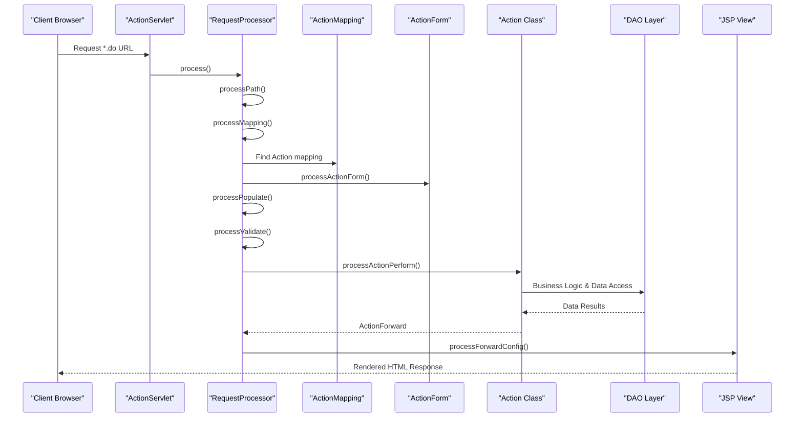
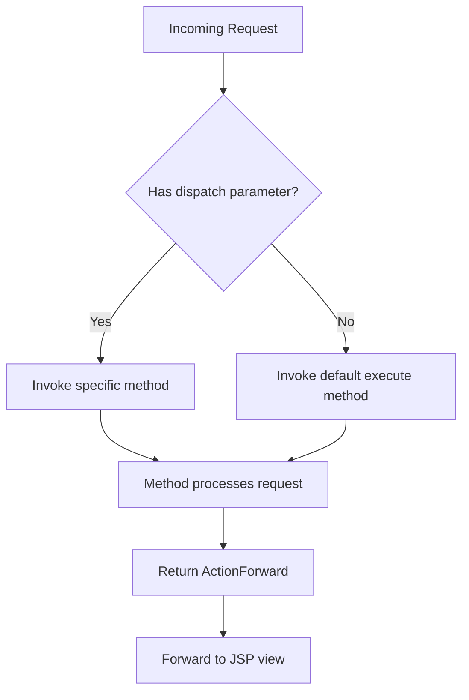
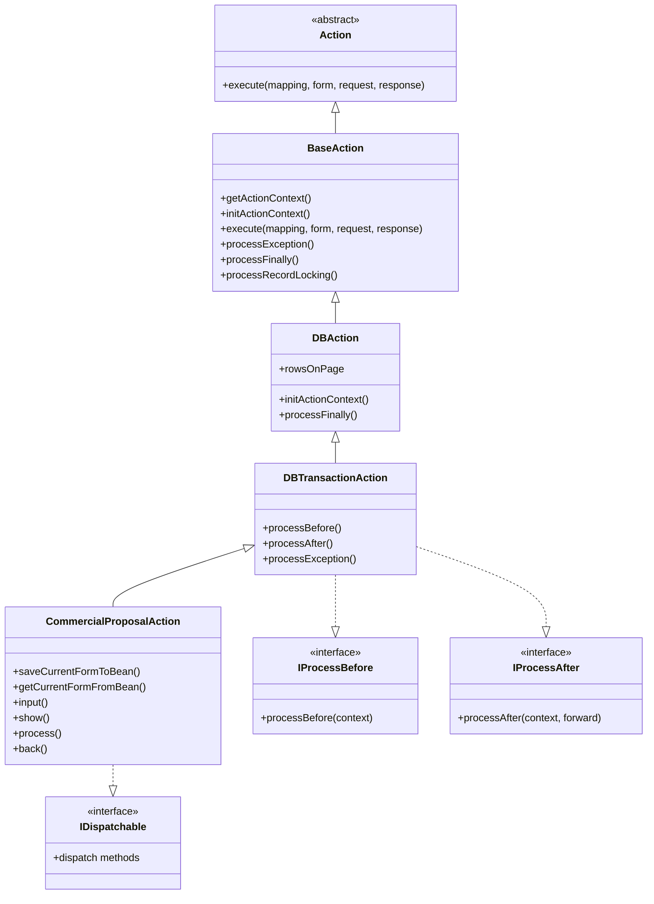
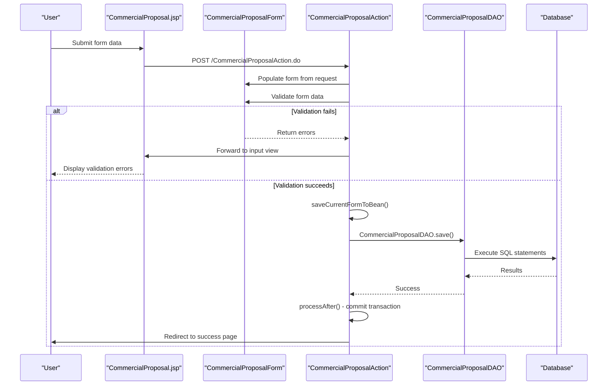
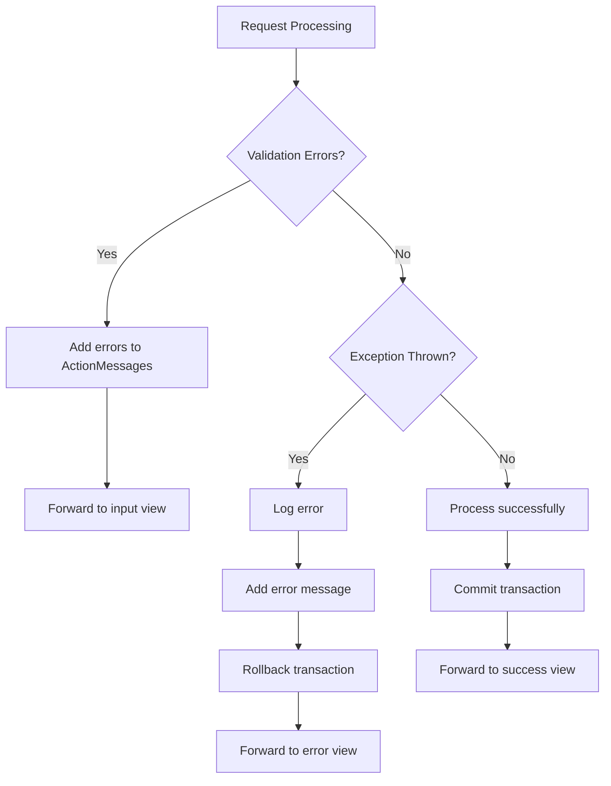
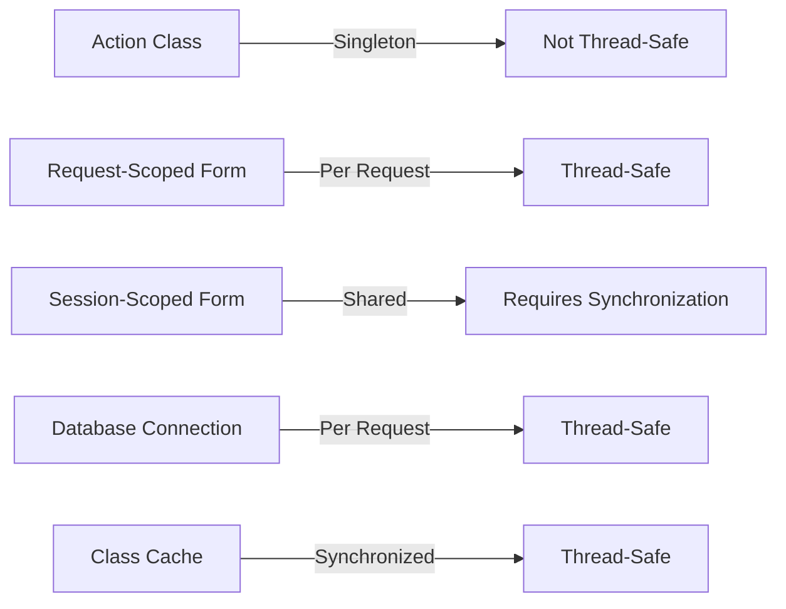

# Struts MVC Flow

<cite>
**Referenced Files in This Document**   
- [web.xml](file://src/main/webapp/WEB-INF/web.xml)
- [struts-config.xml](file://src/main/webapp/WEB-INF/classes/resources/struts/struts-config.xml)
- [BaseAction.java](file://src/main/java/net/sam/dcl/controller/actions/BaseAction.java)
- [DBTransactionAction.java](file://src/main/java/net/sam/dcl/controller/actions/DBTransactionAction.java)
- [CommercialProposalAction.java](file://src/main/java/net/sam/dcl/action/CommercialProposalAction.java)
- [CommercialProposalForm.java](file://src/main/java/net/sam/dcl/form/CommercialProposalForm.java)
- [AjaxRequestProcessor.java](file://src/main/java/net/sam/dcl/util/AjaxRequestProcessor.java)
- [ActionProcessorImpl.java](file://src/main/java/net/sam/dcl/controller/processor/ActionProcessorImpl.java)
</cite>

## Table of Contents
1. [Introduction](#introduction)
2. [Request Flow Overview](#request-flow-overview)
3. [ActionServlet Configuration](#actionservlet-configuration)
4. [Action Mapping and Routing](#action-mapping-and-routing)
5. [BaseAction and Inheritance Hierarchy](#baseaction-and-inheritance-hierarchy)
6. [ActionForm Processing](#actionform-processing)
7. [CommercialProposalAction Example](#commercialproposalaction-example)
8. [Database Transaction Management](#database-transaction-management)
9. [Error Handling and Validation](#error-handling-and-validation)
10. [Performance Considerations](#performance-considerations)
11. [Thread Safety Analysis](#thread-safety-analysis)
12. [Conclusion](#conclusion)

## Introduction

The dcl_v3 application implements the Model-View-Controller (MVC) pattern using Struts 1.x framework. This document details the request processing flow from incoming *.do URLs through the ActionServlet, mapping to specific Action classes, and the interaction between Action classes, ActionForm objects, and DAOs for data persistence. The system extends the base Struts functionality with custom components for permission checking, database transaction management, and form validation.

**Section sources**
- [web.xml](file://src/main/webapp/WEB-INF/web.xml#L71-L115)
- [struts-config.xml](file://src/main/webapp/WEB-INF/classes/resources/struts/struts-config.xml#L200-L400)

## Request Flow Overview

The request flow in the dcl_v3 application follows the standard Struts 1.x MVC pattern with several custom extensions. When a user requests a URL ending with *.do, the request is routed to the ActionServlet configured in web.xml. The ActionServlet uses the struts-config.xml file to determine which Action class should handle the request based on the URL path.



**Diagram sources**
- [web.xml](file://src/main/webapp/WEB-INF/web.xml#L71-L115)
- [AjaxRequestProcessor.java](file://src/main/java/net/sam/dcl/util/AjaxRequestProcessor.java#L158-L196)
- [BaseAction.java](file://src/main/java/net/sam/dcl/controller/actions/BaseAction.java#L71-L117)

## ActionServlet Configuration

The ActionServlet is configured in the web.xml file as the controller for all *.do URLs. The servlet is initialized with specific parameters that point to the struts-config.xml configuration file and set debugging levels. The ActionServlet serves as the front controller, receiving all incoming requests and delegating them to appropriate Action classes based on the configuration.

```xml
<servlet>
  <servlet-name>action</servlet-name>
  <servlet-class>org.apache.struts.action.ActionServlet</servlet-class>
  <init-param>
    <param-name>config</param-name>
    <param-value>/WEB-INF/classes/resources/struts/struts-config.xml</param-value>
  </init-param>
  <init-param>
    <param-name>debug</param-name>
    <param-value>2</param-value>
  </init-param>
  <init-param>
    <param-name>detail</param-name>
    <param-value>2</param-value>
  </init-param>
  <init-param>
    <param-name>convertNull</param-name>
    <param-value>true</param-value>
  </init-param>
  <load-on-startup>2</load-on-startup>
</servlet>

<servlet-mapping>
  <servlet-name>action</servlet-name>
  <url-pattern>*.do</url-pattern>
</servlet-mapping>
```

The ActionServlet uses a custom RequestProcessor (AjaxRequestProcessor) that extends the standard Struts RequestProcessor to handle AJAX requests and provide additional functionality for form processing and validation.

**Section sources**
- [web.xml](file://src/main/webapp/WEB-INF/web.xml#L71-L115)

## Action Mapping and Routing

Action mappings are defined in the struts-config.xml file, which maps URL paths to specific Action classes and associates them with corresponding ActionForm objects. Each action mapping specifies the path, the Action class type, the form bean name, the input view, and the scope of the form bean.

```xml
<action path="/CommercialProposalAction" 
        type="net.sam.dcl.action.CommercialProposalAction"
        input="/CommercialProposalAction.do?dispatch=show"
        name="CommercialProposal" 
        scope="session">
  <forward name="form" path=".CommercialProposal"/>
  <forward name="back" path="/CommercialProposalsAction.do?dispatch=restore"/>
  <forward name="newProduce" path="/CommercialProposalProduceAction.do?dispatch=insert"/>
  <forward name="editProduce" path="/CommercialProposalProduceAction.do?dispatch=edit"/>
  <forward name="ajaxProducesCommercialProposalGrid" path=".ProducesCommercialProposalGrid"/>
  <forward name="backFromAttach" path="/CommercialProposalAction.do?dispatch=retFromAttach"/>
</action>
```

The system uses a dispatch action pattern where a single Action class can handle multiple operations based on a dispatch parameter. This is implemented through the DispatchActionHelper class, which examines the request parameters to determine which method of the Action class should be invoked.



**Diagram sources**
- [struts-config.xml](file://src/main/webapp/WEB-INF/classes/resources/struts/struts-config.xml#L200-L400)
- [BaseAction.java](file://src/main/java/net/sam/dcl/controller/actions/BaseAction.java#L143-L188)

## BaseAction and Inheritance Hierarchy

The application implements a custom inheritance hierarchy for Action classes, with BaseAction serving as the foundation. The inheritance structure provides common functionality for permission checking, database transaction handling, and request processing.



**Diagram sources**
- [BaseAction.java](file://src/main/java/net/sam/dcl/controller/actions/BaseAction.java#L0-L406)
- [DBAction.java](file://src/main/java/net/sam/dcl/controller/actions/DBAction.java#L0-L36)
- [DBTransactionAction.java](file://src/main/java/net/sam/dcl/controller/actions/DBTransactionAction.java#L0-L47)

## ActionForm Processing

ActionForm objects in the dcl_v3 application are responsible for capturing and validating user input before processing in the Action classes. The forms extend BaseDispatchValidatorForm, which provides validation capabilities and integrates with the dispatch action pattern.

The form processing flow includes:
1. Form population from request parameters
2. Form validation using the validate() method
3. Error handling and forwarding back to input view if validation fails
4. Data transfer to business objects in the Action class

```java
public class CommercialProposalForm extends BaseDispatchValidatorForm {
    // Form fields
    private String cpr_id;
    private String cpr_number;
    private String cpr_date;
    private Contractor contractor = new Contractor();
    private ContactPerson contactPerson = new ContactPerson();
    private HolderImplUsingList gridProduces = new HolderImplUsingList();
    
    // Getters and setters
    public String getCpr_id() { return cpr_id; }
    public void setCpr_id(String cpr_id) { this.cpr_id = cpr_id; }
    
    // Reset method
    public void reset(ActionMapping mapping, HttpServletRequest request) {
        // Reset form fields
        super.reset(mapping, request);
    }
}
```

The AjaxRequestProcessor handles form validation, calling the form's validate() method and returning to the input view if validation errors are detected.

**Section sources**
- [CommercialProposalForm.java](file://src/main/java/net/sam/dcl/form/CommercialProposalForm.java#L0-L199)
- [AjaxRequestProcessor.java](file://src/main/java/net/sam/dcl/util/AjaxRequestProcessor.java#L35-L79)

## CommercialProposalAction Example

The CommercialProposalAction class provides a concrete example of how the Struts MVC pattern is implemented in the dcl_v3 application. This Action class handles the creation, editing, and processing of commercial proposals in the system.



The CommercialProposalAction extends DBTransactionAction, which ensures that database operations are performed within a transaction. The action class implements the IDispatchable interface, allowing it to handle multiple operations through dispatch methods.

Key methods in CommercialProposalAction include:
- input(): Displays the input form
- show(): Shows the commercial proposal details
- process(): Processes the form submission and saves data
- back(): Returns to the previous view
- deferredAttach(): Handles file attachments

**Diagram sources**
- [CommercialProposalAction.java](file://src/main/java/net/sam/dcl/action/CommercialProposalAction.java#L0-L199)
- [CommercialProposalForm.java](file://src/main/java/net/sam/dcl/form/CommercialProposalForm.java#L0-L199)

## Database Transaction Management

The dcl_v3 application implements database transaction management through the DBTransactionAction class, which extends DBAction and implements the IProcessBefore and IProcessAfter interfaces. This ensures that database operations are performed within a transaction context.

```java
public class DBTransactionAction extends DBAction implements IProcessBefore, IProcessAfter {
    public ActionForward processBefore(IActionContext context) throws Exception {
        context.getConnection().beginTransaction();
        return null;
    }

    public ActionForward processAfter(IActionContext context, ActionForward forward) throws Exception {
        if (context.getConnection().isTransactionStarted())
            context.getConnection().commit();
        return forward;
    }

    public ActionForward processException(IActionContext context, ActionForward forward, Exception e) {
        forward = super.processException(context, forward, e);
        if (context.getConnection().isTransactionStarted()) {
            try {
                context.getConnection().rollback();
            } catch (VDbException e1) {
                log.error(e.getMessage(), e);
                StrutsUtil.addError(context, "common.msg", e.getMessage(), e);
            }
        }
        return forward;
    }
}
```

The transaction management follows the pattern:
1. Before processing the action, begin a transaction
2. Execute the business logic and database operations
3. If successful, commit the transaction
4. If an exception occurs, rollback the transaction
5. Always close the database connection in processFinally()

This ensures data consistency and prevents partial updates in case of errors.

**Section sources**
- [DBTransactionAction.java](file://src/main/java/net/sam/dcl/controller/actions/DBTransactionAction.java#L0-L47)
- [DBAction.java](file://src/main/java/net/sam/dcl/controller/actions/DBAction.java#L0-L36)

## Error Handling and Validation

The dcl_v3 application implements comprehensive error handling and validation through multiple layers:

1. **Form Validation**: ActionForm classes implement validation logic in their validate() method, which is automatically called by the RequestProcessor.

2. **Exception Handling**: The BaseAction class implements a processException() method that handles exceptions thrown during request processing.

3. **Transaction Rollback**: The DBTransactionAction class ensures that database transactions are rolled back when exceptions occur.

4. **Error Display**: Validation errors and system errors are displayed to users through the Struts error mechanism.



The AjaxRequestProcessor handles validation by calling the form's validate() method and returning false if validation fails, which causes the request processing to stop and forward back to the input form.

**Section sources**
- [BaseAction.java](file://src/main/java/net/sam/dcl/controller/actions/BaseAction.java#L186-L236)
- [AjaxRequestProcessor.java](file://src/main/java/net/sam/dcl/util/AjaxRequestProcessor.java#L35-L79)

## Performance Considerations

The dcl_v3 application includes several performance optimization strategies:

1. **Database Connection Management**: The VDbConnectionManager provides a connection pool to minimize the overhead of creating database connections.

2. **Session-Scoped Forms**: Forms are often scoped to session to avoid recreating them for each request, reducing object creation overhead.

3. **Form Auto-Saving**: The IFormAutoSave interface allows forms to be automatically saved to session, preserving state across requests.

4. **Caching**: The ClassCashe mechanism in DebugRequestProcessor caches loaded classes to avoid repeated class loading.

5. **Batch Processing**: The DAO layer uses prepared statements and batch operations where appropriate to minimize database round trips.

To minimize database calls during request processing:
- Cache frequently accessed data in application scope
- Use lazy loading for related entities
- Implement pagination for large result sets
- Batch multiple database operations in a single transaction
- Use connection pooling to reduce connection overhead

**Section sources**
- [DBAction.java](file://src/main/java/net/sam/dcl/controller/actions/DBAction.java#L0-L36)
- [DebugRequestProcessor.java](file://src/main/java/net/sam/dcl/util/DebugRequestProcessor.java#L33-L70)

## Thread Safety Analysis

The Struts 1.x framework and the dcl_v3 application implementation have specific thread safety characteristics:

1. **Action Classes**: Action classes are instantiated once per application and shared across all requests, making them not thread-safe. However, they don't maintain request-specific state, which mitigates this issue.

2. **ActionForm Classes**: ActionForms are created per request (or per session if session-scoped), making them thread-safe for request-scoped forms. Session-scoped forms require careful handling to avoid concurrency issues.

3. **Thread Safety Measures**:
   - Synchronization is used in the AjaxRequestProcessor when processing session-scoped forms
   - Database connections are managed per request through the VDbConnectionManager
   - The ClassCashe uses synchronization to protect the cache



Best practices for thread safety in this implementation:
- Avoid storing request-specific data in Action class instance variables
- Use request or session attributes for state management
- Synchronize access to shared resources
- Ensure database connections are properly closed in finally blocks

**Section sources**
- [AjaxRequestProcessor.java](file://src/main/java/net/sam/dcl/util/AjaxRequestProcessor.java#L158-L196)
- [BaseAction.java](file://src/main/java/net/sam/dcl/controller/actions/BaseAction.java#L71-L117)

## Conclusion

The dcl_v3 application implements a robust Struts 1.x MVC architecture with several custom extensions that enhance the standard framework functionality. The request flow from incoming *.do URLs to the ActionServlet, routing through ActionMappings to specific Action classes, and the interaction with ActionForm objects and DAOs follows the classic MVC pattern while incorporating application-specific requirements for permission checking, transaction management, and form validation.

Key architectural features include:
- A hierarchical Action class structure with BaseAction, DBAction, and DBTransactionAction providing common functionality
- Dispatch action pattern for handling multiple operations in a single Action class
- Comprehensive error handling and transaction management
- Custom RequestProcessor for handling AJAX requests and form validation
- Session-scoped forms for maintaining state across requests

The implementation demonstrates how Struts 1.x can be extended to meet complex business requirements while maintaining the separation of concerns that is central to the MVC pattern. The system effectively handles form validation, database transactions, and error recovery, providing a solid foundation for the business functionality of the dcl_v3 application.