# Build & Deployment

<cite>
**Referenced Files in This Document**
- [pom.xml](file://pom.xml)
- [run-legacy.bat](file://run-legacy.bat)
- [stop-legacy.bat](file://stop-legacy.bat)
- [src/main/webapp/WEB-INF/web.xml](file://src/main/webapp/WEB-INF/web.xml)
- [META-INF/context.xml](file://META-INF/context.xml)
- [src/main/resources/application.properties](file://src/main/resources/application.properties)
- [src/main/resources/log4j.properties](file://src/main/resources/log4j.properties)
- [src/main/resources/logback.xml](file://src/main/resources/logback.xml)
- [package.json](file://package.json)
- [MIGRATION_PLAN.md](file://MIGRATION_PLAN.md)
- [MIGRATION_STEPS.md](file://MIGRATION_STEPS.md)
</cite>

## Table of Contents
1. [Introduction](#introduction)
2. [Maven Build Configuration](#maven-build-configuration)
3. [WAR File Generation Process](#war-file-generation-process)
4. [Legacy Execution Scripts](#legacy-execution-scripts)
5. [Servlet Container Deployment](#servlet-container-deployment)
6. [Configuration Management](#configuration-management)
7. [Build Process Walkthrough](#build-process-walkthrough)
8. [Deployment Verification](#deployment-verification)
9. [Common Issues & Troubleshooting](#common-issues--troubleshooting)
10. [Best Practices](#best-practices)

## Introduction

The dcl_v3 project employs a sophisticated Maven-based build system designed to handle legacy Java web application modernization while maintaining backward compatibility. The build process focuses on WAR file generation for servlet container deployment, with specialized profiles for development, testing, and legacy execution environments.

The build system is structured around a multi-stage approach that preserves existing JSP and servlet functionality while preparing for future modernization efforts. This documentation covers the complete build and deployment lifecycle, from initial setup through production deployment.

## Maven Build Configuration

### Project Structure and Dependencies

The Maven configuration in [`pom.xml`](file://pom.xml#L1-L283) establishes a foundation for legacy web application modernization with the following key characteristics:

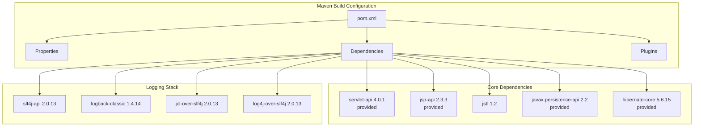

**Diagram sources**
- [pom.xml](file://pom.xml#L20-L75)

### Dependency Management Strategy

The build configuration implements a strategic dependency management approach:

| Dependency Category | Version | Scope | Purpose |
|-------------------|---------|-------|---------|
| Servlet API | 4.0.1 | provided | Container-provided servlet functionality |
| JSP API | 2.3.3 | provided | Container-provided JSP support |
| JSTL | 1.2 | compile | Tag library support for JSP pages |
| JPA API | 2.2 | provided | Future JPA integration point |
| Hibernate Core | 5.6.15 | provided | ORM framework (container-provided) |
| SLF4J API | 2.0.13 | compile | Unified logging interface |
| Logback Classic | 1.4.14 | compile | Logging implementation |
| JCL Bridge | 2.0.13 | compile | Commons-logging compatibility |
| Log4J Bridge | 2.0.13 | compile | Log4J 1.x compatibility |

**Section sources**
- [pom.xml](file://pom.xml#L20-L75)

### Build Plugins Configuration

The Maven build incorporates several specialized plugins for different aspects of the deployment pipeline:

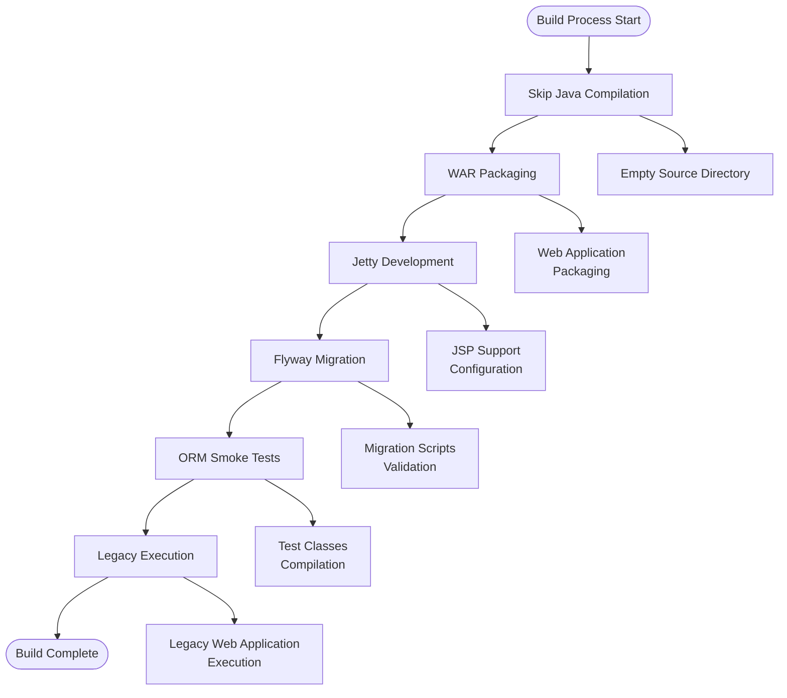

**Diagram sources**
- [pom.xml](file://pom.xml#L76-L282)

**Section sources**
- [pom.xml](file://pom.xml#L76-L282)

## WAR File Generation Process

### Packaging Strategy

The WAR generation process follows a deliberate approach to preserve existing functionality while enabling future modernization:

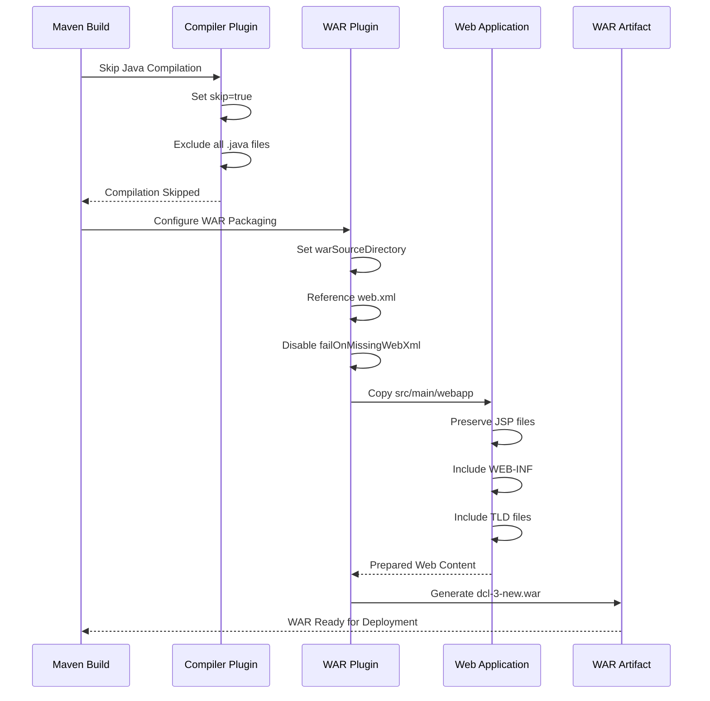

**Diagram sources**
- [pom.xml](file://pom.xml#L85-L105)

### WAR Structure and Contents

The generated WAR file maintains the traditional Java EE structure with specific adaptations for legacy compatibility:

| Directory | Purpose | Contents |
|-----------|---------|----------|
| `/WEB-INF/` | Configuration and compiled classes | `web.xml`, `classes/`, `lib/` |
| `/WEB-INF/classes/` | Application resources | Properties files, configuration |
| `/WEB-INF/lib/` | Dependencies | JAR files (minimal, mostly legacy) |
| `/WEB-INF/tld/` | Tag Library Definitions | Custom tag libraries |
| `/` | Static resources | JSP pages, HTML, CSS, JavaScript |
| `/includes/` | Shared components | Common JavaScript, CSS, JSP fragments |
| `/jsp/` | Application pages | Business logic JSP pages |
| `/layout/` | Layout templates | Master page templates |

**Section sources**
- [pom.xml](file://pom.xml#L85-L105)

## Legacy Execution Scripts

### Run Script Architecture

The legacy execution system provides flexible startup options through batch scripts designed for different deployment scenarios:

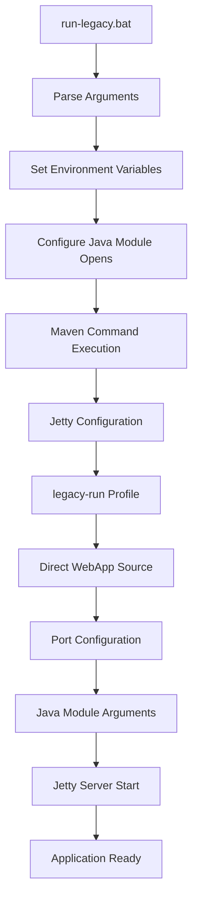

**Diagram sources**
- [run-legacy.bat](file://run-legacy.bat#L1-L35)

### Script Configuration Parameters

The [`run-legacy.bat`](file://run-legacy.bat#L1-L35) script provides comprehensive configuration options:

| Parameter | Default Value | Description | Usage Example |
|-----------|---------------|-------------|---------------|
| `POM_PATH` | `pom.xml` | Maven project file location | `run-legacy.bat` |
| `MVN_PROFILE` | `legacy-run` | Maven profile selection | `run-legacy.bat` |
| `DEFAULT_PORT` | `8082` | HTTP server port | `run-legacy.bat 8085` |
| `JETTY_PORT` | Variable | Dynamic port assignment | `run-legacy.bat 8085` |

### Java Module System Compatibility

The script addresses Java 17+ module system restrictions required for legacy Hibernate and CGLIB compatibility:

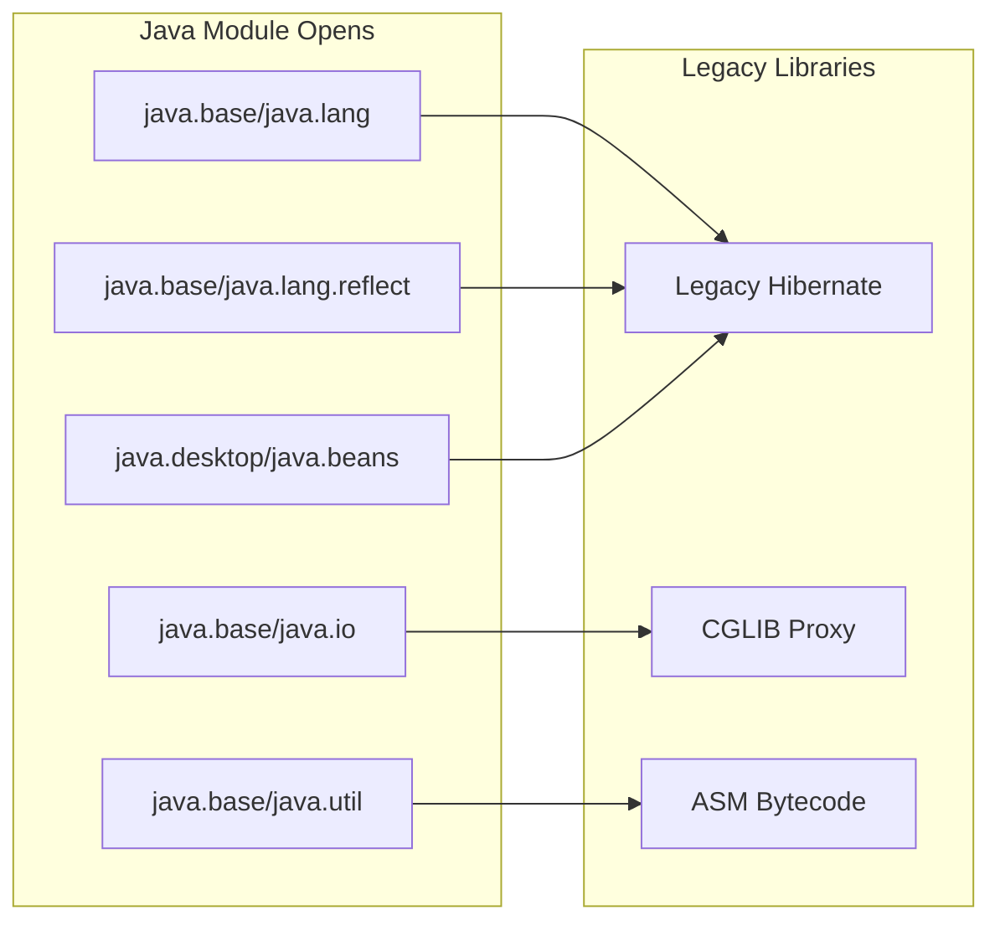

**Diagram sources**
- [run-legacy.bat](file://run-legacy.bat#L15-L20)

**Section sources**
- [run-legacy.bat](file://run-legacy.bat#L1-L35)

### Stop Script Functionality

The [`stop-legacy.bat`](file://stop-legacy.bat#L1-L25) script provides controlled shutdown capabilities:

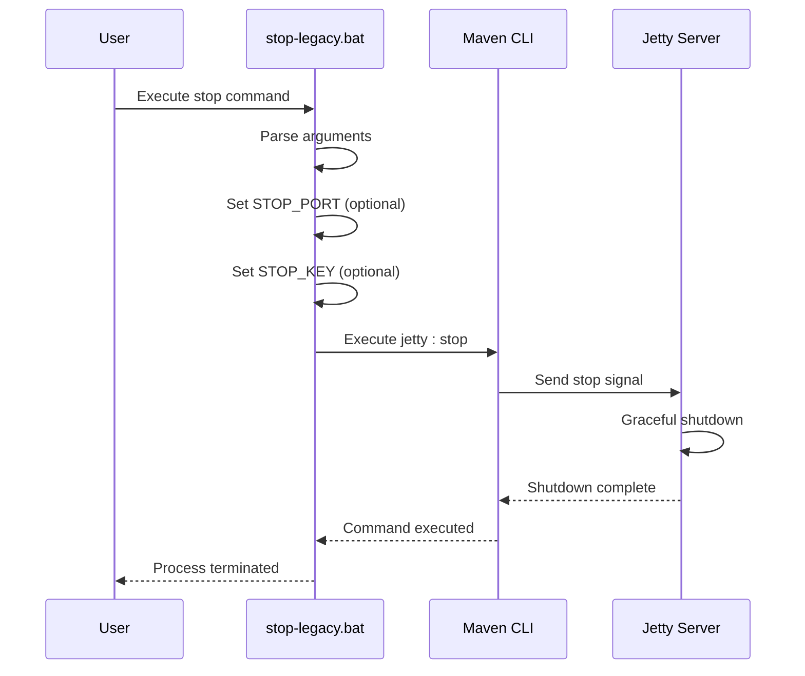

**Diagram sources**
- [stop-legacy.bat](file://stop-legacy.bat#L1-L25)

**Section sources**
- [stop-legacy.bat](file://stop-legacy.bat#L1-L25)

## Servlet Container Deployment

### Web Application Configuration

The [`web.xml`](file://src/main/webapp/WEB-INF/web.xml#L1-L176) defines the servlet container configuration with comprehensive filter and servlet mappings:

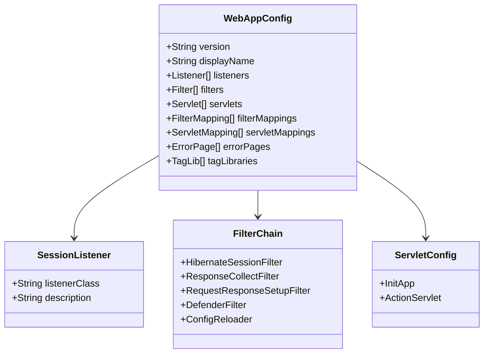

**Diagram sources**
- [src/main/webapp/WEB-INF/web.xml](file://src/main/webapp/WEB-INF/web.xml#L1-L176)

### Filter Configuration

The application implements a comprehensive filter chain for request processing:

| Filter Name | Purpose | URL Pattern |
|-------------|---------|-------------|
| `HibernateSessionFilter` | Session management | `/*` |
| `ResponseCollectFilter` | Response collection | `/*` |
| `RequestResponseSetupFilter` | Encoding setup | `/*` |
| `DefenderFilter` | Security and authentication | `/*` |
| `ConfigReloader` | Configuration reloading | `/*` |

### Servlet Mappings

The servlet configuration supports both legacy and modern patterns:

| Servlet Name | Class | URL Pattern | Load Order |
|--------------|-------|-------------|------------|
| `InitApp` | `net.sam.dcl.servlets.InitApp` | N/A | 1 |
| `action` | `org.apache.struts.action.ActionServlet` | `*.do` | 2 |

**Section sources**
- [src/main/webapp/WEB-INF/web.xml](file://src/main/webapp/WEB-INF/web.xml#L1-L176)

### JNDI DataSource Configuration

The [`context.xml`](file://META-INF/context.xml#L1-L80) provides JNDI datasource configuration templates for different database systems:

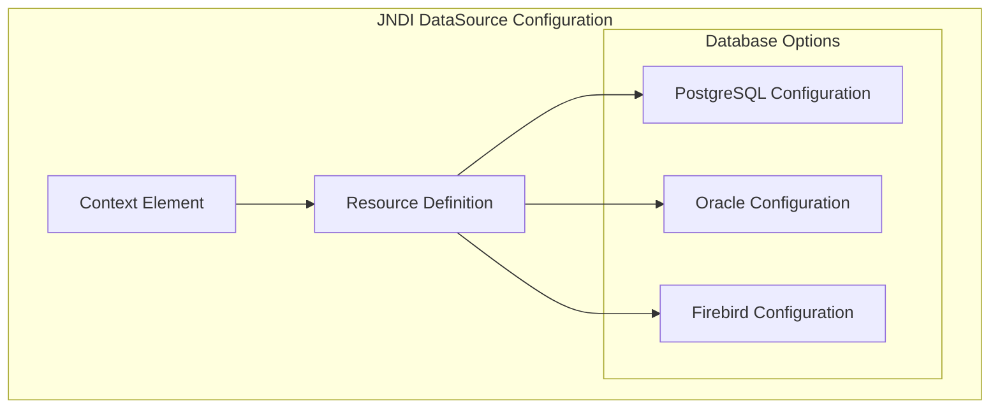

**Diagram sources**
- [META-INF/context.xml](file://META-INF/context.xml#L1-L80)

**Section sources**
- [META-INF/context.xml](file://META-INF/context.xml#L1-L80)

## Configuration Management

### Application Properties

The [`application.properties`](file://src/main/resources/application.properties#L1-L60) serves as the primary configuration hub for database and Hibernate settings:

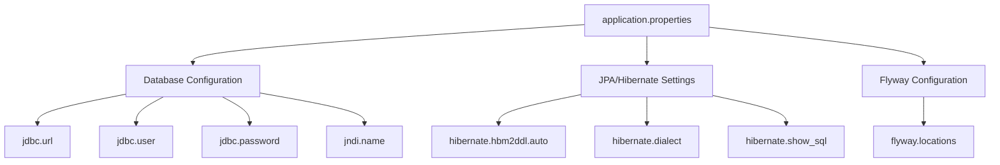

**Diagram sources**
- [src/main/resources/application.properties](file://src/main/resources/application.properties#L1-L60)

### Logging Configuration

The logging system combines Log4J 1.x compatibility with modern SLF4J/Logback infrastructure:

| Logger | Level | Appender | Purpose |
|--------|-------|----------|---------|
| `rootLogger` | INFO | STDOUT | General application logging |
| `net.sam.dcl` | DEBUG | dcl | Application-specific logging |
| `org.hibernate` | WARN | hibernate | ORM framework logging |
| `org.apache` | INFO | apache | Apache component logging |

**Section sources**
- [src/main/resources/application.properties](file://src/main/resources/application.properties#L1-L60)
- [src/main/resources/log4j.properties](file://src/main/resources/log4j.properties#L1-L122)
- [src/main/resources/logback.xml](file://src/main/resources/logback.xml#L1-L25)

## Build Process Walkthrough

### Step-by-Step Build Execution

The complete build process involves multiple stages with specific Maven profiles and configurations:

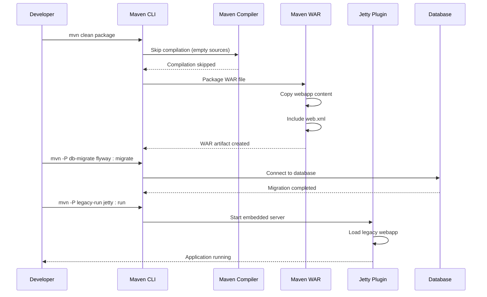

**Diagram sources**
- [pom.xml](file://pom.xml#L140-L282)

### Practical Build Commands

#### Basic WAR Generation
```bash
# Clean and package the application
./mvnw -f pom.xml clean package

# Generate WAR with specific output directory
./mvnw -f pom.xml -Dmaven.test.skip=true package
```

#### Database Migration
```bash
# Execute database migrations
./mvnw -f pom.xml -P db-migrate \
  -Djdbc.url=jdbc:postgresql://localhost:5432/dcl \
  -Djdbc.user=dcl \
  -Djdbc.password=secret \
  flyway:migrate

# Check migration status
./mvnw -f pom.xml -P db-migrate flyway:info
```

#### Legacy Application Execution
```bash
# Start legacy application on default port (8082)
./run-legacy.bat

# Start legacy application on custom port
./run-legacy.bat 8085

# Stop legacy application
./stop-legacy.bat
```

**Section sources**
- [pom.xml](file://pom.xml#L140-L282)
- [run-legacy.bat](file://run-legacy.bat#L1-L35)
- [stop-legacy.bat](file://stop-legacy.bat#L1-L25)

## Deployment Verification

### Startup Validation Process

Successful application startup requires verification of multiple components:

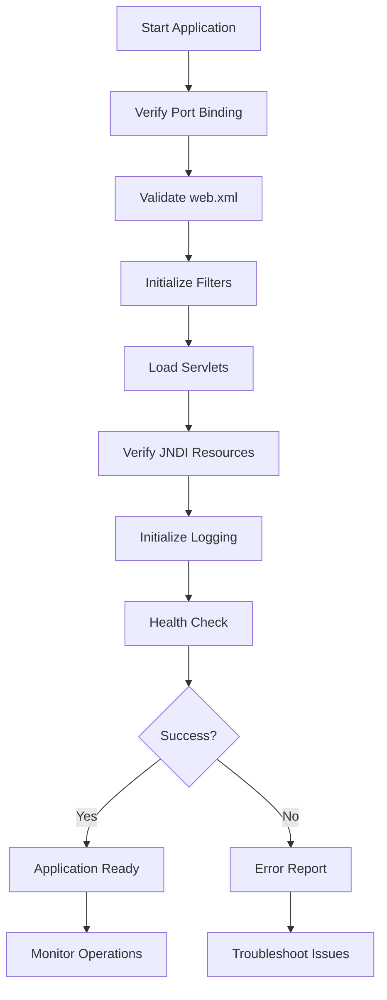

### Test Environment Setup

For testing deployments, the following environment configuration is recommended:

| Component | Configuration | Purpose |
|-----------|---------------|---------|
| Java Version | Java 17+ | Modern compatibility |
| Memory | 512MB heap | Minimum requirement |
| Ports | 8082 (HTTP), 8090 (shutdown) | Default ports |
| Database | PostgreSQL/Oracle/Firebird | Production database |
| JNDI | Container-managed | Connection pooling |

### Verification Commands

#### Application Health Check
```bash
# Check application availability
curl -f http://localhost:8082/trusted/Login.do?dispatch=input || echo "Application not responding"

# Verify WAR deployment
jar tf target/dcl-3-new.war | grep -E "(WEB-INF|index\.jsp)" | head -10
```

#### Database Connection Test
```bash
# Test database connectivity
./mvnw -f pom.xml -P db-migrate \
  -Djdbc.url=jdbc:postgresql://localhost:5432/dcl \
  -Djdbc.user=dcl \
  -Djdbc.password=secret \
  flyway:validate
```

## Common Issues & Troubleshooting

### Build-Time Issues

#### Java Compilation Conflicts
**Problem**: Legacy Java source files conflicting with Maven compilation
**Solution**: The build skips Java compilation entirely by configuring an empty source directory and setting the compiler plugin to skip.

#### Dependency Conflicts
**Problem**: Legacy JAR conflicts with Maven dependencies
**Solution**: Use explicit dependency management and exclusions in the POM file.

#### Module System Errors
**Problem**: Java 17+ module system blocking legacy libraries
**Solution**: The run scripts automatically configure necessary module opens for Hibernate and CGLIB.

### Runtime Issues

#### JSP Compilation Errors
**Problem**: JSP pages failing to compile in servlet container
**Solution**: Ensure all required tag libraries are available in the container or included in the WAR.

#### Database Connection Problems
**Problem**: JNDI datasource configuration issues
**Solution**: Verify context.xml placement and database driver availability.

#### Filter Chain Failures
**Problem**: Request processing failures in filter chain
**Solution**: Check filter initialization order and configuration parameters.

### Deployment Troubleshooting

#### Port Conflicts
**Problem**: Port 8082 already in use
**Solution**: Modify the port in run-legacy.bat or use the command-line argument.

#### Memory Issues
**Problem**: OutOfMemoryError during startup
**Solution**: Increase heap size using MAVEN_OPTS environment variable.

#### Classpath Problems
**Problem**: ClassNotFoundException or NoClassDefFoundError
**Solution**: Verify all required JAR files are included in the WAR or available in the container.

## Best Practices

### Build Reproducibility

To ensure consistent builds across different environments:

1. **Use Maven Wrapper**: Always use `./mvnw` instead of system-installed Maven
2. **Explicit Versions**: Pin all dependency versions in the POM file
3. **Environment Variables**: Use consistent environment variable naming
4. **Configuration Files**: Keep all configuration in version control

### Development Workflow

1. **Incremental Development**: Make small, atomic changes with proper commit messages
2. **Visual Testing**: Use Playwright for visual regression testing
3. **CI Integration**: Implement continuous integration with automated testing
4. **Documentation**: Maintain up-to-date documentation for all processes

### Security Considerations

1. **Credential Management**: Never hardcode database credentials in configuration files
2. **JNDI Configuration**: Use container-managed datasources for production
3. **Filter Security**: Regularly review filter configurations for security implications
4. **Logging**: Implement proper log rotation and sensitive data filtering

### Performance Optimization

1. **JVM Tuning**: Optimize JVM parameters for your specific workload
2. **Connection Pooling**: Configure appropriate database connection pool settings
3. **Caching**: Implement appropriate caching strategies for frequently accessed data
4. **Monitoring**: Set up monitoring for application performance metrics

### Maintenance Procedures

1. **Regular Updates**: Keep dependencies updated within supported versions
2. **Backup Strategy**: Implement proper backup procedures for database and configuration
3. **Testing**: Maintain comprehensive test suites for all critical functionality
4. **Documentation**: Keep operational documentation current with actual procedures