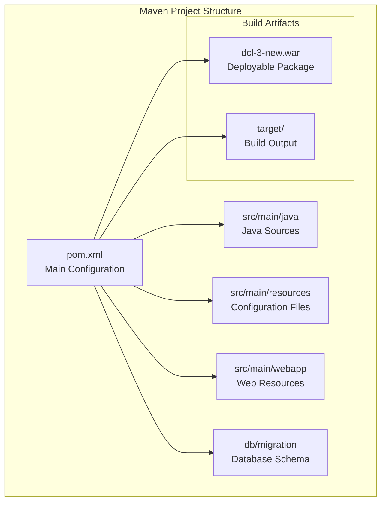
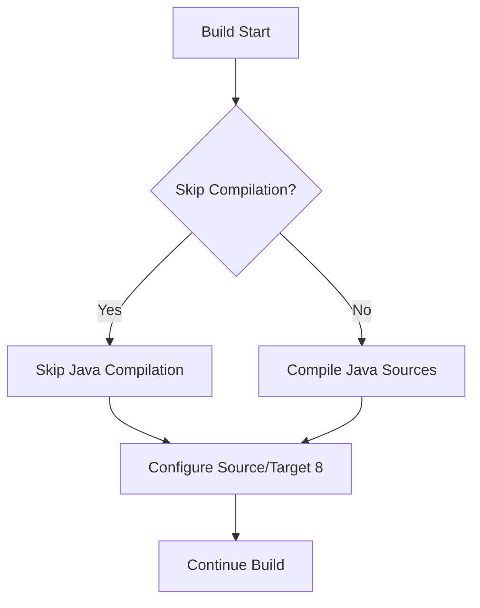
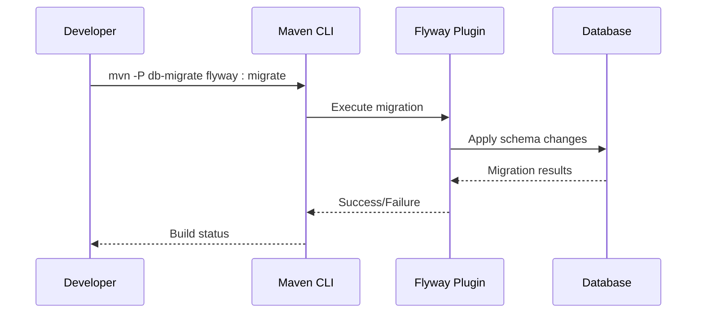
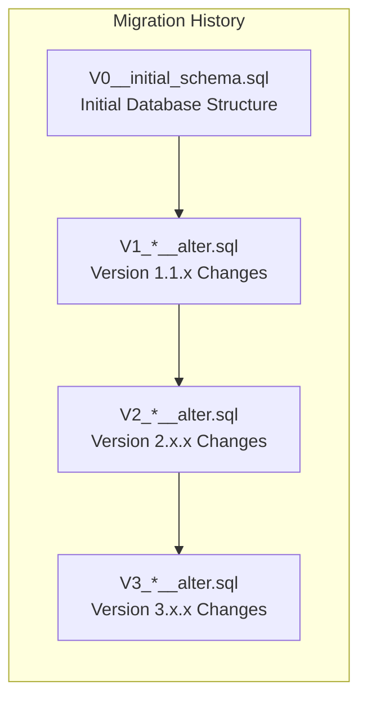
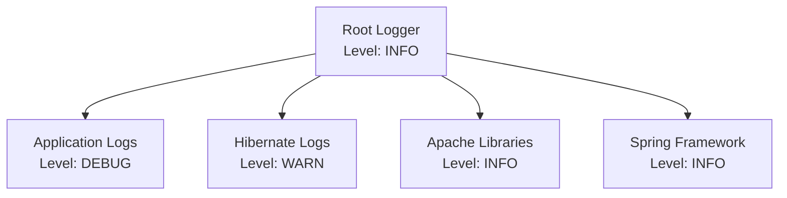

# Maven Build Configuration

<cite>
**Referenced Files in This Document**
- [pom.xml](file://pom.xml)
- [src/main/webapp/WEB-INF/web.xml](file://src/main/webapp/WEB-INF/web.xml)
- [src/main/resources/logback.xml](file://src/main/resources/logback.xml)
- [src/main/resources/application.properties](file://src/main/resources/application.properties)
- [src/main/resources/hibernate.cfg.xml](file://src/main/resources/hibernate.cfg.xml)
- [db/migration/V0__initial_schema.sql](file://db/migration/V0__initial_schema.sql)
- [MIGRATION_STEPS.md](file://MIGRATION_STEPS.md)
</cite>

## Table of Contents
1. [Introduction](#introduction)
2. [Project Structure Overview](#project-structure-overview)
3. [Core Dependencies](#core-dependencies)
4. [Build Plugins Configuration](#build-plugins-configuration)
5. [Packaging and Compatibility](#packaging-and-compatibility)
6. [Profiles and Environment Management](#profiles-and-environment-management)
7. [Database Migration Setup](#database-migration-setup)
8. [Logging Configuration](#logging-configuration)
9. [Common Issues and Solutions](#common-issues-and-solutions)
10. [Best Practices](#best-practices)
11. [Adding New Dependencies](#adding-new-dependencies)
12. [Plugin Version Management](#plugin-version-management)

## Introduction

The dcl_v3 application employs a sophisticated Maven build configuration designed for modernizing a legacy web application while maintaining backward compatibility. The build system serves as a bridge between traditional Java EE technologies and contemporary development practices, utilizing Maven's modular architecture to manage dependencies, build processes, and deployment configurations.

This Maven configuration demonstrates advanced techniques for handling legacy applications, including selective compilation, embedded container testing, and database migration automation. The build process is structured around multiple stages, each serving specific purposes in the modernization journey.

## Project Structure Overview

The Maven project follows a standard Java web application structure with specialized configurations for legacy compatibility:



**Section sources**
- [pom.xml](file://pom.xml#L1-L283)

## Core Dependencies

The application's dependency management focuses on providing essential libraries while avoiding conflicts with legacy components. The configuration emphasizes compatibility and modularity:

### Servlet API Dependencies

The application relies on servlet container-provided APIs, marked with `provided` scope to avoid bundling conflicts:

| Dependency | Version | Scope | Purpose |
|------------|---------|-------|---------|
| `javax.servlet-api` | 4.0.1 | provided | Core servlet functionality |
| `javax.servlet.jsp-api` | 2.3.3 | provided | JSP support |
| `javax.servlet:jstl` | 1.2 | compile | JSTL tag libraries |

### ORM and Persistence Layer

The Hibernate ORM framework is configured with careful version alignment:

| Dependency | Version | Scope | Purpose |
|------------|---------|-------|---------|
| `javax.persistence:javax.persistence-api` | 2.2 | provided | JPA specification |
| `org.hibernate:hibernate-core` | 5.6.15.Final | provided | ORM implementation |

### Logging Infrastructure

A comprehensive logging stack using SLF4J as the facade with Logback as the implementation:

| Dependency | Version | Purpose |
|------------|---------|---------|
| `org.slf4j:slf4j-api` | 2.0.13 | Logging facade |
| `ch.qos.logback:logback-classic` | 1.4.14 | Logging implementation |
| `org.slf4j:jcl-over-slf4j` | 2.0.13 | Commons-logging bridge |
| `org.slf4j:log4j-over-slf4j` | 2.0.13 | Log4j 1.x bridge |

**Section sources**
- [pom.xml](file://pom.xml#L25-L71)

## Build Plugins Configuration

The Maven configuration includes several specialized plugins for different build phases and testing scenarios:

### Maven Compiler Plugin

The compiler plugin is configured with safety measures to prevent accidental compilation during the initial migration phase:



**Diagram sources**
- [pom.xml](file://pom.xml#L73-L85)

### Maven War Plugin

The WAR plugin packages the existing web application structure without modification:

| Configuration | Value | Purpose |
|---------------|-------|---------|
| `warSourceDirectory` | `${project.basedir}/src/main/webapp` | Source webapp location |
| `webXml` | `${project.basedir}/src/main/webapp/WEB-INF/web.xml` | Main deployment descriptor |
| `failOnMissingWebXml` | `false` | Allow missing web.xml |

### Jetty Maven Plugin

Embedded Jetty serves multiple purposes in the build pipeline:

#### Stage 3: JSP Baseline Testing
- Port binding: 8082 (avoiding conflicts)
- Test scope dependencies: H2 database, JTA transactions
- JNDI support enabled

#### Legacy Runtime Environment
- Java 17+ module system compatibility
- Legacy Hibernate/CGLIB module openings
- Direct webapp execution without modifications

**Section sources**
- [pom.xml](file://pom.xml#L86-L133)
- [pom.xml](file://pom.xml#L247-L282)

## Packaging and Compatibility

### WAR Packaging Type

The application uses WAR packaging to maintain compatibility with traditional Java EE deployment patterns while enabling modern build practices.

### Java Compatibility Settings

```xml
<properties>
  <project.build.sourceEncoding>UTF-8</project.build.sourceEncoding>
  <maven.compiler.source>1.8</maven.compiler.source>
  <maven.compiler.target>1.8</maven.compiler.target>
</properties>
```

These settings ensure:
- UTF-8 encoding for all source files
- Java 8 bytecode compatibility
- Future flexibility for Java 11+ migration

### Resource Filtering

The build configuration does not explicitly show resource filtering, but the properties demonstrate the potential for dynamic configuration based on environment variables and build profiles.

**Section sources**
- [pom.xml](file://pom.xml#L15-L22)

## Profiles and Environment Management

The Maven configuration includes several specialized profiles for different build scenarios:

### Database Migration Profile (`db-migrate`)

Enables Flyway database migration capabilities:



**Diagram sources**
- [pom.xml](file://pom.xml#L144-L168)

### ORM Smoke Test Profile (`orm-smoke`)

Provides isolated testing of ORM functionality:

- Test-scoped JPA API and Hibernate
- In-memory H2 database for schema validation
- Dedicated compilation phase for test classes

### Legacy Runtime Profile (`legacy-run`)

Supports running the original legacy application with modern JVM compatibility:

- Java 17+ module system workarounds
- Legacy JSP compilation support
- Direct webapp execution

**Section sources**
- [pom.xml](file://pom.xml#L140-L282)

## Database Migration Setup

The application integrates Flyway for database schema management using a comprehensive migration system:

### Migration Structure

The database migrations follow Flyway's naming convention with versioned scripts:



**Diagram sources**
- [db/migration/V0__initial_schema.sql](file://db/migration/V0__initial_schema.sql#L1-L50)

### Migration Configuration

| Setting | Value | Purpose |
|---------|-------|---------|
| `locations` | `filesystem:${project.basedir}/db/migration` | Migration script location |
| `validateOnMigrate` | `true` | Validate before migration |
| `baselineOnMigrate` | `true` | Create baseline if missing |

### Supported Databases

The configuration supports multiple database systems through property-based configuration:

- PostgreSQL (via JDBC URL)
- Oracle (via JDBC URL)
- Firebird (default, production-ready)

**Section sources**
- [pom.xml](file://pom.xml#L144-L168)
- [application.properties](file://src/main/resources/application.properties#L1-L60)

## Logging Configuration

The application implements a robust logging infrastructure using SLF4J with Logback:

### Logback Configuration

The logging setup provides:

- **Console Appender**: Structured output with timestamps and thread information
- **Log Level Control**: Separate configuration for third-party libraries vs. application code
- **JUL Bridge**: Automatic bridging from Java Util Logging

### Configuration Features

| Feature | Implementation | Purpose |
|---------|----------------|---------|
| **Hot Reload** | `scan="true"` | Dynamic configuration updates |
| **Scan Interval** | `scanPeriod="30 seconds"` | Configuration refresh frequency |
| **Charset Support** | UTF-8 encoding | International character support |

### Logger Categories



**Diagram sources**
- [logback.xml](file://src/main/resources/logback.xml#L1-L25)

**Section sources**
- [logback.xml](file://src/main/resources/logback.xml#L1-L25)
- [application.properties](file://src/main/resources/application.properties#L1-L60)

## Common Issues and Solutions

### Dependency Conflicts

**Problem**: Legacy JAR conflicts with Maven Central dependencies
**Solution**: Use explicit dependency management with exclusions and scope declarations

**Example Pattern**:
```xml
<dependency>
  <groupId>legacy.group</groupId>
  <artifactId>legacy-library</artifactId>
  <version>1.0.0</version>
  <scope>provided</scope>
  <exclusions>
    <exclusion>
      <groupId>conflicting.group</groupId>
      <artifactId>conflicting-artifact</artifactId>
    </exclusion>
  </exclusions>
</dependency>
```

### Transitive Dependency Resolution

**Problem**: Unwanted transitive dependencies causing classpath conflicts
**Solution**: Explicit dependency management and exclusion patterns

### Plugin Execution Failures

**Problem**: Jetty plugin fails during embedded testing
**Solution**: Verify JSP compilation dependencies and module system compatibility

**Common Fixes**:
- Ensure `apache-jsp` dependency is included
- Verify Java module system permissions
- Check for conflicting JAR versions

### Source Compilation Issues

**Problem**: Accidental Java compilation during migration
**Solution**: Multiple safeguards in place:
- Empty source directory configuration
- Compiler plugin skip configuration
- Exclusion patterns for all Java files

**Section sources**
- [pom.xml](file://pom.xml#L73-L85)

## Best Practices

### Dependency Management

1. **Scope Appropriateness**: Use `provided` scope for container-provided APIs
2. **Version Alignment**: Maintain consistent versions across related libraries
3. **Transitive Dependency Control**: Explicit exclusions for problematic dependencies
4. **Legacy Compatibility**: Careful selection of compatible library versions

### Build Configuration

1. **Safety First**: Multiple layers of protection against accidental compilation
2. **Environment Separation**: Profile-based configuration for different environments
3. **Incremental Migration**: Staged approach allowing gradual modernization
4. **Testing Integration**: Embedded containers for JSP and ORM validation

### Deployment Considerations

1. **WAR Packaging**: Maintains compatibility with existing deployment infrastructure
2. **Resource Management**: Careful handling of web resources and configuration files
3. **Container Compatibility**: Designed for modern servlet containers
4. **Legacy Preservation**: Minimal changes to existing application logic

### Maintenance Guidelines

1. **Version Pinning**: Specific plugin versions for reproducible builds
2. **Documentation**: Comprehensive comments explaining configuration decisions
3. **Testing Strategy**: Multi-stage testing approach with visual regression
4. **Rollback Planning**: Clear rollback procedures for each migration stage

## Adding New Dependencies

### Basic Dependency Addition

To add a new dependency to the project:

1. **Choose Appropriate Scope**:
   - `compile`: Default scope for runtime dependencies
   - `provided`: Container-provided APIs
   - `test`: Test-only dependencies

2. **Version Management**: Use consistent versioning with existing dependencies

3. **Compatibility Verification**: Test with existing application functionality

### Example: Adding Apache Commons Lang

```xml
<dependency>
  <groupId>org.apache.commons</groupId>
  <artifactId>commons-lang3</artifactId>
  <version>3.12.0</version>
  <scope>compile</scope>
</dependency>
```

### Legacy Library Integration

For integrating legacy JAR files:

1. **Local Installation**: Install JAR to local Maven repository
2. **System Scope**: Use system scope for truly external dependencies
3. **Explicit Paths**: Specify absolute paths to legacy libraries

### Dependency Conflict Resolution

When conflicts arise:

1. **Dependency Tree Analysis**: Use `mvn dependency:tree` to identify conflicts
2. **Exclusion Patterns**: Add exclusions to problematic transitive dependencies
3. **Version Override**: Use dependency management for version control

## Plugin Version Management

### Current Plugin Versions

| Plugin | Current Version | Purpose |
|--------|----------------|---------|
| `maven-compiler-plugin` | 3.11.0 | Java compilation |
| `maven-war-plugin` | 3.4.0 | WAR packaging |
| `jetty-maven-plugin` | 9.4.54.v20240208 | Embedded testing |
| `flyway-maven-plugin` | 9.22.3 | Database migration |

### Version Upgrade Strategy

1. **Compatibility Testing**: Verify new versions with existing functionality
2. **Incremental Updates**: Update one plugin at a time
3. **Backup Configuration**: Maintain working configuration during upgrades
4. **Documentation**: Record version changes and rationale

### Plugin Configuration Override

To override plugin configuration for specific scenarios:

```xml
<plugin>
  <groupId>org.apache.maven.plugins</groupId>
  <artifactId>maven-compiler-plugin</artifactId>
  <version>3.11.0</version>
  <executions>
    <execution>
      <id>custom-compile</id>
      <phase>compile</phase>
      <goals>
        <goal>compile</goal>
      </goals>
      <configuration>
        <source>1.8</source>
        <target>1.8</target>
        <compilerArgs>
          <arg>-Xlint:unchecked</arg>
        </compilerArgs>
      </configuration>
    </execution>
  </executions>
</plugin>
```

### Profile-Specific Plugin Configuration

Different profiles can have customized plugin configurations:

```xml
<profile>
  <id>development</id>
  <build>
    <plugins>
      <plugin>
        <groupId>org.eclipse.jetty</groupId>
        <artifactId>jetty-maven-plugin</artifactId>
        <configuration>
          <scanIntervalSeconds>5</scanIntervalSeconds>
          <reload>manual</reload>
        </configuration>
      </plugin>
    </plugins>
  </build>
</profile>
```

**Section sources**
- [pom.xml](file://pom.xml#L73-L85)
- [pom.xml](file://pom.xml#L103-L133)