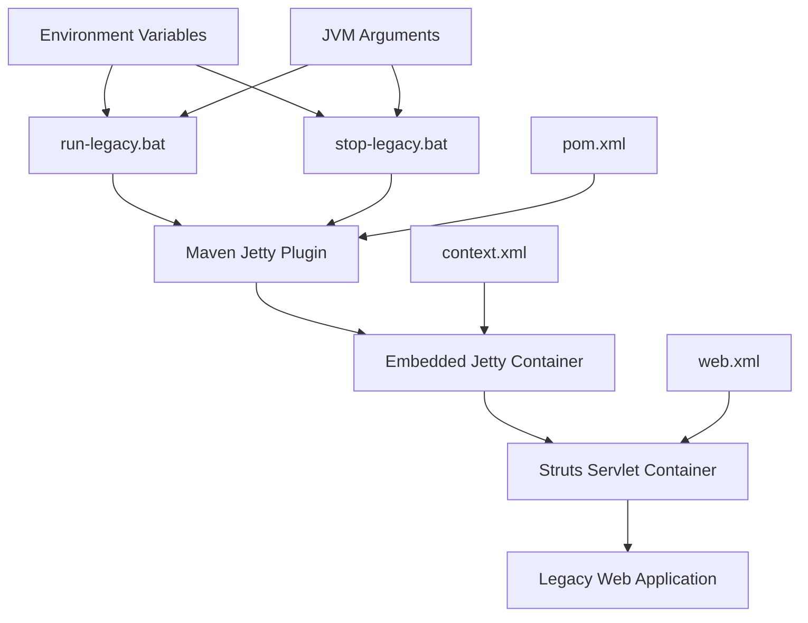
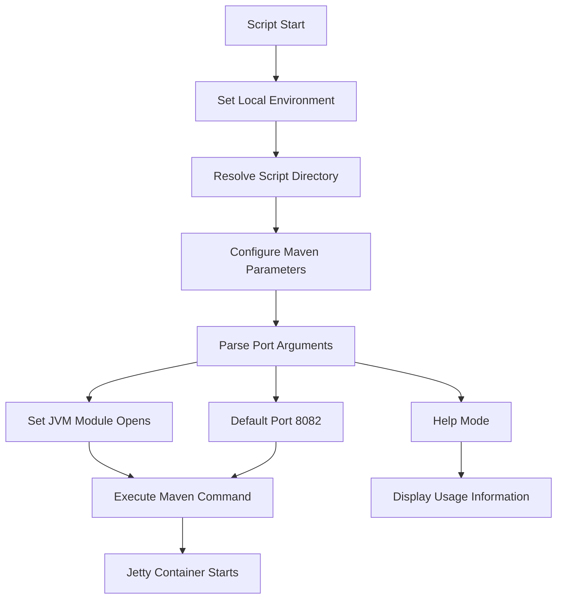
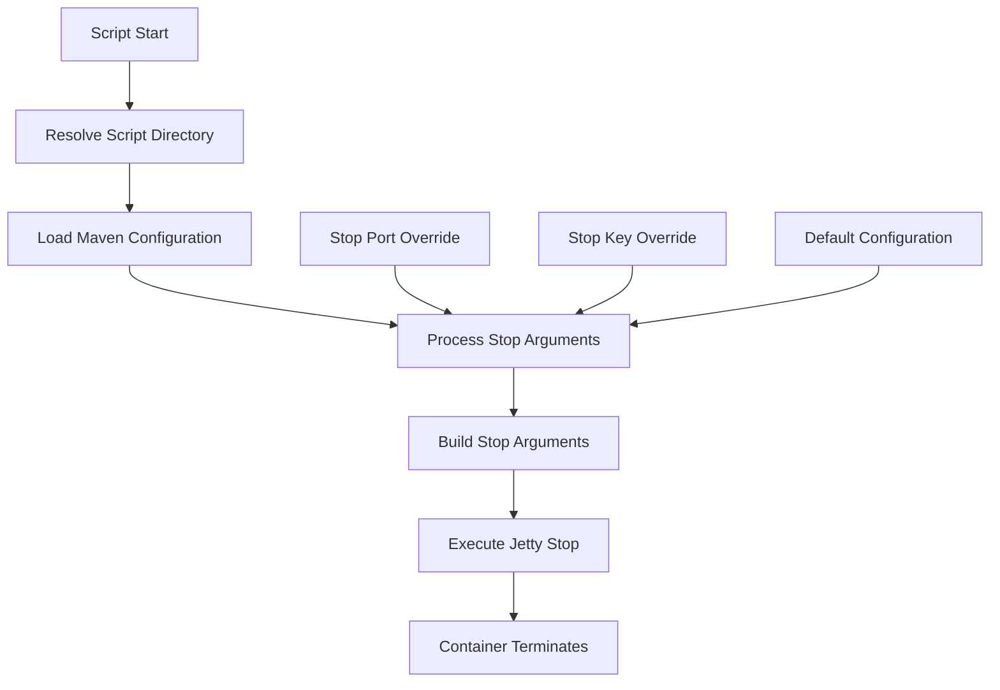
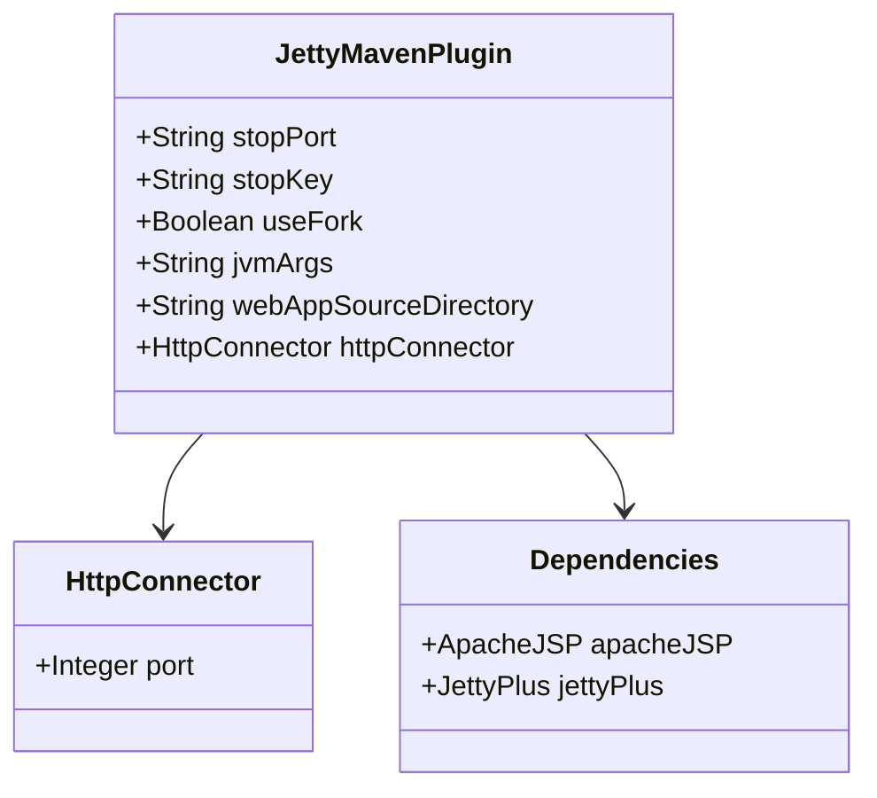
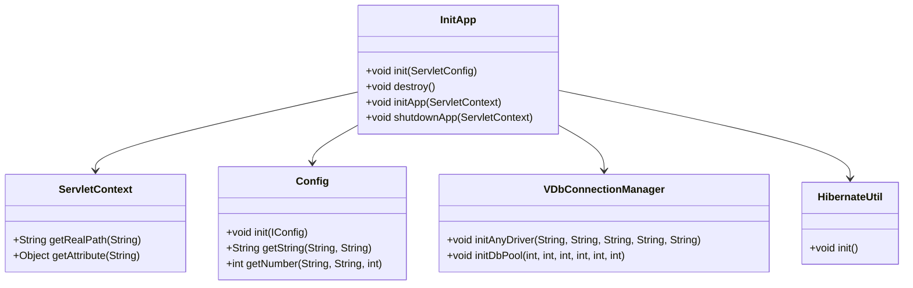
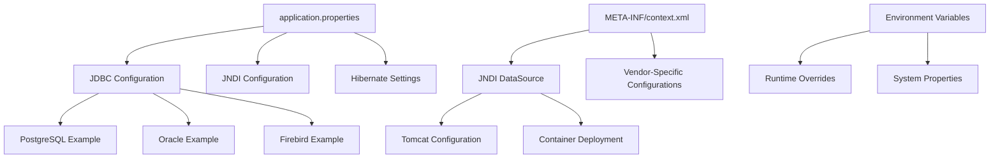

# Runtime Execution Scripts

<cite>
**Referenced Files in This Document**
- [run-legacy.bat](file://run-legacy.bat)
- [stop-legacy.bat](file://stop-legacy.bat)
- [pom.xml](file://pom.xml)
- [META-INF/context.xml](file://META-INF/context.xml)
- [src/main/webapp/WEB-INF/web.xml](file://src/main/webapp/WEB-INF/web.xml)
- [src/main/java/net/sam/dcl/App.java](file://src/main/java/net/sam/dcl/App.java)
- [src/main/java/net/sam/dcl/servlets/InitApp.java](file://src/main/java/net/sam/dcl/servlets/InitApp.java)
- [src/main/resources/application.properties](file://src/main/resources/application.properties)
- [src/main/resources/log4j.properties](file://src/main/resources/log4j.properties)
</cite>

## Table of Contents
1. [Introduction](#introduction)
2. [Script Architecture Overview](#script-architecture-overview)
3. [run-legacy.bat Analysis](#run-legacybat-analysis)
4. [stop-legacy.bat Analysis](#stop-legacybat-analysis)
5. [Maven Integration](#maven-integration)
6. [Java Application Architecture](#java-application-architecture)
7. [Configuration Management](#configuration-management)
8. [Troubleshooting Guide](#troubleshooting-guide)
9. [Modern Alternatives](#modern-alternatives)
10. [Best Practices](#best-practices)

## Introduction

The DCL Legacy Runtime Execution Scripts (`run-legacy.bat` and `stop-legacy.bat`) provide a comprehensive solution for starting and stopping a legacy Java web application built on the Apache Struts framework. These batch scripts leverage Maven's Jetty plugin to embed a servlet container, eliminating the need for external application servers while maintaining backward compatibility with older Java applications.

The scripts are designed to handle complex legacy applications that require specific JVM configurations, module access permissions, and database connectivity setups. They demonstrate modern deployment practices while preserving the operational characteristics of traditional enterprise applications.

## Script Architecture Overview

The runtime execution system consists of two primary batch files that work together to manage the application lifecycle:



**Diagram sources**
- [run-legacy.bat](file://run-legacy.bat#L1-L35)
- [stop-legacy.bat](file://stop-legacy.bat#L1-L25)
- [pom.xml](file://pom.xml#L238-L282)

Both scripts share common configuration patterns and operate within the same Maven ecosystem, ensuring consistent behavior across development and production environments.

**Section sources**
- [run-legacy.bat](file://run-legacy.bat#L1-L35)
- [stop-legacy.bat](file://stop-legacy.bat#L1-L25)
- [pom.xml](file://pom.xml#L238-L282)

## run-legacy.bat Analysis

### Script Structure and Initialization

The `run-legacy.bat` script demonstrates sophisticated Windows batch scripting with proper environment management and argument parsing:



**Diagram sources**
- [run-legacy.bat](file://run-legacy.bat#L1-L35)

### Key Features

#### 1. Environment Setup
The script begins by establishing a clean execution environment with delayed variable expansion, essential for complex batch operations involving conditional logic and dynamic variable manipulation.

#### 2. Dynamic Path Resolution
The script automatically resolves its own directory path using `%~dp0`, ensuring reliable operation regardless of the current working directory when the script is executed.

#### 3. Flexible Port Configuration
The script supports optional port specification as a command-line argument, defaulting to port 8082 to avoid conflicts with other local services commonly running on standard ports.

#### 4. JVM Module Access Configuration
Critical for Java 17+ compatibility, the script configures extensive module access permissions required by legacy libraries including Hibernate, CGLIB, and reflection-based frameworks:

- `java.base/java.lang` - Essential for class loading and reflection
- `java.base/java.lang.reflect` - Required for proxy creation and metadata access  
- `java.base/java.io` - Necessary for file operations and serialization
- `java.base/java.util` - Needed for collections and utility classes
- `java.desktop/java.beans` - Important for property access and bean introspection

#### 5. Maven Integration
The script executes Maven with specific profile activation and system properties, leveraging the Jetty Maven plugin configured for legacy application support.

**Section sources**
- [run-legacy.bat](file://run-legacy.bat#L1-L35)
- [pom.xml](file://pom.xml#L238-L282)

### Command Line Usage

The script supports flexible invocation patterns:

```batch
rem Start with default port (8082)
run-legacy.bat

rem Start with custom port
run-legacy.bat 8085

rem Display help information
run-legacy.bat help
run-legacy.bat /?
```

### Customization Examples

#### Memory Configuration
To increase heap size for memory-intensive operations:

```batch
set JAVA_TOOL_OPTIONS=%OPEN_MODS% -Xms512m -Xmx2g
set MAVEN_OPTS=%OPEN_MODS% -Xms512m -Xmx2g
```

#### Debug Configuration
For development debugging:

```batch
set JAVA_TOOL_OPTIONS=%OPEN_MODS% -agentlib:jdwp=transport=dt_socket,server=y,suspend=n,address=5005
set MAVEN_OPTS=%OPEN_MODS% -agentlib:jdwp=transport=dt_socket,server=y,suspend=n,address=5005
```

#### Additional JVM Arguments
For specialized requirements:

```batch
set JAVA_TOOL_OPTIONS=%OPEN_MODS% -XX:+UseG1GC -XX:MaxGCPauseMillis=200
set MAVEN_OPTS=%OPEN_MODS% -XX:+UseG1GC -XX:MaxGCPauseMillis=200
```

## stop-legacy.bat Analysis

### Graceful Shutdown Mechanism

The `stop-legacy.bat` script implements a sophisticated shutdown protocol designed to terminate the embedded Jetty container cleanly:



**Diagram sources**
- [stop-legacy.bat](file://stop-legacy.bat#L1-L25)

### Advanced Configuration Options

The stop script provides flexible customization through optional parameters:

#### Port Override
```batch
rem Custom stop port
stop-legacy.bat 8091
```

#### Key Override  
```batch
rem Custom stop key
stop-legacy.bat 8090 custom-stop-key
```

#### Combined Configuration
```batch
rem Both custom port and key
stop-legacy.bat 8091 custom-stop-key
```

### Implementation Details

The script dynamically constructs JVM arguments based on provided parameters, allowing for environment-specific shutdown configurations without modifying the script itself.

**Section sources**
- [stop-legacy.bat](file://stop-legacy.bat#L1-L25)

## Maven Integration

### Jetty Plugin Configuration

The Maven configuration demonstrates advanced plugin usage for legacy application support:



**Diagram sources**
- [pom.xml](file://pom.xml#L238-L282)

### Key Configuration Elements

#### 1. Legacy Compatibility Mode
The plugin operates in `useFork` mode to isolate the application from Maven's classpath, preventing conflicts with legacy libraries.

#### 2. Module Access Configuration
Extensive JVM arguments ensure compatibility with modern Java versions while maintaining access to legacy APIs.

#### 3. Embedded Resources
Required dependencies for JSP compilation and servlet container functionality are included directly in the plugin configuration.

#### 4. Port Configuration
Default HTTP port set to 8082 to avoid conflicts with standard development services.

**Section sources**
- [pom.xml](file://pom.xml#L238-L282)

## Java Application Architecture

### Servlet Container Integration

The application architecture demonstrates a layered approach typical of legacy enterprise systems:



**Diagram sources**
- [src/main/java/net/sam/dcl/servlets/InitApp.java](file://src/main/java/net/sam/dcl/servlets/InitApp.java#L1-L100)
- [src/main/java/net/sam/dcl/App.java](file://src/main/java/net/sam/dcl/App.java#L1-L8)

### Application Lifecycle Management

The `InitApp` servlet serves as the primary application lifecycle manager, coordinating initialization of various subsystems:

#### 1. Configuration Loading
- Base path resolution
- Configuration file discovery
- Multi-file configuration merging

#### 2. Database Connectivity
- Driver initialization
- Connection pool configuration
- Resource cleanup coordination

#### 3. Framework Initialization
- Hibernate ORM setup
- XML resource loading
- Permission system initialization

#### 4. Background Services
- Task scheduling
- Resource monitoring
- Cleanup thread management

**Section sources**
- [src/main/java/net/sam/dcl/servlets/InitApp.java](file://src/main/java/net/sam/dcl/servlets/InitApp.java#L1-L199)

## Configuration Management

### Multi-Level Configuration System

The application employs a hierarchical configuration system supporting multiple database vendors and deployment environments:



**Diagram sources**
- [src/main/resources/application.properties](file://src/main/resources/application.properties#L1-L60)
- [META-INF/context.xml](file://META-INF/context.xml#L1-L80)

### Database Configuration Patterns

#### JDBC Connection Strings
The system supports multiple database vendors through commented-out configuration templates:

- **PostgreSQL**: `jdbc:postgresql://localhost:5432/dcl`
- **Oracle**: `jdbc:oracle:thin:@localhost:1521/ORCLPDB1`  
- **Firebird**: `jdbc:firebirdsql://localhost:3050/dcl.fdb?charSet=UTF-8`

#### JNDI DataSource Configuration
Production deployments utilize container-managed datasources through the `META-INF/context.xml` file, enabling centralized database administration and connection pooling.

**Section sources**
- [src/main/resources/application.properties](file://src/main/resources/application.properties#L1-L60)
- [META-INF/context.xml](file://META-INF/context.xml#L1-L80)

## Troubleshooting Guide

### Common Startup Issues

#### 1. Port Conflicts
**Symptoms**: Application fails to start with port binding errors
**Solutions**:
- Verify port availability using `netstat -an | findstr :8082`
- Modify default port in `run-legacy.bat` or use custom port argument
- Check for conflicting services (Tomcat, IIS, etc.)

#### 2. Memory Exhaustion
**Symptoms**: OutOfMemoryError during startup or runtime
**Solutions**:
```batch
rem Increase heap size
set JAVA_TOOL_OPTIONS=%OPEN_MODS% -Xms1g -Xmx4g
set MAVEN_OPTS=%OPEN_MODS% -Xms1g -Xmx4g
```

#### 3. Module Access Violations
**Symptoms**: ClassNotFoundException or IllegalAccessError for legacy libraries
**Solutions**:
- Verify JVM version compatibility (Java 17+ required)
- Check module access arguments in `run-legacy.bat`
- Review `pom.xml` for required dependencies

#### 4. Database Connection Failures
**Symptoms**: VDbException or connection timeout errors
**Solutions**:
- Verify database server accessibility
- Check connection string format in configuration
- Validate database credentials and permissions
- Ensure appropriate JDBC driver is available

### Diagnostic Commands

#### Environment Verification
```batch
rem Check Java version
java -version

rem Verify Maven installation
mvn -version

rem Test port availability
netstat -an | findstr :8082
```

#### Log Analysis
The application generates comprehensive logging to help diagnose issues:
- `log4j-common` - General application events
- `log4j-error` - Error conditions and exceptions
- `log4j-hibernate` - Database and ORM operations
- `log4j-struts` - Web framework activities

### Script Execution Issues

#### Windows Batch Script Problems
**Common Issues**:
- Incorrect path separators
- Variable expansion timing
- Special character handling

**Solutions**:
- Use forward slashes in paths
- Enable delayed variable expansion with `setlocal enabledelayedexpansion`
- Quote paths containing spaces

#### Maven Dependency Resolution
**Common Issues**:
- Proxy configuration problems
- Repository connectivity issues
- Dependency conflicts

**Solutions**:
- Configure Maven proxy settings
- Clear local repository cache
- Use `-U` flag for forced updates

**Section sources**
- [run-legacy.bat](file://run-legacy.bat#L1-L35)
- [src/main/resources/log4j.properties](file://src/main/resources/log4j.properties#L1-L122)

## Modern Alternatives

### Maven Plugins

#### Spring Boot Plugin
For modern Spring-based applications, consider using the Spring Boot Maven plugin:

```xml
<plugin>
    <groupId>org.springframework.boot</groupId>
    <artifactId>spring-boot-maven-plugin</artifactId>
    <configuration>
        <mainClass>com.example.Application</mainClass>
    </configuration>
</plugin>
```

#### Tomcat Maven Plugin
For traditional WAR deployments:

```xml
<plugin>
    <groupId>org.apache.tomcat.maven</groupId>
    <artifactId>tomcat7-maven-plugin</artifactId>
    <version>2.2</version>
</plugin>
```

### Containerized Deployment

#### Docker Configuration
```dockerfile
FROM openjdk:17-jdk-slim
WORKDIR /app
COPY target/dcl-3-new.war /app/
EXPOSE 8080
CMD ["java", "-jar", "dcl-3-new.war"]
```

#### Kubernetes Deployment
```yaml
apiVersion: apps/v1
kind: Deployment
metadata:
  name: dcl-legacy
spec:
  replicas: 1
  selector:
    matchLabels:
      app: dcl-legacy
  template:
    metadata:
      labels:
        app: dcl-legacy
    spec:
      containers:
      - name: dcl-legacy
        image: dcl-legacy:latest
        ports:
        - containerPort: 8080
        env:
        - name: JAVA_OPTS
          value: "-Xms512m -Xmx2g"
```

### Build Tool Alternatives

#### Gradle Configuration
```groovy
plugins {
    id 'war'
    id 'org.gretty' version '4.0.3'
}

gretty {
    httpPort = 8082
    contextPath = '/'
    servletContainer = 'jetty9'
}
```

#### Native Image Compilation
For GraalVM native image compilation:
```bash
native-image -H:Name=dcl-legacy \
             -H:Classpath=target/dcl-3-new.war \
             -H:+ReportUnsupportedElementsAtRuntime \
             -H:+AllowVMInspection \
             --no-fallback \
             --enable-all-security-services \
             --allow-incomplete-classpath \
             --report-unsupported-elements-at-runtime
```

## Best Practices

### Development Environment Setup

#### 1. Consistent Port Usage
Always use the default port 8082 to maintain compatibility with documentation and team workflows.

#### 2. Environment Isolation
Maintain separate configuration files for different environments (development, testing, production).

#### 3. Version Control
Include script modifications in version control with clear commit messages explaining changes.

### Production Deployment

#### 1. Monitoring Integration
Implement health checks and monitoring endpoints for production deployments.

#### 2. Security Hardening
- Disable unnecessary servlets and filters in production
- Implement proper authentication and authorization
- Regular security updates and vulnerability scanning

#### 3. Performance Tuning
- Monitor garbage collection patterns
- Optimize connection pool settings
- Implement caching strategies

### Maintenance Procedures

#### 1. Regular Updates
- Keep Java runtime updated to supported versions
- Update Maven dependencies regularly
- Monitor application performance metrics

#### 2. Backup Strategies
- Regular database backups
- Configuration file versioning
- Application artifact archiving

#### 3. Disaster Recovery
- Document recovery procedures
- Test backup restoration processes
- Maintain redundant infrastructure

The legacy runtime execution scripts represent a bridge between traditional enterprise application deployment and modern development practices, providing robust, maintainable solutions for complex legacy systems while enabling gradual migration to contemporary technologies.