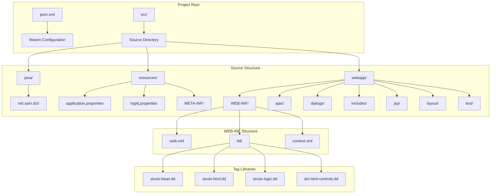
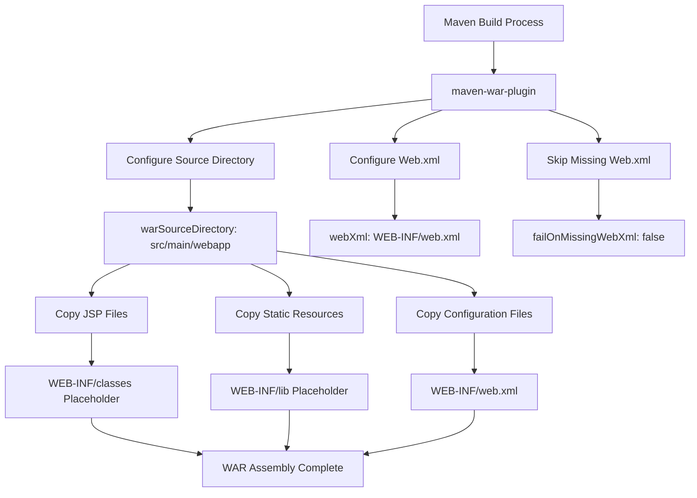
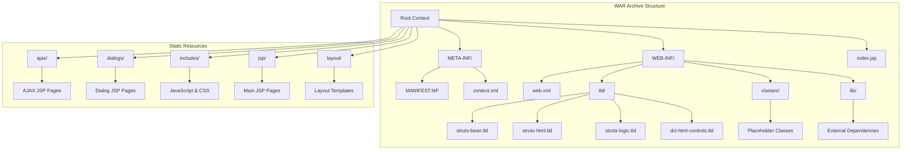
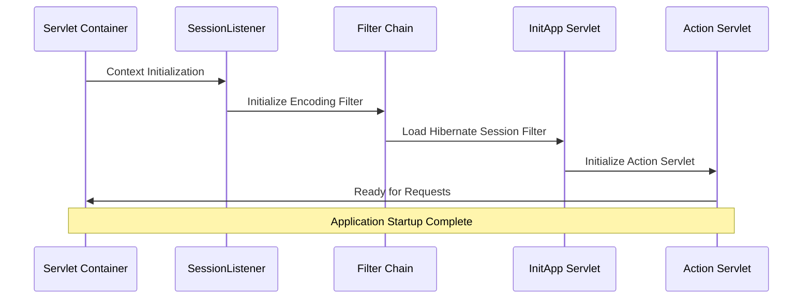
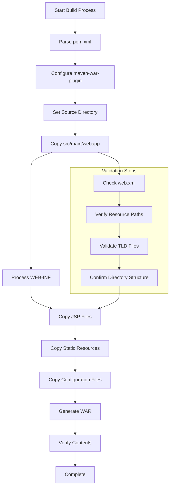

# WAR Packaging

<cite>
**Referenced Files in This Document**
- [pom.xml](file://pom.xml)
- [src/main/webapp/WEB-INF/web.xml](file://src/main/webapp/WEB-INF/web.xml)
- [src/main/webapp/META-INF/context.xml](file://src/main/webapp/META-INF/context.xml)
- [src/main/java/net/sam/dcl/servlets/InitApp.java](file://src/main/java/net/sam/dcl/servlets/InitApp.java)
- [src/main/java/net/sam/dcl/filters/RequestResponseSetupFilter.java](file://src/main/java/net/sam/dcl/filters/RequestResponseSetupFilter.java)
- [src/main/resources/application.properties](file://src/main/resources/application.properties)
- [src/main/resources/log4j.properties](file://src/main/resources/log4j.properties)
- [src/main/webapp/WEB-INF/tld/struts-bean.tld](file://src/main/webapp/WEB-INF/tld/struts-bean.tld)
</cite>

## Table of Contents
1. [Introduction](#introduction)
2. [Project Structure Overview](#project-structure-overview)
3. [Maven WAR Plugin Configuration](#maven-war-plugin-configuration)
4. [Web Application Archive Structure](#web-application-archive-structure)
5. [Web.xml Configuration](#webxml-configuration)
6. [Resource Organization](#resource-organization)
7. [Packaging Process](#packaging-process)
8. [Build Verification](#build-verification)
9. [Common Issues and Solutions](#common-issues-and-solutions)
10. [Deployment Verification](#deployment-verification)

## Introduction

The dcl_v3 application employs a sophisticated WAR (Web Application Archive) packaging strategy designed to preserve legacy functionality while enabling modern deployment practices. This documentation provides comprehensive coverage of the Maven-based packaging process, focusing on how the maven-war-plugin assembles the web application archive from the project structure under `src/main/webapp`.

The application follows a unique approach where the WAR packaging phase operates independently of Java source compilation, treating the web application as a pre-built artifact that requires minimal modification during the build process. This strategy enables seamless integration with existing legacy systems while maintaining compatibility with modern deployment environments.

## Project Structure Overview

The dcl_v3 project organizes its web application components according to standard Maven conventions, with specialized adaptations for legacy compatibility:



**Diagram sources**
- [pom.xml](file://pom.xml#L1-L283)
- [src/main/webapp/WEB-INF/web.xml](file://src/main/webapp/WEB-INF/web.xml#L1-L176)

The project structure demonstrates a clear separation between Java source code, web resources, and configuration files. The `src/main/webapp` directory serves as the primary source for WAR assembly, containing all JSP pages, JavaScript files, CSS stylesheets, and configuration resources.

**Section sources**
- [pom.xml](file://pom.xml#L1-L50)
- [src/main/webapp/WEB-INF/web.xml](file://src/main/webapp/WEB-INF/web.xml#L1-L50)

## Maven WAR Plugin Configuration

The maven-war-plugin configuration in the pom.xml establishes the foundation for WAR packaging by specifying the source directory and web.xml location:



**Diagram sources**
- [pom.xml](file://pom.xml#L95-L110)

The plugin configuration includes several critical parameters:

- **warSourceDirectory**: Specifies `${project.basedir}/src/main/webapp` as the source for WAR content
- **webXml**: Points to `${project.basedir}/src/main/webapp/WEB-INF/web.xml` for servlet configuration
- **failOnMissingWebXml**: Set to `false` to accommodate legacy applications that may not require a web.xml

This configuration ensures that the WAR plugin treats the web application as a pre-assembled artifact, copying all content from the specified source directory without attempting to compile Java sources.

**Section sources**
- [pom.xml](file://pom.xml#L95-L110)

## Web Application Archive Structure

The WAR file assembly process creates a standardized directory structure that mirrors the web application's deployment requirements:



**Diagram sources**
- [src/main/webapp/WEB-INF/web.xml](file://src/main/webapp/WEB-INF/web.xml#L1-L176)
- [src/main/webapp/META-INF/context.xml](file://src/main/webapp/META-INF/context.xml#L1-L4)

The WAR structure includes several key components:

### WEB-INF Directory
The `WEB-INF` directory contains all application-specific configuration and resources:

- **web.xml**: Servlet configuration and filter mappings
- **tld/**: Tag library descriptors for JSP custom tags
- **classes/**: Placeholder for compiled Java classes (empty in this build stage)
- **lib/**: Placeholder for external dependencies (empty in this build stage)

### Static Resource Directories
The WAR includes various static resource directories that serve different purposes:

- **ajax/**: AJAX-enabled JSP pages for dynamic content loading
- **dialogs/**: Dialog-based JSP pages for modal interactions
- **includes/**: Shared JavaScript libraries, CSS files, and utility scripts
- **jsp/**: Main application JSP pages organized by functional area
- **layout/**: Template JSP files for consistent page structure

**Section sources**
- [src/main/webapp/WEB-INF/web.xml](file://src/main/webapp/WEB-INF/web.xml#L1-L176)
- [src/main/webapp/META-INF/context.xml](file://src/main/webapp/META-INF/context.xml#L1-L4)

## Web.xml Configuration

The web.xml configuration defines the servlet container's behavior and establishes the application's runtime environment:



**Diagram sources**
- [src/main/webapp/WEB-INF/web.xml](file://src/main/webapp/WEB-INF/web.xml#L8-L176)

### Servlet Configuration

The web.xml defines two primary servlets:

1. **InitApp Servlet**: Loads on startup (load-on-startup=1) and initializes the application context
2. **Action Servlet**: Based on Apache Struts framework, configured with multiple initialization parameters

### Filter Chain Configuration

The application implements a comprehensive filter chain that processes all requests:

1. **HibernateSessionFilter**: Manages database sessions
2. **ResponseCollectFilter**: Handles response collection
3. **RequestResponseSetupFilter**: Sets character encoding and cache control
4. **DefenderFilter**: Provides security and access control
5. **ConfigReloader**: Monitors configuration changes

Each filter is mapped to the `/*` URL pattern, ensuring comprehensive request processing.

### Tag Library Definitions

The web.xml includes extensive tag library declarations for JSP custom tags, covering:
- Struts framework tags (bean, html, logic, nested, tiles)
- Custom DCL tags (html-controls, html-grid, dcl-html-controls)
- Ditchnet tag libraries for UI components

**Section sources**
- [src/main/webapp/WEB-INF/web.xml](file://src/main/webapp/WEB-INF/web.xml#L1-L176)

## Resource Organization

The application organizes resources according to functional categories and access patterns:

### JSP Page Organization
The JSP pages are structured into logical groups:

- **AJAX Pages**: Dynamic content loading (`ajax/` directory)
- **Dialog Pages**: Modal interaction components (`dialogs/` directory)
- **Layout Templates**: Reusable page structures (`layout/` directory)
- **Main Pages**: Core application functionality (`jsp/` directory)

### Static Resource Management
Static resources include:

- **JavaScript Libraries**: Prototype, custom utilities, and third-party libraries
- **CSS Stylesheets**: Layout styling, theme definitions, and responsive design
- **Images**: Icons, backgrounds, and visual elements
- **Configuration Files**: Localization data and application settings

### Tag Library Resources
The TLD files define custom tag libraries that extend JSP functionality:

- **Struts Tags**: Standard Struts framework tags for form handling and data presentation
- **Custom Controls**: DCL-specific UI components and business logic integration
- **Utility Tags**: Helper tags for common operations and data manipulation

**Section sources**
- [src/main/webapp/WEB-INF/tld/struts-bean.tld](file://src/main/webapp/WEB-INF/tld/struts-bean.tld#L1-L50)

## Packaging Process

The WAR packaging process follows a systematic approach that ensures complete and accurate assembly of the web application:



**Diagram sources**
- [pom.xml](file://pom.xml#L95-L110)

### Step-by-Step Build Process

1. **Plugin Configuration**: The maven-war-plugin reads configuration from pom.xml
2. **Source Directory Setup**: WAR source directory is set to `src/main/webapp`
3. **Resource Copying**: All files from the source directory are copied to the WAR
4. **WEB-INF Processing**: Special handling for web application configuration
5. **File Validation**: Verification of critical files and paths
6. **WAR Generation**: Creation of the final `.war` file

### Build Command Execution

The standard build command executes the complete packaging process:

```bash
mvn clean package
```

This command performs:
- **Clean Phase**: Removes previous build artifacts
- **Compile Phase**: Skipped for this configuration (Java sources excluded)
- **Package Phase**: Generates the WAR file using the configured plugin

**Section sources**
- [pom.xml](file://pom.xml#L95-L110)

## Build Verification

After successful WAR generation, verification steps ensure the packaged application meets deployment requirements:

### Content Inspection
Verification should confirm:
- All JSP pages are present in the appropriate directories
- Static resources (JS, CSS, images) are accessible
- Configuration files (web.xml, context.xml) are correctly formatted
- Tag library descriptors are valid and accessible

### Structural Validation
The WAR should exhibit proper directory structure:
- Root context includes META-INF and WEB-INF
- WEB-INF contains web.xml, tld/, classes/, and lib/
- Static resource directories are preserved
- No extraneous files or directories

### Runtime Compatibility
Basic runtime compatibility checks include:
- Servlet container compatibility
- JSP engine support
- Tag library accessibility
- Resource loading capabilities

**Section sources**
- [pom.xml](file://pom.xml#L95-L110)

## Common Issues and Solutions

### Missing Resources
**Problem**: JSP pages or static resources not included in the WAR
**Solution**: Verify source directory configuration and file permissions

### Incorrect Web.xml Configuration
**Problem**: Servlet or filter mappings fail to load
**Solution**: Validate XML syntax and ensure all referenced classes are available

### Classpath Problems
**Problem**: Runtime errors due to missing dependencies
**Solution**: Confirm external dependencies are properly managed and accessible

### Encoding Issues
**Problem**: Character encoding problems in JSP pages
**Solution**: Verify UTF-8 encoding configuration in web.xml and JSP files

### Filter Chain Problems
**Problem**: Filters not executing in expected order
**Solution**: Review filter mapping order in web.xml and ensure proper initialization

**Section sources**
- [src/main/webapp/WEB-INF/web.xml](file://src/main/webapp/WEB-INF/web.xml#L1-L176)

## Deployment Verification

Successful WAR deployment requires comprehensive testing of the packaged application:

### Container Compatibility
Verify deployment across supported servlet containers:
- Apache Tomcat 8+
- IBM WebSphere
- Oracle WebLogic
- Red Hat JBoss/WildFly

### Functional Testing
Execute core application functionality:
- Login and authentication
- Navigation and page loading
- Form submission and data processing
- Report generation and export

### Performance Validation
Assess application performance:
- Startup time measurement
- Memory usage monitoring
- Response time testing
- Concurrent user handling

### Security Verification
Validate security configurations:
- Access control enforcement
- Session management
- Input validation
- Cross-site scripting protection

The dcl_v3 WAR packaging process represents a sophisticated approach to legacy application modernization, combining traditional web application principles with contemporary build automation practices. This documentation provides the foundation for understanding, maintaining, and extending the application's deployment capabilities.