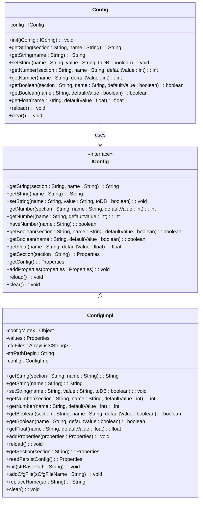
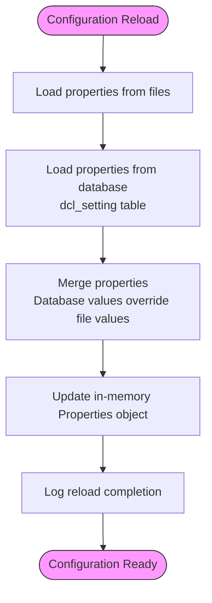
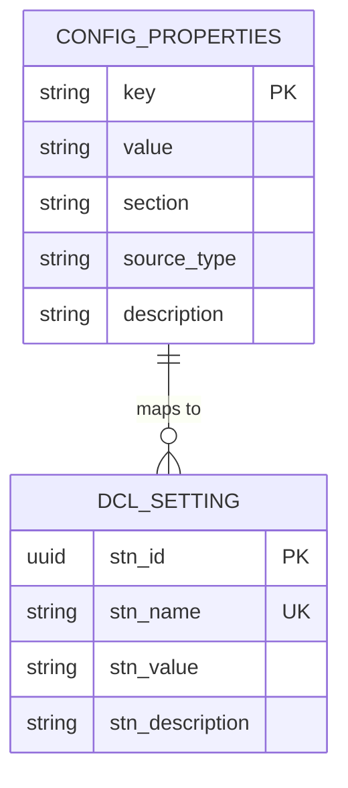
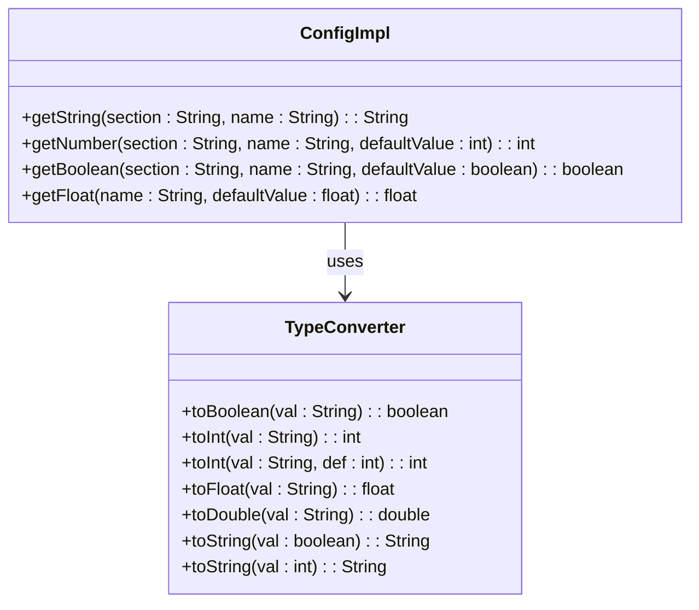
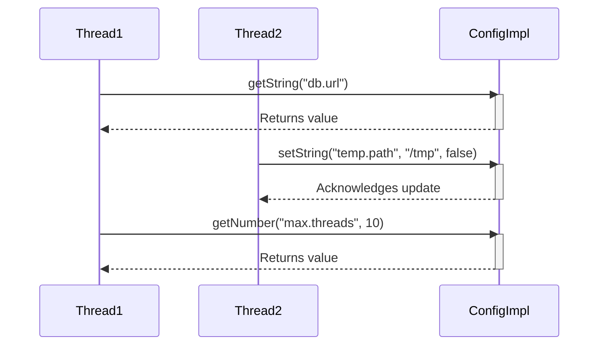
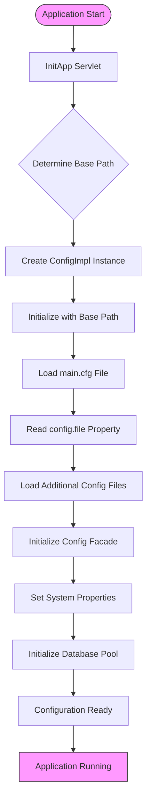

# Configuration Data Model

<cite>
**Referenced Files in This Document**   
- [Config.java](file://src/main/java/net/sam/dcl/config/Config.java)
- [ConfigImpl.java](file://src/main/java/net/sam/dcl/config/ConfigImpl.java)
- [IConfig.java](file://src/main/java/net/sam/dcl/config/IConfig.java)
- [application.properties](file://src/main/resources/application.properties)
- [Constants.java](file://src/main/java/net/sam/dcl/beans/Constants.java)
- [InitApp.java](file://src/main/java/net/sam/dcl/servlets/InitApp.java)
</cite>

## Table of Contents
1. [Introduction](#introduction)
2. [Configuration Architecture](#configuration-architecture)
3. [Core Components](#core-components)
4. [Property Hierarchy and Lookup Mechanism](#property-hierarchy-and-lookup-mechanism)
5. [Configuration Properties Structure](#configuration-properties-structure)
6. [Type-Safe Accessors](#type-safe-accessors)
7. [Configuration Usage in Business Logic](#configuration-usage-in-business-logic)
8. [Thread Safety and Singleton Implementation](#thread-safety-and-singleton-implementation)
9. [Configuration Initialization Process](#configuration-initialization-process)
10. [Best Practices for Configuration Management](#best-practices-for-configuration-management)

## Introduction
The dcl_v3 configuration system provides a centralized, type-safe mechanism for managing application settings through a singleton facade pattern. This documentation details the Config class implementation that serves as the primary interface for accessing configuration properties loaded from application.properties and database sources. The system enables type-safe access to configuration values through specialized accessor methods (getString, getNumber, getBoolean, getFloat) with default value handling. Configuration properties are organized into sections and support both file-based and database-persistent storage, allowing for dynamic updates without application restarts. The system is designed to be thread-safe and accessible throughout the application's business logic layers.

**Section sources**
- [Config.java](file://src/main/java/net/sam/dcl/config/Config.java#L0-L131)
- [ConfigImpl.java](file://src/main/java/net/sam/dcl/config/ConfigImpl.java#L0-L451)

## Configuration Architecture
The configuration system follows a layered architecture with a clear separation between interface and implementation. The IConfig interface defines the contract for configuration access, while ConfigImpl provides the concrete implementation. The Config class acts as a singleton facade, providing static access methods to the underlying configuration implementation. Configuration data is loaded from multiple sources: application.properties files and a database table (dcl_setting), with database values taking precedence during the merge process. The architecture supports dynamic reloading of configuration data, allowing runtime updates without application restarts.



**Diagram sources**
- [IConfig.java](file://src/main/java/net/sam/dcl/config/IConfig.java#L0-L34)
- [ConfigImpl.java](file://src/main/java/net/sam/dcl/config/ConfigImpl.java#L0-L451)
- [Config.java](file://src/main/java/net/sam/dcl/config/Config.java#L0-L131)

## Core Components

### IConfig Interface
The IConfig interface defines the contract for configuration access, providing methods for retrieving and setting configuration values of various types. It includes methods for accessing string, numeric, boolean, and floating-point values, as well as operations for managing configuration sections and reloading configuration data. The interface abstracts the underlying storage mechanism, allowing different implementations to be swapped without affecting client code.

**Section sources**
- [IConfig.java](file://src/main/java/net/sam/dcl/config/IConfig.java#L0-L34)

### ConfigImpl Class
The ConfigImpl class provides the concrete implementation of the IConfig interface, managing configuration data storage and retrieval. It maintains configuration values in a Properties object with thread-safe access controlled by a mutex. The implementation supports loading configuration from multiple sources, including properties files and database storage. It handles property replacement for the %HOME% placeholder and manages the persistence of configuration changes to the database when requested.

**Section sources**
- [ConfigImpl.java](file://src/main/java/net/sam/dcl/config/ConfigImpl.java#L0-L451)

### Config Facade
The Config class serves as a singleton facade that provides static access to configuration data. It encapsulates an instance of IConfig and exposes static methods that delegate to the underlying implementation. This design pattern allows any part of the application to access configuration data without needing to manage configuration instances or dependencies. The facade pattern simplifies the API and provides a consistent interface for configuration access throughout the application.

**Section sources**
- [Config.java](file://src/main/java/net/sam/dcl/config/Config.java#L0-L131)

## Property Hierarchy and Lookup Mechanism
The configuration system implements a hierarchical property lookup mechanism that combines file-based and database-persistent configuration sources. When the configuration is reloaded, properties are loaded from multiple sources in a specific order:

1. Properties files specified in the configuration (main.cfg and additional files)
2. Database-stored configuration from the dcl_setting table

The system merges these sources, with database values taking precedence over file-based values. This allows for runtime configuration changes that override default settings without modifying configuration files. The lookup mechanism supports both section-specific and global properties, with section properties accessed using dot notation (section.property).

Section-specific properties are accessed using the getString(section, name) method, which looks up properties with the format "section.name". Global properties are accessed directly by name. The system also supports property inheritance and overriding, where more specific configuration values can override general ones.



**Diagram sources**
- [ConfigImpl.java](file://src/main/java/net/sam/dcl/config/ConfigImpl.java#L224-L275)
- [ConfigImpl.java](file://src/main/java/net/sam/dcl/config/ConfigImpl.java#L320-L366)

## Configuration Properties Structure
The configuration properties are organized in a structured format with specific sections and naming conventions. The application.properties file contains various configuration categories including database settings, business rules, and system behavior parameters. Properties are named using lowercase with underscores or dot notation for section separation.

Key configuration sections include:
- **Database settings**: JDBC connection parameters, connection pool configuration
- **Business rules**: Coefficients, thresholds, and business logic parameters
- **System behavior**: UI settings, file paths, logging configuration
- **Feature flags**: Boolean switches for enabling/disabling functionality

The system uses a combination of file-based configuration and database-persistent settings, allowing administrators to modify certain parameters through the application interface while keeping core infrastructure settings in configuration files.



**Diagram sources**
- [application.properties](file://src/main/resources/application.properties#L0-L59)
- [ConfigImpl.java](file://src/main/java/net/sam/dcl/config/ConfigImpl.java#L320-L366)

## Type-Safe Accessors
The configuration system provides type-safe accessor methods that convert string-based property values to appropriate data types with built-in error handling and default value support. These methods abstract the conversion logic and exception handling, providing a clean API for configuration access.

### String Accessors
The getString methods retrieve configuration values as strings, with two variants:
- getString(section, name): Retrieves a section-specific property
- getString(name): Retrieves a global property

Both methods return empty strings if the property is not found, preventing null pointer exceptions.

### Numeric Accessors
The numeric accessors provide type-safe conversion from string to numeric types:
- getNumber(section, name, defaultValue): Converts a section-specific property to integer
- getNumber(name, defaultValue): Converts a global property to integer
- getFloat(name, defaultValue): Converts a property to float

These methods include exception handling for invalid number formats, logging errors and returning the specified default value.

### Boolean Accessors
The boolean accessors handle various string representations of boolean values:
- getBoolean(section, name, defaultValue): Interprets section-specific property as boolean
- getBoolean(name, defaultValue): Interprets global property as boolean

The system recognizes "1", "true", "yes", and "on" (case-insensitive) as true values, with all other non-empty values treated as false. Empty values return the specified default.



**Diagram sources**
- [ConfigImpl.java](file://src/main/java/net/sam/dcl/config/ConfigImpl.java#L50-L171)
- [TypeConverter.java](file://src/main/java/net/sam/dcl/util/TypeConverter.java#L250-L312)

## Configuration Usage in Business Logic
Configuration values are accessed throughout the application's business logic layers, particularly in Action classes that handle user requests and business processes. The Config facade provides a convenient way to access configuration parameters without requiring dependency injection or complex setup.

### Example: Commercial Proposal Business Logic
In the CommercialProposalAction class, configuration parameters are used to control business rules and default values:

```java
// Accessing float configuration with default value
float minCoefficient = Config.getFloat(Constants.minCourseCoefficient, 1.05f);

// Using configuration to determine default currency
Currency defaultCurrency = CurrencyDAO.loadByName(context, 
    Config.getString(Constants.defaultCPCurrency));

// Retrieving integer configuration with default
int dayCount = Config.getNumber(Constants.dayCountDeductCommercialProposals, 10);
```

### Default Value Handling
The configuration system implements robust default value handling, ensuring that business logic can proceed even when specific configuration properties are missing. Each accessor method requires a default value parameter, which is returned when:
- The requested property does not exist
- The property value cannot be converted to the requested type
- The configuration system has not been properly initialized

This approach prevents application failures due to missing configuration and allows for graceful degradation when optional features are not configured.

**Section sources**
- [CommercialProposalAction.java](file://src/main/java/net/sam/dcl/action/CommercialProposalAction.java#L410)
- [CommercialProposalAction.java](file://src/main/java/net/sam/dcl/action/CommercialProposalAction.java#L1240)
- [Constants.java](file://src/main/java/net/sam/dcl/beans/Constants.java#L66-L84)

## Thread Safety and Singleton Implementation
The configuration system is designed to be thread-safe, ensuring reliable operation in multi-threaded environments such as web applications. Thread safety is achieved through several mechanisms:

### Synchronization
The ConfigImpl class uses a dedicated mutex object (configMutex) to synchronize access to the shared Properties object. All read and write operations on configuration data are synchronized, preventing race conditions when multiple threads access or modify configuration simultaneously.

### Singleton Pattern
The Config class implements a singleton pattern through a private constructor and a static instance variable. The singleton is initialized through the init() method, which sets the underlying IConfig implementation. This ensures that all parts of the application access the same configuration instance, maintaining consistency across threads.

### Immutable Defaults
Default values passed to accessor methods are not stored in the configuration but are used only as fallbacks. This prevents unintended modifications to default behavior and ensures that configuration changes are explicit and intentional.



**Diagram sources**
- [ConfigImpl.java](file://src/main/java/net/sam/dcl/config/ConfigImpl.java#L50-L109)
- [ConfigImpl.java](file://src/main/java/net/sam/dcl/config/ConfigImpl.java#L224-L275)

## Configuration Initialization Process
The configuration system is initialized during application startup through the InitApp servlet, which orchestrates the setup of the configuration subsystem. The initialization process follows these steps:

1. Determine the base path for configuration files
2. Create and initialize the ConfigImpl instance
3. Load the main configuration file (main.cfg)
4. Load additional configuration files specified in the config.file property
5. Initialize the Config facade with the ConfigImpl instance
6. Set system properties based on configuration values
7. Initialize the database connection pool using configuration parameters

The initialization process ensures that configuration is available before other application components start, providing a reliable foundation for the entire system. The ConfigReloader filter enables runtime configuration reloading, allowing administrators to refresh configuration without restarting the application.



**Diagram sources**
- [InitApp.java](file://src/main/java/net/sam/dcl/servlets/InitApp.java#L84-L119)
- [InitApp.java](file://src/main/java/net/sam/dcl/servlets/InitApp.java#L155-L190)
- [ConfigReloader.java](file://src/main/java/net/sam/dcl/filters/ConfigReloader.java#L0-L44)

## Best Practices for Configuration Management
When working with the dcl_v3 configuration system, follow these best practices to ensure maintainable and reliable configuration management:

### Adding New Configuration Parameters
1. Define constants in the Constants class for all configuration keys
2. Document the purpose and acceptable values of new parameters
3. Provide sensible default values in accessor methods
4. Add entries to application.properties with comments explaining usage

### Configuration Organization
- Group related properties under logical section names
- Use consistent naming conventions (lowercase with underscores)
- Separate environment-specific settings from general configuration
- Keep sensitive information (passwords, keys) in secure storage

### Runtime Configuration Changes
- Use the database persistence feature for frequently changed parameters
- Implement proper validation for configuration updates
- Consider the impact of configuration changes on running processes
- Use the reload() method to refresh configuration when needed

### Error Handling
- Always provide default values for configuration accessors
- Log configuration errors for troubleshooting
- Validate configuration values before use in critical operations
- Implement graceful degradation when configuration is missing

### Performance Considerations
- Cache frequently accessed configuration values when appropriate
- Minimize database lookups for configuration data
- Use the getSection() method to retrieve multiple related properties
- Avoid frequent calls to reload() in production environments

**Section sources**
- [Constants.java](file://src/main/java/net/sam/dcl/beans/Constants.java#L0-L84)
- [application.properties](file://src/main/resources/application.properties#L0-L59)
- [Config.java](file://src/main/java/net/sam/dcl/config/Config.java#L0-L131)