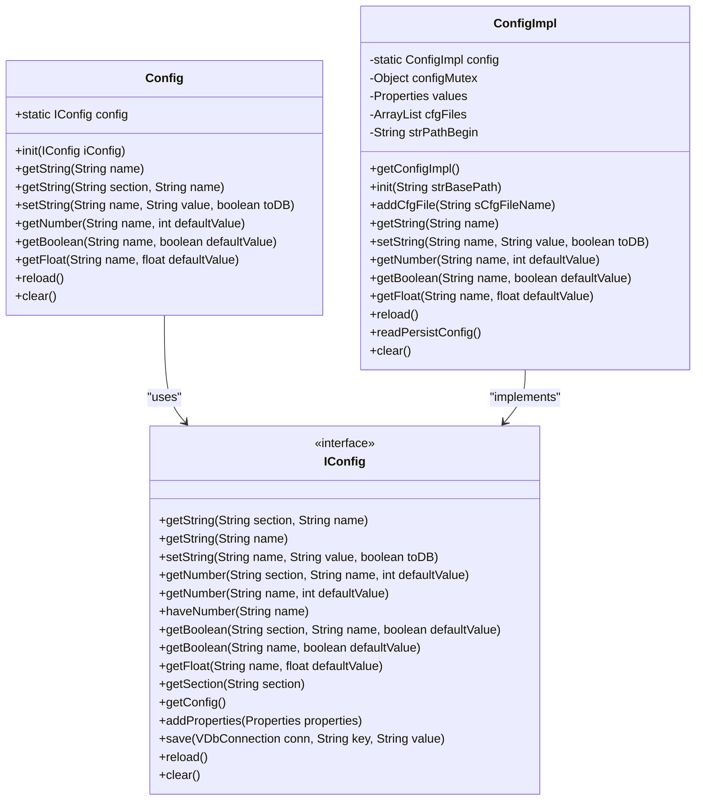
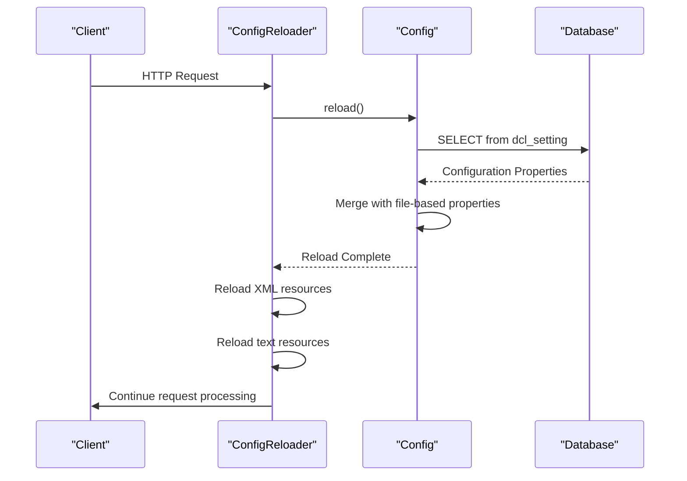
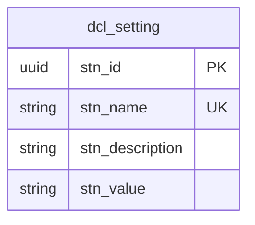
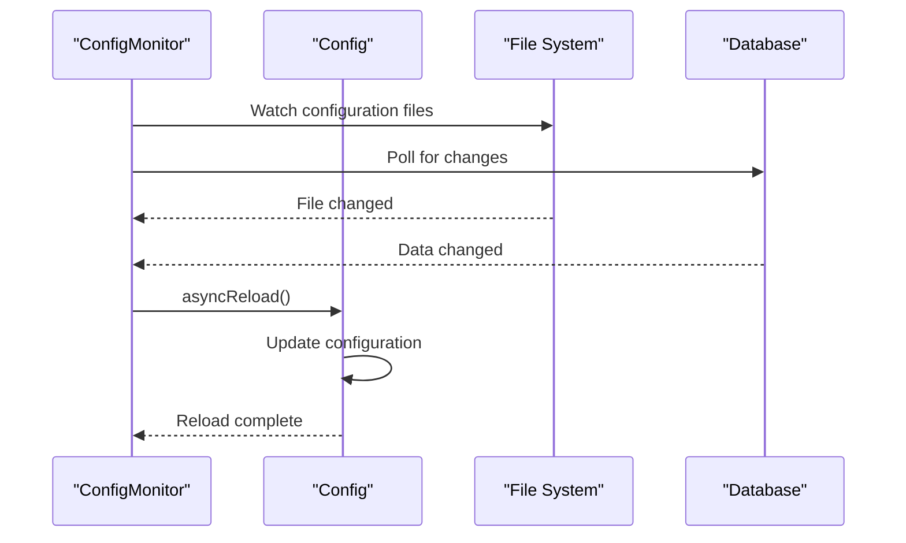

# Configuration Management

<cite>
**Referenced Files in This Document**   
- [Config.java](file://src/main/java/net/sam/dcl/config/Config.java)
- [ConfigImpl.java](file://src/main/java/net/sam/dcl/config/ConfigImpl.java)
- [IConfig.java](file://src/main/java/net/sam/dcl/config/IConfig.java)
- [ConfigReloader.java](file://src/main/java/net/sam/dcl/filters/ConfigReloader.java)
- [InitApp.java](file://src/main/java/net/sam/dcl/servlets/InitApp.java)
- [application.properties](file://src/main/resources/application.properties)
- [main.cfg](file://conf/main.cfg)
- [web.xml](file://src/main/webapp/WEB-INF/web.xml)
</cite>

## Table of Contents
1. [Configuration Management Overview](#configuration-management-overview)
2. [Config Class Implementation](#config-class-implementation)
3. [Dynamic Reloading Mechanism](#dynamic-reloading-mechanism)
4. [Configuration Properties Structure](#configuration-properties-structure)
5. [Practical Usage Examples](#practical-usage-examples)
6. [Performance Implications and Optimization](#performance-implications-and-optimization)

## Configuration Management Overview

The dcl_v3 configuration management system provides a centralized mechanism for managing application settings through a combination of file-based and database-stored properties. The system is designed to support dynamic configuration changes without requiring application restarts, making it suitable for production environments where configuration adjustments need to be made on-the-fly.

The configuration system follows a layered approach, loading settings from multiple sources in a specific order:
1. Properties files (main.cfg and additional configuration files)
2. Database-stored configuration (dcl_setting table)
3. Runtime modifications through the API

This layered approach allows for flexible configuration management, where default settings can be defined in files, overridden by database values, and further modified at runtime as needed.

**Section sources**
- [ConfigImpl.java](file://src/main/java/net/sam/dcl/config/ConfigImpl.java#L0-L54)
- [InitApp.java](file://src/main/java/net/sam/dcl/servlets/InitApp.java#L84-L119)

## Config Class Implementation

The configuration system is built around a singleton pattern implemented through the Config class, which serves as a static facade for configuration access. The actual implementation is provided by the ConfigImpl class, which implements the IConfig interface.



**Diagram sources**
- [Config.java](file://src/main/java/net/sam/dcl/config/Config.java#L0-L53)
- [ConfigImpl.java](file://src/main/java/net/sam/dcl/config/ConfigImpl.java#L0-L54)
- [IConfig.java](file://src/main/java/net/sam/dcl/config/IConfig.java#L0-L34)

The Config class provides a static interface for configuration access, eliminating the need for dependency injection or manual instantiation. The singleton pattern is implemented through a static instance of ConfigImpl, which is initialized during application startup by the InitApp servlet.

Thread safety is ensured through the use of a dedicated configMutex object that synchronizes access to the shared Properties object. This prevents race conditions when multiple threads attempt to read or modify configuration values simultaneously.

The configuration system supports type-safe accessors for different data types:
- getString(): Returns string values with support for %HOME% placeholder replacement
- getNumber(): Parses integer values with error handling
- getFloat(): Parses floating-point values with error handling
- getBoolean(): Converts string values to boolean (supports "1", "true", "yes", etc.)

**Section sources**
- [Config.java](file://src/main/java/net/sam/dcl/config/Config.java#L0-L103)
- [ConfigImpl.java](file://src/main/java/net/sam/dcl/config/ConfigImpl.java#L50-L109)

## Dynamic Reloading Mechanism

The configuration system includes a dynamic reloading mechanism implemented through the ConfigReloader filter, which refreshes configuration on each HTTP request. This ensures that configuration changes made through the administrative interface or directly in the database are immediately available to the application without requiring a restart.



**Diagram sources**
- [ConfigReloader.java](file://src/main/java/net/sam/dcl/filters/ConfigReloader.java#L0-L44)
- [ConfigImpl.java](file://src/main/java/net/sam/dcl/config/ConfigImpl.java#L224-L275)

The reloading process follows these steps:
1. Read all configuration files specified in the configuration
2. Query the dcl_setting table in the database for persisted configuration values
3. Merge file-based and database-based properties, with database values taking precedence
4. Replace any %HOME% placeholders with the base application path

The ConfigReloader filter is configured in web.xml to intercept all requests, ensuring that configuration is reloaded on every request:

```xml
<filter>
    <filter-name>ConfigReloader</filter-name>
    <filter-class>net.sam.dcl.filters.ConfigReloader</filter-class>
</filter>
<filter-mapping>
    <filter-name>ConfigReloader</filter-name>
    <url-pattern>/*</url-pattern>
</filter-mapping>
```

In addition to configuration properties, the filter also reloads related resources such as XML permissions, SQL resources, and text resources (like slogans), ensuring that all configuration-related components are synchronized.

**Section sources**
- [ConfigReloader.java](file://src/main/java/net/sam/dcl/filters/ConfigReloader.java#L0-L44)
- [web.xml](file://src/main/webapp/WEB-INF/web.xml#L34-L74)

## Configuration Properties Structure

The configuration system supports properties related to database, logging, and business rules, with values stored in both file-based and database-stored configurations. The main.cfg file contains the primary configuration, while application.properties contains additional settings for ORM/JPA alignment.

Key configuration categories include:

### Database Configuration
- dbconnect.driver.class.name: JDBC driver class
- dbconnect.connection.url: Database connection URL
- dbconnect.user: Database username
- dbconnect.pwd: Database password
- dbconnect.rConnectNumber: Number of read connections
- dbconnect.wConnectNumber: Number of write connections

### Logging Configuration
- global.encoding: Character encoding for the application
- log.level: Logging level (INFO, DEBUG, etc.)
- log.file: Log file path

### Business Rules Configuration
- dayCountDeductCommercialProposals: Days to deduct for commercial proposals
- dayCountDeductConditionsForContract: Days to deduct for contract conditions
- minCourseCoefficient: Minimum course coefficient for currency conversion
- defaultCPCurrency: Default currency for commercial proposals
- defaultCPTableCurrency: Default table currency for commercial proposals

The configuration system supports section-based organization using dot notation (e.g., "dbconnect.user" where "dbconnect" is the section and "user" is the property name). This allows for logical grouping of related properties.

Database-stored configuration takes precedence over file-based configuration, allowing administrators to override default settings through the application interface. The dcl_setting table stores these persistent configuration values, which are loaded on each reload operation.



**Diagram sources**
- [main.cfg](file://conf/main.cfg)
- [application.properties](file://src/main/resources/application.properties)
- [ConfigImpl.java](file://src/main/java/net/sam/dcl/config/ConfigImpl.java#L272-L326)

**Section sources**
- [main.cfg](file://conf/main.cfg)
- [application.properties](file://src/main/resources/application.properties)

## Practical Usage Examples

### Adding a New Configuration Parameter

To add a new configuration parameter, first define it in the Constants class:

```java
public class Constants implements Serializable {
    // ... existing constants
    final static public String newBusinessRuleThreshold = "newBusinessRuleThreshold";
    final static public String defaultShippingMethod = "defaultShippingMethod";
}
```

Then add the default value to main.cfg:

```properties
# Business Rules
newBusinessRuleThreshold=1000
defaultShippingMethod=STANDARD
```

### Accessing Configuration in Business Logic

Configuration values can be accessed in business logic using the static methods provided by the Config class:

```java
// Access string configuration
String defaultCurrency = Config.getString(Constants.defaultCPCurrency);

// Access numeric configuration with default value
int daysToDeduct = Config.getNumber(Constants.dayCountDeductCommercialProposals, 10);

// Access floating-point configuration
float minCoefficient = Config.getFloat(Constants.minCourseCoefficient, 1.05f);

// Access boolean configuration
boolean enableFeature = Config.getBoolean("feature.toggle.newModule", false);
```

Example from CommercialProposalAction:

```java
// Using configuration in business logic
if (form.getCpr_course() < currencyRate.getCrt_rate() * 
    Config.getFloat(Constants.minCourseCoefficient, 1.05f)) {
    // Apply business rule based on configuration
    form.setCpr_course(currencyRate.getCrt_rate() * 
        Config.getFloat(Constants.minCourseCoefficient, 1.05f));
}
```

### Ensuring Thread Safety

The configuration system is thread-safe by design, with all access to the shared Properties object synchronized using the configMutex:

```java
public String getString(String name) {
    synchronized (configMutex) {
        return replaceHome(values.getProperty(name, ""));
    }
}

public void setString(String name, String value, boolean toDB) {
    synchronized (configMutex) {
        values.setProperty(name, value);
    }
    // Database update happens outside synchronization
    if (toDB) {
        // Update database
    }
}
```

This approach ensures that configuration reads and writes are atomic operations, preventing race conditions in multi-threaded environments.

**Section sources**
- [Constants.java](file://src/main/java/net/sam/dcl/beans/Constants.java#L0-L84)
- [CommercialProposalAction.java](file://src/main/java/net/sam/dcl/action/CommercialProposalAction.java#L410)
- [ConfigImpl.java](file://src/main/java/net/sam/dcl/config/ConfigImpl.java#L50-L109)

## Performance Implications and Optimization

The per-request reloading mechanism has significant performance implications, particularly in high-traffic scenarios. Each HTTP request triggers a full configuration reload, including:
- Reading and parsing configuration files
- Querying the database for persisted configuration
- Merging and processing properties
- Reloading related resources (XML, text files)

This can lead to increased response times and database load, especially when the application experiences high request volumes.

### Performance Analysis

The current implementation reloads configuration on every request, which creates several performance bottlenecks:

1. **Database Overhead**: Each reload executes a SELECT query against the dcl_setting table
2. **File I/O**: Configuration files are read from disk on each reload
3. **CPU Usage**: Properties parsing and merging consumes CPU resources
4. **Memory Allocation**: New Properties objects are created on each reload

### Optimization Strategies

Several strategies can be implemented to optimize configuration access in high-traffic scenarios:

#### 1. Conditional Reloading
Implement timestamp-based checking to reload configuration only when files or database values have changed:

```java
private long lastReloadTime = 0;
private long configFileLastModified = 0;

public void reload() {
    File configFile = new File(cfgFiles.get(0));
    if (configFile.lastModified() > configFileLastModified || 
        System.currentTimeMillis() - lastReloadTime > RELOAD_INTERVAL) {
        
        // Perform actual reload
        performReload();
        configFileLastModified = configFile.lastModified();
        lastReloadTime = System.currentTimeMillis();
    }
}
```

#### 2. Caching with TTL
Implement a time-to-live (TTL) cache for configuration values:

```java
private Map<String, CachedValue> cache = new ConcurrentHashMap<>();
private static final long CACHE_TTL = 30000; // 30 seconds

public String getString(String name) {
    CachedValue cached = cache.get(name);
    if (cached != null && System.currentTimeMillis() - cached.timestamp < CACHE_TTL) {
        return cached.value;
    }
    
    // Cache miss - get from underlying source
    String value = getValueFromSource(name);
    cache.put(name, new CachedValue(value, System.currentTimeMillis()));
    return value;
}
```

#### 3. Selective Reloading
Modify the ConfigReloader to reload configuration only for specific URL patterns or when a reload parameter is present:

```java
public void doFilter(ServletRequest req, ServletResponse resp, FilterChain chain) 
    throws ServletException, IOException {
    
    HttpServletRequest request = (HttpServletRequest) req;
    
    // Only reload for admin pages or when reload parameter is present
    if (request.getRequestURI().startsWith("/admin/") || 
        "true".equals(request.getParameter("reloadConfig"))) {
        Config.reload();
    }
    
    chain.doFilter(req, resp);
}
```

#### 4. Asynchronous Reloading
Implement background configuration monitoring with asynchronous updates:



**Diagram sources**
- [ConfigReloader.java](file://src/main/java/net/sam/dcl/filters/ConfigReloader.java#L0-L44)
- [ConfigImpl.java](file://src/main/java/net/sam/dcl/config/ConfigImpl.java#L224-L275)

The recommended approach for high-traffic scenarios is to implement conditional reloading with a reasonable TTL (e.g., 30-60 seconds), balancing the need for up-to-date configuration with performance requirements. This reduces the reload frequency from per-request to periodic, significantly decreasing the performance impact while still allowing configuration changes to propagate within an acceptable timeframe.

**Section sources**
- [ConfigReloader.java](file://src/main/java/net/sam/dcl/filters/ConfigReloader.java#L0-L44)
- [ConfigImpl.java](file://src/main/java/net/sam/dcl/config/ConfigImpl.java#L224-L275)