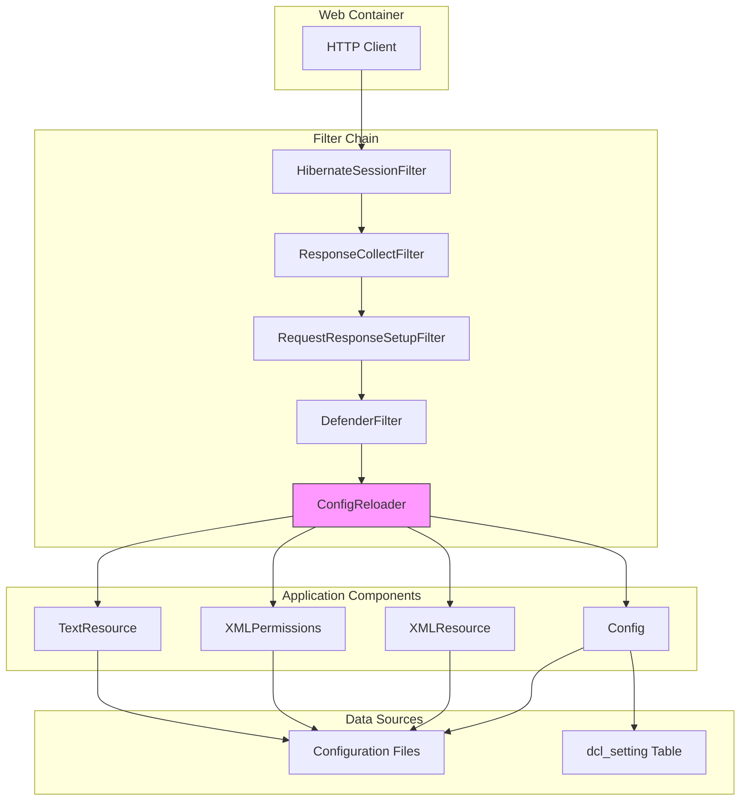
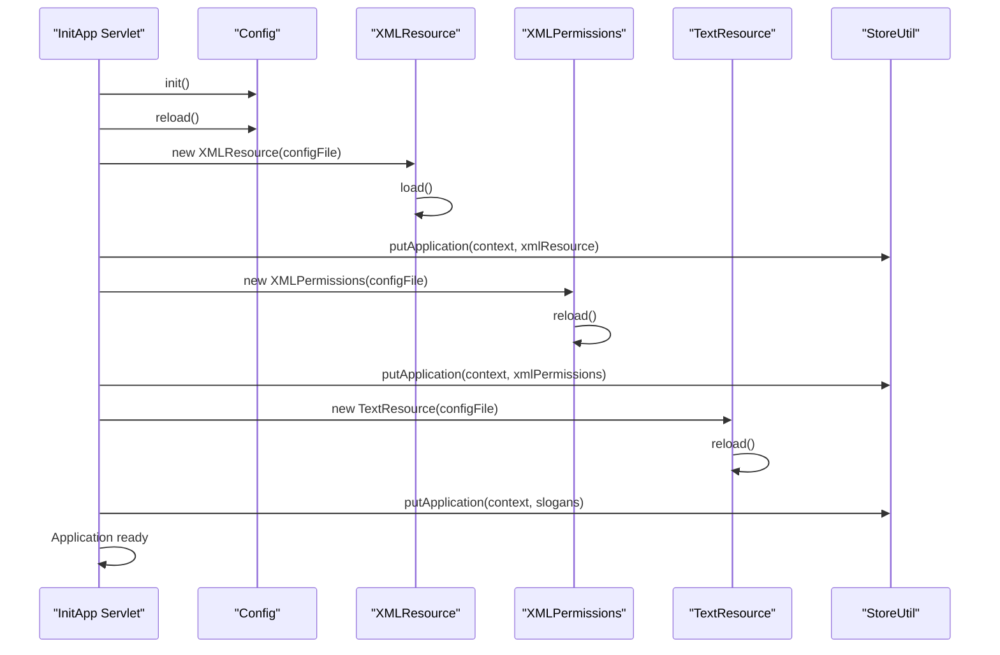
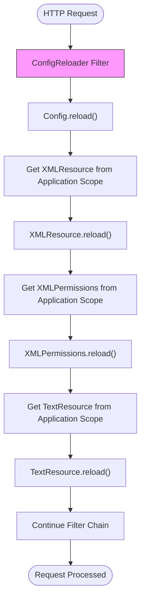

# Runtime Configuration Reloading

<cite>
**Referenced Files in This Document**   
- [ConfigReloader.java](file://src/main/java/net/sam/dcl/filters/ConfigReloader.java)
- [web.xml](file://src/main/webapp/WEB-INF/web.xml)
- [Config.java](file://src/main/java/net/sam/dcl/config/Config.java)
- [ConfigImpl.java](file://src/main/java/net/sam/dcl/config/ConfigImpl.java)
- [XMLResource.java](file://src/main/java/net/sam/dcl/util/XMLResource.java)
- [XMLPermissions.java](file://src/main/java/net/sam/dcl/navigation/XMLPermissions.java)
- [TextResource.java](file://src/main/java/net/sam/dcl/util/TextResource.java)
- [InitApp.java](file://src/main/java/net/sam/dcl/servlets/InitApp.java)
- [StoreUtil.java](file://src/main/java/net/sam/dcl/util/StoreUtil.java)
- [log4j.properties](file://src/main/resources/log4j.properties)
</cite>

## Table of Contents
1. [Introduction](#introduction)
2. [Architecture Overview](#architecture-overview)
3. [Initialization Sequence](#initialization-sequence)
4. [Runtime Configuration Reloading Mechanism](#runtime-configuration-reloading-mechanism)
5. [Performance Implications](#performance-implications)
6. [Troubleshooting and Monitoring](#troubleshooting-and-monitoring)
7. [Optimization Strategies](#optimization-strategies)
8. [Conclusion](#conclusion)

## Introduction
The dcl_v3 application implements a comprehensive runtime configuration reloading mechanism that ensures the system always operates with the most current configuration data. This document details the architecture, implementation, and operational characteristics of this mechanism, which refreshes configuration data on every HTTP request. The system is designed to support dynamic updates to permissions, SQL resources, and text resources without requiring application restarts, making it particularly valuable for environments where configuration changes need to be applied immediately.

**Section sources**
- [ConfigReloader.java](file://src/main/java/net/sam/dcl/filters/ConfigReloader.java#L1-L44)
- [InitApp.java](file://src/main/java/net/sam/dcl/servlets/InitApp.java#L0-L301)

## Architecture Overview
The configuration reloading system in dcl_v3 follows a layered architecture with clear separation of concerns. At its core, the system uses a servlet filter chain integrated with the application's startup initialization process to ensure configuration consistency across the entire application lifecycle.

**Diagram sources**
- [ConfigReloader.java](file://src/main/java/net/sam/dcl/filters/ConfigReloader.java#L1-L44)
- [web.xml](file://src/main/webapp/WEB-INF/web.xml#L34-L74)

**Section sources**
- [ConfigReloader.java](file://src/main/java/net/sam/dcl/filters/ConfigReloader.java#L1-L44)
- [web.xml](file://src/main/webapp/WEB-INF/web.xml#L0-L175)

## Initialization Sequence
The configuration system is initialized during application startup through the InitApp servlet, which is configured with load-on-startup priority. This initialization sequence establishes the initial state of all configuration resources before the application becomes available to handle requests.

**Diagram sources**
- [InitApp.java](file://src/main/java/net/sam/dcl/servlets/InitApp.java#L117-L190)
- [StoreUtil.java](file://src/main/java/net/sam/dcl/util/StoreUtil.java#L47-L95)

**Section sources**
- [InitApp.java](file://src/main/java/net/sam/dcl/servlets/InitApp.java#L0-L301)
- [StoreUtil.java](file://src/main/java/net/sam/dcl/util/StoreUtil.java#L0-L96)

## Runtime Configuration Reloading Mechanism
The core of the runtime configuration reloading mechanism is the ConfigReloader filter, which intercepts every HTTP request and refreshes all configuration resources. This ensures that any changes to configuration files or database-stored settings are immediately reflected in application behavior.

The reloading process follows a specific sequence:
1. Reload the main Config object, which refreshes both file-based and database-stored configuration properties
2. Retrieve the XMLResource object from application scope and reload its content
3. Retrieve the XMLPermissions object from application scope and reload its content
4. Retrieve the TextResource object from application scope and reload its content
5. Continue processing the request through the filter chain

**Diagram sources**
- [ConfigReloader.java](file://src/main/java/net/sam/dcl/filters/ConfigReloader.java#L20-L35)
- [Config.java](file://src/main/java/net/sam/dcl/config/Config.java#L110-L115)
- [XMLResource.java](file://src/main/java/net/sam/dcl/util/XMLResource.java#L65-L75)
- [XMLPermissions.java](file://src/main/java/net/sam/dcl/navigation/XMLPermissions.java#L90-L100)
- [TextResource.java](file://src/main/java/net/sam/dcl/util/TextResource.java#L65-L75)

**Section sources**
- [ConfigReloader.java](file://src/main/java/net/sam/dcl/filters/ConfigReloader.java#L1-L44)
- [Config.java](file://src/main/java/net/sam/dcl/config/Config.java#L0-L131)
- [ConfigImpl.java](file://src/main/java/net/sam/dcl/config/ConfigImpl.java#L168-L366)

## Performance Implications
The per-request reloading mechanism has significant performance implications that must be considered in high-traffic environments. Each HTTP request triggers file I/O operations to reload configuration resources and database queries to refresh configuration properties.

The primary performance considerations include:
- **File I/O overhead**: Each reload operation reads configuration files from disk
- **Database queries**: The Config.reload() method queries the dcl_setting table
- **Memory allocation**: New objects are created during the reload process
- **Synchronization overhead**: All reload operations are synchronized to prevent race conditions

This design prioritizes configuration freshness over performance, making it suitable for applications where configuration changes must be immediately effective, such as dynamic permission updates in security-sensitive environments.

**Section sources**
- [ConfigImpl.java](file://src/main/java/net/sam/dcl/config/ConfigImpl.java#L224-L275)
- [XMLResource.java](file://src/main/java/net/sam/dcl/util/XMLResource.java#L65-L75)
- [XMLPermissions.java](file://src/main/java/net/sam/dcl/navigation/XMLPermissions.java#L90-L100)
- [TextResource.java](file://src/main/java/net/sam/dcl/util/TextResource.java#L65-L75)

## Troubleshooting and Monitoring
The configuration reloading system provides comprehensive logging through the log4j framework, enabling effective troubleshooting and monitoring of reload operations. The logging configuration in log4j.properties defines multiple appenders for different log levels and destinations.

Key troubleshooting considerations:
- Monitor the log4j-dcl file for DEBUG-level messages from the configuration system
- Check for error messages related to file reading or database connectivity
- Verify that configuration files exist in the expected locations
- Ensure the dcl_setting table is accessible and contains the expected data

The system logs specific messages for successful and failed reload operations, making it possible to track configuration changes and diagnose issues with the reloading mechanism.

**Section sources**
- [log4j.properties](file://src/main/resources/log4j.properties#L0-L121)
- [ConfigImpl.java](file://src/main/java/net/sam/dcl/config/ConfigImpl.java#L224-L275)
- [XMLResource.java](file://src/main/java/net/sam/dcl/util/XMLResource.java#L65-L75)

## Optimization Strategies
For high-traffic environments, several optimization strategies can be implemented to reduce the performance impact of the per-request reloading mechanism:

1. **Conditional reloading**: Implement file modification timestamp checking to reload configuration only when files have changed
2. **Caching with TTL**: Introduce a time-to-live (TTL) cache for configuration data to limit reload frequency
3. **Selective reloading**: Reload only specific configuration components based on request characteristics
4. **Asynchronous reloading**: Move configuration reloading to a background thread to avoid blocking request processing

These optimizations would modify the ConfigReloader filter to include conditional logic that determines whether a full reload is necessary, balancing the need for up-to-date configuration with performance requirements.

**Section sources**
- [ConfigReloader.java](file://src/main/java/net/sam/dcl/filters/ConfigReloader.java#L20-L35)
- [ConfigImpl.java](file://src/main/java/net/sam/dcl/config/ConfigImpl.java#L224-L275)

## Conclusion
The runtime configuration reloading mechanism in dcl_v3 provides a robust solution for maintaining up-to-date configuration data across the application. By leveraging the servlet filter chain and application scope storage, the system ensures that configuration changes are immediately reflected in application behavior without requiring restarts. While the per-request reloading approach has performance implications, it is essential for scenarios requiring immediate propagation of configuration changes, such as dynamic permission updates. For high-traffic environments, implementing optimization strategies like conditional reloading or caching can help balance freshness requirements with performance needs.