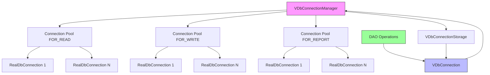
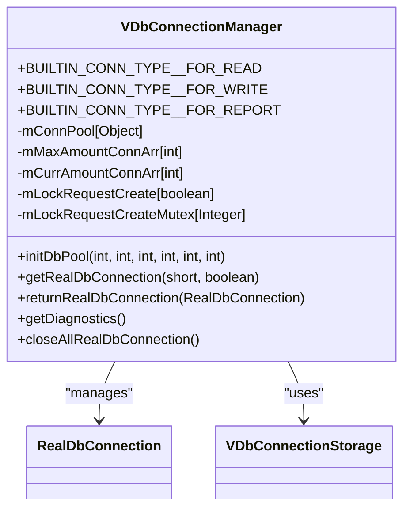
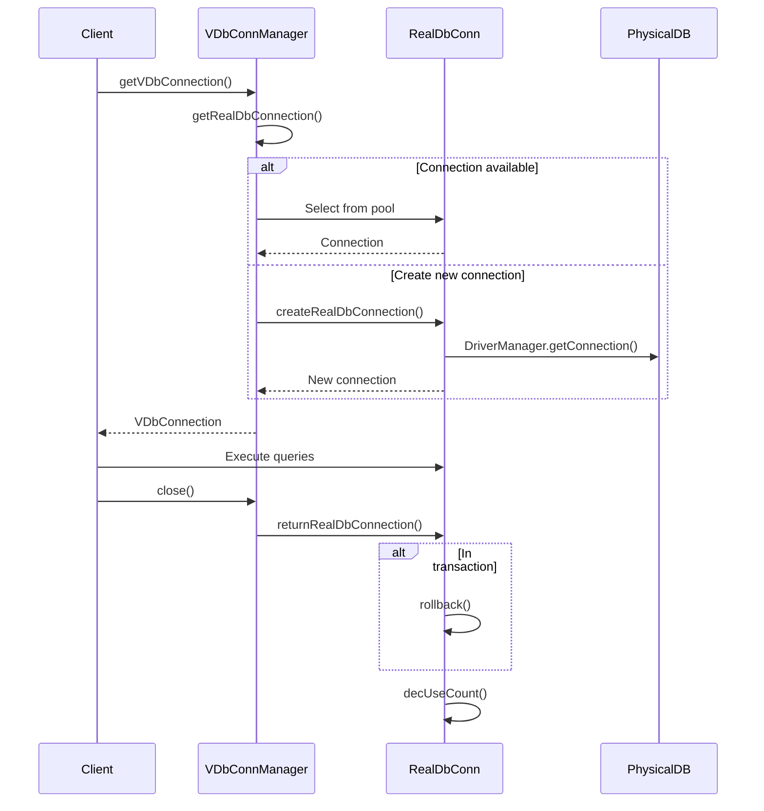
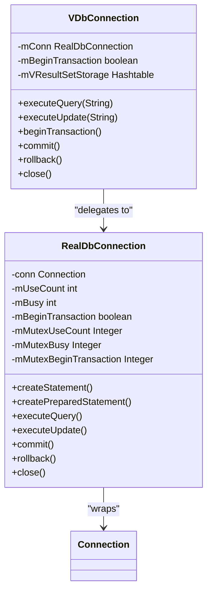
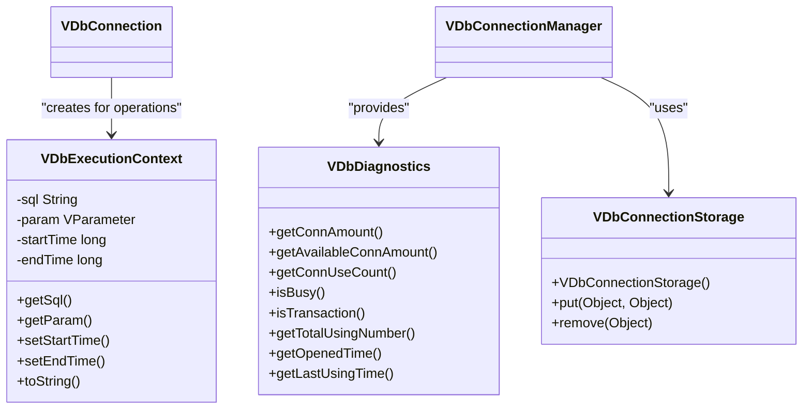
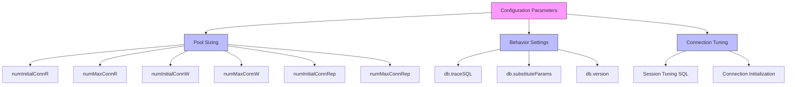
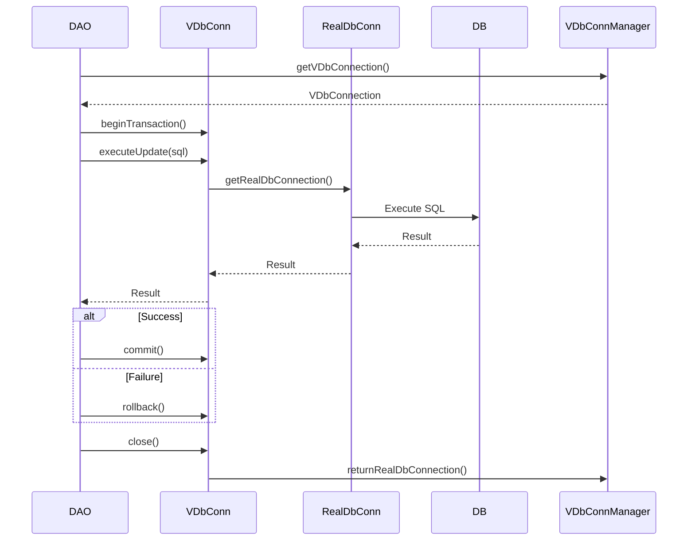
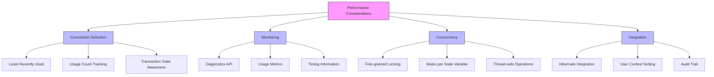

# Connection Pooling

<cite>
**Referenced Files in This Document**   
- [VDbConnectionManager.java](file://src/main/java/net/sam/dcl/db/VDbConnectionManager.java)
- [VDbConnection.java](file://src/main/java/net/sam/dcl/db/VDbConnection.java)
- [RealDbConnection.java](file://src/main/java/net/sam/dcl/db/RealDbConnection.java)
- [VDbConnectionStorage.java](file://src/main/java/net/sam/dcl/db/VDbConnectionStorage.java)
- [VDbExecutionContext.java](file://src/main/java/net/sam/dcl/db/VDbExecutionContext.java)
- [application.properties](file://src/main/resources/application.properties)
- [HibernateUtil.java](file://src/main/java/net/sam/dcl/util/HibernateUtil.java)
- [Config.java](file://src/main/java/net/sam/dcl/config/Config.java)
</cite>

## Table of Contents
1. [Introduction](#introduction)
2. [Connection Pool Architecture](#connection-pool-architecture)
3. [VDbConnectionManager: Pool Management](#vdbconnectionmanager-pool-management)
4. [Connection Acquisition and Release](#connection-acquisition-and-release)
5. [Virtual and Physical Connection Abstraction](#virtual-and-physical-connection-abstraction)
6. [Connection State and Context Management](#connection-state-and-context-management)
7. [Configuration and Pool Parameters](#configuration-and-pool-parameters)
8. [DAO Usage Patterns](#dao-usage-patterns)
9. [Performance and Monitoring](#performance-and-monitoring)
10. [Troubleshooting Connection Issues](#troubleshooting-connection-issues)

## Introduction

The dcl_v3 application implements a custom connection pooling mechanism designed to efficiently manage Firebird database connections across multiple concurrent users. This system provides a sophisticated abstraction layer over physical database connections, enabling optimal resource utilization, transaction management, and integration with Hibernate's session management framework. The connection pooling architecture is built around several key components that work together to provide reliable, high-performance database access while preventing common issues such as connection leaks and exhaustion.

The core of this system revolves around the VDbConnectionManager, which maintains separate pools for different connection types (read, write, report) with configurable sizes. This allows the application to optimize connection usage based on the specific requirements of different operations. The system also incorporates sophisticated connection lifecycle management, including automatic rollback of uncommitted transactions, connection reuse tracking, and comprehensive monitoring capabilities.

**Section sources**
- [VDbConnectionManager.java](file://src/main/java/net/sam/dcl/db/VDbConnectionManager.java#L1-L50)
- [VDbConnection.java](file://src/main/java/net/sam/dcl/db/VDbConnection.java#L1-L50)

## Connection Pool Architecture

The connection pooling system in dcl_v3 follows a multi-tiered architecture that separates concerns between connection management, abstraction, and state tracking. At the foundation lies the physical database connection management handled by the RealDbConnection class, which wraps the actual JDBC Connection object and provides additional monitoring and lifecycle management capabilities.

Above this layer, the VDbConnectionManager acts as the central coordinator, maintaining separate pools for different connection types and managing the allocation and return of connections. The manager implements a sophisticated selection algorithm that considers connection usage count, transaction status, and availability when allocating connections from the pool.

The architecture supports three primary connection types:
- **FOR_READ**: Optimized for read-only operations with auto-commit enabled
- **FOR_WRITE**: Designed for transactional write operations
- **FOR_REPORT**: Intended for long-running reporting queries

This separation allows the system to apply different configuration and tuning parameters to each connection type based on its intended use case.



**Diagram sources**
- [VDbConnectionManager.java](file://src/main/java/net/sam/dcl/db/VDbConnectionManager.java#L1-L100)
- [VDbConnection.java](file://src/main/java/net/sam/dcl/db/VDbConnection.java#L1-L50)
- [RealDbConnection.java](file://src/main/java/net/sam/dcl/db/RealDbConnection.java#L1-L50)

**Section sources**
- [VDbConnectionManager.java](file://src/main/java/net/sam/dcl/db/VDbConnectionManager.java#L1-L100)
- [RealDbConnection.java](file://src/main/java/net/sam/dcl/db/RealDbConnection.java#L1-L100)

## VDbConnectionManager: Pool Management

The VDbConnectionManager serves as the central component for managing the connection pools in the dcl_v3 application. It provides comprehensive lifecycle management for database connections, including initialization, allocation, and cleanup. The manager maintains separate pools for different connection types, allowing for optimized resource allocation based on the specific requirements of various operations.

During initialization, the manager establishes the connection pools with specified initial and maximum sizes for each connection type. The initDbPool method configures these parameters, creating arrays to track the current and maximum number of connections for read, write, and reporting operations. The manager also handles database driver initialization through dedicated methods for different database types, though the current implementation focuses on Firebird connectivity.

The manager implements sophisticated synchronization mechanisms to ensure thread-safe access to the connection pools. Each connection type has its own mutex objects for coordinating access to pool state, preventing race conditions during connection allocation and return. The manager also tracks module status, providing visibility into the initialization state and operational health of the connection system.



**Diagram sources**
- [VDbConnectionManager.java](file://src/main/java/net/sam/dcl/db/VDbConnectionManager.java#L1-L200)

**Section sources**
- [VDbConnectionManager.java](file://src/main/java/net/sam/dcl/db/VDbConnectionManager.java#L1-L300)

## Connection Acquisition and Release

The connection acquisition and release process in dcl_v3 follows a well-defined lifecycle that ensures efficient resource utilization and prevents connection leaks. When a component requests a database connection, the VDbConnectionManager's getRealDbConnection method is invoked, which implements a sophisticated algorithm to select the most appropriate connection from the pool.

The selection process prioritizes connections based on several criteria: availability (non-busy state), transaction status (not already in a transaction), and usage count (least recently used). For write operations, the system ensures that connections are not already participating in a transaction, preventing potential conflicts. If no suitable connection is available and the pool has not reached its maximum size, a new physical connection is created through the createRealDbConnection method.

When connections are returned to the pool via the returnRealDbConnection method, the system performs important cleanup operations. If a connection is still in a transaction state, an automatic rollback is performed to prevent transaction leaks. The connection's usage count is decremented, making it available for subsequent requests. This automatic cleanup mechanism is crucial for maintaining pool integrity, especially in error conditions where applications might fail to properly close connections.



**Diagram sources**
- [VDbConnectionManager.java](file://src/main/java/net/sam/dcl/db/VDbConnectionManager.java#L400-L800)
- [RealDbConnection.java](file://src/main/java/net/sam/dcl/db/RealDbConnection.java#L300-L400)

**Section sources**
- [VDbConnectionManager.java](file://src/main/java/net/sam/dcl/db/VDbConnectionManager.java#L400-L800)
- [RealDbConnection.java](file://src/main/java/net/sam/dcl/db/RealDbConnection.java#L300-L400)

## Virtual and Physical Connection Abstraction

The dcl_v3 connection pooling system implements a two-layer abstraction model that separates virtual connections (VDbConnection) from physical connections (RealDbConnection). This architecture provides a clean separation between the application's view of database connectivity and the underlying physical resources.

The VDbConnection class serves as the primary interface for application components, providing a rich API for executing SQL statements, managing transactions, and handling result sets. It acts as a facade that hides the complexity of connection pooling from the application code. Each VDbConnection maintains a reference to a RealDbConnection from the pool, but this mapping can change over time as connections are returned to and acquired from the pool.

The RealDbConnection class wraps the actual JDBC Connection object, adding monitoring, lifecycle tracking, and synchronization capabilities. It maintains several state variables including usage count, busy status, and transaction status, which the connection manager uses to make intelligent allocation decisions. The RealDbConnection also implements fine-grained synchronization using mutex objects for each state variable, ensuring thread-safe access to connection state.

This abstraction allows the system to implement sophisticated connection reuse strategies while providing applications with the illusion of dedicated database connections.



**Diagram sources**
- [VDbConnection.java](file://src/main/java/net/sam/dcl/db/VDbConnection.java#L1-L200)
- [RealDbConnection.java](file://src/main/java/net/sam/dcl/db/RealDbConnection.java#L1-L200)

**Section sources**
- [VDbConnection.java](file://src/main/java/net/sam/dcl/db/VDbConnection.java#L1-L200)
- [RealDbConnection.java](file://src/main/java/net/sam/dcl/db/RealDbConnection.java#L1-L200)

## Connection State and Context Management

The dcl_v3 connection pooling system incorporates sophisticated state and context management to track connection usage and maintain execution context. The VDbConnectionStorage class serves as a registry for active virtual connections, allowing the system to monitor and manage the lifecycle of all open connections. Although currently implemented as a simple Hashtable extension, this component provides the foundation for connection tracking and potential future enhancements like connection validation and cleanup.

The VDbExecutionContext class plays a crucial role in tracking the context of database operations, capturing information about SQL statements, parameters, and execution timing. This context information is used for logging, auditing, and troubleshooting purposes. Each database operation creates an execution context that travels with the request through the connection stack, enabling comprehensive tracing of database interactions.

The system also maintains detailed diagnostics information through the getDiagnostics method, which exposes metrics such as connection usage counts, busy status, transaction status, and timing information. This monitoring capability allows administrators to assess pool utilization and identify potential bottlenecks or configuration issues.



**Diagram sources**
- [VDbConnectionStorage.java](file://src/main/java/net/sam/dcl/db/VDbConnectionStorage.java#L1-L20)
- [VDbExecutionContext.java](file://src/main/java/net/sam/dcl/db/VDbExecutionContext.java#L1-L50)
- [VDbConnectionManager.java](file://src/main/java/net/sam/dcl/db/VDbConnectionManager.java#L1000-L1100)

**Section sources**
- [VDbConnectionStorage.java](file://src/main/java/net/sam/dcl/db/VDbConnectionStorage.java#L1-L65)
- [VDbExecutionContext.java](file://src/main/java/net/sam/dcl/db/VDbExecutionContext.java#L1-L100)

## Configuration and Pool Parameters

The connection pooling behavior in dcl_v3 is controlled by several configuration parameters that determine pool sizing, behavior, and operational characteristics. The initDbPool method accepts parameters for initial and maximum connection counts for each connection type (read, write, report), allowing administrators to tune the pool based on expected workload patterns.

The system also incorporates configuration-driven behavior through the Config class, which provides access to application properties. Key configuration parameters include:
- **db.traceSQL**: Enables or disables SQL tracing for diagnostic purposes
- **db.substituteParams**: Controls parameter substitution in SQL statements
- **db.version**: Specifies the expected database version for compatibility checking

The connection manager implements safety checks to validate configuration parameters, ensuring that initial connection counts do not exceed maximum limits and that negative values are normalized to zero. The system also supports connection tuning through SQL statements that can be executed when connections are created, allowing for database-specific optimizations.



**Diagram sources**
- [VDbConnectionManager.java](file://src/main/java/net/sam/dcl/db/VDbConnectionManager.java#L200-L300)
- [Config.java](file://src/main/java/net/sam/dcl/config/Config.java#L1-L50)
- [application.properties](file://src/main/resources/application.properties#L1-L20)

**Section sources**
- [VDbConnectionManager.java](file://src/main/java/net/sam/dcl/db/VDbConnectionManager.java#L200-L400)
- [Config.java](file://src/main/java/net/sam/dcl/config/Config.java#L1-L100)

## DAO Usage Patterns

Data Access Object (DAO) components in dcl_v3 interact with the connection pooling system through well-defined patterns that ensure proper resource management and transaction integrity. DAO methods typically obtain a VDbConnection through the VDbConnectionManager's getVDbConnection method, perform database operations, and ensure proper cleanup through try-finally blocks or similar constructs.

The VDbConnection API provides comprehensive methods for executing various types of SQL operations, including executeQuery for SELECT statements, executeUpdate for INSERT/UPDATE/DELETE operations, and executeCall for stored procedure calls. These methods handle the underlying connection management automatically, including statement creation and cleanup.

A key pattern in DAO usage is the proper handling of transactions. When operations require transactional integrity, the beginTransaction method is called on the VDbConnection, followed by the relevant database operations, and concluded with either commit or rollback. The system's automatic rollback mechanism in the returnRealDbConnection method provides a safety net for cases where applications fail to properly close transactions.



**Diagram sources**
- [VDbConnection.java](file://src/main/java/net/sam/dcl/db/VDbConnection.java#L200-L500)
- [RealDbConnection.java](file://src/main/java/net/sam/dcl/db/RealDbConnection.java#L200-L300)

**Section sources**
- [VDbConnection.java](file://src/main/java/net/sam/dcl/db/VDbConnection.java#L200-L600)
- [RealDbConnection.java](file://src/main/java/net/sam/dcl/db/RealDbConnection.java#L200-L400)

## Performance and Monitoring

The dcl_v3 connection pooling system incorporates several performance optimization and monitoring features to ensure efficient database access and facilitate troubleshooting. The connection selection algorithm prioritizes least-recently-used connections, promoting even distribution of load across the pool and preventing "connection sticking" where a small subset of connections handles most of the workload.

The system includes comprehensive monitoring capabilities through the getDiagnostics method, which exposes detailed metrics about pool utilization, including connection counts, usage frequencies, busy status, and timing information. These diagnostics enable administrators to assess whether pool sizing is appropriate for the current workload and identify potential bottlenecks.

Performance optimizations include connection reuse tracking through the use count mechanism, which helps identify connections that are frequently accessed versus those that remain idle. The system also implements fine-grained synchronization using dedicated mutex objects for different state variables, minimizing contention and allowing for high levels of concurrency.

The integration with Hibernate through the DCLConnectionProvider ensures that database connections are properly associated with the current user context, enabling audit capabilities without compromising performance.



**Diagram sources**
- [VDbConnectionManager.java](file://src/main/java/net/sam/dcl/db/VDbConnectionManager.java#L800-L1000)
- [RealDbConnection.java](file://src/main/java/net/sam/dcl/db/RealDbConnection.java#L400-L600)
- [HibernateUtil.java](file://src/main/java/net/sam/dcl/util/HibernateUtil.java#L79-L130)

**Section sources**
- [VDbConnectionManager.java](file://src/main/java/net/sam/dcl/db/VDbConnectionManager.java#L800-L1134)
- [RealDbConnection.java](file://src/main/java/net/sam/dcl/db/RealDbConnection.java#L400-L622)
- [HibernateUtil.java](file://src/main/java/net/sam/dcl/util/HibernateUtil.java#L79-L130)

## Troubleshooting Connection Issues

Effective troubleshooting of connection-related issues in dcl_v3 requires understanding the system's behavior under various failure conditions and utilizing the available diagnostic tools. Common issues include connection exhaustion, network failures, and transaction leaks, each requiring specific diagnostic approaches and resolution strategies.

For connection exhaustion issues, administrators should first check the pool configuration parameters to ensure they are appropriate for the current workload. The getDiagnostics method provides visibility into pool utilization, showing the number of active connections, their usage patterns, and whether the pool is reaching its maximum capacity. If the pool is consistently at maximum capacity, increasing the maximum connection limits or optimizing application code to release connections more promptly may be necessary.

Network-related failures are typically handled by the underlying JDBC driver, but the connection pooling system provides some resilience through its connection validation during acquisition. If a physical connection is found to be invalid, the system will attempt to create a new one. Monitoring logs for connection creation and closure patterns can help identify intermittent network issues.

The system's automatic rollback mechanism helps prevent transaction leaks, but applications should still follow proper try-catch-finally patterns to ensure connections are properly closed. The VDbConnectionStorage can be inspected to identify any connections that remain open longer than expected, which may indicate resource leaks in application code.

```mermaid
flowchart TD
A[Troubleshooting Connection Issues] --> B[Connection Exhaustion]
A --> C[Network Failures]
A --> D[Transaction Leaks]
A --> E[Performance Problems]
B --> B1[Check pool configuration]
B --> B2[Use getDiagnostics()]
B --> B3[Monitor usage patterns]
B --> B4[Adjust pool sizes]
C --> C1[Check connection validation]
C --> C2[Monitor error logs]
C --> C3[Verify network stability]
C --> C4[Implement retry logic]
D --> D1[Verify proper close() calls]
D --> D2[Check for exceptions]
D --> D3[Use try-finally blocks]
D --> D4[Monitor transaction state]
E --> E1[Analyze connection selection]
E --> E2[Check for contention]
E --> E3[Review SQL performance]
E --> E4[Optimize connection tuning]
style A fill:#f9f,stroke:#333
style B fill:#fbb,stroke:#333
style C fill:#fbb,stroke:#333
style D fill:#fbb,stroke:#333
style E fill:#fbb,stroke:#333
```

**Diagram sources**
- [VDbConnectionManager.java](file://src/main/java/net/sam/dcl/db/VDbConnectionManager.java#L800-L1134)
- [VDbConnection.java](file://src/main/java/net/sam/dcl/db/VDbConnection.java#L1000-L1400)
- [RealDbConnection.java](file://src/main/java/net/sam/dcl/db/RealDbConnection.java#L500-L600)

**Section sources**
- [VDbConnectionManager.java](file://src/main/java/net/sam/dcl/db/VDbConnectionManager.java#L800-L1134)
- [VDbConnection.java](file://src/main/java/net/sam/dcl/db/VDbConnection.java#L1000-L1462)
- [RealDbConnection.java](file://src/main/java/net/sam/dcl/db/RealDbConnection.java#L500-L622)