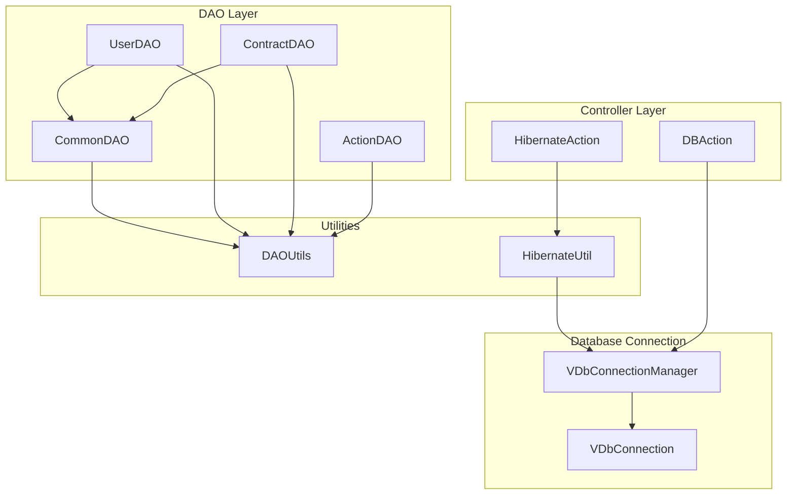
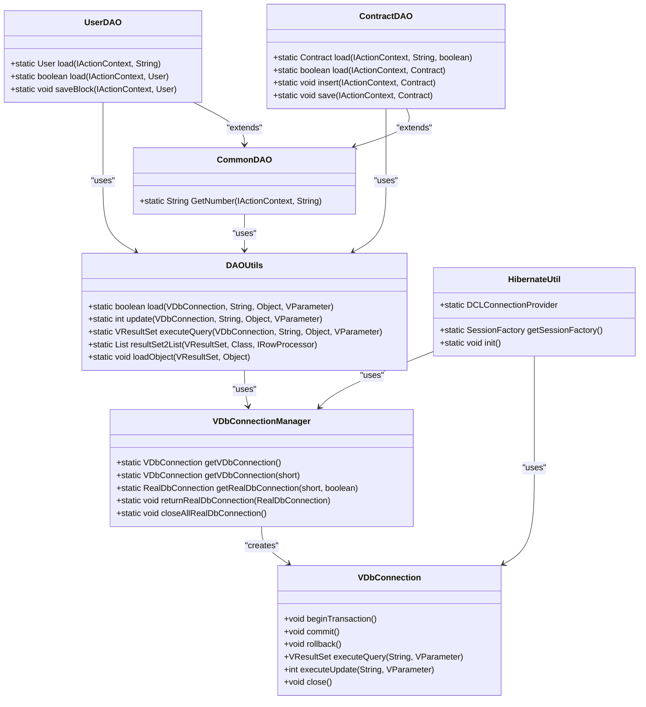
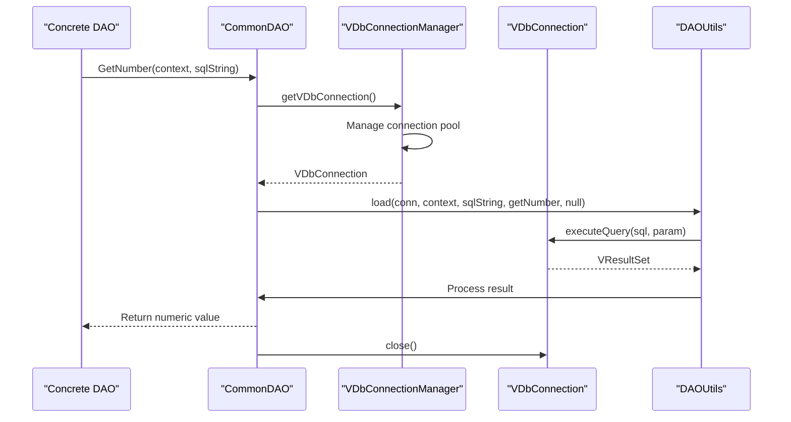
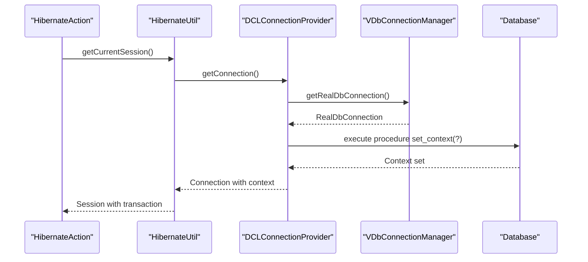
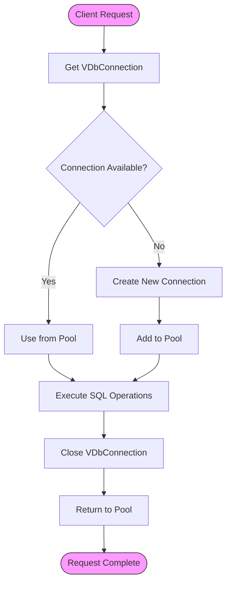
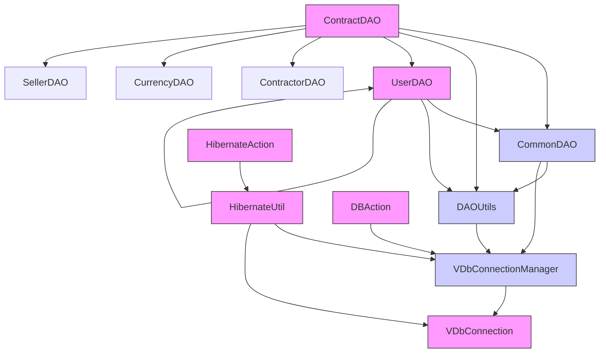

# DAO Base Classes

<cite>
**Referenced Files in This Document**   
- [CommonDAO.java](file://src/main/java/net/sam/dcl/dao/CommonDAO.java)
- [HibernateUtil.java](file://src/main/java/net/sam/dcl/util/HibernateUtil.java)
- [VDbConnectionManager.java](file://src/main/java/net/sam/dcl/db/VDbConnectionManager.java)
- [VDbConnection.java](file://src/main/java/net/sam/dcl/db/VDbConnection.java)
- [DAOUtils.java](file://src/main/java/net/sam/dcl/util/DAOUtils.java)
- [UserDAO.java](file://src/main/java/net/sam/dcl/dao/UserDAO.java)
- [ContractDAO.java](file://src/main/java/net/sam/dcl/dao/ContractDAO.java)
- [DBAction.java](file://src/main/java/net/sam/dcl/controller/actions/DBAction.java)
- [HibernateAction.java](file://src/main/java/net/sam/dcl/controller/actions/HibernateAction.java)
</cite>

## Table of Contents
1. [Introduction](#introduction)
2. [Project Structure](#project-structure)
3. [Core Components](#core-components)
4. [Architecture Overview](#architecture-overview)
5. [Detailed Component Analysis](#detailed-component-analysis)
6. [Dependency Analysis](#dependency-analysis)
7. [Performance Considerations](#performance-considerations)
8. [Troubleshooting Guide](#troubleshooting-guide)
9. [Conclusion](#conclusion)

## Introduction
The DAO (Data Access Object) base classes in the dcl_v3 application provide a foundational layer for data access operations across the system. The CommonDAO class serves as the central abstraction point for database interactions, encapsulating common patterns for connection management, transaction handling, and data retrieval. This documentation explores the design and implementation of the CommonDAO class and its relationship with other components in the data access layer, including Hibernate integration through HibernateUtil and connection management via VDbConnectionManager.

## Project Structure
The DAO components are organized within the src/main/java/net/sam/dcl/dao package, with related utilities in the src/main/java/net/sam/dcl/util and src/main/java/net/sam/dcl/db packages. The structure follows a layered architecture where DAO classes interact with the database through connection management classes and utility helpers, while being consumed by action classes in the controller layer.

**Diagram sources**
- [CommonDAO.java](file://src/main/java/net/sam/dcl/dao/CommonDAO.java)
- [DAOUtils.java](file://src/main/java/net/sam/dcl/util/DAOUtils.java)
- [VDbConnectionManager.java](file://src/main/java/net/sam/dcl/db/VDbConnectionManager.java)
- [VDbConnection.java](file://src/main/java/net/sam/dcl/db/VDbConnection.java)
- [DBAction.java](file://src/main/java/net/sam/dcl/controller/actions/DBAction.java)
- [HibernateAction.java](file://src/main/java/net/sam/dcl/controller/actions/HibernateAction.java)

**Section sources**
- [src/main/java/net/sam/dcl/dao](file://src/main/java/net/sam/dcl/dao)
- [src/main/java/net/sam/dcl/util](file://src/main/java/net/sam/dcl/util)
- [src/main/java/net/sam/dcl/db](file://src/main/java/net/sam/dcl/db)

## Core Components
The core components of the DAO layer include CommonDAO as the base class for data access operations, DAOUtils as the utility class for database operations, VDbConnectionManager for connection pooling and management, and HibernateUtil for Hibernate session integration. These components work together to provide a consistent interface for database interactions while abstracting the underlying connection and transaction management details.

**Section sources**
- [CommonDAO.java](file://src/main/java/net/sam/dcl/dao/CommonDAO.java#L7-L47)
- [DAOUtils.java](file://src/main/java/net/sam/dcl/util/DAOUtils.java#L15-L188)
- [VDbConnectionManager.java](file://src/main/java/net/sam/dcl/db/VDbConnectionManager.java#L759-L847)
- [HibernateUtil.java](file://src/main/java/net/sam/dcl/util/HibernateUtil.java#L79-L130)

## Architecture Overview
The DAO architecture in dcl_v3 follows a utility-based pattern rather than traditional inheritance. CommonDAO provides static methods for common database operations, which are used by concrete DAO classes like UserDAO and ContractDAO. The architecture integrates both direct database connections through VDbConnectionManager and Hibernate-based persistence through HibernateUtil, allowing for flexible data access strategies.

**Diagram sources**
- [CommonDAO.java](file://src/main/java/net/sam/dcl/dao/CommonDAO.java)
- [DAOUtils.java](file://src/main/java/net/sam/dcl/util/DAOUtils.java)
- [VDbConnectionManager.java](file://src/main/java/net/sam/dcl/db/VDbConnectionManager.java)
- [VDbConnection.java](file://src/main/java/net/sam/dcl/db/VDbConnection.java)
- [HibernateUtil.java](file://src/main/java/net/sam/dcl/util/HibernateUtil.java)
- [UserDAO.java](file://src/main/java/net/sam/dcl/dao/UserDAO.java)
- [ContractDAO.java](file://src/main/java/net/sam/dcl/dao/ContractDAO.java)

## Detailed Component Analysis

### CommonDAO Analysis
The CommonDAO class serves as the foundational base class for all data access operations in the dcl_v3 application. Rather than using traditional inheritance where concrete DAO classes extend CommonDAO, the architecture employs a utility pattern where CommonDAO provides static methods that can be used across different DAO implementations. This approach promotes code reuse while maintaining loose coupling between components.

The primary method in CommonDAO is GetNumber, which demonstrates the pattern of abstracting common database operations. This method handles the complete lifecycle of a database connection, from acquisition to closure, while executing a parameterized query to retrieve a numeric value. The implementation follows best practices for resource management by ensuring the connection is properly closed in a finally block, preventing connection leaks.

**Diagram sources**
- [CommonDAO.java](file://src/main/java/net/sam/dcl/dao/CommonDAO.java#L7-L47)
- [VDbConnectionManager.java](file://src/main/java/net/sam/dcl/db/VDbConnectionManager.java#L759-L805)
- [DAOUtils.java](file://src/main/java/net/sam/dcl/util/DAOUtils.java#L15-L188)
- [VDbConnection.java](file://src/main/java/net/sam/dcl/db/VDbConnection.java#L57-L117)

**Section sources**
- [CommonDAO.java](file://src/main/java/net/sam/dcl/dao/CommonDAO.java#L7-L47)

### Hibernate Integration Analysis
The Hibernate integration in dcl_v3 is managed through the HibernateUtil class, which serves as a singleton wrapper around the Hibernate SessionFactory. This class is responsible for initializing the Hibernate configuration, setting up the connection provider, and providing access to the current session. The integration with the existing VDbConnectionManager is achieved through a custom DCLConnectionProvider that extends Hibernate's DriverManagerConnectionProvider.

The DCLConnectionProvider overrides the getConnection method to inject user context into the database connection by executing a stored procedure (set_context) that sets session variables in the database. This allows the application to maintain user-specific context at the database level, which can be used for auditing, security, and other purposes.

**Diagram sources**
- [HibernateUtil.java](file://src/main/java/net/sam/dcl/util/HibernateUtil.java#L79-L130)
- [HibernateAction.java](file://src/main/java/net/sam/dcl/controller/actions/HibernateAction.java#L29-L64)
- [VDbConnectionManager.java](file://src/main/java/net/sam/dcl/db/VDbConnectionManager.java#L759-L805)

**Section sources**
- [HibernateUtil.java](file://src/main/java/net/sam/dcl/util/HibernateUtil.java#L79-L130)
- [HibernateAction.java](file://src/main/java/net/sam/dcl/controller/actions/HibernateAction.java#L29-L64)

### Connection Management Analysis
The connection management system in dcl_v3 is built around the VDbConnectionManager class, which provides a connection pooling mechanism for database connections. The manager maintains separate pools for different connection types (read, write, default) and handles the lifecycle of physical database connections. The VDbConnection class represents a virtual connection that abstracts the underlying physical connection and provides methods for transaction management and SQL execution.

The connection management pattern follows a factory approach where clients obtain virtual connections from the manager, use them for database operations, and then close them. The manager is responsible for returning the physical connection to the appropriate pool or closing it when necessary. This abstraction allows the application to manage connection resources efficiently while providing a simple interface for database operations.

**Diagram sources**
- [VDbConnectionManager.java](file://src/main/java/net/sam/dcl/db/VDbConnectionManager.java#L759-L847)
- [VDbConnection.java](file://src/main/java/net/sam/dcl/db/VDbConnection.java#L57-L117)

**Section sources**
- [VDbConnectionManager.java](file://src/main/java/net/sam/dcl/db/VDbConnectionManager.java#L759-L847)
- [VDbConnection.java](file://src/main/java/net/sam/dcl/db/VDbConnection.java#L57-L117)

## Dependency Analysis
The DAO layer components have well-defined dependencies that follow a layered architecture pattern. The CommonDAO class depends on DAOUtils for database operations and VDbConnectionManager for connection management. Concrete DAO classes like UserDAO and ContractDAO depend on CommonDAO for shared functionality and DAOUtils for direct database operations. The Hibernate integration depends on both the Hibernate framework and the existing connection management system through the custom DCLConnectionProvider.

**Diagram sources**
- [CommonDAO.java](file://src/main/java/net/sam/dcl/dao/CommonDAO.java)
- [DAOUtils.java](file://src/main/java/net/sam/dcl/util/DAOUtils.java)
- [VDbConnectionManager.java](file://src/main/java/net/sam/dcl/db/VDbConnectionManager.java)
- [UserDAO.java](file://src/main/java/net/sam/dcl/dao/UserDAO.java)
- [ContractDAO.java](file://src/main/java/net/sam/dcl/dao/ContractDAO.java)
- [HibernateUtil.java](file://src/main/java/net/sam/dcl/util/HibernateUtil.java)
- [DBAction.java](file://src/main/java/net/sam/dcl/controller/actions/DBAction.java)
- [HibernateAction.java](file://src/main/java/net/sam/dcl/controller/actions/HibernateAction.java)
- [VDbConnection.java](file://src/main/java/net/sam/dcl/db/VDbConnection.java)

**Section sources**
- [CommonDAO.java](file://src/main/java/net/sam/dcl/dao/CommonDAO.java)
- [DAOUtils.java](file://src/main/java/net/sam/dcl/util/DAOUtils.java)
- [VDbConnectionManager.java](file://src/main/java/net/sam/dcl/db/VDbConnectionManager.java)
- [UserDAO.java](file://src/main/java/net/sam/dcl/dao/UserDAO.java)
- [ContractDAO.java](file://src/main/java/net/sam/dcl/dao/ContractDAO.java)
- [HibernateUtil.java](file://src/main/java/net/sam/dcl/util/HibernateUtil.java)
- [DBAction.java](file://src/main/java/net/sam/dcl/controller/actions/DBAction.java)
- [HibernateAction.java](file://src/main/java/net/sam/dcl/controller/actions/HibernateAction.java)
- [VDbConnection.java](file://src/main/java/net/sam/dcl/db/VDbConnection.java)

## Performance Considerations
The DAO architecture in dcl_v3 incorporates several performance considerations. The connection pooling mechanism in VDbConnectionManager reduces the overhead of establishing database connections by reusing existing connections. The use of prepared statements and parameterized queries through the DAOUtils class helps prevent SQL injection and improves query execution performance through statement caching.

The separation of read and write connection pools allows the application to optimize database operations based on their characteristics. Read operations can be directed to read-optimized connections, while write operations use connections configured for transactional integrity. This separation can improve performance in high-concurrency scenarios by reducing lock contention.

The Hibernate integration is designed to work within the existing connection management framework, allowing for consistent transaction management across both Hibernate and direct JDBC operations. However, care must be taken to avoid session leaks and ensure proper session lifecycle management, particularly in web applications with multiple concurrent requests.

## Troubleshooting Guide
Common issues in the DAO layer typically relate to connection management, transaction handling, and resource leaks. Connection leaks can occur if VDbConnection instances are not properly closed, which can exhaust the connection pool and cause application failures. Transaction issues may arise from improper nesting of transactions or failure to commit/rollback transactions in exception scenarios.

When troubleshooting DAO-related issues, examine the following areas:
1. Ensure all VDbConnection instances are closed in finally blocks or try-with-resources statements
2. Verify that transactions are properly committed or rolled back, especially in error conditions
3. Check for proper session management in Hibernate operations
4. Monitor connection pool usage to identify potential leaks
5. Validate that the DCLConnectionProvider is correctly setting user context

The logging statements in the HibernateAction and HibernateSessionFilter classes can provide valuable insights into transaction lifecycle issues, showing when transactions are begun, committed, or rolled back.

**Section sources**
- [CommonDAO.java](file://src/main/java/net/sam/dcl/dao/CommonDAO.java#L7-L47)
- [HibernateAction.java](file://src/main/java/net/sam/dcl/controller/actions/HibernateAction.java#L29-L64)
- [HibernateSessionFilter.java](file://src/main/java/net/sam/dcl/filters/HibernateSessionFilter.java#L0-L44)
- [VDbConnection.java](file://src/main/java/net/sam/dcl/db/VDbConnection.java#L112-L161)

## Conclusion
The DAO base classes in dcl_v3 provide a robust foundation for data access operations, combining utility-based patterns with traditional inheritance where appropriate. The CommonDAO class serves as a central point for shared database operations, while the integration with Hibernate through HibernateUtil allows for flexible persistence strategies. The connection management system built around VDbConnectionManager and VDbConnection provides efficient resource utilization through connection pooling and proper lifecycle management.

The architecture demonstrates a thoughtful approach to balancing code reuse, performance, and maintainability. By using static utility methods in CommonDAO rather than deep inheritance hierarchies, the design promotes loose coupling and makes the codebase easier to understand and maintain. The integration of Hibernate with the existing connection management system shows careful consideration of how different persistence technologies can work together in a cohesive manner.

Best practices for extending the CommonDAO functionality include following the existing patterns for resource management, ensuring proper exception handling, and maintaining consistency in transaction management across different data access methods.