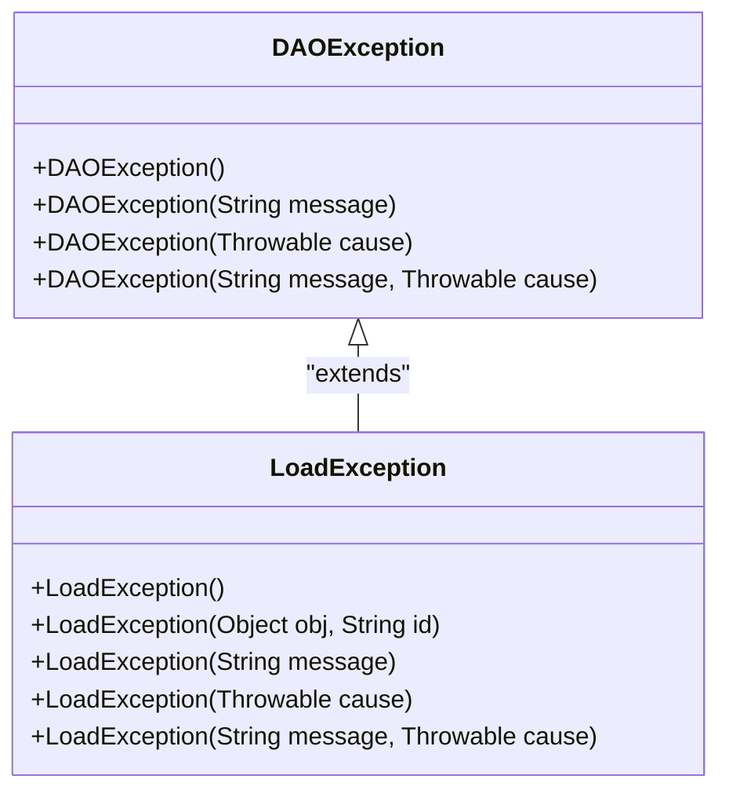
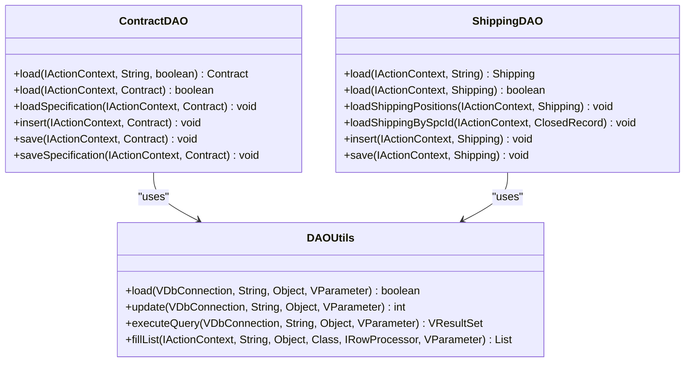
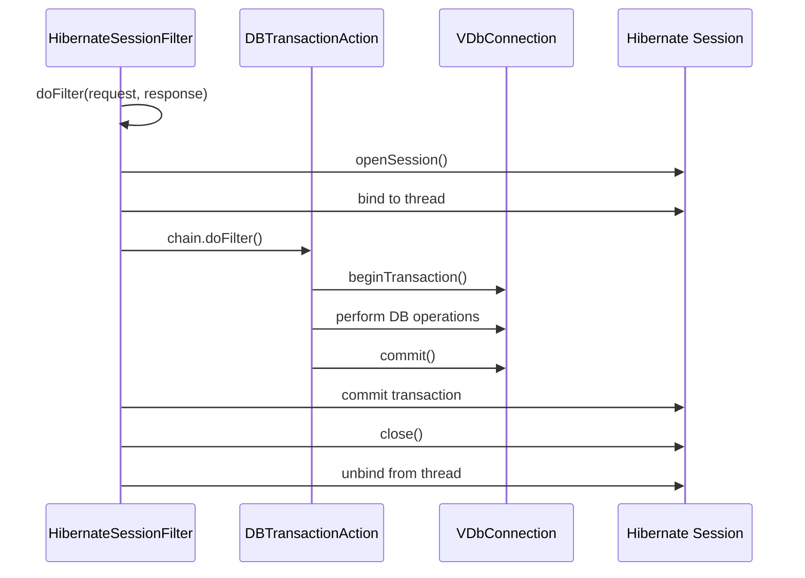
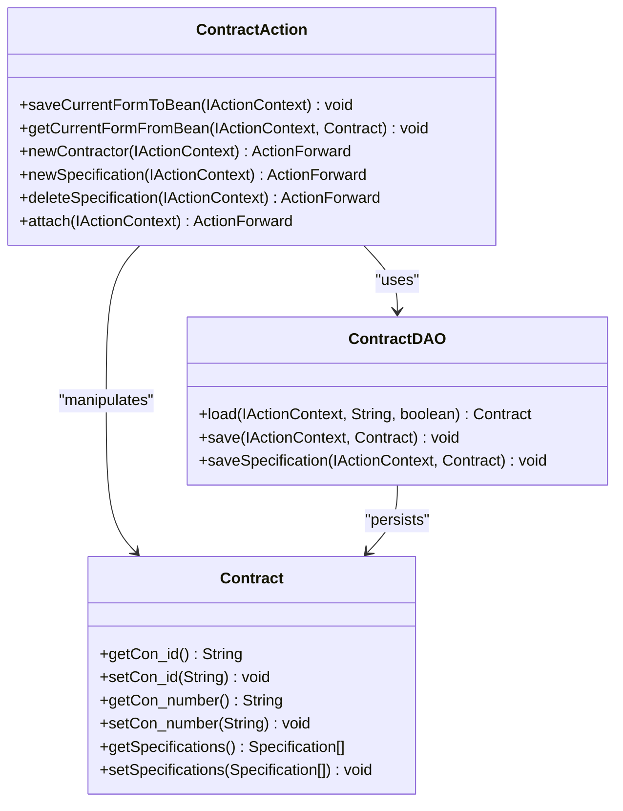

# DAO Layer Implementation

<cite>
**Referenced Files in This Document**   
- [CommonDAO.java](file://src/main/java/net/sam/dcl/dao/CommonDAO.java)
- [DAOException.java](file://src/main/java/net/sam/dcl/dao/DAOException.java)
- [ContractDAO.java](file://src/main/java/net/sam/dcl/dao/ContractDAO.java)
- [ShippingDAO.java](file://src/main/java/net/sam/dcl/dao/ShippingDAO.java)
- [HibernateUtil.java](file://src/main/java/net/sam/dcl/util/HibernateUtil.java)
- [HibernateSessionFilter.java](file://src/main/java/net/sam/dcl/filters/HibernateSessionFilter.java)
- [HibernateAction.java](file://src/main/java/net/sam/dcl/controller/actions/HibernateAction.java)
- [DBTransactionAction.java](file://src/main/java/net/sam/dcl/controller/actions/DBTransactionAction.java)
- [DAOUtils.java](file://src/main/java/net/sam/dcl/util/DAOUtils.java)
- [VDbConnectionManager.java](file://src/main/java/net/sam/dcl/db/VDbConnectionManager.java)
- [Contract.java](file://src/main/java/net/sam/dcl/beans/Contract.java)
- [Shipping.java](file://src/main/java/net/sam/dcl/beans/Shipping.java)
- [ContractAction.java](file://src/main/java/net/sam/dcl/action/ContractAction.java)
</cite>

## Table of Contents
1. [Introduction](#introduction)
2. [DAO Pattern Implementation](#dao-pattern-implementation)
3. [Base Classes and Exception Handling](#base-classes-and-exception-handling)
4. [Specific DAO Implementations](#specific-dao-implementations)
5. [Transaction Management](#transaction-management)
6. [Data Access Patterns](#data-access-patterns)
7. [Common Issues and Solutions](#common-issues-and-solutions)
8. [Separation of Concerns](#separation-of-concerns)
9. [Conclusion](#conclusion)

## Introduction
The DAO (Data Access Object) layer in dcl_v3 provides a structured approach to database interactions, abstracting the data access logic from business logic. This document details the implementation of the DAO pattern in the codebase, focusing on the base classes, exception handling, specific DAO implementations for key entities, transaction management, and integration with Hibernate. The analysis covers how DAOs manage entity lifecycles through CRUD operations and handle common database-related issues.

## DAO Pattern Implementation
The DAO pattern in dcl_v3 is implemented through a hierarchy of DAO classes that extend from a common base class, CommonDAO. Each entity in the system has a corresponding DAO class responsible for managing its lifecycle. The pattern follows the principle of separation of concerns, where data access logic is isolated from business logic, which resides in Action classes. DAOs interact with the database through VDbConnection objects obtained from VDbConnectionManager, and they use SQL queries defined in external resources.

The implementation uses a combination of direct SQL execution and Hibernate for persistence. While most DAO operations use direct SQL through the VDbConnection interface, Hibernate is used for session management and transaction boundaries. This hybrid approach allows for fine-grained control over database operations while leveraging Hibernate's session management capabilities.

**Section sources**
- [CommonDAO.java](file://src/main/java/net/sam/dcl/dao/CommonDAO.java)
- [DAOUtils.java](file://src/main/java/net/sam/dcl/util/DAOUtils.java)
- [VDbConnectionManager.java](file://src/main/java/net/sam/dcl/db/VDbConnectionManager.java)

## Base Classes and Exception Handling
The foundation of the DAO layer consists of the CommonDAO base class and the DAOException hierarchy. CommonDAO provides utility methods for database operations, particularly the GetNumber inner class used for retrieving numeric values from queries. The class serves as a common base for all DAO implementations, ensuring consistent patterns across the data access layer.

Exception handling is implemented through a hierarchy of exception classes starting with DAOException, which extends Java's Exception class. This custom exception provides constructors for different scenarios including message-only, cause-only, and message-with-cause. The LoadException class extends DAOException and is specifically used when entity loading fails, providing context about which object and ID could not be loaded.

**Diagram sources**
- [DAOException.java](file://src/main/java/net/sam/dcl/dao/DAOException.java)
- [LoadException.java](file://src/main/java/net/sam/dcl/dao/LoadException.java)

**Section sources**
- [CommonDAO.java](file://src/main/java/net/sam/dcl/dao/CommonDAO.java)
- [DAOException.java](file://src/main/java/net/sam/dcl/dao/DAOException.java)
- [LoadException.java](file://src/main/java/net/sam/dcl/dao/LoadException.java)

## Specific DAO Implementations
Specific DAO implementations such as ContractDAO and ShippingDAO demonstrate the pattern of entity management in the system. These classes provide methods for loading, saving, and deleting entities, as well as managing related entities and collections.

ContractDAO manages the Contract entity and its associated Specifications. The load method retrieves a Contract by ID and optionally loads its Specifications, converting date formats from database to application format. The saveSpecification method handles the persistence of Specifications and their payments, including deletion of removed items and insertion or update of existing ones. Notably, the method commits the transaction within the DAO to prevent deadlocks when processing attachments.

ShippingDAO manages the Shipping entity and its positions. The load method retrieves a Shipping by ID, converts date fields, and loads associated positions. The class also provides methods for loading shippings by specification ID and for managing shipping positions. Unlike ContractDAO, ShippingDAO does not handle cascading operations within the save methods, suggesting a different approach to transaction boundaries.

**Diagram sources**
- [ContractDAO.java](file://src/main/java/net/sam/dcl/dao/ContractDAO.java)
- [ShippingDAO.java](file://src/main/java/net/sam/dcl/dao/ShippingDAO.java)
- [DAOUtils.java](file://src/main/java/net/sam/dcl/util/DAOUtils.java)

**Section sources**
- [ContractDAO.java](file://src/main/java/net/sam/dcl/dao/ContractDAO.java)
- [ShippingDAO.java](file://src/main/java/net/sam/dcl/dao/ShippingDAO.java)

## Transaction Management
Transaction management in dcl_v3 is handled through a combination of Hibernate and custom transaction management classes. The HibernateSessionFilter class manages the Hibernate session lifecycle, binding a session to the current thread at the beginning of each request and committing or rolling back the transaction at the end. The filter ensures that each HTTP request has a single Hibernate session, which is closed after the request completes.

The DBTransactionAction class provides transaction management for database operations, implementing the IProcessBefore and IProcessAfter interfaces to begin and commit transactions. The processBefore method starts a transaction, while processAfter commits it if active. In case of exceptions, processException rolls back the transaction. This ensures that database operations are atomic and consistent.

HibernateAction extends this pattern with additional Hibernate-specific transaction management, explicitly beginning and committing transactions on the current Hibernate session. The class also handles exceptions by rolling back the transaction and clearing the session.

**Diagram sources**
- [HibernateSessionFilter.java](file://src/main/java/net/sam/dcl/filters/HibernateSessionFilter.java)
- [DBTransactionAction.java](file://src/main/java/net/sam/dcl/controller/actions/DBTransactionAction.java)
- [HibernateAction.java](file://src/main/java/net/sam/dcl/controller/actions/HibernateAction.java)

**Section sources**
- [HibernateSessionFilter.java](file://src/main/java/net/sam/dcl/filters/HibernateSessionFilter.java)
- [DBTransactionAction.java](file://src/main/java/net/sam/dcl/controller/actions/DBTransactionAction.java)
- [HibernateAction.java](file://src/main/java/net/sam/dcl/controller/actions/HibernateAction.java)

## Data Access Patterns
The data access patterns in dcl_v3 follow a consistent approach across DAO implementations. The DAOUtils class provides utility methods for common database operations including loading single objects, executing updates, and retrieving result sets. These methods abstract the details of parameter binding and result processing, providing a consistent interface for DAOs.

For entity loading, DAOs typically create a new instance with the requested ID and use DAOUtils.load to populate its fields from the database. Related entities are loaded separately using their respective DAOs, allowing for selective loading based on requirements. Date fields are converted from database format to application format during the loading process.

For saving entities, DAOs use DAOUtils.update with SQL update statements. The pattern varies between DAOs - some handle cascading operations within the save method (like ContractDAO with Specifications), while others expect related entities to be saved separately. This reflects different transaction boundaries and performance considerations.

The fillList method in DAOUtils is used for retrieving collections of entities, converting result sets to lists of objects. This method supports row processing through the IRowProcessor interface, allowing for custom processing of each row during conversion.

**Section sources**
- [DAOUtils.java](file://src/main/java/net/sam/dcl/util/DAOUtils.java)
- [ContractDAO.java](file://src/main/java/net/sam/dcl/dao/ContractDAO.java)
- [ShippingDAO.java](file://src/main/java/net/sam/dcl/dao/ShippingDAO.java)

## Common Issues and Solutions
The DAO implementation addresses several common database issues through specific patterns and solutions. One notable issue is the potential for deadlocks when processing attachments after modifying entities with cascading relationships. ContractDAO addresses this by committing the transaction within the saveSpecification method before returning to the calling code, preventing deadlocks that could occur when the attachment processing tries to lock tables that are still held by the uncommitted transaction.

Another issue is the handling of stale object state and lazy loading. The implementation uses eager loading for related entities in most cases, avoiding lazy loading exceptions. When collections are loaded, they are fully populated during the initial load, preventing issues with accessing collections outside the transaction context.

The codebase also addresses connection management through the VDbConnectionManager, which pools database connections and manages their lifecycle. This prevents connection leaks and ensures efficient use of database resources. The manager supports different connection types for read, write, and reporting operations, allowing for appropriate connection configuration based on usage patterns.

For handling optimistic locking and concurrent modifications, the system relies on the underlying database's transaction isolation and locking mechanisms. The use of explicit transaction boundaries and careful ordering of operations helps prevent lost updates and other concurrency issues.

**Section sources**
- [ContractDAO.java](file://src/main/java/net/sam/dcl/dao/ContractDAO.java)
- [VDbConnectionManager.java](file://src/main/java/net/sam/dcl/db/VDbConnectionManager.java)
- [HibernateSessionFilter.java](file://src/main/java/net/sam/dcl/filters/HibernateSessionFilter.java)

## Separation of Concerns
The architecture maintains a clear separation of concerns between the DAO layer and business logic in Action classes. DAOs are responsible solely for data access operations, providing methods to load, save, and delete entities without business rules or validation. Business logic, including validation, workflow management, and coordination of multiple operations, resides in Action classes.

This separation is evident in the ContractAction class, which coordinates the saving of a Contract and its Specifications. The action class handles form validation, user input processing, and service coordination, while delegating data persistence to ContractDAO. This allows for reuse of DAO methods across different contexts and simplifies testing by isolating data access logic.

The pattern also extends to error handling, with DAOs throwing DAOException for data access issues, while Action classes handle these exceptions and present appropriate user feedback. This separation ensures that data access concerns do not leak into the presentation layer.

**Diagram sources**
- [ContractAction.java](file://src/main/java/net/sam/dcl/action/ContractAction.java)
- [ContractDAO.java](file://src/main/java/net/sam/dcl/dao/ContractDAO.java)
- [Contract.java](file://src/main/java/net/sam/dcl/beans/Contract.java)

**Section sources**
- [ContractAction.java](file://src/main/java/net/sam/dcl/action/ContractAction.java)
- [ContractDAO.java](file://src/main/java/net/sam/dcl/dao/ContractDAO.java)
- [Contract.java](file://src/main/java/net/sam/dcl/beans/Contract.java)

## Conclusion
The DAO layer in dcl_v3 implements a robust data access pattern that effectively separates data access concerns from business logic. The use of a common base class, consistent exception hierarchy, and utility methods provides a uniform interface across all DAO implementations. The integration with Hibernate for session management while using direct SQL for data operations offers a balanced approach that combines the benefits of both ORM and direct database access.

The transaction management strategy, with clear boundaries defined by filters and action classes, ensures data consistency while preventing common issues like deadlocks. The separation of concerns between DAOs and Action classes promotes maintainability and testability, allowing for independent evolution of data access and business logic components.

Overall, the DAO implementation demonstrates thoughtful design decisions that address the specific requirements of the application while maintaining good software engineering practices.