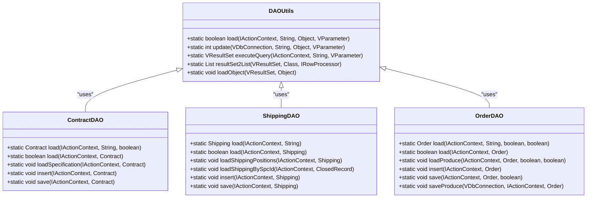
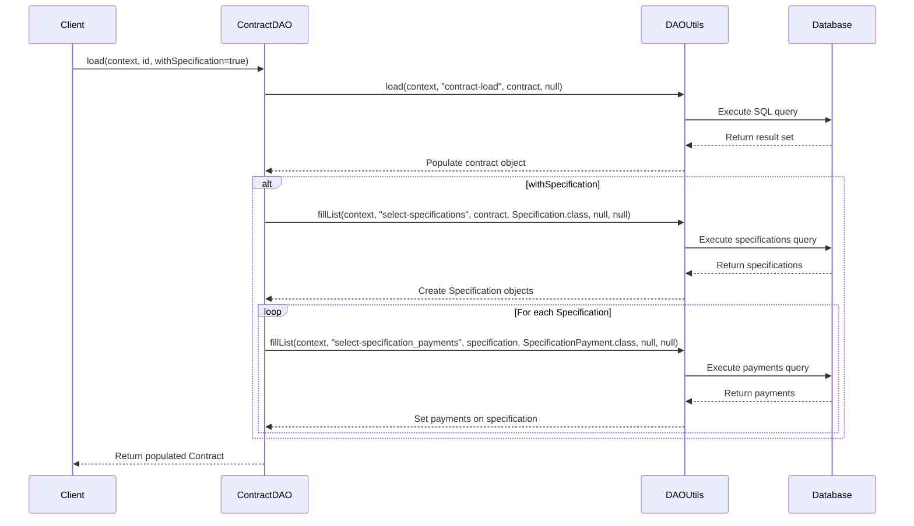
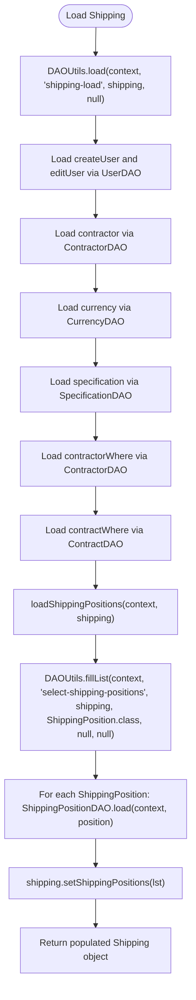
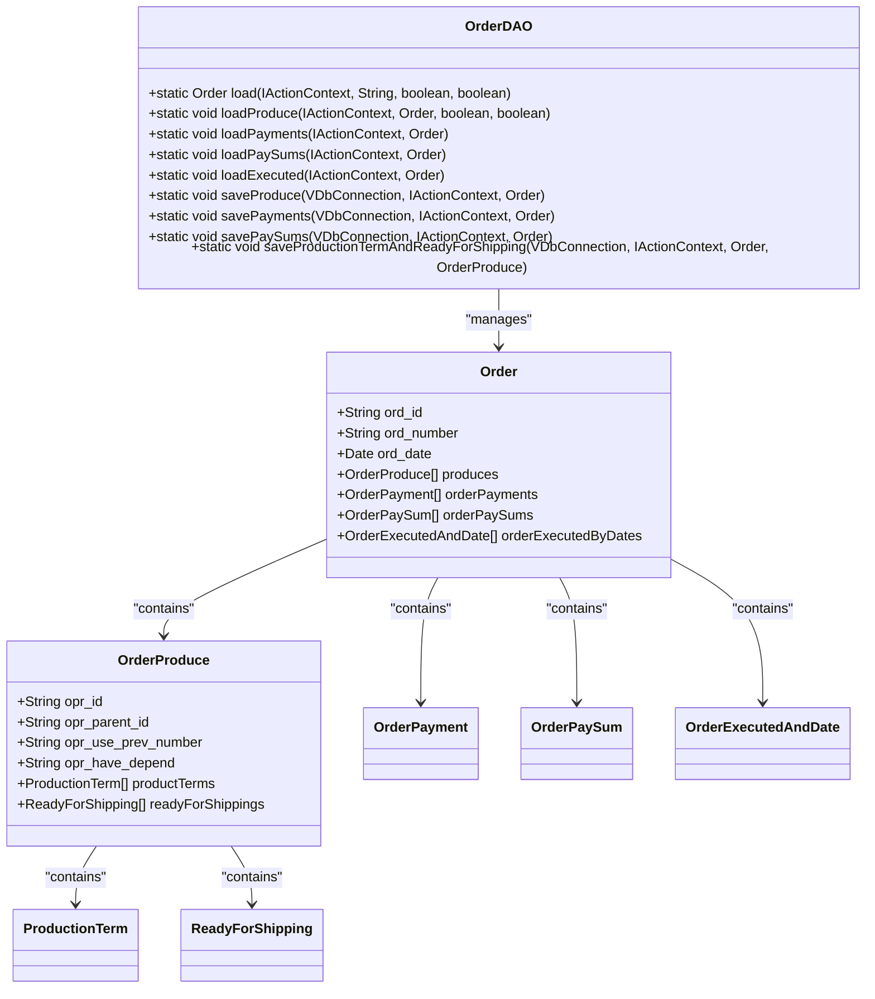
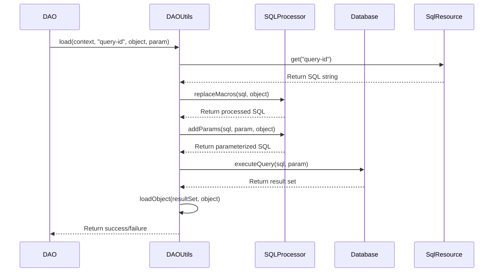
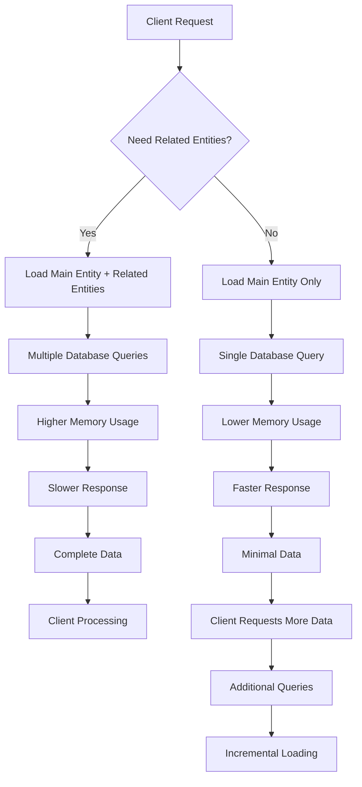
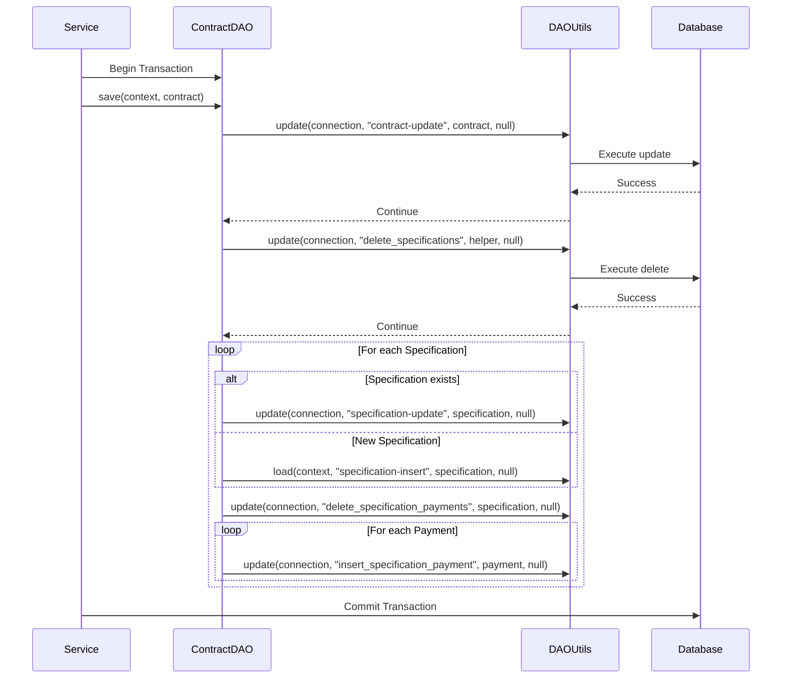

# Entity-Specific DAOs

<cite>
**Referenced Files in This Document**   
- [CommonDAO.java](file://src/main/java/net/sam/dcl/dao/CommonDAO.java)
- [ContractDAO.java](file://src/main/java/net/sam/dcl/dao/ContractDAO.java)
- [ShippingDAO.java](file://src/main/java/net/sam/dcl/dao/ShippingDAO.java)
- [OrderDAO.java](file://src/main/java/net/sam/dcl/dao/OrderDAO.java)
- [DAOUtils.java](file://src/main/java/net/sam/dcl/util/DAOUtils.java)
- [DclContract.java](file://src/main/java/net/sam/dcl/dbo/dirty/DclContract.java)
- [DclShipping.java](file://src/main/java/net/sam/dcl/dbo/dirty/DclShipping.java)
- [hibernate.cfg.xml](file://src/main/resources/hibernate.cfg.xml)
- [sql-resources.xml](file://src/main/webapp/WEB-INF/classes/resources/sql-resources.xml)
</cite>

## Table of Contents
1. [Introduction](#introduction)
2. [Core DAO Architecture](#core-dao-architecture)
3. [ContractDAO Implementation](#contractdao-implementation)
4. [ShippingDAO Implementation](#shippingdao-implementation)
5. [OrderDAO Implementation](#orderdao-implementation)
6. [Query Execution Patterns](#query-execution-patterns)
7. [Entity Relationship Management](#entity-relationship-management)
8. [Performance Considerations](#performance-considerations)
9. [Consistency Patterns](#consistency-patterns)
10. [Conclusion](#conclusion)

## Introduction
The dcl_v3 application implements a data access layer using entity-specific DAO classes that extend common functionality while providing domain-specific operations for business entities. This document focuses on the implementation patterns of ContractDAO, ShippingDAO, and OrderDAO as representative examples of how the system manages data access for key business entities. These DAOs work in conjunction with Hibernate mappings and SQL resources to provide efficient data access while maintaining business logic encapsulation.

**Section sources**
- [ContractDAO.java](file://src/main/java/net/sam/dcl/dao/ContractDAO.java)
- [ShippingDAO.java](file://src/main/java/net/sam/dcl/dao/ShippingDAO.java)
- [OrderDAO.java](file://src/main/java/net/sam/dcl/dao/OrderDAO.java)

## Core DAO Architecture
The DAO implementation in dcl_v3 follows a pattern where entity-specific DAOs encapsulate data access logic for their respective entities while leveraging common utility methods. Unlike typical inheritance patterns, the DAOs in this system do not extend a base DAO class but instead rely on the DAOUtils class for shared functionality. This utility-based approach provides consistent data access operations across all DAO implementations.

The architecture integrates with Hibernate for entity mapping while using external SQL resources for query definitions. This separation allows for flexible query management and easier maintenance of complex SQL statements. The DAO layer acts as an abstraction between the business logic and data storage, handling entity loading, saving, and custom query execution.

**Diagram sources**
- [DAOUtils.java](file://src/main/java/net/sam/dcl/util/DAOUtils.java)
- [ContractDAO.java](file://src/main/java/net/sam/dcl/dao/ContractDAO.java)
- [ShippingDAO.java](file://src/main/java/net/sam/dcl/dao/ShippingDAO.java)
- [OrderDAO.java](file://src/main/java/net/sam/dcl/dao/OrderDAO.java)

**Section sources**
- [DAOUtils.java](file://src/main/java/net/sam/dcl/util/DAOUtils.java)
- [CommonDAO.java](file://src/main/java/net/sam/dcl/dao/CommonDAO.java)

## ContractDAO Implementation
The ContractDAO class provides data access operations for the DboContract entity, handling both basic CRUD operations and complex business logic related to contract specifications. The implementation demonstrates a pattern of loading related entities through separate method calls, allowing for selective loading based on business requirements.

The DAO includes methods for loading contracts with or without their associated specifications, providing flexibility in data retrieval. When loading specifications, the method also loads payment terms associated with each specification, demonstrating a multi-level relationship traversal pattern. The save operation handles complex business rules, including deletion of existing specifications before saving new ones, ensuring data consistency.

**Diagram sources**
- [ContractDAO.java](file://src/main/java/net/sam/dcl/dao/ContractDAO.java)
- [DAOUtils.java](file://src/main/java/net/sam/dcl/util/DAOUtils.java)

**Section sources**
- [ContractDAO.java](file://src/main/java/net/sam/dcl/dao/ContractDAO.java)
- [DclContract.java](file://src/main/java/net/sam/dcl/dbo/dirty/DclContract.java)

## ShippingDAO Implementation
The ShippingDAO class manages data access for the DboShipping entity, implementing methods for loading shipping records with their associated positions and related entities. The implementation demonstrates a pattern of selective loading, where different methods load different aspects of the shipping entity based on the context.

The DAO includes specialized methods for loading shipping positions, managers, and products associated with a shipping record. These methods use the DAOUtils.fillList() method to populate collections of related entities, which are then processed to load additional details through separate DAO calls. The implementation also includes methods for inserting and updating shipping records, using SQL resource identifiers to maintain separation between code and query definitions.

**Diagram sources**
- [ShippingDAO.java](file://src/main/java/net/sam/dcl/dao/ShippingDAO.java)
- [DAOUtils.java](file://src/main/java/net/sam/dcl/util/DAOUtils.java)

**Section sources**
- [ShippingDAO.java](file://src/main/java/net/sam/dcl/dao/ShippingDAO.java)
- [DclShipping.java](file://src/main/java/net/sam/dcl/dbo/dirty/DclShipping.java)

## OrderDAO Implementation
The OrderDAO class implements comprehensive data access operations for the DboOrder entity, handling complex relationships with multiple related entities. The implementation demonstrates sophisticated loading patterns that accommodate different use cases, such as loading for cloning versus regular editing.

The DAO includes methods for loading order produces, payments, pay sums, and executed quantities, each with specific business logic. The save operation is particularly complex, handling cascaded saves for produces, payments, and pay sums while managing parent-child relationships between order produces. The implementation also includes specialized methods for saving production terms and ready-for-shipping dates, demonstrating how business rules are encapsulated within the DAO layer.

**Diagram sources**
- [OrderDAO.java](file://src/main/java/net/sam/dcl/dao/OrderDAO.java)
- [Order.java](file://src/main/java/net/sam/dcl/beans/Order.java)

**Section sources**
- [OrderDAO.java](file://src/main/java/net/sam/dcl/dao/OrderDAO.java)

## Query Execution Patterns
The DAO implementation in dcl_v3 follows a consistent pattern for query execution, using the DAOUtils class as a central utility for database operations. All DAOs use SQL resource identifiers to reference queries defined in external XML files, maintaining separation between code and query definitions. This approach allows for easier maintenance and modification of queries without requiring code changes.

The system uses different DAOUtils methods based on the type of database operation:
- `DAOUtils.load()` for single entity retrieval
- `DAOUtils.fillList()` for collection retrieval
- `DAOUtils.update()` for insert/update/delete operations
- `DAOUtils.executeQuery()` for direct result set access

Query parameters are handled through object properties and VParameter objects, with SQLProcessor handling macro replacement and parameter binding. This pattern ensures consistent parameter handling across all queries while allowing for dynamic SQL construction based on object state.

**Diagram sources**
- [DAOUtils.java](file://src/main/java/net/sam/dcl/util/DAOUtils.java)
- [SQLProcessor.java](file://src/main/java/net/sam/dcl/util/SQLProcessor.java)

**Section sources**
- [DAOUtils.java](file://src/main/java/net/sam/dcl/util/DAOUtils.java)

## Entity Relationship Management
The DAO implementations demonstrate a pattern of explicit relationship management rather than relying solely on Hibernate's automatic relationship handling. Each DAO is responsible for loading related entities through separate method calls, allowing for fine-grained control over when and how relationships are populated.

For example, ContractDAO loads related entities such as user, contractor, currency, and seller through separate DAO calls after the main contract entity is loaded. This approach provides several benefits:
- Reduced database load when related entities are not needed
- Better control over transaction boundaries
- Ability to handle circular references
- Clearer separation of concerns

The system also implements cascaded operations for related entities. When saving a contract, the DAO explicitly saves associated specifications and their payment terms, ensuring data consistency. Similarly, when saving an order, the DAO handles the save operations for produces, payments, and pay sums in a coordinated manner.

```mermaid
erDiagram
DCL_CONTRACT ||--o{ DCL_CON_LIST_SPEC : "1 to many"
DCL_CONTRACT }|--|| DCL_CURRENCY : "many to one"
DCL_CONTRACT }|--|| DCL_CONTRACTOR : "many to one"
DCL_CONTRACT }|--|| DCL_USER : "created by"
DCL_CONTRACT }|--|| DCL_USER : "edited by"
DCL_SHIPPING ||--o{ DCL_SHP_LIST_PRODUCE : "1 to many"
DCL_SHIPPING }|--|| DCL_CURRENCY : "many to one"
DCL_SHIPPING }|--|| DCL_CONTRACTOR : "many to one"
DCL_SHIPPING }|--|| DCL_USER : "created by"
DCL_SHIPPING }|--|| DCL_USER : "edited by"
DCL_SHIPPING }|--|| DCL_CON_LIST_SPEC : "many to one"
DCL_ORDER ||--o{ DCL_ORD_LIST_PRODUCE : "1 to many"
DCL_ORDER ||--o{ DCL_ORDER_PAYMENT : "1 to many"
DCL_ORDER ||--o{ DCL_ORDER_PAY_SUM : "1 to many"
DCL_ORDER }|--|| DCL_CURRENCY : "many to one"
DCL_ORDER }|--|| DCL_CONTRACTOR : "many to one"
DCL_ORDER }|--|| DCL_USER : "manager"
DCL_ORDER }|--|| DCL_USER : "logist"
DCL_ORDER }|--|| DCL_SPECIFICATION : "many to one"
```

**Diagram sources**
- [DclContract.java](file://src/main/java/net/sam/dcl/dbo/dirty/DclContract.java)
- [DclShipping.java](file://src/main/java/net/sam/dcl/dbo/dirty/DclShipping.java)
- [DclOrder.java](file://src/main/java/net/sam/dcl/beans/Order.java)

**Section sources**
- [ContractDAO.java](file://src/main/java/net/sam/dcl/dao/ContractDAO.java)
- [ShippingDAO.java](file://src/main/java/net/sam/dcl/dao/ShippingDAO.java)
- [OrderDAO.java](file://src/main/java/net/sam/dcl/dao/OrderDAO.java)

## Performance Considerations
The DAO implementation incorporates several performance optimization strategies to ensure efficient data access. The most significant is the selective loading pattern, where related entities are loaded only when explicitly requested. For example, ContractDAO can load a contract without its specifications when the withSpecification parameter is false, reducing database load for operations that don't require specification data.

The system also implements pagination through the DAOUtils.fillGrid() methods, which support pageable result sets. This allows for efficient retrieval of large collections without loading all data into memory at once. The implementation uses Firebird-specific pagination techniques to optimize query performance.

Another performance consideration is the use of connection management patterns. The DAOUtils methods consistently close database connections in finally blocks, preventing connection leaks. For operations that require multiple database calls within a single transaction, the methods accept a VDbConnection parameter, allowing the caller to manage the connection lifecycle.

**Diagram sources**
- [DAOUtils.java](file://src/main/java/net/sam/dcl/util/DAOUtils.java)
- [ContractDAO.java](file://src/main/java/net/sam/dcl/dao/ContractDAO.java)

**Section sources**
- [DAOUtils.java](file://src/main/java/net/sam/dcl/util/DAOUtils.java)

## Consistency Patterns
The DAO implementations follow consistent patterns for maintaining data integrity and business rule enforcement. One key pattern is the use of transaction boundaries at the service level rather than within individual DAO methods. This allows multiple DAO operations to be grouped within a single transaction, ensuring atomicity for complex business operations.

The system also implements a pattern of pre-processing and post-processing within DAO methods. For example, the OrderDAO.saveProduce() method processes order produces to determine parent-child relationships before saving, ensuring data consistency. Similarly, the ContractDAO.saveSpecification() method deletes existing specifications before saving new ones, preventing orphaned records.

Another consistency pattern is the use of SQL resource identifiers instead of inline SQL. This centralizes query definitions and makes it easier to ensure consistency across different DAO methods that access the same data. The external SQL resources are loaded at application startup and can be reloaded without restarting the application, providing flexibility for query tuning.

**Diagram sources**
- [ContractDAO.java](file://src/main/java/net/sam/dcl/dao/ContractDAO.java)
- [DAOUtils.java](file://src/main/java/net/sam/dcl/util/DAOUtils.java)

**Section sources**
- [ContractDAO.java](file://src/main/java/net/sam/dcl/dao/ContractDAO.java)

## Conclusion
The entity-specific DAO implementations in dcl_v3 demonstrate a robust pattern for data access that balances flexibility, performance, and maintainability. By using a utility-based approach rather than inheritance, the system achieves code reuse while maintaining clear separation of concerns. The integration with Hibernate for entity mapping and external SQL resources for query definitions provides a flexible architecture that supports complex business requirements.

Key strengths of the implementation include:
- Selective loading patterns that optimize performance
- Clear separation between data access code and query definitions
- Comprehensive handling of entity relationships
- Consistent transaction management patterns
- Robust error handling and resource management

The DAO layer effectively encapsulates business logic related to data access, providing a stable interface for higher-level components while managing the complexities of database interactions and entity relationships.