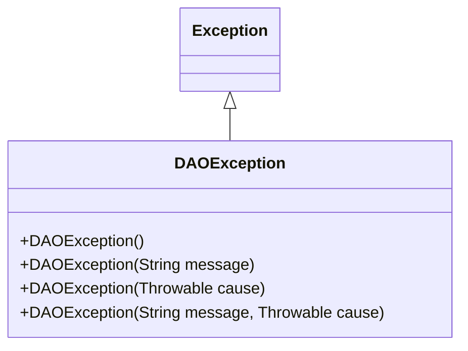
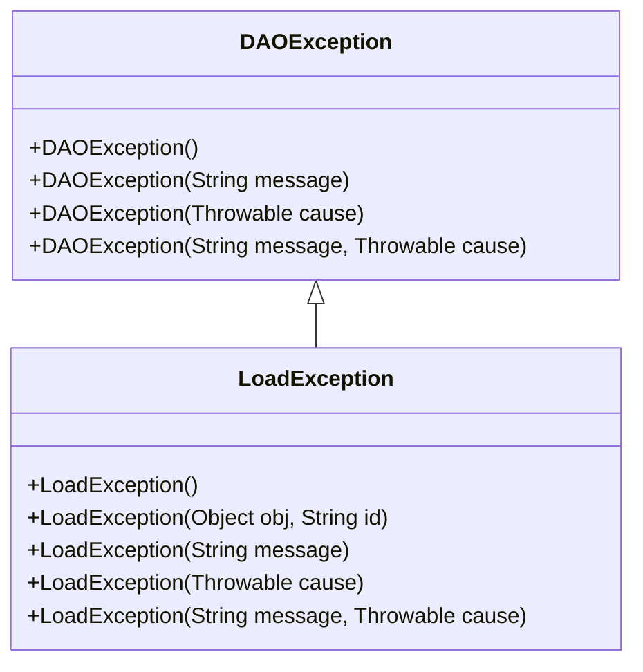
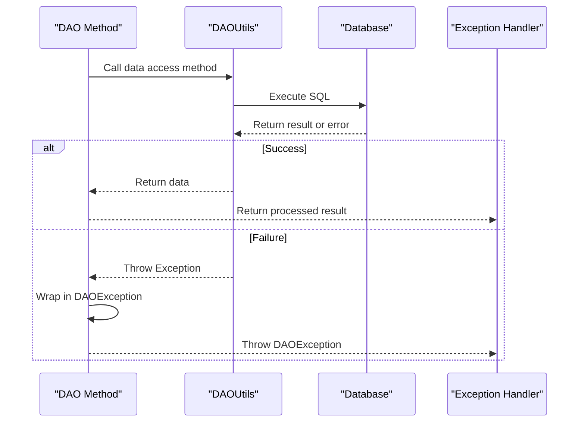
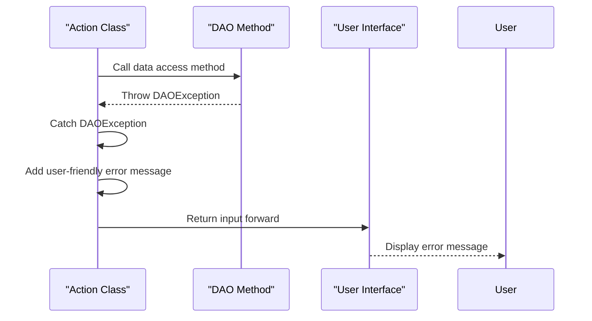
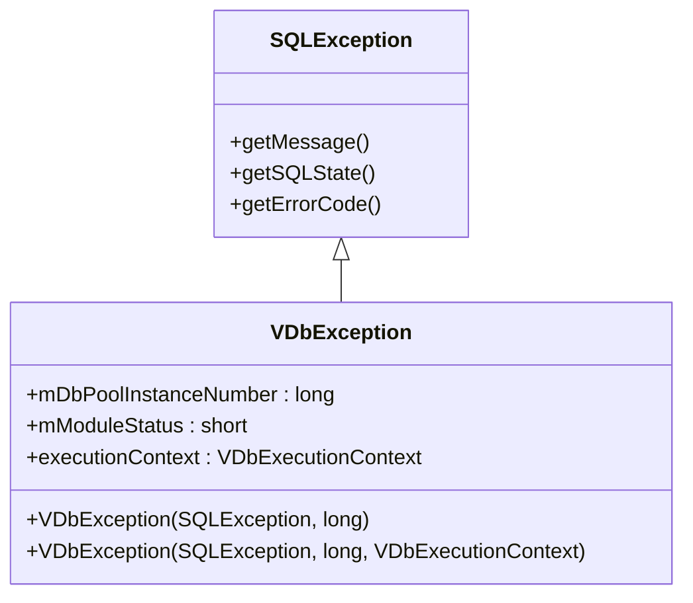
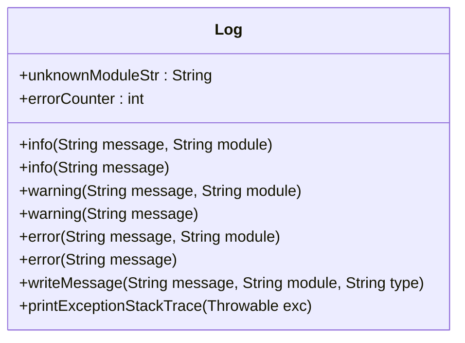
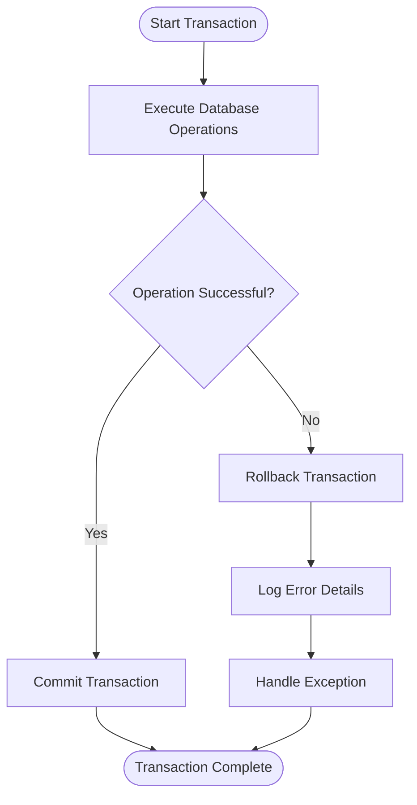

# Exception Handling

<cite>
**Referenced Files in This Document**   
- [DAOException.java](file://src/main/java/net/sam/dcl/dao/DAOException.java)
- [LoadException.java](file://src/main/java/net/sam/dcl/dao/LoadException.java)
- [VDbException.java](file://src/main/java/net/sam/dcl/db/VDbException.java)
- [VDbMessageLocalizer.java](file://src/main/java/net/sam/dcl/db/VDbMessageLocalizer.java)
- [Log.java](file://src/main/java/net/sam/dcl/log/Log.java)
- [DAOUtils.java](file://src/main/java/net/sam/dcl/util/DAOUtils.java)
- [BlanksAction.java](file://src/main/java/net/sam/dcl/action/BlanksAction.java)
- [ContractorRequestDAO.java](file://src/main/java/net/sam/dcl/dao/ContractorRequestDAO.java)
- [PaymentDAO.java](file://src/main/java/net/sam/dcl/dao/PaymentDAO.java)
- [DBAction.java](file://src/main/java/net/sam/dcl/controller/actions/DBAction.java)
- [DBTransactionAction.java](file://src/main/java/net/sam/dcl/controller/actions/DBTransactionAction.java)
</cite>

## Table of Contents
1. [Introduction](#introduction)
2. [DAOException Class Structure](#daoexception-class-structure)
3. [Exception Hierarchy and Specialization](#exception-hierarchy-and-specialization)
4. [DAO Layer Exception Handling Patterns](#dao-layer-exception-handling-patterns)
5. [Error Propagation to Action Layer](#error-propagation-to-action-layer)
6. [Database Exception Translation](#database-exception-translation)
7. [Logging Mechanisms](#logging-mechanisms)
8. [Recovery Strategies and Transaction Management](#recovery-strategies-and-transaction-management)
9. [Best Practices for Exception Handling](#best-practices-for-exception-handling)
10. [Conclusion](#conclusion)

## Introduction
The dcl_v3 application implements a comprehensive exception handling mechanism in its Data Access Object (DAO) layer, centered around the DAOException class. This documentation details how data access failures are encapsulated, propagated, and handled throughout the application. The DAO layer serves as a critical boundary between the application logic and database operations, requiring robust error handling for database connectivity issues, constraint violations, and persistence framework errors. The exception handling design follows a layered approach where lower-level exceptions are wrapped in application-specific exceptions, preserving error context while providing meaningful error messages to higher layers.

## DAOException Class Structure

The DAOException class serves as the primary checked exception for data access operations in the dcl_v3 application. As a direct extension of Java's base Exception class, DAOException provides multiple constructors to accommodate various exception scenarios while preserving the original error context.

**Diagram sources**
- [DAOException.java](file://src/main/java/net/sam/dcl/dao/DAOException.java#L7-L27)

The class implements four constructors that follow standard Java exception wrapping patterns:
- Default constructor for exception instantiation without additional context
- Message constructor that accepts a descriptive error message
- Cause constructor that wraps a lower-level exception
- Combined constructor that accepts both a message and a cause exception

This design allows DAO methods to throw exceptions with rich context, including both human-readable messages and the underlying cause exception for debugging purposes. The exception preserves stack traces from the original error source, enabling comprehensive error diagnosis while providing a consistent interface for error handling across the DAO layer.

**Section sources**
- [DAOException.java](file://src/main/java/net/sam/dcl/dao/DAOException.java#L7-L27)

## Exception Hierarchy and Specialization

The dcl_v3 application extends the basic DAOException with specialized exception types to handle specific data access scenarios. The most notable specialization is the LoadException class, which inherits from DAOException and provides additional constructors tailored to entity loading operations.

**Diagram sources**
- [DAOException.java](file://src/main/java/net/sam/dcl/dao/DAOException.java#L7-L27)
- [LoadException.java](file://src/main/java/net/sam/dcl/dao/LoadException.java#L7-L32)

The LoadException class includes a specialized constructor that accepts an object and ID parameter, automatically generating a descriptive error message that includes the class name and identifier of the entity that failed to load. This pattern is consistently used across DAO implementations where entity loading is a common operation. For example, when a Payment entity cannot be loaded from the database, the PaymentDAO throws a LoadException with the Payment object and its ID, providing immediate context about which specific entity caused the failure.

This hierarchical exception design allows for both general exception handling at the DAOException level and specialized handling for specific scenarios like entity loading failures, while maintaining type safety and meaningful error context.

**Section sources**
- [DAOException.java](file://src/main/java/net/sam/dcl/dao/DAOException.java#L7-L27)
- [LoadException.java](file://src/main/java/net/sam/dcl/dao/LoadException.java#L7-L32)

## DAO Layer Exception Handling Patterns

The DAO layer in dcl_v3 follows consistent patterns for exception handling across its implementations. DAO methods typically catch lower-level database exceptions and wrap them in DAOException instances, preserving the original error context while providing application-specific error messages.

**Diagram sources**
- [DAOUtils.java](file://src/main/java/net/sam/dcl/util/DAOUtils.java#L1-L39)
- [PaymentDAO.java](file://src/main/java/net/sam/dcl/dao/PaymentDAO.java#L1-L180)

A key pattern observed in the codebase is the use of the DAOUtils class as an intermediary layer between DAO methods and database operations. When database operations fail, DAOUtils propagates the exception back to the calling DAO method, which then wraps it in a DAOException with additional context. For example, the ContractorRequestDAO throws a DAOException with the message "Нет данных" (No data) when attempting to retrieve a random ID fails due to empty result sets.

Additionally, DAO methods often include validation logic that throws DAOException when business rules are violated or expected data is missing. This proactive error checking ensures that invalid states are caught early and communicated clearly through the exception mechanism.

**Section sources**
- [ContractorRequestDAO.java](file://src/main/java/net/sam/dcl/dao/ContractorRequestDAO.java#L190-L254)
- [PaymentDAO.java](file://src/main/java/net/sam/dcl/dao/PaymentDAO.java#L1-L180)
- [DAOUtils.java](file://src/main/java/net/sam/dcl/util/DAOUtils.java#L1-L39)

## Error Propagation to Action Layer

Exceptions thrown in the DAO layer are propagated to the Action classes, where they are handled to provide user-facing error messages and appropriate response flows. The Action layer catches DAOException instances and translates them into user-readable messages that are displayed in the application interface.

**Diagram sources**
- [BlanksAction.java](file://src/main/java/net/sam/dcl/action/BlanksAction.java#L65-L126)
- [ContractorRequestDAO.java](file://src/main/java/net/sam/dcl/dao/ContractorRequestDAO.java#L190-L254)

The BlanksAction class demonstrates this pattern by catching DAOException when attempting to load contractor request data for printing. Instead of exposing the technical details of the database error, the action adds a user-friendly error message with the key "error.blanks.no_data_for_print" using the StrutsUtil.addError method. This approach separates technical error details from user-facing messages, maintaining a clean separation of concerns.

The error handling flow typically returns the input forward, keeping the user on the current page with the error message displayed, rather than navigating away or showing a generic error page. This improves user experience by allowing users to understand what went wrong and potentially correct their actions.

**Section sources**
- [BlanksAction.java](file://src/main/java/net/sam/dcl/action/BlanksAction.java#L65-L126)

## Database Exception Translation

The dcl_v3 application implements a sophisticated mechanism for translating low-level database exceptions into meaningful application errors. The VDbException class wraps SQLException instances, preserving all relevant error information while adding application-specific context.

**Diagram sources**
- [VDbException.java](file://src/main/java/net/sam/dcl/db/VDbException.java#L7-L45)

The VDbMessageLocalizer class plays a crucial role in this translation process by mapping database error codes to user-friendly messages defined in the ConstDefinitions class. For example, Oracle error code 1 (unique constraint violation) is translated to ERROR__UNIQUE, while error code 2292 (integrity constraint violation) becomes ERROR__INTEGRITY. This translation layer ensures that technical database error codes are converted into meaningful messages that can be understood by application users and administrators.

The exception translation preserves critical debugging information including the original SQL statement, error code, and stack trace, while providing a clean interface for error handling at higher application layers. This dual approach supports both user experience and developer debugging needs.

**Section sources**
- [VDbException.java](file://src/main/java/net/sam/dcl/db/VDbException.java#L7-L45)
- [VDbMessageLocalizer.java](file://src/main/java/net/sam/dcl/db/VDbMessageLocalizer.java#L7-L46)

## Logging Mechanisms

The dcl_v3 application employs a comprehensive logging strategy to record error details for debugging and monitoring purposes. The Log class provides static methods for different log levels (info, warning, error) and includes functionality for printing exception stack traces when debugging is enabled.

**Diagram sources**
- [Log.java](file://src/main/java/net/sam/dcl/log/Log.java#L7-L70)

The logging system is configurable through the application's configuration, allowing administrators to enable or disable logging for different levels (error, warning, info) based on the environment. When an exception occurs, the system logs the error message along with the module name, providing context for troubleshooting.

In the DBTransactionAction class, exceptions are logged using the processException method, which captures both the error message and the full stack trace. The logging includes additional context when available, such as the original SQL statement from the VDbException's executionContext, which is invaluable for diagnosing database-related issues.

**Section sources**
- [Log.java](file://src/main/java/net/sam/dcl/log/Log.java#L7-L70)
- [DBTransactionAction.java](file://src/main/java/net/sam/dcl/controller/actions/DBTransactionAction.java#L30-L46)

## Recovery Strategies and Transaction Management

The dcl_v3 application implements robust recovery strategies for handling data access exceptions, particularly in the context of database transactions. The DBTransactionAction class provides a foundation for transaction management, ensuring that database operations are properly committed or rolled back based on success or failure.

**Diagram sources**
- [DBTransactionAction.java](file://src/main/java/net/sam/dcl/controller/actions/DBTransactionAction.java#L30-L46)
- [DBAction.java](file://src/main/java/net/sam/dcl/controller/actions/DBAction.java#L1-L37)

When an exception occurs during a transaction, the system automatically rolls back any pending changes to maintain data consistency. The processException method in DBTransactionAction handles this rollback operation, ensuring that partial updates do not leave the database in an inconsistent state. After rolling back, the exception is rethrown to allow higher-level components to handle the error appropriately.

The DBAction class provides the foundation for connection management, automatically closing database connections in the processFinally method regardless of whether the operation succeeded or failed. This ensures that database resources are properly released, preventing connection leaks that could impact application performance.

**Section sources**
- [DBTransactionAction.java](file://src/main/java/net/sam/dcl/controller/actions/DBTransactionAction.java#L30-L46)
- [DBAction.java](file://src/main/java/net/sam/dcl/controller/actions/DBAction.java#L1-L37)

## Best Practices for Exception Handling

Based on the analysis of the dcl_v3 codebase, several best practices for exception handling in the DAO layer emerge:

1. **Wrap lower-level exceptions**: Always wrap SQLException and other low-level exceptions in application-specific exceptions like DAOException to maintain abstraction and provide meaningful error context.

2. **Preserve error context**: When wrapping exceptions, use the constructor that accepts both a message and cause to preserve the original stack trace and error information for debugging.

3. **Provide meaningful messages**: Include descriptive error messages that indicate the nature of the failure and, when possible, suggest potential causes or solutions.

4. **Use specialized exceptions**: Create specialized exception types like LoadException for common scenarios to provide more specific error handling capabilities.

5. **Implement proper transaction management**: Ensure that database transactions are properly rolled back when exceptions occur to maintain data consistency.

6. **Log comprehensively**: Record sufficient error details in logs to support debugging while avoiding the exposure of sensitive information to end users.

7. **Separate technical and user errors**: Translate technical database errors into user-friendly messages that explain the issue without exposing implementation details.

8. **Clean up resources**: Always ensure that database connections and other resources are properly closed in finally blocks or through try-with-resources patterns.

These practices ensure that the application can gracefully handle data access failures while providing a good user experience and supporting effective troubleshooting.

## Conclusion
The exception handling mechanism in the DAO layer of dcl_v3 demonstrates a well-designed approach to managing data access failures. By using DAOException as a central exception type, the application creates a consistent interface for error handling across all data access operations. The hierarchical exception structure, with specialized types like LoadException, allows for both general and specific error handling. The integration with transaction management ensures data consistency, while the logging and error translation mechanisms support effective debugging and user communication. This comprehensive approach to exception handling contributes to the overall reliability and maintainability of the dcl_v3 application.