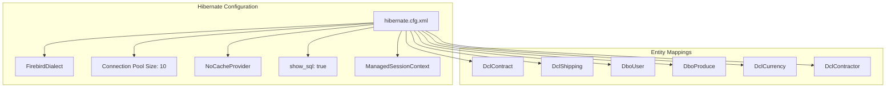
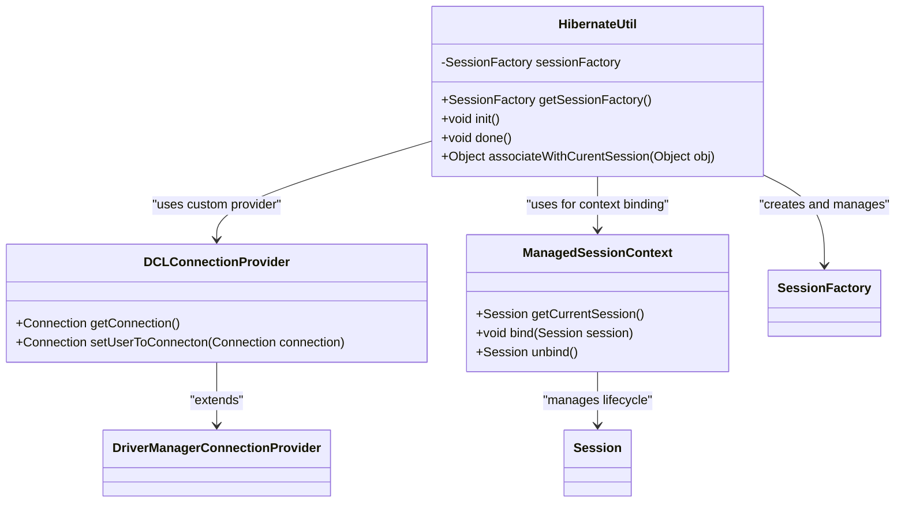
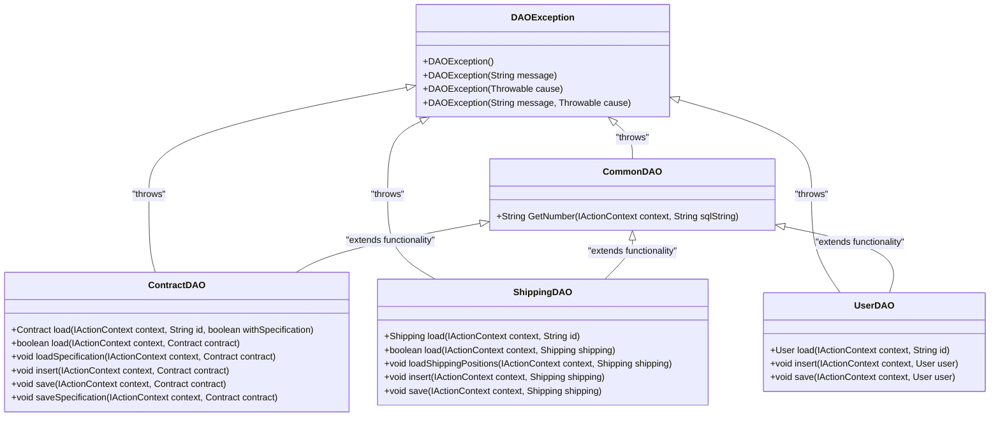
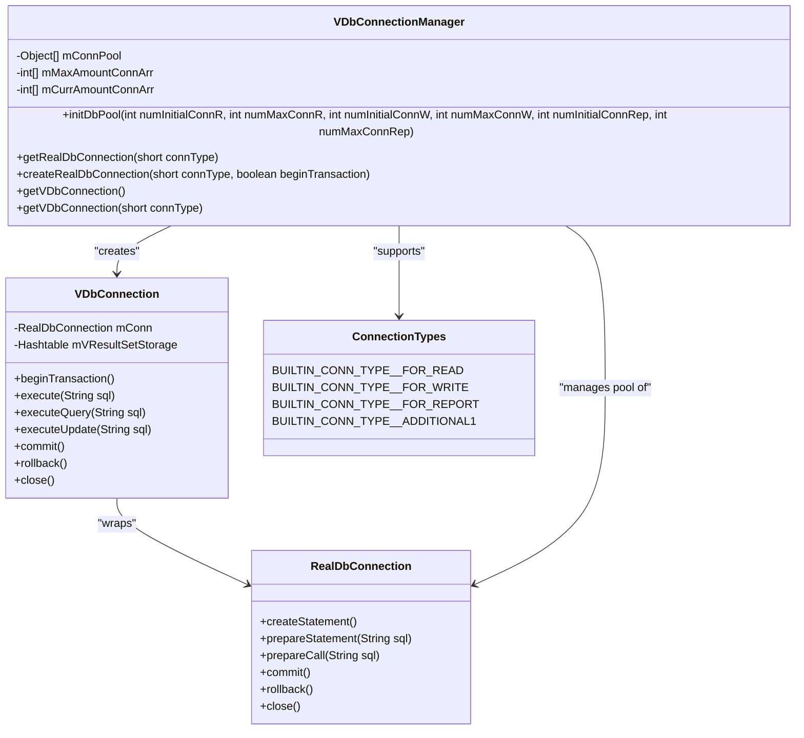
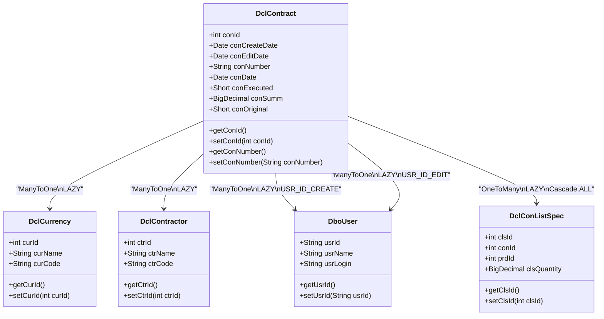
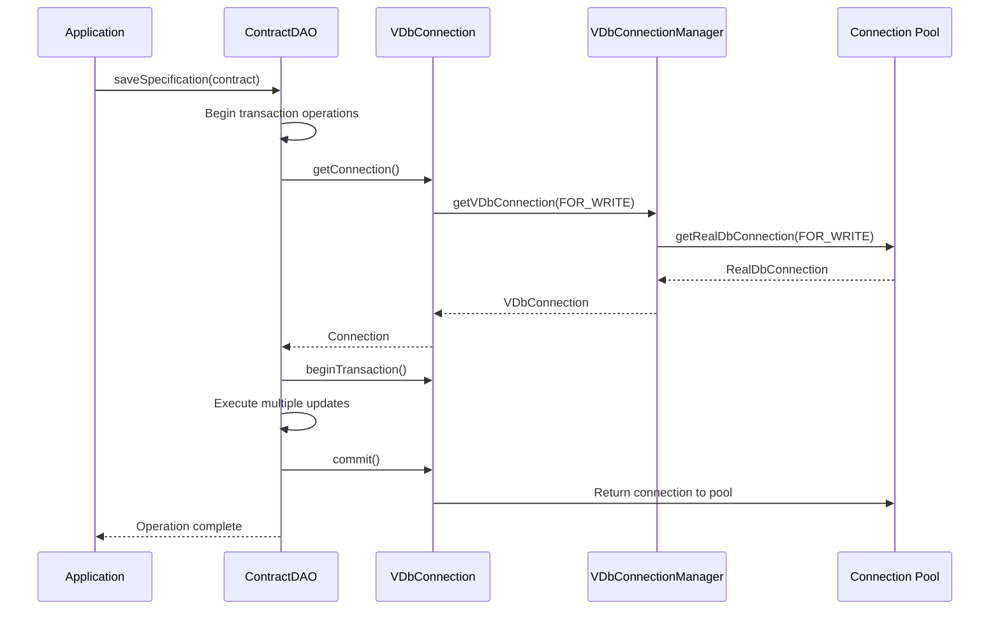
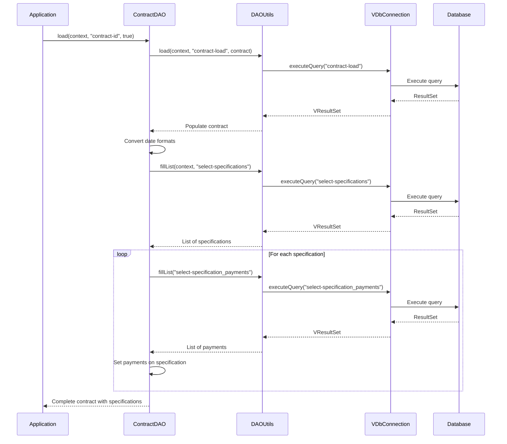

# Data Access & ORM

<cite>
**Referenced Files in This Document**   
- [hibernate.cfg.xml](file://src/main/resources/hibernate.cfg.xml)
- [HibernateUtil.java](file://src/main/java/net/sam/dcl/util/HibernateUtil.java)
- [DAOException.java](file://src/main/java/net/sam/dcl/dao/DAOException.java)
- [VDbConnectionManager.java](file://src/main/java/net/sam/dcl/db/VDbConnectionManager.java)
- [VDbConnection.java](file://src/main/java/net/sam/dcl/db/VDbConnection.java)
- [CommonDAO.java](file://src/main/java/net/sam/dcl/dao/CommonDAO.java)
- [ContractDAO.java](file://src/main/java/net/sam/dcl/dao/ContractDAO.java)
- [ShippingDAO.java](file://src/main/java/net/sam/dcl/dao/ShippingDAO.java)
- [DclContract.java](file://src/main/java/net/sam/dcl/dbo/dirty/DclContract.java)
- [DAOUtils.java](file://src/main/java/net/sam/dcl/util/DAOUtils.java)
</cite>

## Table of Contents
1. [Introduction](#introduction)
2. [Hibernate Configuration](#hibernate-configuration)
3. [SessionFactory Management](#sessionfactory-management)
4. [DAO Pattern Implementation](#dao-pattern-implementation)
5. [Firebird Connection Pooling](#firebird-connection-pooling)
6. [Entity Mapping and Relationships](#entity-mapping-and-relationships)
7. [Transaction Management](#transaction-management)
8. [Performance Considerations](#performance-considerations)
9. [Error Handling and Common Issues](#error-handling-and-common-issues)
10. [Practical Examples](#practical-examples)

## Introduction
The dcl_v3 application implements a comprehensive data access layer using Hibernate 5.6 as the ORM framework with Firebird as the underlying database. The architecture combines Hibernate's object-relational mapping capabilities with a custom connection pooling and transaction management system through the VDbConnectionManager. This document provides a detailed analysis of the data access and ORM layer, covering configuration, session management, DAO patterns, connection pooling, and performance considerations.

**Section sources**
- [hibernate.cfg.xml](file://src/main/resources/hibernate.cfg.xml)
- [HibernateUtil.java](file://src/main/java/net/sam/dcl/util/HibernateUtil.java)

## Hibernate Configuration
The Hibernate configuration is defined in hibernate.cfg.xml, which specifies essential parameters for database connectivity and ORM behavior. The configuration uses FirebirdDialect to ensure compatibility with Firebird SQL syntax and features. Connection pooling is configured with a pool size of 10 connections, providing adequate concurrency for application operations.

The configuration disables Hibernate's built-in cache provider (NoCacheProvider), indicating that caching strategies are managed at the application level rather than through Hibernate's second-level cache. SQL statement logging is enabled (show_sql=true), which is valuable for debugging and performance analysis during development and production monitoring.

Entity mappings are declared using class mapping elements, referencing various DBO (Data Business Object) classes in the net.sam.dcl.dbo and net.sam.dcl.dbo.dirty packages. These mappings include core business entities such as DboContract, DboShipping, DboUser, and DboProduce, among others. Additional HQL and native SQL resources are included through external XML files, allowing for complex queries to be maintained separately from the configuration.

**Diagram sources**
- [hibernate.cfg.xml](file://src/main/resources/hibernate.cfg.xml)

**Section sources**
- [hibernate.cfg.xml](file://src/main/resources/hibernate.cfg.xml)

## SessionFactory Management
The HibernateUtil class manages the SessionFactory lifecycle, serving as a singleton that provides thread-safe access to Hibernate sessions. The SessionFactory is initialized statically through the init() method, which configures Hibernate using the hibernate.cfg.xml file while programmatically overriding connection properties from the application's configuration system.

A custom DCLConnectionProvider extends Hibernate's DriverManagerConnectionProvider to inject user context into database connections. This is achieved through a stored procedure call (set_context) that passes the current user's ID to the database, enabling user-specific auditing and security contexts within Firebird.

The SessionFactory uses ManagedSessionContext to bind sessions to the current execution context, ensuring that each thread has access to its own session instance. This approach supports the open-session-in-view pattern, where a single session spans multiple operations within a request cycle.

The utility provides methods for session lifecycle management, including the associateWithCurentSession method that handles entity reattachment when working with detached objects. This method resolves potential NonUniqueObjectException issues by properly merging entities into the current session context.

**Diagram sources**
- [HibernateUtil.java](file://src/main/java/net/sam/dcl/util/HibernateUtil.java)

**Section sources**
- [HibernateUtil.java](file://src/main/java/net/sam/dcl/util/HibernateUtil.java)

## DAO Pattern Implementation
The application implements a comprehensive DAO (Data Access Object) pattern with a base CommonDAO class and specialized DAOs for each entity type. The DAO layer abstracts database operations and provides a clean interface between business logic and data persistence.

The DAOException class serves as the base exception for all data access operations, providing four constructors to handle various exception scenarios including message-only, cause-only, and combined message-cause patterns. This consistent exception handling approach enables proper error propagation and recovery mechanisms throughout the application.

Each entity has a corresponding DAO class (e.g., ContractDAO, ShippingDAO, UserDAO) that implements CRUD operations specific to that entity. The DAOs follow a consistent pattern of using IActionContext to access database connections and SQL resources, ensuring that operations are performed within the appropriate transactional context.

The CommonDAO class provides utility methods like GetNumber that demonstrate the pattern of encapsulating common database operations. This approach promotes code reuse and maintains consistency across different DAO implementations.

**Diagram sources**
- [DAOException.java](file://src/main/java/net/sam/dcl/dao/DAOException.java)
- [CommonDAO.java](file://src/main/java/net/sam/dcl/dao/CommonDAO.java)
- [ContractDAO.java](file://src/main/java/net/sam/dcl/dao/ContractDAO.java)
- [ShippingDAO.java](file://src/main/java/net/sam/dcl/dao/ShippingDAO.java)

**Section sources**
- [DAOException.java](file://src/main/java/net/sam/dcl/dao/DAOException.java)
- [CommonDAO.java](file://src/main/java/net/sam/dcl/dao/CommonDAO.java)
- [ContractDAO.java](file://src/main/java/net/sam/dcl/dao/ContractDAO.java)
- [ShippingDAO.java](file://src/main/java/net/sam/dcl/dao/ShippingDAO.java)

## Firebird Connection Pooling
The VDbConnectionManager implements a sophisticated connection pooling system specifically designed for Firebird database connectivity. The manager supports multiple connection types with different purposes: FOR_READ, FOR_WRITE, FOR_REPORT, and ADDITIONAL1, each with configurable pool sizes and behaviors.

The connection pool is initialized with parameters for initial and maximum connections for each type, allowing fine-tuned resource allocation based on expected workload patterns. The manager maintains separate pools for read and write operations, optimizing performance by directing operations to appropriate connection types.

Connection acquisition follows a least-used strategy, selecting connections with the lowest usage count and no active transactions when available. When no idle connections are available, new connections are created up to the maximum pool size. The system implements retry logic with exponential backoff to handle temporary connection exhaustion.

The VDbConnection class serves as a virtual connection wrapper that manages the lifecycle of physical connections. It handles automatic connection acquisition from the pool, transaction management, and proper cleanup of associated resources like result sets and statements. The virtual connection abstraction allows the application to work with database resources without directly managing the underlying connection pool.

**Diagram sources**
- [VDbConnectionManager.java](file://src/main/java/net/sam/dcl/db/VDbConnectionManager.java)
- [VDbConnection.java](file://src/main/java/net/sam/dcl/db/VDbConnection.java)

**Section sources**
- [VDbConnectionManager.java](file://src/main/java/net/sam/dcl/db/VDbConnectionManager.java)
- [VDbConnection.java](file://src/main/java/net/sam/dcl/db/VDbConnection.java)

## Entity Mapping and Relationships
The entity model uses JPA annotations to define mappings between Java objects and database tables. The DclContract entity serves as a central example, demonstrating various relationship types and mapping strategies.

Entity relationships are defined using standard JPA annotations: @ManyToOne for many-to-one relationships, @OneToMany for one-to-many relationships, and @JoinColumn to specify foreign key columns. The fetch strategy is consistently set to FetchType.LAZY across all relationships, implementing lazy loading to optimize performance by loading related entities only when explicitly accessed.

The DclContract entity has several @ManyToOne relationships with lookup tables such as DclCurrency, DclContractor, and DboUser (for both creation and editing users). These relationships represent foreign key constraints in the database and are loaded lazily to prevent unnecessary data retrieval.

The entity also has a @OneToMany relationship with DclConListSpec (contract list specifications), representing the line items or positions within a contract. This relationship is mapped with CascadeType.ALL, meaning that operations on the contract (persist, merge, remove) are cascaded to the associated specifications.

Primary keys are defined using @Id and @Column annotations, with appropriate data types and constraints. Temporal fields use @Temporal annotations to specify date precision (DATE or TIMESTAMP). The entity implements Serializable to support Hibernate's session persistence requirements.

**Diagram sources**
- [DclContract.java](file://src/main/java/net/sam/dcl/dbo/dirty/DclContract.java)

**Section sources**
- [DclContract.java](file://src/main/java/net/sam/dcl/dbo/dirty/DclContract.java)

## Transaction Management
The application implements a comprehensive transaction management system that combines Hibernate's transaction capabilities with the custom VDbConnectionManager. Transactions are managed at the connection level, with the VDbConnection class providing explicit methods for transaction control.

The beginTransaction() method on VDbConnection acquires a connection from the appropriate pool (typically FOR_WRITE) and begins a database transaction. The commit() and rollback() methods complete the transaction and return the connection to the pool. The system ensures proper cleanup of all associated resources during transaction completion.

The DAO layer integrates with this transaction management system through the IActionContext, which provides access to the current database connection. Operations that modify data typically require an active transaction, while read operations can use auto-commit mode.

The ContractDAO demonstrates complex transaction management in the saveSpecification method, where multiple operations are performed within a single transaction. The method explicitly commits the transaction before proceeding to subsequent operations to prevent deadlocks, particularly when dealing with trigger-based operations on related tables.

The connection pooling system supports different transaction behaviors for different connection types. FOR_WRITE connections are typically used for transactional operations, while FOR_READ connections use auto-commit mode for optimal performance on queries.

**Diagram sources**
- [VDbConnection.java](file://src/main/java/net/sam/dcl/db/VDbConnection.java)
- [ContractDAO.java](file://src/main/java/net/sam/dcl/dao/ContractDAO.java)

**Section sources**
- [VDbConnection.java](file://src/main/java/net/sam/dcl/db/VDbConnection.java)
- [ContractDAO.java](file://src/main/java/net/sam/dcl/dao/ContractDAO.java)

## Performance Considerations
The data access layer incorporates several performance optimization strategies to ensure efficient database operations. The most significant is the implementation of lazy loading through FetchType.LAZY on all entity relationships. This prevents the accidental loading of entire object graphs when only a single entity is needed, significantly reducing database load and memory consumption.

Connection pooling is configured with a moderate pool size of 10 connections, balancing resource usage with concurrency requirements. The separation of connection types (FOR_READ, FOR_WRITE, FOR_REPORT) allows for optimized routing of database operations to appropriate connection pools, preventing write operations from blocking read operations.

The application uses prepared statements extensively through the VDbConnection's execute methods with VParameter objects. This approach enables statement reuse and protects against SQL injection attacks while improving performance through query plan caching in the database.

The DAO layer implements batch operations where appropriate, such as in the saveSpecification method of ContractDAO, which processes multiple specification items in a single transaction. This reduces the overhead of multiple round-trips to the database.

The configuration disables Hibernate's second-level cache (NoCacheProvider), suggesting that caching strategies are implemented at a higher level or through database-level optimizations. This decision may be based on the specific workload patterns of the application, where the overhead of cache management outweighs the benefits.

```mermaid
flowchart TD
A["Performance Optimization Strategies"] --> B["Lazy Loading"]
A --> C["Connection Pooling"]
A --> D["Prepared Statements"]
A --> E["Batch Operations"]
A --> F["Transaction Management"]
B --> B1["FetchType.LAZY on all relationships"]
B --> B2["Prevents unnecessary data loading"]
B --> B3["Reduces memory footprint"]
C --> C1["Pool size: 10 connections"]
C --> C2["Separate pools for read/write"]
C --> C3["Connection reuse"]
D --> D1["Parameterized queries"]
D --> D2["SQL injection protection"]
D --> D3["Query plan caching"]
E --> E1["Batch updates in single transaction"]
E --> E2["Reduced round-trip overhead"]
E --> E3["Efficient bulk operations"]
F --> F1["Explicit transaction boundaries"]
F --> F2["Deadlock prevention"]
F --> F3["Resource cleanup"]
```

**Diagram sources**
- [hibernate.cfg.xml](file://src/main/resources/hibernate.cfg.xml)
- [VDbConnection.java](file://src/main/java/net/sam/dcl/db/VDbConnection.java)
- [ContractDAO.java](file://src/main/java/net/sam/dcl/dao/ContractDAO.java)

**Section sources**
- [hibernate.cfg.xml](file://src/main/resources/hibernate.cfg.xml)
- [VDbConnection.java](file://src/main/java/net/sam/dcl/db/VDbConnection.java)
- [ContractDAO.java](file://src/main/java/net/sam/dcl/dao/ContractDAO.java)

## Error Handling and Common Issues
The data access layer implements a comprehensive error handling system centered around the DAOException class. This exception serves as the base for all data access errors, providing a consistent mechanism for error propagation and recovery.

Common issues in the data access layer include session closure errors, connection pool exhaustion, and transaction deadlocks. Session closure errors typically occur when attempting to access lazy-loaded relationships after the session has been closed. The application mitigates this through careful session management and the use of the ManagedSessionContext to bind sessions to the current execution context.

Connection pool exhaustion can occur under high load when all connections in the pool are in use. The VDbConnectionManager implements retry logic with a maximum of three attempts and 500ms delays between attempts, providing resilience against temporary spikes in database activity.

Transaction deadlocks are prevented through careful transaction design and ordering of operations. The ContractDAO demonstrates this by explicitly committing transactions before performing operations that might conflict with trigger-based operations on related tables.

The VDbConnection class implements proper resource cleanup in finally blocks, ensuring that statements and result sets are closed even when exceptions occur. This prevents resource leaks that could lead to connection pool exhaustion over time.

```mermaid
flowchart TD
A["Error Handling System"] --> B["DAOException Hierarchy"]
A --> C["Connection Management"]
A --> D["Transaction Recovery"]
A --> E["Resource Cleanup"]
B --> B1["Base DAOException class"]
B --> B2["Wraps SQLException and other causes"]
B --> B3["Provides context for debugging"]
C --> C1["Retry logic with backoff"]
C --> C2["Connection timeout handling"]
C --> C3["Pool exhaustion detection"]
D --> D1["Explicit commit/rollback"]
D --> D2["Deadlock prevention"]
D --> D3["Transaction boundary management"]
E --> E1["Try-finally blocks"]
E --> E2["Statement and ResultSet cleanup"]
E --> E3["Connection return to pool"]
F["Common Issues"] --> G["Session Closure Errors"]
F --> H["Connection Pool Exhaustion"]
F --> I["Transaction Deadlocks"]
F --> J["Resource Leaks"]
G --> G1["Lazy loading after session close"]
G --> G2["Solution: ManagedSessionContext"]
H --> H1["All connections in use"]
H --> H2["Solution: Retry with backoff"]
I --> I1["Circular dependencies"]
I --> I2["Solution: Ordered operations"]
J --> J1["Unclosed statements/result sets"]
J --> J2["Solution: Finally blocks"]
```

**Diagram sources**
- [DAOException.java](file://src/main/java/net/sam/dcl/dao/DAOException.java)
- [VDbConnection.java](file://src/main/java/net/sam/dcl/db/VDbConnection.java)
- [ContractDAO.java](file://src/main/java/net/sam/dcl/dao/ContractDAO.java)

**Section sources**
- [DAOException.java](file://src/main/java/net/sam/dcl/dao/DAOException.java)
- [VDbConnection.java](file://src/main/java/net/sam/dcl/db/VDbConnection.java)
- [ContractDAO.java](file://src/main/java/net/sam/dcl/dao/ContractDAO.java)

## Practical Examples
The DAO layer provides practical examples of data access patterns through its implementation of entity operations. The ContractDAO demonstrates loading a contract with its associated specifications and payments through a series of coordinated database operations.

The load method in ContractDAO first retrieves the contract entity, then converts date formats from database to application format, and finally loads associated specifications and their payments. This pattern ensures that all related data is properly initialized before returning the entity to the caller.

The saveSpecification method demonstrates complex transaction management, where existing specifications are deleted, new ones are inserted or updated, and payments are synchronized—all within a single transaction. The method explicitly commits the transaction before returning to prevent deadlocks with subsequent operations.

The ShippingDAO provides another example with its loadShippingBySpcId method, which retrieves shipping records associated with a specific specification ID and enriches them with additional data like managers and products through separate queries. This demonstrates the pattern of aggregating data from multiple sources to create a comprehensive view.

These examples illustrate the practical application of the data access patterns, showing how the various components of the ORM layer work together to provide efficient and reliable data persistence.

**Diagram sources**
- [ContractDAO.java](file://src/main/java/net/sam/dcl/dao/ContractDAO.java)
- [DAOUtils.java](file://src/main/java/net/sam/dcl/util/DAOUtils.java)
- [VDbConnection.java](file://src/main/java/net/sam/dcl/db/VDbConnection.java)

**Section sources**
- [ContractDAO.java](file://src/main/java/net/sam/dcl/dao/ContractDAO.java)
- [DAOUtils.java](file://src/main/java/net/sam/dcl/util/DAOUtils.java)