# Hibernate Configuration

<cite>
**Referenced Files in This Document**
- [hibernate.cfg.xml](file://src/main/resources/hibernate.cfg.xml)
- [persistence.xml](file://src/main/resources/META-INF/persistence.xml)
- [application.properties](file://src/main/resources/application.properties)
- [HibernateUtil.java](file://src/main/java/net/sam/dcl/util/HibernateUtil.java)
- [VDbConnectionManager.java](file://src/main/java/net/sam/dcl/db/VDbConnectionManager.java)
- [HibernateSessionFilter.java](file://src/main/java/net/sam/dcl/filters/HibernateSessionFilter.java)
- [HibernateAction.java](file://src/main/java/net/sam/dcl/controller/actions/HibernateAction.java)
- [Config.java](file://src/main/java/net/sam/dcl/config/Config.java)
- [DclTest.java](file://src/main/java/net/sam/dcl/dbo/dirty/DclTest.java)
</cite>

## Table of Contents
1. [Introduction](#introduction)
2. [Hibernate Configuration Structure](#hibernate-configuration-structure)
3. [Database Connection Settings](#database-connection-settings)
4. [Dialect Configuration](#dialect-configuration)
5. [Connection Pool Management](#connection-pool-management)
6. [SessionFactory Initialization](#sessionfactory-initialization)
7. [Entity Mapping Configuration](#entity-mapping-configuration)
8. [Transaction Management](#transaction-management)
9. [JPA Integration](#jpa-integration)
10. [Session Management Patterns](#session-management-patterns)
11. [Production Configuration Best Practices](#production-configuration-best-practices)
12. [Troubleshooting Guide](#troubleshooting-guide)
13. [Configuration Migration](#configuration-migration)

## Introduction

The dcl_v3 application employs a sophisticated Hibernate configuration strategy that combines traditional Hibernate ORM with modern JPA standards. The configuration supports FirebirdSQL database connectivity through a custom connection provider and implements robust session management patterns for enterprise-scale applications. This documentation provides comprehensive coverage of the Hibernate setup, from basic configuration to advanced production deployment scenarios.

## Hibernate Configuration Structure

The primary Hibernate configuration is managed through multiple configuration files that work together to provide flexible database connectivity and ORM functionality.

### Configuration Hierarchy

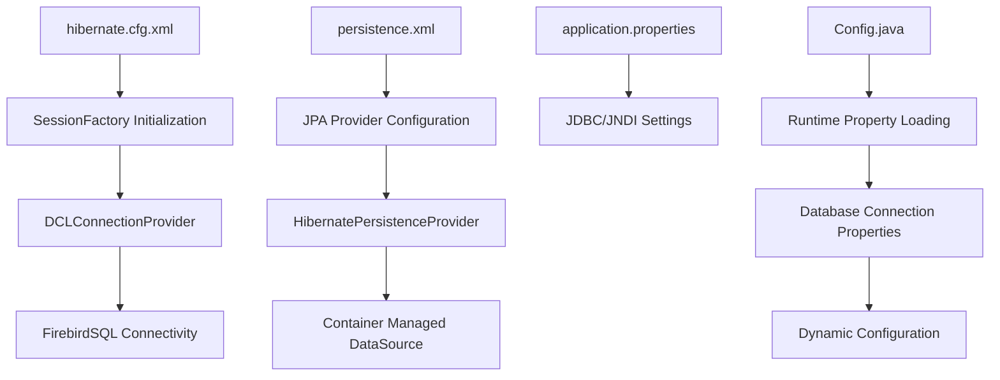

**Diagram sources**
- [hibernate.cfg.xml](file://src/main/resources/hibernate.cfg.xml#L1-L66)
- [persistence.xml](file://src/main/resources/META-INF/persistence.xml#L1-L68)
- [application.properties](file://src/main/resources/application.properties#L1-L60)

**Section sources**
- [hibernate.cfg.xml](file://src/main/resources/hibernate.cfg.xml#L1-L66)
- [persistence.xml](file://src/main/resources/META-INF/persistence.xml#L1-L68)

## Database Connection Settings

The application implements a dual-configuration approach for database connectivity, combining static Hibernate configuration with dynamic property loading for maximum flexibility.

### Static Configuration Properties

The hibernate.cfg.xml file establishes baseline connection parameters:

| Property | Value | Description |
|----------|-------|-------------|
| `hibernate.connection.pool_size` | 10 | Maximum concurrent connections |
| `hibernate.connection.provider_class` | DCLConnectionProvider | Custom connection provider |
| `hibernate.current_session_context_class` | org.hibernate.context.ManagedSessionContext | Session lifecycle management |
| `hibernate.show_sql` | true | Enable SQL logging for development |

### Dynamic Property Configuration

Connection parameters are dynamically loaded from the configuration system:

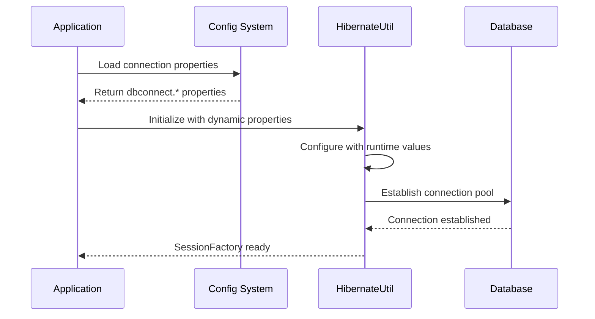

**Diagram sources**
- [HibernateUtil.java](file://src/main/java/net/sam/dcl/util/HibernateUtil.java#L20-L35)
- [Config.java](file://src/main/java/net/sam/dcl/config/Config.java#L1-L132)

**Section sources**
- [hibernate.cfg.xml](file://src/main/resources/hibernate.cfg.xml#L6-L12)
- [HibernateUtil.java](file://src/main/java/net/sam/dcl/util/HibernateUtil.java#L20-L35)

## Dialect Configuration

The application specifically targets FirebirdSQL database compatibility through the FirebirdDialect configuration.

### FirebirdSQL Dialect Implementation

The configuration specifies the FirebirdDialect as the primary database abstraction layer:

```xml
<property name="hibernate.dialect">org.hibernate.dialect.FirebirdDialect</property>
```

### Supported Database Dialects

The persistence.xml file includes commented examples for various database systems:

| Database | Dialect Class | JDBC Driver |
|----------|---------------|-------------|
| FirebirdSQL | `org.hibernate.dialect.FirebirdDialect` | `org.firebirdsql.jdbc.FBDriver` |
| PostgreSQL | `org.hibernate.dialect.PostgreSQL95Dialect` | `org.postgresql.Driver` |
| Oracle | `org.hibernate.dialect.Oracle10gDialect` | `oracle.jdbc.OracleDriver` |

### Dialect Selection Strategy

The application implements a phased approach to dialect configuration:

1. **Development Phase**: FirebirdSQL dialect enabled for local development
2. **Migration Phase**: Commented-out dialects for planned database migrations
3. **Production Phase**: Explicit dialect selection based on target database

**Section sources**
- [hibernate.cfg.xml](file://src/main/resources/hibernate.cfg.xml#L10-L10)
- [persistence.xml](file://src/main/resources/META-INF/persistence.xml#L40-L45)

## Connection Pool Management

The application employs a sophisticated connection pooling strategy through the VDbConnectionManager, which provides advanced connection lifecycle management beyond standard Hibernate pooling.

### VDbConnectionManager Architecture

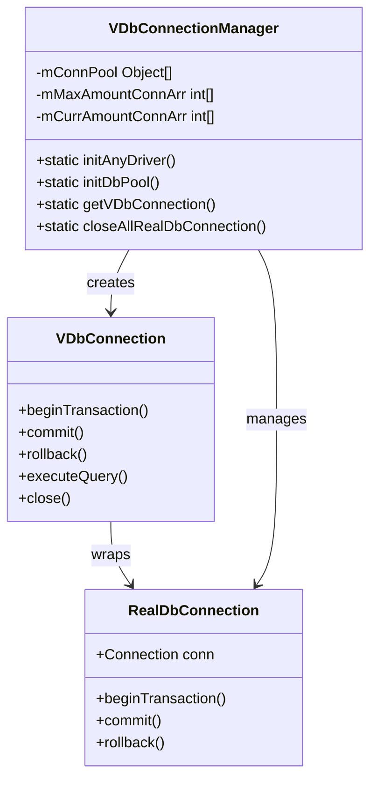

**Diagram sources**
- [VDbConnectionManager.java](file://src/main/java/net/sam/dcl/db/VDbConnectionManager.java#L1-L200)

### Connection Pool Configuration

The application supports multiple connection types with separate pools:

| Connection Type | Initial Pool Size | Max Pool Size | Purpose |
|-----------------|-------------------|---------------|---------|
| Read Operations | 2 | 4 | SELECT queries |
| Write Operations | 9 | 9 | INSERT/UPDATE/DELETE |
| Report Operations | 2 | 2 | Long-running queries |
| Additional | 1 | 1 | Specialized operations |

### Connection Lifecycle Management

The VDbConnectionManager implements sophisticated connection lifecycle management:

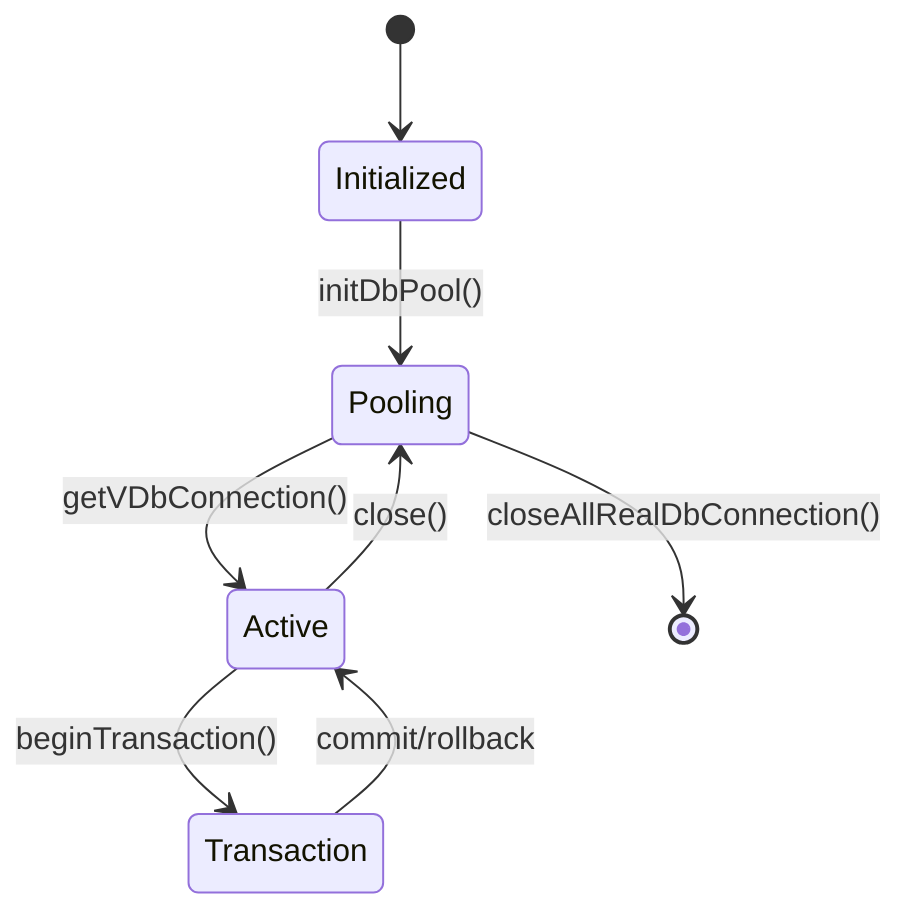

**Section sources**
- [VDbConnectionManager.java](file://src/main/java/net/sam/dcl/db/VDbConnectionManager.java#L189-L230)

## SessionFactory Initialization

The SessionFactory initialization follows a singleton pattern with thread-safe access, ensuring efficient resource utilization and consistent session management across the application.

### HibernateUtil Singleton Pattern

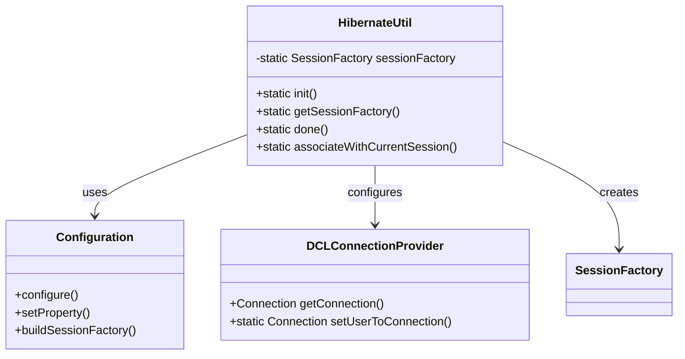

**Diagram sources**
- [HibernateUtil.java](file://src/main/java/net/sam/dcl/util/HibernateUtil.java#L20-L40)

### Initialization Process

The SessionFactory initialization process involves several critical steps:

1. **Configuration Loading**: Reads hibernate.cfg.xml and applies runtime properties
2. **Connection Provider Setup**: Configures DCLConnectionProvider for custom connection management
3. **SessionFactory Creation**: Builds the immutable SessionFactory instance
4. **Error Handling**: Implements comprehensive exception handling for initialization failures

### Thread-Safe Access Pattern

The SessionFactory implementation ensures thread-safe access through static methods:

```java
// Thread-safe singleton access
public static SessionFactory getSessionFactory() {
    return sessionFactory;
}
```

**Section sources**
- [HibernateUtil.java](file://src/main/java/net/sam/dcl/util/HibernateUtil.java#L20-L40)

## Entity Mapping Configuration

The application maintains comprehensive entity mapping through explicit class declarations in the hibernate.cfg.xml file, covering both persistent entities and view mappings.

### Entity Mapping Strategy

The configuration includes mappings for various entity types:

| Entity Category | Example Classes | Purpose |
|-----------------|-----------------|---------|
| Persistent Entities | `DboProduce`, `DboUser` | Core business objects |
| View Entities | `DclOccupiedContractV`, `DclUnclosedSpecV` | Database views |
| Dirty Entities | `DclTest`, `DclContractor` | Legacy or temporary entities |
| Association Entities | Various *_List_Produce classes | Many-to-many relationships |

### Mapping Configuration Structure

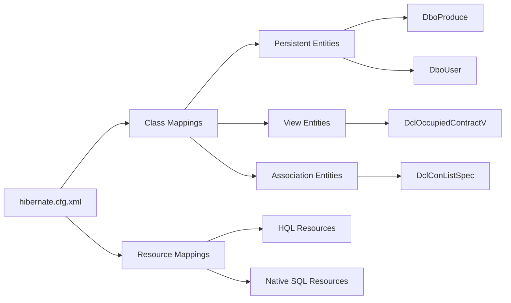

**Diagram sources**
- [hibernate.cfg.xml](file://src/main/resources/hibernate.cfg.xml#L13-L50)

### Entity Annotation Support

The application demonstrates JPA annotation support through the DclTest entity example:

```java
@Entity
@Table(name = "DCL_TEST")
public class DclTest implements java.io.Serializable {
    @Id
    @Column(name = "TST_ID", unique = true, nullable = false)
    private int tstId;
    
    @Column(name = "TST_NAME", nullable = false, length = 128)
    private String tstName;
}
```

**Section sources**
- [hibernate.cfg.xml](file://src/main/resources/hibernate.cfg.xml#L13-L50)
- [DclTest.java](file://src/main/java/net/sam/dcl/dbo/dirty/DclTest.java#L1-L65)

## Transaction Management

The application implements comprehensive transaction management through multiple patterns, ensuring data consistency and proper resource cleanup across different operational contexts.

### Transaction Management Patterns

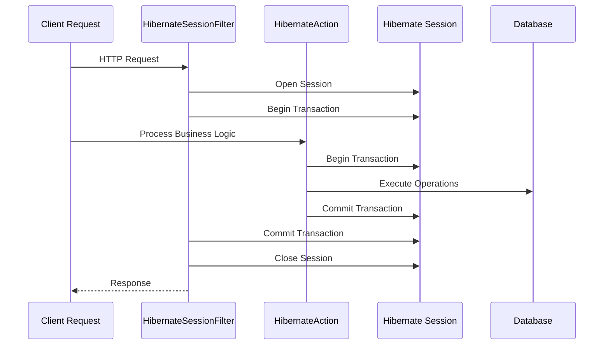

**Diagram sources**
- [HibernateSessionFilter.java](file://src/main/java/net/sam/dcl/filters/HibernateSessionFilter.java#L30-L50)
- [HibernateAction.java](file://src/main/java/net/sam/dcl/controller/actions/HibernateAction.java#L29-L64)

### Session Lifecycle Management

The application implements multiple session lifecycle management patterns:

1. **Filter-Based Sessions**: Automatic session management for web requests
2. **Action-Based Sessions**: Manual session control for business logic
3. **Manual Sessions**: Programmatic session management for specialized operations

### Transaction Coordination

The transaction management system coordinates multiple layers of transaction control:

| Layer | Responsibility | Transaction Scope |
|-------|----------------|-------------------|
| Filter Layer | Web request boundaries | HTTP request lifecycle |
| Action Layer | Business operation boundaries | Individual actions |
| DAO Layer | Database operation boundaries | CRUD operations |

**Section sources**
- [HibernateSessionFilter.java](file://src/main/java/net/sam/dcl/filters/HibernateSessionFilter.java#L30-L109)
- [HibernateAction.java](file://src/main/java/net/sam/dcl/controller/actions/HibernateAction.java#L29-L64)

## JPA Integration

The application provides forward-compatible JPA integration through persistence.xml configuration, enabling gradual migration from Hibernate to pure JPA while maintaining backward compatibility.

### Persistence Unit Configuration

The persistence.xml defines a JPA persistence unit with configurable properties:

```xml
<persistence-unit name="dclLegacyPU" transaction-type="RESOURCE_LOCAL">
    <provider>org.hibernate.jpa.HibernatePersistenceProvider</provider>
    <properties>
        <!-- Schema validation mode -->
        <property name="hibernate.hbm2ddl.auto" value="validate"/>
        
        <!-- SQL logging and formatting -->
        <property name="hibernate.show_sql" value="false"/>
        <property name="hibernate.format_sql" value="true"/>
        
        <!-- Connection properties (commented for flexibility) -->
        <!-- <property name="hibernate.connection.driver_class" value="..."/> -->
        <!-- <property name="hibernate.connection.url" value="..."/> -->
        
        <!-- Database dialect (commented for flexibility) -->
        <!-- <property name="hibernate.dialect" value="..."/> -->
    </properties>
</persistence-unit>
```

### JPA Configuration Strategy

The JPA configuration follows a phased migration approach:

1. **Scaffold Phase**: Basic JPA setup with Hibernate provider
2. **Gradual Migration**: Incremental entity mapping introduction
3. **Full Migration**: Complete JPA adoption with provider independence

### Compatibility Layer

The application maintains compatibility between Hibernate and JPA through:

- Shared configuration properties
- Consistent entity mapping strategies
- Unified transaction management
- Common connection providers

**Section sources**
- [persistence.xml](file://src/main/resources/META-INF/persistence.xml#L1-L68)
- [application.properties](file://src/main/resources/application.properties#L30-L50)

## Session Management Patterns

The application implements multiple session management patterns to accommodate different operational requirements and architectural concerns.

### Session Acquisition Patterns

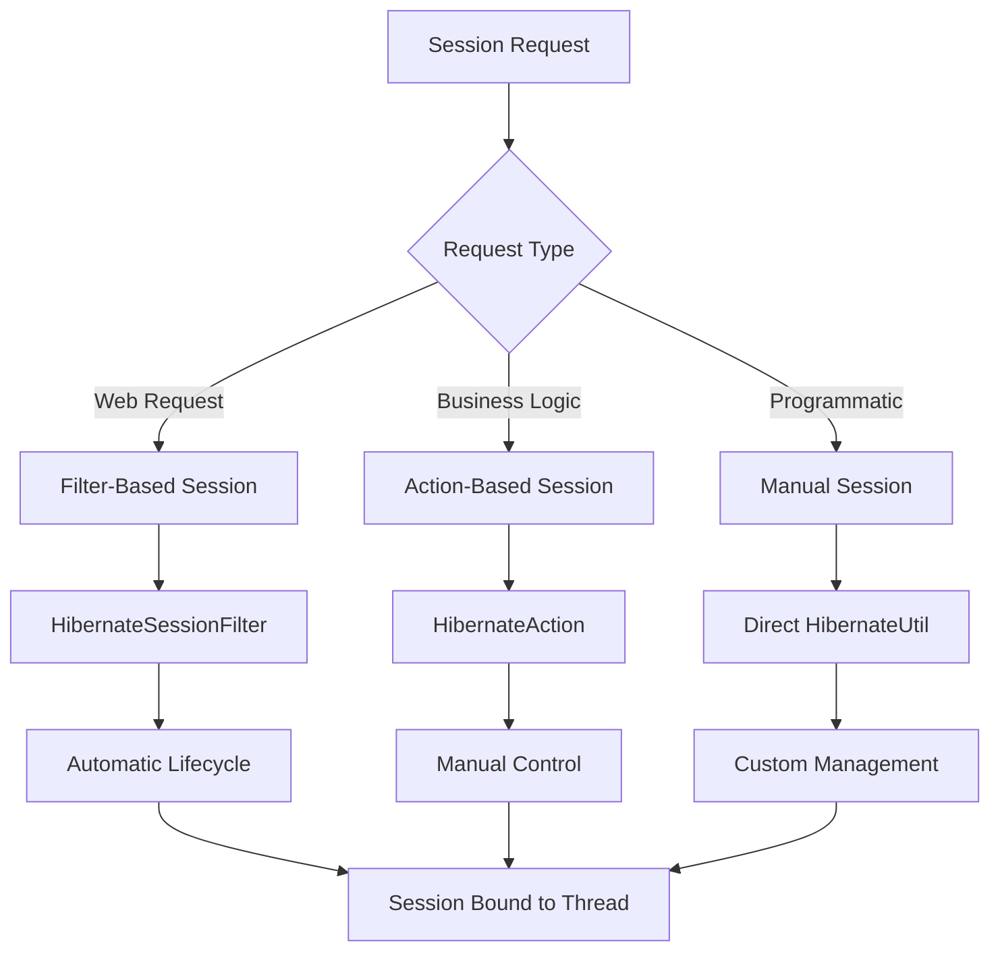

### Session Closure Patterns

The application implements comprehensive session closure patterns to prevent resource leaks:

1. **Automatic Closure**: Filter-based automatic session closure
2. **Manual Closure**: Explicit session closure in finally blocks
3. **Exception Handling**: Robust exception handling with session cleanup
4. **Resource Cleanup**: Proper JDBC resource management

### Thread Safety Considerations

Session management implements thread safety through:

- Thread-local session binding
- Immutable SessionFactory instances
- Synchronized access to shared resources
- Proper exception handling for concurrent access

**Section sources**
- [HibernateSessionFilter.java](file://src/main/java/net/sam/dcl/filters/HibernateSessionFilter.java#L30-L109)
- [HibernateAction.java](file://src/main/java/net/sam/dcl/controller/actions/HibernateAction.java#L29-L64)

## Production Configuration Best Practices

Production deployment requires careful consideration of performance, security, and reliability factors in Hibernate configuration.

### Performance Optimization

Key performance tuning parameters for production environments:

| Parameter | Recommended Value | Impact |
|-----------|-------------------|--------|
| `hibernate.connection.pool_size` | 20-50 | Connection pool sizing |
| `hibernate.jdbc.fetch_size` | 50-100 | Batch query optimization |
| `hibernate.jdbc.batch_size` | 25-50 | Statement batching |
| `hibernate.cache.use_second_level_cache` | false | Disable for write-heavy apps |
| `hibernate.show_sql` | false | Disable in production |

### Security Configuration

Production security considerations:

1. **Connection Security**: Use encrypted connections and secure credentials
2. **SQL Injection Prevention**: Implement proper parameter binding
3. **Logging Control**: Disable verbose SQL logging in production
4. **Resource Monitoring**: Implement connection pool monitoring

### Monitoring and Diagnostics

Essential monitoring metrics:

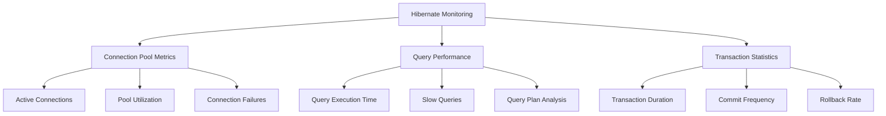

### Production Configuration Template

```xml
<!-- Production Hibernate Configuration -->
<property name="hibernate.connection.pool_size">30</property>
<property name="hibernate.show_sql">false</property>
<property name="hibernate.format_sql">true</property>
<property name="hibernate.use_sql_comments">true</property>
<property name="hibernate.max_fetch_depth">3</property>
<property name="hibernate.jdbc.fetch_size">100</property>
<property name="hibernate.jdbc.batch_size">25</property>
<property name="hibernate.cache.use_second_level_cache">false</property>
<property name="hibernate.cache.use_query_cache">false</property>
```

**Section sources**
- [application.properties](file://src/main/resources/application.properties#L30-L50)

## Troubleshooting Guide

Common Hibernate configuration issues and their resolution strategies.

### SessionFactory Initialization Failures

**Symptoms**: Application startup failures, ClassNotFoundException, or configuration errors

**Common Causes and Solutions**:

| Issue | Cause | Solution |
|-------|-------|----------|
| Dialect Mismatch | Incorrect dialect specification | Verify database type and use appropriate dialect |
| Driver Class Not Found | Missing JDBC driver | Add driver to classpath and verify driver class name |
| Connection Pool Issues | Insufficient pool size | Increase pool size or optimize connection usage |
| Configuration Conflicts | Duplicate property settings | Review configuration files for conflicts |

### Dialect Mismatches

**Problem**: SQL syntax errors or unsupported features

**Resolution Steps**:

1. **Verify Database Version**: Confirm actual database version
2. **Check Dialect Compatibility**: Ensure dialect supports required features
3. **Enable SQL Logging**: Set `hibernate.show_sql=true` for debugging
4. **Review Generated SQL**: Compare with database-specific SQL requirements

### Connection Pool Issues

**Common Problems**:

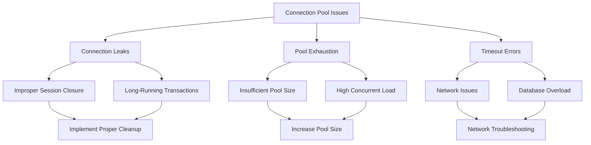

### Transaction Management Issues

**Common Transaction Problems**:

1. **Orphaned Transactions**: Transactions not properly committed or rolled back
2. **Deadlock Detection**: Database deadlock conditions
3. **Isolation Level Conflicts**: Concurrency control issues
4. **Resource Leaks**: Unclosed database resources

### Debugging Strategies

Essential debugging approaches:

1. **Enable SQL Logging**: Monitor generated SQL statements
2. **Connection Pool Monitoring**: Track pool utilization and growth
3. **Transaction Tracing**: Log transaction boundaries and duration
4. **Exception Analysis**: Review stack traces and error messages

**Section sources**
- [HibernateUtil.java](file://src/main/java/net/sam/dcl/util/HibernateUtil.java#L30-L40)

## Configuration Migration

The application supports gradual migration from legacy Hibernate configuration to modern JPA standards while maintaining backward compatibility.

### Migration Phases

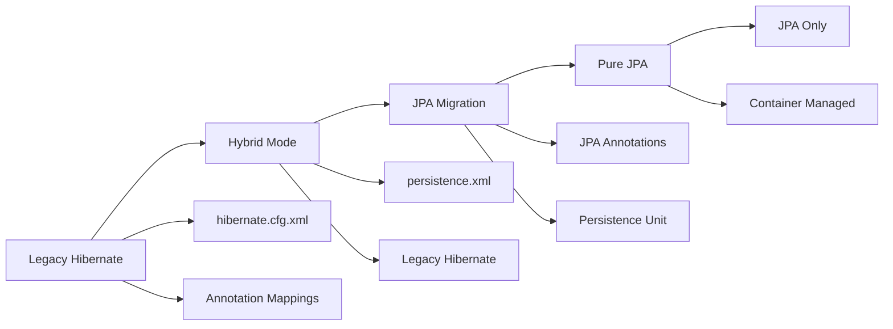

### Migration Checklist

**Phase 1: Preparation**
- [ ] Review existing entity mappings
- [ ] Document current configuration
- [ ] Set up JPA persistence unit
- [ ] Configure JNDI data sources

**Phase 2: Hybrid Implementation**
- [ ] Enable persistence.xml configuration
- [ ] Gradually introduce JPA entities
- [ ] Maintain legacy Hibernate support
- [ ] Test hybrid functionality

**Phase 3: Migration Completion**
- [ ] Remove legacy Hibernate dependencies
- [ ] Convert remaining entities to JPA
- [ ] Update configuration files
- [ ] Comprehensive testing

### Compatibility Considerations

During migration, maintain compatibility through:

1. **Shared Configuration**: Common property definitions
2. **Dual Providers**: Support both Hibernate and JPA providers
3. **Gradual Adoption**: Incremental entity migration
4. **Testing Strategy**: Comprehensive validation at each phase

**Section sources**
- [persistence.xml](file://src/main/resources/META-INF/persistence.xml#L1-L68)
- [application.properties](file://src/main/resources/application.properties#L1-L60)