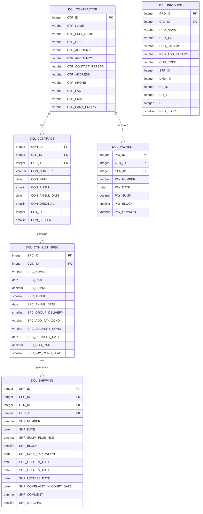
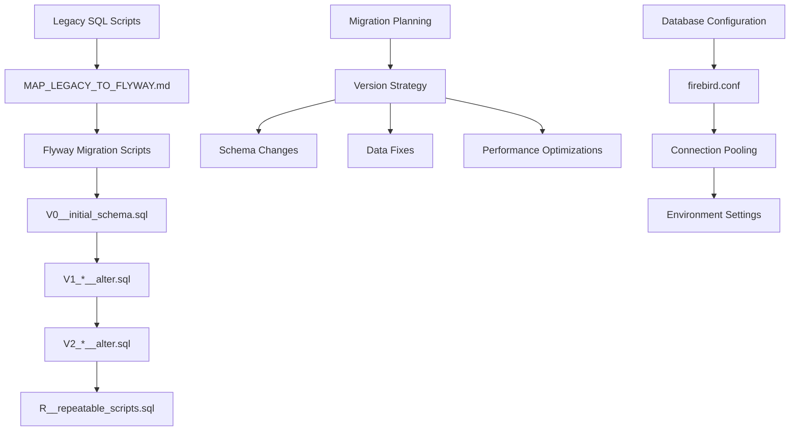
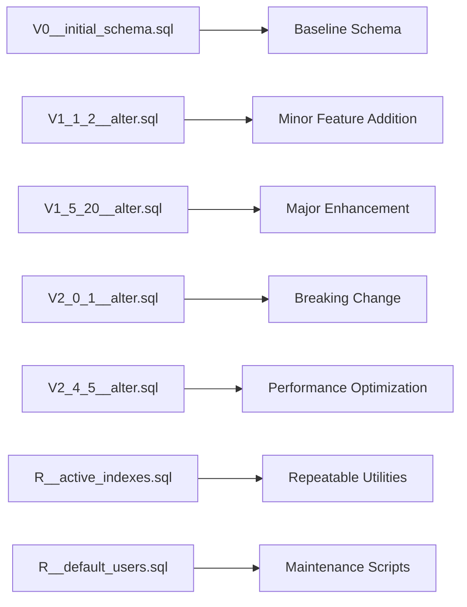
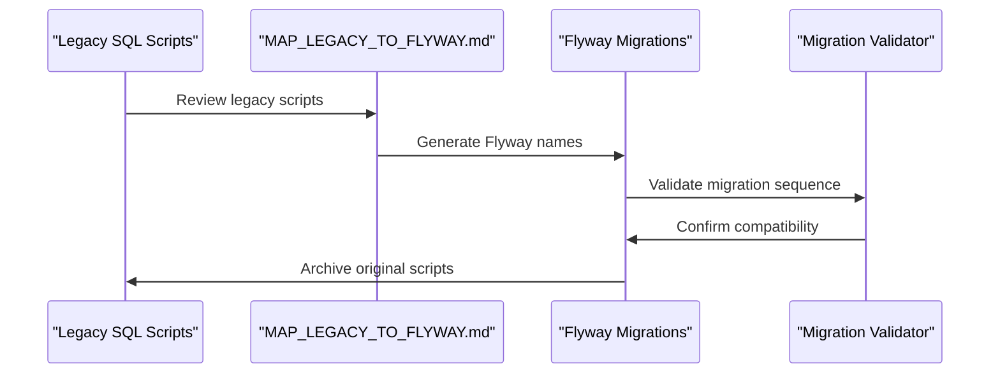
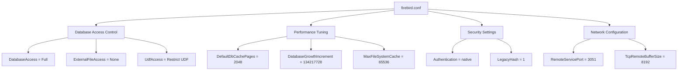
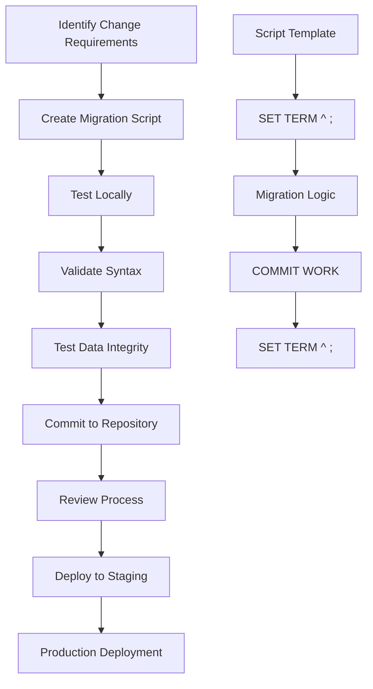
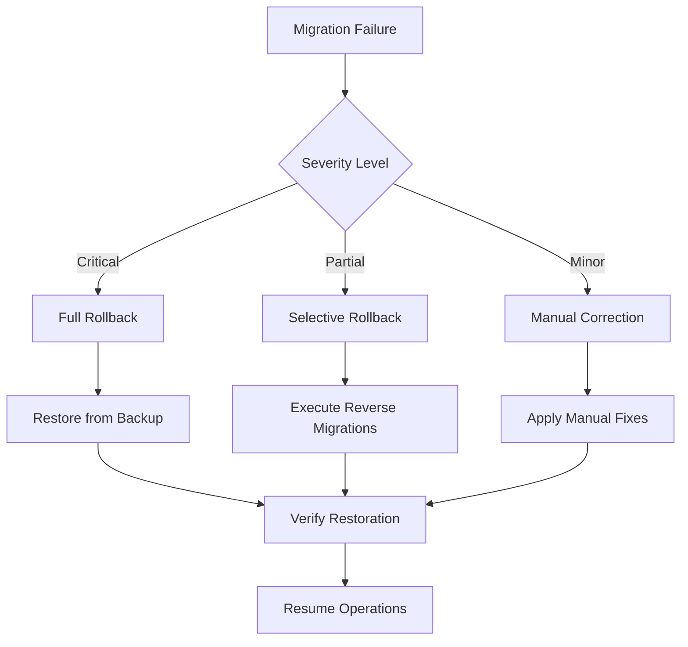
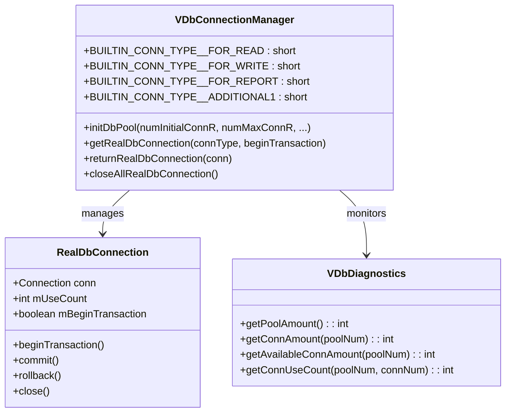
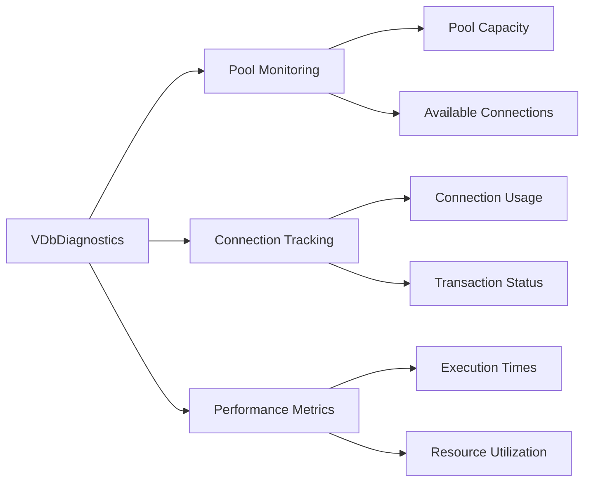

# Database & Migration

<cite>
**Referenced Files in This Document**
- [V0__initial_schema.sql](file://db/migration/V0__initial_schema.sql)
- [MAP_LEGACY_TO_FLYWAY.md](file://db/migration/MAP_LEGACY_TO_FLYWAY.md)
- [README.md](file://db/migration/README.md)
- [firebird.conf](file://db/firebird/firebird.conf)
- [V1_1_2__alter.sql](file://db/migration/V1_1_2__alter.sql)
- [V2_0_1__alter.sql](file://db/migration/V2_0_1__alter.sql)
- [R__active_indexes.sql](file://db/migration/R__active_indexes.sql)
- [V1_5_20__alter.sql](file://db/migration/V1_5_20__alter.sql)
- [V2_4_5__alter.sql](file://db/migration/V2_4_5__alter.sql)
- [V1_1_10__alter.sql](file://db/migration/V1_1_10__alter.sql)
- [V2_0_1__alter_before.sql](file://db/migration/V2_0_1__alter_before.sql)
- [pom.xml](file://pom.xml)
- [application.properties](file://src/main/resources/application.properties)
- [META-INF/context.xml](file://META-INF/context.xml)
- [VDbConnectionManager.java](file://src/main/java/net/sam/dcl/db/VDbConnectionManager.java)
</cite>

## Table of Contents
1. [Introduction](#introduction)
2. [Firebird Database Schema Structure](#firebird-database-schema-structure)
3. [Flyway Migration Strategy](#flyway-migration-strategy)
4. [Migration Versioning and Naming Conventions](#migration-versioning-and-naming-conventions)
5. [Legacy Migration to Flyway](#legacy-migration-to-flyway)
6. [Database Configuration](#database-configuration)
7. [Practical Migration Examples](#practical-migration-examples)
8. [Best Practices and Rollback Strategies](#best-practices-and-rollback-strategies)
9. [Database Connection Management](#database-connection-management)
10. [Troubleshooting and Maintenance](#troubleshooting-and-maintenance)

## Introduction

The dcl_v3 system employs a sophisticated database migration strategy built around Firebird database technology and Flyway migration framework. This comprehensive approach ensures controlled schema evolution, data integrity maintenance, and seamless deployment processes across different environments.

The database architecture encompasses a robust initial schema defined in V0__initial_schema.sql, complemented by extensive migration scripts that handle incremental schema changes, data transformations, and performance optimizations. The migration strategy demonstrates a clear progression from legacy SQL scripts to modern Flyway-based migrations, providing both forward compatibility and backward migration capabilities.

## Firebird Database Schema Structure

### Initial Schema Foundation

The foundation of the dcl_v3 database is established through the V0__initial_schema.sql file, which creates a comprehensive schema with over 100 tables, views, stored procedures, and user-defined functions. This initial schema serves as the baseline for all subsequent migrations and contains essential business entities including contractors, products, orders, shipments, and financial transactions.



**Diagram sources**
- [V0__initial_schema.sql](file://db/migration/V0__initial_schema.sql#L1-L30034)

### Core Entity Relationships

The schema demonstrates sophisticated business logic through carefully designed entity relationships. Key relationships include:

- **Contractor Management**: The DCL_CONTRACTOR table maintains comprehensive supplier and customer information with UNP (Unified State Registration Number) validation
- **Product Catalog**: Products are organized hierarchically through categories while maintaining cross-references for efficient querying
- **Order Processing**: Contracts and specifications form the backbone of the order management system with flexible delivery conditions
- **Financial Tracking**: Payments and shipments are tightly integrated with revenue recognition and cash flow management

**Section sources**
- [V0__initial_schema.sql](file://db/migration/V0__initial_schema.sql#L1-L799)

## Flyway Migration Strategy

### Migration Framework Architecture

The dcl_v3 system implements a comprehensive Flyway migration strategy that provides version-controlled database schema evolution. The migration framework operates through a structured approach that separates development, testing, and production environments while maintaining data integrity throughout the process.



**Diagram sources**
- [README.md](file://db/migration/README.md#L1-L63)
- [MAP_LEGACY_TO_FLYWAY.md](file://db/migration/MAP_LEGACY_TO_FLYWAY.md#L1-L240)

### Migration Types and Purposes

The migration strategy encompasses three primary types of database changes:

#### Schema Evolution Migrations (V1_*, V2_*)
These migrations handle structural changes to the database schema, including table additions, modifications, and deletions. They represent the core evolution of the database structure as business requirements change.

#### Data Transformation Migrations
These migrations address data integrity issues, perform data cleanup operations, and implement business logic changes that require data manipulation. They ensure data consistency while evolving the schema.

#### Repeatable Utility Scripts (R__*)
These scripts provide ongoing maintenance capabilities and can be executed multiple times safely. They handle index management, data validation, and operational utilities.

**Section sources**
- [README.md](file://db/migration/README.md#L1-L63)

## Migration Versioning and Naming Conventions

### Versioning Strategy

The dcl_v3 migration system employs a hierarchical versioning strategy using the V{major}_{minor}_{patch}__{description}.sql naming convention. This approach provides clear version identification and facilitates organized migration sequencing.



**Diagram sources**
- [V1_1_2__alter.sql](file://db/migration/V1_1_2__alter.sql#L1-L202)
- [V2_0_1__alter.sql](file://db/migration/V2_0_1__alter.sql#L1-L799)
- [R__active_indexes.sql](file://db/migration/R__active_indexes.sql#L1-L265)

### Migration Categories

The system organizes migrations into distinct categories based on their impact and purpose:

| Migration Type | Pattern | Purpose | Example |
|----------------|---------|---------|---------|
| Baseline Schema | V0__{name}.sql | Initial database creation | V0__initial_schema.sql |
| Minor Updates | V1_{version}__{name}.sql | Small feature additions | V1_1_2__alter.sql |
| Major Enhancements | V2_{version}__{name}.sql | Significant structural changes | V2_0_1__alter.sql |
| Repeatable Scripts | R__{name}.sql | Utility and maintenance scripts | R__active_indexes.sql |

**Section sources**
- [MAP_LEGACY_TO_FLYWAY.md](file://db/migration/MAP_LEGACY_TO_FLYWAY.md#L1-L240)

## Legacy Migration to Flyway

### Migration Mapping Process

The transition from legacy SQL scripts to Flyway migrations follows a systematic approach documented in MAP_LEGACY_TO_FLYWAY.md. This mapping process ensures that historical database changes are preserved while adopting modern migration practices.



**Diagram sources**
- [MAP_LEGACY_TO_FLYWAY.md](file://db/migration/MAP_LEGACY_TO_FLYWAY.md#L1-L240)

### Conversion Patterns

The migration mapping demonstrates consistent conversion patterns:

- **Legacy Naming**: Alter-{version}.sql → V{version}__alter.sql
- **Utility Scripts**: Various *.sql → R__{name}.sql
- **Pre-migration Tasks**: Scripts with _before suffix → V{version}__alter_before.sql

### Validation and Testing

Each migrated script undergoes rigorous validation to ensure compatibility with the Flyway framework and maintain data integrity. The validation process includes:

- **Syntax Verification**: Ensuring SQL syntax compatibility
- **Dependency Checking**: Verifying foreign key and constraint relationships
- **Data Integrity**: Confirming data preservation during schema changes
- **Performance Impact**: Assessing migration execution time and resource usage

**Section sources**
- [MAP_LEGACY_TO_FLYWAY.md](file://db/migration/MAP_LEGACY_TO_FLYWAY.md#L1-L240)

## Database Configuration

### Firebird Configuration Settings

The Firebird database configuration is managed through the firebird.conf file, which provides comprehensive control over database behavior, performance tuning, and security settings.



**Diagram sources**
- [firebird.conf](file://db/firebird/firebird.conf#L1-L767)

### Key Configuration Parameters

The configuration file establishes critical database parameters:

| Parameter | Value | Purpose |
|-----------|-------|---------|
| DatabaseAccess | Full | Controls database file access permissions |
| DefaultDbCachePages | 2048 | Sets initial database page cache size |
| DatabaseGrowthIncrement | 128MB | Configures automatic database growth |
| RemoteServicePort | 3051 | Specifies TCP port for database connections |
| Authentication | native | Enables traditional Firebird authentication |

### Connection Pool Configuration

The application implements sophisticated connection pooling through the VDbConnectionManager class, which manages different connection types for optimal performance:

- **Read Connections**: Optimized for query-heavy operations
- **Write Connections**: Designed for transactional updates
- **Report Connections**: Dedicated to long-running analytical queries
- **Additional Connections**: Specialized for specific operational needs

**Section sources**
- [firebird.conf](file://db/firebird/firebird.conf#L1-L767)
- [VDbConnectionManager.java](file://src/main/java/net/sam/dcl/db/VDbConnectionManager.java#L1-L37)

## Practical Migration Examples

### Adding New Migration Scripts

Creating new migration scripts follows a structured approach that ensures consistency and maintainability:



### Data Transformation Examples

The migration system handles complex data transformations through carefully crafted SQL scripts. Key transformation patterns include:

#### Field Modification with Data Preservation
Scripts that alter field definitions while preserving existing data integrity:

```sql
-- Example pattern from V2_0_1__alter_before.sql
update RDB$RELATION_FIELDS set
RDB$NULL_FLAG = NULL
where (RDB$FIELD_NAME = 'PRD_ID') and
(RDB$RELATION_NAME = 'DCL_ORD_LIST_PRODUCE');
```

#### Business Logic Updates
Stored procedure modifications that enhance functionality while maintaining backward compatibility:

```sql
-- Example pattern from V1_5_20__alter.sql
CREATE OR ALTER procedure DCL_SHIPPING_REPORT
```

#### Index Management
Automated index optimization through repeatable scripts:

```sql
-- Example pattern from R__active_indexes.sql
select 'alter index ' || RDB$INDEX_NAME || ' inactive;'
from RDB$INDICES
where RDB$INDEX_NAME not like 'RDB$%' and RDB$INDEX_NAME not like 'PK_%';
```

### Conflict Resolution Strategies

The migration system implements several strategies for resolving potential conflicts:

- **Idempotent Operations**: Ensuring scripts can be safely rerun
- **Conditional Logic**: Using EXISTS checks to prevent duplicate operations
- **Backup Procedures**: Creating data backups before destructive operations
- **Rollback Mechanisms**: Maintaining ability to revert problematic migrations

**Section sources**
- [V1_1_2__alter.sql](file://db/migration/V1_1_2__alter.sql#L1-L202)
- [V2_0_1__alter.sql](file://db/migration/V2_0_1__alter.sql#L1-L799)
- [R__active_indexes.sql](file://db/migration/R__active_indexes.sql#L1-L265)

## Best Practices and Rollback Strategies

### Migration Best Practices

The dcl_v3 system implements comprehensive best practices for database migrations:

#### Development Guidelines
- **Single Responsibility**: Each migration script addresses one specific change
- **Idempotency**: Scripts can be safely executed multiple times
- **Testing**: Thorough testing in isolated environments before production deployment
- **Documentation**: Clear comments explaining the purpose and impact of each change

#### Production Deployment
- **Staged Rollout**: Gradual deployment across environments
- **Monitoring**: Continuous monitoring of migration performance and impact
- **Backup Creation**: Automatic backup creation before major migrations
- **Validation Checks**: Post-migration verification of data integrity

### Rollback Strategies

The system provides multiple rollback mechanisms for different scenarios:



### Recovery Procedures

The system implements comprehensive recovery procedures:

#### Automated Recovery
- **Checkpoint Creation**: Automatic checkpoints during long-running migrations
- **Transaction Rollback**: Immediate rollback capability for failed transactions
- **State Restoration**: Quick restoration to known good states

#### Manual Recovery
- **Script-Based Recovery**: Pre-defined recovery scripts for common failure scenarios
- **Data Repair Tools**: Utilities for repairing corrupted data structures
- **Manual Intervention Procedures**: Step-by-step guides for complex recovery situations

**Section sources**
- [README.md](file://db/migration/README.md#L1-L63)

## Database Connection Management

### Connection Pool Architecture

The dcl_v3 system implements a sophisticated connection management architecture through the VDbConnectionManager class, which provides optimized database connectivity for different operational modes.



**Diagram sources**
- [VDbConnectionManager.java](file://src/main/java/net/sam/dcl/db/VDbConnectionManager.java#L1-L37)

### Connection Pool Configuration

The connection pool system supports multiple connection types optimized for different use cases:

| Connection Type | Purpose | Initial Size | Max Size | Transaction Mode |
|----------------|---------|--------------|----------|------------------|
| FOR_READ | Query operations | 2 | 20 | Auto-commit |
| FOR_WRITE | Transactional updates | 1 | 10 | Manual control |
| FOR_REPORT | Analytics queries | 1 | 5 | Auto-commit |
| ADDITIONAL1 | Special operations | 1 | 1 | Configurable |

### Performance Optimization

The connection management system implements several performance optimization strategies:

- **Connection Reuse**: Intelligent reuse of existing connections
- **Load Balancing**: Distribution of connections across available resources
- **Idle Timeout**: Automatic cleanup of unused connections
- **Health Monitoring**: Continuous monitoring of connection health

**Section sources**
- [VDbConnectionManager.java](file://src/main/java/net/sam/dcl/db/VDbConnectionManager.java#L189-L263)

## Troubleshooting and Maintenance

### Common Issues and Solutions

The database migration system addresses common issues through proactive measures and comprehensive troubleshooting procedures:

#### Migration Failures
- **Syntax Errors**: Comprehensive validation before migration execution
- **Constraint Violations**: Pre-migration data integrity checks
- **Performance Issues**: Resource monitoring and optimization
- **Concurrency Conflicts**: Lock management and retry mechanisms

#### Database Maintenance
- **Index Optimization**: Regular index maintenance through R__ scripts
- **Statistics Updates**: Automated statistics collection for query optimization
- **Cleanup Operations**: Scheduled cleanup of obsolete data and structures
- **Performance Monitoring**: Continuous performance metrics collection

### Diagnostic Tools

The system provides comprehensive diagnostic capabilities through the VDbDiagnostics class:



**Diagram sources**
- [VDbDiagnostics.java](file://src/main/java/net/sam/dcl/db/VDbDiagnostics.java#L1-L55)

### Maintenance Procedures

Regular maintenance procedures ensure optimal database performance and reliability:

- **Weekly Index Maintenance**: Automated index optimization
- **Monthly Statistics Updates**: Refresh of query optimizer statistics
- **Quarterly Cleanup Operations**: Comprehensive data cleanup
- **Annual Performance Reviews**: Complete system assessment

**Section sources**
- [VDbDiagnostics.java](file://src/main/java/net/sam/dcl/db/VDbDiagnostics.java#L47-L95)