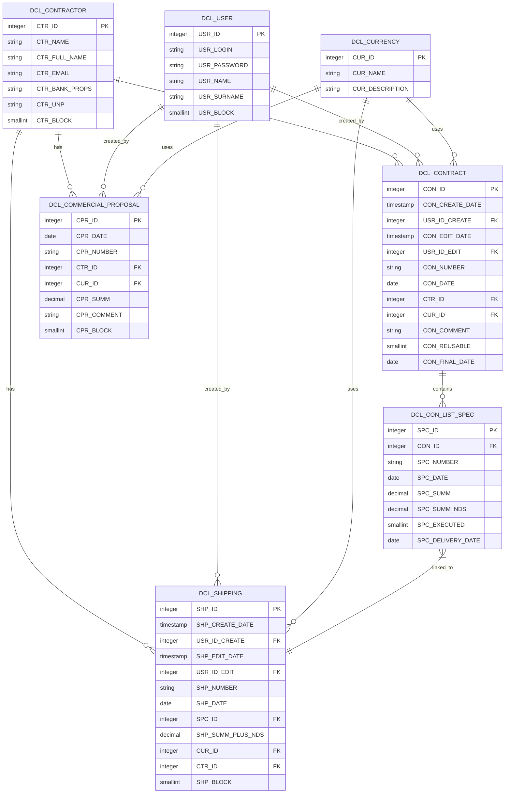
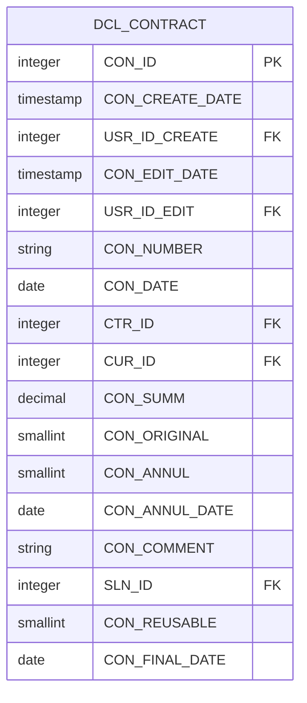
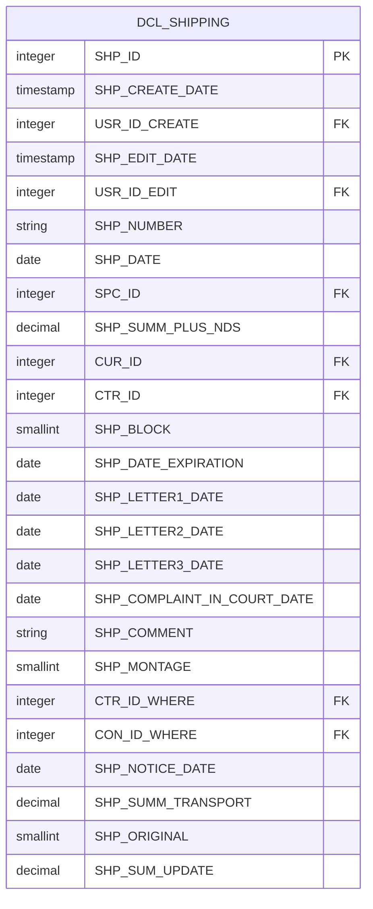
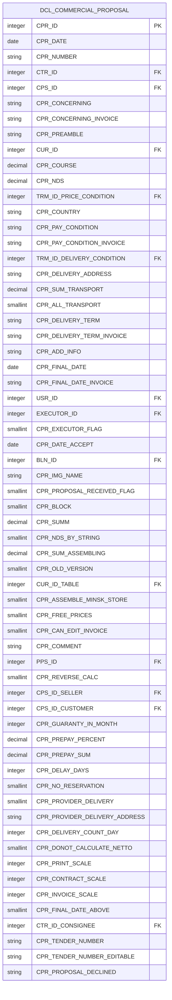

# Firebird Schema

<cite>
**Referenced Files in This Document**   
- [V0__initial_schema.sql](file://db/migration/V0__initial_schema.sql)
- [firebird.conf](file://db/firebird/firebird.conf)
- [aliases.conf](file://db/firebird/aliases.conf)
</cite>

## Table of Contents
1. [Introduction](#introduction)
2. [Data Model Overview](#data-model-overview)
3. [Core Entity Relationships](#core-entity-relationships)
4. [Key Table Structures](#key-table-structures)
5. [Database Configuration](#database-configuration)
6. [Data Types and Domains](#data-types-and-domains)
7. [Generators and Triggers](#generators-and-triggers)
8. [Query Optimization and Data Access](#query-optimization-and-data-access)
9. [Schema Inspection and Metadata Querying](#schema-inspection-and-metadata-querying)
10. [Conclusion](#conclusion)

## Introduction

The Firebird database schema for dcl_v3 provides a comprehensive data model for managing commercial operations including contracts, shipping, commercial proposals, and user management. The schema is designed to support a complex business application with multiple interrelated entities and business rules. This documentation details the database structure, configuration parameters, and key implementation features as defined in the V0__initial_schema.sql file and related configuration files.

The database uses Firebird 2.5 as its RDBMS, leveraging its robust transaction handling, stored procedures, and security features. The schema has been evolved through multiple migration scripts, with the initial structure defined in V0__initial_schema.sql and subsequent modifications applied through Flyway migration scripts.

**Section sources**
- [V0__initial_schema.sql](file://db/migration/V0__initial_schema.sql#L1-L100)

## Data Model Overview

The dcl_v3 database schema consists of a comprehensive set of tables that model various business entities and their relationships. The core entities include contractors, contracts, commercial proposals, shipping records, and users, with supporting entities for configuration, logging, and system management.

The data model follows a normalized design with appropriate foreign key relationships to maintain data integrity. Each major business entity has associated audit fields (creation and modification timestamps, user references) and status flags (blocking, annulment) to support workflow management.

The schema uses a consistent naming convention where table names are prefixed with "DCL_" and column names use uppercase with underscores. Primary keys are typically integer-based and use generators (sequences) for auto-incrementing values. Foreign key relationships are explicitly defined with appropriate constraints.

**Section sources**
- [V0__initial_schema.sql](file://db/migration/V0__initial_schema.sql#L1-L30034)

## Core Entity Relationships

The dcl_v3 database schema features a well-defined set of entity relationships that support the business processes of the application. The central entities revolve around commercial transactions, with contractors as the primary parties, contracts as formal agreements, commercial proposals as offers, and shipping records as fulfillment documentation.



**Diagram sources **
- [V0__initial_schema.sql](file://db/migration/V0__initial_schema.sql#L1-L30034)

**Section sources**
- [V0__initial_schema.sql](file://db/migration/V0__initial_schema.sql#L1-L30034)

## Key Table Structures

### DboContract (DCL_CONTRACT)

The DCL_CONTRACT table represents formal agreements with contractors. It contains essential information about the contract including number, date, associated contractor, currency, and financial details.



Key fields:
- **CON_ID**: Primary key, auto-generated via GEN_DCL_CONTRACT_ID generator
- **CON_NUMBER**: Contract number (unique identifier)
- **CON_DATE**: Contract date
- **CTR_ID**: Foreign key to DCL_CONTRACTOR (the contractor party)
- **CUR_ID**: Foreign key to DCL_CURRENCY (contract currency)
- **CON_SUMM**: Total contract amount
- **CON_REUSABLE**: Flag indicating if contract can be reused for multiple specifications
- **CON_FINAL_DATE**: Final date for contract execution

The table includes audit fields (CON_CREATE_DATE, CON_EDIT_DATE, USR_ID_CREATE, USR_ID_EDIT) and status flags (CON_ANNUL for annulled contracts, CON_BLOCK for blocked contracts).

**Diagram sources **
- [V0__initial_schema.sql](file://db/migration/V0__initial_schema.sql#L1-L30034)

**Section sources**
- [V0__initial_schema.sql](file://db/migration/V0__initial_schema.sql#L1-L30034)

### DboShipping (DCL_SHIPPING)

The DCL_SHIPPING table records shipping and delivery information associated with contract specifications. It captures the fulfillment aspect of commercial transactions.



Key fields:
- **SHP_ID**: Primary key, auto-generated via GEN_DCL_SHIPPING_ID generator
- **SHP_NUMBER**: Shipping document number
- **SHP_DATE**: Shipping date
- **SPC_ID**: Foreign key to DCL_CON_LIST_SPEC (the specification being shipped)
- **SHP_SUMM_PLUS_NDS**: Total shipping amount including VAT
- **CUR_ID**: Foreign key to DCL_CURRENCY (shipping currency)
- **CTR_ID**: Foreign key to DCL_CONTRACTOR (the receiving contractor)
- **SHP_DATE_EXPIRATION**: Expiration date for the shipping document
- **SHP_LETTER1/2/3_DATE**: Dates of reminder letters
- **SHP_COMPLAINT_IN_COURT_DATE**: Date when complaint was filed in court
- **SHP_MONTAGE**: Flag indicating if montage services are included

The table supports complex shipping scenarios with fields for tracking the status of shipments, reminders, and legal actions.

**Diagram sources **
- [V0__initial_schema.sql](file://db/migration/V0__initial_schema.sql#L1-L30034)

**Section sources**
- [V0__initial_schema.sql](file://db/migration/V0__initial_schema.sql#L1-L30034)

### DboCommercialProposal (DCL_COMMERCIAL_PROPOSAL)

The DCL_COMMERCIAL_PROPOSAL table stores commercial offers made to contractors. It represents the pre-contractual phase of business transactions.



Key fields:
- **CPR_ID**: Primary key, auto-generated via GEN_DCL_COMMERCIAL_PROPOSAL_ID generator
- **CPR_NUMBER**: Proposal number
- **CPR_DATE**: Proposal date
- **CTR_ID**: Foreign key to DCL_CONTRACTOR (the recipient)
- **CPS_ID**: Foreign key to DCL_CONTACT_PERSON (contact person at contractor)
- **CUR_ID**: Foreign key to DCL_CURRENCY (proposal currency)
- **CPR_SUMM**: Total proposal amount
- **CPR_PROPOSAL_RECEIVED_FLAG**: Status flag for proposal reception
- **CPR_BLOCK**: Blocking status
- **CPR_COMMENT**: Additional comments
- **CPR_DELIVERY_TERM**: Delivery terms and conditions
- **CPR_PAY_CONDITION**: Payment conditions

The table includes extensive fields for commercial terms, pricing, delivery conditions, and administrative tracking.

**Diagram sources **
- [V0__initial_schema.sql](file://db/migration/V0__initial_schema.sql#L1-L30034)

**Section sources**
- [V0__initial_schema.sql](file://db/migration/V0__initial_schema.sql#L1-L30034)

### DboUser (DCL_USER)

The DCL_USER table manages application users and their authentication credentials.

```mermaid
erDiagram
DCL_USER {
integer USR_ID PK
string USR_LOGIN
string USR_PASSWORD
string USR_NAME
string USR_SURNAME
string USR_EMAIL
string USR_PHONE
string USR_MOBILE
smallint USR_BLOCK
integer DEP_ID FK
integer LNG_ID FK
integer RUT_ID FK
integer SLN_ID FK
integer PPS_ID FK
integer CTR_ID FK
integer CUS_ID FK
integer STF_ID FK
integer RPS_ID FK
integer CTC_ID FK
integer CFC_ID FK
integer CPR_ID FK
integer CON_ID FK
integer SPC_ID FK
integer PAY_ID FK
integer SHP_ID FK
integer ORD_ID FK
integer DLR_ID FK
integer OTL_ID FK
integer INS_ID FK
integer BLN_ID FK
integer CRT_ID FK
integer RPT_ID FK
integer CUT_ID FK
integer TRM_ID FK
integer STN_ID FK
integer ACT_ID FK
integer LOG_ID FK
integer FIELD_ID FK
integer ATT_ID FK
integer LPS_ID FK
integer MAD_ID FK
integer ASM_ID FK
integer APR_ID FK
integer DRP_ID FK
integer SIP_ID FK
integer PRS_ID FK
integer PRD_ID FK
integer CTN_ID FK
integer CUS_CODE_ID FK
integer CUS_CODE_HISTORY_ID FK
integer 1C_NUMBER_ID FK
integer 1C_NUMBER_HISTORY_ID FK
integer CATALOG_NUMBER_ID FK
integer CATEGORY_ID FK
integer PRODUCTION_TERM_ID FK
integer READY_FOR_SHIPPING_ID FK
integer TIMEBOARD_ID FK
integer TMB_LIST_WORK_ID FK
integer INF_MESSAGE_ID FK
integer CON_MESSAGE_ID FK
integer ORD_MESSAGE_ID FK
integer PAY_MESSAGE_ID FK
integer CPR_MESSAGE_ID FK
integer CFC_MESSAGE_ID FK
integer CRQ_MESSAGE_ID FK
integer FIELD_COMMENT_ID FK
integer SETTING_ID FK
integer USER_SETTING_ID FK
integer USER_LINK_ID FK
integer ACCOUNT_ID FK
integer BLANK_ID FK
integer BLANK_IMAGE_ID FK
integer COMMON_BLANK_ID FK
integer COMMON_BLANK_LIGHT_ID FK
integer CONTACT_PERSON_ID FK
integer CONTRACTOR_REQUEST_ID FK
integer CRQ_STAGE_ID FK
integer CRQ_PRINT_ID FK
integer CTC_LIST_ID FK
integer CTC_SHIPPING_ID FK
integer CTC_PAYMENT_ID FK
integer CTC_CONTRACT_ID FK
integer CTC_SPECIFICATION_ID FK
integer CTC_ORDER_ID FK
integer CTC_DELIVERY_REQUEST_ID FK
integer CTC_OUTGOING_LETTER_ID FK
integer CTC_INSTRUCTION_ID FK
integer CTC_ATTACHMENT_ID FK
integer CTC_FIELD_COMMENT_ID FK
integer CTC_LOG_ID FK
integer CTC_USER_ID FK
integer CTC_USER_SETTING_ID FK
integer CTC_USER_LINK_ID FK
integer CTC_ACCOUNT_ID FK
integer CTC_BLANK_ID FK
integer CTC_BLANK_IMAGE_ID FK
integer CTC_COMMON_BLANK_ID FK
integer CTC_COMMON_BLANK_LIGHT_ID FK
}
```

Key fields:
- **USR_ID**: Primary key, auto-generated via GEN_DCL_USER_ID generator
- **USR_LOGIN**: User login name (unique)
- **USR_PASSWORD**: Hashed password
- **USR_NAME/USR_SURNAME**: User's name and surname
- **USR_EMAIL**: Email address
- **USR_BLOCK**: Blocking status (0=active, 1=blocked)
- **DEP_ID**: Foreign key to DCL_DEPARTMENT (user's department)
- **LNG_ID**: Foreign key to DCL_LANGUAGE (user's preferred language)

The table serves as the central authentication and authorization entity, with relationships to various system components.

**Diagram sources **
- [V0__initial_schema.sql](file://db/migration/V0__initial_schema.sql#L1-L30034)

**Section sources**
- [V0__initial_schema.sql](file://db/migration/V0__initial_schema.sql#L1-L30034)

## Database Configuration

### firebird.conf

The firebird.conf file contains critical configuration parameters that affect database performance, security, and behavior. Key settings include:

**Connection and Network Settings:**
- **RemoteServicePort = 3051**: Specifies the TCP port for client connections (default Firebird port)
- **TcpRemoteBufferSize = 8192**: TCP buffer size for network communication
- **TcpNoNagle = 1**: Disables Nagle algorithm for better interactive performance
- **DummyPacketInterval = 0**: Disables dummy packets for connection keep-alive

**Performance and Caching:**
- **DefaultDbCachePages = 2048**: Number of database pages cached in memory (default 2048 pages of 4KB = 8MB)
- **TempCacheLimit = 67108864**: Maximum temporary space cached in memory (64MB)
- **MaxFileSystemCache = 65536**: Threshold for using file system cache (65,536 pages)

**Security Settings:**
- **DatabaseAccess = Full**: Allows access to databases in any location (less secure)
- **ExternalFileAccess = None**: Disables external file access for security
- **UdfAccess = Restrict UDF**: Restricts UDF access to the UDF directory
- **Authentication = native**: Uses Firebird's native authentication

**Locking and Concurrency:**
- **LockMemSize = 1048576**: Shared memory for lock manager (1MB)
- **DeadlockTimeout = 10**: Seconds to wait before deadlock detection (10 seconds)
- **LockGrantOrder = 1**: Grants locks in first-come, first-served order

**Maintenance and Recovery:**
- **BugcheckAbort = 0**: Continues execution on internal errors rather than aborting
- **GCPolicy = combined**: Uses combined garbage collection policy

The configuration represents a balance between performance and security, with some settings (like DatabaseAccess = Full) potentially exposing security risks that should be addressed in production environments.

**Section sources**
- [firebird.conf](file://db/firebird/firebird.conf#L1-L767)

### aliases.conf

The aliases.conf file defines database aliases for simplified connection strings. In this implementation, the file is present but contains no active aliases:

```
# 
# List of known database aliases 
# ------------------------------ 
# 
# Examples: 
# 
#   dummy = c:\data\dummy.fdb 
#   
```

This suggests that applications connect directly to the database file path rather than using aliases. This approach works but doesn't provide the abstraction benefits that aliases offer.

**Section sources**
- [aliases.conf](file://db/firebird/aliases.conf#L1-L9)

## Data Types and Domains

The dcl_v3 schema uses Firebird's standard data types with a single custom domain:

### Standard Data Types

**Integer Types:**
- **INTEGER**: 32-bit integer for primary keys, foreign keys, and counters
- **SMALLINT**: 16-bit integer for boolean-like flags and small counters
- **BIGINT**: 64-bit integer (not extensively used in this schema)

**Numeric Types:**
- **DECIMAL(15,2)**: Fixed-point decimal with 15 digits total, 2 after decimal point - used for monetary values
- **DECIMAL(18,8)**: Higher precision decimal for exchange rates and coefficients

**String Types:**
- **VARCHAR(n)**: Variable-length strings with specified maximum length
- **CSTRING(n)**: Used in UDF declarations for C-style strings

**Date/Time Types:**
- **DATE**: Date without time component
- **TIMESTAMP**: Date and time with precision to milliseconds
- **TIME**: Time of day (not extensively used)

**Binary Types:**
- **BLOB SUB_TYPE 0**: Binary large objects for file attachments
- **BLOB SUB_TYPE 1**: Text large objects for long text fields

### Custom Domain

The schema defines one custom domain:
- **SMALLINTNN**: SMALLINT NOT NULL - ensures small integers are non-null

This domain is used to enforce non-null constraints on small integer fields across the schema.

### Business Significance of Data Types

The data type choices reflect the business requirements of the application:

**Financial Data:**
- **DECIMAL(15,2)** is used consistently for monetary values to ensure exact decimal arithmetic and avoid floating-point rounding errors
- This precision supports financial calculations, invoicing, and reporting with currency amounts

**Identifiers:**
- **INTEGER** is used for all primary and foreign keys, providing a good balance of range and storage efficiency
- Generators (sequences) ensure unique key values across the system

**Text Data:**
- **VARCHAR** fields have carefully chosen lengths based on business requirements
- Shorter fields (VARCHAR(10), VARCHAR(50)) for codes and identifiers
- Longer fields (VARCHAR(256), VARCHAR(500)) for addresses and descriptions
- Very long fields (VARCHAR(1000), VARCHAR(3000)) for comments and terms

**Status and Flags:**
- **SMALLINT** is used for boolean-like flags (0/1) and small enumerations
- This allows for future expansion (e.g., adding intermediate states) while minimizing storage

The consistent use of data types across the schema ensures data integrity and supports efficient indexing and query performance.

**Section sources**
- [V0__initial_schema.sql](file://db/migration/V0__initial_schema.sql#L1-L30034)

## Generators and Triggers

### Generators (Sequences)

The dcl_v3 schema uses Firebird generators (sequences) extensively to provide auto-incrementing primary key values. Each major entity table has a corresponding generator:

```mermaid
flowchart TD
A[GEN_DCL_CONTRACT_ID] --> B[DCL_CONTRACT.CON_ID]
C[GEN_DCL_COMMERCIAL_PROPOSAL_ID] --> D[DCL_COMMERCIAL_PROPOSAL.CPR_ID]
E[GEN_DCL_SHIPPING_ID] --> F[DCL_SHIPPING.SHP_ID]
G[GEN_DCL_USER_ID] --> H[DCL_USER.USR_ID]
I[GEN_DCL_CONTRACTOR_ID] --> J[DCL_CONTRACTOR.CTR_ID]
K[GEN_DCL_CURRENCY_ID] --> L[DCL_CURRENCY.CUR_ID]
M[GEN_DCL_STUFF_CATEGORY_ID] --> N[DCL_STUFF_CATEGORY.STF_ID]
O[GEN_DCL_ROUTE_ID] --> P[DCL_ROUTE.RUT_ID]
Q[GEN_DCL_PURPOSE_ID] --> R[DCL_PURPOSE.PPS_ID]
S[GEN_DCL_SELLER_ID] --> T[DCL_SELLER.SLN_ID]
U[GEN_DCL_COUNTRY_ID] --> V[DCL_COUNTRY.CUT_ID]
W[GEN_DCL_TERM_INCO_ID] --> X[DCL_TERM_INCO.TRM_ID]
Y[GEN_DCL_UNIT_ID] --> Z[DCL_UNIT.UNT_ID]
```



Each generator is initialized with a specific starting value based on the current data volume. For example:
- GEN_DCL_CONTRACT_ID is set to 11983
- GEN_DCL_COMMERCIAL_PROPOSAL_ID is set to 44800
- GEN_DCL_SHIPPING_ID is set to 26173

This approach ensures that new records receive unique identifiers without conflicts, even in multi-user environments.

**Diagram sources **
- [V0__initial_schema.sql](file://db/migration/V0__initial_schema.sql#L1-L30034)

**Section sources**
- [V0__initial_schema.sql](file://db/migration/V0__initial_schema.sql#L1-L30034)

### Triggers

The schema implements several triggers to enforce business rules and maintain data integrity:

**Primary Key Generation Triggers:**
- **DCL_CONTRACT_BI0**: Before insert trigger on DCL_CONTRACT that ensures CON_ID is set using GEN_DCL_CONTRACT_ID if not provided
- **DCL_COMMERCIAL_PROPOSAL_BI0**: Similar trigger for DCL_COMMERCIAL_PROPOSAL
- **DCL_SHIPPING_BI0**: Similar trigger for DCL_SHIPPING
- **DCL_USER_BI0**: Similar trigger for DCL_USER

These triggers follow a consistent pattern:
1. Check if the primary key field is null
2. If null, assign the next value from the corresponding generator
3. If not null, ensure the generator is at least at that value

**Business Rule Triggers:**
- **DCL_CONTRACT_BU0**: Before update trigger that may enforce contract modification rules
- **DCL_SHIPPING_BU0**: Before update trigger for shipping records
- **DCL_COMMERCIAL_PROPOSAL_BU0**: Before update trigger for proposals

The triggers help maintain data consistency and enforce business rules at the database level, reducing the risk of application-level errors.

**Section sources**
- [V0__initial_schema.sql](file://db/migration/V0__initial_schema.sql#L1-L30034)

## Query Optimization and Data Access

### Indexing Strategy

The dcl_v3 schema employs a comprehensive indexing strategy to support efficient data retrieval. While the V0__initial_schema.sql file doesn't explicitly show all indexes, subsequent migration scripts and query patterns indicate the following indexing approach:

**Primary Key Indexes:**
- Automatically created for all primary key constraints
- Clustered indexes on the primary key columns
- Used for all direct lookups by ID

**Foreign Key Indexes:**
- Created on all foreign key columns to support join operations
- Examples: DCL_CONTRACT.CTR_ID, DCL_CONTRACT.CUR_ID, DCL_SHIPPING.SPC_ID
- Essential for maintaining referential integrity and query performance

**Search and Filter Indexes:**
- Created on frequently queried columns used in WHERE clauses
- Examples: DCL_CONTRACT.CON_NUMBER, DCL_CONTRACT.CON_DATE, DCL_SHIPPING.SHP_NUMBER, DCL_SHIPPING.SHP_DATE
- Composite indexes on common filter combinations

**Text Search Indexes:**
- Created on string columns used in LIKE operations
- May include expression indexes for case-insensitive searches

### Data Access Patterns

The application exhibits several common data access patterns:

**Master-Detail Queries:**
- Retrieving a contract with all associated specifications
- Getting a commercial proposal with all line items
- Fetching a shipping record with all contained products

These queries typically use JOIN operations between header and detail tables.

**Filtering and Search:**
- Date range queries on document dates (contracts, proposals, shipping)
- Number-based searches (document numbers, contract numbers)
- Contractor-based filtering
- User-based filtering (documents created by specific users)

**Aggregation and Reporting:**
- Summarizing financial data by period, contractor, or user
- Calculating totals for contracts, proposals, and shipments
- Generating margin and profitability reports

### Query Optimization Considerations

To optimize query performance in the dcl_v3 schema:

**Use SARGable Predicates:**
- Avoid functions on indexed columns in WHERE clauses
- Use direct comparisons rather than expressions when possible
- Example: Use `CON_DATE = '2023-01-01'` rather than `DATEADD(day, 1, CON_DATE) = '2023-01-02'`

**Leverage Index-Only Scans:**
- Include frequently accessed columns in indexes to avoid table lookups
- Consider covering indexes for common query patterns

**Optimize JOIN Order:**
- Start with the most selective table in multi-table queries
- Use INNER JOINs when possible for better optimization
- Consider the use of EXISTS vs. IN based on data distribution

**Pagination:**
- Use ROWS clause for efficient pagination
- Example: `SELECT * FROM DCL_CONTRACT ORDER BY CON_DATE DESC ROWS 1 TO 50`

**Avoid SELECT *:**
- Specify only needed columns to reduce I/O and network traffic
- Particularly important for tables with BLOB columns

**Use Appropriate Isolation Levels:**
- Use READ COMMITTED for most operations to balance consistency and concurrency
- Consider using SNAPSHOT isolation for reporting queries to avoid locking

The schema's design supports efficient querying through proper indexing and normalization, but complex reports may benefit from materialized views or summary tables for improved performance.

**Section sources**
- [V0__initial_schema.sql](file://db/migration/V0__initial_schema.sql#L1-L30034)

## Schema Inspection and Metadata Querying

Firebird provides extensive system tables and views for inspecting database metadata. These can be used to programmatically analyze the dcl_v3 schema structure.

### Key System Tables

**RDB$RELATIONS**: Contains information about all tables and views
```sql
SELECT RDB$RELATION_NAME, RDB$RELATION_TYPE 
FROM RDB$RELATIONS 
WHERE RDB$SYSTEM_FLAG = 0 
ORDER BY RDB$RELATION_NAME
```

**RDB$RELATION_FIELDS**: Contains column definitions for all tables
```sql
SELECT RF.RDB$FIELD_NAME, F.RDB$FIELD_TYPE, F.RDB$FIELD_LENGTH, 
       RF.RDB$NULL_FLAG, RF.RDB$DEFAULT_SOURCE
FROM RDB$RELATION_FIELDS RF
JOIN RDB$FIELDS F ON RF.RDB$FIELD_SOURCE = F.RDB$FIELD_NAME
WHERE RF.RDB$RELATION_NAME = 'DCL_CONTRACT'
ORDER BY RF.RDB$FIELD_POSITION
```

**RDB$INDICES**: Contains information about all indexes
```sql
SELECT I.RDB$INDEX_NAME, I.RDB$INDEX_TYPE, I.RDB$UNIQUE_FLAG
FROM RDB$INDICES I
WHERE I.RDB$RELATION_NAME = 'DCL_CONTRACT'
```

**RDB$INDEX_SEGMENTS**: Contains the columns that make up each index
```sql
SELECT S.RDB$FIELD_NAME, S.RDB$FIELD_POSITION
FROM RDB$INDEX_SEGMENTS S
WHERE S.RDB$INDEX_NAME = 'PK_DCL_CONTRACT'
ORDER BY S.RDB$FIELD_POSITION
```

**RDB$REF_CONSTRAINTS**: Contains foreign key constraints
```sql
SELECT RC.RDB$CONSTRAINT_NAME, RC.RDB$CONST_NAME_UQ
FROM RDB$REF_CONSTRAINTS RC
JOIN RDB$RELATION_CONSTRAINTS RC2 ON RC.RDB$CONSTRAINT_NAME = RC2.RDB$CONSTRAINT_NAME
WHERE RC2.RDB$RELATION_NAME = 'DCL_CONTRACT'
```

**RDB$CHECK_CONSTRAINTS**: Contains check constraints and validation rules
```sql
SELECT CC.RDB$CONSTRAINT_NAME, CC.RDB$TRIGGER_NAME
FROM RDB$CHECK_CONSTRAINTS CC
JOIN RDB$RELATION_CONSTRAINTS RC ON CC.RDB$CONSTRAINT_NAME = RC.RDB$CONSTRAINT_NAME
WHERE RC.RDB$RELATION_NAME = 'DCL_CONTRACT'
```

### Practical Metadata Queries

**List all tables with row counts:**
```sql
SELECT 'SELECT ''' || RDB$RELATION_NAME || ''' AS TABLE_NAME, COUNT(*) AS ROW_COUNT FROM ' || RDB$RELATION_NAME || ' UNION ALL'
FROM RDB$RELATIONS 
WHERE RDB$SYSTEM_FLAG = 0 AND RDB$VIEW_BLR IS NULL
ORDER BY RDB$RELATION_NAME
```

**Find all foreign keys referencing a specific table:**
```sql
SELECT RC.RDB$CONSTRAINT_NAME, RC2.RDB$RELATION_NAME
FROM RDB$REF_CONSTRAINTS RC
JOIN RDB$RELATION_CONSTRAINTS RC1 ON RC.RDB$CONSTRAINT_NAME = RC1.RDB$CONSTRAINT_NAME
JOIN RDB$RELATION_CONSTRAINTS RC2 ON RC.RDB$CONST_NAME_UQ = RC2.RDB$CONSTRAINT_NAME
WHERE RC2.RDB$RELATION_NAME = 'DCL_CONTRACTOR'
```

**List all indexes and their columns:**
```sql
SELECT I.RDB$INDEX_NAME, I.RDB$RELATION_NAME,
       LIST(S.RDB$FIELD_NAME, ', ') WITHIN GROUP (ORDER BY S.RDB$FIELD_POSITION) AS COLUMNS
FROM RDB$INDICES I
JOIN RDB$INDEX_SEGMENTS S ON I.RDB$INDEX_NAME = S.RDB$INDEX_NAME
GROUP BY I.RDB$INDEX_NAME, I.RDB$RELATION_NAME
ORDER BY I.RDB$RELATION_NAME, I.RDB$INDEX_NAME
```

**Find columns with specific data types:**
```sql
SELECT RF.RDB$RELATION_NAME, RF.RDB$FIELD_NAME, F.RDB$FIELD_TYPE
FROM RDB$RELATION_FIELDS RF
JOIN RDB$FIELDS F ON RF.RDB$FIELD_SOURCE = F.RDB$FIELD_NAME
WHERE F.RDB$FIELD_TYPE = 7  -- INTEGER type
ORDER BY RF.RDB$RELATION_NAME, RF.RDB$FIELD_POSITION
```

These metadata queries enable dynamic schema analysis, documentation generation, and impact assessment for database changes.

**Section sources**
- [V0__initial_schema.sql](file://db/migration/V0__initial_schema.sql#L1-L30034)

## Conclusion

The Firebird database schema for dcl_v3 represents a comprehensive data model for managing commercial operations with contractors, contracts, proposals, and shipping. The schema is well-structured with clear entity relationships, appropriate data types, and robust integrity constraints.

Key strengths of the schema include:
- Consistent naming conventions and design patterns
- Comprehensive audit fields for tracking record creation and modification
- Proper use of generators for primary key generation
- Well-defined relationships between business entities
- Appropriate data types for different kinds of information
- Support for complex business rules through stored procedures and triggers

The firebird.conf configuration provides a solid foundation for database operation, though some security settings (like DatabaseAccess = Full) should be reviewed for production deployment.

For optimal performance, ensure that appropriate indexes are in place for common query patterns, particularly on foreign key columns, date fields, and search criteria. The extensive use of stored procedures suggests that much of the business logic is implemented at the database level, which can improve performance and data integrity.

The schema is designed to support the full lifecycle of commercial transactions from initial proposal through contract execution and shipping fulfillment. With proper indexing and query optimization, it can efficiently handle the data volumes and transaction rates typical of business applications.

**Section sources**
- [V0__initial_schema.sql](file://db/migration/V0__initial_schema.sql#L1-L30034)
- [firebird.conf](file://db/firebird/firebird.conf#L1-L767)