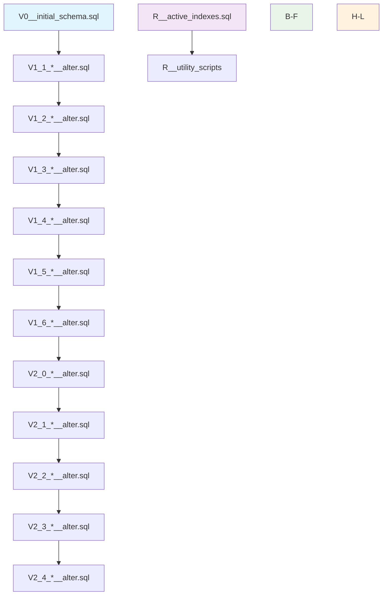
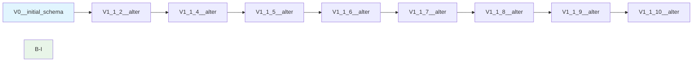
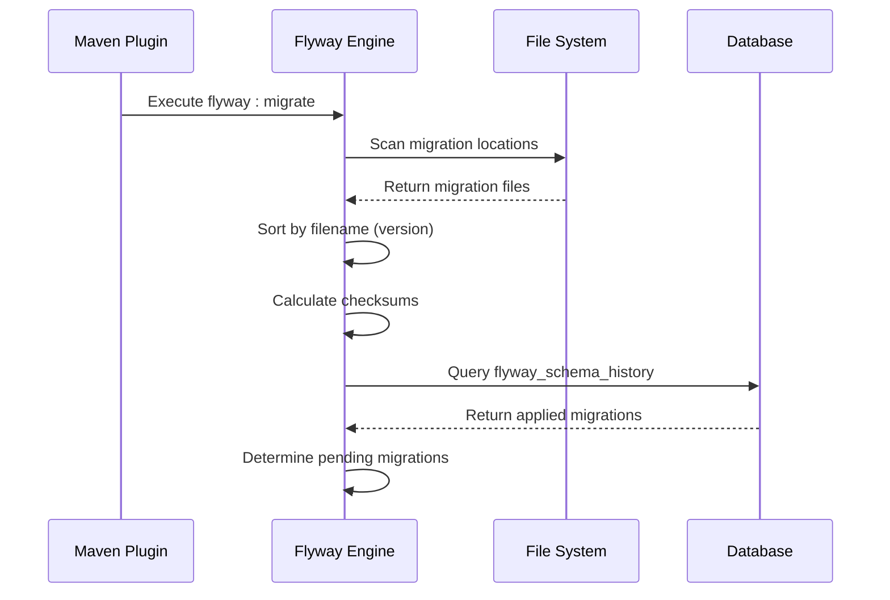
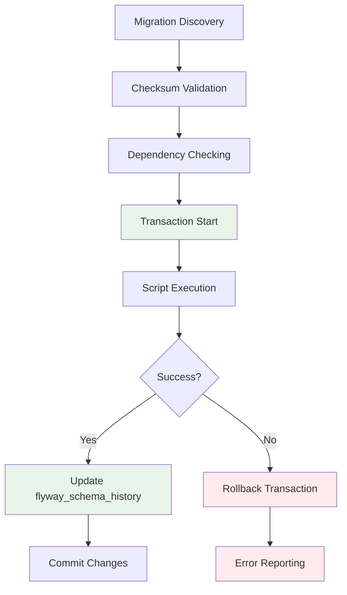
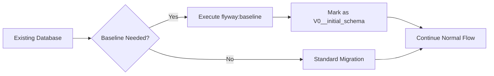
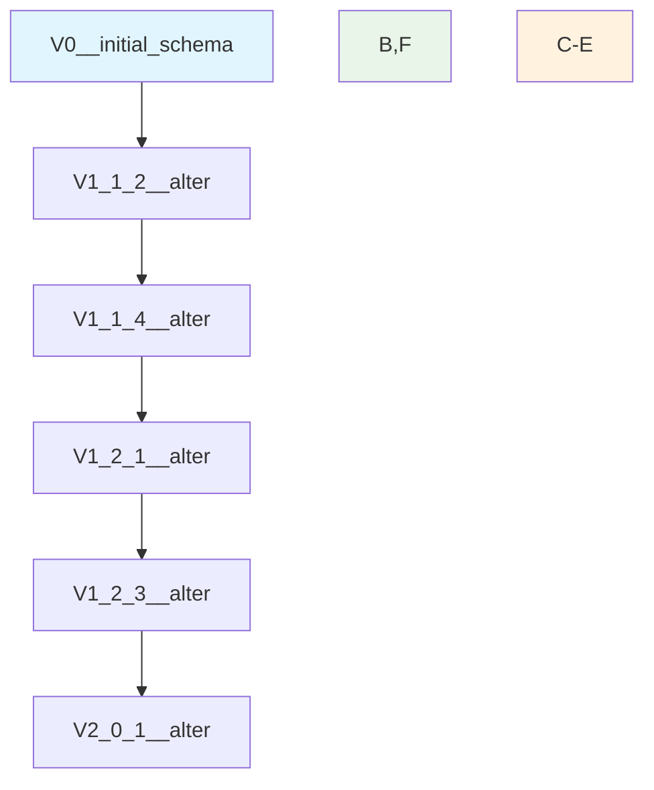
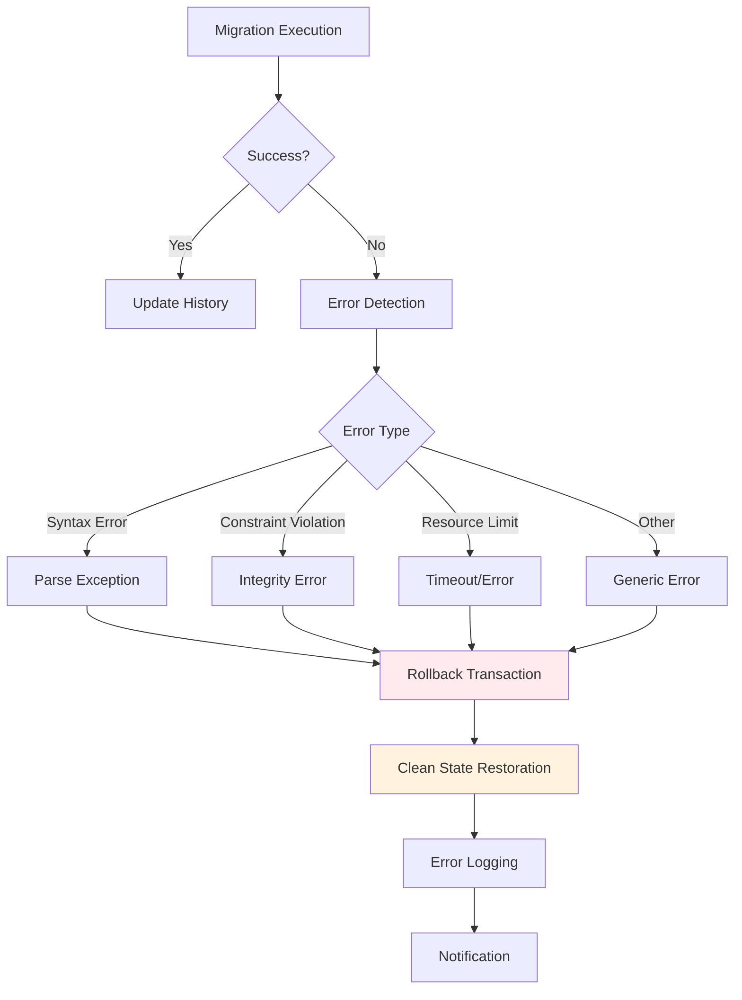
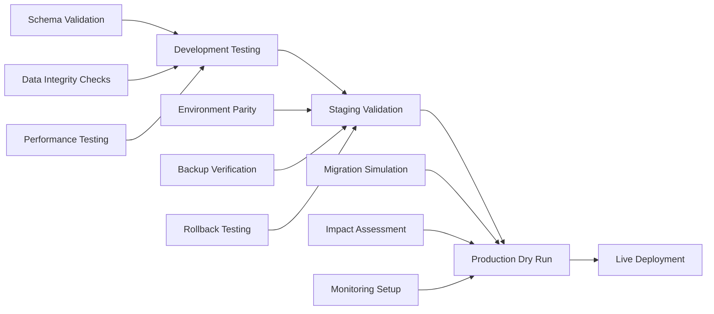
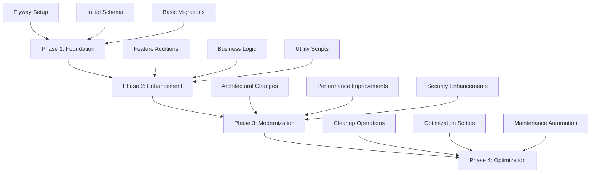

# Flyway Migration Strategy

<cite>
**Referenced Files in This Document**
- [pom.xml](file://pom.xml)
- [application.properties](file://src/main/resources/application.properties)
- [README.md](file://db/migration/README.md)
- [MAP_LEGACY_TO_FLYWAY.md](file://db/migration/MAP_LEGACY_TO_FLYWAY.md)
- [V0__initial_schema.sql](file://db/migration/V0__initial_schema.sql)
- [V1_1_2__alter.sql](file://db/migration/V1_1_2__alter.sql)
- [V1_5_20__alter.sql](file://db/migration/V1_5_20__alter.sql)
- [V2_0_1__alter.sql](file://db/migration/V2_0_1__alter.sql)
- [V2_4_5__alter.sql](file://db/migration/V2_4_5__alter.sql)
- [R__active_indexes.sql](file://db/migration/R__active_indexes.sql)
- [MIGRATION_PLAN.md](file://MIGRATION_PLAN.md)
- [MIGRATION_STEPS.md](file://MIGRATION_STEPS.md)
</cite>

## Table of Contents
1. [Introduction](#introduction)
2. [Migration Versioning Strategy](#migration-versioning-strategy)
3. [Flyway Configuration](#flyway-configuration)
4. [Migration Execution Process](#migration-execution-process)
5. [Schema Management](#schema-management)
6. [Migration Types and Patterns](#migration-types-and-patterns)
7. [Best Practices](#best-practices)
8. [Error Handling and Rollback Strategies](#error-handling-and-rollback-strategies)
9. [Testing and Validation](#testing-and-validation)
10. [Migration Planning](#migration-planning)

## Introduction

The dcl_v3 project implements a comprehensive database migration strategy using Flyway, a popular database migration tool that ensures reliable and repeatable database schema changes. This implementation transforms legacy SQL scripts into structured, version-controlled migrations while maintaining backward compatibility and providing robust error handling mechanisms.

The Flyway migration strategy in dcl_v3 serves as a foundation for database modernization, enabling controlled evolution of the Firebird database schema while preserving existing functionality and data integrity.

## Migration Versioning Strategy

### Version Prefixes and Naming Conventions

The dcl_v3 Flyway migration system employs a hierarchical versioning strategy using V1_*, V2_* prefixes to organize migrations chronologically and functionally:



**Diagram sources**
- [V0__initial_schema.sql](file://db/migration/V0__initial_schema.sql#L1-L50)
- [V1_1_2__alter.sql](file://db/migration/V1_1_2__alter.sql#L1-L50)
- [V2_0_1__alter.sql](file://db/migration/V2_0_1__alter.sql#L1-L50)
- [R__active_indexes.sql](file://db/migration/R__active_indexes.sql#L1-L50)

### Version Categories

#### Initial Schema (V0__)
The initial schema migration establishes the baseline database structure:

- **Purpose**: Creates the foundational database schema from legacy create_db.sql
- **Characteristics**: Contains complete database structure including tables, views, procedures, domains, generators, and external functions
- **Execution**: Applied once as the base layer before any other migrations

#### Feature Enhancements (V1_*)
Sequential feature additions organized by major releases:

- **Pattern**: V1_X_Y__description.sql where X.Y represents the legacy version
- **Examples**: V1_1_2__alter.sql, V1_2_16__alter.sql, V1_5_20__alter.sql
- **Content**: Schema modifications, new tables, enhanced procedures, and business logic updates

#### Major Releases (V2_*)
Significant architectural changes and new features:

- **Pattern**: V2_X_Y__description.sql for major version increments
- **Examples**: V2_0_1__alter.sql, V2_1_1__alter.sql, V2_4_5__alter.sql
- **Content**: New table structures, complex business logic, and system enhancements

#### Repeatable Migrations (R__)
Utility and maintenance scripts that can be reapplied:

- **Pattern**: R__name.sql for repeatable scripts
- **Examples**: R__active_indexes.sql, R__default_users.sql, R__correct.sql
- **Characteristics**: Idempotent operations for ongoing maintenance and optimization

**Section sources**
- [README.md](file://db/migration/README.md#L10-L25)
- [MAP_LEGACY_TO_FLYWAY.md](file://db/migration/MAP_LEGACY_TO_FLYWAY.md#L1-L50)

### Migration Dependencies and Ordering

The migration system maintains strict ordering through filename conventions:



**Diagram sources**
- [V1_1_2__alter.sql](file://db/migration/V1_1_2__alter.sql#L1-L20)
- [V1_1_4__alter.sql](file://db/migration/V1_1_4__alter.sql#L1-L20)

## Flyway Configuration

### Maven Plugin Configuration

The Flyway Maven plugin is configured in the `db-migrate` profile with secure credential handling:

```mermaid
graph TB
A[pom.xml] --> B[db-migrate Profile]
B --> C[Flyway Plugin 9.22.3]
C --> D[Configuration Properties]
D --> E[Locations: filesystem:${project.basedir}/db/migration]
D --> F[validateOnMigrate: true]
D --> G[baselineOnMigrate: true]
D --> H[Credential Security]
H --> I[System Properties Required]
H --> J[No Hardcoded Credentials]
style C fill:#e3f2fd
style H fill:#fff3e0
```

**Diagram sources**
- [pom.xml](file://pom.xml#L140-L170)

### Credential Security Model

The configuration intentionally avoids hardcoding database credentials:

| Configuration Aspect | Implementation | Security Benefit |
|---------------------|----------------|------------------|
| **URL Configuration** | `${jdbc.url}` placeholder | Environment-specific URLs |
| **User Authentication** | `${jdbc.user}` placeholder | Separate user credentials |
| **Password Protection** | `${jdbc.password}` placeholder | Encrypted password storage |
| **Runtime Injection** | `-Dflyway.*` system properties | Secure deployment-time configuration |

### Application Properties Integration

The application configuration provides Flyway location settings:

| Property | Value | Purpose |
|----------|-------|---------|
| `flyway.locations` | `filesystem:${project.basedir}/db/migration` | Migration script discovery |
| **Validation Mode** | `true` (via Maven plugin) | Pre-migration verification |
| **Baseline Behavior** | `true` (via Maven plugin) | Existing schema handling |

**Section sources**
- [pom.xml](file://pom.xml#L140-L170)
- [application.properties](file://src/main/resources/application.properties#L55-L57)

## Migration Execution Process

### Discovery and Loading Phase



**Diagram sources**
- [pom.xml](file://pom.xml#L140-L170)

### Checksum Validation Process

Each migration undergoes rigorous validation:

1. **File Integrity**: SHA-256 checksum calculation
2. **Content Verification**: Pre-migration checksum comparison
3. **Dependency Resolution**: Cross-reference with existing migrations
4. **Conflict Detection**: Identify potential version conflicts

### Execution Pipeline



**Diagram sources**
- [README.md](file://db/migration/README.md#L30-L50)

**Section sources**
- [README.md](file://db/migration/README.md#L30-L50)

## Schema Management

### flyway_schema_history Table

Flyway maintains migration state in the `flyway_schema_history` table:

| Column | Type | Purpose |
|--------|------|---------|
| `installed_rank` | INT | Sequential execution order |
| `version` | VARCHAR | Migration version identifier |
| `description` | VARCHAR | Human-readable description |
| `type` | VARCHAR | Migration type (SQL, JAVA, etc.) |
| `script` | VARCHAR | Filename of migration script |
| `checksum` | INT | Content integrity verification |
| `installed_on` | TIMESTAMP | Execution timestamp |
| `execution_time` | INT | Duration in milliseconds |
| `success` | BOOLEAN | Execution status indicator |

### Baseline Strategy

For existing databases, Flyway supports baseline migrations:



**Diagram sources**
- [README.md](file://db/migration/README.md#L40-L45)

### Schema Evolution Tracking

The migration system tracks schema evolution through:

- **Version Progression**: Linear version increment tracking
- **Change Auditing**: Detailed execution logging
- **Dependency Graph**: Relationship mapping between migrations
- **Rollback Capability**: Historical state restoration

**Section sources**
- [README.md](file://db/migration/README.md#L40-L45)

## Migration Types and Patterns

### Versioned Migrations (V__)

Versioned migrations represent irreversible schema changes:

#### Schema Alterations
```sql
-- Example: Adding new column with constraints
ALTER TABLE DCL_CONTRACTOR
    ADD CTR_FULL_NAME VARCHAR(300);

CREATE UNIQUE INDEX DCL_CONTRACTOR_UNP_IDX
ON DCL_CONTRACTOR (CTR_UNP);
```

#### Business Logic Updates
```sql
-- Example: Procedure modification with enhanced functionality
CREATE OR ALTER PROCEDURE DCL_CALCULATION_STATE (
    CTR_ID INTEGER,
    CUR_ID INTEGER,
    NOT_INCLUDE_ZERO SMALLINT,
    INCLUDE_ALL_SPECS SMALLINT
)
RETURNS (
    -- Enhanced return parameters
    CON_ID INTEGER,
    CON_NUMBER VARCHAR(200),
    -- Additional business metrics
    COUNT_DAY INTEGER,
    SHP_DATE_EXPIRATION DATE
)
AS
BEGIN
    -- Extended business logic implementation
END
```

#### Data Integrity Improvements
```sql
-- Example: Data cleanup and normalization
DELETE FROM dcl_contractor WHERE ctr_id IN (
    SELECT c1.ctr_id FROM dcl_contractor c1, dcl_contractor c2 
    WHERE c1.ctr_unp = c2.ctr_unp AND c1.ctr_id != c2.ctr_id
);
```

### Repeatable Migrations (R__)

Repeatable migrations handle ongoing maintenance and utility functions:

#### Index Management
```sql
-- Example: Active/inactive index control
SELECT 'alter index ' || RDB$INDEX_NAME || ' inactive;'
FROM RDB$INDICES 
WHERE RDB$INDEX_NAME NOT LIKE 'RDB$%' AND RDB$INDEX_NAME NOT LIKE 'PK_%';

-- Specific index activation
ALTER INDEX FK_DCL_ACC_CTR_ID ACTIVE;
ALTER INDEX DCL_ACCOUNT_IDX ACTIVE;
```

#### Utility Scripts
Repeatable scripts address recurring operational needs:

- **Data Correction**: R__correct.sql, R__correct_closed_spc.sql
- **Index Optimization**: R__active_indexes.sql, R__inactive_indexes.sql  
- **System Maintenance**: R__default_users.sql, R__restore_pass.sql
- **Performance Tuning**: Various optimization scripts

### Migration Patterns

#### Safe Modification Pattern
```sql
-- Pattern: Check existence before modification
IF (EXISTS(SELECT 1 FROM RDB$RELATION_FIELDS 
          WHERE RDB$FIELD_NAME = 'PRD_ID' AND 
                RDB$RELATION_NAME = 'DCL_ORD_LIST_PRODUCE'))
THEN
BEGIN
    UPDATE RDB$RELATION_FIELDS SET RDB$NULL_FLAG = 1
    WHERE RDB$FIELD_NAME = 'PRD_ID' AND 
          RDB$RELATION_NAME = 'DCL_ORD_LIST_PRODUCE';
END
```

#### Idempotent Operation Pattern
```sql
-- Pattern: Drop/create with safety checks
DROP VIEW IF EXISTS DCL_CUSTOM_CODE_V;
CREATE VIEW DCL_CUSTOM_CODE_V(
    CUS_CODE, CUS_INSTANT
) AS
SELECT cus_code, MAX(cus_instant) cus_instant
FROM dcl_custom_code
WHERE cus_instant < ADDDAY(CAST('NOW' AS DATE), 1)
GROUP BY cus_code;
```

**Section sources**
- [V1_1_2__alter.sql](file://db/migration/V1_1_2__alter.sql#L1-L100)
- [V2_0_1__alter.sql](file://db/migration/V2_0_1__alter.sql#L1-L100)
- [R__active_indexes.sql](file://db/migration/R__active_indexes.sql#L1-L50)

## Best Practices

### Idempotent Migration Design

#### Safe Table Creation
```sql
-- ✅ Correct: Idempotent table creation
CREATE TABLE IF NOT EXISTS DCL_NEW_TABLE (
    ID INTEGER NOT NULL PRIMARY KEY,
    NAME VARCHAR(100) NOT NULL
);

-- ❌ Incorrect: Non-idempotent approach
CREATE TABLE DCL_NEW_TABLE (
    ID INTEGER NOT NULL PRIMARY KEY,
    NAME VARCHAR(100) NOT NULL
);
```

#### Conditional Alterations
```sql
-- ✅ Correct: Check column existence
IF (NOT EXISTS(SELECT 1 FROM RDB$RELATION_FIELDS 
              WHERE RDB$FIELD_NAME = 'NEW_COLUMN' AND 
                    RDB$RELATION_NAME = 'TARGET_TABLE'))
THEN
BEGIN
    ALTER TABLE TARGET_TABLE ADD NEW_COLUMN VARCHAR(50);
END
```

### Dependency Management

#### Migration Dependencies


**Diagram sources**
- [V1_1_2__alter.sql](file://db/migration/V1_1_2__alter.sql#L1-L30)
- [V2_0_1__alter.sql](file://db/migration/V2_0_1__alter.sql#L1-L30)

#### Cross-Migration Safety
- **Order Validation**: Ensure logical dependency ordering
- **Conflict Prevention**: Avoid circular dependencies
- **Incremental Approach**: Small, focused migration steps
- **Testing Strategy**: Validate dependencies before production deployment

### Transaction Management

#### Batch Operations
```sql
-- Group related operations in single transaction
SET TERM ^ ;

BEGIN TRANSACTION;

-- Schema modifications
ALTER TABLE DCL_TABLE ADD COLUMN NEW_FIELD VARCHAR(50);
CREATE INDEX IDX_NEW_FIELD ON DCL_TABLE (NEW_FIELD);

-- Data transformations
UPDATE DCL_TABLE SET NEW_FIELD = 'DEFAULT_VALUE' WHERE NEW_FIELD IS NULL;

-- Procedure updates
CREATE OR ALTER PROCEDURE DCL_PROCEDURE (...) RETURNS (...) AS
BEGIN
    -- Updated logic
END^

COMMIT TRANSACTION^
SET TERM ; ^
```

#### Error Recovery
```sql
-- Implement rollback protection
BEGIN TRANSACTION;

BEGIN
    -- Critical operations
    EXECUTE BLOCK AS
    BEGIN
        -- Atomic operations with error handling
    END
    ON EXCEPTION DO
    BEGIN
        -- Cleanup operations
        EXCEPTION;
    END
END
```

**Section sources**
- [V1_1_2__alter.sql](file://db/migration/V1_1_2__alter.sql#L1-L50)
- [V2_4_5__alter.sql](file://db/migration/V2_4_5__alter.sql#L1-L100)

## Error Handling and Rollback Strategies

### Migration Failure Scenarios



**Diagram sources**
- [README.md](file://db/migration/README.md#L30-L50)

### Rollback Mechanisms

#### Automatic Rollback
Flyway automatically rolls back failed migrations:

1. **Transaction Isolation**: Each migration executes in isolated transaction
2. **State Preservation**: Database remains in consistent state
3. **Error Reporting**: Detailed failure information captured
4. **Recovery Options**: Manual intervention capabilities

#### Manual Recovery Procedures

##### Step 1: Identify Failed Migration
```bash
# Inspect current migration state
mvn -P db-migrate \
    -Dflyway.url=${jdbc.url} \
    -Dflyway.user=${jdbc.user} \
    -Dflyway.password=${jdbc.password} \
    flyway:info
```

##### Step 2: Analyze Error Details
```bash
# Validate migration integrity
mvn -P db-migrate \
    -Dflyway.url=${jdbc.url} \
    -Dflyway.user=${jdbc.user} \
    -Dflyway.password=${jdbc.password} \
    flyway:validate
```

##### Step 3: Apply Corrections
```bash
# Fix identified issues and retry
mvn -P db-migrate \
    -Dflyway.url=${jdbc.url} \
    -Dflyway.user=${jdbc.user} \
    -Dflyway.password=${jdbc.password} \
    flyway:migrate
```

### Error Prevention Strategies

#### Pre-Migration Validation
```sql
-- Validate dependencies before execution
DO $$
BEGIN
    -- Check required objects exist
    IF NOT EXISTS(SELECT 1 FROM RDB$RELATIONS WHERE RDB$RELATION_NAME = 'REQUIRED_TABLE') THEN
        RAISE EXCEPTION 'Required table does not exist';
    END IF;
    
    -- Validate data integrity
    IF EXISTS(SELECT 1 FROM TARGET_TABLE WHERE INVALID_COLUMN IS NULL) THEN
        RAISE EXCEPTION 'Data integrity violation detected';
    END IF;
END $$;
```

#### Graceful Degradation
```sql
-- Implement fallback mechanisms
BEGIN
    -- Attempt primary operation
    ALTER TABLE DCL_TABLE ADD COLUMN NEW_FIELD VARCHAR(50);
    
EXCEPTION
    WHEN OTHERS THEN
    BEGIN
        -- Fallback to alternative approach
        EXECUTE IMMEDIATE 'ALTER TABLE DCL_TABLE ADD COLUMN NEW_FIELD VARCHAR(25)';
    END;
END;
```

**Section sources**
- [README.md](file://db/migration/README.md#L30-L50)

## Testing and Validation

### Migration Testing Strategy

#### Development Environment Testing
```bash
# Comprehensive validation pipeline
mvn -P db-migrate \
    -Dflyway.url=jdbc:firebirdsql://localhost:3050/testdb.fdb?charSet=UTF-8 \
    -Dflyway.user=sysdba \
    -Dflyway.password=masterkey \
    flyway:validate

# Baseline existing schema
mvn -P db-migrate \
    -Dflyway.url=jdbc:firebirdsql://localhost:3050/testdb.fdb?charSet=UTF-8 \
    -Dflyway.user=sysdba \
    -Dflyway.password=masterkey \
    -Dflyway.baselineVersion=0 \
    flyway:baseline

# Apply migrations safely
mvn -P db-migrate \
    -Dflyway.url=jdbc:firebirdsql://localhost:3050/testdb.fdb?charSet=UTF-8 \
    -Dflyway.user=sysdba \
    -Dflyway.password=masterkey \
    flyway:migrate
```

#### Production Readiness Validation


**Diagram sources**
- [README.md](file://db/migration/README.md#L30-L50)

### Quality Assurance Metrics

| Metric Category | Validation Points | Acceptance Criteria |
|----------------|-------------------|-------------------|
| **Schema Integrity** | Foreign key constraints, data types, indexes | 0 constraint violations |
| **Data Consistency** | Referential integrity, data validation | 0 data corruption incidents |
| **Performance Impact** | Migration duration, resource utilization | < 5 minutes, < 1GB memory |
| **Rollback Capability** | Successful rollback testing | 100% rollback success rate |

### Continuous Integration Integration

#### Automated Migration Testing
```yaml
# GitHub Actions workflow example
name: Database Migration Tests
on: [push, pull_request]

jobs:
  migration-tests:
    runs-on: ubuntu-latest
    steps:
      - name: Setup Firebird Database
        run: docker run -d -p 3050:3050 firebird:latest
      
      - name: Run Migration Validation
        run: |
          mvn -P db-migrate \
              -Dflyway.url=jdbc:firebirdsql://localhost:3050/testdb.fdb?charSet=UTF-8 \
              -Dflyway.user=sysdba \
              -Dflyway.password=masterkey \
              flyway:validate
```

**Section sources**
- [README.md](file://db/migration/README.md#L30-L50)
- [MIGRATION_STEPS.md](file://MIGRATION_STEPS.md#L50-L100)

## Migration Planning

### Phased Implementation Strategy



**Diagram sources**
- [MIGRATION_PLAN.md](file://MIGRATION_PLAN.md#L30-L80)

### Risk Mitigation Strategies

#### Backup and Recovery Planning
- **Pre-Migration Backup**: Complete database backup before migration
- **Point-in-Time Recovery**: Transaction log preservation capability
- **Incremental Rollback**: Ability to revert individual migrations
- **Testing Environment**: Staging environment mirroring production

#### Deployment Strategy
```bash
# Safe deployment approach
# 1. Validate in development environment
mvn -P db-migrate -Dflyway.url=${dev_url} flyway:validate

# 2. Test in staging environment
mvn -P db-migrate -Dflyway.url=${staging_url} flyway:migrate

# 3. Deploy to production with monitoring
mvn -P db-migrate -Dflyway.url=${prod_url} flyway:migrate
```

### Future Extension Planning

#### Scalability Considerations
- **Migration Size Limits**: Plan for large-scale migrations
- **Performance Monitoring**: Track migration execution times
- **Resource Management**: Monitor database resource utilization
- **Parallel Execution**: Consider concurrent migration strategies

#### Technology Evolution
- **Flyway Version Upgrades**: Plan for future Flyway releases
- **Database Platform Changes**: Consider Firebird version upgrades
- **Alternative Tools**: Evaluate Liquibase integration possibilities
- **Cloud Migration**: Prepare for cloud database deployments

**Section sources**
- [MIGRATION_PLAN.md](file://MIGRATION_PLAN.md#L30-L80)
- [MIGRATION_STEPS.md](file://MIGRATION_STEPS.md#L1-L50)

## Conclusion

The Flyway migration strategy in dcl_v3 provides a robust, scalable foundation for database evolution while maintaining data integrity and operational reliability. Through careful versioning, comprehensive validation, and strategic planning, this implementation enables controlled database modernization while preserving existing functionality.

The hierarchical versioning approach (V0__, V1_*, V2_*) combined with repeatable migrations (R__) creates a flexible framework that accommodates both incremental improvements and major architectural changes. The emphasis on idempotency, dependency management, and error handling ensures reliable deployment across diverse environments.

Future enhancements should focus on automated testing integration, performance optimization for large migrations, and expanded monitoring capabilities to support continuous database evolution in production environments.