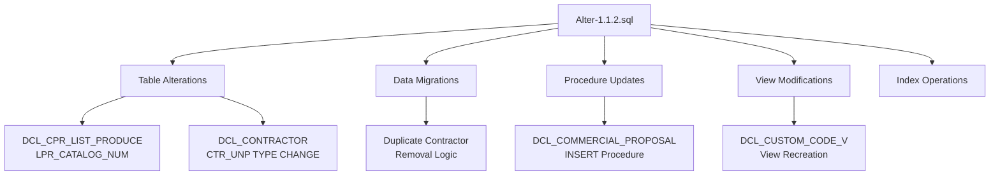
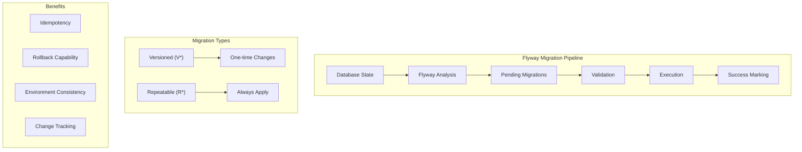
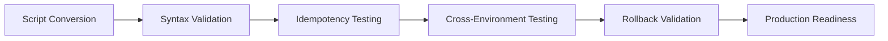
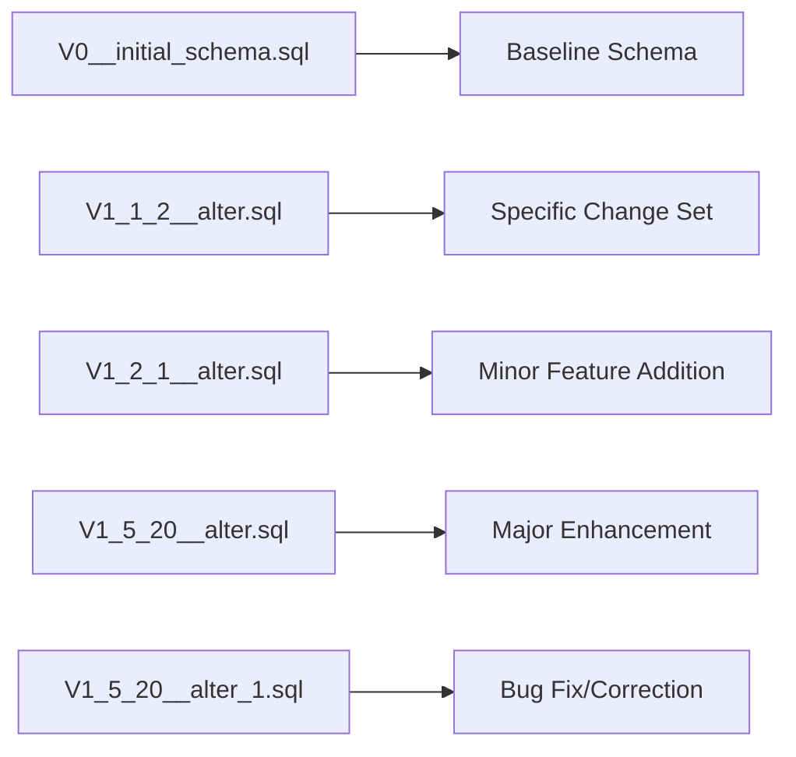
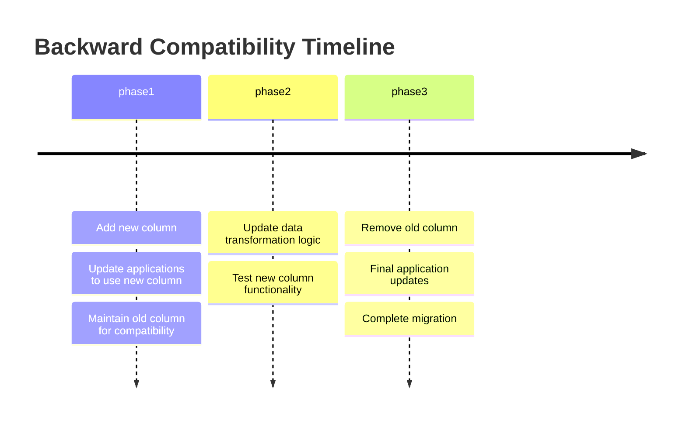
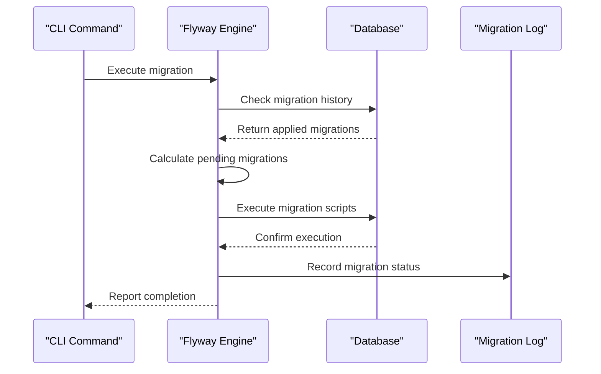
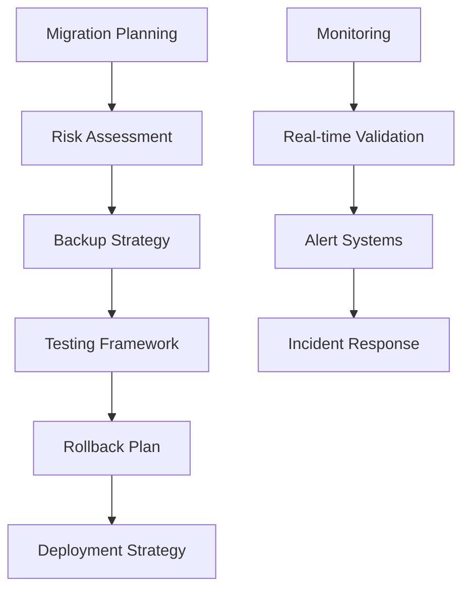

# Migration Transition Plan: From Legacy SQL Scripts to Flyway

<cite>
**Referenced Files in This Document**
- [MIGRATION_PLAN.md](file://MIGRATION_PLAN.md)
- [MAP_LEGACY_TO_FLYWAY.md](file://db/migration/MAP_LEGACY_TO_FLYWAY.md)
- [README.md](file://db/migration/README.md)
- [Alter-1.1.2.sql](file://db/Alter-1.1.2.sql)
- [V1_1_2__alter.sql](file://db/migration/V1_1_2__alter.sql)
- [V0__initial_schema.sql](file://db/migration/V0__initial_schema.sql)
- [V1_2_1__alter.sql](file://db/migration/V1_2_1__alter.sql)
- [V1_5_20__alter.sql](file://db/migration/V1_5_20__alter.sql)
- [V1_5_20__alter_1.sql](file://db/migration/V1_5_20__alter_1.sql)
- [V2_0_1__alter.sql](file://db/migration/V2_0_1__alter.sql)
- [pom.xml](file://pom.xml)
</cite>

## Table of Contents
1. [Introduction](#introduction)
2. [Migration Rationale](#migration-rationale)
3. [Legacy SQL Script Structure](#legacy-sql-script-structure)
4. [Flyway Migration Architecture](#flyway-migration-architecture)
5. [Mapping Strategy](#mapping-strategy)
6. [Step-by-Step Conversion Guide](#step-by-step-conversion-guide)
7. [Version Numbering Convention](#version-numbering-convention)
8. [Script Splitting Guidelines](#script-splitting-guidelines)
9. [Data Migration Handling](#data-migration-handling)
10. [Backward Compatibility Maintenance](#backward-compatibility-maintenance)
11. [Migration Execution Process](#migration-execution-process)
12. [Lessons Learned](#lessons-learned)
13. [Common Pitfalls and Solutions](#common-pitfalls-and-solutions)
14. [Troubleshooting Guide](#troubleshooting-guide)
15. [Conclusion](#conclusion)

## Introduction

The dcl_v3 project underwent a comprehensive database migration from legacy monolithic SQL scripts to Flyway-based versioned migrations. This transition represents a fundamental shift from ad-hoc database schema management to a structured, automated approach that ensures consistency, reliability, and maintainability across development environments.

The migration addressed several critical challenges:
- **Legacy Script Complexity**: Monolithic Alter-*.sql files containing hundreds of changes
- **Version Control Issues**: Lack of clear versioning and dependency tracking
- **Environment Consistency**: Inconsistent database states across development, testing, and production
- **Maintenance Burden**: Difficulties in tracking and reverting changes

## Migration Rationale

The decision to migrate from legacy SQL scripts to Flyway was driven by multiple factors outlined in the modernization plan:

### Technical Debt Resolution
Legacy scripts accumulated over years of development became increasingly difficult to manage. Each Alter-*.sql file contained multiple unrelated changes, making it challenging to track dependencies and understand the impact of modifications.

### Operational Efficiency
Manual execution of SQL scripts across environments introduced risks of human error and inconsistent deployments. Flyway provides automated, idempotent migrations with built-in rollback capabilities.

### Development Workflow Enhancement
The new Flyway-based approach enables:
- **Parallel Development**: Teams can work on different migration branches
- **Environment Parity**: Consistent database states across all environments
- **Change Tracking**: Clear audit trail of all database modifications

**Section sources**
- [MIGRATION_PLAN.md](file://MIGRATION_PLAN.md#L1-L102)

## Legacy SQL Script Structure

Legacy SQL scripts followed a monolithic approach where major version updates contained numerous unrelated changes:

### File Naming Convention
Legacy scripts used the pattern `Alter-X.Y.Z.sql` where:
- **X.Y.Z** represented semantic version numbers
- Each file could contain multiple unrelated database modifications
- Changes were grouped arbitrarily rather than logically

### Content Characteristics
Legacy scripts typically included:
- **Schema Modifications**: Table alterations, column additions/deletions
- **Data Transformations**: Complex data migration logic
- **Stored Procedures**: Business logic updates
- **Views**: Complex reporting views
- **Indexes**: Performance optimizations

### Example Legacy Structure


**Diagram sources**
- [Alter-1.1.2.sql](file://db/Alter-1.1.2.sql#L1-L202)

**Section sources**
- [Alter-1.1.2.sql](file://db/Alter-1.1.2.sql#L1-L202)

## Flyway Migration Architecture

Flyway migrations follow a structured, versioned approach that provides clear separation of concerns and deterministic deployment:

### Directory Structure
```
db/migration/
├── V0__initial_schema.sql          # Baseline schema
├── V1_1_2__alter.sql               # Version 1.1.2 changes
├── V1_2_1__alter.sql               # Version 1.2.1 changes
├── V1_5_20__alter.sql              # Version 1.5.20 changes
├── V1_5_20__alter_1.sql            # Fix for 1.5.20
├── V2_0_1__alter.sql               # Version 2.0.1 changes
└── R__utility_scripts.sql          # Repeatable scripts
```

### Migration Types
Flyway supports two primary migration types:

#### Versioned Migrations (V*)
- **Format**: `V{version}__{description}.sql`
- **Characteristics**: Applied only once, marked as successful
- **Use Case**: Schema changes, data modifications
- **Example**: `V1_1_2__alter.sql`

#### Repeatable Migrations (R*)
- **Format**: `R__{description}.sql`
- **Characteristics**: Applied every time, useful for utilities
- **Use Case**: Utility scripts, maintenance procedures
- **Example**: `R__default_users.sql`

### Architecture Benefits


**Diagram sources**
- [README.md](file://db/migration/README.md#L1-L63)

**Section sources**
- [README.md](file://db/migration/README.md#L1-L63)

## Mapping Strategy

The conversion from legacy scripts to Flyway migrations followed a systematic approach documented in MAP_LEGACY_TO_FLYWAY.md:

### Transformation Rules

#### Basic Conversion Pattern
```
Legacy: Alter-X.Y.Z[_suffix].sql
Flyway: V{X}_{Y}_{Z}__{description}[_suffix].sql
```

#### Special Cases
- **create_db.sql** → **V0__initial_schema.sql** (baseline)
- **Other *.sql** → **R__{filename_without_extension}.sql** (repeatable)

### Mapping Examples

#### Single Change Migration
Legacy script containing one focused change:
```sql
-- Legacy: Alter-1.1.2.sql
ALTER TABLE DCL_CONTRACTOR
    ALTER CTR_UNP TYPE VARCHAR(15) CHARACTER SET UNICODE_FSS
```

Converted to Flyway:
```sql
-- Flyway: V1_1_2__alter.sql
ALTER TABLE DCL_CONTRACTOR
    ALTER CTR_UNP TYPE VARCHAR(15) CHARACTER SET UNICODE_FSS
```

#### Multi-Change Migration
Legacy script with multiple related changes:
```sql
-- Legacy: Alter-1.1.2.sql (complex example)
ALTER TABLE DCL_CPR_LIST_PRODUCE ADD LPR_CATALOG_NUM VARCHAR(20);
ALTER TABLE DCL_CONTRACTOR ALTER CTR_UNP TYPE VARCHAR(15);
CREATE UNIQUE INDEX DCL_CONTRACTOR_UNP_IDX ON DCL_CONTRACTOR (CTR_UNP);
ALTER TABLE DCL_CONTRACTOR ADD CTR_FULL_NAME VARCHAR(300);
```

Converted to focused Flyway migrations:
- **V1_1_2__add_catalog_field.sql** - Single field addition
- **V1_1_2__modify_unp_type.sql** - Type modification
- **V1_1_2__add_unique_index.sql** - Index creation
- **V1_1_2__add_full_name_field.sql** - Additional field

### Validation Process
The mapping process included rigorous validation:
- **Semantic Equivalence**: Ensuring logical meaning remained intact
- **Idempotency**: Verifying scripts could run multiple times safely
- **Dependencies**: Identifying inter-migration dependencies
- **Testing**: Comprehensive validation across environments

**Section sources**
- [MAP_LEGACY_TO_FLYWAY.md](file://db/migration/MAP_LEGACY_TO_FLYWAY.md#L1-L240)

## Step-by-Step Conversion Guide

### Phase 1: Assessment and Planning

#### Inventory Legacy Scripts
1. **Catalog All Scripts**: List all Alter-*.sql files in the legacy directory
2. **Analyze Content**: Review each script's purpose and scope
3. **Group Related Changes**: Identify logical groupings within scripts

#### Define Migration Strategy
1. **Version Alignment**: Map legacy versions to Flyway versioning
2. **Change Classification**: Separate schema vs. data modifications
3. **Dependency Mapping**: Identify cross-migration dependencies

### Phase 2: Conversion Process

#### Individual Script Conversion
Each legacy script follows this conversion pattern:

1. **Content Analysis**: Understand the script's purpose and scope
2. **Scope Definition**: Determine if changes can be separated
3. **Naming Convention**: Apply Flyway naming standards
4. **Content Translation**: Convert SQL syntax and structure
5. **Idempotency Verification**: Ensure script safety for multiple executions

#### Example Conversion Process
Using Alter-1.1.2.sql as the reference:

**Legacy Analysis**:
- Contains multiple unrelated changes
- Includes both schema and procedural modifications
- Requires careful separation

**Conversion Steps**:
1. **Separate Concerns**: Break into focused migrations
2. **Apply Naming**: `V1_1_2__alter.sql`
3. **Verify Idempotency**: Add appropriate checks where needed
4. **Test Validation**: Ensure compatibility with existing data

### Phase 3: Quality Assurance

#### Automated Validation


#### Manual Review Process
1. **Technical Review**: Database team verification
2. **Business Validation**: Domain experts confirm logic
3. **Performance Testing**: Impact assessment
4. **Documentation Update**: Migration notes and procedures

**Section sources**
- [Alter-1.1.2.sql](file://db/Alter-1.1.2.sql#L1-L202)
- [V1_1_2__alter.sql](file://db/migration/V1_1_2__alter.sql#L1-L202)

## Version Numbering Convention

Flyway migrations follow a strict versioning scheme that ensures proper ordering and dependency resolution:

### Version Format
```
V{major}_{minor}_{patch}__{description}.sql
```

### Version Components
- **Major.Minor.Patch**: Semantic versioning alignment
- **Description**: Human-readable summary of changes
- **Separator**: Double underscore (`__`) separates version from description

### Versioning Principles

#### Semantic Versioning Alignment
- **Major**: Breaking changes requiring coordinated deployment
- **Minor**: New features or significant improvements
- **Patch**: Bug fixes and minor enhancements

#### Ordering Rules
1. **Numerical Comparison**: Versions compare numerically
2. **Zero Padding**: Ensure consistent comparison (e.g., `1.1.2` vs `1.1.02`)
3. **Suffix Handling**: Allow multiple migrations for same version

### Version Examples


**Diagram sources**
- [V0__initial_schema.sql](file://db/migration/V0__initial_schema.sql#L1-L50)
- [V1_5_20__alter.sql](file://db/migration/V1_5_20__alter.sql#L1-L50)

**Section sources**
- [README.md](file://db/migration/README.md#L15-L25)

## Script Splitting Guidelines

Effective script splitting is crucial for maintaining migration quality and enabling parallel development:

### Splitting Criteria

#### Logical Separation
- **Schema Changes**: Table structures, constraints, indexes
- **Data Modifications**: Bulk data transformations
- **Business Logic**: Stored procedures, functions, triggers
- **Utility Scripts**: Helper procedures, cleanup routines

#### Technical Boundaries
- **Idempotency**: Each script should be safe for multiple executions
- **Independence**: Minimize cross-dependencies between migrations
- **Atomicity**: Single responsibility principle for each migration

### Splitting Patterns

#### Single Responsibility
```sql
-- Good: Focused migration
ALTER TABLE DCL_CONTRACTOR ADD CTR_FULL_NAME VARCHAR(300);

-- Avoid: Multi-purpose migration
ALTER TABLE DCL_CONTRACTOR ADD CTR_FULL_NAME VARCHAR(300);
CREATE UNIQUE INDEX DCL_CONTRACTOR_FULL_NAME_IDX ON DCL_CONTRACTOR (CTR_FULL_NAME);
UPDATE DCL_CONTRACTOR SET CTR_FULL_NAME = UPPER(CTR_NAME);
```

#### Data vs. Schema Separation
```sql
-- Schema migration
ALTER TABLE DCL_CONTRACTOR ADD CTR_FULL_NAME VARCHAR(300);

-- Data migration (separate file)
UPDATE DCL_CONTRACTOR SET CTR_FULL_NAME = UPPER(CTR_NAME);
```

### Splitting Decision Matrix

| Change Type | Recommended Approach | Rationale |
|-------------|---------------------|-----------|
| Column Addition | Single migration | Atomic operation |
| Data Transformation | Separate migration | Risk isolation |
| Procedure Modification | Single migration | Logical grouping |
| Index Creation | Single migration | Performance impact |
| Cleanup Operations | Separate migration | Safety considerations |

### Best Practices

#### Dependency Management
- **Forward Compatibility**: Ensure newer migrations work with older schemas
- **Rollback Planning**: Consider reverse dependencies
- **Testing Strategy**: Validate split migrations independently

#### Documentation Standards
- **Migration Descriptions**: Clear, descriptive names
- **Change Justification**: Reason for each migration
- **Impact Assessment**: Expected downtime and risks

**Section sources**
- [V1_2_1__alter.sql](file://db/migration/V1_2_1__alter.sql#L1-L100)

## Data Migration Handling

Data migrations present unique challenges that require careful planning and execution:

### Data Migration Categories

#### Bulk Data Transformations
- **Field Renaming**: Changing column names while preserving data
- **Data Type Conversions**: Type changes with data validation
- **Structure Reorganizations**: Moving data between tables

#### Business Logic Data Changes
- **Calculation Updates**: Modified formulas or algorithms
- **Validation Rules**: Enhanced data integrity checks
- **Reference Data**: Master data updates

### Migration Strategies

#### In-Place Modifications
```sql
-- Safe type conversion
ALTER TABLE DCL_CONTRACTOR
    ALTER CTR_UNP TYPE VARCHAR(15) CHARACTER SET UNICODE_FSS;
```

#### Temporary Table Approaches
```sql
-- Complex data transformation
CREATE TABLE TEMP_CONTRACTOR_DATA AS
SELECT ID, OLD_FIELD, NEW_FIELD
FROM ORIGINAL_TABLE;

-- Apply transformations
UPDATE TEMP_CONTRACTOR_DATA SET NEW_FIELD = TRANSFORM(OLD_FIELD);

-- Atomic switch
DROP TABLE ORIGINAL_TABLE;
RENAME TABLE TEMP_CONTRACTOR_DATA TO ORIGINAL_TABLE;
```

#### Incremental Processing
```sql
-- Large datasets
WHILE (REMAINING_ROWS > 0) DO
BEGIN
    UPDATE TOP 1000 TABLE_NAME
    SET COLUMN = NEW_VALUE
    WHERE CONDITION AND ROWID IN (
        SELECT TOP 1000 ROWID FROM TABLE_NAME
        WHERE CONDITION
    );
END
```

### Data Integrity Validation

#### Pre-Migration Checks
```sql
-- Verify data consistency
SELECT COUNT(*) FROM TABLE_NAME
WHERE INVALID_COLUMN IS NOT NULL;

-- Check referential integrity
SELECT COUNT(*) FROM CHILD_TABLE
WHERE PARENT_ID NOT IN (SELECT ID FROM PARENT_TABLE);
```

#### Post-Migration Validation
```sql
-- Confirm successful transformation
SELECT COUNT(*), AVG(COLUMN) FROM TABLE_NAME;

-- Verify business logic
SELECT COUNT(*) FROM TABLE_NAME
WHERE CALCULATED_FIELD != EXPECTED_VALUE;
```

### Rollback Strategies

#### Point-in-Time Recovery
```sql
-- Using transaction logs
ROLLBACK TO SAVEPOINT BEFORE_MIGRATION;

-- Using backup restoration
RESTORE DATABASE FROM BACKUP;
```

#### Data Reconstruction
```sql
-- Reverse transformations
ALTER TABLE DCL_CONTRACTOR
    ALTER CTR_UNP TYPE VARCHAR(10) CHARACTER SET ASCII;

-- Restore from backup
INSERT INTO ORIGINAL_TABLE
SELECT * FROM BACKUP_TABLE;
```

**Section sources**
- [V2_0_1__alter.sql](file://db/migration/V2_0_1__alter.sql#L1-L200)

## Backward Compatibility Maintenance

Maintaining backward compatibility during migration requires careful planning and phased approaches:

### Compatibility Strategies

#### Dual-Column Approach
```sql
-- Phase 1: Add new column
ALTER TABLE DCL_CONTRACTOR ADD CTR_NEW_FIELD VARCHAR(100);

-- Phase 2: Populate with transformed data
UPDATE DCL_CONTRACTOR SET CTR_NEW_FIELD = TRANSFORM(CTR_OLD_FIELD);

-- Phase 3: Drop old column (after validation)
ALTER TABLE DCL_CONTRACTOR DROP CTR_OLD_FIELD;
```

#### View-Based Abstraction
```sql
-- Create view for backward compatibility
CREATE VIEW DCL_CONTRACTOR_COMPAT AS
SELECT ID, OLD_FIELD AS NEW_FIELD, OTHER_COLUMNS
FROM DCL_CONTRACTOR;

-- Applications continue using old interface
SELECT NEW_FIELD FROM DCL_CONTRACTOR_COMPAT;
```

#### Migration Timeline Coordination


### Version-Specific Adaptations

#### Application Layer Compatibility
- **Configuration Management**: Environment-specific settings
- **Feature Flags**: Gradual feature rollout
- **API Versioning**: Maintain multiple API versions

#### Database Layer Compatibility
- **Synthetic Columns**: Virtual columns for derived data
- **Computed Columns**: Automatic calculation of derived values
- **Materialized Views**: Pre-calculated result sets

### Testing Strategies

#### Compatibility Testing Matrix
| Component | Pre-Migration | During Migration | Post-Migration |
|-----------|---------------|------------------|----------------|
| Database Schema | Old + New structures | Transitional state | New structure only |
| Application Logic | Uses old APIs | Supports both APIs | Uses new APIs only |
| Data Integrity | Full validation | Partial validation | Full validation |
| Performance | Baseline metrics | Monitor changes | Compare improvements |

#### Validation Procedures
```sql
-- Schema compatibility check
SELECT COLUMN_NAME, DATA_TYPE
FROM INFORMATION_SCHEMA.COLUMNS
WHERE TABLE_NAME = 'DCL_CONTRACTOR'
AND (COLUMN_NAME LIKE 'CTR_%' OR COLUMN_NAME LIKE 'OLD_%');

-- Data consistency validation
SELECT COUNT(*) FROM DCL_CONTRACTOR
WHERE OLD_FIELD IS NOT NULL AND NEW_FIELD IS NULL;
```

**Section sources**
- [V1_5_20__alter.sql](file://db/migration/V1_5_20__alter.sql#L1-L200)
- [V1_5_20__alter_1.sql](file://db/migration/V1_5_20__alter_1.sql#L1-L200)

## Migration Execution Process

Flyway provides a robust framework for executing migrations with safety mechanisms and monitoring capabilities:

### Execution Commands

#### Inspection and Validation
```bash
# Inspect pending migrations
mvn -P db-migrate -Dflyway.url=jdbc:firebirdsql://localhost:3050/db.fdb \
    -Dflyway.user=sysdba -Dflyway.password=masterkey \
    flyway:info

# Validate migration checksums
mvn -P db-migrate -Dflyway.url=jdbc:firebirdsql://localhost:3050/db.fdb \
    -Dflyway.user=sysdba -Dflyway.password=masterkey \
    flyway:validate
```

#### Baseline and Migration
```bash
# Baseline existing schema (if needed)
mvn -P db-migrate -Dflyway.url=jdbc:firebirdsql://localhost:3050/db.fdb \
    -Dflyway.user=sysdba -Dflyway.password=masterkey \
    -Dflyway.baselineVersion=0 flyway:baseline

# Apply migrations (production-safe)
mvn -P db-migrate -Dflyway.url=jdbc:firebirdsql://localhost:3050/db.fdb \
    -Dflyway.user=sysdba -Dflyway.password=masterkey \
    flyway:migrate
```

### Configuration Management

#### Maven Profile Setup
The Flyway plugin is configured in the Maven profile `db-migrate`:

```xml
<profile>
  <id>db-migrate</id>
  <build>
    <plugins>
      <plugin>
        <groupId>org.flywaydb</groupId>
        <artifactId>flyway-maven-plugin</artifactId>
        <version>9.22.3</version>
        <configuration>
          <locations>
            <location>filesystem:${project.basedir}/db/migration</location>
          </locations>
          <validateOnMigrate>true</validateOnMigrate>
          <baselineOnMigrate>true</baselineOnMigrate>
        </configuration>
      </plugin>
    </plugins>
  </build>
</profile>
```

#### Security Considerations
- **Credential Management**: Never hardcode credentials in POM
- **Environment Variables**: Use `-Dflyway.*` parameters
- **Access Control**: Restrict migration permissions

### Monitoring and Logging

#### Migration Status Tracking


#### Error Handling
- **Rollback Capability**: Automatic rollback on failure
- **Error Reporting**: Detailed error messages
- **Recovery Procedures**: Manual intervention guidelines

**Section sources**
- [README.md](file://db/migration/README.md#L25-L63)
- [pom.xml](file://pom.xml#L140-L170)

## Lessons Learned

The migration process revealed several important insights and best practices:

### Technical Insights

#### Complexity Management
- **Initial Underestimation**: Legacy scripts appeared simpler than they were
- **Hidden Dependencies**: Many scripts had undocumented interdependencies
- **Data Migration Challenges**: Bulk data transformations required careful planning

#### Tool Selection
- **Flyway Advantages**: Idempotency, rollback capability, environment consistency
- **Limitations**: Complex data migrations still require careful handling
- **Integration**: Seamless integration with Maven build lifecycle

### Process Improvements

#### Planning and Documentation
- **Comprehensive Inventory**: Thorough cataloging of all legacy scripts
- **Stakeholder Communication**: Clear expectations about migration timeline
- **Risk Assessment**: Detailed impact analysis for each migration

#### Quality Assurance
- **Automated Testing**: Continuous validation of migration scripts
- **Environment Parity**: Consistent testing across all environments
- **Rollback Preparedness**: Comprehensive rollback strategies

### Team Collaboration

#### Cross-Functional Coordination
- **Database Team**: Expertise in schema changes
- **Application Team**: Understanding of business logic
- **Operations Team**: Infrastructure and deployment expertise

#### Knowledge Transfer
- **Documentation Standards**: Clear, maintainable documentation
- **Training Programs**: Team education on new tools and processes
- **Best Practice Sharing**: Lessons learned across teams

### Lessons Summary
```mermaid
mindmap
root((Lessons Learned))
Technical
Complexity Management
Tool Limitations
Integration Challenges
Process
Planning Importance
Quality Assurance
Risk Management
Team
Cross-Functional Coordination
Knowledge Transfer
Documentation Standards
```

## Common Pitfalls and Solutions

Understanding common pitfalls helps prevent issues during migration execution:

### Schema Design Pitfalls

#### Overly Complex Migrations
**Problem**: Attempting to do too much in a single migration
**Solution**: Break complex changes into smaller, focused migrations

#### Ignoring Data Dependencies
**Problem**: Not considering data relationships and constraints
**Solution**: Analyze data dependencies before schema changes

### Execution Pitfalls

#### Production Deployment Risks
**Problem**: Unplanned production deployments causing downtime
**Solution**: Staged rollouts with thorough testing at each phase

#### Credential Management
**Problem**: Hardcoded credentials in migration scripts
**Solution**: Use environment variables and secure credential management

### Data Integrity Pitfalls

#### Data Loss Scenarios
**Problem**: Accidental data deletion or corruption
**Solution**: Comprehensive backup strategies and validation checks

#### Performance Impact
**Problem**: Long-running migrations causing application downtime
**Solution**: Batch processing and incremental data transformations

### Mitigation Strategies

#### Prevention Measures


#### Quick Fixes
- **Emergency Rollback**: Pre-defined rollback procedures
- **Hotfix Capabilities**: Ability to apply emergency fixes
- **Communication Protocols**: Clear escalation paths

### Checklist Items

#### Pre-Migration
- [ ] Backup all databases
- [ ] Test migration scripts in staging
- [ ] Coordinate with stakeholders
- [ ] Prepare rollback procedures

#### During Migration
- [ ] Monitor migration progress
- [ ] Validate data integrity
- [ ] Check application functionality
- [ ] Document any issues

#### Post-Migration
- [ ] Verify all migrations applied
- [ ] Test complete application functionality
- [ ] Update documentation
- [ ] Communicate completion to stakeholders

## Troubleshooting Guide

Common issues and their solutions during migration execution:

### Migration Failures

#### Syntax Errors
**Symptoms**: Migration fails with SQL syntax errors
**Diagnosis**: Check SQL syntax and database compatibility
**Resolution**: Validate SQL against target database version

#### Constraint Violations
**Symptoms**: Data migration fails due to constraint violations
**Diagnosis**: Analyze data conflicts and constraint definitions
**Resolution**: Clean data before migration or adjust constraints

#### Lock Contention
**Symptoms**: Migrations hang or timeout
**Diagnosis**: Check for long-running transactions
**Resolution**: Optimize queries and reduce transaction scope

### Performance Issues

#### Long Running Migrations
**Symptoms**: Migrations take excessive time
**Diagnosis**: Analyze query execution plans
**Resolution**: Optimize queries and use batch processing

#### Resource Exhaustion
**Symptoms**: Database server runs out of memory or disk space
**Diagnosis**: Monitor resource usage during migration
**Resolution**: Increase resources or optimize migration scope

### Environment Issues

#### Version Conflicts
**Symptoms**: Different environments have inconsistent states
**Diagnosis**: Compare migration histories across environments
**Resolution**: Align environments using Flyway commands

#### Permission Problems
**Symptoms**: Migration fails due to insufficient permissions
**Diagnosis**: Verify database user permissions
**Resolution**: Grant necessary privileges to migration user

### Diagnostic Tools

#### Flyway Commands for Diagnosis
```bash
# Check migration history
mvn flyway:history

# Validate current state
mvn flyway:validate

# Dry run (show what would be executed)
mvn flyway:migrate -Dflyway.validateOnMigrate=false
```

#### Database Monitoring
```sql
-- Check migration table
SELECT * FROM flyway_schema_history ORDER BY installed_rank;

-- Monitor long-running queries
SELECT * FROM MON$STATEMENTS WHERE MON$STATE = 'ACTIVE';
```

### Recovery Procedures

#### Failed Migration Recovery
1. **Stop Application**: Prevent further database changes
2. **Identify Issue**: Analyze error logs and database state
3. **Apply Rollback**: Use Flyway rollback or manual recovery
4. **Fix Root Cause**: Address underlying issue
5. **Retry Migration**: Execute migration again

#### Data Recovery
1. **Restore Backup**: Recover from pre-migration backup
2. **Validate Data**: Verify data integrity
3. **Resume Operations**: Restart application services
4. **Monitor**: Watch for any residual issues

## Conclusion

The migration from legacy SQL scripts to Flyway represents a significant advancement in database management practices for the dcl_v3 project. This transition addresses critical operational challenges while establishing a foundation for sustainable database evolution.

### Key Achievements

#### Operational Excellence
- **Consistency**: Uniform database states across all environments
- **Reliability**: Automated, idempotent migration processes
- **Traceability**: Complete audit trail of all database changes
- **Safety**: Built-in rollback capabilities and validation

#### Development Productivity
- **Parallel Development**: Teams can work independently on migrations
- **Quality Assurance**: Automated validation and testing
- **Documentation**: Clear, maintainable migration documentation
- **Learning Curve**: Reduced complexity compared to legacy scripts

#### Future Readiness
- **Scalability**: Foundation for handling future growth
- **Flexibility**: Adaptability to changing requirements
- **Integration**: Seamless integration with modern development practices
- **Maintenance**: Simplified ongoing database management

### Strategic Impact

The migration aligns with broader modernization efforts, supporting:
- **Technology Stack Evolution**: Preparation for future technology upgrades
- **Development Practices**: Adoption of DevOps and CI/CD principles
- **Operational Excellence**: Improved reliability and maintainability
- **Team Productivity**: Streamlined development and deployment processes

### Next Steps

Future enhancements should focus on:
- **Automation**: Further automation of migration testing
- **Monitoring**: Enhanced monitoring and alerting systems
- **Documentation**: Continued improvement of migration documentation
- **Training**: Ongoing team education and skill development

The successful completion of this migration demonstrates the project's commitment to operational excellence and lays the groundwork for continued innovation and improvement in database management practices.