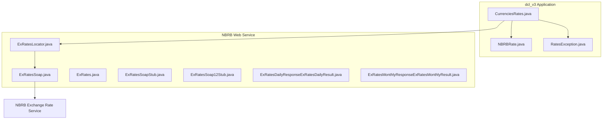
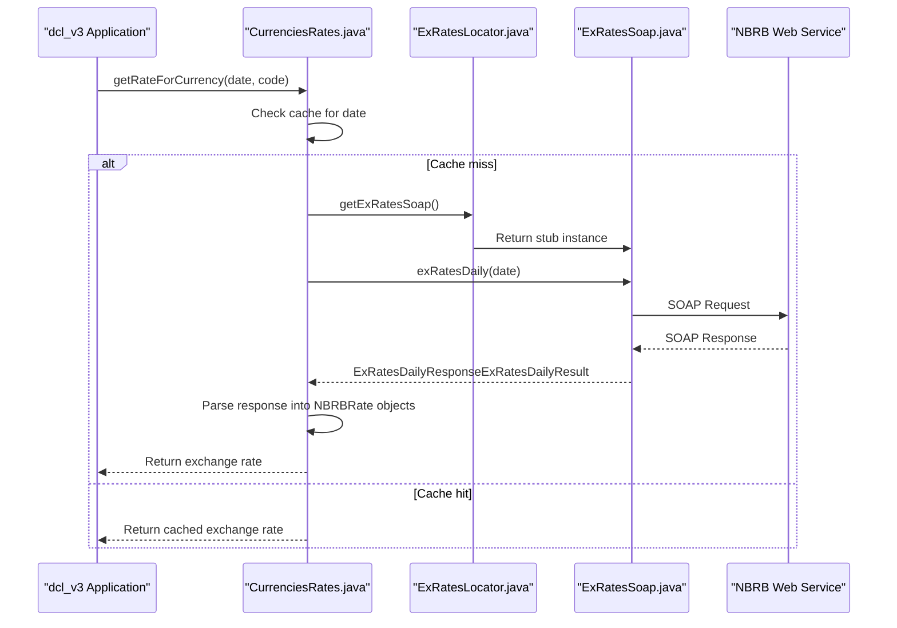
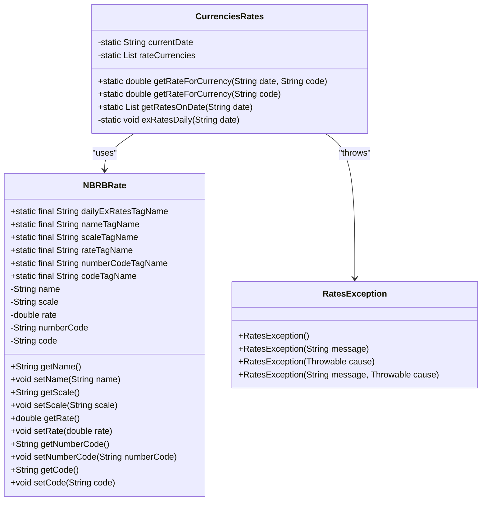
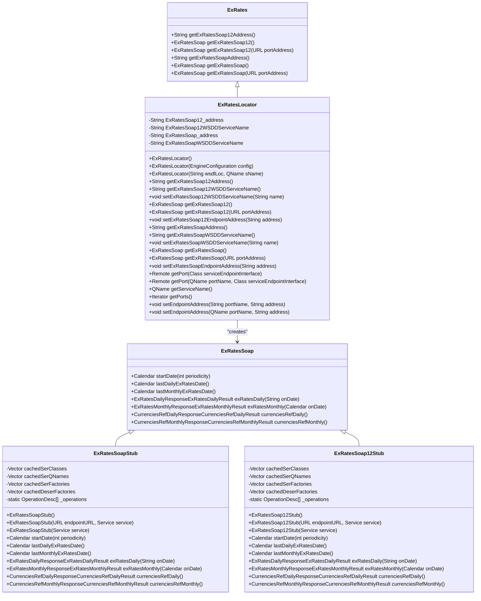
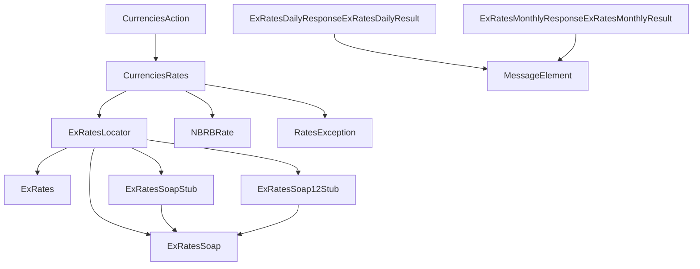

# Currency Rate SOAP Service

<cite>
**Referenced Files in This Document**   
- [CurrenciesRates.java](file://src/main/java/by/nbrb/www/CurrenciesRates.java)
- [ExRatesSoap.java](file://src/main/java/by/nbrb/www/ExRatesSoap.java)
- [ExRatesLocator.java](file://src/main/java/by/nbrb/www/ExRatesLocator.java)
- [ExRates.java](file://src/main/java/by/nbrb/www/ExRates.java)
- [ExRatesDailyResponseExRatesDailyResult.java](file://src/main/java/by/nbrb/www/ExRatesDailyResponseExRatesDailyResult.java)
- [ExRatesMonthlyResponseExRatesMonthlyResult.java](file://src/main/java/by/nbrb/www/ExRatesMonthlyResponseExRatesMonthlyResult.java)
- [ExRatesSoapStub.java](file://src/main/java/by/nbrb/www/ExRatesSoapStub.java)
- [ExRatesSoap12Stub.java](file://src/main/java/by/nbrb/www/ExRatesSoap12Stub.java)
- [NBRBRate.java](file://src/main/java/by/nbrb/www/NBRBRate.java)
- [RatesException.java](file://src/main/java/by/nbrb/www/RatesException.java)
- [CurrenciesAction.java](file://src/main/java/net/sam/dcl/action/CurrenciesAction.java)
</cite>

## Table of Contents
1. [Introduction](#introduction)
2. [Project Structure](#project-structure)
3. [Core Components](#core-components)
4. [Architecture Overview](#architecture-overview)
5. [Detailed Component Analysis](#detailed-component-analysis)
6. [Dependency Analysis](#dependency-analysis)
7. [Performance Considerations](#performance-considerations)
8. [Troubleshooting Guide](#troubleshooting-guide)
9. [Conclusion](#conclusion)

## Introduction
The Currency Rate SOAP Service integration in dcl_v3 provides a client implementation for accessing the National Bank of the Republic of Belarus (NBRB) exchange rate web service. This documentation details the Java implementation using Apache Axis for SOAP communication, focusing on the retrieval of daily and monthly currency exchange rates. The integration enables the application to fetch official exchange rates from the NBRB service and utilize them for financial calculations and reporting.

## Project Structure
The currency rate integration is implemented in the `by.nbrb.www` package within the `src/main/java` directory. The core components include service client classes generated from the NBRB WSDL, a utility class for accessing exchange rates, and data model classes for representing currency rate information. The implementation follows a client-server pattern where the application acts as a client to the NBRB SOAP web service.

**Diagram sources**
- [CurrenciesRates.java](file://src/main/java/by/nbrb/www/CurrenciesRates.java)
- [ExRatesSoap.java](file://src/main/java/by/nbrb/www/ExRatesSoap.java)
- [ExRatesLocator.java](file://src/main/java/by/nbrb/www/ExRatesLocator.java)
- [ExRates.java](file://src/main/java/by/nbrb/www/ExRates.java)
- [ExRatesDailyResponseExRatesDailyResult.java](file://src/main/java/by/nbrb/www/ExRatesDailyResponseExRatesDailyResult.java)
- [ExRatesMonthlyResponseExRatesMonthlyResult.java](file://src/main/java/by/nbrb/www/ExRatesMonthlyResponseExRatesMonthlyResult.java)

**Section sources**
- [CurrenciesRates.java](file://src/main/java/by/nbrb/www/CurrenciesRates.java)
- [ExRatesSoap.java](file://src/main/java/by/nbrb/www/ExRatesSoap.java)
- [ExRatesLocator.java](file://src/main/java/by/nbrb/www/ExRatesLocator.java)

## Core Components
The core components of the Currency Rate SOAP Service integration include the `CurrenciesRates` utility class, which serves as the primary interface for retrieving exchange rates, and the auto-generated Apache Axis classes that handle the SOAP communication with the NBRB service. The `NBRBRate` class represents the currency rate data structure, while `RatesException` provides custom exception handling for rate-related errors.

The integration uses Apache Axis 1.4 to generate client stubs from the NBRB WSDL, enabling type-safe access to the web service operations. The `ExRatesLocator` class acts as a service locator for obtaining a reference to the `ExRatesSoap` service endpoint interface, which defines the available operations for retrieving exchange rates.

**Section sources**
- [CurrenciesRates.java](file://src/main/java/by/nbrb/www/CurrenciesRates.java)
- [NBRBRate.java](file://src/main/java/by/nbrb/www/NBRBRate.java)
- [RatesException.java](file://src/main/java/by/nbrb/www/RatesException.java)

## Architecture Overview
The architecture of the Currency Rate SOAP Service integration follows a client-server model with the dcl_v3 application acting as a client to the NBRB exchange rate web service. The integration uses Apache Axis for SOAP communication, with auto-generated stubs providing a Java interface to the web service operations.

**Diagram sources**
- [CurrenciesRates.java](file://src/main/java/by/nbrb/www/CurrenciesRates.java)
- [ExRatesLocator.java](file://src/main/java/by/nbrb/www/ExRatesLocator.java)
- [ExRatesSoap.java](file://src/main/java/by/nbrb/www/ExRatesSoap.java)

## Detailed Component Analysis

### CurrenciesRates Analysis
The `CurrenciesRates` class provides a high-level interface for accessing currency exchange rates from the NBRB service. It implements caching to avoid redundant web service calls for the same date and provides methods for retrieving rates by currency code.

**Diagram sources**
- [CurrenciesRates.java](file://src/main/java/by/nbrb/www/CurrenciesRates.java)
- [NBRBRate.java](file://src/main/java/by/nbrb/www/NBRBRate.java)
- [RatesException.java](file://src/main/java/by/nbrb/www/RatesException.java)

**Section sources**
- [CurrenciesRates.java](file://src/main/java/by/nbrb/www/CurrenciesRates.java)
- [NBRBRate.java](file://src/main/java/by/nbrb/www/NBRBRate.java)
- [RatesException.java](file://src/main/java/by/nbrb/www/RatesException.java)

### ExRates Service Analysis
The ExRates service components are auto-generated by Apache Axis from the NBRB WSDL. These classes provide the SOAP client implementation for communicating with the NBRB exchange rate service.

**Diagram sources**
- [ExRates.java](file://src/main/java/by/nbrb/www/ExRates.java)
- [ExRatesLocator.java](file://src/main/java/by/nbrb/www/ExRatesLocator.java)
- [ExRatesSoap.java](file://src/main/java/by/nbrb/www/ExRatesSoap.java)
- [ExRatesSoapStub.java](file://src/main/java/by/nbrb/www/ExRatesSoapStub.java)
- [ExRatesSoap12Stub.java](file://src/main/java/by/nbrb/www/ExRatesSoap12Stub.java)

**Section sources**
- [ExRates.java](file://src/main/java/by/nbrb/www/ExRates.java)
- [ExRatesLocator.java](file://src/main/java/by/nbrb/www/ExRatesLocator.java)
- [ExRatesSoap.java](file://src/main/java/by/nbrb/www/ExRatesSoap.java)
- [ExRatesSoapStub.java](file://src/main/java/by/nbrb/www/ExRatesSoapStub.java)
- [ExRatesSoap12Stub.java](file://src/main/java/by/nbrb/www/ExRatesSoap12Stub.java)

### Response Classes Analysis
The response classes represent the data structures returned by the NBRB web service. These classes are auto-generated by Apache Axis and implement the necessary interfaces for SOAP message handling.

```mermaid
classDiagram
class ExRatesDailyResponseExRatesDailyResult {
-MessageElement[] _any
+ExRatesDailyResponseExRatesDailyResult()
+ExRatesDailyResponseExRatesDailyResult(MessageElement[] _any)
+MessageElement[] get_any()
+void set_any(MessageElement[] _any)
+boolean equals(Object obj)
+int hashCode()
+TypeDesc getTypeDesc()
+Serializer getSerializer(String mechType, Class _javaType, QName _xmlType)
+Deserializer getDeserializer(String mechType, Class _javaType, QName _xmlType)
}
class ExRatesMonthlyResponseExRatesMonthlyResult {
-MessageElement[] _any
+ExRatesMonthlyResponseExRatesMonthlyResult()
+ExRatesMonthlyResponseExRatesMonthlyResult(MessageElement[] _any)
+MessageElement[] get_any()
+void set_any(MessageElement[] _any)
+boolean equals(Object obj)
+int hashCode()
+TypeDesc getTypeDesc()
+Serializer getSerializer(String mechType, Class _javaType, QName _xmlType)
+Deserializer getDeserializer(String mechType, Class _javaType, QName _xmlType)
}
class CurrenciesRefDailyResponseCurrenciesRefDailyResult {
-MessageElement[] _any
+CurrenciesRefDailyResponseCurrenciesRefDailyResult()
+CurrenciesRefDailyResponseCurrenciesRefDailyResult(MessageElement[] _any)
+MessageElement[] get_any()
+void set_any(MessageElement[] _any)
+boolean equals(Object obj)
+int hashCode()
+TypeDesc getTypeDesc()
+Serializer getSerializer(String mechType, Class _javaType, QName _xmlType)
+Deserializer getDeserializer(String mechType, Class _javaType, QName _xmlType)
}
class CurrenciesRefMonthlyResponseCurrenciesRefMonthlyResult {
-MessageElement[] _any
+CurrenciesRefMonthlyResponseCurrenciesRefMonthlyResult()
+CurrenciesRefMonthlyResponseCurrenciesRefMonthlyResult(MessageElement[] _any)
+MessageElement[] get_any()
+void set_any(MessageElement[] _any)
+boolean equals(Object obj)
+int hashCode()
+TypeDesc getTypeDesc()
+Serializer getSerializer(String mechType, Class _javaType, QName _xmlType)
+Deserializer getDeserializer(String mechType, Class _javaType, QName _xmlType)
}
ExRatesDailyResponseExRatesDailyResult --> MessageElement : "contains"
ExRatesMonthlyResponseExRatesMonthlyResult --> MessageElement : "contains"
CurrenciesRefDailyResponseCurrenciesRefDailyResult --> MessageElement : "contains"
CurrenciesRefMonthlyResponseCurrenciesRefMonthlyResult --> MessageElement : "contains"
```

**Diagram sources**
- [ExRatesDailyResponseExRatesDailyResult.java](file://src/main/java/by/nbrb/www/ExRatesDailyResponseExRatesDailyResult.java)
- [ExRatesMonthlyResponseExRatesMonthlyResult.java](file://src/main/java/by/nbrb/www/ExRatesMonthlyResponseExRatesMonthlyResult.java)

**Section sources**
- [ExRatesDailyResponseExRatesDailyResult.java](file://src/main/java/by/nbrb/www/ExRatesDailyResponseExRatesDailyResult.java)
- [ExRatesMonthlyResponseExRatesMonthlyResult.java](file://src/main/java/by/nbrb/www/ExRatesMonthlyResponseExRatesMonthlyResult.java)

## Dependency Analysis
The Currency Rate SOAP Service integration has a clear dependency hierarchy, with higher-level components depending on lower-level service classes. The `CurrenciesRates` class depends on the auto-generated Axis classes for SOAP communication, while the service classes depend on the Apache Axis framework for SOAP message handling.

**Diagram sources**
- [CurrenciesRates.java](file://src/main/java/by/nbrb/www/CurrenciesRates.java)
- [ExRatesLocator.java](file://src/main/java/by/nbrb/www/ExRatesLocator.java)
- [ExRatesSoap.java](file://src/main/java/by/nbrb/www/ExRatesSoap.java)
- [ExRatesSoapStub.java](file://src/main/java/by/nbrb/www/ExRatesSoapStub.java)
- [ExRatesSoap12Stub.java](file://src/main/java/by/nbrb/www/ExRatesSoap12Stub.java)
- [ExRatesDailyResponseExRatesDailyResult.java](file://src/main/java/by/nbrb/www/ExRatesDailyResponseExRatesDailyResult.java)
- [ExRatesMonthlyResponseExRatesMonthlyResult.java](file://src/main/java/by/nbrb/www/ExRatesMonthlyResponseExRatesMonthlyResult.java)
- [CurrenciesAction.java](file://src/main/java/net/sam/dcl/action/CurrenciesAction.java)

**Section sources**
- [CurrenciesRates.java](file://src/main/java/by/nbrb/www/CurrenciesRates.java)
- [ExRatesLocator.java](file://src/main/java/by/nbrb/www/ExRatesLocator.java)
- [ExRatesSoap.java](file://src/main/java/by/nbrb/www/ExRatesSoap.java)
- [ExRatesSoapStub.java](file://src/main/java/by/nbrb/www/ExRatesSoapStub.java)
- [ExRatesSoap12Stub.java](file://src/main/java/by/nbrb/www/ExRatesSoap12Stub.java)
- [CurrenciesAction.java](file://src/main/java/net/sam/dcl/action/CurrenciesAction.java)

## Performance Considerations
The Currency Rate SOAP Service integration implements caching to improve performance by avoiding redundant web service calls. The `CurrenciesRates` class caches exchange rates for a specific date, ensuring that multiple requests for rates on the same date do not result in multiple SOAP calls to the NBRB service.

The integration uses synchronous SOAP calls, which can impact application performance if the NBRB service is slow to respond or unavailable. To mitigate this, the application should implement appropriate timeout settings and error handling. Additionally, consider implementing a more sophisticated caching strategy that stores rates for a configurable period, reducing the frequency of external service calls.

For high-volume applications, consider implementing asynchronous rate retrieval or background synchronization to minimize the impact on user-facing operations. The current implementation is suitable for applications with moderate rate lookup requirements but may need optimization for high-throughput scenarios.

## Troubleshooting Guide
When troubleshooting issues with the Currency Rate SOAP Service integration, consider the following common problems and solutions:

1. **Network connectivity issues**: Ensure that the application server can reach the NBRB service endpoint at `http://www.nbrb.by/Services/ExRates.asmx`. Check firewall settings and network connectivity.

2. **SOAP faults**: The integration may throw `RemoteException` when SOAP faults occur. Check the NBRB service status and ensure that the requested date is valid and within the service's available range.

3. **Malformed responses**: If the NBRB service returns a response with an unexpected structure, the `exRatesDaily` method will throw an exception. Verify that the service response contains the expected fields as defined in the `NBRBRate` class.

4. **Caching issues**: The `CurrenciesRates` class caches rates for a specific date. If rates are not updating as expected, verify that the cache is being properly invalidated when requesting rates for a different date.

5. **Date format issues**: Ensure that dates are passed in the correct format (YYYY-MM-DD) when calling the `getRateForCurrency` method. Invalid date formats may result in service errors.

6. **Service unavailability**: Implement retry logic with exponential backoff for transient failures. Monitor the NBRB service status and implement fallback mechanisms if the service is unavailable.

**Section sources**
- [CurrenciesRates.java](file://src/main/java/by/nbrb/www/CurrenciesRates.java)
- [ExRatesLocator.java](file://src/main/java/by/nbrb/www/ExRatesLocator.java)
- [ExRatesSoap.java](file://src/main/java/by/nbrb/www/ExRatesSoap.java)

## Conclusion
The Currency Rate SOAP Service integration in dcl_v3 provides a robust solution for accessing official exchange rates from the National Bank of the Republic of Belarus. The implementation leverages Apache Axis to generate client stubs from the NBRB WSDL, providing a type-safe interface for retrieving daily and monthly exchange rates.

The integration includes caching to improve performance and reduce the number of external service calls. The `CurrenciesRates` class serves as a convenient wrapper around the auto-generated Axis classes, simplifying the process of retrieving exchange rates by currency code.

For production deployments, consider implementing additional error handling, monitoring, and caching strategies to ensure reliable access to exchange rate data. The current implementation provides a solid foundation for integrating official exchange rates into financial applications.