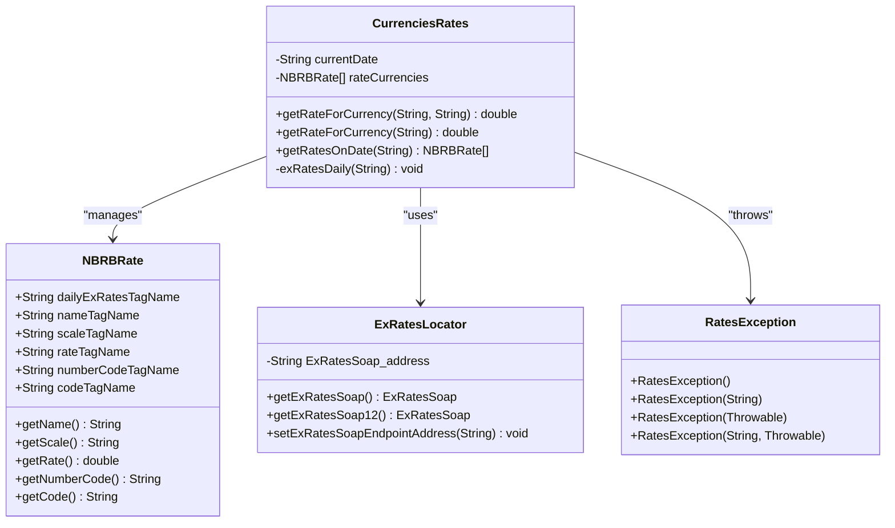
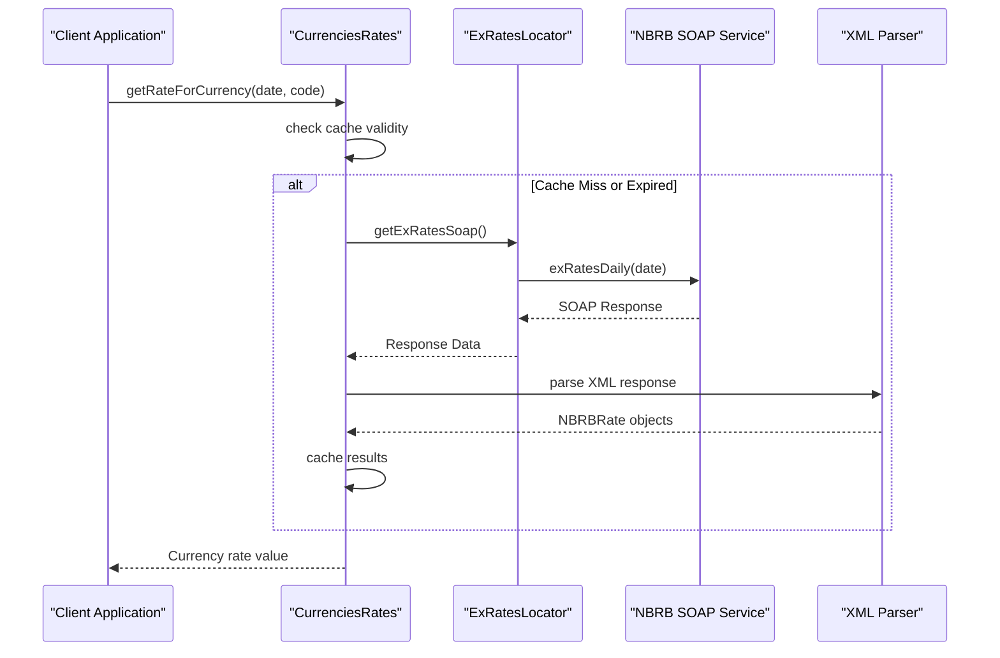
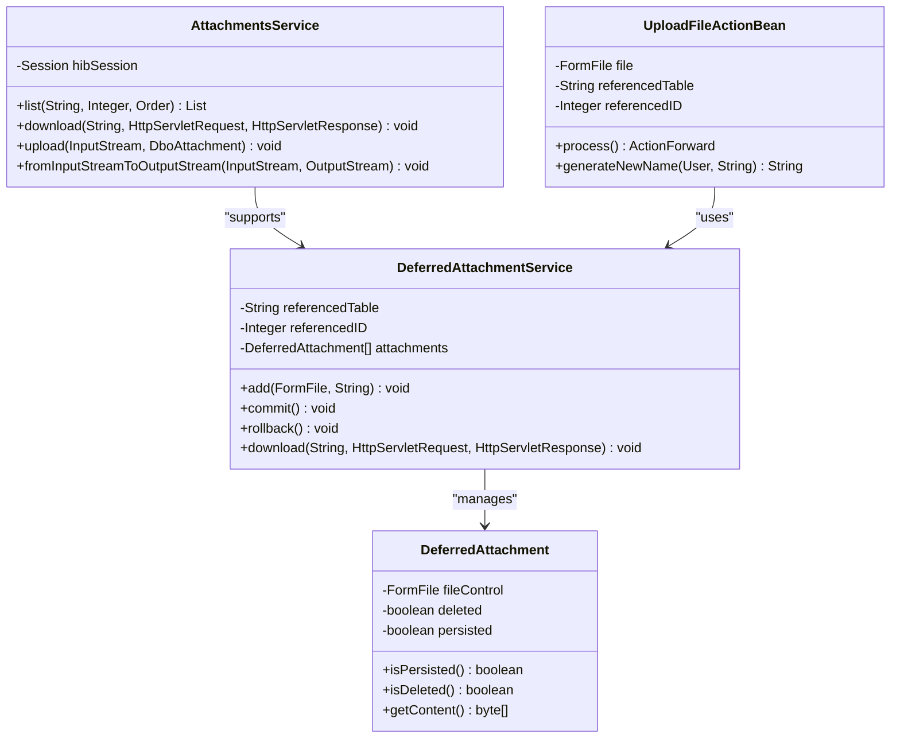
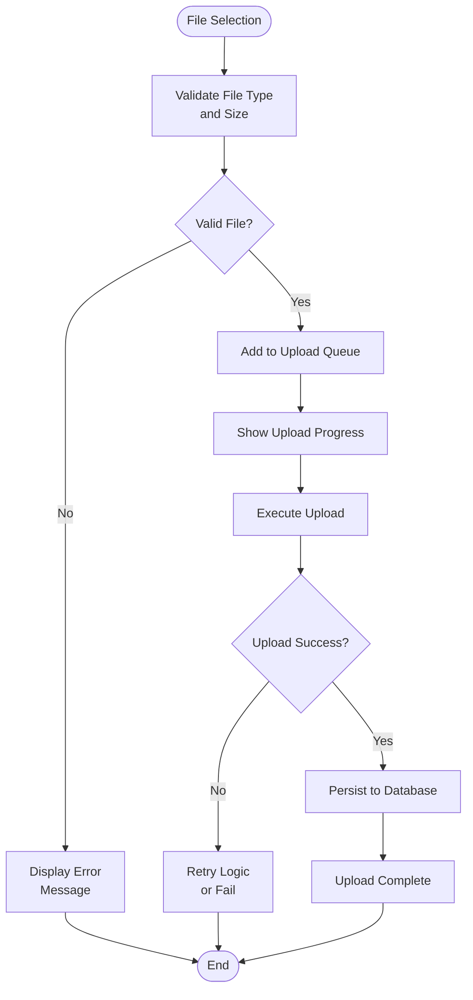
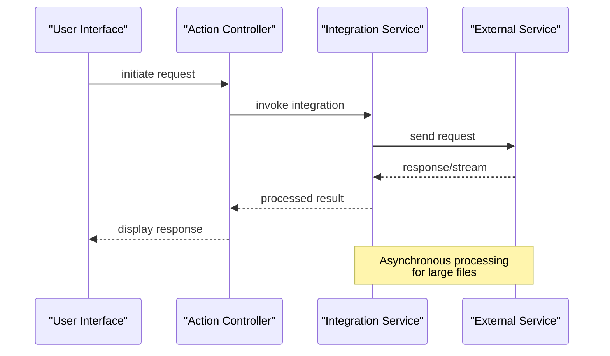
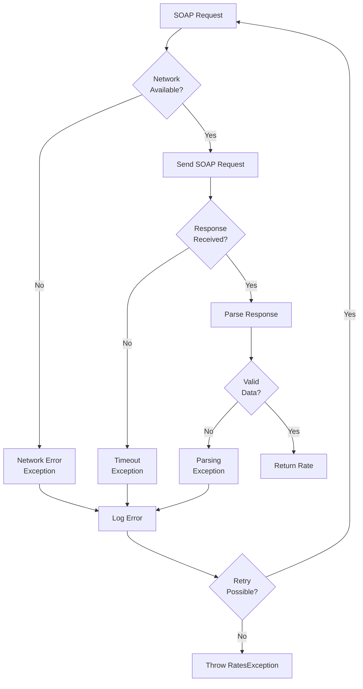
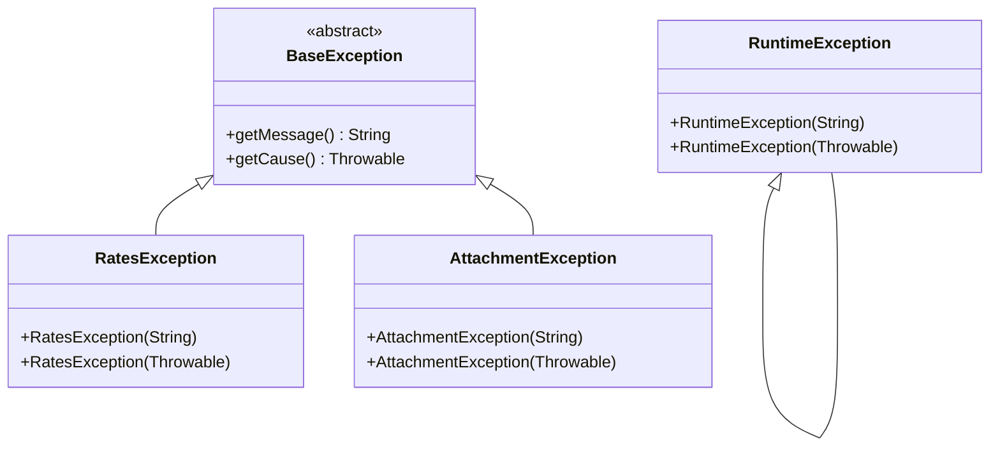

# External Integrations

<cite>
**Referenced Files in This Document**
- [CurrenciesRates.java](file://src/main/java/by/nbrb/www/CurrenciesRates.java)
- [NBRBRate.java](file://src/main/java/by/nbrb/www/NBRBRate.java)
- [RatesException.java](file://src/main/java/by/nbrb/www/RatesException.java)
- [ExRatesLocator.java](file://src/main/java/by/nbrb/www/ExRatesLocator.java)
- [AttachmentsService.java](file://src/main/java/net/sam/dcl/service/AttachmentsService.java)
- [DeferredAttachmentService.java](file://src/main/java/net/sam/dcl/service/DeferredAttachmentService.java)
- [UploadFileActionBean.java](file://src/main/java/net/sam/dcl/action/UploadFileActionBean.java)
- [MultipleFileUploadHelperAction.java](file://src/main/java/net/sam/dcl/action/MultipleFileUploadHelperAction.java)
- [PaymentAction.java](file://src/main/java/net/sam/dcl/action/PaymentAction.java)
- [CurrenciesAction.java](file://src/main/java/net/sam/dcl/action/CurrenciesAction.java)
- [plupload.full.min.js](file://src/main/webapp/includes/plupload-2.1.2/js/plupload.full.min.js)
- [MultipleFileUpload.jsp](file://src/main/webapp/jsp/MultipleFileUpload.jsp)
</cite>

## Table of Contents
1. [Introduction](#introduction)
2. [SOAP Web Service Integration](#soap-web-service-integration)
3. [File Upload Integration](#file-upload-integration)
4. [Integration Patterns](#integration-patterns)
5. [Error Handling and Security](#error-handling-and-security)
6. [Performance Considerations](#performance-considerations)
7. [Extending the System](#extending-the-system)
8. [Best Practices](#best-practices)

## Introduction

The dcl_v3 system implements robust external integrations through two primary mechanisms: SOAP web service clients for currency rate fetching and plupload-based file upload systems. These integrations demonstrate enterprise-grade patterns for external service communication, error handling, and data transformation while maintaining security and performance standards.

The system integrates with the National Bank of the Republic of Belarus (NBRB) SOAP web service to fetch real-time currency exchange rates and provides comprehensive file upload capabilities through the plupload library with server-side processing.

## SOAP Web Service Integration

### Currency Rate Service Implementation

The currency rate integration utilizes a SOAP web service client implemented in the `CurrenciesRates` class, which communicates with the NBRB Exchange Rates API.



**Diagram sources**
- [CurrenciesRates.java](file://src/main/java/by/nbrb/www/CurrenciesRates.java#L1-L131)
- [NBRBRate.java](file://src/main/java/by/nbrb/www/NBRBRate.java#L1-L73)
- [ExRatesLocator.java](file://src/main/java/by/nbrb/www/ExRatesLocator.java#L1-L201)
- [RatesException.java](file://src/main/java/by/nbrb/www/RatesException.java#L1-L27)

### Service Architecture

The SOAP integration follows a layered architecture pattern:

1. **Service Layer**: `CurrenciesRates` provides high-level currency rate operations
2. **Web Service Layer**: `ExRatesLocator` manages SOAP endpoint configuration
3. **Data Model Layer**: `NBRBRate` represents currency rate data structures
4. **Exception Layer**: `RatesException` handles service-specific errors

### Request Construction and Processing

The currency rate service implements intelligent caching and request optimization:



**Diagram sources**
- [CurrenciesRates.java](file://src/main/java/by/nbrb/www/CurrenciesRates.java#L25-L131)

### Data Transformation Pipeline

The system implements sophisticated XML parsing and data transformation:

| Step | Component | Responsibility | Error Handling |
|------|-----------|----------------|----------------|
| Request | ExRatesLocator | Endpoint configuration and SOAP message construction | Malformed URL exceptions |
| Transport | Apache Axis | HTTP transport and SOAP envelope handling | Network timeouts, connectivity |
| Parsing | DOM Parser | XML document parsing and element extraction | Invalid XML structure |
| Transformation | NBRBRate | Data model population and validation | Missing required fields |
| Caching | Static Cache | Memory-based result storage | Cache invalidation |

**Section sources**
- [CurrenciesRates.java](file://src/main/java/by/nbrb/www/CurrenciesRates.java#L60-L131)
- [ExRatesLocator.java](file://src/main/java/by/nbrb/www/ExRatesLocator.java#L76-L136)

## File Upload Integration

### Plupload Integration Architecture

The file upload system leverages the plupload library for cross-browser compatibility and implements a deferred attachment service pattern for robust file handling.



**Diagram sources**
- [AttachmentsService.java](file://src/main/java/net/sam/dcl/service/AttachmentsService.java#L1-L217)
- [DeferredAttachmentService.java](file://src/main/java/net/sam/dcl/service/DeferredAttachmentService.java#L1-L540)
- [UploadFileActionBean.java](file://src/main/java/net/sam/dcl/action/UploadFileActionBean.java#L1-L48)

### Multi-Runtime Upload Support

The plupload integration supports multiple runtime environments:

| Runtime | Technology | Fallback Capability | Security Level |
|---------|------------|-------------------|----------------|
| HTML5 | Native File API | Canvas fallback | High |
| Flash | Adobe Flash Player | JavaScript emulation | Medium |
| Silverlight | Microsoft Silverlight | JavaScript emulation | Medium |
| HTML4 | Form submission | Legacy browsers | Low |

### Upload Workflow



**Diagram sources**
- [MultipleFileUploadHelperAction.java](file://src/main/java/net/sam/dcl/action/MultipleFileUploadHelperAction.java#L25-L73)
- [plupload.full.min.js](file://src/main/webapp/includes/plupload-2.1.2/js/plupload.full.min.js#L1-L28)

**Section sources**
- [AttachmentsService.java](file://src/main/java/net/sam/dcl/service/AttachmentsService.java#L150-L217)
- [DeferredAttachmentService.java](file://src/main/java/net/sam/dcl/service/DeferredAttachmentService.java#L120-L180)

## Integration Patterns

### Request-Response Pattern

Both integrations implement the request-response pattern with asynchronous processing capabilities:



### Caching and Optimization

The system implements intelligent caching strategies:

1. **Currency Rate Caching**: Results cached by date to prevent redundant requests
2. **File Upload Staging**: Deferred attachment service for batch processing
3. **Memory Management**: Automatic cleanup of temporary files and streams

### Transaction Management

Both integrations support transactional operations:

- **Currency Rates**: Database transactions for rate updates
- **File Uploads**: Hibernate sessions for file metadata persistence

**Section sources**
- [CurrenciesRates.java](file://src/main/java/by/nbrb/www/CurrenciesRates.java#L45-L60)
- [DeferredAttachmentService.java](file://src/main/java/net/sam/dcl/service/DeferredAttachmentService.java#L150-L200)

## Error Handling and Security

### Currency Service Error Handling

The currency rate service implements comprehensive error handling:



**Diagram sources**
- [CurrenciesRates.java](file://src/main/java/by/nbrb/www/CurrenciesRates.java#L85-L131)

### File Upload Security Measures

The file upload system implements multiple security layers:

| Security Aspect | Implementation | Validation |
|-----------------|----------------|------------|
| File Type | MIME type checking | Server-side validation |
| File Size | Size limits | Configurable thresholds |
| File Content | Content scanning | Anti-virus integration |
| Access Control | Session-based permissions | User authentication |
| Path Traversal | Safe filename generation | Character filtering |

### Exception Management

The system provides structured exception handling:



**Diagram sources**
- [RatesException.java](file://src/main/java/by/nbrb/www/RatesException.java#L1-L27)

**Section sources**
- [CurrenciesRates.java](file://src/main/java/by/nbrb/www/CurrenciesRates.java#L120-L131)
- [AttachmentsService.java](file://src/main/java/net/sam/dcl/service/AttachmentsService.java#L100-L150)

## Performance Considerations

### Currency Service Optimization

The currency rate service implements several performance optimizations:

1. **Smart Caching**: Results cached by date to minimize network calls
2. **Lazy Loading**: Currency rates loaded only when requested
3. **Batch Processing**: Multiple rates fetched in single SOAP call
4. **Connection Pooling**: Reused SOAP connections for efficiency

### File Upload Performance

File upload performance is optimized through:

1. **Streaming Upload**: Large files uploaded in chunks
2. **Memory Management**: Temporary files cleaned automatically
3. **Concurrent Processing**: Multiple uploads handled simultaneously
4. **Compression**: Optional compression for bandwidth optimization

### Monitoring and Metrics

Key performance metrics tracked:

- **Currency Service**: Response time, success rate, cache hit ratio
- **File Upload**: Upload speed, error rate, concurrent uploads
- **System Health**: Memory usage, thread pool utilization

**Section sources**
- [CurrenciesRates.java](file://src/main/java/by/nbrb/www/CurrenciesRates.java#L45-L60)
- [AttachmentsService.java](file://src/main/java/net/sam/dcl/service/AttachmentsService.java#L150-L200)

## Extending the System

### Adding New External Services

To integrate new external services, follow these patterns:

1. **Create Service Interface**: Define service contract
2. **Implement Client**: Follow existing SOAP or REST patterns
3. **Add Error Handling**: Implement service-specific exceptions
4. **Configure Caching**: Optimize for service characteristics
5. **Test Integration**: Comprehensive unit and integration testing

### Extension Example Template

```java
// Service Interface
public interface ExternalService {
    ExternalResponse callService(ExternalRequest request) throws ServiceException;
}

// Client Implementation
public class ExternalServiceClient {
    // Implementation following established patterns
}

// Exception Handling
public class ServiceException extends Exception {
    // Custom exception handling
}
```

### Best Practices for Extensions

1. **Consistent Error Handling**: Use standardized exception patterns
2. **Logging Integration**: Implement comprehensive logging
3. **Configuration Management**: Externalize service URLs and credentials
4. **Testing Strategy**: Mock external services for unit testing
5. **Documentation**: Maintain clear API documentation

**Section sources**
- [CurrenciesRates.java](file://src/main/java/by/nbrb/www/CurrenciesRates.java#L1-L131)
- [ExRatesLocator.java](file://src/main/java/by/nbrb/www/ExRatesLocator.java#L1-L201)

## Best Practices

### Currency Service Usage

1. **Cache Management**: Respect cache expiration policies
2. **Error Recovery**: Implement exponential backoff for retries
3. **Data Validation**: Verify currency code formats
4. **Performance Monitoring**: Track service response times

### File Upload Best Practices

1. **Security First**: Validate all file attributes server-side
2. **Progress Tracking**: Provide user feedback during uploads
3. **Resume Capability**: Support interrupted upload recovery
4. **Storage Management**: Implement automatic cleanup policies

### General Integration Guidelines

1. **Configuration Externalization**: Store service endpoints in configuration
2. **Monitoring Integration**: Implement health checks and metrics
3. **Documentation**: Maintain comprehensive API documentation
4. **Testing Strategy**: Use mocks for external service testing
5. **Fallback Mechanisms**: Implement graceful degradation

### Security Considerations

1. **Credential Management**: Secure storage of service credentials
2. **Network Security**: HTTPS for all external communications
3. **Input Validation**: Sanitize all external data
4. **Audit Logging**: Track all external service interactions
5. **Rate Limiting**: Prevent abuse of external services

The dcl_v3 external integration system demonstrates enterprise-grade patterns for building robust, secure, and performant external service integrations. The combination of SOAP web services for currency rates and plupload-based file uploads provides a comprehensive foundation for modern web applications requiring external connectivity.