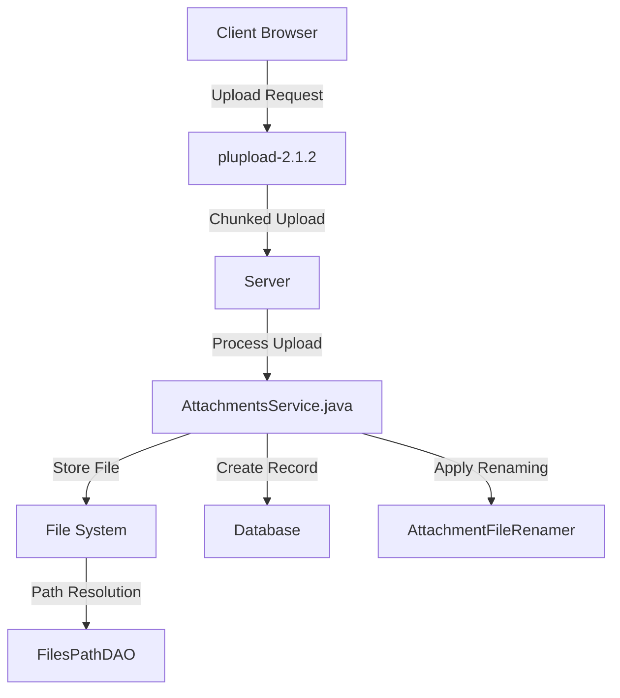
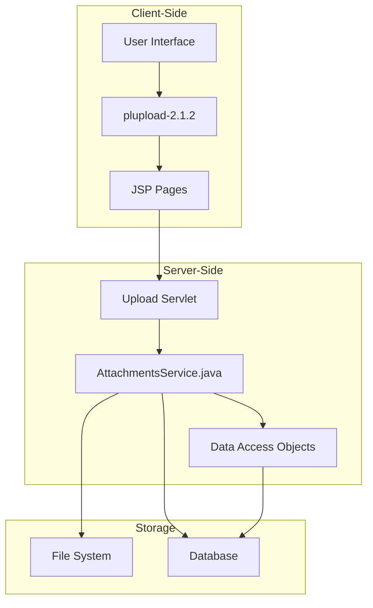
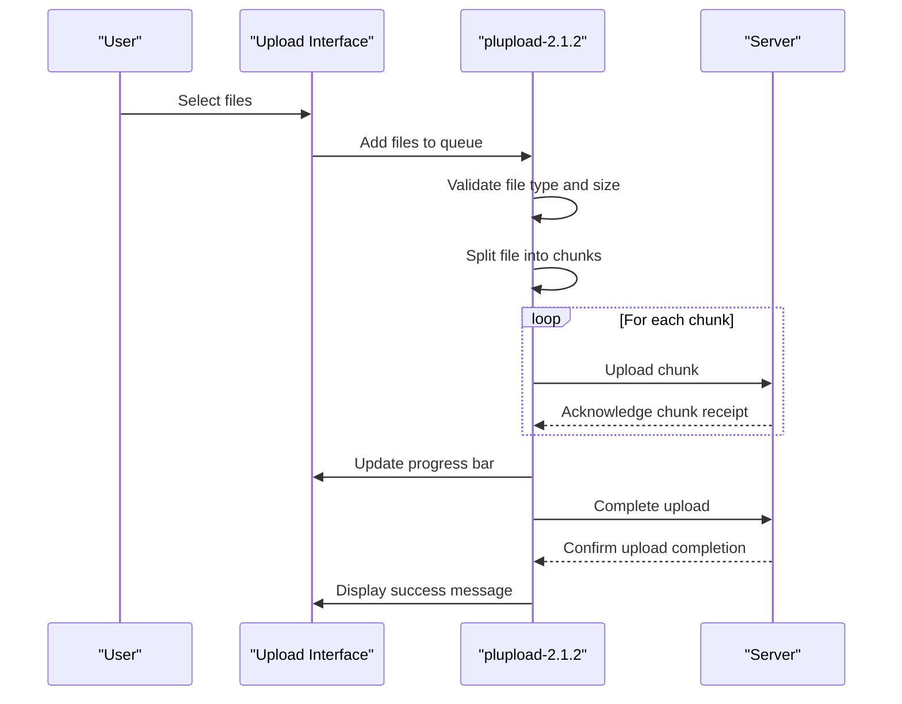
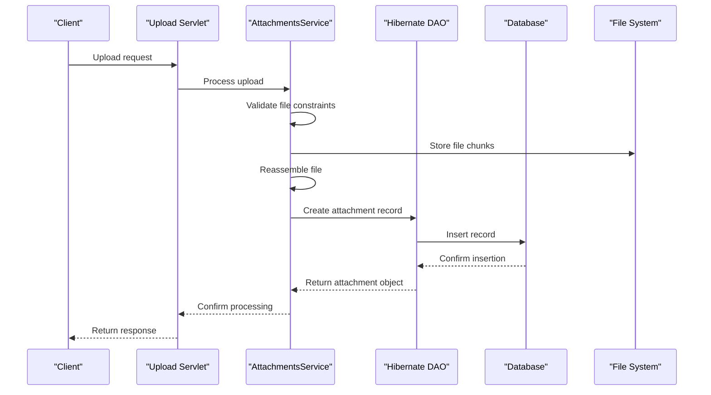
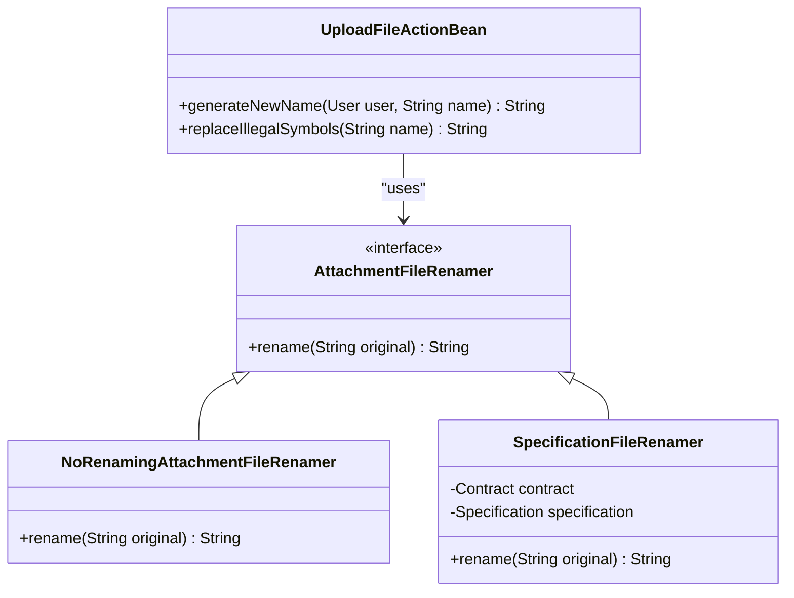
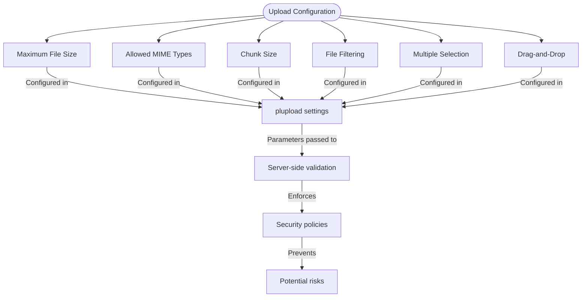
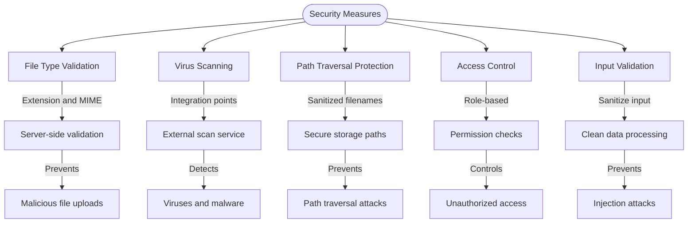
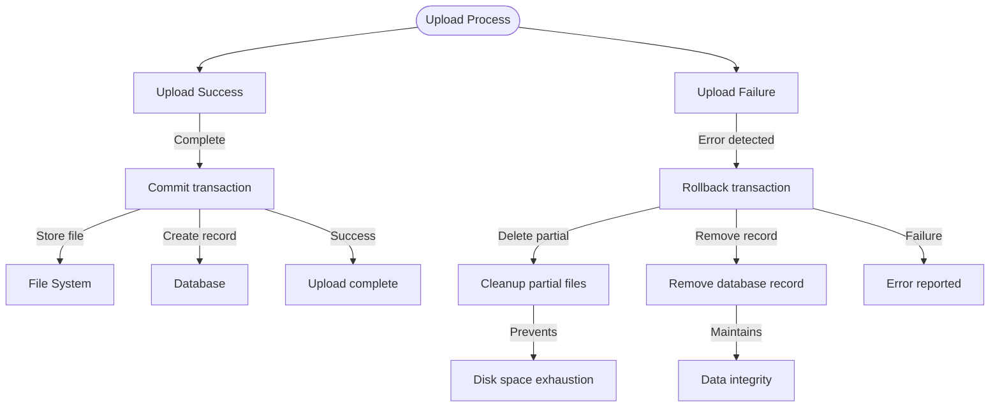
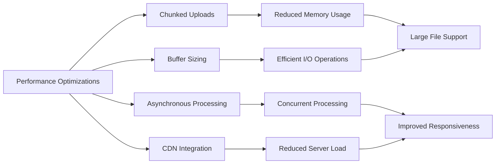

# File Upload Integration

<cite>
**Referenced Files in This Document**   
- [AttachmentsService.java](file://src/main/java/net/sam/dcl/service/AttachmentsService.java)
- [DboAttachment.java](file://src/main/java/net/sam/dcl/dbo/DboAttachment.java)
- [FilesPathDAO.java](file://src/main/java/net/sam/dcl/dao/FilesPathDAO.java)
- [UploadFileActionBean.java](file://src/main/java/net/sam/dcl/action/UploadFileActionBean.java)
- [DeferredAttachmentService.java](file://src/main/java/net/sam/dcl/service/DeferredAttachmentService.java)
- [AttachmentFileRenamer.java](file://src/main/java/net/sam/dcl/service/AttachmentFileRenamer.java)
- [jquery.ui.plupload.js](file://src/main/webapp/includes/plupload-2.1.2/js/jquery.ui.plupload/jquery.ui.plupload.js)
- [plupload.dev.js](file://src/main/webapp/includes/plupload-2.1.2/js/plupload.dev.js)
- [UploadFile.jsp](file://src/main/webapp/jsp/UploadFile.jsp)
- [MultipleFileUpload.jsp](file://src/main/webapp/jsp/MultipleFileUpload.jsp)
- [DeferredUploadFile.jsp](file://src/main/webapp/jsp/DeferredUploadFile.jsp)
</cite>

## Table of Contents
1. [Introduction](#introduction)
2. [Architecture Overview](#architecture-overview)
3. [Client-Side Upload Implementation](#client-side-upload-implementation)
4. [Server-Side Processing](#server-side-processing)
5. [File Storage and Naming Strategy](#file-storage-and-naming-strategy)
6. [Configuration Options](#configuration-options)
7. [Security Considerations](#security-considerations)
8. [Error Handling and Cleanup](#error-handling-and-cleanup)
9. [Performance Optimization](#performance-optimization)
10. [Troubleshooting Guide](#troubleshooting-guide)

## Introduction

The File Upload Integration system in dcl_v3 provides a comprehensive solution for handling file uploads through the integration of plupload-2.1.2 with server-side processing in AttachmentsService.java. This documentation details the complete upload flow from client-side JavaScript implementation to server-side processing, covering chunked uploads, progress tracking, file filtering, storage strategies, and security considerations.

The system enables users to upload files with various configuration options including maximum file size limits, allowed MIME types, and chunk size settings. The integration supports both single and multiple file uploads with progress tracking and error handling capabilities. Server-side processing handles file storage, database record creation, and transaction management to ensure data integrity.

**Diagram sources**
- [AttachmentsService.java](file://src/main/java/net/sam/dcl/service/AttachmentsService.java)
- [DboAttachment.java](file://src/main/java/net/sam/dcl/dbo/DboAttachment.java)
- [FilesPathDAO.java](file://src/main/java/net/sam/dcl/dao/FilesPathDAO.java)
- [jquery.ui.plupload.js](file://src/main/webapp/includes/plupload-2.1.2/js/jquery.ui.plupload/jquery.ui.plupload.js)

## Architecture Overview

The file upload architecture in dcl_v3 follows a client-server model with plupload-2.1.2 handling the client-side functionality and AttachmentsService.java managing server-side processing. The system is designed to handle large file uploads efficiently through chunked transfer encoding, providing progress feedback to users and ensuring reliable upload completion.

The architecture consists of three main components: the client-side uploader interface, the server-side upload handler, and the file storage subsystem. The client-side component provides a user-friendly interface for selecting and uploading files with features like drag-and-drop, progress bars, and file filtering. The server-side component processes uploaded chunks, validates file integrity, stores files securely, and maintains database records. The storage subsystem manages file paths, naming conventions, and directory organization.

**Diagram sources**
- [AttachmentsService.java](file://src/main/java/net/sam/dcl/service/AttachmentsService.java)
- [DboAttachment.java](file://src/main/java/net/sam/dcl/dbo/DboAttachment.java)
- [FilesPathDAO.java](file://src/main/java/net/sam/dcl/dao/FilesPathDAO.java)
- [jquery.ui.plupload.js](file://src/main/webapp/includes/plupload-2.1.2/js/jquery.ui.plupload/jquery.ui.plupload.js)

## Client-Side Upload Implementation

The client-side upload functionality is implemented using plupload-2.1.2, a multi-runtime file uploading API that supports various upload methods including HTML5, Flash, and Silverlight. The implementation provides a consistent user experience across different browsers and devices while leveraging the most appropriate upload technology available.

The upload process begins with file selection through a standard file dialog or drag-and-drop interface. Selected files are validated against configured filters for file type and size before being added to the upload queue. The plupload library handles chunked uploads automatically, dividing large files into smaller chunks that are uploaded sequentially. Progress tracking is provided through real-time updates that display the upload percentage and transfer speed.

**Diagram sources**
- [jquery.ui.plupload.js](file://src/main/webapp/includes/plupload-2.1.2/js/jquery.ui.plupload/jquery.ui.plupload.js)
- [plupload.dev.js](file://src/main/webapp/includes/plupload-2.1.2/js/plupload.dev.js)
- [MultipleFileUpload.jsp](file://src/main/webapp/jsp/MultipleFileUpload.jsp)

## Server-Side Processing

The server-side processing of file uploads is handled by the AttachmentsService.java class, which manages the complete lifecycle of uploaded files from receipt to storage and database integration. The service processes uploaded chunks, validates file integrity, stores files securely, and creates corresponding database records to maintain referential integrity.

When an upload request is received, the AttachmentsService first validates the file against configured constraints including size limits and file type restrictions. The uploaded file stream is then processed and stored in the designated file system location. A database record is created in the DCL_ATTACHMENT table to store metadata about the uploaded file, including the original filename, storage location, upload timestamp, and reference to the parent entity.

**Diagram sources**
- [AttachmentsService.java](file://src/main/java/net/sam/dcl/service/AttachmentsService.java)
- [DboAttachment.java](file://src/main/java/net/sam/dcl/dbo/DboAttachment.java)
- [FilesPathDAO.java](file://src/main/java/net/sam/dcl/dao/FilesPathDAO.java)

## File Storage and Naming Strategy

The file storage and naming strategy in dcl_v3 is implemented through the AttachmentFileRenamer interface and its concrete implementations. The system uses a configurable renaming strategy to generate unique filenames for uploaded files, preventing naming conflicts and ensuring secure file storage.

The default naming strategy, implemented in UploadFileActionBean, generates filenames based on the user code, timestamp, and original filename. The format includes the user code, year, month, day, hour, minute, second, millisecond, and the original filename with illegal characters replaced by hyphens. This approach ensures uniqueness while maintaining traceability to the uploading user and timestamp.

**Diagram sources**
- [AttachmentFileRenamer.java](file://src/main/java/net/sam/dcl/service/AttachmentFileRenamer.java)
- [NoRenamingAttachmentFileRenamer.java](file://src/main/java/net/sam/dcl/service/NoRenamingAttachmentFileRenamer.java)
- [SpecificationFileRenamer.java](file://src/main/java/net/sam/dcl/service/helper/SpecificationFileRenamer.java)
- [UploadFileActionBean.java](file://src/main/java/net/sam/dcl/action/UploadFileActionBean.java)

## Configuration Options

The file upload system in dcl_v3 provides several configuration options to control the upload behavior and enforce security policies. These options are configured through the plupload initialization parameters and server-side settings in the AttachmentsService.

Key configuration options include:
- **Maximum file size**: Limits the size of files that can be uploaded, preventing excessive resource consumption
- **Allowed MIME types**: Restricts the types of files that can be uploaded based on file extension and MIME type
- **Chunk size**: Determines the size of file chunks for chunked uploads, balancing network efficiency and memory usage
- **File filtering**: Enables client-side validation of file types and sizes before upload begins
- **Multiple file selection**: Controls whether users can select multiple files simultaneously
- **Drag-and-drop**: Enables or disables drag-and-drop file upload functionality

**Diagram sources**
- [jquery.ui.plupload.js](file://src/main/webapp/includes/plupload-2.1.2/js/jquery.ui.plupload/jquery.ui.plupload.js)
- [plupload.dev.js](file://src/main/webapp/includes/plupload-2.1.2/js/plupload.dev.js)
- [AttachmentsService.java](file://src/main/java/net/sam/dcl/service/AttachmentsService.java)

## Security Considerations

The file upload system in dcl_v3 incorporates multiple security measures to protect against common vulnerabilities and ensure the integrity of uploaded files. These security considerations address file type validation, virus scanning integration points, path traversal protection, and access control for uploaded files.

File type validation occurs at both client and server levels, with client-side validation providing immediate feedback and server-side validation serving as the authoritative check. The system uses both file extension checking and MIME type verification to prevent malicious file uploads. Path traversal protection is implemented by sanitizing filenames and using secure file storage paths resolved through the FilesPathDAO.

**Diagram sources**
- [AttachmentsService.java](file://src/main/java/net/sam/dcl/service/AttachmentsService.java)
- [DboAttachment.java](file://src/main/java/net/sam/dcl/dbo/DboAttachment.java)
- [FilesPathDAO.java](file://src/main/java/net/sam/dcl/dao/FilesPathDAO.java)
- [UploadFileActionBean.java](file://src/main/java/net/sam/dcl/action/UploadFileActionBean.java)

## Error Handling and Cleanup

The file upload system implements comprehensive error handling and cleanup mechanisms to ensure reliability and prevent resource leaks. The system handles various error conditions including upload failures, storage exceptions, and network interruptions, with appropriate recovery and cleanup procedures.

When an upload fails, the system rolls back any partial changes and cleans up temporary files to prevent disk space exhaustion. The DeferredAttachmentService manages transactional integrity by tracking upload state and ensuring that failed uploads do not leave orphaned files or incomplete database records. Partial uploads are automatically cleaned up after a configurable timeout period.

**Diagram sources**
- [AttachmentsService.java](file://src/main/java/net/sam/dcl/service/AttachmentsService.java)
- [DeferredAttachmentService.java](file://src/main/java/net/sam/dcl/service/DeferredAttachmentService.java)
- [DboAttachment.java](file://src/main/java/net/sam/dcl/dbo/DboAttachment.java)

## Performance Optimization

The file upload system incorporates several performance optimization techniques to handle large files efficiently and minimize server resource consumption. These optimizations include asynchronous processing, proper buffer sizing, and support for CDN integration.

Chunked uploads reduce memory usage by processing files in smaller segments rather than loading entire files into memory. The system uses a 10,000-byte buffer size for file streaming operations, balancing I/O efficiency with memory consumption. Asynchronous processing allows the server to handle multiple upload requests concurrently without blocking other operations.

**Diagram sources**
- [AttachmentsService.java](file://src/main/java/net/sam/dcl/service/AttachmentsService.java)
- [plupload.dev.js](file://src/main/webapp/includes/plupload-2.1.2/js/plupload.dev.js)
- [DboAttachment.java](file://src/main/java/net/sam/dcl/dbo/DboAttachment.java)

## Troubleshooting Guide

This troubleshooting guide addresses common issues encountered with the file upload system in dcl_v3, providing solutions for timeout errors, CORS problems, and large file handling challenges.

**Timeout Errors**: Increase server timeout settings and adjust chunk size to match network conditions. For slow connections, use smaller chunk sizes to prevent timeout failures.

**CORS Problems**: Ensure proper CORS headers are configured on the server and that the upload URL matches the expected domain and protocol. Verify that cross-origin requests are properly authorized.

**Large File Handling**: Optimize chunk size based on available bandwidth and server resources. Monitor server memory usage and adjust buffer sizes accordingly. Implement progress tracking to provide user feedback during long uploads.

**File Validation Issues**: Verify that allowed MIME types and file extensions are correctly configured. Check server-side validation rules and ensure they align with client-side settings.

**Storage Path Problems**: Confirm that the file storage directory exists and has appropriate write permissions. Verify that the FilesPathDAO correctly resolves storage paths for different entity types.

**Section sources**
- [AttachmentsService.java](file://src/main/java/net/sam/dcl/service/AttachmentsService.java)
- [DboAttachment.java](file://src/main/java/net/sam/dcl/dbo/DboAttachment.java)
- [FilesPathDAO.java](file://src/main/java/net/sam/dcl/dao/FilesPathDAO.java)
- [jquery.ui.plupload.js](file://src/main/webapp/includes/plupload-2.1.2/js/jquery.ui.plupload/jquery.ui.plupload.js)