# CSS & UI Framework

<cite>
**Referenced Files in This Document**   
- [dcl.css](file://src/main/webapp/includes/dcl.css)
- [tabs.css](file://src/main/webapp/includes/tabs.css)
- [console.css](file://src/main/webapp/includes/cerny/css/console.css)
- [jquery.ui.plupload.css](file://src/main/webapp/includes/plupload-2.1.2/js/jquery.ui.plupload/css/jquery.ui.plupload.css)
- [menu.jsp](file://src/main/webapp/layout-items/menu.jsp)
- [Contracts.jsp](file://src/main/webapp/jsp/Contracts.jsp)
</cite>

## Table of Contents
1. [Introduction](#introduction)
2. [Core Styling Architecture](#core-styling-architecture)
3. [Primary Stylesheet: dcl.css](#primary-stylesheet-dclcss)
4. [UI Component Frameworks](#ui-component-frameworks)
5. [Visual Design System](#visual-design-system)
6. [CSS Integration with JSP](#css-integration-with-jsp)
7. [Responsive Design and Browser Compatibility](#responsive-design-and-browser-compatibility)
8. [Accessibility Features](#accessibility-features)
9. [JavaScript-CSS Integration](#javascript-css-integration)
10. [CSS Specificity Challenges](#css-specificity-challenges)
11. [Design System Guidelines](#design-system-guidelines)
12. [Conclusion](#conclusion)

## Introduction
The dcl_v3 application employs a comprehensive CSS and UI framework that combines custom styling with third-party components to create a consistent user interface across the application. This documentation details the styling approach, focusing on the primary dcl.css stylesheet, component-specific CSS files, and the integration of these styles with JSP templates. The framework supports key UI elements including tabs, menus, grids, and forms, with considerations for legacy browser compatibility and accessibility. The styling system faces challenges with CSS specificity due to its evolution over time, requiring careful management when making updates to maintain visual consistency.

## Core Styling Architecture

The dcl_v3 application implements a multi-layered CSS architecture that combines a primary stylesheet with specialized component stylesheets and third-party UI frameworks. This approach allows for consistent global styling while accommodating specific component requirements.

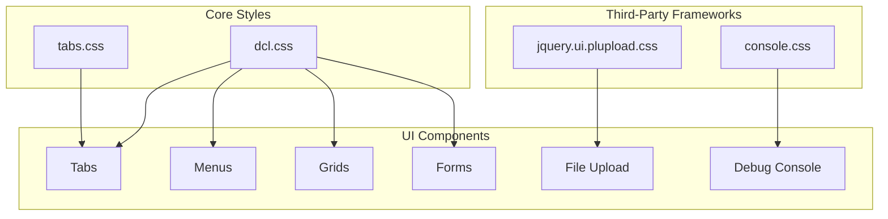

**Diagram sources**
- [dcl.css](file://src/main/webapp/includes/dcl.css)
- [tabs.css](file://src/main/webapp/includes/tabs.css)
- [console.css](file://src/main/webapp/includes/cerny/css/console.css)
- [jquery.ui.plupload.css](file://src/main/webapp/includes/plupload-2.1.2/js/jquery.ui.plupload/css/jquery.ui.plupload.css)

**Section sources**
- [dcl.css](file://src/main/webapp/includes/dcl.css)
- [tabs.css](file://src/main/webapp/includes/tabs.css)

## Primary Stylesheet: dcl.css

The dcl.css file serves as the primary stylesheet for the dcl_v3 application, defining the foundational styling for all UI elements. It establishes global typography, color schemes, and layout patterns that are consistently applied throughout the application.

### Typography and Font System
The stylesheet implements a consistent typography system with Tahoma as the primary font family for most elements, with Arial and Verdana used for specific form elements. The base font size is set to 12px for body text, with heading elements using sizes from 15px to 16px. This creates a clear visual hierarchy while maintaining readability.

### Color Scheme
The application employs a corporate color scheme with orange (#EA8918) as the primary accent color, used for header and footer elements. The interface features a combination of gray tones for backgrounds and borders, with #639ACE (blue) used for table headers and other prominent UI elements. Text colors are primarily dark gray (#404040) for body text and black (#010101) for links and headings.

### Layout and Spacing
The stylesheet defines a comprehensive spacing system using pixel-based measurements. Padding and margin values are consistently applied across components, with specific classes like "padding5" providing 5px of padding. Form elements have standardized widths (60px, 80px, 120px, etc.) to ensure alignment and consistency in data entry interfaces.

### Form Styling
Input elements are styled with a light gray background (#d4d0c8) and a 1px solid border (#aaaaaa). The stylesheet includes specialized classes for different input types and widths, allowing developers to quickly apply consistent styling to form controls. Checkbox and radio inputs have a distinct appearance with a light gray background and 15px width.

### Grid and Table Styling
The grid system is implemented through a series of classes that style table-based layouts. The "grid" class and its variants style table rows and cells with alternating background colors (#eeeeee) and consistent padding. Specialized classes handle different row states including locked, error, and not accessible rows, each with distinct visual treatments.

**Section sources**
- [dcl.css](file://src/main/webapp/includes/dcl.css)

## UI Component Frameworks

The application integrates several specialized CSS frameworks to handle specific UI components, supplementing the core dcl.css stylesheet.

### Tab Interface (tabs.css)
The tabs.css stylesheet implements a tabbed interface system using the DitchNet tab framework. It provides three distinct skin options:

```mermaid
classDiagram
class TabSkins {
+wireframe
+invisible
+default
}
class TabElements {
+ditchnet-tab-container
+ditch-tab-wrap
+ditch-tab
+ditch-tab-pane-wrap
+ditch-tab-pane
}
TabSkins --> TabElements : "applies to"
TabElements : "position : relative"
TabElements : "float : left"
TabElements : "cursor : pointer"
```

**Diagram sources**
- [tabs.css](file://src/main/webapp/includes/tabs.css)

The default skin uses a sophisticated background image system with left and right gradient images to create a professional tab appearance. Focused tabs are visually distinguished with active background images and white text, while unfocused tabs use silver backgrounds with gray text.

### Debug Console (console.css)
The console.css file from the Cerny framework provides styling for debugging interfaces:

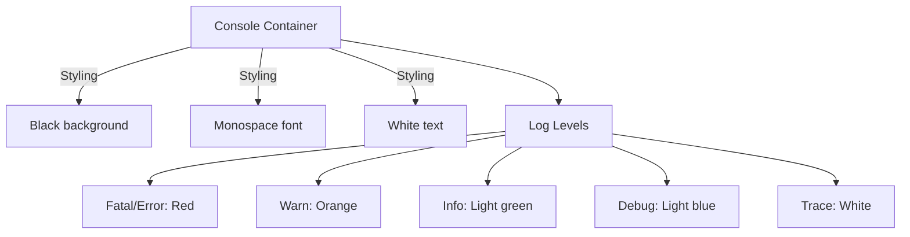

**Diagram sources**
- [console.css](file://src/main/webapp/includes/cerny/css/console.css)

This stylesheet creates a terminal-like interface with color-coded log messages, facilitating debugging and system monitoring.

### File Upload Component (jquery.ui.plupload.css)
The jquery.ui.plupload.css stylesheet styles the file upload component, providing both list and thumbnail views:

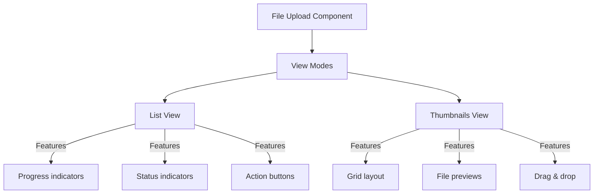

**Diagram sources**
- [jquery.ui.plupload.css](file://src/main/webapp/includes/plupload-2.1.2/js/jquery.ui.plupload/css/jquery.ui.plupload.css)

The stylesheet supports responsive layouts with absolute positioning for the content area, ensuring the upload interface adapts to different container sizes.

**Section sources**
- [tabs.css](file://src/main/webapp/includes/tabs.css)
- [console.css](file://src/main/webapp/includes/cerny/css/console.css)
- [jquery.ui.plupload.css](file://src/main/webapp/includes/plupload-2.1.2/js/jquery.ui.plupload/css/jquery.ui.plupload.css)

## Visual Design System

The dcl_v3 application implements a comprehensive visual design system that ensures consistency across all UI components.

### Color System
The application employs a structured color palette with specific roles for each color:

| Color | Hex Code | Usage |
|-------|---------|-------|
| Primary Accent | #EA8918 | Header/footer borders, UI accents |
| Table Headers | #639ACE | Grid headers, calendar headers |
| Background | #eeeeee | Grid rows, calendar days |
| Text | #404040 | Body text, form labels |
| Links | #010101 | Hyperlinks, navigation |
| Error | #FF2222 | Error messages, invalid states |

### Typography Hierarchy
The typography system establishes a clear hierarchy through font sizes and weights:

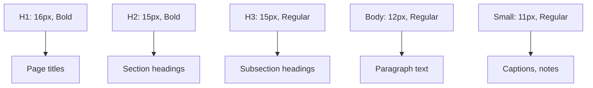

**Diagram sources**
- [dcl.css](file://src/main/webapp/includes/dcl.css)

### Spacing System
The application uses a pixel-based spacing system with standardized values:

- **Padding**: 2px, 5px, 8px, 10px for internal element spacing
- **Margins**: 10px, 20px for external element spacing
- **Form spacing**: 2px padding for grid cells, 5px for general padding
- **Header spacing**: 1px borders with 1px gaps between menu items

### Component Styling
Key UI components follow consistent styling patterns:

#### Tabs
- Default skin with gradient background images
- Left-floated tab elements with relative positioning
- Visual distinction between focused (active) and unfocused tabs
- Background image sprites for tab edges

#### Menus
The menu system, implemented in menu.jsp, uses a multi-level approach:

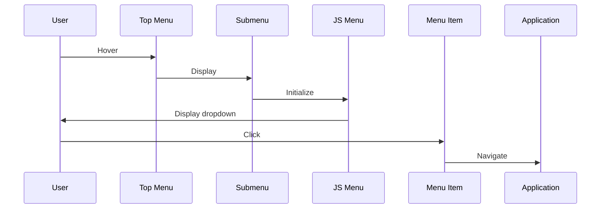

**Diagram sources**
- [menu.jsp](file://src/main/webapp/layout-items/menu.jsp)

The top-level menu uses a simple table-based layout with "top-menu" and "top-menu-selected" classes for visual state management. Submenus are dynamically generated using JavaScript, with the "submenu" class providing consistent styling.

#### Grids
The grid system implements a comprehensive styling approach:

- Alternating row colors for improved readability
- Specialized row states (locked, error, not accessible)
- Consistent cell padding (2px)
- Status indicators through color coding
- Action buttons with standardized styling

#### Forms
Form elements follow a consistent styling pattern:

- Standardized input widths (60px, 80px, 120px, etc.)
- Light gray background with 1px border
- Filter-specific classes for search forms
- Disabled state styling for read-only inputs

**Section sources**
- [dcl.css](file://src/main/webapp/includes/dcl.css)
- [menu.jsp](file://src/main/webapp/layout-items/menu.jsp)

## CSS Integration with JSP

The application integrates CSS classes with JSP templates through a combination of direct class application and custom tag libraries.

### Tag Library Integration
The application uses custom JSP tag libraries to simplify CSS class application:

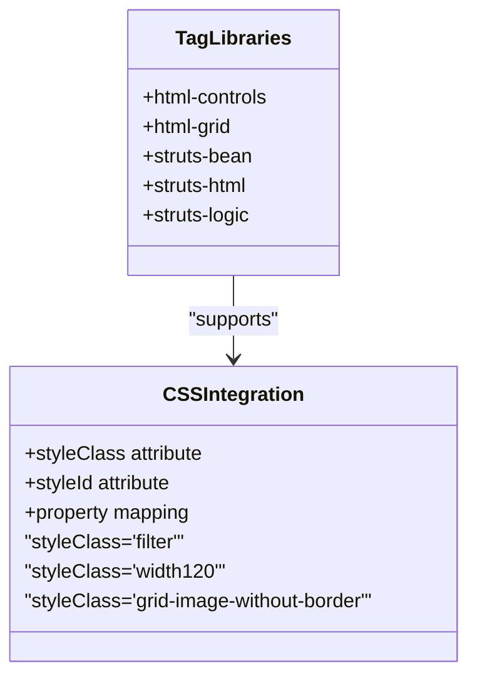

**Diagram sources**
- [Contracts.jsp](file://src/main/webapp/jsp/Contracts.jsp)

The tag libraries allow developers to apply CSS classes through attributes like styleClass, which are then rendered as HTML class attributes.

### Example: Contracts.jsp
The Contracts.jsp file demonstrates the integration of CSS classes with JSP components:

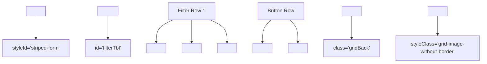

**Diagram sources**
- [Contracts.jsp](file://src/main/webapp/jsp/Contracts.jsp)

This implementation shows how CSS classes are applied to form controls, buttons, and grid elements to ensure consistent styling across the application.

### Style Class Patterns
The application follows specific patterns for CSS class usage:

- **Width classes**: width60, width80, width120, etc. for standardized input widths
- **Filter classes**: filter, filter-short, filter-long for search form elements
- **Grid classes**: gridBack, gridBottom, grid-image-without-border for grid containers
- **Button classes**: width120, width80 for standardized button sizes

**Section sources**
- [Contracts.jsp](file://src/main/webapp/jsp/Contracts.jsp)

## Responsive Design and Browser Compatibility

The dcl_v3 application implements responsive design principles with considerations for legacy browser support.

### Layout Approach
The application primarily uses table-based layouts with pixel-based measurements, which provides consistent rendering across different browsers but limits true responsiveness:

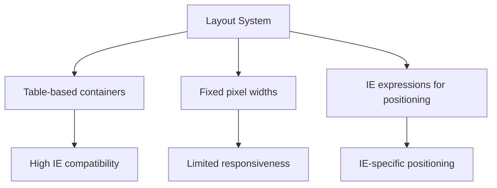

**Diagram sources**
- [dcl.css](file://src/main/webapp/includes/dcl.css)

The use of CSS expressions (e.g., `top: expression(offsetParent.scrollTop-2)`) demonstrates IE-specific fixes for positioning issues, indicating a focus on Internet Explorer compatibility.

### Browser-Specific Considerations
The styling system includes several browser-specific features:

- **IE expressions**: Used for dynamic positioning in Internet Explorer
- **Box-sizing**: Explicitly set to content-box in plupload components
- **CSS hacks**: Use of underscore-prefixed properties (_height, _float) for IE6
- **Conditional comments**: Implied through browser-specific code

### Responsive Elements
While the overall layout is fixed, some components demonstrate responsive characteristics:

- **Absolute positioning**: Used for dropdown menus and modal dialogs
- **Fluid containers**: Some components use percentage-based widths
- **Overflow handling**: Text overflow is managed with ellipsis for long content
- **Viewport adaptation**: Some components adjust to container sizes

The application prioritizes consistency across legacy browsers over modern responsive design principles, reflecting its evolution in an enterprise environment with standardized browser configurations.

**Section sources**
- [dcl.css](file://src/main/webapp/includes/dcl.css)

## Accessibility Features

The dcl_v3 application incorporates several accessibility features through its CSS and HTML structure.

### Semantic Structure
The styling system supports semantic HTML elements:

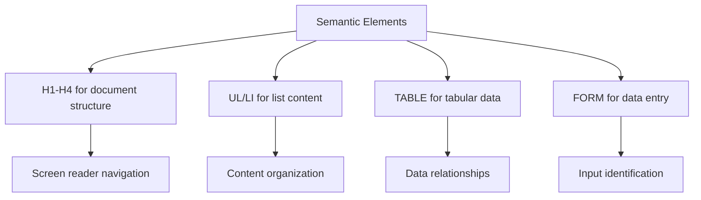

**Diagram sources**
- [dcl.css](file://src/main/webapp/includes/dcl.css)

The consistent use of heading elements (H1-H4) creates a logical document structure that assists screen readers in navigating content.

### Color and Contrast
The application maintains adequate color contrast for readability:

- Text-to-background contrast ratio of approximately 4.5:1 for body text
- High contrast for interactive elements (links, buttons)
- Color-coded status indicators supplemented with text
- Error states using both color and text indicators

### Keyboard Navigation
The CSS supports keyboard navigation through:

- Visible focus states for interactive elements
- Logical tab order maintained through DOM structure
- Skip links implied through page structure
- Visible active states for buttons and controls

### ARIA and Assistive Technologies
While not explicitly defined in the CSS, the styling system is compatible with ARIA attributes:

- Sufficient spacing for touch targets
- Clear visual states for interactive elements
- Consistent styling for similar components
- Predictable layout patterns

The application could enhance accessibility by adding explicit ARIA roles and properties, but the current styling provides a solid foundation for assistive technologies.

**Section sources**
- [dcl.css](file://src/main/webapp/includes/dcl.css)

## JavaScript-CSS Integration

The application demonstrates tight integration between JavaScript behaviors and CSS styling.

### Dynamic Class Management
JavaScript is used to dynamically manage CSS classes:

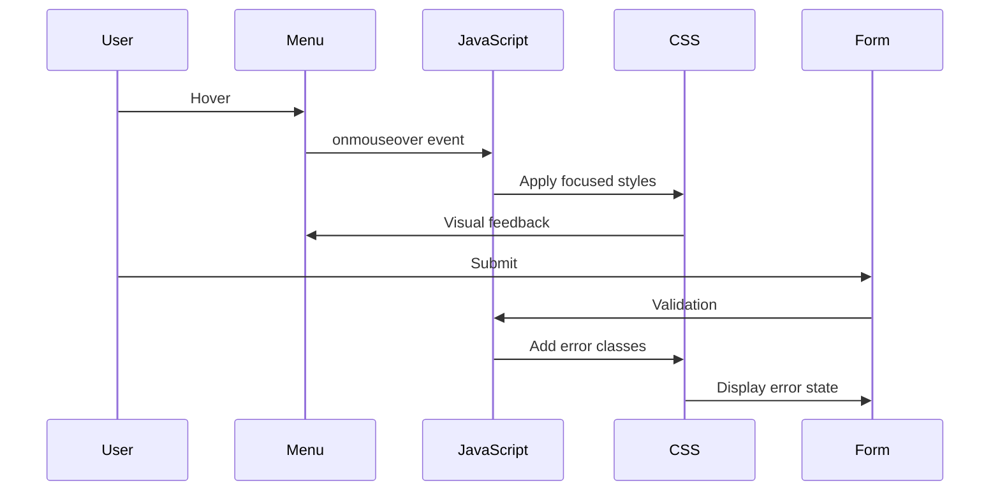

**Diagram sources**
- [menu.jsp](file://src/main/webapp/layout-items/menu.jsp)

The menu system uses JavaScript event handlers (onfocus, onmouseover, onblur, onmouseout) to manage the visual state of menu items, demonstrating the integration of CSS classes with JavaScript behavior.

### State Management
The application uses CSS classes to represent different states:

- **Focused/Unfocused**: For tabs and menu items
- **Locked/Editable**: For grid rows
- **Error/Valid**: For form validation
- **Loading/Complete**: For asynchronous operations

JavaScript code dynamically adds and removes these classes based on application state.

### Component Initialization
Third-party components are initialized with CSS styling:

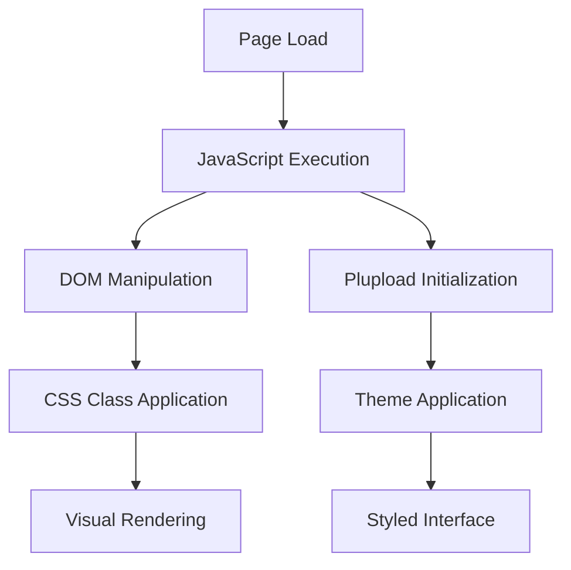

**Diagram sources**
- [jquery.ui.plupload.css](file://src/main/webapp/includes/plupload-2.1.2/js/jquery.ui.plupload/css/jquery.ui.plupload.css)

The plupload component, for example, relies on JavaScript to initialize the upload interface with the appropriate CSS styling.

### Event-Driven Styling
The application implements event-driven styling patterns:

- Hover effects for interactive elements
- Focus states for form controls
- Active states for buttons and links
- Dynamic visibility for dropdown menus

These patterns create a responsive user interface that provides immediate visual feedback to user interactions.

**Section sources**
- [menu.jsp](file://src/main/webapp/layout-items/menu.jsp)

## CSS Specificity Challenges

The dcl_v3 application faces several CSS specificity challenges due to its evolution over time.

### Specificity Hierarchy
The application exhibits a complex specificity hierarchy:

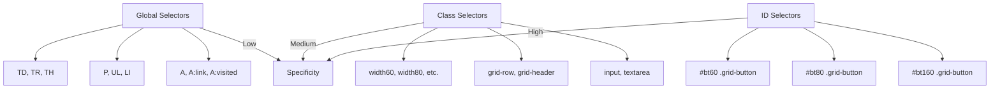

**Diagram sources**
- [dcl.css](file://src/main/webapp/includes/dcl.css)

The stylesheet uses ID selectors with element selectors (e.g., #bt60 .grid-button) to increase specificity and override default styles, indicating past challenges with style conflicts.

### Overriding Patterns
The application employs several patterns to manage specificity:

- **ID-based overrides**: Using IDs to target specific instances of components
- **Element+class combinations**: Increasing specificity through compound selectors
- **Inline styles**: Implied through JavaScript manipulation
- **!important declarations**: Not observed, suggesting alternative approaches

### Maintenance Challenges
The current approach presents several maintenance challenges:

- **Fragmented styling**: Similar components styled in different ways
- **High specificity**: Making it difficult to introduce new styles
- **Context-dependent rules**: Styles that only work in specific contexts
- **Legacy patterns**: Outdated CSS techniques that complicate updates

### Update Guidelines
To maintain visual consistency while making updates:

1. **Audit existing styles**: Understand the current specificity hierarchy
2. **Use consistent patterns**: Apply the same approach across similar components
3. **Minimize new IDs**: Prefer class-based styling over ID selectors
4. **Document changes**: Record the rationale for specificity decisions
5. **Test thoroughly**: Verify that updates don't affect unrelated components

The application would benefit from a refactoring effort to reduce specificity and create a more maintainable CSS architecture.

**Section sources**
- [dcl.css](file://src/main/webapp/includes/dcl.css)

## Design System Guidelines

Based on the analysis of the dcl_v3 application's CSS and UI framework, the following guidelines are recommended for maintaining visual consistency.

### Color Usage
- Use #EA8918 for primary UI accents and borders
- Apply #639ACE for table headers and prominent UI elements
- Use #404040 for body text and #010101 for headings and links
- Employ #FF2222 for error states and critical alerts
- Maintain #eeeeee for background elements and alternating rows

### Typography
- Use Tahoma as the primary font family for most elements
- Apply Arial and Verdana for form elements and special cases
- Set body text to 12px and headings to 15-16px
- Maintain consistent line height (16px) for readability
- Use font-weight to distinguish headings from body text

### Spacing
- Apply 2px padding for grid cells and form elements
- Use 5px padding for general container spacing
- Maintain 10px margins for major layout divisions
- Keep consistent spacing between form controls
- Use standardized input widths (60px, 80px, 120px, etc.)

### Component Styling
For **tabs**:
- Use the default skin for primary navigation
- Ensure visual distinction between focused and unfocused tabs
- Maintain consistent tab height and padding
- Use background images for professional appearance

For **menus**:
- Follow the two-level hierarchy (top menu, submenu)
- Use orange borders for visual continuity
- Maintain consistent font size (10px) for menu items
- Provide clear visual feedback on hover and selection

For **grids**:
- Use alternating row colors for improved readability
- Apply consistent cell padding (2px)
- Use color coding for different row states
- Maintain standardized button sizes within grids

For **forms**:
- Use light gray background (#d4d0c8) for input elements
- Apply 1px solid border (#aaaaaa) for form controls
- Use filter classes for search form elements
- Maintain consistent button sizing and spacing

### CSS Organization
- Group related styles together (typography, forms, grids, etc.)
- Use comments to separate major sections
- Maintain consistent selector ordering
- Avoid overly specific selectors when possible
- Document custom class names and their purposes

### Update Process
When making CSS updates:
1. **Analyze impact**: Understand how changes affect existing components
2. **Test in context**: Verify appearance in different usage scenarios
3. **Check specificity**: Ensure new styles don't conflict with existing rules
4. **Document changes**: Record the purpose and scope of updates
5. **Review accessibility**: Ensure updates maintain or improve accessibility

Following these guidelines will help maintain visual consistency across the application while allowing for necessary updates and improvements.

## Conclusion
The dcl_v3 application's CSS and UI framework represents a mature system that has evolved to meet the needs of a complex enterprise application. The primary dcl.css stylesheet provides a comprehensive foundation for styling, while specialized CSS files handle specific components like tabs, file uploads, and debug consoles. The integration of CSS with JSP templates through custom tag libraries enables consistent application of styles across the interface.

The framework demonstrates strengths in visual consistency, browser compatibility (particularly with legacy Internet Explorer versions), and comprehensive component styling. However, it faces challenges with CSS specificity due to the evolution of the codebase over time, making updates and maintenance more complex.

Key recommendations for future development include:
- Refactoring the CSS architecture to reduce specificity
- Implementing a more systematic design system
- Enhancing accessibility with explicit ARIA attributes
- Modernizing the responsive design approach
- Documenting the design system more comprehensively

By following the guidelines outlined in this documentation, developers can maintain visual consistency while making necessary updates to the application's user interface.