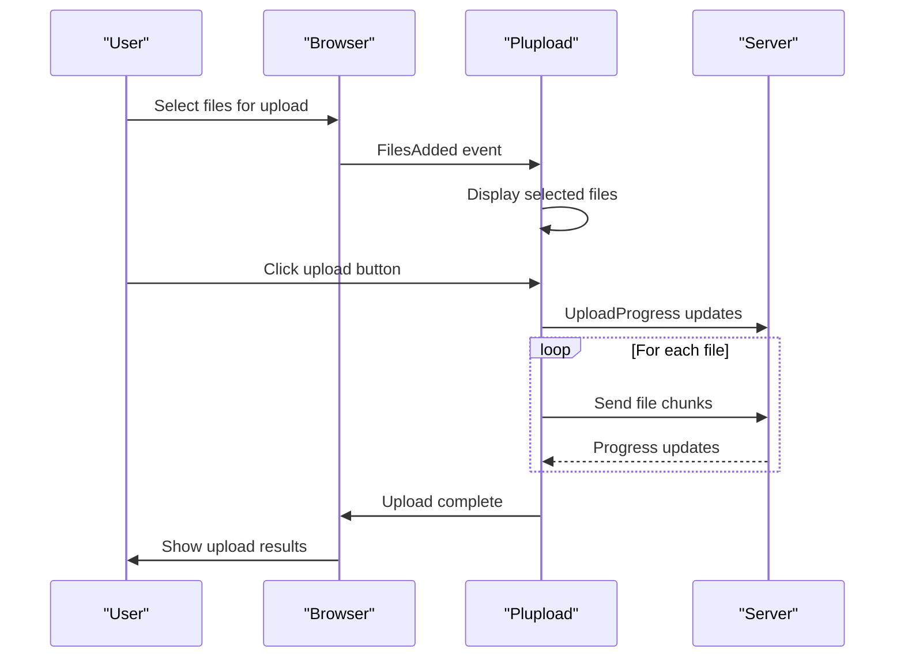
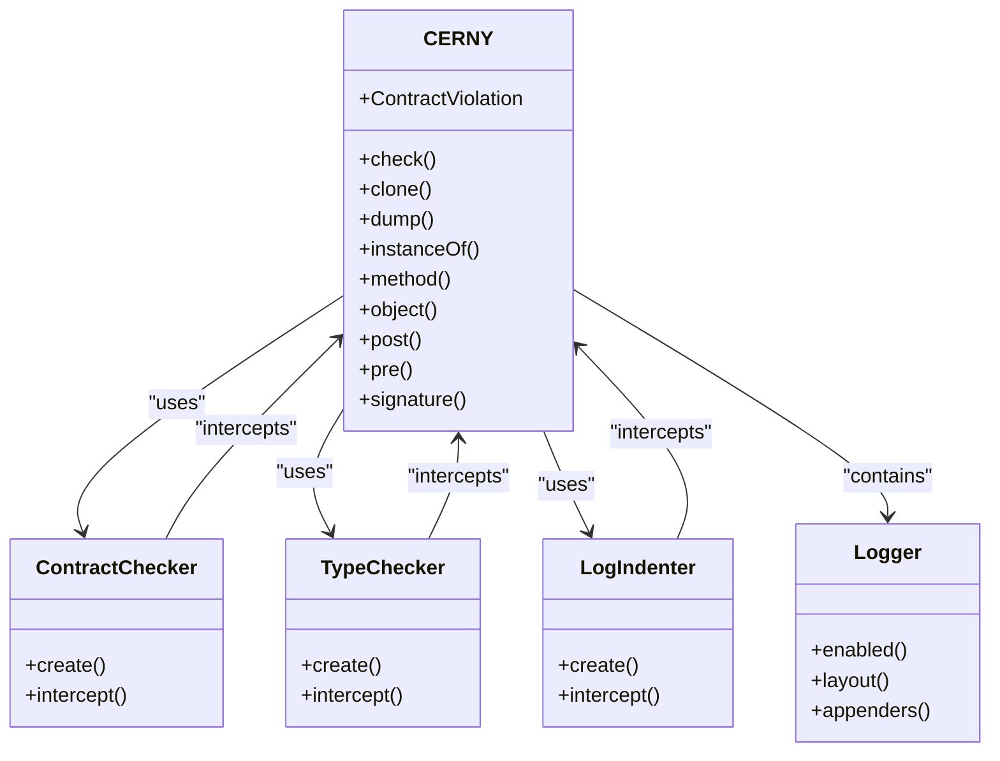
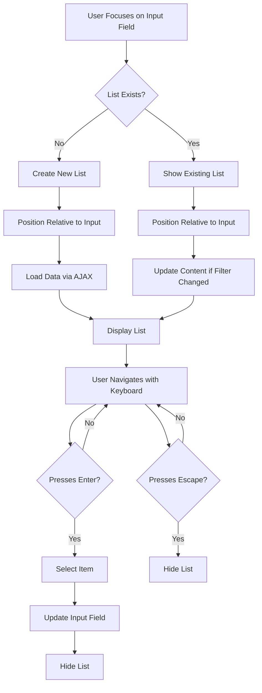
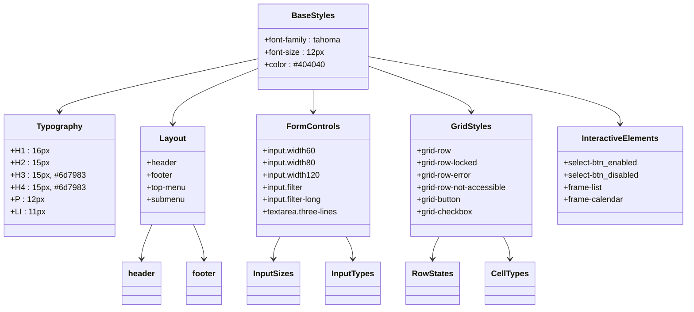
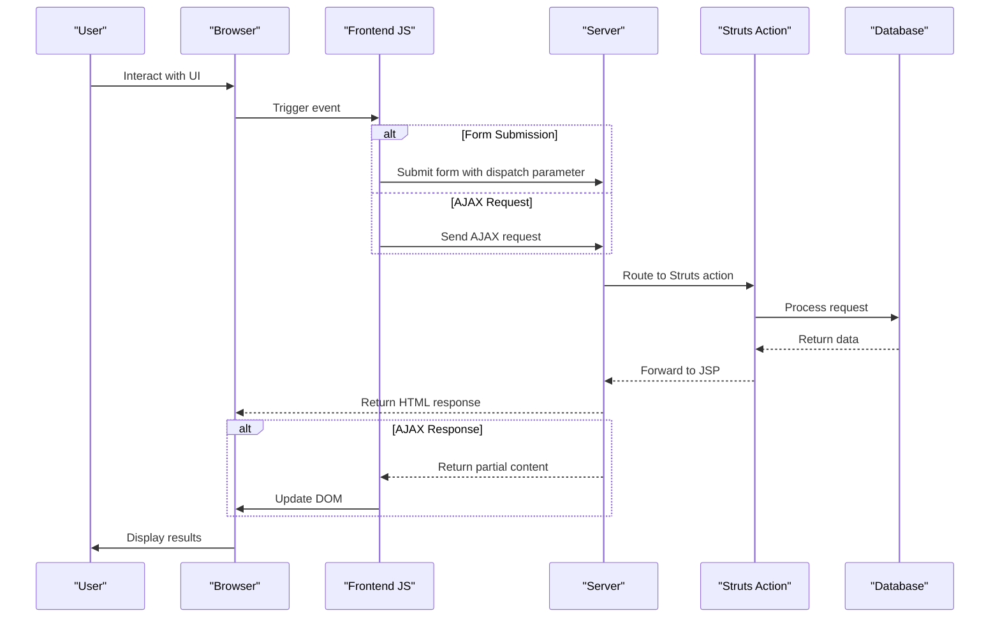

# Frontend Architecture

<cite>
**Referenced Files in This Document**   
- [main.jsp](file://src/main/webapp/layout/main.jsp)
- [Contract.jsp](file://src/main/webapp/jsp/Contract.jsp)
- [UploadFile.jsp](file://src/main/webapp/jsp/UploadFile.jsp)
- [MultipleFileUpload.jsp](file://src/main/webapp/jsp/MultipleFileUpload.jsp)
- [dcl.css](file://src/main/webapp/includes/dcl.css)
- [list.js](file://src/main/webapp/includes/list.js)
- [tabs.js](file://src/main/webapp/includes/tabs.js)
- [cerny.js](file://src/main/webapp/includes/cerny/js/cerny.js)
- [plupload.full.min.js](file://src/main/webapp/includes/plupload-2.1.2/js/plupload.full.min.js)
- [web.xml](file://src/main/webapp/WEB-INF/web.xml)
- [util.jsp](file://src/main/webapp/includes/util.jsp)
</cite>

## Table of Contents
1. [JSP-Based UI Architecture](#jsp-based-ui-architecture)
2. [Struts Integration and Form Beans](#struts-integration-and-form-beans)
3. [JavaScript Components](#javascript-components)
4. [File Upload with Plupload](#file-upload-with-plupload)
5. [UI Utilities with Cerny.js](#ui-utilities-with-cernyjs)
6. [Interactive Elements with List.js and Tabs.js](#interactive-elements-with-listjs-and-tabsjs)
7. [CSS Framework and Styling](#css-framework-and-styling)
8. [Integration Points and Data Flow](#integration-points-and-data-flow)
9. [Browser Compatibility and Performance](#browser-compatibility-and-performance)

## JSP-Based UI Architecture

The dcl_v3 frontend architecture is built on a JSP (JavaServer Pages) foundation, serving as the primary UI technology for rendering dynamic content. The application follows a traditional server-side rendering approach where JSP pages are processed on the server to generate HTML that is sent to the client browser. This architecture leverages the Java EE ecosystem with Struts as the MVC framework to handle the separation of concerns between presentation, business logic, and data.

The entry point of the application is defined in `index.jsp`, which forwards requests to the OfficeAction controller with a dispatch parameter of "input". This pattern is consistent throughout the application, where JSP pages are accessed through `.do` URLs that map to Struts actions. The main layout is defined in `main.jsp`, which establishes the overall page structure with header, body, and footer sections using Tiles for template composition.

JSP pages in the application are organized in the `/jsp` directory and follow a consistent pattern of including tag libraries for Struts and custom controls. The architecture uses a combination of standard Struts tags and custom tag libraries to create reusable UI components. The page lifecycle begins with a request to a `.do` URL, which is mapped to a Struts action that processes the request, populates form beans with data, and forwards to the appropriate JSP view for rendering.

**Section sources**
- [index.jsp](file://src/main/webapp/index.jsp#L0-L5)
- [main.jsp](file://src/main/webapp/layout/main.jsp#L0-L105)
- [web.xml](file://src/main/webapp/WEB-INF/web.xml#L0-L175)

## Struts Integration and Form Beans

The frontend architecture is tightly integrated with the Apache Struts framework, which provides the MVC pattern implementation for the application. Struts actions are mapped to `.do` URLs through the web.xml configuration, where the ActionServlet handles all requests with the `.do` extension. This servlet processes incoming requests, invokes the appropriate action class based on the URL, and forwards the response to the designated JSP view.

Form beans play a crucial role in the data binding between the backend and frontend. These Java classes contain properties that correspond to form fields in the JSP pages, enabling two-way data flow. When a form is submitted, Struts automatically populates the form bean with request parameters, and when a JSP page is rendered, the form bean properties are accessed to display data. The Contract.jsp example demonstrates this pattern, where form fields like `con_number` and `con_date_formatted` are bound to corresponding properties in the form bean.

The application uses custom tag libraries such as `html-controls` and `html-grid` to simplify form creation and data display. These tags provide abstractions for common UI patterns, such as server-side lists (`ctrl:serverList`) and grid components (`grid:table`). The server lists enable selection from large datasets by making AJAX calls to backend actions, while the grid components render tabular data with support for editing, deletion, and custom actions. The integration between JSPs and backend actions is facilitated through dispatch parameters that determine which method within a Struts action should be executed.

**Section sources**
- [Contract.jsp](file://src/main/webapp/jsp/Contract.jsp#L0-L315)
- [web.xml](file://src/main/webapp/WEB-INF/web.xml#L0-L175)
- [util.jsp](file://src/main/webapp/includes/util.jsp#L0-L799)

## JavaScript Components

The dcl_v3 frontend incorporates several JavaScript libraries to enhance user experience and provide interactive functionality. These components work in conjunction with the server-rendered JSP pages to create a more dynamic interface while maintaining compatibility with legacy browsers. The architecture follows a progressive enhancement approach, where core functionality works without JavaScript, but additional features are enabled when JavaScript is available.

The JavaScript components are loaded in the main.jsp layout file, establishing a consistent environment across all pages. The application uses prototype.js as a foundational library for DOM manipulation and AJAX functionality, providing a more consistent API across different browsers. This is particularly important for the legacy browser support required by the application. The JavaScript architecture is modular, with different components responsible for specific functionality such as file uploads, UI utilities, and interactive elements.

Event handling is implemented through a combination of inline JavaScript and event listeners. The application uses the `onkeydown`, `onclick`, and other standard event attributes to trigger JavaScript functions. For more complex interactions, event listeners are attached programmatically. The architecture also includes utility functions for common tasks such as form submission, progress indication, and modal dialogs, which are defined in the util.jsp file and available across all pages.

**Section sources**
- [main.jsp](file://src/main/webapp/layout/main.jsp#L0-L105)
- [util.jsp](file://src/main/webapp/includes/util.jsp#L0-L799)
- [Contract.jsp](file://src/main/webapp/jsp/Contract.jsp#L0-L315)

## File Upload with Plupload

The dcl_v3 application implements file upload functionality using the Plupload library, which provides multi-runtime support for uploading files with a consistent API across different browser technologies. This is particularly important for legacy browser compatibility, as Plupload can fall back to different upload methods based on browser capabilities. The MultipleFileUpload.jsp page demonstrates the integration of Plupload, configuring it to use Silverlight as the primary runtime.

Plupload's multi-runtime capability allows the application to support various upload mechanisms including HTML5, Flash, Silverlight, and Gears. This ensures that file uploads work across a wide range of browsers and environments, even those without modern HTML5 capabilities. The configuration in MultipleFileUpload.jsp specifies 'silverlight' as the runtime, indicating that the application prioritizes this technology for file uploads, likely due to its reliability and feature set in enterprise environments.

The file upload process is integrated with the backend through a dedicated servlet endpoint. The getUploadServletUrl function constructs the upload URL using the session ID and a method parameter, ensuring that uploads are properly associated with the user session. The Plupload configuration includes event handlers for various stages of the upload process, including file selection, upload progress, and error handling. The progress indicator updates the UI with the percentage complete for each file, providing visual feedback to users during potentially long upload operations.

**Diagram sources**
- [MultipleFileUpload.jsp](file://src/main/webapp/jsp/MultipleFileUpload.jsp#L0-L72)
- [UploadFile.jsp](file://src/main/webapp/jsp/UploadFile.jsp#L0-L36)

**Section sources**
- [MultipleFileUpload.jsp](file://src/main/webapp/jsp/MultipleFileUpload.jsp#L0-L72)
- [UploadFile.jsp](file://src/main/webapp/jsp/UploadFile.jsp#L0-L36)

## UI Utilities with Cerny.js

The dcl_v3 frontend utilizes the Cerny.js library as a comprehensive utility framework for UI development and JavaScript enhancement. This library provides a range of features including type checking, logging, dependency management, and object-oriented programming utilities that help maintain code quality and consistency across the application. The library is loaded in the main.jsp file along with other JavaScript components, making it available throughout the application.

Cerny.js implements a contract-based programming approach with preconditions, postconditions, and invariant checking through its ContractChecker interceptor. This allows developers to specify the expected behavior of functions and methods, helping to catch errors early in the development process. The library's method function enables aspect-oriented programming by allowing interceptors to be applied to methods, which can add cross-cutting concerns like logging or performance monitoring without modifying the core logic.

The architecture uses Cerny.js for several key purposes: logging with configurable appenders and layouts, type checking to ensure data integrity, and object cloning for safe data manipulation. The library's namespace system (CERNY.namespace) helps organize code and prevent global namespace pollution. The configuration file (cerny.conf.js) allows for runtime customization of the library's behavior, enabling different settings for development and production environments.

**Diagram sources**
- [cerny.js](file://src/main/webapp/includes/cerny/js/cerny.js#L0-L199)
- [main.jsp](file://src/main/webapp/layout/main.jsp#L0-L105)

**Section sources**
- [cerny.js](file://src/main/webapp/includes/cerny/js/cerny.js#L0-L199)
- [main.jsp](file://src/main/webapp/layout/main.jsp#L0-L105)

## Interactive Elements with List.js and Tabs.js

The dcl_v3 frontend implements interactive UI components through custom JavaScript libraries, with list.js handling dropdown lists and autocomplete functionality, and tabs.js managing tabbed interfaces. These components enhance the user experience by providing dynamic interactions without requiring full page reloads, while maintaining compatibility with legacy browsers.

The list.js library provides functionality for server-side lists that can be triggered from input fields. It handles keyboard navigation (arrow keys, Enter, Escape) to select items from a dropdown list, with visual feedback through row highlighting. The __showList2 function creates a floating div that displays the list content, positioned relative to the triggering input field. The library integrates with the server through AJAX calls, where the list content is loaded from a URL that includes the current input value as a filter parameter.

The tabs.js library implements a comprehensive tabbing system with support for tab selection, persistence via cookies, and navigation controls. It uses a namespace (org.ditchnet.jsp.TabUtils) to organize its functionality and follows object-oriented principles with static methods for common operations. The tab system supports multiple interaction methods including direct tab clicks, keyboard navigation, and programmatic switching through next/previous buttons. Tab state is preserved using cookies, allowing users to return to their previously selected tab when revisiting a page.

**Diagram sources**
- [list.js](file://src/main/webapp/includes/list.js#L0-L229)
- [tabs.js](file://src/main/webapp/includes/tabs.js#L0-L799)

**Section sources**
- [list.js](file://src/main/webapp/includes/list.js#L0-L229)
- [tabs.js](file://src/main/webapp/includes/tabs.js#L0-L799)

## CSS Framework and Styling

The dcl_v3 frontend employs a custom CSS framework defined in dcl.css, which establishes a consistent visual style across the application. The stylesheet follows a systematic approach to styling, with clear organization of rules for different HTML elements, form controls, and custom components. The design emphasizes readability and usability with a focus on enterprise application requirements.

The CSS framework defines styles for basic HTML elements including tables, forms, and text elements, establishing a consistent base appearance. Typography is standardized with Tahoma as the primary font at 12px size for most content, with appropriate heading styles for hierarchical information display. The color scheme uses a professional palette with #404040 for text, #010101 for links, and #EA8918 for accent elements in the header and footer.

Form controls are styled with specific classes for different input widths (width60, width80, width120, etc.), allowing for consistent sizing across forms. The framework includes specialized styles for grid components with alternating row colors (#eeeeee for normal rows, #cccccc for selected rows) and visual feedback for different states (locked, error, not accessible). The stylesheet also defines styles for interactive elements such as buttons, calendar controls, and list selectors, ensuring a cohesive user experience.

**Diagram sources**
- [dcl.css](file://src/main/webapp/includes/dcl.css#L0-L799)

**Section sources**
- [dcl.css](file://src/main/webapp/includes/dcl.css#L0-L799)

## Integration Points and Data Flow

The dcl_v3 frontend architecture demonstrates a well-defined integration pattern between client-side components and backend services, following the Struts MVC framework conventions. The primary integration mechanism is through `.do` URLs that map to Struts actions, with data flow orchestrated through form beans and request parameters. This pattern ensures a clear separation of concerns while enabling rich user interactions.

The data flow begins with user interactions in the browser, which trigger JavaScript functions that either submit forms or make AJAX requests. Form submissions are handled by the submitDispatchForm function, which adds a dispatch parameter to the form action URL before submission. This parameter determines which method within the target Struts action will be executed, enabling multiple operations to be handled by a single action class. AJAX requests are managed by the doAjax function, which sends parameters to backend endpoints and processes the response, optionally executing callback functions.

Integration with backend services occurs through several patterns: form-based submissions for major operations, AJAX calls for dynamic content loading, and direct URL navigation for page transitions. The Contract.jsp example illustrates form-based integration, where various actions (editSpecification, deleteSpecification, attach) are triggered by buttons that submit the form with different dispatch values. The server-side list functionality demonstrates AJAX integration, where selecting an item from a dropdown triggers an asynchronous request to load related data without refreshing the page.

**Diagram sources**
- [Contract.jsp](file://src/main/webapp/jsp/Contract.jsp#L0-L315)
- [util.jsp](file://src/main/webapp/includes/util.jsp#L0-L799)
- [web.xml](file://src/main/webapp/WEB-INF/web.xml#L0-L175)

**Section sources**
- [Contract.jsp](file://src/main/webapp/jsp/Contract.jsp#L0-L315)
- [util.jsp](file://src/main/webapp/includes/util.jsp#L0-L799)

## Browser Compatibility and Performance

The dcl_v3 frontend architecture is designed with extensive browser compatibility in mind, particularly for legacy enterprise environments. The application supports older browsers through careful JavaScript coding practices, progressive enhancement, and fallback mechanisms for modern features. This is evident in the use of JScript as the scripting language identifier in script tags and the inclusion of IE-specific conditional code throughout the JavaScript components.

Performance optimization for legacy browsers is achieved through several strategies. The application minimizes DOM manipulation by batching updates and using efficient selectors. The JavaScript code avoids modern ECMAScript features that may not be supported in older browsers, instead implementing polyfills for necessary functionality. The list.js library, for example, includes compatibility code for accessing element positions that works across different browser implementations.

The architecture also implements performance monitoring and user feedback mechanisms to maintain responsiveness. The runProgress and stopProgress functions create a modal overlay with a progress indicator during long-running operations, preventing user interaction and providing visual feedback. For AJAX requests, the doAjax function includes configurable options for synchronous vs. asynchronous execution, allowing developers to balance responsiveness with data consistency requirements.

Accessibility considerations are addressed through semantic HTML structure, keyboard navigation support, and ARIA-like patterns implemented through custom attributes. The tabbing system supports keyboard navigation with arrow keys, and form controls include appropriate labels and focus management. The application also includes error handling and user feedback mechanisms, with custom error dialogs and confirmation prompts to guide users through complex operations.

**Section sources**
- [util.jsp](file://src/main/webapp/includes/util.jsp#L0-L799)
- [main.jsp](file://src/main/webapp/layout/main.jsp#L0-L105)
- [list.js](file://src/main/webapp/includes/list.js#L0-L229)