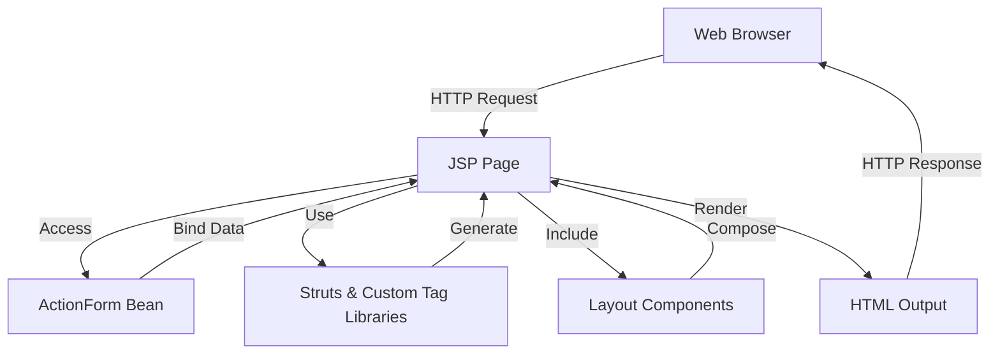
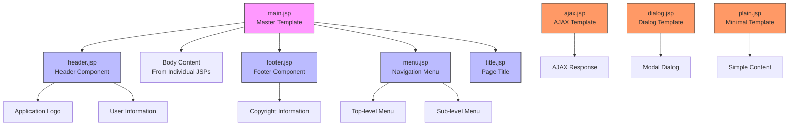
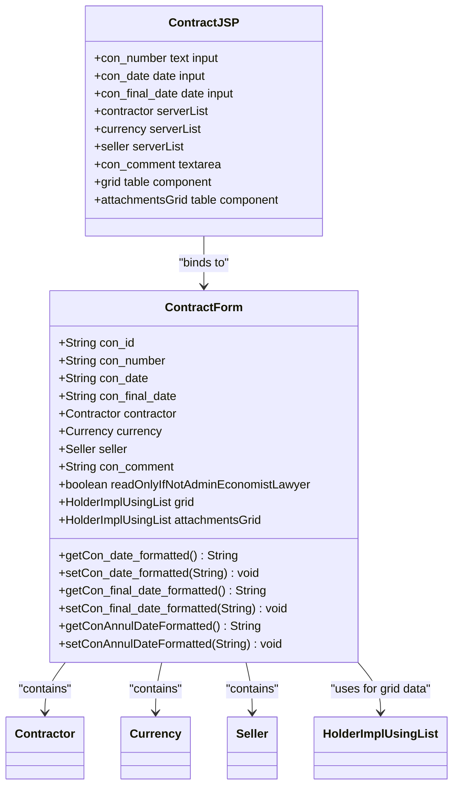
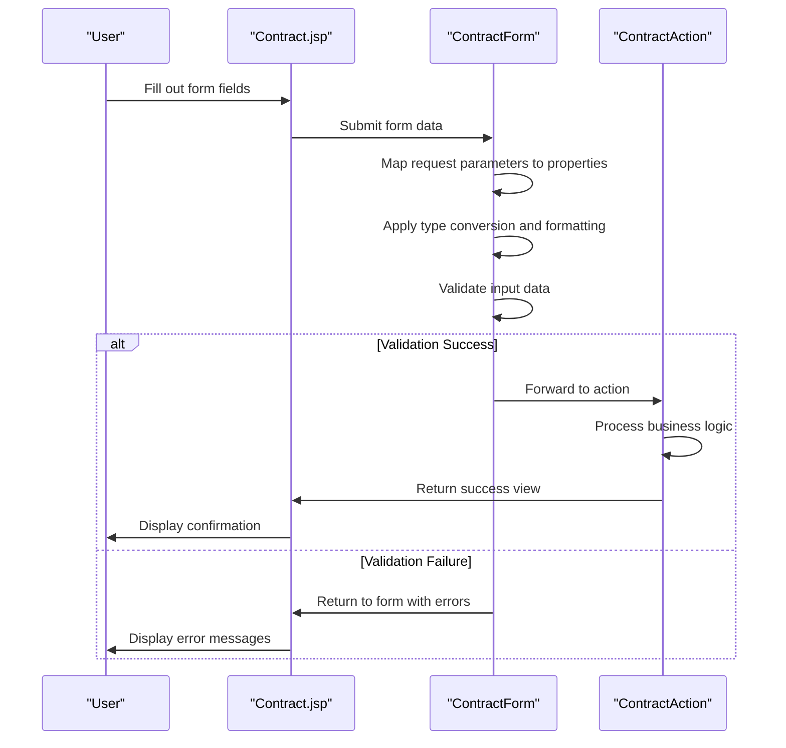
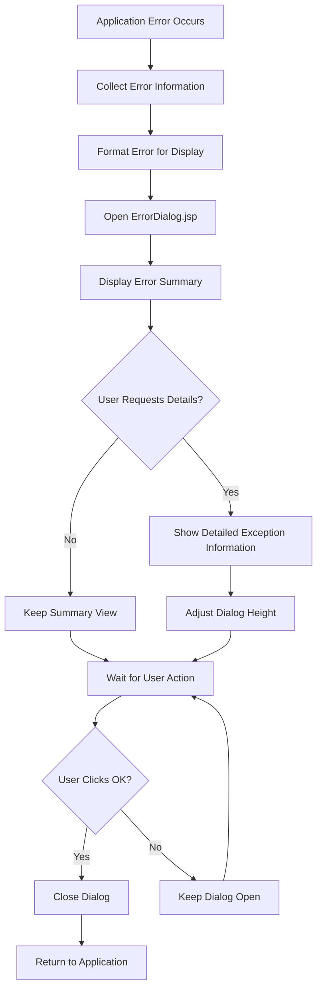
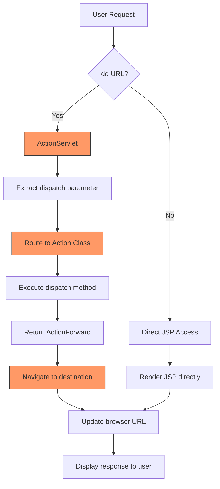
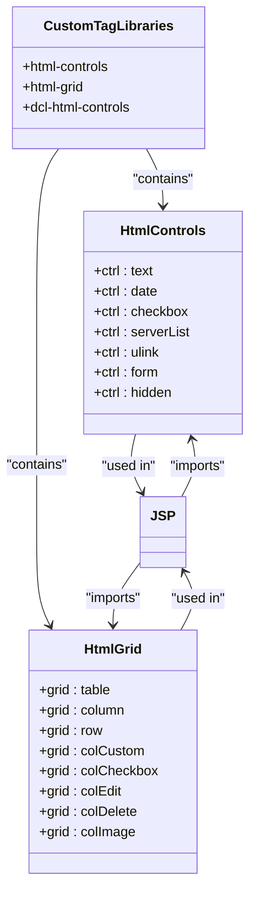
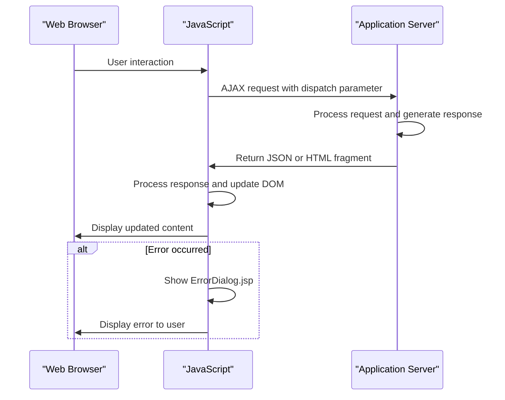

# JSP Pages & Layouts

<cite>
**Referenced Files in This Document**   
- [main.jsp](file://src/main/webapp/layout/main.jsp)
- [Contract.jsp](file://src/main/webapp/jsp/Contract.jsp)
- [ErrorDialog.jsp](file://src/main/webapp/dialogs/ErrorDialog.jsp)
- [header.jsp](file://src/main/webapp/layout-items/header.jsp)
- [footer.jsp](file://src/main/webapp/layout-items/footer.jsp)
- [menu.jsp](file://src/main/webapp/layout-items/menu.jsp)
- [title.jsp](file://src/main/webapp/layout-items/title.jsp)
- [ajax.jsp](file://src/main/webapp/layout/ajax.jsp)
- [dialog.jsp](file://src/main/webapp/layout/dialog.jsp)
- [plain.jsp](file://src/main/webapp/layout/plain.jsp)
- [ContractForm.java](file://src/main/java/net/sam/dcl/form/ContractForm.java)
- [web.xml](file://src/main/webapp/WEB-INF/web.xml)
</cite>

## Table of Contents
1. [Introduction](#introduction)
2. [JSP as Presentation Layer](#jsp-as-presentation-layer)
3. [Layout Architecture](#layout-architecture)
4. [JSP-ActionForm Binding](#jsp-actionform-binding)
5. [Form Data Binding and Validation](#form-data-binding-and-validation)
6. [Error Handling with ErrorDialog.jsp](#error-handling-with-errordialogjsp)
7. [Navigation and URL Patterns](#navigation-and-url-patterns)
8. [Custom Tag Libraries](#custom-tag-libraries)
9. [AJAX and Dynamic Content](#ajax-and-dynamic-content)
10. [Best Practices and Modernization](#best-practices-and-modernization)
11. [Creating New JSP Pages](#creating-new-jsp-pages)

## Introduction
The dcl_v3 application utilizes JavaServer Pages (JSP) as its primary presentation layer technology, implementing a Model-View-Controller (MVC) architecture through the Struts framework. This documentation provides a comprehensive analysis of the JSP pages and layout system, detailing how dynamic content is rendered through Struts form beans and JSTL tags. The layout architecture is centered around a master template approach with componentized header and footer elements, enabling consistent UI presentation across the application. Individual JSPs bind to backend ActionForms and interact with Struts actions through .do URLs, creating a robust web application framework that has evolved over time with AJAX enhancements and custom tag libraries.

**Section sources**
- [main.jsp](file://src/main/webapp/layout/main.jsp)
- [web.xml](file://src/main/webapp/WEB-INF/web.xml)

## JSP as Presentation Layer
JSP serves as the primary presentation layer technology in the dcl_v3 application, responsible for rendering dynamic content to users. The system leverages Struts form beans for data binding and JSTL tags for presentation logic, creating a separation between business logic and UI rendering. Each JSP page imports essential Struts tag libraries including struts-bean, struts-html, struts-logic, and struts-tiles, which provide the foundation for dynamic content generation and form handling.

The application implements a comprehensive tag library system with custom tags for form controls, grids, and dialogs, extending the standard Struts functionality. These custom tags, such as html-controls and html-grid, provide application-specific UI components that maintain consistency across the interface. The JSP pages are configured to use UTF-8 encoding, ensuring proper handling of international characters, and include various JavaScript libraries for enhanced user interaction.

JSP pages in the application follow a consistent structure with standardized imports and tag library declarations at the beginning of each file. This approach ensures that all pages have access to the necessary functionality while maintaining a uniform development pattern across the codebase.

**Diagram sources**
- [Contract.jsp](file://src/main/webapp/jsp/Contract.jsp)
- [web.xml](file://src/main/webapp/WEB-INF/web.xml)

**Section sources**
- [Contract.jsp](file://src/main/webapp/jsp/Contract.jsp)
- [web.xml](file://src/main/webapp/WEB-INF/web.xml)

## Layout Architecture
The layout architecture in dcl_v3 is built around a master template approach using the Struts Tiles framework. The main.jsp file serves as the master template, defining the overall page structure with header, body, and footer sections. This template uses Tiles attributes to insert content from individual JSP pages, creating a consistent layout across the application.

The header and footer components are implemented as separate JSP files in the layout-items directory, allowing for modular maintenance and updates. The header.jsp includes the application logo, menu system, and user information, while footer.jsp contains copyright information. The menu.jsp component implements a dynamic menu system that renders based on user roles and current application state, with support for both top-level and sub-level navigation items.

The title.jsp component handles page title rendering, supporting multiple methods for specifying the title including form-title attributes and resource bundle keys. This flexible approach allows different pages to specify their titles in the most appropriate manner. The layout system also includes specialized templates such as ajax.jsp for AJAX responses, dialog.jsp for modal dialogs, and plain.jsp for minimal layouts without header/footer components.

**Diagram sources**
- [main.jsp](file://src/main/webapp/layout/main.jsp)
- [header.jsp](file://src/main/webapp/layout-items/header.jsp)
- [footer.jsp](file://src/main/webapp/layout-items/footer.jsp)
- [menu.jsp](file://src/main/webapp/layout-items/menu.jsp)
- [title.jsp](file://src/main/webapp/layout-items/title.jsp)
- [ajax.jsp](file://src/main/webapp/layout/ajax.jsp)
- [dialog.jsp](file://src/main/webapp/layout/dialog.jsp)
- [plain.jsp](file://src/main/webapp/layout/plain.jsp)

**Section sources**
- [main.jsp](file://src/main/webapp/layout/main.jsp)
- [header.jsp](file://src/main/webapp/layout-items/header.jsp)
- [footer.jsp](file://src/main/webapp/layout-items/footer.jsp)
- [menu.jsp](file://src/main/webapp/layout-items/menu.jsp)
- [title.jsp](file://src/main/webapp/layout-items/title.jsp)

## JSP-ActionForm Binding
The dcl_v3 application implements a robust binding mechanism between JSP pages and backend ActionForm classes, following the Struts MVC pattern. Each JSP page is associated with a corresponding ActionForm class that serves as the data model for the page. For example, the Contract.jsp page binds to the ContractForm.java class, creating a direct relationship between the presentation layer and the data handling layer.

The binding process occurs through the Struts framework's automatic population of form bean properties from HTTP request parameters. When a form is submitted, Struts maps the request parameters to the corresponding properties in the ActionForm, handling type conversion and validation. The ContractForm class contains properties that directly correspond to form fields in Contract.jsp, such as con_number, con_date, and contractor, enabling seamless data transfer between the UI and backend.

The binding mechanism supports complex data types through custom getter and setter methods that handle data transformation. For example, date fields use specialized getter and setter methods that convert between database format and application display format. This approach maintains clean separation between data storage format and user presentation format while ensuring data integrity.

**Diagram sources**
- [Contract.jsp](file://src/main/webapp/jsp/Contract.jsp)
- [ContractForm.java](file://src/main/java/net/sam/dcl/form/ContractForm.java)

**Section sources**
- [Contract.jsp](file://src/main/webapp/jsp/Contract.jsp)
- [ContractForm.java](file://src/main/java/net/sam/dcl/form/ContractForm.java)

## Form Data Binding and Validation
Form data binding in the dcl_v3 application follows the Struts framework's standard approach, with form fields in JSP pages mapped to properties in corresponding ActionForm classes. The binding process is facilitated by custom tag libraries that extend the standard Struts html tags, providing enhanced functionality for various input types. For example, the ctrl:text tag is used for text inputs, ctrl:date for date fields, and ctrl:serverList for dropdown selections with server-side data.

The validation process occurs at multiple levels, starting with client-side validation through JavaScript and proceeding to server-side validation in the ActionForm's validate method. The ContractForm class demonstrates this approach with its reset method that initializes default values and its various getter and setter methods that may include validation logic. The form also includes boolean properties like readOnlyIfNotAdminEconomistLawyer that control field accessibility based on user roles and application state.

Data transformation is handled through specialized getter and setter methods that convert between different data formats. For date fields, the ContractForm class includes formatted getter and setter methods that convert between database format (YYYY-MM-DD) and application display format. This ensures that users see dates in a familiar format while maintaining consistent storage format in the database.

**Diagram sources**
- [Contract.jsp](file://src/main/webapp/jsp/Contract.jsp)
- [ContractForm.java](file://src/main/java/net/sam/dcl/form/ContractForm.java)

**Section sources**
- [Contract.jsp](file://src/main/webapp/jsp/Contract.jsp)
- [ContractForm.java](file://src/main/java/net/sam/dcl/form/ContractForm.java)

## Error Handling with ErrorDialog.jsp
The dcl_v3 application implements a comprehensive error handling system centered around the ErrorDialog.jsp component. This dialog provides a consistent interface for displaying error messages to users, with support for both simple error display and detailed exception information. The ErrorDialog.jsp is designed as a modal dialog that can be opened from any page in the application, ensuring a uniform error presentation regardless of context.

The error dialog includes multiple display modes, allowing users to toggle between a summary view and detailed exception information. When an error occurs, the dialog displays a list of error messages in the main content area, with an option to show additional details including stack traces and technical information. The dialog includes a "Show Details" button that expands to reveal the full exception information, providing developers and support staff with the necessary information for troubleshooting.

The implementation uses JavaScript to manage the dialog's behavior, including height adjustment based on content and state management for the show/hide functionality. The dialog is designed to be called with error data passed as dialog arguments, allowing it to display different error messages based on the specific context. This approach enables centralized error handling while maintaining flexibility for different error scenarios.

**Diagram sources**
- [ErrorDialog.jsp](file://src/main/webapp/dialogs/ErrorDialog.jsp)

**Section sources**
- [ErrorDialog.jsp](file://src/main/webapp/dialogs/ErrorDialog.jsp)

## Navigation and URL Patterns
The dcl_v3 application implements a navigation system based on the Struts framework's action mapping and dispatch mechanism. URLs follow a consistent pattern using the .do extension, which is mapped to the Struts ActionServlet in the web.xml configuration. This approach provides a clean separation between public URLs and the underlying implementation, allowing for flexible URL routing and security configuration.

Navigation within the application occurs through form submissions and link clicks that target specific action URLs with dispatch parameters. The dispatch parameter determines which method within the action class will be executed, enabling multiple operations to be handled by a single action class. For example, the ContractAction class can handle operations like edit, delete, and save based on the dispatch parameter value.

The menu system implements dynamic navigation based on user roles and application state, with the menu.jsp component rendering different menu options depending on the current user's permissions. The navigation also supports AJAX-based updates through the ajax.jsp layout, allowing partial page updates without full page reloads. This enhances the user experience by reducing latency and maintaining application state during navigation.

**Diagram sources**
- [web.xml](file://src/main/webapp/WEB-INF/web.xml)
- [Contract.jsp](file://src/main/webapp/jsp/Contract.jsp)

**Section sources**
- [web.xml](file://src/main/webapp/WEB-INF/web.xml)
- [Contract.jsp](file://src/main/webapp/jsp/Contract.jsp)

## Custom Tag Libraries
The dcl_v3 application extends the standard Struts tag libraries with a comprehensive set of custom tags designed to address specific UI requirements. These custom tag libraries, including html-controls and html-grid, provide enhanced functionality for form controls, data grids, and interactive components. The custom tags abstract complex HTML and JavaScript code into reusable components, promoting consistency and reducing development effort.

The html-controls library includes tags for various input types such as ctrl:text, ctrl:date, ctrl:serverList, and ctrl:checkbox, each providing application-specific behavior and styling. The ctrl:serverList tag, for example, implements dropdown controls with server-side data loading, while the ctrl:date tag provides date picker functionality with format validation.

The html-grid library provides sophisticated table and grid components for displaying tabular data. The grid:table and grid:column tags enable the creation of data grids with features like sorting, pagination, and inline editing. These tags support various column types including custom content, checkboxes, edit buttons, and delete buttons, allowing for rich interactive tables with minimal code.

**Diagram sources**
- [Contract.jsp](file://src/main/webapp/jsp/Contract.jsp)
- [web.xml](file://src/main/webapp/WEB-INF/web.xml)

**Section sources**
- [Contract.jsp](file://src/main/webapp/jsp/Contract.jsp)
- [web.xml](file://src/main/webapp/WEB-INF/web.xml)

## AJAX and Dynamic Content
The dcl_v3 application incorporates AJAX functionality to enhance user experience and reduce page reloads. The ajax.jsp layout serves as the foundation for AJAX responses, providing a specialized template for handling asynchronous requests. This layout includes JavaScript code that processes the server response and updates the appropriate page elements, enabling partial page updates without full refreshes.

The application uses a shared data mechanism to pass information between the AJAX request and response, with request IDs used to correlate callbacks with specific requests. The ajax.jsp template includes error handling code that displays validation errors and other messages to users, ensuring a consistent experience across both synchronous and asynchronous operations.

JavaScript functions are used extensively to handle dynamic behavior, including form validation, UI updates, and event handling. The Contract.jsp page, for example, includes JavaScript functions that validate form fields before submission and handle interactions between related fields. The application also uses JavaScript to manage modal dialogs, tooltips, and other interactive components, creating a rich user interface.

**Diagram sources**
- [ajax.jsp](file://src/main/webapp/layout/ajax.jsp)
- [Contract.jsp](file://src/main/webapp/jsp/Contract.jsp)

**Section sources**
- [ajax.jsp](file://src/main/webapp/layout/ajax.jsp)
- [Contract.jsp](file://src/main/webapp/jsp/Contract.jsp)

## Best Practices and Modernization
The dcl_v3 application demonstrates several best practices in JSP development while also showing areas for potential modernization. The use of a master template with Tiles provides consistent layout across the application, while custom tag libraries promote code reuse and maintainability. The separation of concerns between JSP pages, ActionForms, and Action classes follows the MVC pattern, making the codebase more organized and easier to maintain.

However, the application contains some legacy patterns that could benefit from modernization. The use of scriptlets in JSP pages, while minimal, represents a practice that is generally discouraged in modern web development. Moving more presentation logic into tag libraries or JavaScript would improve maintainability. The application could also benefit from adopting a more modern front-end framework to replace some of the custom JavaScript code.

Strategies for progressive modernization include gradually replacing JSP pages with a modern front-end framework while maintaining the existing backend API, implementing a component-based architecture for UI elements, and adopting a more robust state management approach. The application's existing AJAX infrastructure provides a foundation for this transition, as it already supports partial page updates and asynchronous communication.

**Section sources**
- [main.jsp](file://src/main/webapp/layout/main.jsp)
- [Contract.jsp](file://src/main/webapp/jsp/Contract.jsp)
- [ajax.jsp](file://src/main/webapp/layout/ajax.jsp)

## Creating New JSP Pages
Creating new JSP pages in the dcl_v3 application follows a standardized process that ensures consistency with existing pages. New pages should be placed in the appropriate directory within src/main/webapp/jsp, following the application's organizational structure. The page should begin with the standard tag library imports and page directives used throughout the application.

When creating a new JSP, developers should first determine the appropriate layout template to use, typically main.jsp for standard pages or dialog.jsp for modal dialogs. The page should bind to an existing or newly created ActionForm class that will handle the data model. Form fields should use the custom tag libraries (ctrl: tags) rather than standard HTML inputs to ensure consistent styling and behavior.

Navigation to the new page should be implemented through the existing menu system or via links/buttons in other pages, using the .do URL pattern with appropriate dispatch parameters. Error handling should leverage the existing ErrorDialog.jsp component, and any JavaScript functionality should follow the patterns established in existing pages. Testing should include verification of form submission, validation, and navigation to ensure the new page integrates properly with the application.

**Section sources**
- [main.jsp](file://src/main/webapp/layout/main.jsp)
- [Contract.jsp](file://src/main/webapp/jsp/Contract.jsp)
- [web.xml](file://src/main/webapp/WEB-INF/web.xml)