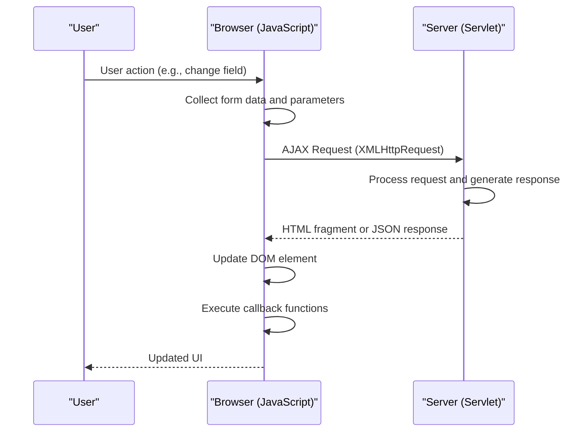
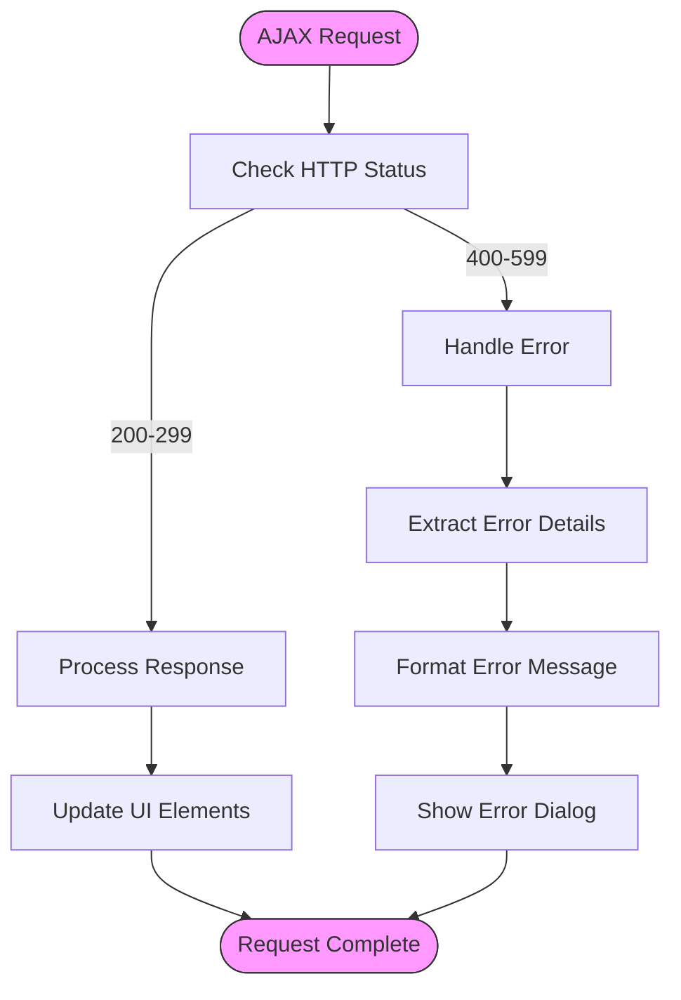

# AJAX Operations

<cite>
**Referenced Files in This Document**   
- [prototype.js](file://src/main/webapp/includes/prototype.js)
- [CommercialProposal.jsp](file://src/main/webapp/jsp/CommercialProposal.jsp)
- [util.jsp](file://src/main/webapp/includes/util.jsp)
- [ProducesCommercialProposalGrid.jsp](file://src/main/webapp/ajax/ProducesCommercialProposalGrid.jsp)
- [ClosedContractRecordsGrid.jsp](file://src/main/webapp/ajax/ClosedContractRecordsGrid.jsp)
- [layout/ajax.jsp](file://src/main/webapp/layout/ajax.jsp)
- [errors-in-dialog2.jsp](file://src/main/webapp/layout-items/errors-in-dialog2.jsp)
- [ErrorDialog.jsp](file://src/main/webapp/dialogs/ErrorDialog.jsp)
</cite>

## Table of Contents
1. [Introduction](#introduction)
2. [AJAX Implementation with Prototype.js](#ajax-implementation-with-prototypejs)
3. [Common Usage Patterns](#common-usage-patterns)
4. [Request/Response Lifecycle](#requestresponse-lifecycle)
5. [Error Handling Strategies](#error-handling-strategies)
6. [Debugging AJAX Interactions](#debugging-ajax-interactions)
7. [Best Practices](#best-practices)

## Introduction
The dcl_v3 application utilizes Prototype.js to implement AJAX operations that enable dynamic content updates without requiring full page reloads. This documentation details how AJAX functionality is implemented across JSP pages, focusing on the interaction between client-side JavaScript and backend action servlets. The system supports various asynchronous operations including form field auto-completion, validation checks, and partial grid updates, with specific examples from pages like CommercialProposal.jsp where real-time updates to cost calculations and product selections are handled.

## AJAX Implementation with Prototype.js
The dcl_v3 application leverages Prototype.js version 1.5.1_rc2 to facilitate AJAX operations throughout the web interface. Prototype.js provides a comprehensive framework for handling XMLHttpRequest objects across different browsers, abstracting the complexities of cross-browser compatibility.

The core AJAX functionality is built around Prototype.js's `Ajax.Request` and `Ajax.Updater` classes, which handle the creation and management of XMLHttpRequest objects. The framework supports both synchronous and asynchronous requests, with asynchronous being the default and preferred mode for maintaining responsive user interfaces.

Key features of the Prototype.js implementation include:
- Cross-browser XMLHttpRequest handling through `Ajax.getTransport()`
- Event-driven request lifecycle management
- Response content updating through the `Ajax.Updater` class
- Comprehensive error handling and exception management
- Request queuing and cancellation to prevent race conditions

The implementation follows a consistent pattern where AJAX requests are initiated from JSP pages and target specific action servlets that process the request and return HTML fragments or JSON data for dynamic updates.

**Section sources**
- [prototype.js](file://src/main/webapp/includes/prototype.js#L897-L1241)

## Common Usage Patterns

### Form Field Auto-completion
The application implements server-side list controls that provide auto-completion functionality for form fields. These controls use AJAX to fetch data from backend servlets and display selectable options to users. The `ctrl:serverList` tag in JSP pages creates input fields with associated buttons that trigger AJAX requests to populate dropdown lists.

For example, in the CommercialProposal.jsp page, the contractor selection field uses AJAX to retrieve contractor data from the `/ContractorsListAction` servlet, allowing users to search and select contractors without page refresh.

### Validation Checks
AJAX is used extensively for real-time validation checks, particularly when form field values change. The `onchange` attribute in form elements triggers AJAX requests that validate input against business rules on the server side.

In CommercialProposal.jsp, changing the currency or course values triggers the `submitReloadForm` function, which initiates an AJAX request to recalculate costs and validate the new values against existing data.

### Partial Grid Updates
One of the most common AJAX patterns in the application is the dynamic updating of grid components. The system uses dedicated JSP pages in the `/ajax` directory to render specific grid components that can be updated independently.

For instance, the CommercialProposal.jsp page contains conditional logic that loads different grid components based on the proposal type:
- When `cpr_assemble_minsk_store` is false, it loads `ProducesCommercialProposalGrid.jsp` via AJAX
- When `cpr_assemble_minsk_store` is true, it loads `ProducesForAssembleMinskGrid.jsp` via AJAX

These grids are updated dynamically when users make changes to related fields, ensuring that cost calculations and product selections are always current.

**Section sources**
- [CommercialProposal.jsp](file://src/main/webapp/jsp/CommercialProposal.jsp#L140-L250)
- [ProducesCommercialProposalGrid.jsp](file://src/main/webapp/ajax/ProducesCommercialProposalGrid.jsp)
- [ClosedContractRecordsGrid.jsp](file://src/main/webapp/ajax/ClosedContractRecordsGrid.jsp)

## Request/Response Lifecycle

### Request Initiation
AJAX requests in the dcl_v3 application follow a standardized lifecycle. Requests are typically initiated through JavaScript functions that call the `doAjax` function defined in `util.jsp`. This function wraps the Prototype.js `Ajax.Request` class with additional application-specific functionality.

The request lifecycle begins when a user action (such as changing a form field or clicking a button) triggers a JavaScript function. This function collects the necessary parameters, including form data and any additional context, and initiates the AJAX request.

### Request Processing
The `doAjax` function in `util.jsp` handles several important aspects of request processing:
- Generation of unique request IDs to track individual requests
- Collection of form parameters and additional request parameters
- Display of wait indicators to provide user feedback
- Prevention of duplicate requests through request ID tracking

The request is configured with appropriate headers, including:
- `X-Requested-With: XMLHttpRequest` to identify AJAX requests
- `X-Prototype-Version` to indicate the Prototype.js version
- Appropriate content type headers based on the request method

### Response Handling
When the server responds to an AJAX request, the response is processed according to the following pattern:
1. The response content is extracted from the XMLHttpRequest object
2. Scripts within the response are optionally evaluated
3. The target DOM element is updated with the new content
4. Callback functions are executed if specified

The response handling is designed to update specific portions of the page rather than reloading the entire page. This allows for efficient updates of grid components, form fields, and other dynamic elements.

The application supports both HTML fragment responses and JSON data, with the response type determined by the specific endpoint being called. HTML fragments are used for updating UI components, while JSON is used for data exchange that requires client-side processing.

**Diagram sources**
- [util.jsp](file://src/main/webapp/includes/util.jsp#L390-L589)
- [prototype.js](file://src/main/webapp/includes/prototype.js#L1153-L1201)

**Section sources**
- [util.jsp](file://src/main/webapp/includes/util.jsp#L390-L589)
- [prototype.js](file://src/main/webapp/includes/prototype.js#L1153-L1201)

## Error Handling Strategies

### Client-side Error Handling
The application implements comprehensive error handling for failed AJAX requests and network issues. The Prototype.js framework provides built-in event handlers for different stages of the request lifecycle, including `onFailure` and `onException` callbacks.

When an AJAX request fails, the application:
1. Catches the error in the `onFailure` handler
2. Extracts relevant error information (status, status text, response content)
3. Formats the error details for display
4. Shows a user-friendly error dialog

The error handling mechanism includes protection against race conditions by using request IDs to ensure that only the most recent request's response is processed. This prevents outdated responses from overwriting newer data.

### Server-side Error Propagation
The application uses a consistent pattern for propagating server-side errors back to the client. When an error occurs on the server, it is captured and formatted as structured data that can be processed by the client-side error handling code.

The error response flow follows this pattern:
1. Server-side exceptions are caught and converted to error messages
2. Error messages are added to a shared data structure
3. The `layout/ajax.jsp` page processes these errors and generates JavaScript code to display them
4. The client-side code executes the generated JavaScript to show error dialogs

This approach ensures that both technical details and user-friendly messages are available when errors occur, facilitating both user understanding and developer debugging.

### Exception Management
The application implements a robust exception management system that distinguishes between different types of errors:
- Network errors (connection failures, timeouts)
- Server errors (HTTP 5xx status codes)
- Application errors (validation failures, business rule violations)
- Client-side JavaScript exceptions

Each type of error is handled appropriately, with network and server errors typically resulting in user notifications, while application errors may trigger specific corrective actions or workflow changes.

**Diagram sources**
- [util.jsp](file://src/main/webapp/includes/util.jsp#L445-L499)
- [layout/ajax.jsp](file://src/main/webapp/layout/ajax.jsp#L33-L75)
- [errors-in-dialog2.jsp](file://src/main/webapp/layout-items/errors-in-dialog2.jsp#L39-L98)

**Section sources**
- [util.jsp](file://src/main/webapp/includes/util.jsp#L445-L499)
- [layout/ajax.jsp](file://src/main/webapp/layout/ajax.jsp#L33-L75)
- [errors-in-dialog2.jsp](file://src/main/webapp/layout-items/errors-in-dialog2.jsp#L39-L98)

## Debugging AJAX Interactions

### Browser Developer Tools
The application's AJAX interactions can be effectively debugged using standard browser developer tools. Key techniques include:

1. **Network Tab Monitoring**: The network tab shows all AJAX requests, including their URLs, parameters, headers, and response content. This is essential for verifying that requests are being sent correctly and responses are as expected.

2. **Console Logging**: The application includes debug logging that can be enabled to trace AJAX request flows. The `CERNY.Logger` class provides logging functionality that can help identify issues in the request/response cycle.

3. **Request Inspection**: Developers can inspect individual requests to verify that:
   - Correct parameters are being sent
   - Appropriate headers are included
   - Request methods (GET/POST) are correct
   - URLs point to the intended endpoints

### Request ID Tracking
The application uses a request ID system to track individual AJAX requests, which is invaluable for debugging. Each request is assigned a unique ID that is included in both the request and response, allowing developers to correlate requests with their responses, especially in cases where multiple requests may be in flight simultaneously.

### Error Dialog Analysis
When errors occur, the application displays detailed error dialogs that include:
- Error names and messages
- Stack traces (when available)
- Request and response details
- HTTP status codes and status texts

These dialogs provide comprehensive information for diagnosing issues, whether they originate from network problems, server errors, or application logic failures.

### Common Debugging Scenarios
1. **Missing Updates**: When UI elements fail to update, check that:
   - The AJAX request is being sent
   - The server is returning the expected response
   - The correct DOM element is being targeted for update
   - No JavaScript errors are preventing script execution

2. **Race Conditions**: When multiple requests interfere with each other:
   - Verify request ID tracking is working correctly
   - Check that only the most recent response is being processed
   - Ensure proper synchronization of related operations

3. **Parameter Issues**: When server-side processing fails due to incorrect data:
   - Verify form serialization is capturing all required fields
   - Check that special characters are properly encoded
   - Confirm data types match server expectations

**Section sources**
- [util.jsp](file://src/main/webapp/includes/util.jsp#L390-L589)
- [prototype.js](file://src/main/webapp/includes/prototype.js)
- [ErrorDialog.jsp](file://src/main/webapp/dialogs/ErrorDialog.jsp)

## Best Practices

### Maintain Request/Response Compatibility
To ensure compatibility between frontend AJAX operations and backend services:

1. **Consistent Data Formats**: Maintain consistent data formats for dates, numbers, and other structured data between client and server.

2. **Versioning**: When modifying AJAX endpoints, consider versioning to maintain backward compatibility with existing client code.

3. **Error Contract**: Define a consistent error response format that includes both user-friendly messages and technical details for debugging.

4. **Parameter Validation**: Implement thorough parameter validation on the server side to handle cases where client-side validation may be bypassed.

### Performance Optimization
1. **Minimize Payload Size**: Optimize AJAX responses to include only necessary data, reducing network transfer time.

2. **Request Throttling**: Implement throttling for frequently triggered operations (like auto-completion) to prevent excessive server load.

3. **Caching**: Where appropriate, implement client-side caching of frequently accessed data to reduce server requests.

4. **Batch Operations**: For operations that require multiple updates, consider implementing batch endpoints to reduce the number of round trips.

### User Experience Considerations
1. **Feedback Mechanisms**: Always provide visual feedback during AJAX operations, such as wait cursors or progress indicators.

2. **Error Recovery**: Design error handling to allow users to recover from failures without losing their work.

3. **Accessibility**: Ensure AJAX updates are accessible to users of assistive technologies by using appropriate ARIA attributes.

4. **Graceful Degradation**: Design critical functionality to work even if JavaScript or AJAX is disabled.

### Security Practices
1. **Input Validation**: Always validate and sanitize data received via AJAX requests on the server side.

2. **Authentication**: Ensure AJAX endpoints respect the same authentication and authorization rules as regular page requests.

3. **CSRF Protection**: Implement CSRF protection for AJAX requests that modify data.

4. **Rate Limiting**: Implement rate limiting to prevent abuse of AJAX endpoints.

**Section sources**
- [prototype.js](file://src/main/webapp/includes/prototype.js)
- [util.jsp](file://src/main/webapp/includes/util.jsp)
- [CommercialProposal.jsp](file://src/main/webapp/jsp/CommercialProposal.jsp)