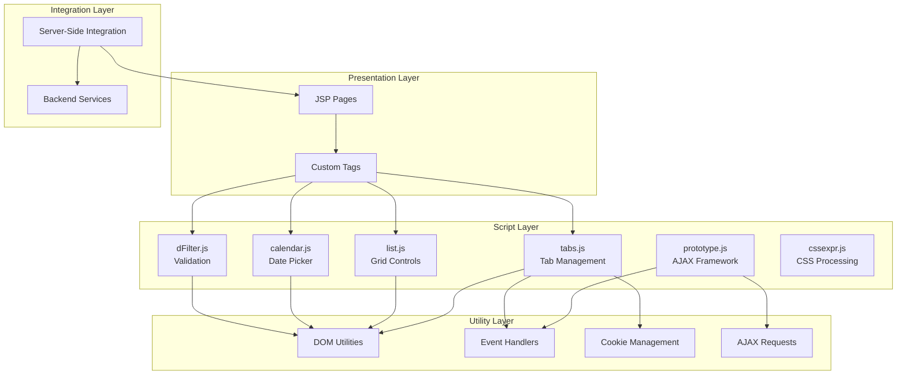
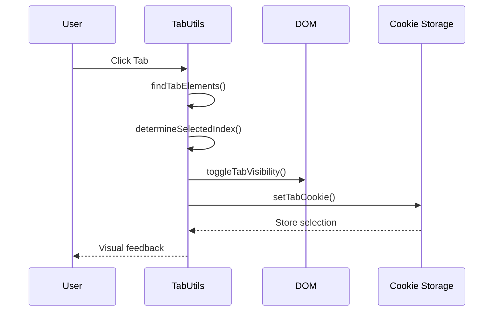
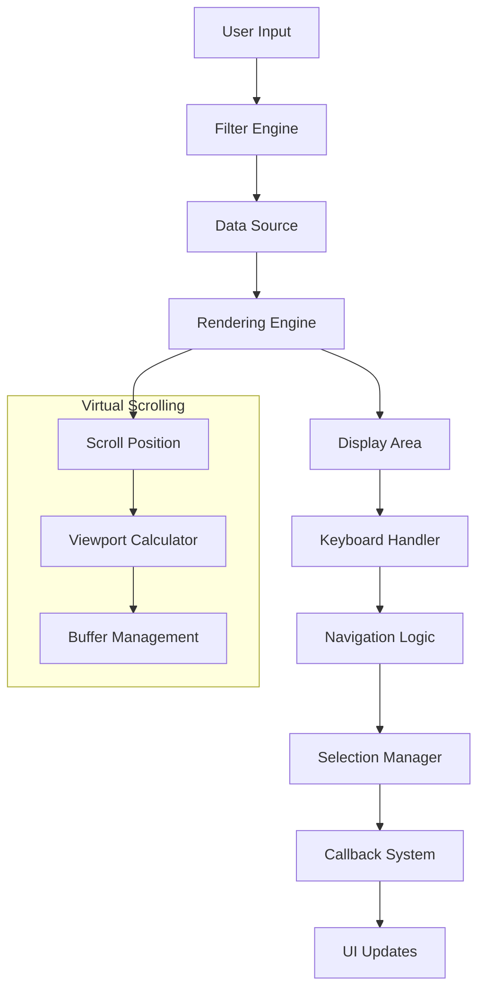
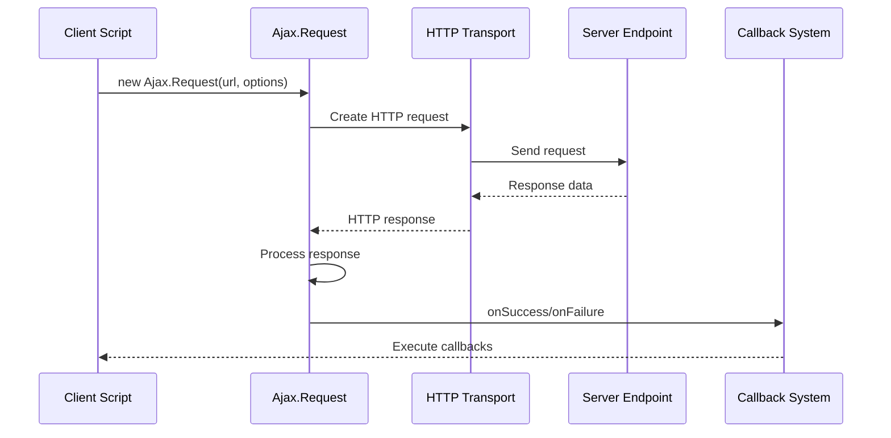
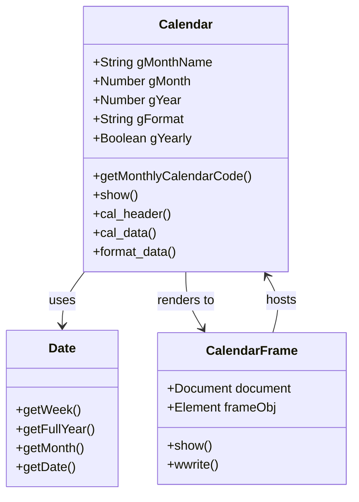
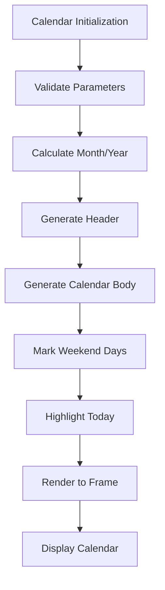
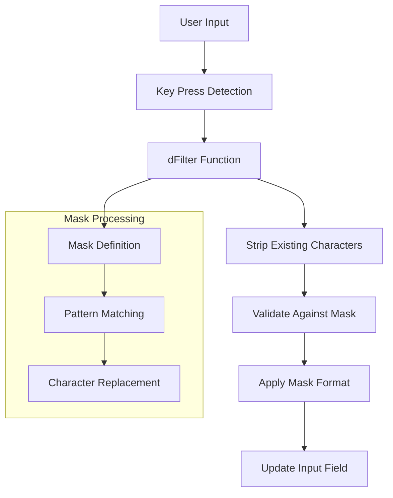
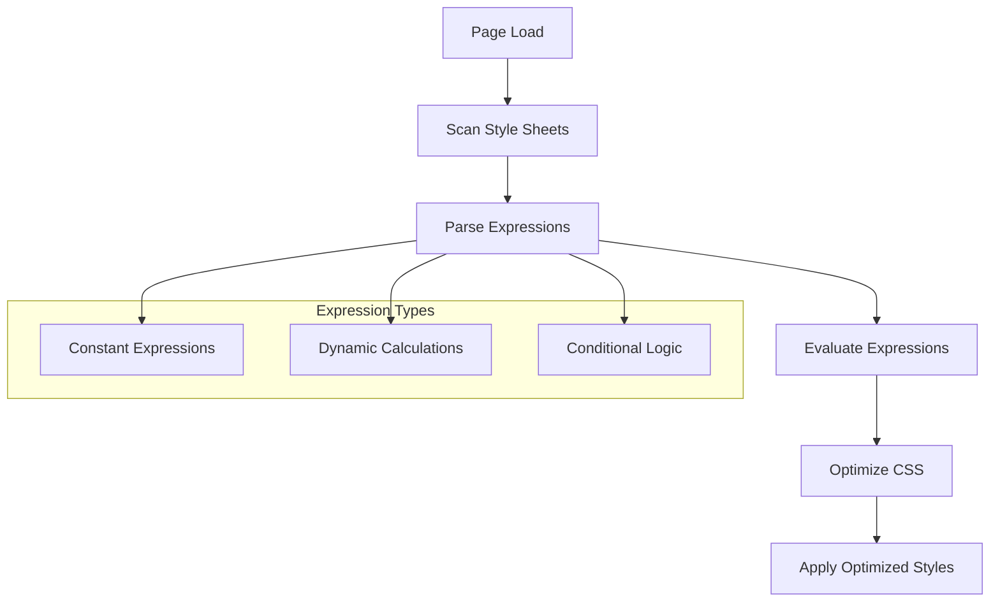
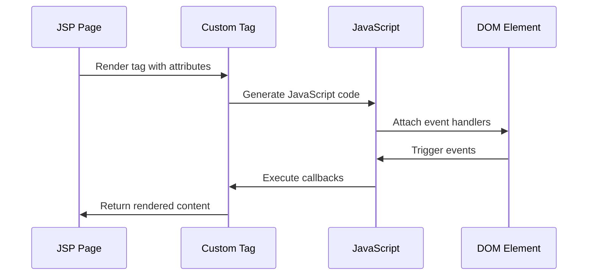

# Custom JavaScript Scripts Documentation

<cite>
**Referenced Files in This Document**
- [tabs.js](file://src/main/webapp/includes/tabs.js)
- [list.js](file://src/main/webapp/includes/list.js)
- [prototype.js](file://src/main/webapp/includes/prototype.js)
- [calendar.js](file://src/main/webapp/includes/calendar.js)
- [dFilter.js](file://src/main/webapp/includes/dFilter.js)
- [cssexpr.js](file://src/main/webapp/includes/cssexpr.js)
- [CommercialProposal.jsp](file://src/main/webapp/jsp/CommercialProposal.jsp)
- [Order.jsp](file://src/main/webapp/jsp/Order.jsp)
- [tabs.css](file://src/main/webapp/includes/tabs.css)
- [dcl.css](file://src/main/webapp/includes/dcl.css)
</cite>

## Table of Contents
1. [Introduction](#introduction)
2. [Architecture Overview](#architecture-overview)
3. [Tabs Management System](#tabs-management-system)
4. [Grid Control System](#grid-control-system)
5. [AJAX Operations Framework](#ajax-operations-framework)
6. [Date Picker Implementation](#date-picker-implementation)
7. [Input Validation System](#input-validation-system)
8. [Dynamic CSS Expression Handling](#dynamic-css-expression-handling)
9. [Integration Patterns](#integration-patterns)
10. [Performance Considerations](#performance-considerations)
11. [Browser Compatibility](#browser-compatibility)
12. [Maintenance Guidelines](#maintenance-guidelines)

## Introduction

The dcl_v3 application employs a sophisticated suite of custom JavaScript scripts that provide essential functionality for modern web interface interactions. These scripts work together to create responsive tabbed interfaces, dynamic data grids, AJAX-powered operations, intuitive date pickers, and robust input validation systems. The architecture follows a modular design pattern with clear separation of concerns, enabling maintainable and extensible client-side functionality.

The custom JavaScript ecosystem consists of six core components: tabs.js for tabbed interface management, list.js for grid controls, prototype.js for AJAX operations, calendar.js for date handling, dFilter.js for input validation, and cssexpr.js for dynamic CSS processing. Each component is designed to integrate seamlessly with JSP-based server-side rendering while providing rich client-side interactivity.

## Architecture Overview

The custom JavaScript scripts in dcl_v3 follow a layered architecture pattern that promotes modularity and reusability. The system is built around several key architectural principles:

**Diagram sources**
- [tabs.js](file://src/main/webapp/includes/tabs.js#L1-L50)
- [list.js](file://src/main/webapp/includes/list.js#L1-L30)
- [prototype.js](file://src/main/webapp/includes/prototype.js#L1-L50)
- [calendar.js](file://src/main/webapp/includes/calendar.js#L1-L50)

The architecture emphasizes loose coupling between components while maintaining strong cohesion within each module. Each script operates independently yet can communicate through standardized interfaces and event systems.

**Section sources**
- [tabs.js](file://src/main/webapp/includes/tabs.js#L1-L100)
- [list.js](file://src/main/webapp/includes/list.js#L1-L50)
- [prototype.js](file://src/main/webapp/includes/prototype.js#L1-L100)

## Tabs Management System

The tabs.js script provides comprehensive tabbed interface functionality with state persistence, keyboard navigation, and visual feedback systems. The implementation centers around the `org.ditchnet.jsp.TabUtils` namespace and utilizes a sophisticated DOM manipulation engine.

### Core Tab Management Features

The tab system provides several essential capabilities:

- **State Persistence**: Tab selections are maintained across page reloads using cookies
- **Visual Feedback**: Dynamic styling for focused and unfocused states
- **Keyboard Navigation**: Full keyboard accessibility with arrow key support
- **Event Handling**: Comprehensive event system for tab interactions
- **Multiple Skins**: Support for different visual themes and layouts

### Tab State Management

The tab system maintains state through a combination of DOM manipulation and cookie storage:

**Diagram sources**
- [tabs.js](file://src/main/webapp/includes/tabs.js#L521-L545)

### Tab Container Structure

The tab system expects a specific HTML structure for optimal functionality:

| Element | Class Name | Purpose |
|---------|------------|---------|
| Container | `ditch-tab-container` | Main tab container wrapper |
| Tab Wrap | `ditch-tab-wrap` | Contains individual tab elements |
| Individual Tab | `ditch-tab` | Single tab button |
| Tab Pane Wrap | `ditch-tab-pane-wrap` | Contains all tab panes |
| Tab Pane | `ditch-tab-pane` | Content area for each tab |

### Keyboard Navigation Implementation

The system supports comprehensive keyboard navigation with the following key bindings:

- **Arrow Keys**: Navigate between tabs (up/down arrows)
- **Enter/Space**: Activate selected tab
- **Escape**: Close tab panel
- **Tab**: Move focus between interactive elements

**Section sources**
- [tabs.js](file://src/main/webapp/includes/tabs.js#L400-L600)
- [tabs.css](file://src/main/webapp/includes/tabs.css#L1-L170)

## Grid Control System

The list.js script implements a sophisticated grid control system designed for efficient data display and interaction in JSP pages. The system provides virtual scrolling, keyboard navigation, and dynamic filtering capabilities.

### Grid Architecture and Components

The grid control system operates through several interconnected components:

**Diagram sources**
- [list.js](file://src/main/webapp/includes/list.js#L1-L100)

### Virtual Scrolling Implementation

The grid system implements virtual scrolling to handle large datasets efficiently:

- **Dynamic Height Calculation**: Automatically adjusts scroll area based on content
- **Viewport Management**: Renders only visible items to improve performance
- **Memory Optimization**: Maintains minimal DOM footprint for large lists

### Keyboard Navigation Features

The grid provides comprehensive keyboard navigation:

| Key Combination | Action | Description |
|----------------|--------|-------------|
| Arrow Down | Next Row | Move selection to next row |
| Arrow Up | Previous Row | Move selection to previous row |
| Enter | Select | Activate selected item |
| Escape | Cancel | Close grid and restore original value |
| Tab | Focus | Move focus to next interactive element |

### Filtering and Search Capabilities

The system supports real-time filtering with the following features:

- **Live Filtering**: Filters data as user types
- **Case Insensitive**: Ignores case during search
- **Partial Matches**: Supports partial string matching
- **Reset Capability**: Clear filters and restore original dataset

**Section sources**
- [list.js](file://src/main/webapp/includes/list.js#L1-L230)

## AJAX Operations Framework

The prototype.js script serves as the foundation for AJAX operations throughout the dcl_v3 application. Built on the Prototype JavaScript framework version 1.5.1_rc2, it provides a comprehensive AJAX infrastructure with advanced features for asynchronous communication.

### AJAX Request Architecture

The AJAX framework implements a sophisticated request/response cycle:

**Diagram sources**
- [prototype.js](file://src/main/webapp/includes/prototype.js#L1153-L1201)

### Advanced AJAX Features

The framework provides several advanced capabilities:

- **Request Queuing**: Manages multiple concurrent requests
- **Error Handling**: Comprehensive error detection and reporting
- **Timeout Management**: Configurable timeout handling
- **Progress Indicators**: Built-in loading state management
- **Response Processing**: Automatic script extraction and evaluation

### Request/Response Processing

The AJAX system handles various data formats and processing scenarios:

| Feature | Description | Implementation |
|---------|-------------|----------------|
| JSON Parsing | Automatic JSON response handling | Built-in JSON parser |
| Script Execution | Dynamic script injection | evalScripts method |
| Error Recovery | Graceful failure handling | onFailure callbacks |
| Caching | Request caching mechanisms | Custom caching logic |
| Compression | Response compression support | HTTP compression |

### Integration with JSP Forms

The AJAX framework integrates seamlessly with JSP form submissions:

- **Form Serialization**: Automatic form data encoding
- **Parameter Handling**: URL-encoded parameter management
- **File Uploads**: Support for multipart form submissions
- **Validation**: Client-side validation integration

**Section sources**
- [prototype.js](file://src/main/webapp/includes/prototype.js#L1-L800)

## Date Picker Implementation

The calendar.js script provides a comprehensive date picker solution with extensive customization options and internationalization support. The implementation offers both modal and inline date selection modes.

### Calendar Architecture

The date picker system follows a modular architecture:

**Diagram sources**
- [calendar.js](file://src/main/webapp/includes/calendar.js#L38-L92)

### Date Format Support

The calendar supports numerous date formats:

| Format Pattern | Example Output | Description |
|---------------|----------------|-------------|
| `MM/DD/YYYY` | 12/25/2024 | US format with slashes |
| `DD-MM-YYYY` | 25-12-2024 | European format with dashes |
| `DD/MM/YYYY` | 25/12/2024 | International format |
| `DD.MM.YYYY` | 25.12.2024 | ISO format with dots |
| `DD MONTH YYYY` | 25 DECEMBER 2024 | Long month name format |

### Calendar Rendering Process

The calendar rendering follows a structured process:

**Diagram sources**
- [calendar.js](file://src/main/webapp/includes/calendar.js#L150-L250)

### Advanced Features

The date picker includes several advanced features:

- **Week Number Display**: Shows ISO week numbers
- **Leap Year Detection**: Automatic leap year calculation
- **Internationalization**: Support for multiple languages
- **Range Selection**: Start/end date range selection
- **Custom Formatting**: Extensible date formatting options

**Section sources**
- [calendar.js](file://src/main/webapp/includes/calendar.js#L1-L630)

## Input Validation System

The dFilter.js script implements a sophisticated input validation system specifically designed for numerical and masked input fields. The system provides real-time validation with customizable masking patterns.

### Validation Architecture

The validation system operates through a pattern-based approach:

**Diagram sources**
- [dFilter.js](file://src/main/webapp/includes/dFilter.js#L25-L70)

### Mask Pattern System

The validation system supports flexible mask patterns:

| Pattern Character | Meaning | Example |
|------------------|---------|---------|
| `#` | Numeric placeholder | `###-##-##` |
| `A` | Alphabetic placeholder | `AAA-999` |
| `-` | Literal separator | Fixed hyphen |
| `/` | Alternative separator | Choice between options |

### Real-Time Validation Features

The system provides immediate feedback during input:

- **Character Filtering**: Allows only valid characters
- **Position Tracking**: Maintains cursor position
- **Backspace Handling**: Proper deletion behavior
- **Paste Protection**: Validates pasted content
- **Auto-formatting**: Applies mask formatting automatically

### Integration with Form Elements

The validation system integrates with various form elements:

- **Text Inputs**: Standard text field validation
- **Number Fields**: Numeric-only input restriction
- **Custom Masks**: User-defined input patterns
- **Callback System**: Custom validation logic integration

**Section sources**
- [dFilter.js](file://src/main/webapp/includes/dFilter.js#L1-L95)

## Dynamic CSS Expression Handling

The cssexpr.js script provides runtime CSS expression evaluation for Internet Explorer compatibility. The system optimizes CSS performance by evaluating dynamic expressions at load time rather than runtime.

### CSS Expression Processing

The CSS expression system operates through a multi-stage processing pipeline:

**Diagram sources**
- [cssexpr.js](file://src/main/webapp/includes/cssexpr.js#L1-L50)

### Expression Evaluation System

The system evaluates CSS expressions through several methods:

- **Constant Expressions**: Pre-calculated constant values
- **Runtime Calculations**: Dynamic value computation
- **Conditional Logic**: Branch-based expression evaluation
- **Recursive Processing**: Nested expression handling

### Performance Optimization

The CSS expression system includes several performance optimizations:

| Optimization | Description | Benefit |
|-------------|-------------|---------|
| Pre-compilation | Evaluate expressions at load time | Reduced runtime overhead |
| Caching | Cache evaluated results | Faster subsequent access |
| Cleanup | Remove processed expressions | Prevent memory leaks |
| Browser Detection | Target specific optimizations | IE-specific fixes |

### Integration with Modern Browsers

The system gracefully degrades in modern browsers:

- **Feature Detection**: Detects CSS expression support
- **Fallback Mechanisms**: Alternative styling approaches
- **Performance Monitoring**: Track optimization effectiveness
- **Compatibility Mode**: Maintain legacy support when needed

**Section sources**
- [cssexpr.js](file://src/main/webapp/includes/cssexpr.js#L1-L89)

## Integration Patterns

The custom JavaScript scripts in dcl_v3 demonstrate sophisticated integration patterns that enable seamless interaction between client-side functionality and server-side JSP rendering.

### JSP Tag Integration

The scripts integrate with custom JSP tags to provide declarative functionality:

**Diagram sources**
- [CommercialProposal.jsp](file://src/main/webapp/jsp/CommercialProposal.jsp#L1-L100)
- [Order.jsp](file://src/main/webapp/jsp/Order.jsp#L1-L100)

### Server-Response Handling

The system handles server responses through standardized patterns:

- **JSON Data Exchange**: Structured data transfer
- **HTML Fragments**: Partial page updates
- **Error Responses**: Consistent error handling
- **Status Codes**: HTTP status interpretation

### Event-Driven Architecture

The integration follows an event-driven pattern:

| Event Type | Trigger | Handler | Response |
|-----------|---------|---------|----------|
| Tab Click | User interaction | TabUtils.switchTab | Pane visibility change |
| Grid Selection | Item selection | Callback function | Data binding |
| Date Selection | Calendar interaction | AfterSelect callback | Form field update |
| Filter Change | Input change | Filter function | Data refresh |

**Section sources**
- [CommercialProposal.jsp](file://src/main/webapp/jsp/CommercialProposal.jsp#L1-L200)
- [Order.jsp](file://src/main/webapp/jsp/Order.jsp#L1-L200)

## Performance Considerations

The custom JavaScript scripts in dcl_v3 address several performance optimization challenges inherent in legacy JavaScript patterns and complex web applications.

### Script Loading Strategies

The application employs multiple strategies for optimal script loading:

- **Parallel Loading**: Multiple small scripts loaded concurrently
- **Lazy Loading**: Scripts loaded on-demand
- **Caching Optimization**: Intelligent caching mechanisms
- **Compression**: Minification and gzip compression

### Memory Management

The system implements comprehensive memory management:

- **Garbage Collection**: Proper cleanup of unused objects
- **Event Listener Management**: Removal of obsolete listeners
- **DOM Reference Cleanup**: Prevention of memory leaks
- **Resource Pooling**: Efficient resource utilization

### Performance Monitoring

The scripts include built-in performance monitoring:

| Metric | Measurement | Optimization |
|--------|-------------|--------------|
| Load Time | Script initialization | Lazy loading |
| Memory Usage | Object allocation | Garbage collection |
| CPU Usage | Event processing | Debouncing |
| Network Requests | AJAX calls | Request batching |

### Legacy Compatibility Impact

The performance considerations address legacy browser compatibility:

- **IE6-7 Support**: Optimized for older browsers
- **Slow Connection Handling**: Graceful degradation
- **Mobile Device Optimization**: Touch-friendly interactions
- **Accessibility Features**: Screen reader compatibility

## Browser Compatibility

The custom JavaScript scripts maintain broad browser compatibility while leveraging modern web standards where available.

### Supported Browsers

The system supports a wide range of browsers:

| Browser Family | Minimum Version | Features |
|---------------|----------------|----------|
| Internet Explorer | 6.0+ | Full compatibility mode |
| Firefox | 2.0+ | Native JavaScript support |
| Chrome | 4.0+ | Modern API access |
| Safari | 3.0+ | WebKit optimizations |
| Opera | 9.0+ | Standards compliance |

### Compatibility Patterns

The scripts employ several compatibility patterns:

- **Feature Detection**: Runtime capability testing
- **Polyfill Implementation**: Missing feature emulation
- **Graceful Degradation**: Progressive enhancement
- **Cross-Browser APIs**: Unified interface abstraction

### Legacy JavaScript Challenges

The system addresses common legacy JavaScript issues:

- **Event Model Differences**: Unified event handling
- **DOM Manipulation Variations**: Cross-browser DOM access
- **CSS Compatibility**: Vendor prefix handling
- **AJAX Implementation**: XMLHttpRequest standardization

## Maintenance Guidelines

Maintaining the custom JavaScript scripts requires adherence to established patterns and best practices to ensure long-term reliability and extensibility.

### Code Organization Principles

The scripts follow strict organizational principles:

- **Namespace Management**: Hierarchical namespace structure
- **Module Separation**: Clear separation of concerns
- **Dependency Management**: Explicit dependency declarations
- **Documentation Standards**: Comprehensive inline documentation

### Extension Patterns

The system supports extension through several patterns:

- **Plugin Architecture**: Modular plugin system
- **Hook System**: Event hook registration
- **Configuration Objects**: Flexible configuration management
- **Factory Methods**: Object creation patterns

### Testing Strategies

Comprehensive testing ensures script reliability:

- **Unit Testing**: Individual component testing
- **Integration Testing**: Cross-component validation
- **Browser Testing**: Multi-browser compatibility verification
- **Performance Testing**: Load and stress testing

### Future Enhancement Roadmap

The system is designed for future enhancements:

- **ES6+ Migration**: Gradual modernization path
- **Module System Adoption**: ES modules integration
- **Build Tool Integration**: Automated build processes
- **Testing Framework**: Comprehensive automated testing

**Section sources**
- [tabs.js](file://src/main/webapp/includes/tabs.js#L1-L1294)
- [list.js](file://src/main/webapp/includes/list.js#L1-L230)
- [prototype.js](file://src/main/webapp/includes/prototype.js#L1-L3217)
- [calendar.js](file://src/main/webapp/includes/calendar.js#L1-L630)
- [dFilter.js](file://src/main/webapp/includes/dFilter.js#L1-L95)
- [cssexpr.js](file://src/main/webapp/includes/cssexpr.js#L1-L89)