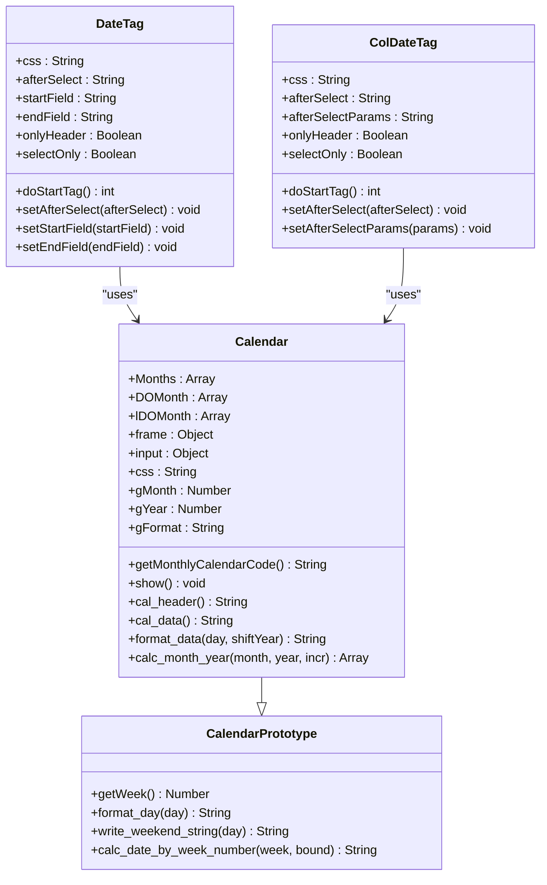
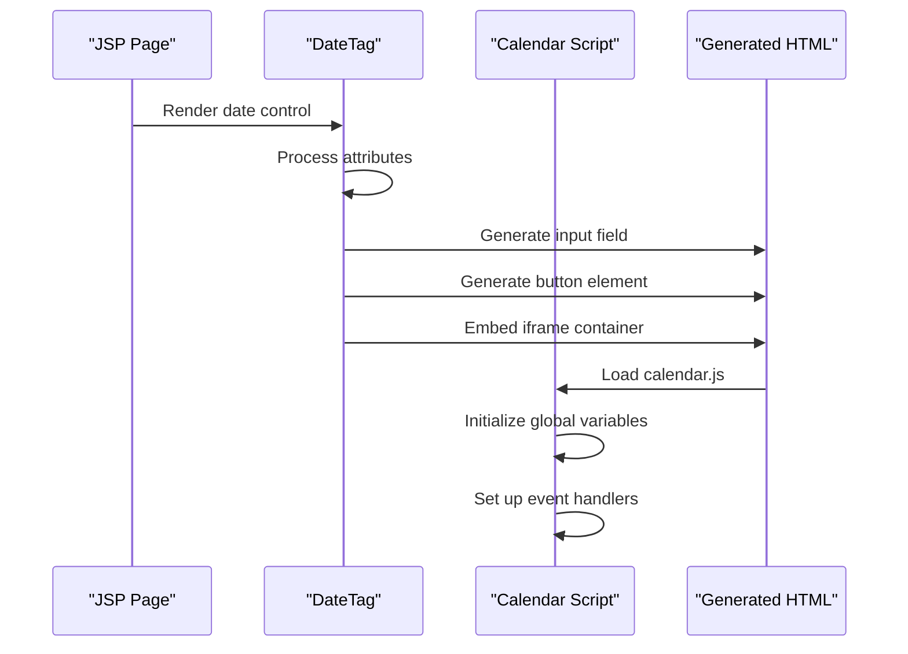
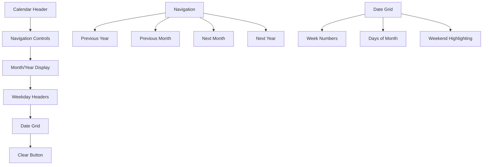
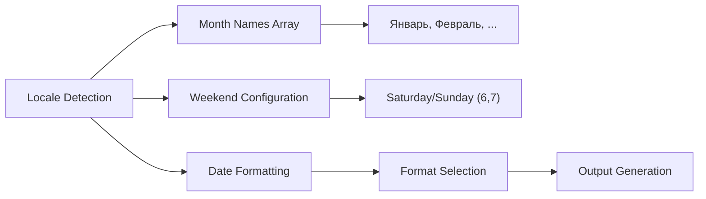
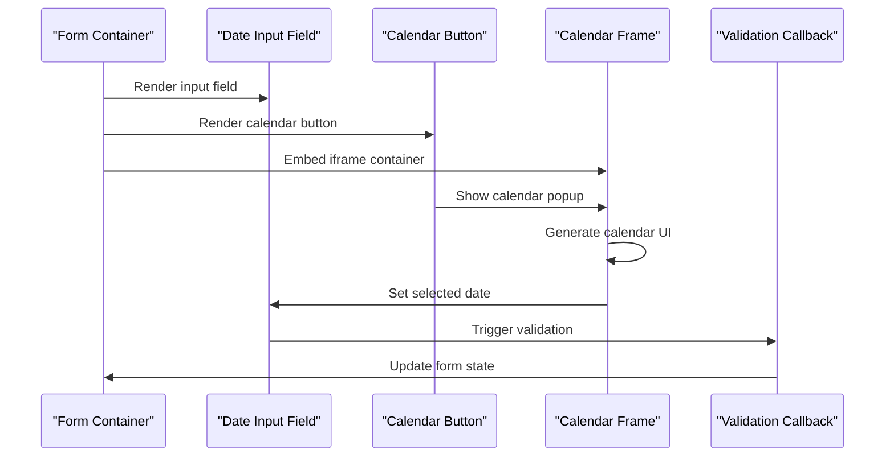
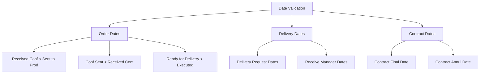
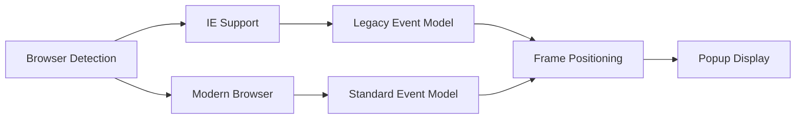

# Date Handling

<cite>
**Referenced Files in This Document**
- [calendar.js](file://src/main/webapp/includes/calendar.js)
- [DateTag.java](file://src/main/java/net/sam/dcl/taglib/DateTag.java)
- [ColDateTag.java](file://src/main/java/net/sam/dcl/taglib/table/colctrl/ColDateTag.java)
- [Contract.jsp](file://src/main/webapp/jsp/Contract.jsp)
- [DeliveryRequest.jsp](file://src/main/webapp/jsp/DeliveryRequest.jsp)
- [dcl.css](file://src/main/webapp/includes/dcl.css)
- [OrderAction.java](file://src/main/java/net/sam/dcl/action/OrderAction.java)
</cite>

## Table of Contents
1. [Introduction](#introduction)
2. [Calendar Architecture](#calendar-architecture)
3. [Initialization Process](#initialization-process)
4. [Date Selection Interface](#date-selection-interface)
5. [Formatting Rules](#formatting-rules)
6. [Integration with Forms](#integration-with-forms)
7. [Validation Constraints](#validation-constraints)
8. [JavaScript API](#javascript-api)
9. [Browser Compatibility](#browser-compatibility)
10. [Customization and Extension](#customization-and-extension)
11. [Troubleshooting](#troubleshooting)

## Introduction

The DCL application implements a comprehensive date handling system centered around the `calendar.js` script, which provides sophisticated date picker functionality across various forms including Contract.jsp and DeliveryRequest.jsp. This system offers localized date selection, flexible formatting options, and seamless integration with both standard forms and grid controls.

The calendar functionality is built around a custom JavaScript calendar engine that generates interactive date pickers with support for multiple date formats, locale-specific month names, and customizable styling. The system integrates deeply with the Java-based tag libraries to provide server-side rendering capabilities while maintaining client-side interactivity.

## Calendar Architecture

The calendar system follows a modular architecture combining JavaScript components with Java tag libraries:

**Diagram sources**
- [calendar.js](file://src/main/webapp/includes/calendar.js#L38-L92)
- [DateTag.java](file://src/main/java/net/sam/dcl/taglib/DateTag.java#L70-L120)
- [ColDateTag.java](file://src/main/java/net/sam/dcl/taglib/table/colctrl/ColDateTag.java#L70-L120)

**Section sources**
- [calendar.js](file://src/main/webapp/includes/calendar.js#L1-L92)
- [DateTag.java](file://src/main/java/net/sam/dcl/taglib/DateTag.java#L70-L120)

## Initialization Process

The calendar initialization follows a two-phase process involving both server-side tag rendering and client-side JavaScript activation:

### Server-Side Initialization

The Java tag libraries handle the initial HTML generation:

**Diagram sources**
- [DateTag.java](file://src/main/java/net/sam/dcl/taglib/DateTag.java#L149-L213)
- [calendar.js](file://src/main/webapp/includes/calendar.js#L503-L582)

### Client-Side Activation

The JavaScript initialization process sets up the calendar environment:

1. **Global Variable Setup**: Initializes calendar constants and arrays
2. **Frame Creation**: Creates hidden iframe for calendar display
3. **Event Binding**: Sets up click handlers for document and calendar elements
4. **Position Calculation**: Determines optimal placement for calendar popup

**Section sources**
- [calendar.js](file://src/main/webapp/includes/calendar.js#L503-L582)
- [DateTag.java](file://src/main/java/net/sam/dcl/taglib/DateTag.java#L149-L213)

## Date Selection Interface

The calendar interface provides intuitive date selection through a monthly view with navigation controls:

### Calendar Layout Structure

**Diagram sources**
- [calendar.js](file://src/main/webapp/includes/calendar.js#L140-L181)
- [calendar.js](file://src/main/webapp/includes/calendar.js#L240-L290)

### Interactive Features

The calendar provides several interactive elements:

- **Month Navigation**: Previous/next month/year navigation
- **Date Selection**: Clickable day cells with formatting
- **Week Number Display**: Optional week number column
- **Clear Functionality**: Reset input field to empty
- **Week View**: Select entire week with single click

**Section sources**
- [calendar.js](file://src/main/webapp/includes/calendar.js#L140-L181)
- [calendar.js](file://src/main/webapp/includes/calendar.js#L240-L371)

## Formatting Rules

The calendar supports extensive date formatting options with locale-aware month names:

### Supported Formats

| Format Pattern | Example Output | Description |
|----------------|----------------|-------------|
| `MM/DD/YYYY` | 07/15/2024 | US format with leading zeros |
| `MM-DD-YY` | 07-15-24 | Short US format |
| `DD/MON/YYYY` | 15.JUL.2024 | Month abbreviation format |
| `DD/MONTH/YYYY` | 15.JULY.2024 | Full month name format |
| `DD.MM.YYYY` | 15.07.2024 | European format |
| `MMMM YYYY` | JULY 2024 | Year-only header format |

### Locale-Specific Implementation

The calendar handles Russian month names and weekend detection:

**Diagram sources**
- [calendar.js](file://src/main/webapp/includes/calendar.js#L25-L35)
- [calendar.js](file://src/main/webapp/includes/calendar.js#L364-L466)

**Section sources**
- [calendar.js](file://src/main/webapp/includes/calendar.js#L364-L466)

## Integration with Forms

The calendar integrates seamlessly with both standard forms and grid controls through specialized tag libraries:

### Standard Form Integration

For Contract.jsp and DeliveryRequest.jsp forms, the calendar appears as part of the form layout:

**Diagram sources**
- [Contract.jsp](file://src/main/webapp/jsp/Contract.jsp#L45-L55)
- [DeliveryRequest.jsp](file://src/main/webapp/jsp/DeliveryRequest.jsp#L55-L65)

### Grid Control Integration

For grid-based date inputs, the calendar provides inline editing capabilities:

**Section sources**
- [Contract.jsp](file://src/main/webapp/jsp/Contract.jsp#L45-L55)
- [DeliveryRequest.jsp](file://src/main/webapp/jsp/DeliveryRequest.jsp#L55-L65)
- [ColDateTag.java](file://src/main/java/net/sam/dcl/taglib/table/colctrl/ColDateTag.java#L136-L164)

## Validation Constraints

The system implements comprehensive validation rules to ensure logical date relationships:

### Business Logic Validation

The application enforces specific date ordering constraints:

**Diagram sources**
- [OrderAction.java](file://src/main/java/net/sam/dcl/action/OrderAction.java#L659-L695)

### Client-Side Validation Integration

The calendar supports custom validation callbacks that integrate with form submission:

**Section sources**
- [OrderAction.java](file://src/main/java/net/sam/dcl/action/OrderAction.java#L659-L695)

## JavaScript API

The calendar provides a comprehensive JavaScript API for configuration and customization:

### Core Functions

| Function | Parameters | Description |
|----------|------------|-------------|
| `__showCalendar()` | id, input, btnStr, css, callback, startField, endField, onlyHeader, params | Initialize and display calendar |
| `__selectDate()` | vDay | Handle single date selection |
| `__selectMonth()` | vDay1, vDay2 | Handle date range selection |
| `Build()` | p_month, p_year, p_format | Create calendar instance |
| `ShowMonth()` | obj | Position calendar popup |

### Configuration Options

The calendar supports extensive configuration through tag attributes:

- **CSS Styling**: Custom stylesheet integration
- **Date Range**: Minimum/maximum selectable dates
- **Format Patterns**: Multiple output formats
- **Event Handlers**: Custom callback functions
- **Read-Only Mode**: Disable editing capabilities

**Section sources**
- [calendar.js](file://src/main/webapp/includes/calendar.js#L503-L628)
- [DateTag.java](file://src/main/java/net/sam/dcl/taglib/DateTag.java#L214-L339)

## Browser Compatibility

The calendar system maintains compatibility across different browsers through careful implementation:

### Cross-Browser Considerations

- **Internet Explorer Support**: Legacy IE compatibility maintained
- **Modern Browsers**: Full support for contemporary standards
- **Frame-Based Architecture**: Uses iframe for popup isolation
- **Event Handling**: Cross-browser event model compliance

### Rendering Differences

The calendar adapts its presentation based on browser capabilities:

**Diagram sources**
- [calendar.js](file://src/main/webapp/includes/calendar.js#L25-L35)

**Section sources**
- [calendar.js](file://src/main/webapp/includes/calendar.js#L25-L35)

## Customization and Extension

The calendar system provides multiple extension points for customization:

### Styling Customization

CSS classes enable visual customization:

| Class | Purpose | Customizable Properties |
|-------|---------|------------------------|
| `.calendar-header` | Header styling | Background, text color, font |
| `.calendar-days` | Weekday headers | Background, alignment |
| `.calendar-day` | Regular days | Background, hover effects |
| `.calendar-weekend` | Weekend highlighting | Background, text color |
| `.frame-calendar` | Popup frame | Border, positioning |

### Advanced Customization

The calendar supports advanced customization through:

- **Custom Date Formats**: Extensible format definition
- **Event Callbacks**: Custom validation and processing
- **Range Selection**: Start/end date pair selection
- **Read-Only Mode**: Disabled state management

**Section sources**
- [dcl.css](file://src/main/webapp/includes/dcl.css#L490-L554)
- [calendar.js](file://src/main/webapp/includes/calendar.js#L364-L466)

## Troubleshooting

Common issues and solutions for the calendar system:

### Date Format Issues

**Problem**: Inconsistent date formats between client and server
**Solution**: Ensure consistent format configuration across both environments

**Problem**: Timezone-related date discrepancies
**Solution**: Implement server-side timezone conversion using `StringUtil` utilities

### Integration Problems

**Problem**: Calendar not displaying properly in grids
**Solution**: Verify iframe embedding and CSS positioning

**Problem**: Validation callbacks not triggering
**Solution**: Check callback function registration and parameter passing

### Browser-Specific Issues

**Problem**: Calendar positioning incorrect in IE
**Solution**: Review frame positioning calculations and fallback mechanisms

**Problem**: Event handler conflicts
**Solution**: Ensure proper event delegation and cleanup

**Section sources**
- [calendar.js](file://src/main/webapp/includes/calendar.js#L503-L582)
- [StringUtil.java](file://src/main/java/net/sam/dcl/util/StringUtil.java#L406-L455)