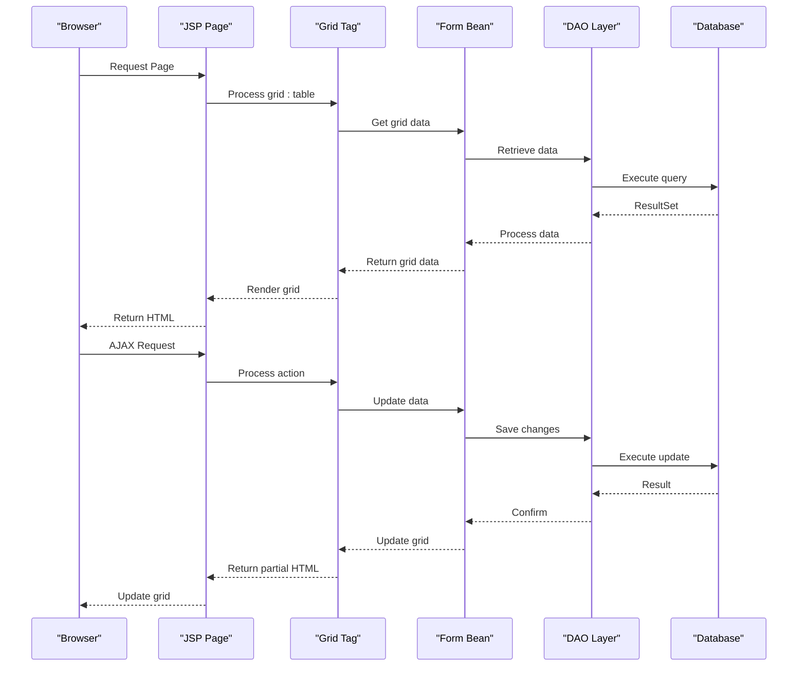

# Grid Controls

<cite>
**Referenced Files in This Document**   
- [list.js](file://src/main/webapp/includes/list.js)
- [ShippingsGrid.jsp](file://src/main/webapp/ajax/ShippingsGrid.jsp)
- [TableTag.java](file://src/main/java/net/sam/dcl/taglib/table/TableTag.java)
- [ColServerListTag.java](file://src/main/java/net/sam/dcl/taglib/table/colctrl/ColServerListTag.java)
- [PageableHolderImplUsingList.java](file://src/main/java/net/sam/dcl/taglib/table/model/impl/PageableHolderImplUsingList.java)
- [HolderImplUsingList.java](file://src/main/java/net/sam/dcl/taglib/table/model/impl/HolderImplUsingList.java)
- [DAOUtils.java](file://src/main/java/net/sam/dcl/util/DAOUtils.java)
- [dcl.css](file://src/main/webapp/includes/dcl.css)
- [util.jsp](file://src/main/webapp/includes/util.jsp)
</cite>

## Table of Contents
1. [Introduction](#introduction)
2. [Grid System Architecture](#grid-system-architecture)
3. [Core Components](#core-components)
4. [Data Binding and Server Integration](#data-binding-and-server-integration)
5. [User Interaction and Navigation](#user-interaction-and-navigation)
6. [Grid Configuration and Customization](#grid-configuration-and-customization)
7. [Performance Considerations](#performance-considerations)
8. [Accessibility Features](#accessibility-features)
9. [Troubleshooting Guide](#troubleshooting-guide)
10. [Conclusion](#conclusion)

## Introduction
The grid control system in the DCL application provides a comprehensive solution for displaying and interacting with tabular data across various JSP pages. Implemented primarily through the list.js JavaScript file and integrated with custom JSP tags, this system enables rich data grid functionality for pages such as ShippingsGrid.jsp and OrdersGrid.jsp. The grid system combines client-side interactivity with server-side data processing to deliver a responsive user experience for managing complex datasets in enterprise applications.

## Grid System Architecture

```mermaid
graph TD
subgraph "Client-Side"
A[list.js] --> B[Keyboard Navigation]
A --> C[Row Selection]
A --> D[Filtering]
A --> E[Positioning]
end
subgraph "Server-Side"
F[TableTag.java] --> G[Grid Rendering]
F --> H[Data Binding]
I[ColServerListTag.java] --> J[Column Controls]
K[DAOUtils.java] --> L[Data Retrieval]
end
subgraph "Data Layer"
M[Form Beans] --> N[Grid Data]
O[Database] --> P[ResultSet]
end
A < --> F
F < --> M
K < --> I
L < --> P
M < --> N
style A fill:#f9f,stroke:#333
style F fill:#f9f,stroke:#333
style K fill:#f9f,stroke:#333
style L fill:#f9f,stroke:#333
```

**Diagram sources**
- [list.js](file://src/main/webapp/includes/list.js)
- [TableTag.java](file://src/main/java/net/sam/dcl/taglib/table/TableTag.java)
- [ColServerListTag.java](file://src/main/java/net/sam/dcl/taglib/table/colctrl/ColServerListTag.java)
- [DAOUtils.java](file://src/main/java/net/sam/dcl/util/DAOUtils.java)

**Section sources**
- [list.js](file://src/main/webapp/includes/list.js)
- [TableTag.java](file://src/main/java/net/sam/dcl/taglib/table/TableTag.java)

## Core Components

The grid control system consists of several key components that work together to provide comprehensive data grid functionality. The client-side JavaScript in list.js handles user interactions such as keyboard navigation, row selection, and filtering. This is complemented by server-side JSP custom tags that manage grid rendering and data binding. The architecture follows a clear separation between presentation logic and data access, with form beans serving as the bridge between the two layers.

The system utilizes a tag-based approach for grid definition, allowing developers to declaratively specify grid structure, columns, and behavior in JSP files. This approach simplifies grid implementation while maintaining flexibility for customization. The grid supports various column types including checkboxes, custom fields, server lists, and input fields, each with specific rendering and interaction behaviors.

**Section sources**
- [list.js](file://src/main/webapp/includes/list.js)
- [TableTag.java](file://src/main/java/net/sam/dcl/taglib/table/TableTag.java)
- [ColServerListTag.java](file://src/main/java/net/sam/dcl/taglib/table/colctrl/ColServerListTag.java)

## Data Binding and Server Integration



**Diagram sources**
- [ShippingsGrid.jsp](file://src/main/webapp/ajax/ShippingsGrid.jsp)
- [TableTag.java](file://src/main/java/net/sam/dcl/taglib/table/TableTag.java)
- [DAOUtils.java](file://src/main/java/net/sam/dcl/util/DAOUtils.java)

**Section sources**
- [ShippingsGrid.jsp](file://src/main/webapp/ajax/ShippingsGrid.jsp)
- [TableTag.java](file://src/main/java/net/sam/dcl/taglib/table/TableTag.java)
- [DAOUtils.java](file://src/main/java/net/sam/dcl/util/DAOUtils.java)

The grid system integrates with backend services through a combination of page-level data binding and AJAX calls to action servlets. When a JSP page containing a grid is requested, the server-side tag library retrieves data from form beans, which in turn obtain data from the database through DAO layers. The data is processed and formatted before being rendered as HTML table elements.

For dynamic updates, the system uses AJAX calls to communicate with action servlets without requiring full page reloads. This is particularly evident in components like the shipping managers grid in ShippingsGrid.jsp, which uses the doAjax function to update specific grid cells with data from server-side actions. The integration between list.js and server-side form beans follows a pattern where the JavaScript handles user interface interactions while the form beans maintain the underlying data state.

## User Interaction and Navigation

```mermaid
flowchart TD
Start([User Interaction]) --> KeyPress["Key Press Event"]
KeyPress --> KeyCheck{"Key Code?"}
KeyCheck --> |27 (Escape)| HideList["Hide Dropdown List"]
KeyCheck --> |38/40 (Arrow Keys)| Navigate["Navigate Rows"]
KeyCheck --> |13 (Enter)| SelectRow["Select Row"]
KeyCheck --> |40 (Down) + No List| OpenList["Open Dropdown"]
Navigate --> CurrentRow["Get Current Row"]
CurrentRow --> UpdateRow["Update Row Style"]
UpdateRow --> Scroll["Scroll to Row"]
Scroll --> End([Complete])
SelectRow --> RowExists["Row Exists?"]
RowExists --> |Yes| ExecuteClick["Execute Row Click"]
RowExists --> |No| End
OpenList --> ButtonExists["Button Exists?"]
ButtonExists --> |Yes| ClickButton["Simulate Button Click"]
ClickButton --> End
HideList --> Cleanup["Cleanup List Object"]
Cleanup --> End
style Start fill:#f9f,stroke:#333
style End fill:#f9f,stroke:#333
```

**Diagram sources**
- [list.js](file://src/main/webapp/includes/list.js)

**Section sources**
- [list.js](file://src/main/webapp/includes/list.js)

The list.js file implements comprehensive keyboard navigation and row selection functionality for grid controls. The __keydownList function handles various keyboard events, enabling users to navigate through grid rows using arrow keys, select rows with the Enter key, and dismiss dropdown lists with the Escape key. When navigating with arrow keys, the system updates the visual state of rows by applying different styles to indicate selection status.

Row selection is managed through the __currentTrIdx variable, which tracks the currently selected row index. The system maintains references to table rows (__listTrs) and their count (__listTrsLenght) to enable efficient navigation. Visual feedback is provided by changing the text decoration and background color of selected rows through the setSelectedRow and setNornalRow functions.

## Grid Configuration and Customization

The grid system offers extensive configuration options through JSP tag attributes. Grids can be configured with various properties including pagination, sorting, grouping, and scrolling behavior. The TableTag class provides attributes such as pagable, groupBy, scrollableGrid, height, and width to control grid behavior and appearance.

Column configuration is handled through specialized column tags such as grid:column, grid:colCustom, grid:colCheckbox, and grid:colServerList. Each column type supports specific attributes for customization, including width, alignment, style classes, and data binding properties. Conditional rendering is supported through JSTL logic tags, allowing columns to be shown or hidden based on form bean properties.

The system also supports advanced features like expandable groups, auto-locking, and custom callbacks. These features are configured through tag attributes and enable developers to create sophisticated grid interfaces tailored to specific business requirements.

**Section sources**
- [TableTag.java](file://src/main/java/net/sam/dcl/taglib/table/TableTag.java)
- [ColServerListTag.java](file://src/main/java/net/sam/dcl/taglib/table/colctrl/ColServerListTag.java)
- [ShippingsGrid.jsp](file://src/main/webapp/ajax/ShippingsGrid.jsp)

## Performance Considerations

The grid system addresses performance challenges through several mechanisms. For large datasets, the system implements pagination through the PageableDataHolder interface and PageableHolderImplUsingList class. This allows data to be loaded in chunks rather than all at once, reducing memory usage and improving rendering performance.

The DAOUtils.fillGrid method optimizes data retrieval by limiting result sets to the current page size and efficiently mapping database results to Java objects. This reduces both database load and network traffic between the application server and database.

To minimize grid rendering delays, the system uses efficient DOM manipulation techniques and caches references to frequently accessed elements. The scrollableGrid feature with dynamic height calculation helps maintain performance by only rendering visible portions of large grids.

For applications requiring real-time synchronization with server state, the system supports AJAX-based updates that can refresh specific grid cells without reloading the entire grid. This reduces bandwidth usage and provides a more responsive user experience.

**Section sources**
- [PageableHolderImplUsingList.java](file://src/main/java/net/sam/dcl/taglib/table/model/impl/PageableHolderImplUsingList.java)
- [DAOUtils.java](file://src/main/java/net/sam/dcl/util/DAOUtils.java)
- [TableTag.java](file://src/main/java/net/sam/dcl/taglib/table/TableTag.java)

## Accessibility Features

The grid system incorporates several accessibility features to support keyboard navigation and screen reader compatibility. The comprehensive keyboard handling in list.js enables users to navigate and interact with grid controls without requiring a mouse. Arrow key navigation, Enter key selection, and Escape key dismissal of dropdowns provide a complete keyboard interface.

Visual indicators for row selection and focus states are implemented through CSS classes defined in dcl.css. These visual cues help users with cognitive or visual impairments understand the current state of the grid. The consistent use of semantic HTML table elements (table, tr, td) ensures that screen readers can properly interpret the grid structure.

The system also supports ARIA attributes through the tag library, although specific implementations would need to be verified in the tag source code. The separation of presentation and data logic facilitates the addition of accessibility enhancements without modifying core functionality.

**Section sources**
- [list.js](file://src/main/webapp/includes/list.js)
- [dcl.css](file://src/main/webapp/includes/dcl.css)
- [TableTag.java](file://src/main/java/net/sam/dcl/taglib/table/TableTag.java)

## Troubleshooting Guide

Common issues with the grid system typically fall into several categories: data binding problems, rendering issues, and user interaction failures. For data binding issues, verify that form beans are properly populated and that property names in grid column definitions match the actual bean properties. Check that the key attribute in the grid:table tag correctly identifies the unique identifier for each row.

Rendering delays with large datasets can often be addressed by enabling pagination and optimizing database queries. Ensure that the pagable attribute is set to true and that the form action handlers properly manage page navigation through NEXT_PAGE and PREV_PAGE action handlers.

If keyboard navigation is not working, verify that the list.js file is properly included and that there are no JavaScript errors in the browser console. Check that the __keydownList function is being called by examining the onkeydown attributes generated by the column tags.

For AJAX-related issues, ensure that the util.jsp file containing the doAjax function is included in the page. Verify that the URL paths in AJAX calls are correct and that the server-side action methods are properly configured to handle the requests.

**Section sources**
- [list.js](file://src/main/webapp/includes/list.js)
- [util.jsp](file://src/main/webapp/includes/util.jsp)
- [TableTag.java](file://src/main/java/net/sam/dcl/taglib/table/TableTag.java)

## Conclusion
The grid control system implemented in list.js provides a robust foundation for data display and interaction in the DCL application. By combining client-side JavaScript functionality with server-side JSP tag libraries, the system delivers a rich user experience while maintaining clean separation between presentation and data layers. The architecture supports essential features like data binding, pagination, sorting, and AJAX updates, making it suitable for enterprise applications with complex data management requirements.

The system's extensibility allows for customization of appearance, behavior, and integration with backend services. With proper configuration and optimization, the grid controls can efficiently handle large datasets while maintaining responsiveness. The inclusion of accessibility features ensures that the system can be used by a wide range of users, including those relying on keyboard navigation and screen readers.