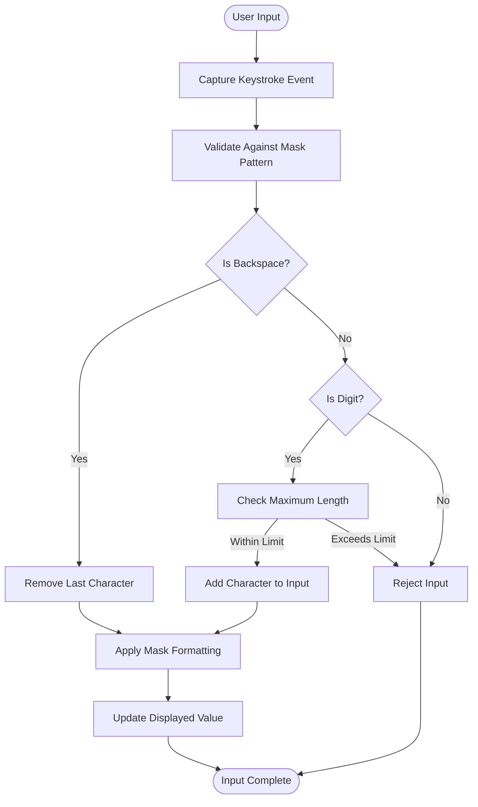
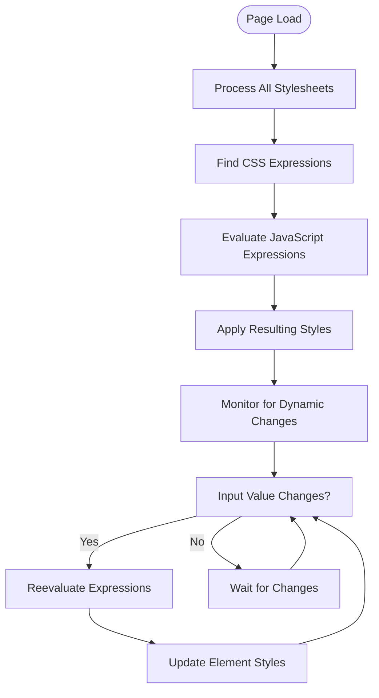
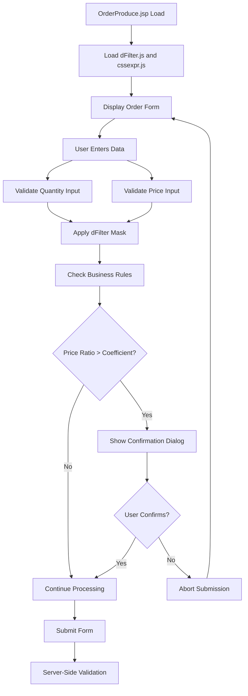
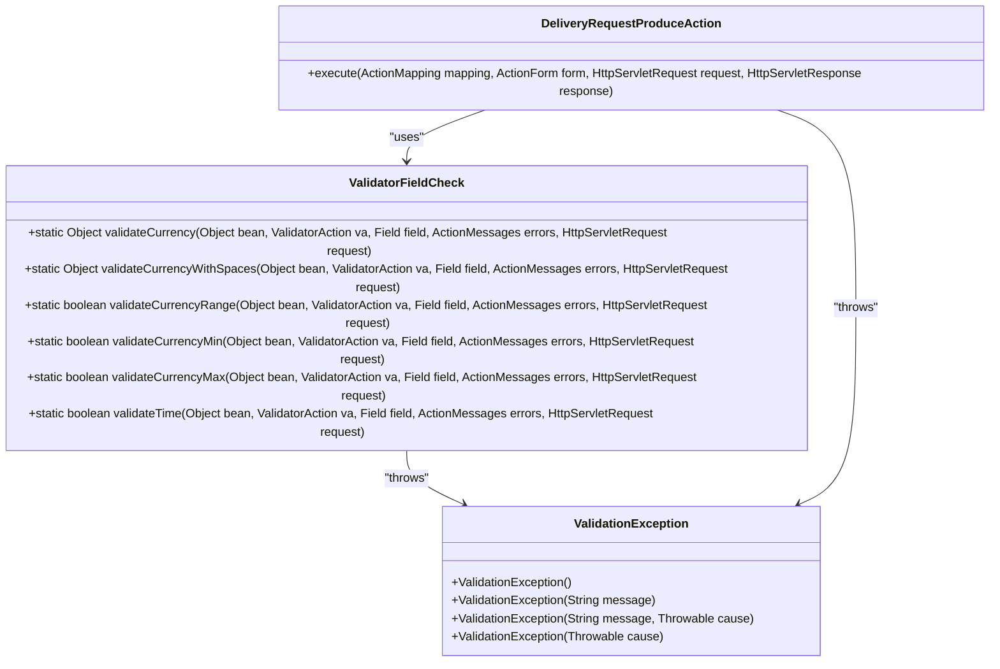
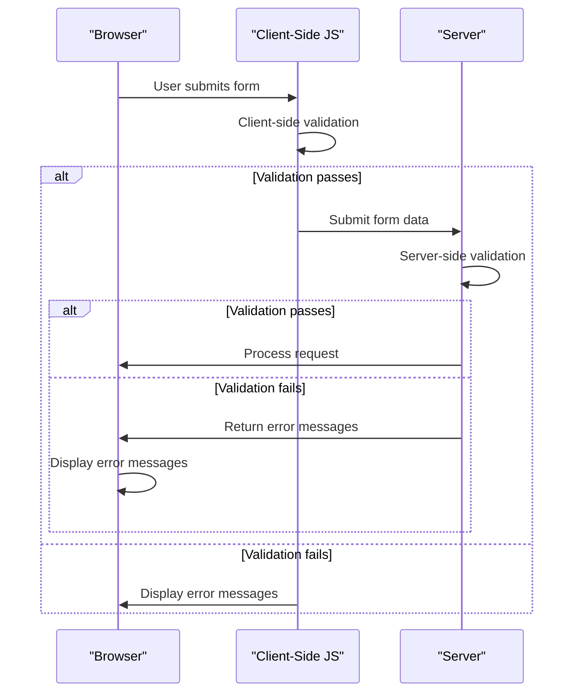

# Input Validation

<cite>
**Referenced Files in This Document**   
- [dFilter.js](file://src/main/webapp/includes/dFilter.js)
- [cssexpr.js](file://src/main/webapp/includes/cssexpr.js)
- [OrderProduce.jsp](file://src/main/webapp/jsp/OrderProduce.jsp)
- [ValidatorFieldCheck.java](file://src/main/java/net/sam/dcl/util/ValidatorFieldCheck.java)
- [schema.js](file://src/main/webapp/includes/cerny/js/schema/schema.js)
- [util.jsp](file://src/main/webapp/includes/util.jsp)
</cite>

## Table of Contents
1. [Introduction](#introduction)
2. [Client-Side Validation with dFilter.js](#client-side-validation-with-dfilterjs)
3. [Dynamic CSS Expressions with cssexpr.js](#dynamic-css-expressions-with-cssexprjs)
4. [Integration in OrderProduce.jsp](#integration-in-orderproducejsp)
5. [Server-Side Validation](#server-side-validation)
6. [Validation Synchronization](#validation-synchronization)
7. [Security Considerations](#security-considerations)
8. [Extending Validation Rules](#extending-validation-rules)
9. [Conclusion](#conclusion)

## Introduction
The DCL v3 application implements a comprehensive input validation system that combines client-side and server-side validation mechanisms. This document details how the dFilter.js and cssexpr.js scripts work together to provide immediate user feedback while ensuring data integrity through server-side validation. The validation system is designed to enforce data types, ranges, and required values before form submission, with special attention to financial data such as quantity inputs and price fields in forms like OrderProduce.jsp.

**Section sources**
- [dFilter.js](file://src/main/webapp/includes/dFilter.js#L1-L95)
- [cssexpr.js](file://src/main/webapp/includes/cssexpr.js#L1-L89)

## Client-Side Validation with dFilter.js
The dFilter.js script provides client-side input masking and validation for numerical data entry. It implements a character-by-character filtering mechanism that restricts user input to valid characters based on a specified mask pattern. The script intercepts keyboard events and validates each keystroke before allowing it to be displayed in the input field.

The core functionality of dFilter.js revolves around three main functions:
- `dFilterStrip()`: Removes mask characters from the input value to extract the raw numerical data
- `dFilterMax()`: Determines the maximum length of numerical input based on the mask pattern
- `dFilter()`: The main validation function that processes keystrokes and enforces the mask

The script supports various mask patterns where '#' represents a numerical digit, allowing for formatted input such as currency values, percentages, and time entries. For example, a mask of '##:##' restricts input to a time format, while '#,###.00' enforces a currency format with thousands separators and two decimal places.

**Diagram sources**
- [dFilter.js](file://src/main/webapp/includes/dFilter.js#L1-L95)

**Section sources**
- [dFilter.js](file://src/main/webapp/includes/dFilter.js#L1-L95)
- [TimeboardWork.jsp](file://src/main/webapp/jsp/TimeboardWork.jsp#L26-L28)

## Dynamic CSS Expressions with cssexpr.js
The cssexpr.js script enables dynamic CSS expressions that can visually indicate validation states by modifying element styles based on JavaScript expressions. This allows for real-time visual feedback to users when input validation fails, such as highlighting invalid fields in red or changing border colors.

The script works by:
1. Processing CSS rules that contain JavaScript expressions
2. Evaluating these expressions to determine appropriate styling
3. Applying the resulting styles to HTML elements

The core functionality includes:
- `simplifyCSSExpression()`: Processes all stylesheets in the document
- `simplifyCSSBlock()`: Handles individual stylesheet blocks and imported styles
- `simplifyCSSRule()`: Processes individual CSS rules containing expressions
- `simplifyCSSRuleHelper()`: Extracts and evaluates JavaScript expressions within CSS

This mechanism allows developers to create dynamic styling rules that respond to validation states. For example, a field could be styled with a red border when its value fails validation, providing immediate visual feedback to users without requiring additional JavaScript event handlers.

**Diagram sources**
- [cssexpr.js](file://src/main/webapp/includes/cssexpr.js#L1-L89)

**Section sources**
- [cssexpr.js](file://src/main/webapp/includes/cssexpr.js#L1-L89)

## Integration in OrderProduce.jsp
The OrderProduce.jsp form demonstrates the practical application of the validation system, particularly for quantity and price fields. This form implements client-side validation for order production details, including quantity inputs and price calculations.

Key validation features in OrderProduce.jsp include:
- Quantity validation: Ensuring the quantity field contains valid numerical input
- Price validation: Enforcing proper formatting and range constraints on price fields
- Conditional validation: Applying different validation rules based on form state
- Cross-field validation: Checking relationships between different input fields

The form uses dFilter.js to enforce numerical input on quantity and price fields, preventing users from entering non-numeric characters. Additionally, it implements JavaScript validation logic to check business rules, such as ensuring that the price ratio does not exceed a specified coefficient when certain conditions are met.

**Diagram sources**
- [OrderProduce.jsp](file://src/main/webapp/jsp/OrderProduce.jsp#L1-L271)
- [dFilter.js](file://src/main/webapp/includes/dFilter.js#L1-L95)

**Section sources**
- [OrderProduce.jsp](file://src/main/webapp/jsp/OrderProduce.jsp#L1-L271)
- [dFilter.js](file://src/main/webapp/includes/dFilter.js#L1-L95)

## Server-Side Validation
While client-side validation provides immediate user feedback, server-side validation ensures data integrity and security. The application implements server-side validation through Java action classes and validation utilities that verify all incoming data regardless of client-side validation results.

The server-side validation framework includes:
- `ValidatorFieldCheck.java`: A utility class containing static methods for various validation types
- Struts validation framework: Integration with the Struts framework for form validation
- Custom validation exceptions: `ValidationException` for handling validation failures

Key validation methods in ValidatorFieldCheck.java include:
- `validateCurrencyRange()`: Validates that currency values fall within specified minimum and maximum bounds
- `validateCurrencyMin()`: Ensures currency values meet minimum requirements
- `validateCurrencyMax()`: Ensures currency values do not exceed maximum limits
- `validateTime()`: Validates time format and values

These server-side validation methods are invoked during form processing in action classes, ensuring that all data meets business rules and constraints before being processed or stored.

**Diagram sources**
- [ValidatorFieldCheck.java](file://src/main/java/net/sam/dcl/util/ValidatorFieldCheck.java#L1-L230)
- [ValidationException.java](file://src/main/java/net/sam/dcl/controller/ValidationException.java#L1-L22)

**Section sources**
- [ValidatorFieldCheck.java](file://src/main/java/net/sam/dcl/util/ValidatorFieldCheck.java#L1-L230)
- [ValidationException.java](file://src/main/java/net/sam/dcl/controller/ValidationException.java#L1-L22)

## Validation Synchronization
The application ensures synchronization between client-side and server-side validation through a consistent error messaging system. When validation fails on the server, error messages are returned to the client and displayed in a consistent manner with client-side validation messages.

The synchronization mechanism includes:
- Consistent error message keys: Using the same message keys for both client and server validation
- Error message display: Utilizing the `isUserAgree()` function to display validation errors in dialog boxes
- Form state preservation: Maintaining form data when validation fails to allow users to correct errors

The `getSumForJS()` function in util.jsp plays a crucial role in validation synchronization by providing a consistent method for extracting numerical values from formatted input fields. This ensures that the same value interpretation is used both in client-side JavaScript validation and when preparing data for server-side processing.

**Diagram sources**
- [util.jsp](file://src/main/webapp/includes/util.jsp#L158-L185)
- [OrderProduce.jsp](file://src/main/webapp/jsp/OrderProduce.jsp#L1-L271)

**Section sources**
- [util.jsp](file://src/main/webapp/includes/util.jsp#L158-L185)
- [OrderProduce.jsp](file://src/main/webapp/jsp/OrderProduce.jsp#L1-L271)

## Security Considerations
The validation system addresses security concerns by recognizing that client-side validation can be bypassed through browser developer tools or direct HTTP requests. Therefore, the application implements a defense-in-depth approach with comprehensive server-side validation.

Key security measures include:
- Mandatory server-side validation: All data is validated on the server regardless of client-side validation results
- Input sanitization: Cleaning and validating all incoming data
- Error message consistency: Providing consistent error feedback without revealing system internals
- Prevention of injection attacks: Validating and sanitizing input to prevent XSS and other injection vulnerabilities

The system acknowledges that client-side validation serves primarily as a user experience enhancement, while server-side validation is the primary security control. This approach ensures data integrity and application security even when client-side validation is circumvented.

**Section sources**
- [ValidatorFieldCheck.java](file://src/main/java/net/sam/dcl/util/ValidatorFieldCheck.java#L1-L230)
- [dFilter.js](file://src/main/webapp/includes/dFilter.js#L1-L95)

## Extending Validation Rules
The validation framework supports extension through both client-side and server-side mechanisms. New validation rules can be added by:

1. **Client-side extensions**:
   - Adding new mask patterns to dFilter.js
   - Creating custom JavaScript validation functions in JSP files
   - Extending cssexpr.js to support new dynamic styling rules

2. **Server-side extensions**:
   - Adding new validation methods to ValidatorFieldCheck.java
   - Creating custom validation classes that extend existing functionality
   - Implementing validation in action classes for complex business rules

To customize error display behavior, developers can:
- Modify the `isUserAgree()` function in util.jsp to change dialog appearance and behavior
- Update CSS styles to change visual feedback for validation states
- Extend the error message system to support additional languages or formatting

The modular design of the validation system allows for easy extension while maintaining consistency across the application.

**Section sources**
- [ValidatorFieldCheck.java](file://src/main/java/net/sam/dcl/util/ValidatorFieldCheck.java#L1-L230)
- [util.jsp](file://src/main/webapp/includes/util.jsp#L158-L185)
- [dFilter.js](file://src/main/webapp/includes/dFilter.js#L1-L95)

## Conclusion
The input validation system in DCL v3 provides a robust framework for ensuring data quality and application security. By combining client-side validation with dFilter.js for immediate user feedback and server-side validation through Java utilities, the system creates a seamless user experience while maintaining data integrity.

The integration of dynamic CSS expressions through cssexpr.js enhances the user interface by providing visual feedback on validation states. Forms like OrderProduce.jsp demonstrate the practical application of these validation mechanisms for critical business data such as quantities and prices.

The defense-in-depth approach, with mandatory server-side validation complementing client-side validation, ensures that the application remains secure even when client-side validation is bypassed. The extensible design allows for the addition of new validation rules and customization of error display behavior to meet evolving business requirements.

**Section sources**
- [dFilter.js](file://src/main/webapp/includes/dFilter.js#L1-L95)
- [cssexpr.js](file://src/main/webapp/includes/cssexpr.js#L1-L89)
- [ValidatorFieldCheck.java](file://src/main/java/net/sam/dcl/util/ValidatorFieldCheck.java#L1-L230)