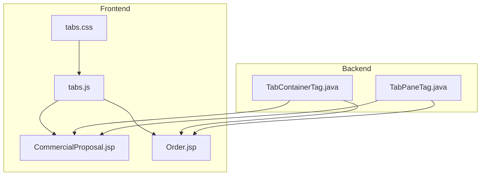
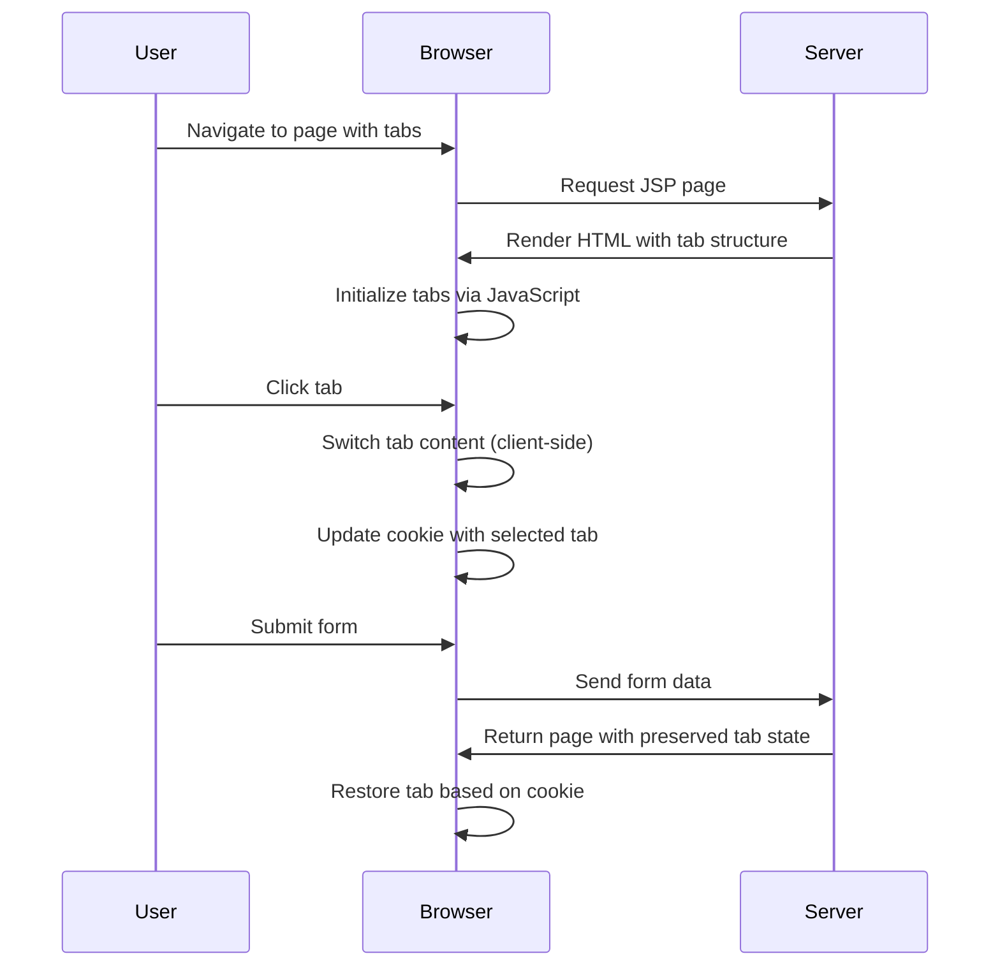
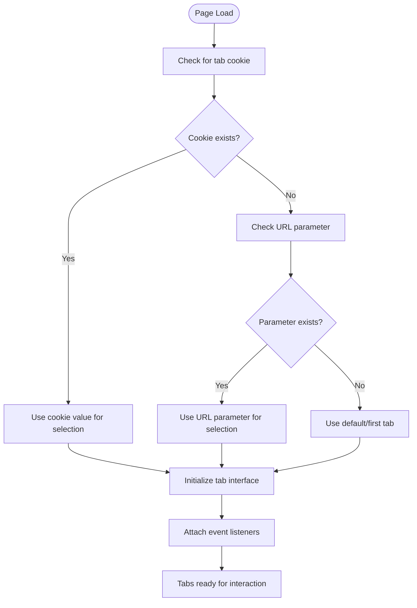
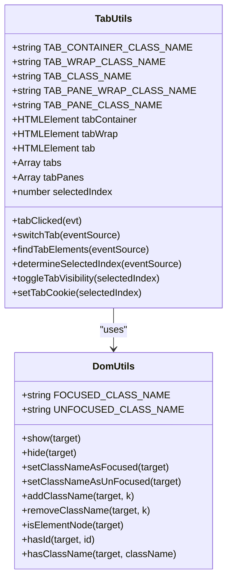
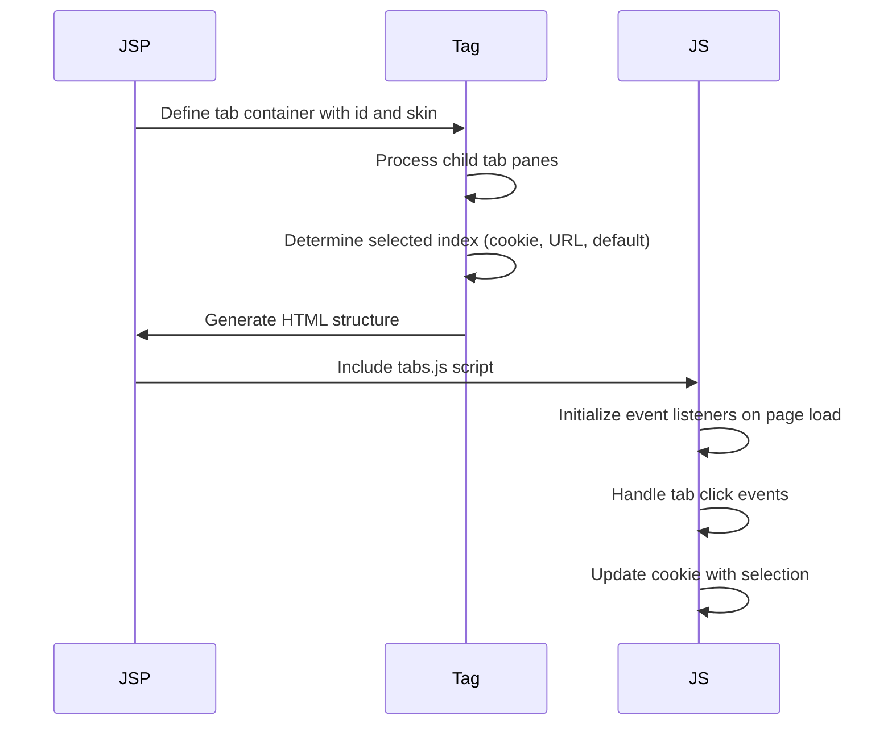
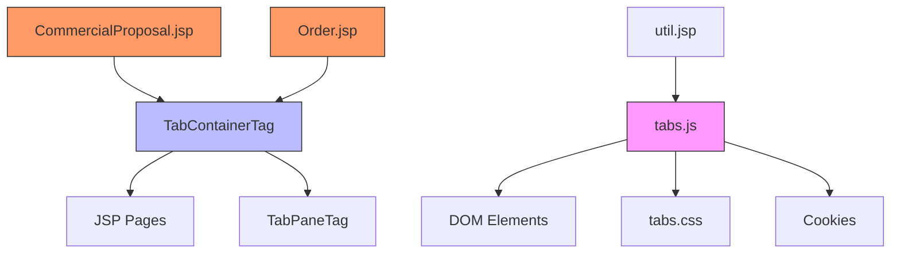

# Tab Management

<cite>
**Referenced Files in This Document**   
- [tabs.js](file://src/main/webapp/includes/tabs.js)
- [tabs.css](file://src/main/webapp/includes/tabs.css)
- [TabContainerTag.java](file://src/main/java/org/ditchnet/jsp/taglib/tabs/handler/TabContainerTag.java)
- [TabPaneTag.java](file://src/main/java/org/ditchnet/jsp/taglib/tabs/handler/TabPaneTag.java)
- [CommercialProposal.jsp](file://src/main/webapp/jsp/CommercialProposal.jsp)
- [Order.jsp](file://src/main/webapp/jsp/Order.jsp)
- [util.jsp](file://src/main/webapp/includes/util.jsp)
</cite>

## Table of Contents
1. [Introduction](#introduction)
2. [Project Structure](#project-structure)
3. [Core Components](#core-components)
4. [Architecture Overview](#architecture-overview)
5. [Detailed Component Analysis](#detailed-component-analysis)
6. [Dependency Analysis](#dependency-analysis)
7. [Performance Considerations](#performance-considerations)
8. [Troubleshooting Guide](#troubleshooting-guide)
9. [Conclusion](#conclusion)

## Introduction
The tab management system in the DCL application provides a robust client-side interface for managing tabbed navigation across various JSP pages such as CommercialProposal.jsp and Order.jsp. This documentation details the implementation, initialization process, tab switching mechanics, state persistence, and integration with CSS for visual styling. The system enables dynamic content loading and maintains active tab selection across user interactions and page submissions.

**Section sources**
- [tabs.js](file://src/main/webapp/includes/tabs.js#L0-L1294)
- [tabs.css](file://src/main/webapp/includes/tabs.css#L0-L170)

## Project Structure
The tab management system is implemented through a combination of JavaScript, CSS, and JSP custom tags. The core functionality resides in the `tabs.js` file located in the includes directory, with corresponding styling in `tabs.css`. The system uses custom JSP tags (`TabContainerTag` and `TabPaneTag`) to declaratively define tab structures in JSP pages. Tab content is integrated into various business pages including CommercialProposal.jsp and Order.jsp.

**Diagram sources **
- [tabs.js](file://src/main/webapp/includes/tabs.js#L0-L1294)
- [tabs.css](file://src/main/webapp/includes/tabs.css#L0-L170)
- [TabContainerTag.java](file://src/main/java/org/ditchnet/jsp/taglib/tabs/handler/TabContainerTag.java#L0-L370)
- [CommercialProposal.jsp](file://src/main/webapp/jsp/CommercialProposal.jsp#L0-L1887)

**Section sources**
- [tabs.js](file://src/main/webapp/includes/tabs.js#L0-L1294)
- [tabs.css](file://src/main/webapp/includes/tabs.css#L0-L170)
- [TabContainerTag.java](file://src/main/java/org/ditchnet/jsp/taglib/tabs/handler/TabContainerTag.java#L0-L370)

## Core Components
The tab management system consists of several core components that work together to provide tabbed navigation functionality. The JavaScript implementation in tabs.js provides the client-side logic for tab switching and state management, while the CSS file defines the visual styling. The JSP custom tags abstract the HTML structure and initialization logic, allowing developers to declaratively define tab interfaces in their pages.

**Section sources**
- [tabs.js](file://src/main/webapp/includes/tabs.js#L0-L1294)
- [tabs.css](file://src/main/webapp/includes/tabs.css#L0-L170)
- [TabContainerTag.java](file://src/main/java/org/ditchnet/jsp/taglib/tabs/handler/TabContainerTag.java#L0-L370)

## Architecture Overview
The tab management system follows a client-server architecture where the server-side JSP tags generate the appropriate HTML structure, and the client-side JavaScript handles user interactions and dynamic behavior. The system uses cookies to persist tab state between sessions and page reloads, ensuring a consistent user experience.

**Diagram sources **
- [tabs.js](file://src/main/webapp/includes/tabs.js#L0-L1294)
- [TabContainerTag.java](file://src/main/java/org/ditchnet/jsp/taglib/tabs/handler/TabContainerTag.java#L0-L370)

## Detailed Component Analysis

### Tab Initialization and State Management
The tab system initializes through a combination of server-side tag processing and client-side JavaScript execution. The TabContainerTag processes the tab structure during JSP rendering, while the client-side code in tabs.js handles runtime interactions.

**Diagram sources **
- [TabContainerTag.java](file://src/main/java/org/ditchnet/jsp/taglib/tabs/handler/TabContainerTag.java#L0-L370)
- [tabs.js](file://src/main/webapp/includes/tabs.js#L0-L1294)

**Section sources**
- [TabContainerTag.java](file://src/main/java/org/ditchnet/jsp/taglib/tabs/handler/TabContainerTag.java#L0-L370)
- [tabs.js](file://src/main/webapp/includes/tabs.js#L0-L1294)

### Tab Switching Mechanics
The tab switching functionality is implemented through event-driven JavaScript that responds to user interactions. When a tab is clicked, the system identifies the corresponding content pane and updates the visual state accordingly.

**Diagram sources **
- [tabs.js](file://src/main/webapp/includes/tabs.js#L0-L1294)

**Section sources**
- [tabs.js](file://src/main/webapp/includes/tabs.js#L0-L1294)

### Tab Configuration in JSP Pages
The tab system is integrated into JSP pages through custom tags that define the tab structure declaratively. This approach separates the presentation logic from the implementation details.

**Diagram sources **
- [TabContainerTag.java](file://src/main/java/org/ditchnet/jsp/taglib/tabs/handler/TabContainerTag.java#L0-L370)
- [tabs.js](file://src/main/webapp/includes/tabs.js#L0-L1294)

**Section sources**
- [TabContainerTag.java](file://src/main/java/org/ditchnet/jsp/taglib/tabs/handler/TabContainerTag.java#L0-L370)
- [tabs.js](file://src/main/webapp/includes/tabs.js#L0-L1294)

## Dependency Analysis
The tab management system has dependencies across multiple layers of the application architecture. The client-side JavaScript depends on the DOM structure generated by the server-side JSP tags, while the styling depends on the CSS classes defined in the stylesheet.

**Diagram sources **
- [tabs.js](file://src/main/webapp/includes/tabs.js#L0-L1294)
- [TabContainerTag.java](file://src/main/java/org/ditchnet/jsp/taglib/tabs/handler/TabContainerTag.java#L0-L370)
- [CommercialProposal.jsp](file://src/main/webapp/jsp/CommercialProposal.jsp#L0-L1887)
- [Order.jsp](file://src/main/webapp/jsp/Order.jsp#L0-L2265)
- [util.jsp](file://src/main/webapp/includes/util.jsp#L0-L893)

**Section sources**
- [tabs.js](file://src/main/webapp/includes/tabs.js#L0-L1294)
- [TabContainerTag.java](file://src/main/java/org/ditchnet/jsp/taglib/tabs/handler/TabContainerTag.java#L0-L370)
- [CommercialProposal.jsp](file://src/main/webapp/jsp/CommercialProposal.jsp#L0-L1887)
- [Order.jsp](file://src/main/webapp/jsp/Order.jsp#L0-L2265)

## Performance Considerations
The tab management system employs client-side switching for immediate responsiveness, avoiding server round-trips when changing tabs. All tab content is pre-rendered on the server and loaded with the initial page, which improves perceived performance but increases initial page load size. The system uses efficient DOM traversal methods to locate tab elements and minimize JavaScript execution time.

**Section sources**
- [tabs.js](file://src/main/webapp/includes/tabs.js#L0-L1294)
- [TabContainerTag.java](file://src/main/java/org/ditchnet/jsp/taglib/tabs/handler/TabContainerTag.java#L0-L370)

## Troubleshooting Guide
Common issues with the tab system include tab state reset after form submission and incorrect tab initialization. These issues are typically resolved by ensuring proper cookie handling and correct tag configuration. The system maintains tab state through cookies that store the selected tab index, associated with the tab container's ID. If tabs are not maintaining state, verify that the container ID is consistent across page requests and that cookies are not being blocked by the browser.

**Section sources**
- [tabs.js](file://src/main/webapp/includes/tabs.js#L0-L1294)
- [TabContainerTag.java](file://src/main/java/org/ditchnet/jsp/taglib/tabs/handler/TabContainerTag.java#L0-L370)

## Conclusion
The tab management system provides a comprehensive solution for implementing tabbed interfaces in the DCL application. By combining server-side tag processing with client-side JavaScript, the system offers a balance of declarative configuration and dynamic behavior. The use of cookies for state persistence ensures a consistent user experience across page interactions, while the modular design allows for easy integration into various JSP pages. For new implementations, follow the established pattern of using the TabContainerTag and TabPaneTag to define the structure, ensuring each tab container has a unique ID to maintain proper state isolation.