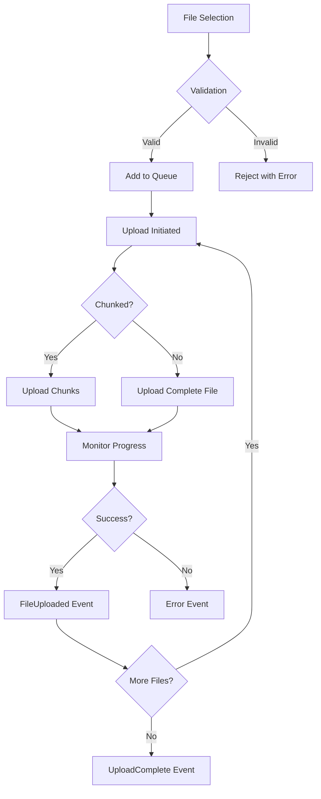
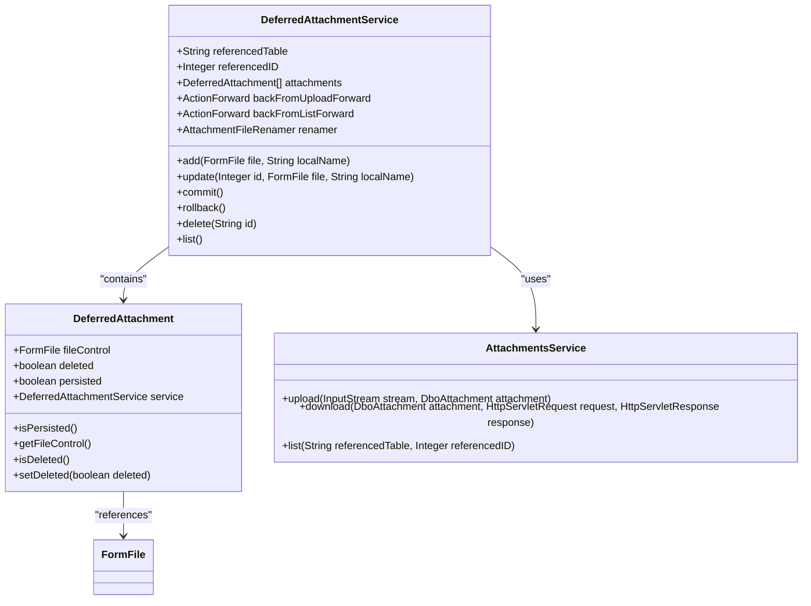
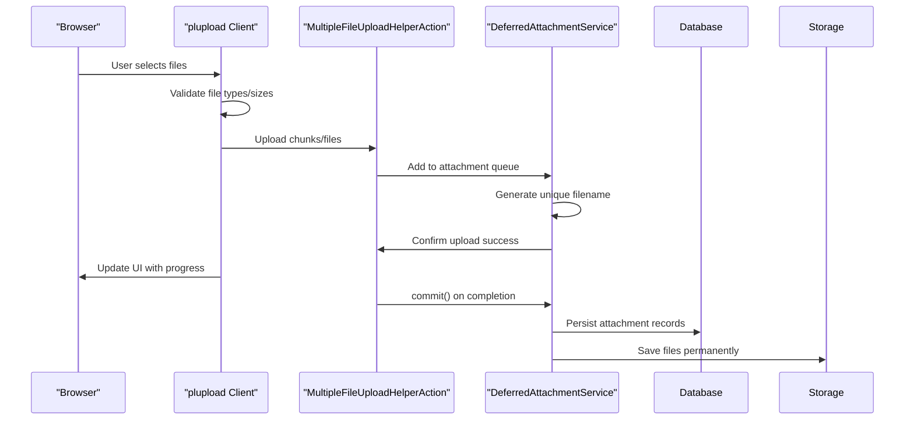

# File Upload (plupload)

<cite>
**Referenced Files in This Document**   
- [MultipleFileUpload.jsp](file://src/main/webapp/jsp/MultipleFileUpload.jsp)
- [MultipleFileUploadHelperAction.java](file://src/main/java/net/sam/dcl/action/MultipleFileUploadHelperAction.java)
- [DeferredAttachmentService.java](file://src/main/java/net/sam/dcl/service/DeferredAttachmentService.java)
- [DeferredUploadFileActionBean.java](file://src/main/java/net/sam/dcl/action/DeferredUploadFileActionBean.java)
- [plupload.dev.js](file://src/main/webapp/includes/plupload-2.1.2/js/plupload.dev.js)
- [jquery.ui.plupload.js](file://src/main/webapp/includes/plupload-2.1.2/js/jquery.ui.plupload/jquery.ui.plupload.js)
- [AttachmentsService.java](file://src/main/java/net/sam/dcl/service/AttachmentsService.java)
- [DeferredAttachments.jsp](file://src/main/webapp/jsp/DeferredAttachments.jsp)
</cite>

## Table of Contents
1. [Introduction](#introduction)
2. [Multi-Runtime Architecture](#multi-runtime-architecture)
3. [Configuration Options](#configuration-options)
4. [Event Handling Mechanisms](#event-handling-mechanisms)
5. [Backend Integration](#backend-integration)
6. [JSP Implementation Examples](#jsp-implementation-examples)
7. [jQuery UI Integration](#jquery-ui-integration)
8. [Security Considerations](#security-considerations)
9. [Troubleshooting Guide](#troubleshooting-guide)
10. [Performance Optimization](#performance-optimization)

## Introduction
The plupload component in the dcl_v3 application provides a robust file upload solution with support for multiple runtimes including HTML5, Flash, Silverlight, and HTML4. This documentation details the implementation, configuration, and integration of the plupload component within the dcl_v3 application, focusing on its multi-runtime architecture, configuration options, event handling, backend integration, and security considerations.

## Multi-Runtime Architecture
The plupload component in dcl_v3 implements a multi-runtime architecture that ensures maximum browser compatibility by supporting multiple upload methods. The system automatically detects and utilizes the most appropriate runtime based on the user's browser capabilities.

The plupload configuration specifies a priority order for runtimes: "html5,flash,silverlight,html4". This sequence ensures that modern browsers use the most efficient HTML5 runtime, while providing fallback options for older browsers. The HTML5 runtime leverages modern browser features for direct file access and chunked uploads, while Flash and Silverlight provide consistent upload capabilities across older browsers that may lack HTML5 support.

The architecture is designed to be transparent to end users, automatically selecting the optimal runtime without requiring user intervention. Each runtime implements the same core functionality, ensuring consistent behavior regardless of the underlying technology. The system gracefully degrades when advanced features are not available, maintaining basic upload functionality even in the most limited environments.

**Section sources**
- [plupload.dev.js](file://src/main/webapp/includes/plupload-2.1.2/js/plupload.dev.js#L728-L743)
- [jquery.ui.plupload.js](file://src/main/webapp/includes/plupload-2.1.2/js/jquery.ui.plupload/jquery.ui.plupload.js#L92-L98)

## Configuration Options
The plupload component in dcl_v3 offers extensive configuration options to control upload behavior, including chunking, compression, and concurrent upload limits.

### Chunking Configuration
The component supports file chunking, which breaks large files into smaller segments for upload. This improves reliability by allowing failed segments to be retransmitted without resending the entire file. The chunk size can be configured, with the system automatically handling the reassembly of chunks on the server side.

### Compression and Resizing
Client-side image compression and resizing are supported for JPEG and PNG files. The configuration allows specifying target dimensions and compression quality, reducing file sizes before upload to improve performance and conserve bandwidth. The resize feature includes options for proportional resizing or exact cropping to specified dimensions.

### Concurrent Upload Limits
The system can be configured to limit the number of concurrent uploads, preventing excessive resource consumption on both client and server. This is particularly important in enterprise environments where multiple users may be uploading files simultaneously.

### File Filtering
Comprehensive file filtering options are available, including MIME type restrictions, file extension validation, and size limits. These filters can be configured to accept specific file types (e.g., images, documents) while rejecting others, enhancing security and ensuring only appropriate files are uploaded.

**Section sources**
- [plupload.dev.js](file://src/main/webapp/includes/plupload-2.1.2/js/plupload.dev.js#L728-L743)
- [jquery.plupload.queue.js](file://src/main/webapp/includes/plupload-2.1.2/js/jquery.plupload.queue/jquery.plupload.queue.js#L57-L69)

## Event Handling Mechanisms
The plupload component implements a comprehensive event-driven architecture that provides real-time feedback throughout the upload process.

### Upload Progress Events
The system dispatches progress events during file uploads, enabling real-time progress indicators in the user interface. These events include information about the percentage completed, bytes transferred, and estimated time remaining, allowing for detailed progress visualization.

### File Management Events
Events are triggered when files are added to or removed from the upload queue. The `FilesAdded` event fires when users select files, allowing the application to validate files against business rules before they enter the queue. The `FilesRemoved` event enables cleanup operations when files are removed from the queue.

### Error Handling Events
Comprehensive error detection and reporting are implemented through the error event system. The component can detect various error conditions including network failures, server errors, file size violations, and unsupported file types. Detailed error information is provided, enabling appropriate user feedback and potential recovery actions.

### Completion Events
The `FileUploaded` event fires when an individual file completes uploading, while the `UploadComplete` event signals that all files in the queue have been processed. These events enable post-upload processing, such as updating database records or triggering additional workflows.

**Diagram sources **
- [plupload.dev.js](file://src/main/webapp/includes/plupload-2.1.2/js/plupload.dev.js#L997-L1049)
- [jquery.ui.plupload.js](file://src/main/webapp/includes/plupload-2.1.2/js/jquery.ui.plupload/jquery.ui.plupload.js#L587-L618)

**Section sources**
- [plupload.dev.js](file://src/main/webapp/includes/plupload-2.1.2/js/plupload.dev.js#L997-L1049)
- [jquery.ui.plupload.js](file://src/main/webapp/includes/plupload-2.1.2/js/jquery.ui.plupload/jquery.ui.plupload.js#L587-L618)

## Backend Integration
The plupload component integrates with backend services through the AttachmentService.java and DeferredAttachmentService.java classes, handling file processing and storage.

### DeferredAttachmentService Architecture
The DeferredAttachmentService manages file attachments in a deferred manner, allowing files to be uploaded and temporarily stored before being permanently associated with database records. This approach supports complex workflows where file uploads may precede the creation of the associated business entity.

The service maintains a session-based collection of attachments, tracking both persisted (database-stored) and non-persisted files. It provides methods for adding, updating, and deleting attachments, with appropriate cleanup of temporary files when transactions are aborted.

### File Processing Workflow
When files are uploaded, they are initially stored in a temporary location. The DeferredAttachmentService coordinates with the AttachmentsService to handle the final storage and database persistence. The commit() method processes all queued attachments, saving them to permanent storage and creating corresponding database records.

The service implements transactional behavior, ensuring that either all attachments in a transaction are successfully saved or appropriate cleanup occurs if any part of the transaction fails. This prevents orphaned files and maintains data consistency.

### Attachment Lifecycle Management
The system manages the complete lifecycle of attachments, from upload through to deletion. When attachments are deleted, the service handles both database record removal and physical file deletion from storage. The rollback() method provides a way to abort an entire transaction, cleaning up all temporary files associated with the operation.

**Diagram sources **
- [DeferredAttachmentService.java](file://src/main/java/net/sam/dcl/service/DeferredAttachmentService.java#L68-L96)
- [AttachmentsService.java](file://src/main/java/net/sam/dcl/service/AttachmentsService.java)

**Section sources**
- [DeferredAttachmentService.java](file://src/main/java/net/sam/dcl/service/DeferredAttachmentService.java#L68-L96)
- [AttachmentsService.java](file://src/main/java/net/sam/dcl/service/AttachmentsService.java)

## JSP Implementation Examples
The plupload component is implemented in JSP pages with specific configurations for different use cases.

### Multiple File Upload Implementation
The MultipleFileUpload.jsp page demonstrates a Silverlight-based implementation of plupload. The configuration specifies 'silverlight' as the runtime, with the Silverlight XAP file located at 'includes/plupload-2.1.2/js/Moxie.xap'. The upload URL is dynamically generated using a JavaScript function that incorporates the user's session ID for security.

The implementation includes event handlers for file addition, upload progress, and error conditions. When files are added, they are displayed in a list with their names and sizes. Progress is shown as a percentage for each file, providing real-time feedback during the upload process.

### Single File Upload Implementation
The UploadFile.jsp page provides a simpler file upload interface using standard HTML file input elements. This implementation is used when the advanced features of plupload are not required, or as a fallback when JavaScript-based upload components are not available.

The form uses multipart encoding to support file uploads and includes hidden fields to maintain context about the referenced table and record ID. This ensures that uploaded files can be properly associated with the correct business entity in the application.

**Diagram sources **
- [MultipleFileUpload.jsp](file://src/main/webapp/jsp/MultipleFileUpload.jsp)
- [MultipleFileUploadHelperAction.java](file://src/main/java/net/sam/dcl/action/MultipleFileUploadHelperAction.java)
- [DeferredAttachmentService.java](file://src/main/java/net/sam/dcl/service/DeferredAttachmentService.java)

**Section sources**
- [MultipleFileUpload.jsp](file://src/main/webapp/jsp/MultipleFileUpload.jsp)
- [MultipleFileUploadHelperAction.java](file://src/main/java/net/sam/dcl/action/MultipleFileUploadHelperAction.java)

## jQuery UI Integration
The plupload component integrates with jQuery UI to provide an enhanced user interface and queue management capabilities.

### UI Components
The integration leverages jQuery UI widgets including buttons, progress bars, and sortable lists to create a rich user experience. The upload interface includes standard controls such as "Add Files", "Start Upload", and "Cancel" buttons styled with jQuery UI themes for consistency with the overall application design.

### Queue Management
The plupload queue provides a sortable list of files, allowing users to reorder uploads and manage the upload priority. Each file in the queue displays its name, size, status, and progress indicator. Users can remove individual files from the queue before uploading begins.

### Drag and Drop Support
The integration enables drag-and-drop functionality, allowing users to add files to the upload queue by dragging them from their desktop or file manager directly onto the upload area. This enhances usability and provides a more intuitive file selection experience.

### Responsive Design
The jQuery UI integration ensures that the upload interface is responsive and accessible. Keyboard navigation is supported, and screen reader compatibility is maintained through appropriate ARIA attributes and semantic HTML structure.

**Section sources**
- [jquery.ui.plupload.js](file://src/main/webapp/includes/plupload-2.1.2/js/jquery.ui.plupload/jquery.ui.plupload.js)
- [DeferredAttachments.jsp](file://src/main/webapp/jsp/DeferredAttachments.jsp)

## Security Considerations
The plupload implementation in dcl_v3 incorporates multiple security measures to protect against common vulnerabilities.

### File Type Validation
The system implements both client-side and server-side file type validation. Client-side validation uses MIME type filtering to prevent obviously invalid files from being uploaded, while server-side validation performs more thorough checks to prevent malicious file uploads.

The configuration allows specifying acceptable file types through MIME type patterns and file extensions. This prevents users from uploading executable files or other potentially dangerous content.

### Size Limits
File size limits are enforced both client-side and server-side to prevent denial-of-service attacks through extremely large file uploads. The system can be configured with maximum file size limits, and attempts to upload files exceeding these limits are rejected with appropriate error messages.

### CSRF Protection
The implementation includes CSRF (Cross-Site Request Forgery) protection by incorporating session identifiers in upload requests. The MultipleFileUploadHelperAction uses the user's session ID in the upload URL, ensuring that upload requests are associated with a valid user session.

### Secure File Storage
Uploaded files are stored with generated filenames rather than preserving original names, preventing path traversal attacks and ensuring files are stored in appropriate directories based on their associated business entities. The DeferredAttachmentService manages the file naming and storage location to maintain security and organization.

**Section sources**
- [MultipleFileUploadHelperAction.java](file://src/main/java/net/sam/dcl/action/MultipleFileUploadHelperAction.java)
- [DeferredAttachmentService.java](file://src/main/java/net/sam/dcl/service/DeferredAttachmentService.java)
- [plupload.dev.js](file://src/main/webapp/includes/plupload-2.1.2/js/plupload.dev.js)

## Troubleshooting Guide
This section provides guidance for diagnosing and resolving common upload failures.

### Common Issues and Solutions
1. **Upload Stalls or Fails**: Check network connectivity and server availability. For large files, ensure that server timeout settings are sufficient for the expected upload duration.

2. **Runtime Initialization Failure**: Verify that the required runtime components (Flash, Silverlight) are installed and enabled in the user's browser. Check that the SWF and XAP file paths are correct and accessible.

3. **File Type Rejection**: Confirm that the file extension and MIME type are included in the allowed types configuration. Some files may have incorrect extensions or MIME types that don't match the actual file content.

4. **Authentication Errors**: Ensure that the user's session is active and that CSRF tokens are being properly included in upload requests.

### Diagnostic Steps
1. Check browser developer tools for JavaScript errors that may indicate configuration issues.
2. Verify network connectivity and server response codes during upload attempts.
3. Review server logs for any error messages related to file uploads or storage.
4. Test with different file sizes and types to isolate the issue.
5. Try alternative browsers or runtimes to determine if the issue is browser-specific.

**Section sources**
- [MultipleFileUploadHelperAction.java](file://src/main/java/net/sam/dcl/action/MultipleFileUploadHelperAction.java)
- [DeferredAttachmentService.java](file://src/main/java/net/sam/dcl/service/DeferredAttachmentService.java)
- [plupload.dev.js](file://src/main/webapp/includes/plupload-2.1.2/js/plupload.dev.js)

## Performance Optimization
The plupload implementation includes several features to optimize performance, particularly for large file transfers.

### Chunked Uploads
For large files, the system supports chunked uploads that break files into smaller segments. This improves reliability by allowing failed segments to be retransmitted without resending the entire file. It also enables better progress reporting and reduces memory usage on both client and server.

### Concurrent Uploads
The configuration can be optimized to allow multiple files to upload simultaneously, improving overall throughput when multiple files are being uploaded. The number of concurrent uploads can be tuned based on server capacity and network conditions.

### Client-Side Processing
Client-side image resizing and compression reduce file sizes before upload, decreasing transfer times and bandwidth usage. This is particularly beneficial for mobile users or those with limited bandwidth.

### Server-Side Optimization
The DeferredAttachmentService batches database operations when committing multiple attachments, reducing the number of database round-trips. Temporary files are managed efficiently to minimize disk I/O during the upload process.

**Section sources**
- [plupload.dev.js](file://src/main/webapp/includes/plupload-2.1.2/js/plupload.dev.js)
- [DeferredAttachmentService.java](file://src/main/java/net/sam/dcl/service/DeferredAttachmentService.java)