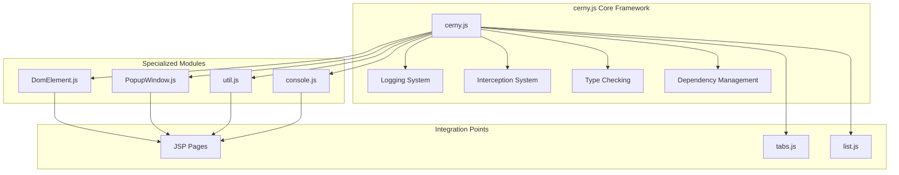
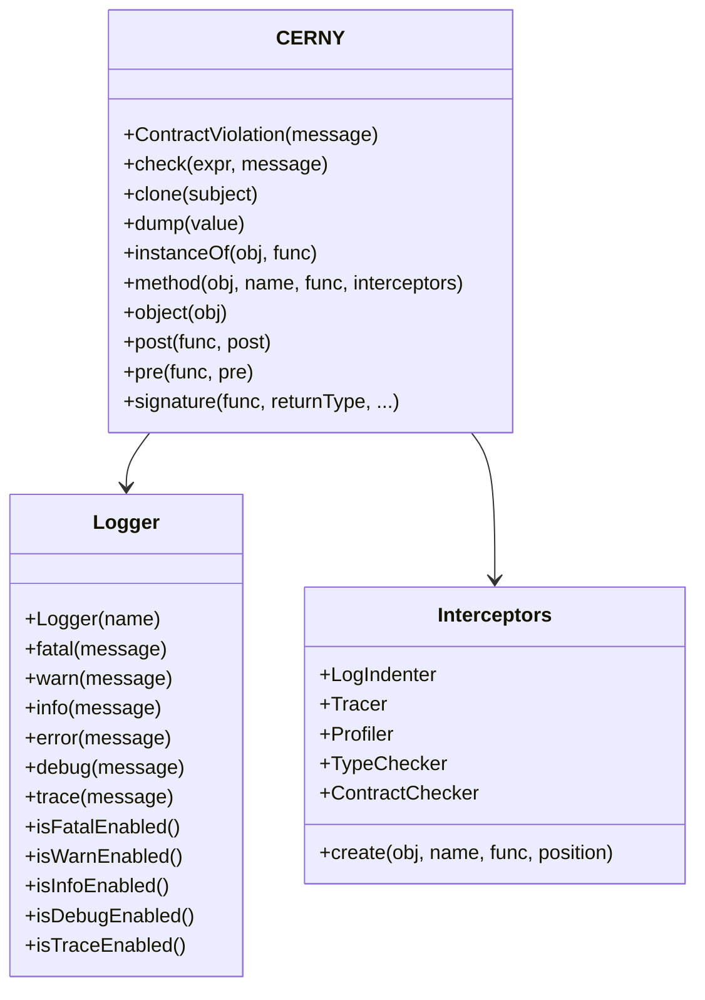
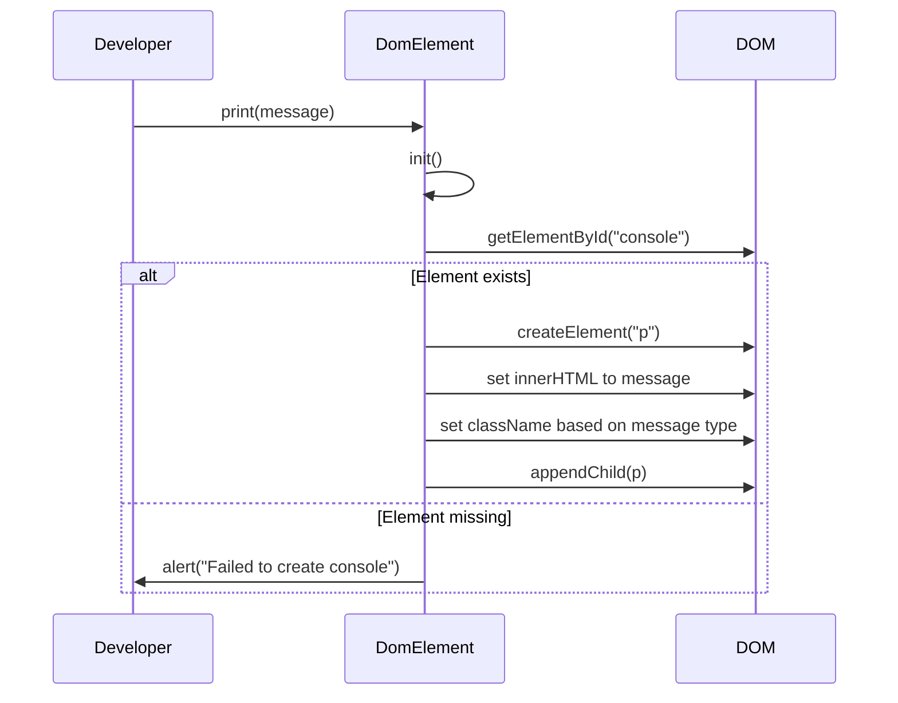
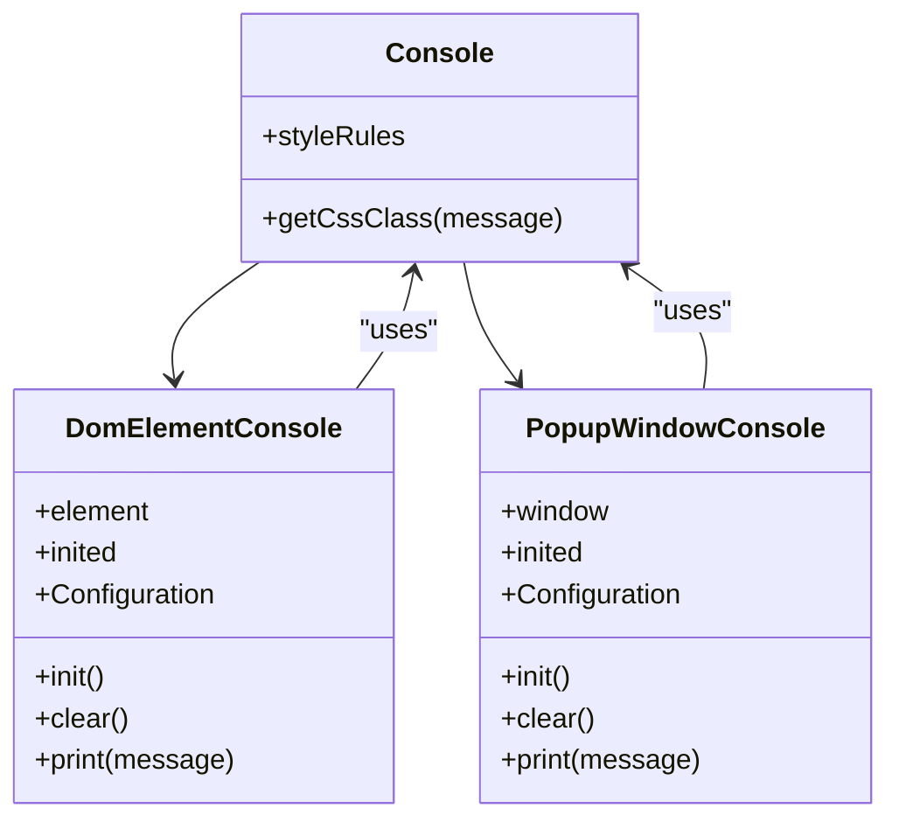
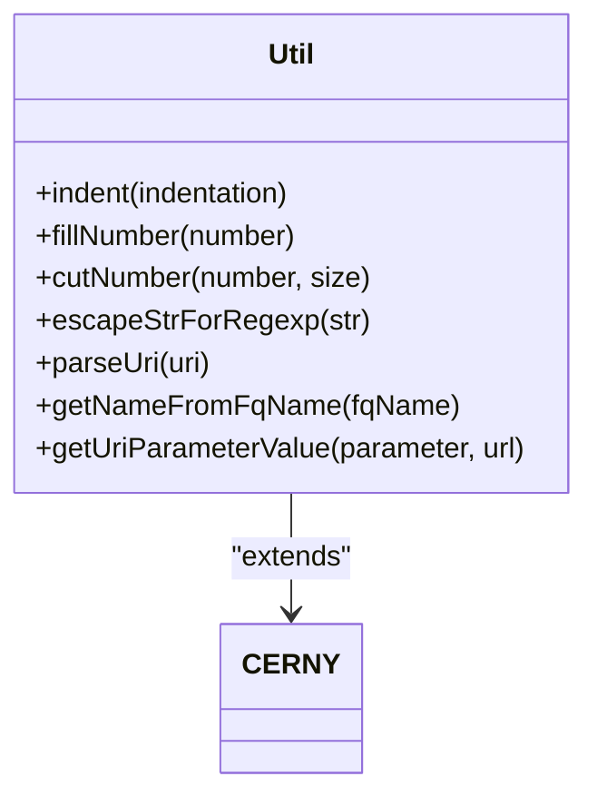
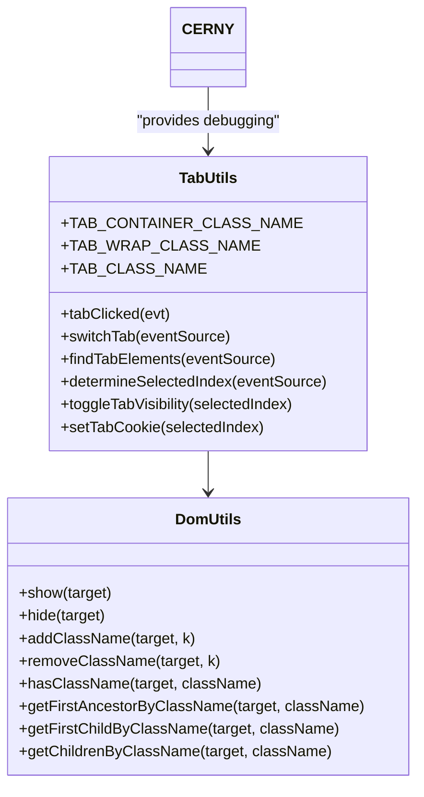
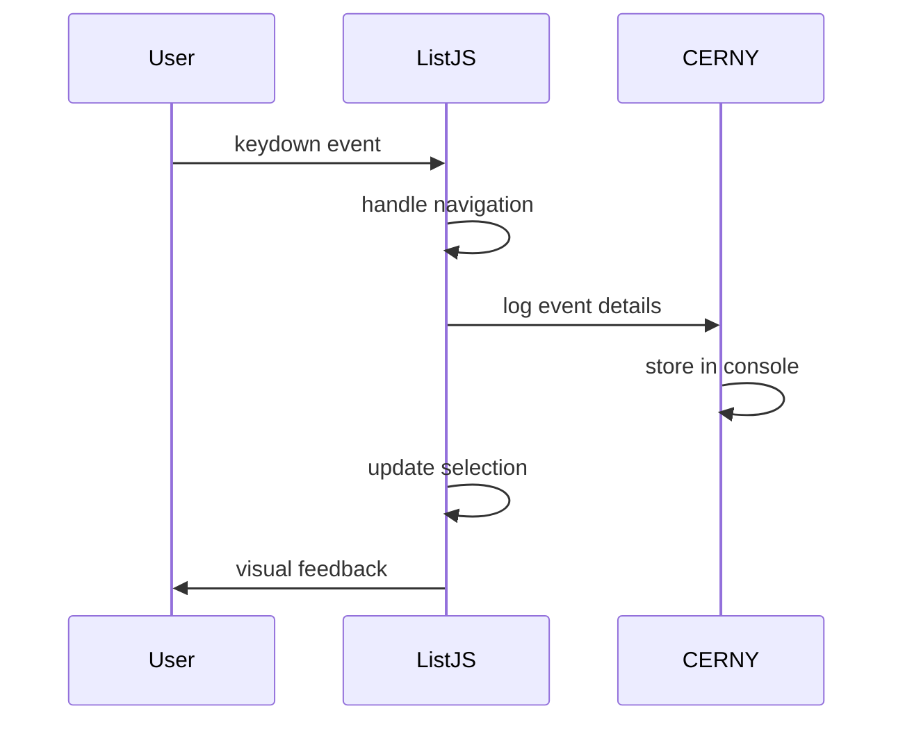
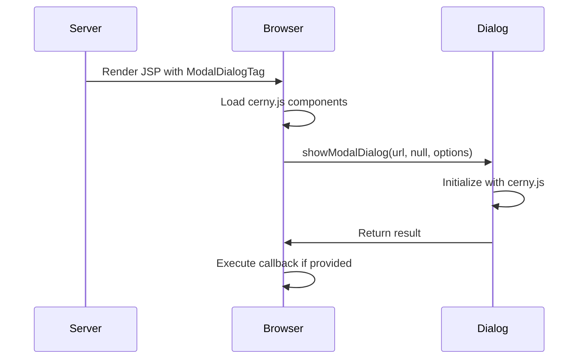
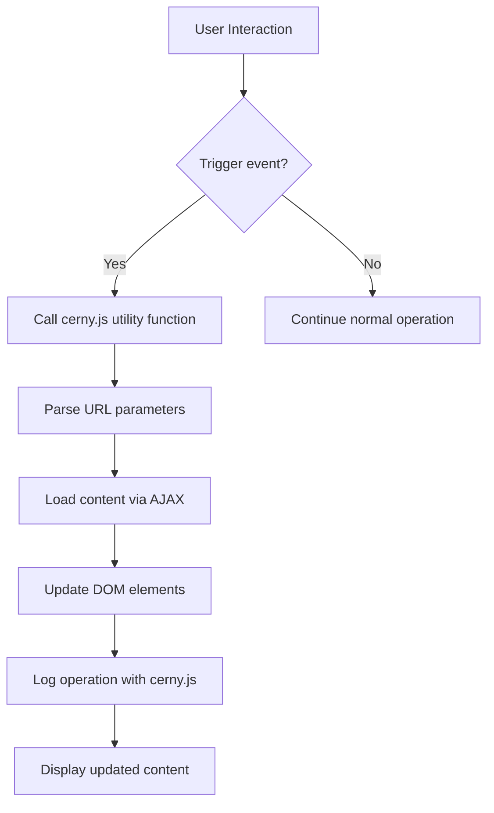
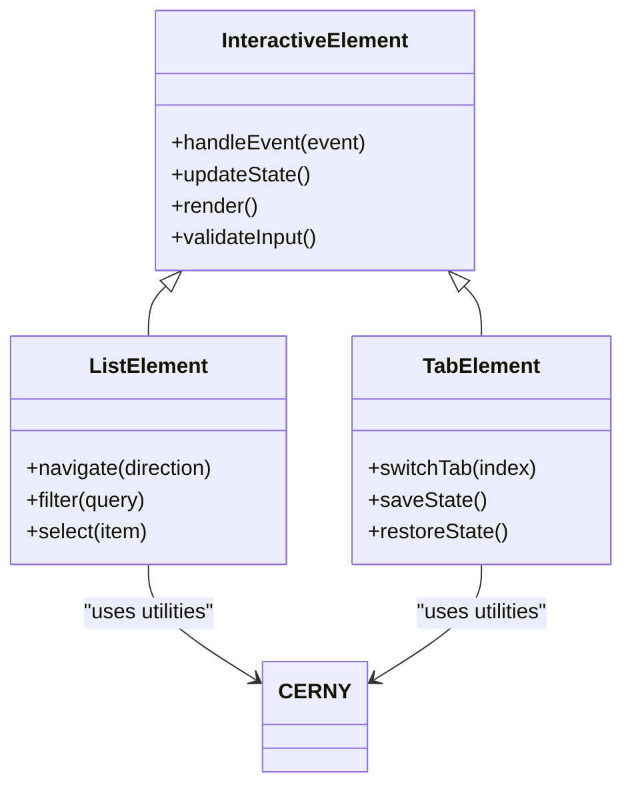

# UI Utilities (cerny.js)

<cite>
**Referenced Files in This Document**   
- [cerny.js](file://src/main/webapp/includes/cerny/js/cerny.js)
- [DomElement.js](file://src/main/webapp/includes/cerny/js/console/DomElement.js)
- [PopupWindow.js](file://src/main/webapp/includes/cerny/js/console/PopupWindow.js)
- [console.js](file://src/main/webapp/includes/cerny/js/console/console.js)
- [util.js](file://src/main/webapp/includes/cerny/js/util/util.js)
- [tabs.js](file://src/main/webapp/includes/tabs.js)
- [list.js](file://src/main/webapp/includes/list.js)
- [dialog.jsp](file://src/main/webapp/layout/dialog.jsp)
- [main.jsp](file://src/main/webapp/layout/main.jsp)
- [util.jsp](file://src/main/webapp/includes/util.jsp)
- [ModalDialogTag.java](file://src/main/java/net/sam/dcl/taglib/ModalDialogTag.java)
</cite>

## Table of Contents
1. [Introduction](#introduction)
2. [Core Components](#core-components)
3. [Architecture Overview](#architecture-overview)
4. [Detailed Component Analysis](#detailed-component-analysis)
5. [Integration with Other Components](#integration-with-other-components)
6. [Usage in JSP Pages](#usage-in-jsp-pages)
7. [Browser Compatibility and Performance](#browser-compatibility-and-performance)
8. [Best Practices and Migration Strategies](#best-practices-and-migration-strategies)
9. [Conclusion](#conclusion)

## Introduction
The cerny.js UI utility library serves as the core JavaScript framework for the dcl_v3 application, providing essential DOM manipulation utilities, dynamic popup windows, and debugging tools. Developed by Robert Cerny in 2006, this library enhances developer productivity through its comprehensive set of utility functions and robust debugging capabilities. The library is structured as a monolithic script with modular components that handle DOM manipulation, console logging, and various utility operations. It plays a critical role in enabling interactive elements, modal dialogs, and dynamic content loading throughout the application's JSP pages. This documentation provides a comprehensive analysis of the cerny.js library, its components, integration patterns, and best practices for usage and modernization.

## Core Components
The cerny.js library consists of several core components that provide essential functionality for the dcl_v3 application. The library's architecture is built around a core framework (cerny.js) that provides interception, type checking, logging, and configuration capabilities. This foundation supports specialized modules for DOM manipulation (DomElement.js), popup window management (PopupWindow.js), and general utility functions (util.js). The console utilities enable comprehensive debugging through both on-page DOM elements and separate popup windows, allowing developers to monitor application behavior and troubleshoot issues effectively. These components work together to provide a cohesive toolkit for building interactive web interfaces, with the core cerny.js framework serving as the central coordination point for all functionality.

**Section sources**
- [cerny.js](file://src/main/webapp/includes/cerny/js/cerny.js#L0-L1161)
- [DomElement.js](file://src/main/webapp/includes/cerny/js/console/DomElement.js#L0-L101)
- [PopupWindow.js](file://src/main/webapp/includes/cerny/js/console/PopupWindow.js#L0-L88)
- [util.js](file://src/main/webapp/includes/cerny/js/util/util.js#L0-L180)

## Architecture Overview
The cerny.js library follows a modular architecture with a central core framework that coordinates various specialized components. The architecture is designed to provide a comprehensive set of UI utilities while maintaining separation of concerns between different functional areas. The core cerny.js file serves as the foundation, implementing interception, type checking, logging, and configuration management. This core functionality enables the library to provide robust debugging and error handling capabilities. Specialized modules extend this core functionality to address specific UI needs, such as DOM manipulation and popup window management. The library's architecture emphasizes reusability and extensibility, allowing developers to leverage its components across different parts of the application. This modular approach enables the library to support complex UI interactions while maintaining a relatively simple integration model for developers.



**Diagram sources **
- [cerny.js](file://src/main/webapp/includes/cerny/js/cerny.js#L0-L1161)
- [DomElement.js](file://src/main/webapp/includes/cerny/js/console/DomElement.js#L0-L101)
- [PopupWindow.js](file://src/main/webapp/includes/cerny/js/console/PopupWindow.js#L0-L88)
- [util.js](file://src/main/webapp/includes/cerny/js/util/util.js#L0-L180)

## Detailed Component Analysis

### cerny.js Core Framework
The cerny.js core framework provides the foundational functionality for the entire library, implementing interception, type checking, logging, and configuration management. This framework enables developers to create robust, maintainable JavaScript code by providing tools for contract enforcement, debugging, and dependency management. The interception system allows developers to wrap functions with additional behavior, such as logging or performance profiling, without modifying the original function implementation. The type checking system ensures that functions receive parameters of the expected types, helping to catch errors early in the development process. The logging system provides comprehensive debugging capabilities, with support for different log levels and output destinations. The framework's design emphasizes flexibility and extensibility, allowing developers to customize its behavior to meet specific application requirements.



**Diagram sources **
- [cerny.js](file://src/main/webapp/includes/cerny/js/cerny.js#L0-L1161)

**Section sources**
- [cerny.js](file://src/main/webapp/includes/cerny/js/cerny.js#L0-L1161)

### DomElement.js - DOM Manipulation Utilities
The DomElement.js component provides utilities for manipulating DOM elements and displaying console output within a designated HTML element. This component allows developers to create a console interface within the web page itself, making it easier to debug and monitor application behavior. The component requires a DOM element with a specific ID (default: "console") to serve as the container for console messages. It automatically applies appropriate CSS classes to format the output according to the message type (e.g., error, warning, info). The component's initialization process checks for the presence of the required DOM element and alerts the user if it is missing. Once initialized, the component can display messages by creating paragraph elements within the container and applying the appropriate styling based on the message content.



**Diagram sources **
- [DomElement.js](file://src/main/webapp/includes/cerny/js/console/DomElement.js#L0-L101)

**Section sources**
- [DomElement.js](file://src/main/webapp/includes/cerny/js/console/DomElement.js#L0-L101)

### PopupWindow.js - Dynamic Popup Windows
The PopupWindow.js component enables the creation of dynamic popup windows for displaying console output and other content. This component creates a separate browser window that can display messages in real-time, providing a dedicated space for debugging information. The popup window is created on the first call to the print function and remains open for the duration of the user's session. The component configures the popup window with specific parameters, including size, scrollability, and resizability, to ensure optimal usability. The popup window includes a reference to the console stylesheet to maintain consistent formatting with on-page console output. When the main window is closed, the popup window is automatically closed as well, preventing orphaned windows from remaining open. This component is particularly useful for monitoring application behavior during development and troubleshooting.

```mermaid
flowchart TD
Start([print(message)]) --> Init{Initialized?}
Init --> |No| CreateWindow["Create popup window"]
CreateWindow --> WriteHTML["Write HTML structure"]
WriteHTML --> SetOnUnload["Set onunload handler"]
SetOnUnload --> Continue
Init --> |Yes| Continue
Continue --> HasWindow{Window exists?}
HasWindow --> |Yes| WriteMessage["Write message to window"]
WriteMessage --> End([Message displayed])
HasWindow --> |No| End
```

**Diagram sources **
- [PopupWindow.js](file://src/main/webapp/includes/cerny/js/console/PopupWindow.js#L0-L88)

**Section sources**
- [PopupWindow.js](file://src/main/webapp/includes/cerny/js/console/PopupWindow.js#L0-L88)

### Console Utilities for Debugging
The console utilities in cerny.js provide comprehensive debugging capabilities through a combination of on-page and popup console outputs. The console.js component defines the core console functionality, including message formatting and CSS class assignment based on message type. It uses a set of style rules to determine the appropriate CSS class for each message based on keywords like "FATAL:", "ERROR:", "WARN:", etc. This allows for color-coded output that makes it easy to identify the severity of different messages. The console utilities integrate with both the DomElement.js and PopupWindow.js components, providing flexibility in how debugging information is displayed. Developers can use these utilities to log messages at different levels of severity, from detailed trace information to critical error reports, enabling effective monitoring and troubleshooting of application behavior.



**Diagram sources **
- [console.js](file://src/main/webapp/includes/cerny/js/console/console.js#L0-L53)
- [DomElement.js](file://src/main/webapp/includes/cerny/js/console/DomElement.js#L0-L101)
- [PopupWindow.js](file://src/main/webapp/includes/cerny/js/console/PopupWindow.js#L0-L88)

**Section sources**
- [console.js](file://src/main/webapp/includes/cerny/js/console/console.js#L0-L53)
- [DomElement.js](file://src/main/webapp/includes/cerny/js/console/DomElement.js#L0-L101)
- [PopupWindow.js](file://src/main/webapp/includes/cerny/js/console/PopupWindow.js#L0-L88)

### Utility Functions in util.js
The util.js component provides a collection of general-purpose utility functions that enhance developer productivity and simplify common programming tasks. These functions include string manipulation utilities like fillNumber and cutNumber, which format numbers with leading zeros or extract specific digits. The component also includes functions for parsing URIs into their component parts, extracting parameter values from URLs, and determining the short name from a fully qualified name. The indent function creates formatted indentation strings for use in code generation or text formatting. These utilities follow a consistent pattern of being attached to the CERNY.util namespace and are made available through the CERNY.method function, which enables interception and logging. The utility functions are designed to be simple, focused, and easy to use, reducing the need for developers to implement common functionality from scratch.



**Diagram sources **
- [util.js](file://src/main/webapp/includes/cerny/js/util/util.js#L0-L180)

**Section sources**
- [util.js](file://src/main/webapp/includes/cerny/js/util/util.js#L0-L180)

## Integration with Other Components

### Integration with tabs.js
The cerny.js library integrates with the tabs.js component to provide enhanced functionality for tabbed interfaces in the application. The tabs.js component implements a comprehensive system for managing tabbed content, including tab switching, visibility toggling, and cookie-based state persistence. While tabs.js has its own utility namespace (org.ditchnet), it benefits from the debugging and logging capabilities provided by cerny.js. The integration allows developers to monitor tab interactions and troubleshoot issues with tab behavior. The cerny.js logging system can be used to track tab selection events, while the type checking system helps ensure that tab-related functions receive the correct parameters. This integration enables more robust and maintainable tab implementations, with comprehensive debugging support throughout the development process.



**Diagram sources **
- [tabs.js](file://src/main/webapp/includes/tabs.js#L0-L1294)

**Section sources**
- [tabs.js](file://src/main/webapp/includes/tabs.js#L0-L1294)

### Integration with list.js
The cerny.js library integrates with the list.js component to enhance the functionality of dropdown lists and other list-based UI elements. The list.js component implements keyboard navigation, filtering, and selection handling for lists, providing a rich user experience. The integration with cerny.js enables comprehensive debugging of list interactions, allowing developers to monitor keyboard events, selection changes, and filtering operations. The cerny.js logging system can be used to track user interactions with lists, while the type checking system helps ensure that list-related functions receive the correct parameters. This integration enables more robust and maintainable list implementations, with comprehensive debugging support throughout the development process. The combination of cerny.js and list.js provides a powerful toolkit for creating interactive list-based interfaces.



**Diagram sources **
- [list.js](file://src/main/webapp/includes/list.js#L0-L230)

**Section sources**
- [list.js](file://src/main/webapp/includes/list.js#L0-L230)

## Usage in JSP Pages

### Modal Dialogs Implementation
The cerny.js library is used in conjunction with server-side components to implement modal dialogs in JSP pages. The ModalDialogTag.java class generates JavaScript code that creates modal dialogs using the browser's showModalDialog function. This implementation integrates with cerny.js by including the necessary cerny.js components in the page's HTML structure. The dialog.jsp layout includes references to cerny.js, PopupWindow.js, and other cerny.js components, ensuring that the debugging and utility functions are available within the dialog context. This integration allows developers to debug modal dialog behavior and troubleshoot issues with dialog interactions. The modal dialog implementation supports both traditional modal dialogs and window.open-based dialogs, providing flexibility in how dialogs are displayed to users.



**Diagram sources **
- [ModalDialogTag.java](file://src/main/java/net/sam/dcl/taglib/ModalDialogTag.java#L0-L43)
- [dialog.jsp](file://src/main/webapp/layout/dialog.jsp#L0-L49)

**Section sources**
- [ModalDialogTag.java](file://src/main/java/net/sam/dcl/taglib/ModalDialogTag.java#L0-L43)
- [dialog.jsp](file://src/main/webapp/layout/dialog.jsp#L0-L49)

### Dynamic Content Loading
The cerny.js library supports dynamic content loading in JSP pages through its integration with various UI components and its utility functions. The library's DOM manipulation capabilities enable the dynamic updating of page content without requiring a full page refresh. The util.js component provides functions for parsing URLs and extracting parameter values, which can be used to load content based on URL parameters. The logging and debugging capabilities of cerny.js help developers troubleshoot issues with dynamic content loading, ensuring that content is loaded correctly and efficiently. The integration with list.js and tabs.js components enables dynamic loading of list and tab content, providing a seamless user experience. This dynamic content loading capability is essential for creating responsive, interactive web interfaces that provide a desktop-like user experience.



**Section sources**
- [util.jsp](file://src/main/webapp/includes/util.jsp#L0-L500)
- [main.jsp](file://src/main/webapp/layout/main.jsp#L0-L106)

### Interactive Elements
The cerny.js library enables the creation of interactive elements in JSP pages through its comprehensive set of UI utilities and integration with other JavaScript components. The library's event handling capabilities, combined with its DOM manipulation functions, allow developers to create responsive, interactive interfaces. The integration with list.js enables keyboard navigation and filtering of list elements, while the integration with tabs.js provides smooth tab switching and state persistence. The logging and debugging capabilities of cerny.js help developers troubleshoot issues with interactive elements, ensuring that they behave correctly under various conditions. The utility functions in util.js simplify common programming tasks, reducing the complexity of implementing interactive features. This combination of capabilities enables the creation of rich, engaging user interfaces that enhance the overall user experience.



**Section sources**
- [list.js](file://src/main/webapp/includes/list.js#L0-L230)
- [tabs.js](file://src/main/webapp/includes/tabs.js#L0-L1294)
- [util.jsp](file://src/main/webapp/includes/util.jsp#L0-L500)

## Browser Compatibility and Performance

### Browser Compatibility Issues
The cerny.js library exhibits several browser compatibility issues due to its reliance on legacy JavaScript features and assumptions about browser behavior. The library's use of JScript-specific syntax and Internet Explorer-specific features limits its compatibility with modern browsers. The showModalDialog function, used extensively in the application, is deprecated in many modern browsers and may not function correctly in future browser versions. The library's DOM manipulation methods may not work consistently across different browsers, particularly with regard to event handling and element styling. The use of document.write for creating popup window content can cause issues with content security policies and may be blocked by browser security settings. These compatibility issues pose significant challenges for maintaining and modernizing the application, requiring careful consideration when planning upgrades or migrations.

**Section sources**
- [cerny.js](file://src/main/webapp/includes/cerny/js/cerny.js#L0-L1161)
- [PopupWindow.js](file://src/main/webapp/includes/cerny/js/console/PopupWindow.js#L0-L88)
- [ModalDialogTag.java](file://src/main/java/net/sam/dcl/taglib/ModalDialogTag.java#L0-L43)

### Performance Implications
The monolithic structure of the cerny.js library has several performance implications that affect the overall efficiency of the application. The library's large size and comprehensive feature set result in increased download times and memory usage, particularly on slower connections or devices with limited resources. The interception system, while powerful, adds overhead to function calls, potentially impacting application responsiveness. The logging system, if enabled at high verbosity levels, can generate significant amounts of output, consuming memory and processing resources. The library's reliance on synchronous operations, such as document.write for popup windows, can block the main thread and create a poor user experience. These performance implications highlight the need for careful optimization and consideration of alternative approaches when modernizing the application.

**Section sources**
- [cerny.js](file://src/main/webapp/includes/cerny/js/cerny.js#L0-L1161)
- [PopupWindow.js](file://src/main/webapp/includes/cerny/js/console/PopupWindow.js#L0-L88)
- [DomElement.js](file://src/main/webapp/includes/cerny/js/console/DomElement.js#L0-L101)

## Best Practices and Migration Strategies

### Best Practices for Using cerny.js
When using cerny.js in new development, several best practices should be followed to ensure maintainable, efficient code. Developers should leverage the library's logging capabilities for debugging and monitoring, using appropriate log levels to avoid excessive output. The type checking system should be used to validate function parameters and return values, helping to catch errors early in the development process. The utility functions in util.js should be used to simplify common programming tasks, reducing code duplication and improving readability. Developers should be mindful of the performance implications of the interception system and use it judiciously, particularly in performance-critical code paths. The library's modular structure should be respected, with components loaded only when needed to minimize resource usage.

**Section sources**
- [cerny.js](file://src/main/webapp/includes/cerny/js/cerny.js#L0-L1161)
- [util.js](file://src/main/webapp/includes/cerny/js/util/util.js#L0-L180)

### Migration Strategies for Modern Alternatives
Migrating from cerny.js to modern JavaScript frameworks and libraries requires a strategic approach that balances the need for modernization with the practical constraints of maintaining existing functionality. One approach is to gradually replace cerny.js components with modern alternatives, starting with the least critical functionality and working toward core features. For example, the logging and debugging capabilities could be replaced with modern browser developer tools and logging libraries like winston or log4js. The DOM manipulation utilities could be replaced with modern libraries like jQuery or vanilla JavaScript with modern APIs. The modal dialog functionality could be migrated to modern modal libraries or custom implementations using modern JavaScript and CSS. This incremental approach allows for thorough testing and validation at each step, minimizing the risk of introducing regressions.

**Section sources**
- [cerny.js](file://src/main/webapp/includes/cerny/js/cerny.js#L0-L1161)
- [PopupWindow.js](file://src/main/webapp/includes/cerny/js/console/PopupWindow.js#L0-L88)
- [DomElement.js](file://src/main/webapp/includes/cerny/js/console/DomElement.js#L0-L101)

## Conclusion
The cerny.js UI utility library has served as a foundational component of the dcl_v3 application, providing essential functionality for DOM manipulation, debugging, and interactive elements. Its comprehensive set of features has enabled developers to create rich, interactive web interfaces while maintaining a degree of code organization and reusability. However, the library's age and reliance on legacy JavaScript features present significant challenges for maintaining and modernizing the application. The monolithic structure, browser compatibility issues, and performance implications highlight the need for careful planning when considering upgrades or migrations. While cerny.js has been instrumental in the application's development, a strategic approach to modernization will be essential for ensuring the application's long-term viability and performance. By following best practices and implementing thoughtful migration strategies, the application can evolve to leverage modern JavaScript frameworks and libraries while preserving its core functionality.