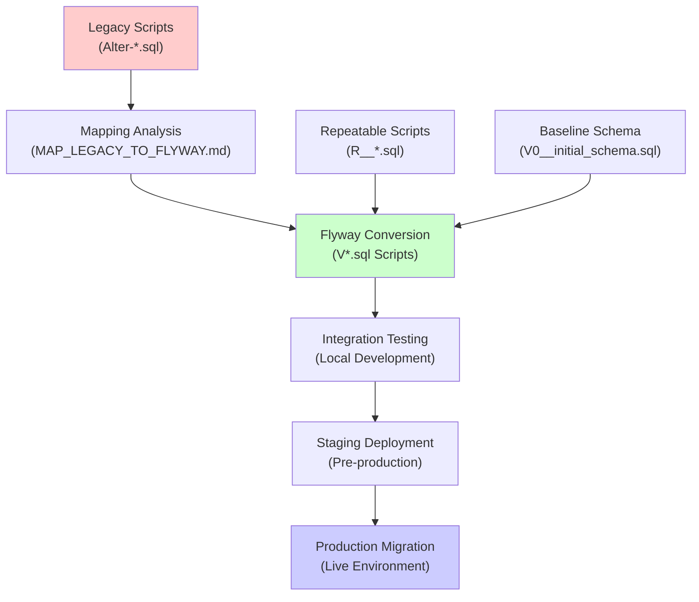

# Database Migration Strategy

<cite>
**Referenced Files in This Document**
- [MAP_LEGACY_TO_FLYWAY.md](file://db/migration/MAP_LEGACY_TO_FLYWAY.md)
- [README.md](file://db/migration/README.md)
- [pom.xml](file://pom.xml)
- [MIGRATION_PLAN.md](file://MIGRATION_PLAN.md)
- [MIGRATION_STEPS.md](file://MIGRATION_STEPS.md)
- [V0__initial_schema.sql](file://db/migration/V0__initial_schema.sql)
- [V1_1_2__alter.sql](file://db/migration/V1_1_2__alter.sql)
- [V1_2_1__alter.sql](file://db/migration/V1_2_1__alter.sql)
- [V2_0_1__alter.sql](file://db/migration/V2_0_1__alter.sql)
- [V2_4_1__alter.sql](file://db/migration/V2_4_1__alter.sql)
- [V2_4_5__alter.sql](file://db/migration/V2_4_5__alter.sql)
- [R__active_indexes.sql](file://db/migration/R__active_indexes.sql)
- [Alter-1.1.2.sql](file://db/Alter-1.1.2.sql)
- [Alter-2.0.1.sql](file://db/Alter-2.0.1.sql)
</cite>

## Table of Contents
1. [Introduction](#introduction)
2. [Migration Strategy Overview](#migration-strategy-overview)
3. [Legacy to Flyway Mapping](#legacy-to-flyway-mapping)
4. [Flyway Configuration](#flyway-configuration)
5. [Migration Script Organization](#migration-script-organization)
6. [Conversion Patterns](#conversion-patterns)
7. [Data Migration Strategies](#data-migration-strategies)
8. [Testing and Validation](#testing-and-validation)
9. [Rollback Procedures](#rollback-procedures)
10. [Team-Based Migration Management](#team-based-migration-management)
11. [Best Practices](#best-practices)
12. [Troubleshooting Guide](#troubleshooting-guide)

## Introduction

This document outlines the comprehensive database migration strategy for transitioning from legacy SQL scripts to Flyway-based schema management in the DCL LINTERA application. The migration process involves converting hundreds of legacy Alter-*.sql scripts into Flyway-compatible V*.sql migration files while maintaining data integrity and ensuring backward compatibility.

The migration strategy addresses several key challenges:
- **Version Control**: Establishing a structured approach to database schema evolution
- **Data Safety**: Ensuring zero data loss during migration transitions
- **Team Coordination**: Managing concurrent development with shared databases
- **Environment Consistency**: Maintaining identical schema states across development, staging, and production environments

## Migration Strategy Overview

The migration follows a phased approach that preserves existing functionality while establishing modern database management practices:



**Diagram sources**
- [MAP_LEGACY_TO_FLYWAY.md](file://db/migration/MAP_LEGACY_TO_FLYWAY.md#L1-L240)
- [README.md](file://db/migration/README.md#L1-L63)

### Migration Phases

1. **Discovery Phase**: Analyze existing legacy scripts and establish mapping patterns
2. **Conversion Phase**: Transform legacy scripts into Flyway-compliant format
3. **Validation Phase**: Test migrations in isolated environments
4. **Deployment Phase**: Execute migrations in production with rollback capabilities
5. **Monitoring Phase**: Track migration performance and resolve issues

**Section sources**
- [MIGRATION_PLAN.md](file://MIGRATION_PLAN.md#L1-L102)
- [MIGRATION_STEPS.md](file://MIGRATION_STEPS.md#L1-L206)

## Legacy to Flyway Mapping

The mapping strategy defines clear conventions for converting legacy SQL scripts to Flyway format, ensuring consistency and maintainability.

### Naming Convention Mapping

| Legacy Pattern | Flyway Pattern | Example |
|----------------|----------------|---------|
| `Alter-X.Y.Z.sql` | `VX_Y_Z__alter.sql` | `Alter-1.1.2.sql` → `V1_1_2__alter.sql` |
| `Alter-X.Y.Z_suffix.sql` | `VX_Y_Z__alter_suffix.sql` | `Alter-1.2.10_fix.sql` → `V1_2_10__alter_fix.sql` |
| `create_db.sql` | `V0__initial_schema.sql` | Baseline schema script |
| `*.sql` (utility) | `R__name.sql` | Repeatable utility scripts |

### Versioning Strategy

Flyway uses semantic versioning with the following format:
- **Major.Minor.Patch**: Reflects the application version
- **Underscores**: Separate version components (`V1_1_2`)
- **Double Underscore**: Separates version from description (`V1_1_2__alter`)

### Script Categories

1. **Versioned Scripts** (`V*.sql`): One-time changes that modify schema structure
2. **Repeatable Scripts** (`R__*.sql`): Utility scripts that can be reapplied (requires manual review)
3. **Baseline Script** (`V0__initial_schema.sql`): Initial schema definition

**Section sources**
- [MAP_LEGACY_TO_FLYWAY.md](file://db/migration/MAP_LEGACY_TO_FLYWAY.md#L1-L240)

## Flyway Configuration

The Flyway integration is configured through Maven profiles, providing flexible deployment options without hardcoding credentials.

### Maven Profile Configuration

```xml
<profile>
  <id>db-migrate</id>
  <build>
    <plugins>
      <plugin>
        <groupId>org.flywaydb</groupId>
        <artifactId>flyway-maven-plugin</artifactId>
        <version>9.22.3</version>
        <configuration>
          <locations>
            <location>filesystem:${project.basedir}/db/migration</location>
          </locations>
          <validateOnMigrate>true</validateOnMigrate>
          <baselineOnMigrate>true</baselineOnMigrate>
        </configuration>
      </plugin>
    </plugins>
  </build>
</profile>
```

### Database Connection Management

Flyway credentials are passed as runtime parameters to maintain security:
- **URL**: Database connection string
- **User**: Database username
- **Password**: Database password

### Supported Databases

The configuration supports multiple database systems:
- **Firebird**: Primary database with JDBC driver `org.firebirdsql.jdbc.FBDriver`
- **PostgreSQL**: Alternative database with JDBC driver `org.postgresql.Driver`
- **Oracle**: Enterprise database with JDBC driver `oracle.jdbc.OracleDriver`

**Section sources**
- [pom.xml](file://pom.xml#L145-L180)
- [README.md](file://db/migration/README.md#L35-L50)

## Migration Script Organization

The migration scripts are organized in a hierarchical structure that reflects the application's evolution and maintains logical separation.

### Directory Structure

```
db/migration/
├── V0__initial_schema.sql          # Baseline schema
├── V1_1_2__alter.sql               # First major version changes
├── V1_2_1__alter.sql               # Second major version changes
├── V2_0_1__alter.sql               # Major refactoring
├── V2_4_1__alter.sql               # Latest version changes
├── R__active_indexes.sql           # Repeatable utility scripts
├── R__default_users.sql
├── R__delete_closed.sql
└── MAP_LEGACY_TO_FLYWAY.md         # Mapping documentation
```

### Script Dependencies

Migration scripts are designed with dependencies in mind:
- **Sequential Execution**: Scripts execute in version order
- **Atomic Operations**: Each script contains related changes
- **Idempotent Design**: Scripts can be safely rerun

### Script Content Patterns

Each migration script follows a consistent structure:

```sql
-- Flyway V*.x.x script
-- Source: Legacy script reference
-- Generated: Timestamp
-- Notes: Manual review required

SET TERM ^ ;

-- Schema modifications
ALTER TABLE table_name ADD column_name datatype;
CREATE INDEX index_name ON table_name(column);

-- Data transformations
UPDATE table_name SET column = value WHERE condition;

-- Stored procedures and functions
CREATE PROCEDURE procedure_name(...) RETURNS (...) AS
BEGIN
  -- Procedure logic
END^

COMMIT WORK^
```

**Section sources**
- [V0__initial_schema.sql](file://db/migration/V0__initial_schema.sql#L1-L800)
- [V1_1_2__alter.sql](file://db/migration/V1_1_2__alter.sql#L1-L202)

## Conversion Patterns

Understanding conversion patterns helps maintain consistency when migrating new legacy scripts to Flyway format.

### Basic Conversion Template

**Legacy Script Pattern:**
```sql
-- Legacy Alter-*.sql
ALTER TABLE table_name ADD column_name datatype;
UPDATE table_name SET column = value WHERE condition;
CREATE INDEX index_name ON table_name(column);
```

**Flyway Conversion:**
```sql
-- Flyway V*.x.x__description.sql
SET TERM ^ ;

ALTER TABLE table_name ADD column_name datatype;
^

COMMIT WORK
^

UPDATE table_name SET column = value WHERE condition;
^

COMMIT WORK
^

CREATE INDEX index_name ON table_name(column);
^

COMMIT WORK
^

SET TERM ; ^
```

### Complex Migration Patterns

#### Adding New Tables with Constraints

**Legacy Approach:**
```sql
CREATE TABLE new_table (
    id INTEGER PRIMARY KEY,
    name VARCHAR(100),
    created_date TIMESTAMP
);

CREATE INDEX idx_name ON new_table(name);
ALTER TABLE existing_table ADD new_table_id INTEGER;
ALTER TABLE existing_table ADD CONSTRAINT fk_new_table FOREIGN KEY (new_table_id) REFERENCES new_table(id);
```

**Flyway Conversion:**
```sql
-- Add new table with constraints
CREATE TABLE new_table (
    id INTEGER NOT NULL,
    name VARCHAR(100),
    created_date TIMESTAMP
);

ALTER TABLE new_table ADD CONSTRAINT pk_new_table PRIMARY KEY (id);

CREATE INDEX idx_name ON new_table(name);

-- Add foreign key to existing table
ALTER TABLE existing_table ADD new_table_id INTEGER;
ALTER TABLE existing_table ADD CONSTRAINT fk_new_table FOREIGN KEY (new_table_id) REFERENCES new_table(id);
```

#### Stored Procedure Modifications

**Legacy Pattern:**
```sql
ALTER PROCEDURE old_procedure(
    param1 INTEGER,
    param2 VARCHAR(50)
) RETURNS (result INTEGER) AS
BEGIN
    -- Procedure logic
END
```

**Flyway Conversion:**
```sql
-- Drop and recreate procedure
DROP PROCEDURE old_procedure;
^

CREATE PROCEDURE old_procedure(
    param1 INTEGER,
    param2 VARCHAR(50)
) RETURNS (result INTEGER) AS
BEGIN
    -- Updated procedure logic
END^

COMMIT WORK^
```

### Data Migration Patterns

#### Bulk Data Updates

**Legacy Approach:**
```sql
UPDATE orders SET status = 'PROCESSED' WHERE status = 'PENDING';
```

**Flyway Conversion:**
```sql
-- Safe bulk update with transaction
BEGIN TRANSACTION;

UPDATE orders SET status = 'PROCESSED' WHERE status = 'PENDING';

COMMIT;
```

#### Data Validation and Cleanup

**Legacy Pattern:**
```sql
DELETE FROM contractors WHERE unp = '';
```

**Flyway Conversion:**
```sql
-- Validate and clean data
BEGIN TRANSACTION;

-- Remove invalid records
DELETE FROM contractors WHERE unn = '';

-- Add constraints to prevent future issues
ALTER TABLE contractors ADD CONSTRAINT chk_unp_not_empty CHECK (unn <> '');

COMMIT;
```

**Section sources**
- [V1_1_2__alter.sql](file://db/migration/V1_1_2__alter.sql#L1-L202)
- [V2_0_1__alter.sql](file://db/migration/V2_0_1__alter.sql#L1-L800)

## Data Migration Strategies

Effective data migration requires careful planning to preserve data integrity while transforming schema structures.

### Data Preservation Techniques

#### Backup and Restore Strategy

```sql
-- Pre-migration backup
CREATE TABLE backup_orders AS SELECT * FROM orders WHERE 1=0;
INSERT INTO backup_orders SELECT * FROM orders;

-- Migration with validation
BEGIN TRANSACTION;

-- Perform schema changes
ALTER TABLE orders ADD new_column VARCHAR(100);

-- Migrate data
UPDATE orders SET new_column = old_column WHERE old_column IS NOT NULL;

-- Validate data integrity
IF EXISTS (SELECT 1 FROM orders WHERE new_column IS NULL AND old_column IS NOT NULL) THEN
BEGIN
    ROLLBACK;
    RAISE EXCEPTION 'Data migration failed';
END

COMMIT;
```

#### Incremental Migration Approach

For large datasets, incremental migration prevents long-running transactions:

```sql
-- Process data in batches
DECLARE @batch_size INTEGER = 1000;
DECLARE @processed_rows INTEGER = 0;

WHILE @processed_rows < (SELECT COUNT(*) FROM orders WHERE migrated = 0)
BEGIN
    UPDATE TOP (@batch_size) orders 
    SET new_status = 'MIGRATED'
    WHERE migrated = 0;
    
    SET @processed_rows = @processed_rows + @batch_size;
    
    COMMIT;
END
```

### Data Type Conversions

#### String Length Adjustments

**Legacy Pattern:**
```sql
ALTER TABLE customers ALTER COLUMN name TYPE VARCHAR(200);
```

**Flyway Conversion:**
```sql
-- Preserve data during type conversion
ALTER TABLE customers ADD name_new VARCHAR(200);

UPDATE customers SET name_new = LEFT(name, 200);

ALTER TABLE customers DROP COLUMN name;
ALTER TABLE customers ADD name VARCHAR(200);
ALTER TABLE customers ALTER COLUMN name TYPE VARCHAR(200);

UPDATE customers SET name = name_new;
ALTER TABLE customers DROP COLUMN name_new;
```

#### Numeric Precision Changes

**Legacy Pattern:**
```sql
ALTER TABLE prices ALTER COLUMN amount TYPE DECIMAL(15,4);
```

**Flyway Conversion:**
```sql
-- Handle precision loss carefully
ALTER TABLE prices ADD amount_new DECIMAL(15,4);

UPDATE prices SET amount_new = ROUND(amount, 4);

ALTER TABLE prices DROP COLUMN amount;
ALTER TABLE prices ADD amount DECIMAL(15,4);

UPDATE prices SET amount = amount_new;
ALTER TABLE prices DROP COLUMN amount_new;
```

### Index Management During Migration

#### Creating New Indexes

```sql
-- Create indexes before heavy data operations
CREATE INDEX idx_customer_email ON customers(email);

-- Perform data operations
UPDATE customers SET email = LOWER(email);

-- Create additional indexes after data operations
CREATE INDEX idx_customer_last_name ON customers(last_name);
```

#### Dropping Unused Indexes

```sql
-- Drop indexes before bulk operations
DROP INDEX idx_old_unused;

-- Perform bulk operations
DELETE FROM old_data WHERE created_date < '2020-01-01';

-- Recreate indexes after operations
CREATE INDEX idx_old_unused ON old_data(unused_column);
```

**Section sources**
- [V1_2_1__alter.sql](file://db/migration/V1_2_1__alter.sql#L1-L800)
- [R__active_indexes.sql](file://db/migration/R__active_indexes.sql#L1-L265)

## Testing and Validation

Comprehensive testing ensures migration reliability and data integrity across all environments.

### Validation Commands

#### Information Command
```bash
mvn -f dcl-3-new/pom.xml -P db-migrate \
  -Dflyway.url=jdbc:firebirdsql://localhost:3050/db.fdb \
  -Dflyway.user=sysdba \
  -Dflyway.password=masterkey \
  flyway:info
```

#### Validation Command
```bash
mvn -f dcl-3-new/pom.xml -P db-migrate \
  -Dflyway.url=jdbc:firebirdsql://localhost:3050/db.fdb \
  -Dflyway.user=sysdba \
  -Dflyway.password=masterkey \
  flyway:validate
```

#### Baseline Command
```bash
mvn -f dcl-3-new/pom.xml -P db-migrate \
  -Dflyway.url=jdbc:firebirdsql://localhost:3050/db.fdb \
  -Dflyway.user=sysdba \
  -Dflyway.password=masterkey \
  -Dflyway.baselineVersion=0 \
  flyway:baseline
```

#### Migration Command
```bash
mvn -f dcl-3-new/pom.xml -P db-migrate \
  -Dflyway.url=jdbc:firebirdsql://localhost:3050/db.fdb \
  -Dflyway.user=sysdba \
  -Dflyway.password=masterkey \
  flyway:migrate
```

### Testing Strategies

#### Unit Testing Approach

```sql
-- Test individual migration scripts
BEGIN TRANSACTION;

-- Apply migration
@migration_script.sql

-- Validate results
ASSERT (SELECT COUNT(*) FROM information_schema.tables WHERE table_name = 'new_table') = 1;
ASSERT (SELECT COUNT(*) FROM new_table) = 0;

ROLLBACK;
```

#### Integration Testing

```sql
-- Test complete migration flow
BEGIN TRANSACTION;

-- Apply all migrations
@V0__initial_schema.sql
@V1_1_2__alter.sql
@V1_2_1__alter.sql

-- Validate final schema state
ASSERT (SELECT COUNT(*) FROM information_schema.columns WHERE table_name = 'orders') = 15;
ASSERT (SELECT COUNT(*) FROM orders WHERE status = 'PROCESSED') = 1000;

COMMIT;
```

#### Data Integrity Testing

```sql
-- Verify referential integrity
SELECT COUNT(*) 
FROM orders o
LEFT JOIN customers c ON o.customer_id = c.id
WHERE c.id IS NULL;

-- Check for orphaned records
SELECT COUNT(*)
FROM order_items oi
LEFT JOIN orders o ON oi.order_id = o.id
WHERE o.id IS NULL;
```

### Environment Testing Matrix

| Environment | Testing Focus | Validation Level |
|-------------|---------------|------------------|
| Development | Basic functionality | Unit tests |
| Staging | Production-like conditions | Integration tests |
| Production | Business continuity | Full validation |

**Section sources**
- [README.md](file://db/migration/README.md#L25-L45)

## Rollback Procedures

Rollback procedures ensure system stability when migration issues arise.

### Automatic Rollback Triggers

Flyway provides automatic rollback capabilities for failed migrations:

```sql
-- Flyway automatically handles transaction rollback
BEGIN TRANSACTION;

-- Migration operations
ALTER TABLE orders ADD new_column VARCHAR(100);
UPDATE orders SET new_column = 'default_value';

-- If any statement fails, Flyway rolls back the entire transaction
```

### Manual Rollback Procedures

#### Step-by-Step Rollback

1. **Stop Application**: Halt all application instances
2. **Backup Database**: Create immediate backup
3. **Identify Failed Migration**: Determine which migration caused the issue
4. **Execute Rollback**: Run rollback commands manually
5. **Verify Recovery**: Confirm system functionality
6. **Restart Application**: Bring system back online

#### Rollback Script Template

```sql
-- Rollback V1_1_2__alter.sql
SET TERM ^ ;

-- Drop newly added columns
ALTER TABLE orders DROP COLUMN new_column;
^

COMMIT WORK
^

-- Drop new tables
DROP TABLE new_table;
^

COMMIT WORK
^

-- Restore indexes
CREATE INDEX idx_old_name ON orders(old_name);
^

COMMIT WORK
^

SET TERM ; ^
```

### Partial Rollback Strategy

For complex migrations, partial rollback may be necessary:

```sql
-- Rollback specific changes from V1_2_1__alter.sql
BEGIN TRANSACTION;

-- Undo data transformations
UPDATE orders SET status = 'PENDING' WHERE status = 'PROCESSED';

-- Drop new constraints
ALTER TABLE orders DROP CONSTRAINT fk_new_table;

-- Restore original columns
ALTER TABLE orders ADD old_column VARCHAR(50);

COMMIT;
```

### Rollback Testing

```sql
-- Test rollback functionality
BEGIN TRANSACTION;

-- Apply migration
@V1_2_1__alter.sql

-- Attempt rollback
@V1_2_1__alter__rollback.sql

-- Verify system state
ASSERT (SELECT COUNT(*) FROM orders WHERE status = 'PENDING') = original_count;

COMMIT;
```

## Team-Based Migration Management

Coordinating database migrations in team environments requires careful planning and communication.

### Branching Strategy

#### Feature Branch Approach

```bash
# Create feature branch
git checkout -b feature/database-migration

# Make migration changes
git add db/migration/V1_3_0__new_features.sql
git commit -m "feat(db): add new features migration"

# Review and merge
git checkout main
git merge feature/database-migration
```

#### Migration Freeze Periods

Establish freeze periods during critical releases:
- **Code Freeze**: Stop new feature development
- **Migration Freeze**: Prevent new migration scripts
- **Testing Freeze**: Complete testing phase

### Conflict Resolution

#### Version Conflicts

When multiple developers work on migrations:

```sql
-- Base migration
CREATE TABLE base_table (id INTEGER PRIMARY KEY);

-- Developer A's migration
ALTER TABLE base_table ADD column_a VARCHAR(100);

-- Developer B's migration  
ALTER TABLE base_table ADD column_b VARCHAR(100);

-- Resolved merged migration
ALTER TABLE base_table ADD column_a VARCHAR(100);
ALTER TABLE base_table ADD column_b VARCHAR(100);
```

#### Data Conflicts

```sql
-- Check for conflicting data operations
BEGIN TRANSACTION;

-- Developer A: Update specific records
UPDATE users SET status = 'ACTIVE' WHERE department = 'IT';

-- Developer B: Update different records
UPDATE users SET status = 'ACTIVE' WHERE department = 'HR';

-- Combined migration with conflict resolution
UPDATE users SET status = 'ACTIVE' 
WHERE department IN ('IT', 'HR');

COMMIT;
```

### Communication Protocols

#### Migration Planning Meeting

1. **Review Schedule**: Discuss deployment timeline
2. **Identify Dependencies**: Map migration dependencies
3. **Risk Assessment**: Evaluate potential issues
4. **Rollback Plan**: Prepare emergency procedures

#### Change Notification

```bash
# Notify team of migration
echo "Database migration V1.3.0 scheduled for 2024-01-15 at 02:00 UTC"
```

### Shared Environment Management

#### Database Locking

```sql
-- Prevent concurrent migrations
CREATE TABLE migration_lock (locked BOOLEAN DEFAULT FALSE);

-- Acquire lock
UPDATE migration_lock SET locked = TRUE WHERE locked = FALSE;

-- Release lock
UPDATE migration_lock SET locked = FALSE;
```

#### Environment Synchronization

```bash
# Sync database state across environments
flyway:info -Dflyway.url=jdbc:firebirdsql://dev-db
flyway:info -Dflyway.url=jdbc:firebirdsql://staging-db
flyway:info -Dflyway.url=jdbc:firebirdsql://prod-db
```

## Best Practices

Following established best practices ensures reliable and maintainable database migrations.

### Script Design Principles

#### Idempotency

```sql
-- Safe CREATE TABLE with idempotency check
IF NOT EXISTS (SELECT 1 FROM information_schema.tables WHERE table_name = 'new_table') THEN
BEGIN
    CREATE TABLE new_table (id INTEGER PRIMARY KEY);
END
```

#### Atomic Operations

```sql
-- Group related changes in single transaction
BEGIN TRANSACTION;

-- Create table
CREATE TABLE new_table (id INTEGER PRIMARY KEY);

-- Add constraints
ALTER TABLE new_table ADD CONSTRAINT chk_positive CHECK (id > 0);

-- Create indexes
CREATE INDEX idx_name ON new_table(name);

COMMIT;
```

#### Clear Documentation

```sql
-- Flyway V1_3_0__enhanced_security.sql
-- Source: Legacy security audit requirements
-- Generated: 2024-01-15 10:30:00
-- Notes: Added encryption for sensitive data

SET TERM ^ ;

-- Add encryption column
ALTER TABLE users ADD encrypted_password VARCHAR(255);
^

COMMIT WORK
^

-- Migrate existing passwords
UPDATE users SET encrypted_password = encrypt_password(password);
^

COMMIT WORK
^

-- Drop old password column
ALTER TABLE users DROP COLUMN password;
^

COMMIT WORK
^

SET TERM ; ^
```

### Performance Optimization

#### Batch Processing

```sql
-- Efficient bulk updates
DECLARE @batch_size INT = 1000;
DECLARE @processed INT = 0;

WHILE @processed < (SELECT COUNT(*) FROM large_table)
BEGIN
    UPDATE TOP (@batch_size) large_table 
    SET processed = 1 
    WHERE processed = 0;
    
    SET @processed = @processed + @batch_size;
    
    -- Allow other operations
    WAITFOR DELAY '00:00:01';
END
```

#### Index Optimization

```sql
-- Create indexes before heavy operations
CREATE INDEX idx_customer_email ON customers(email);

-- Perform data operations
UPDATE customers SET email = LOWER(email);

-- Drop unnecessary indexes
DROP INDEX idx_old_email;
```

### Security Considerations

#### Credential Management

```bash
# Use environment variables for credentials
export FLYWAY_URL="jdbc:firebirdsql://localhost:3050/db.fdb"
export FLYWAY_USER="sysdba"
export FLYWAY_PASSWORD="secure_password"

# Execute migration
mvn -P db-migrate flyway:migrate
```

#### Access Control

```sql
-- Limit migration permissions
GRANT CREATE, ALTER, DROP ON SCHEMA public TO migration_user;
REVOKE ALL PRIVILEGES ON system_tables FROM migration_user;
```

### Monitoring and Maintenance

#### Migration Tracking

```sql
-- Track migration history
CREATE TABLE flyway_migration_history (
    version VARCHAR(50) PRIMARY KEY,
    applied_on TIMESTAMP DEFAULT CURRENT_TIMESTAMP,
    status VARCHAR(20),
    duration_ms INTEGER
);
```

#### Performance Monitoring

```sql
-- Monitor migration performance
SELECT 
    version,
    applied_on,
    duration_ms,
    CASE 
        WHEN duration_ms > 30000 THEN 'SLOW'
        ELSE 'OK'
    END AS performance_status
FROM flyway_migration_history
ORDER BY applied_on DESC;
```

**Section sources**
- [README.md](file://db/migration/README.md#L10-L25)

## Troubleshooting Guide

Common issues and their solutions during database migration processes.

### Common Issues and Solutions

#### Migration Failures

**Problem**: Migration fails with constraint violation
```
ERROR: Unique constraint violation on table X
```

**Solution**:
```sql
-- Check for duplicate data
SELECT column_name, COUNT(*)
FROM table_name
GROUP BY column_name
HAVING COUNT(*) > 1;

-- Clean up duplicates
WITH duplicates AS (
    SELECT id, ROW_NUMBER() OVER (PARTITION BY column_name ORDER BY id) as rn
    FROM table_name
)
DELETE FROM table_name
WHERE id IN (SELECT id FROM duplicates WHERE rn > 1);
```

#### Performance Issues

**Problem**: Migration takes too long
```
Migration V1_2_1__alter.sql took 45 minutes
```

**Solution**:
```sql
-- Optimize with batch processing
DECLARE @batch_size INT = 1000;
DECLARE @total INT = (SELECT COUNT(*) FROM large_table);
DECLARE @processed INT = 0;

WHILE @processed < @total
BEGIN
    UPDATE TOP (@batch_size) large_table
    SET new_column = calculated_value
    WHERE new_column IS NULL;
    
    SET @processed = @processed + @batch_size;
    
    -- Report progress
    PRINT CONCAT('Processed ', @processed, ' of ', @total);
END
```

#### Data Corruption

**Problem**: Data becomes corrupted during migration
```
ERROR: Data type mismatch in column X
```

**Solution**:
```sql
-- Validate data before migration
SELECT COUNT(*)
FROM table_name
WHERE TRY_CAST(column_name AS DECIMAL(15,2)) IS NULL
AND column_name IS NOT NULL;

-- Fix problematic data
UPDATE table_name
SET column_name = NULL
WHERE TRY_CAST(column_name AS DECIMAL(15,2)) IS NULL
AND column_name IS NOT NULL;
```

### Debugging Tools

#### Migration History Analysis

```sql
-- Analyze migration history
SELECT 
    version,
    applied_on,
    status,
    duration_ms,
    CASE 
        WHEN status = 'FAILED' THEN 'Investigate'
        WHEN duration_ms > 60000 THEN 'Optimize'
        ELSE 'OK'
    END AS recommendation
FROM flyway_migration_history
ORDER BY applied_on DESC;
```

#### Dependency Analysis

```sql
-- Check migration dependencies
SELECT 
    version,
    LEAD(version) OVER (ORDER BY version) as next_version,
    DATEDIFF(MINUTE, applied_on, LEAD(applied_on) OVER (ORDER BY version)) as gap_minutes
FROM flyway_migration_history
ORDER BY version;
```

### Recovery Procedures

#### Emergency Rollback

```bash
# Emergency rollback procedure
mvn -P db-migrate \
  -Dflyway.url=${DB_URL} \
  -Dflyway.user=${DB_USER} \
  -Dflyway.password=${DB_PASS} \
  -Dflyway.undo=true \
  flyway:migrate
```

#### Data Recovery

```sql
-- Recover from backup
RESTORE DATABASE FROM '/backup/full_backup.fbk'
TO '/database/new_database.fdb';

-- Apply pending migrations
flyway:migrate -Dflyway.url=${RESTORED_DB_URL};
```

**Section sources**
- [README.md](file://db/migration/README.md#L50-L63)