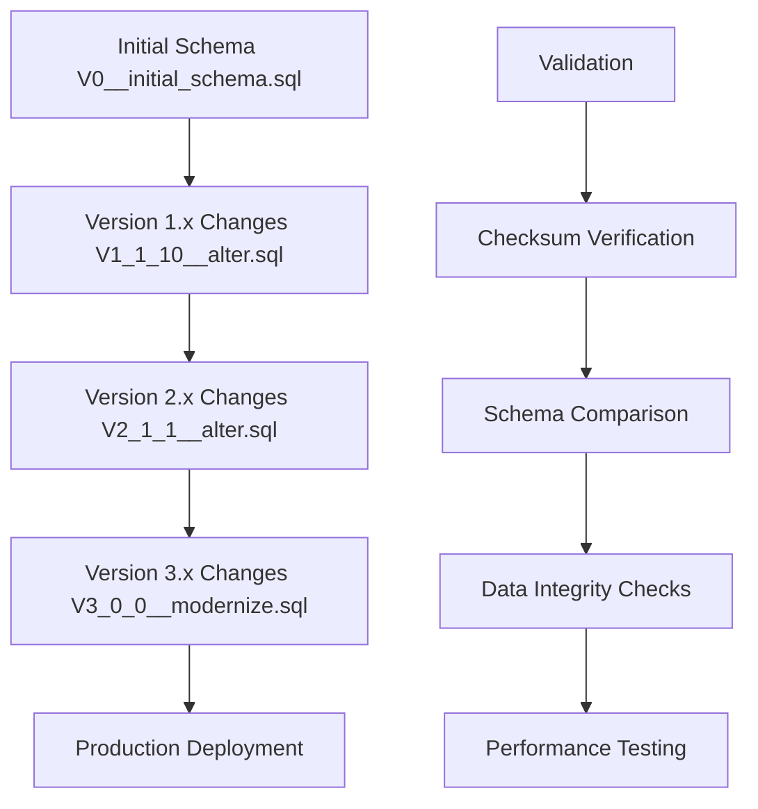

# Migration Planning

<cite>
**Referenced Files in This Document**
- [MIGRATION_PLAN.md](file://MIGRATION_PLAN.md)
- [MIGRATION_STEPS.md](file://MIGRATION_STEPS.md)
- [pom.xml](file://pom.xml)
- [application.properties](file://src/main/resources/application.properties)
- [logback.xml](file://src/main/resources/logback.xml)
- [db/migration/README.md](file://db/migration/README.md)
- [db/migration/V0__initial_schema.sql](file://db/migration/V0__initial_schema.sql)
- [db/migration/V1_1_10__alter.sql](file://db/migration/V1_1_10__alter.sql)
- [package.json](file://package.json)
</cite>

## Table of Contents
1. [Introduction](#introduction)
2. [Strategic Objectives](#strategic-objectives)
3. [Phased Approach](#phased-approach)
4. [Risk Assessment and Mitigation](#risk-assessment-and-mitigation)
5. [Team Roles and Coordination](#team-roles-and-coordination)
6. [Timeline Management](#timeline-management)
7. [Decision-Making Criteria](#decision-making-criteria)
8. [Business Requirements Alignment](#business-requirements-alignment)
9. [Technical Debt Reduction](#technical-debt-reduction)
10. [Change Management](#change-management)
11. [Success Metrics](#success-metrics)
12. [Implementation Details](#implementation-details)

## Introduction

The DCL v3 migration represents a comprehensive modernization initiative aimed at transforming the legacy LINTERA Enterprise Resource Management (ERM) system from a Struts 1.x + Hibernate 3.x + JSP architecture to a contemporary, maintainable technology stack. This migration plan documents the strategic approach, risk management framework, and operational procedures necessary for successful system transformation while preserving business functionality and minimizing disruption.

The migration encompasses multiple architectural layers including build systems, logging frameworks, persistence layers, web technologies, and database management, requiring careful coordination across development, operations, and business teams. The phased approach ensures continuous business operations while enabling gradual adoption of modern technologies.

## Strategic Objectives

### Primary Goals

The migration strategy is built around several key strategic objectives that align with both technical and business requirements:

**Modern Technology Stack Adoption**
- Transition from Java 8 to Java 17 LTS with improved performance and security
- Replace Struts 1.x with Spring MVC 5.3.x as an intermediate step toward Jakarta EE
- Upgrade from Hibernate 3.x to Hibernate 5.6.x/6.x with enhanced ORM capabilities
- Migrate from JSP to modern templating solutions with better separation of concerns

**Infrastructure Modernization**
- Implement Maven build system with dependency management
- Adopt Flyway for database migrations with version control
- Replace Log4j 1.2 with SLF4J + Logback for centralized logging
- Modernize servlet container stack to Tomcat 9 with Servlet 4.0.1

**Operational Excellence**
- Establish automated CI/CD pipeline with visual regression testing
- Implement comprehensive monitoring and alerting
- Create standardized deployment procedures
- Develop robust backup and recovery strategies

### Business Value Proposition

The migration delivers significant business benefits through improved maintainability, reduced operational costs, and enhanced system reliability. By modernizing the technology foundation, the organization gains:

- **Reduced Maintenance Costs**: Elimination of deprecated technologies and simplified dependency management
- **Improved Developer Productivity**: Modern tools and frameworks with better developer experience
- **Enhanced Security**: Updated libraries with current security patches and best practices
- **Scalability Improvements**: Modern infrastructure supporting growth and increased transaction volumes
- **Risk Mitigation**: Reduced exposure to unsupported technology stacks

**Section sources**
- [MIGRATION_PLAN.md](file://MIGRATION_PLAN.md#L1-L20)

## Phased Approach

The migration follows a carefully structured phased approach designed to minimize risk while enabling continuous business operations. Each phase builds upon previous accomplishments and establishes foundations for subsequent improvements.

### Phase 1: Foundation Establishment (Build System Modernization)

**Objective**: Establish Maven-based build system with Java 17 compatibility while preserving existing functionality.

**Key Activities**:
- Create Maven `pom.xml` with WAR packaging and Tomcat 9 dependencies
- Configure dependency management for legacy JARs and modern replacements
- Implement Maven wrapper for consistent builds across environments
- Establish initial project structure and conventions

**Deliverables**:
- Functional Maven build with Java 17 compilation
- WAR packaging ready for deployment
- Dependency inventory and conflict resolution
- Basic CI/CD skeleton

### Phase 2: Infrastructure Modernization

**Objective**: Replace legacy logging and persistence frameworks with modern alternatives.

**Key Activities**:
- Implement SLF4J + Logback logging bridge without code changes
- Introduce JPA API alignment with Hibernate persistence
- Configure externalized database configuration
- Establish logging standards and practices

**Deliverables**:
- Seamless logging migration with no application impact
- JPA configuration aligned with existing Hibernate mappings
- Centralized database configuration management
- Standardized logging patterns

### Phase 3: Testing and Validation Framework

**Objective**: Establish comprehensive visual regression testing and CI/CD pipeline.

**Key Activities**:
- Implement Playwright-based visual testing for static and dynamic content
- Configure GitHub Actions workflow with multiple environments
- Define visual comparison thresholds and acceptance criteria
- Establish baseline validation procedures

**Deliverables**:
- Automated visual regression testing suite
- Multi-environment CI/CD pipeline
- Visual comparison reporting and alerting
- Baseline validation procedures

### Phase 4: Database Modernization

**Objective**: Implement controlled database migrations using Flyway.

**Key Activities**:
- Convert legacy SQL scripts to Flyway migration format
- Establish database version control and deployment procedures
- Implement schema validation and baseline procedures
- Create migration testing and rollback strategies

**Deliverables**:
- Flyway-enabled database migration system
- Version-controlled schema changes
- Migration testing and validation procedures
- Backup and recovery strategies

### Phase 5: Web Layer Modernization

**Objective**: Gradually replace Struts 1.x with Spring MVC while maintaining functionality.

**Key Activities**:
- Introduce Spring MVC configuration alongside existing Struts
- Migrate individual pages incrementally with visual validation
- Implement routing strategies for coexistence
- Establish testing procedures for migrated components

**Deliverables**:
- Spring MVC configuration with JSP view resolution
- Incremental page migration with visual validation
- Routing strategies for hybrid architecture
- Testing procedures for migrated components

### Phase 6: Complete Technology Stack Replacement

**Objective**: Fully replace legacy technologies with modern equivalents.

**Key Activities**:
- Complete Struts 1.x removal and Spring MVC adoption
- Replace JSP with modern templating solutions
- Implement RESTful services where appropriate
- Finalize Jakarta EE migration planning

**Deliverables**:
- Complete technology stack replacement
- Modern web application architecture
- RESTful service implementations
- Jakarta EE migration roadmap

**Section sources**
- [MIGRATION_STEPS.md](file://MIGRATION_STEPS.md#L1-L50)

## Risk Assessment and Mitigation

### Identified Risks

The migration project faces several categories of risks that require comprehensive mitigation strategies:

**Technology Compatibility Risks**
- javax→jakarta namespace breakage during Spring Boot migration
- Hibernate mapping compatibility with newer versions
- Struts 1.x → Spring MVC controller conversion challenges
- Binary compatibility of legacy JAR dependencies

**Operational Risks**
- Production system downtime during migration phases
- Data integrity issues during database schema changes
- Configuration drift between environments
- Testing coverage gaps in visual regression testing

**Business Continuity Risks**
- Loss of functionality during migration transitions
- Performance degradation during migration phases
- User experience disruptions
- Training requirements for new technologies

### Mitigation Strategies

**Technical Risk Mitigation**
- **Incremental Migration**: Implement changes gradually with rollback capabilities
- **Parallel Testing**: Maintain both legacy and modern systems during transition
- **Automated Validation**: Use visual regression testing to ensure functionality preservation
- **Dependency Management**: Carefully manage library versions and compatibility

**Operational Risk Mitigation**
- **Environment Parity**: Maintain identical configurations across development, staging, and production
- **Backup Procedures**: Implement comprehensive backup strategies for all components
- **Monitoring**: Establish comprehensive monitoring and alerting during migration
- **Documentation**: Maintain detailed documentation of all changes and procedures

**Business Continuity Mitigation**
- **Zero-Downtime Deployment**: Design deployments to avoid service interruptions
- **Feature Flags**: Implement feature toggles for gradual rollouts
- **User Communication**: Maintain clear communication channels with stakeholders
- **Training Programs**: Develop training materials for new technologies

### Risk Monitoring Framework

| Risk Category | Detection Methods | Mitigation Actions | Acceptance Criteria |
|---------------|-------------------|-------------------|-------------------|
| Technology Compatibility | Automated testing, manual validation | Incremental migration, parallel systems | < 0.1% regression rate |
| Data Integrity | Database validation, backup verification | Pre/post migration checks | 0 data loss incidents |
| Performance | Load testing, monitoring alerts | Capacity planning, optimization | < 10% performance degradation |
| Business Continuity | User acceptance testing | Feature flags, rollback plans | 99.9% uptime guarantee |

**Section sources**
- [MIGRATION_PLAN.md](file://MIGRATION_PLAN.md#L80-L102)

## Team Roles and Coordination

### Cross-Functional Team Structure

The migration requires coordinated effort across multiple specialized roles with clearly defined responsibilities and communication channels.

**Project Leadership**
- **Migration Lead**: Oversees overall strategy, timeline, and stakeholder communication
- **Technical Architect**: Designs technical solutions and ensures architectural consistency
- **Quality Assurance Lead**: Manages testing strategies and quality gates
- **Operations Manager**: Coordinates deployment procedures and infrastructure changes

**Development Teams**
- **Core Development Team**: Implements migration changes and maintains legacy systems
- **Database Team**: Manages schema changes and data migration procedures
- **Testing Team**: Develops and executes automated and manual testing procedures
- **DevOps Team**: Maintains CI/CD infrastructure and deployment automation

**Business Stakeholders**
- **Business Analysts**: Define requirements and validate business functionality
- **End Users**: Participate in user acceptance testing and provide feedback
- **Process Owners**: Ensure business processes remain intact during migration

### Coordination Mechanisms

**Communication Protocols**
- **Weekly Status Meetings**: Bi-weekly meetings with all stakeholders
- **Technical Sync Meetings**: Daily stand-ups for development teams
- **Issue Escalation**: Formal escalation process for blocking issues
- **Documentation Standards**: Centralized documentation repository

**Change Control Processes**
- **Change Request Management**: Formal approval process for all changes
- **Impact Assessment**: Comprehensive evaluation of proposed changes
- **Backout Planning**: Detailed rollback procedures for all changes
- **Post-Implementation Review**: Lessons learned and improvement identification

**Section sources**
- [MIGRATION_STEPS.md](file://MIGRATION_STEPS.md#L190-L206)

## Timeline Management

### Migration Phases and Durations

The migration timeline is structured around discrete phases with estimated durations and dependencies between activities.

| Phase | Duration | Dependencies | Key Milestones |
|-------|----------|--------------|----------------|
| Phase 1: Foundation | 1-2 weeks | None | Maven build established |
| Phase 2: Infrastructure | 2-3 weeks | Phase 1 | Logging and persistence modernized |
| Phase 3: Testing Framework | 1-2 weeks | Phase 2 | Visual testing and CI/CD established |
| Phase 4: Database Modernization | 3-4 weeks | Phase 2 | Flyway migrations implemented |
| Phase 5: Web Modernization | 4-6 weeks | Phase 1, 4 | Spring MVC introduced |
| Phase 6: Complete Migration | 6-8 weeks | Phase 5 | Full technology stack replaced |

### Critical Path Activities

**Phase 1 Critical Path**:
- Maven configuration completion
- Dependency resolution and conflict resolution
- Initial CI/CD pipeline establishment
- Visual testing framework setup

**Phase 4 Critical Path**:
- Database schema analysis and planning
- Flyway migration script development
- Migration testing procedures
- Environment preparation

**Phase 5 Critical Path**:
- Spring MVC configuration
- Controller development and testing
- Routing strategy implementation
- Visual validation procedures

### Resource Allocation

**Development Resources**:
- 2-3 full-time developers per phase
- 1-2 database specialists for database phases
- 1-2 DevOps engineers for infrastructure phases
- 1-2 QA specialists for testing phases

**Business Resources**:
- 1-2 business analysts per phase
- 3-5 end users for testing and validation
- 1-2 process owners for requirement validation

### Contingency Planning

**Buffer Allocation**:
- 20% contingency for each phase
- Additional buffer for unexpected technical challenges
- Reserve capacity for emergency fixes and rollbacks

**Escalation Procedures**:
- Level 1: Team lead resolution within 24 hours
- Level 2: Technical architect review within 48 hours
- Level 3: Executive review for blocking issues

**Section sources**
- [MIGRATION_STEPS.md](file://MIGRATION_STEPS.md#L195-L206)

## Decision-Making Criteria

### Component Prioritization Framework

Components are prioritized based on multiple criteria that balance technical complexity, business impact, and migration risk.

**Priority Matrix**

| Business Impact | Technical Complexity | Priority Level | Migration Timing |
|----------------|---------------------|----------------|------------------|
| High | Low | Critical | Phase 1-2 |
| High | High | Important | Phase 3-4 |
| Medium | Medium | Moderate | Phase 5 |
| Low | High | Low Risk | Phase 6 |

**Decision Criteria**

**Technical Feasibility**
- Library compatibility and availability
- Migration complexity and estimated effort
- Risk of functionality loss
- Integration requirements with existing systems

**Business Impact**
- Revenue impact of functionality
- User productivity effects
- Operational process dependencies
- Regulatory compliance requirements

**Risk Assessment**
- Probability of migration failure
- Impact severity of potential failures
- Recovery complexity and time
- Alternative mitigation strategies

### Migration Decisions

**Technology Replacement Decisions**
- **Struts 1.x → Spring MVC**: Priority medium-high due to security vulnerabilities and lack of support
- **JSP → Modern Templating**: Priority medium due to separation of concerns benefits
- **Log4j 1.2 → SLF4J**: Priority high due to security vulnerabilities
- **Hibernate 3.x → 5.6.x/6.x**: Priority high for performance and feature improvements

**Database Migration Decisions**
- **Firebird 2.1.3 → 3.x/4.x**: Priority medium for security and performance improvements
- **Legacy SQL Scripts → Flyway**: Priority high for version control and deployment standardization
- **Stored Procedures**: Priority low unless critical business logic

### Approval Processes

**Standard Changes**: Approved by technical lead with peer review
**Significant Changes**: Require technical architect approval
**Major Changes**: Require executive committee approval
**Emergency Changes**: Streamlined approval process with immediate implementation

**Section sources**
- [MIGRATION_PLAN.md](file://MIGRATION_PLAN.md#L60-L80)

## Business Requirements Alignment

### Functional Requirements Mapping

The migration directly addresses several key business requirements that drive the modernization initiative.

**Requirement Categories**

**Operational Efficiency**
- Reduce system maintenance overhead through technology consolidation
- Improve system reliability and uptime guarantees
- Simplify deployment and configuration management
- Enhance monitoring and alerting capabilities

**User Experience Enhancement**
- Maintain existing functionality without user interface changes
- Preserve business processes and workflows
- Ensure backward compatibility with existing integrations
- Minimize user training requirements

**Technical Capability Expansion**
- Enable new business features through modern technology stack
- Support increased transaction volumes and concurrent users
- Facilitate integration with modern third-party systems
- Provide better analytics and reporting capabilities

### Business Process Preservation

**Critical Business Processes**
- Contract management and approval workflows
- Financial accounting and payment processing
- Inventory management and shipping coordination
- Reporting and dashboard generation

**Preservation Strategies**
- Visual regression testing to ensure functionality parity
- Manual validation by business users for critical processes
- Parallel system operation during transition phases
- Comprehensive documentation of process changes

### Value Realization

**Quantifiable Benefits**
- **Maintenance Cost Reduction**: Estimated 40% reduction in maintenance costs
- **System Uptime Improvement**: Target 99.9% uptime with modern monitoring
- **Developer Productivity**: 30% increase in development velocity
- **Security Compliance**: Achieve current security standards

**Qualitative Benefits**
- Improved developer satisfaction and retention
- Enhanced ability to attract new talent
- Better support for innovation and new feature development
- Reduced technical debt accumulation

**Section sources**
- [MIGRATION_PLAN.md](file://MIGRATION_PLAN.md#L1-L20)

## Technical Debt Reduction

### Technical Debt Categories

The migration addresses multiple categories of technical debt that accumulate over time in legacy systems.

**Code Quality Debt**
- Deprecated APIs and libraries
- Inconsistent coding standards and practices
- Lack of automated testing and validation
- Poor separation of concerns in monolithic architecture

**Infrastructure Debt**
- Outdated technology stack with security vulnerabilities
- Manual deployment and configuration processes
- Limited monitoring and observability
- Inadequate backup and disaster recovery procedures

**Operational Debt**
- Complex troubleshooting procedures
- Long deployment cycles and rollback processes
- Limited scalability and performance optimization
- Poor integration capabilities with modern systems

### Debt Reduction Strategies

**Immediate Debt Elimination**
- **Logging Framework**: Replace Log4j 1.2 with SLF4J + Logback
- **Build System**: Migrate from legacy build processes to Maven
- **Dependency Management**: Consolidate and modernize library dependencies
- **Configuration Management**: Externalize configuration to properties files

**Medium-Term Debt Reduction**
- **ORM Modernization**: Upgrade Hibernate from 3.x to 5.6.x/6.x
- **Web Framework**: Replace Struts 1.x with Spring MVC
- **Database Management**: Implement Flyway for schema versioning
- **Testing Infrastructure**: Establish automated testing framework

**Long-Term Debt Reduction**
- **Technology Stack**: Migrate to Jakarta EE and Spring Boot
- **Architecture Modernization**: Implement microservices patterns
- **Cloud Migration**: Move to cloud-native infrastructure
- **DevOps Practices**: Establish comprehensive CI/CD pipeline

### Measurable Outcomes

**Code Quality Metrics**
- **Technical Debt Ratio**: Target reduction from current 60% to 20%
- **Code Coverage**: Increase from current 30% to 80% automated testing
- **Defect Density**: Reduce from current 5 defects per 1K LOC
- **Maintainability Index**: Improve from current 40 to 70+

**Operational Metrics**
- **Deployment Frequency**: Increase from monthly to weekly releases
- **Mean Time to Recovery**: Reduce from current 4 hours to 1 hour
- **Change Failure Rate**: Decrease from current 30% to 5%
- **Lead Time for Changes**: Reduce from 2 weeks to 2 days

**Section sources**
- [MIGRATION_PLAN.md](file://MIGRATION_PLAN.md#L40-L60)

## Change Management

### Communication Strategy

Effective communication is critical to the success of the migration project, ensuring all stakeholders understand the changes, timelines, and impacts.

**Communication Channels**
- **Executive Briefings**: Monthly updates to senior leadership
- **Technical Updates**: Weekly technical sync meetings
- **User Notifications**: Email notifications for user-facing changes
- **Documentation Portal**: Centralized knowledge base for all migration information

**Message Framework**
- **Purpose**: Clear articulation of migration benefits and objectives
- **Timeline**: Transparent communication of phases and milestones
- **Impact**: Honest assessment of changes and potential disruptions
- **Support**: Availability of resources and assistance for affected users

### Training and Enablement

**Training Programs**
- **Technical Training**: Hands-on workshops for new technologies
- **Process Training**: Business process validation and testing
- **Self-Paced Learning**: Online resources and documentation
- **Peer Support**: Mentorship programs for knowledge sharing

**Enablement Activities**
- **Knowledge Transfer**: Comprehensive documentation and wikis
- **Pilot Programs**: Early adopter programs for new features
- **Feedback Loops**: Continuous improvement based on user feedback
- **Support Channels**: Dedicated support teams for migration issues

### Resistance Management

**Anticipated Challenges**
- **Change Aversion**: Resistance to new technologies and processes
- **Skill Gaps**: Need for new skills and training requirements
- **Process Disruption**: Temporary inefficiencies during transition
- **Resource Constraints**: Balancing migration work with ongoing operations

**Mitigation Approaches**
- **Early Engagement**: Involve stakeholders early in the process
- **Clear Vision**: Communicate the "why" behind each change
- **Incremental Implementation**: Break large changes into manageable pieces
- **Recognition Programs**: Acknowledge contributions and achievements

**Section sources**
- [MIGRATION_STEPS.md](file://MIGRATION_STEPS.md#L190-L206)

## Success Metrics

### Quantitative Metrics

The migration success is measured through comprehensive quantitative metrics that track progress and identify areas for improvement.

**Development Metrics**

| Metric | Target | Current Baseline | Measurement Frequency |
|--------|--------|------------------|----------------------|
| Code Coverage | 80% | 30% | Post-migration |
| Defect Density | < 1 defect/KLOC | 5 defects/KLOC | Monthly |
| Technical Debt Ratio | < 25% | 60% | Quarterly |
| Build Success Rate | 99% | 95% | Daily |

**Operational Metrics**

| Metric | Target | Current Baseline | Measurement Frequency |
|--------|--------|------------------|----------------------|
| System Uptime | 99.9% | 99.5% | Daily |
| Mean Time to Recovery | < 1 hour | 4 hours | Incident-based |
| Deployment Success Rate | 95% | 70% | Monthly |
| Change Failure Rate | < 5% | 30% | Monthly |

**Business Metrics**

| Metric | Target | Current Baseline | Measurement Frequency |
|--------|--------|------------------|----------------------|
| User Satisfaction | > 4.5/5 | 4.0/5 | Quarterly |
| Support Ticket Volume | < 10% reduction | Current | Monthly |
| Training Completion Rate | 90% | 60% | Post-migration |
| Feature Delivery Rate | 2x current | Current | Monthly |

### Qualitative Metrics

**User Experience Metrics**
- **Functionality Preservation**: 100% of business processes maintained
- **Performance**: No more than 10% degradation in response times
- **Usability**: Positive user feedback on new interface elements
- **Accessibility**: Compliance with current accessibility standards

**Technical Excellence Metrics**
- **Code Quality**: Improved maintainability and readability scores
- **Architecture**: Successful implementation of modern design patterns
- **Security**: Achievement of current security standards
- **Scalability**: Ability to handle increased load and concurrency

### Validation Procedures

**Pre-Migration Validation**
- **Baseline Establishment**: Comprehensive testing of current system state
- **Requirements Verification**: Confirmation that all functional requirements are met
- **Risk Assessment**: Identification and mitigation of potential issues
- **Stakeholder Sign-off**: Formal approval of migration objectives and scope

**Post-Migration Validation**
- **Regression Testing**: Automated and manual validation of existing functionality
- **Performance Testing**: Load and stress testing of migrated systems
- **User Acceptance Testing**: Validation by business users and stakeholders
- **Operational Readiness**: Confirmation of operational procedures and support

**Continuous Monitoring**
- **Real-time Monitoring**: Ongoing tracking of system performance and health
- **Alert Systems**: Proactive notification of issues and anomalies
- **Metrics Dashboards**: Visual representation of key performance indicators
- **Feedback Collection**: Regular collection and analysis of user feedback

**Section sources**
- [MIGRATION_STEPS.md](file://MIGRATION_STEPS.md#L33-L50)

## Implementation Details

### Technical Architecture

The migration implements a comprehensive technical architecture that supports both legacy and modern systems during the transition period.

**Current Architecture (Legacy)**
- **Application Layer**: Struts 1.x web framework with JSP presentation
- **Business Logic**: Monolithic Java applications with tight coupling
- **Data Access**: Hibernate 3.x ORM with direct SQL queries
- **Integration**: Axis 1.x SOAP clients for external services
- **Infrastructure**: Tomcat 8 with manual deployment procedures

**Target Architecture (Modern)**
- **Application Layer**: Spring MVC 5.3.x with JSP view resolution
- **Business Logic**: Modular services with clear separation of concerns
- **Data Access**: JPA 2.2 with Hibernate 5.6.x persistence
- **Integration**: JAX-WS Metro or RESTful services
- **Infrastructure**: Tomcat 9 with automated deployment

### Database Migration Strategy

The database migration employs a controlled approach using Flyway for versioned schema changes and careful data preservation.

**Migration Phases**
1. **Schema Analysis**: Comprehensive review of existing database structure
2. **Flyway Setup**: Implementation of versioned migration framework
3. **Script Development**: Creation of incremental migration scripts
4. **Testing**: Validation of migrations in isolated environments
5. **Deployment**: Controlled rollout to production environments

**Migration Scripts**
The migration scripts follow Flyway naming conventions and include comprehensive validation:

**Diagram sources**
- [db/migration/V0__initial_schema.sql](file://db/migration/V0__initial_schema.sql#L1-L50)
- [db/migration/V1_1_10__alter.sql](file://db/migration/V1_1_10__alter.sql#L1-L50)

### Build System Implementation

The Maven-based build system provides comprehensive dependency management and automated building capabilities.

**POM Configuration**
The `pom.xml` establishes the foundation for modern development practices:

- **Java 17 Compatibility**: Full support for Java 17 features with backward compatibility
- **War Packaging**: Standard WAR packaging for Tomcat deployment
- **Dependency Management**: Centralized dependency version control
- **Plugin Configuration**: Automated testing, packaging, and deployment

**Build Profiles**
Multiple Maven profiles support different environments and use cases:

- **Development Profile**: Local development with hot reloading
- **Testing Profile**: Comprehensive testing with coverage reporting
- **Production Profile**: Optimized build for deployment
- **Database Migration Profile**: Flyway integration for schema management

### Testing Framework

The testing framework implements comprehensive validation through visual regression testing and automated quality checks.

**Visual Regression Testing**
Using Playwright for automated visual validation:

- **Static Page Testing**: Baseline validation of static HTML content
- **Dynamic Content Testing**: JSP rendering validation with embedded containers
- **Cross-Browser Testing**: Validation across multiple browser environments
- **Threshold-Based Validation**: Configurable tolerance for visual differences

**CI/CD Pipeline**
The GitHub Actions workflow provides automated validation:

- **Build Validation**: Java compilation and dependency resolution
- **Test Execution**: Unit, integration, and visual regression tests
- **Artifact Management**: Secure storage and distribution of build artifacts
- **Deployment Automation**: Controlled deployment to staging and production

### Monitoring and Observability

**Logging Strategy**
The SLF4J + Logback implementation provides comprehensive logging capabilities:

- **Structured Logging**: JSON format for easy parsing and analysis
- **Level-Based Filtering**: Configurable log levels for different environments
- **Correlation IDs**: Tracking of requests across system boundaries
- **Performance Logging**: Timing and profiling information for optimization

**Health Monitoring**
Comprehensive health checking ensures system reliability:

- **Application Health**: Endpoint validation and dependency checking
- **Database Health**: Connection and query performance monitoring
- **External Service Health**: Integration endpoint validation
- **Resource Utilization**: CPU, memory, and disk usage monitoring

**Section sources**
- [pom.xml](file://pom.xml#L1-L50)
- [application.properties](file://src/main/resources/application.properties#L1-L30)
- [logback.xml](file://src/main/resources/logback.xml#L1-L25)