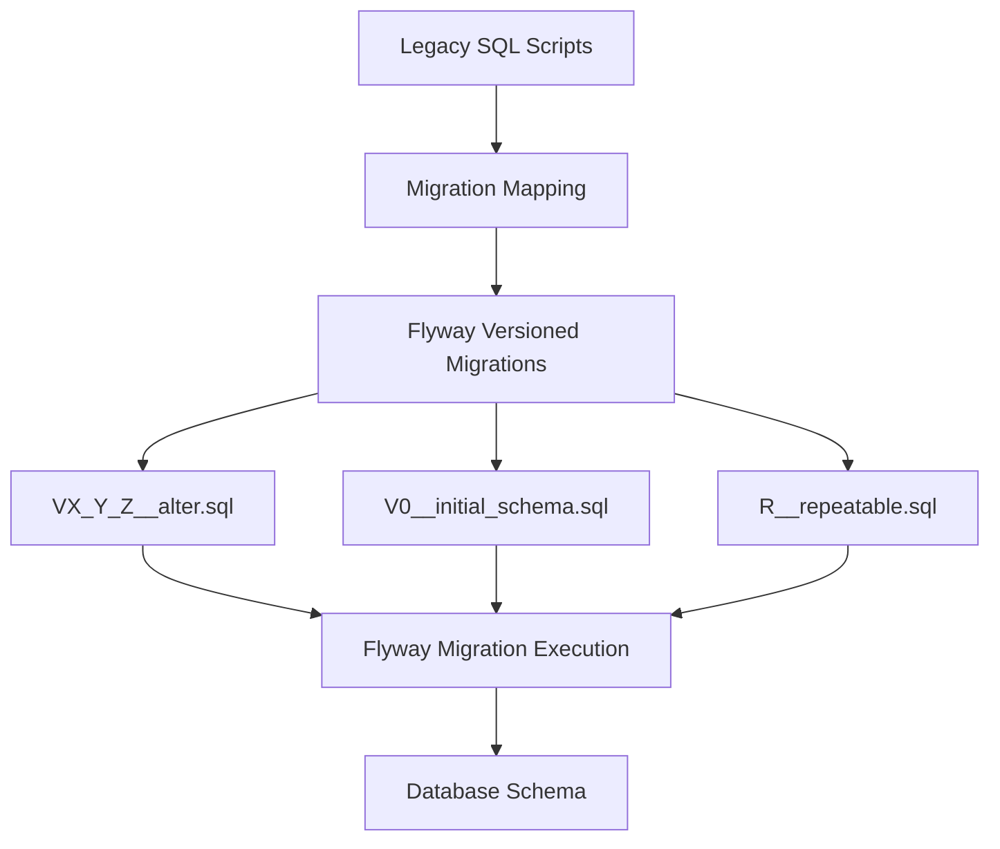
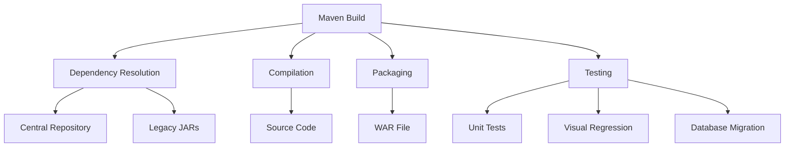

# Migration Strategy

<cite>
**Referenced Files in This Document**   
- [MIGRATION_PLAN.md](file://MIGRATION_PLAN.md)
- [MIGRATION_STEPS.md](file://MIGRATION_STEPS.md)
- [db/migration/MAP_LEGACY_TO_FLYWAY.md](file://db/migration/MAP_LEGACY_TO_FLYWAY.md)
- [pom.xml](file://pom.xml)
- [db/migration/V0__initial_schema.sql](file://db/migration/V0__initial_schema.sql)
- [db/create_db.sql](file://db/create_db.sql)
- [src/main/resources/application.properties](file://src/main/resources/application.properties)
- [db/migration/README.md](file://db/migration/README.md)
</cite>

## Table of Contents
1. [Migration Overview](#migration-overview)
2. [Migration Plan and Phases](#migration-plan-and-phases)
3. [Step-by-Step Migration Process](#step-by-step-migration-process)
4. [Database Migration Strategy](#database-migration-strategy)
5. [Maven Build Standardization](#maven-build-standardization)
6. [Practical Migration Example](#practical-migration-example)
7. [Testing and Validation](#testing-and-validation)
8. [Rollback Strategy](#rollback-strategy)
9. [Team Coordination](#team-coordination)

## Migration Overview

The dcl_v3 migration strategy outlines a comprehensive approach to modernize the legacy LINTERA ERM system from its current Struts 1.x + Hibernate 3.x + JSP architecture to a modern, supportable stack. The migration preserves existing functionality while enabling future enhancements and maintenance. The strategy focuses on incremental modernization through a series of well-defined phases, with careful attention to risk mitigation and validation.

The migration targets a modern technology stack including Java 17 LTS, Spring MVC 5.3.x (as an intermediate step), Hibernate 5.6.x/6.x via JPA 2.2, and Flyway for database migrations. The approach emphasizes coexistence of legacy and modern components during transition, allowing for gradual replacement rather than disruptive rewrites.

**Section sources**
- [MIGRATION_PLAN.md](file://MIGRATION_PLAN.md#L1-L102)
- [MIGRATION_STEPS.md](file://MIGRATION_STEPS.md#L1-L206)

## Migration Plan and Phases

The migration plan is structured as a high-level roadmap with clearly defined phases, milestones, and risk mitigation strategies. The overall goal is to prepare the source code for migration to a modern stack while preserving all existing functionality.

### Migration Phases

The migration is divided into several key phases:

1. **Build System Modernization**: Introduction of Maven as the build system to replace manual dependency management and WAR packaging.
2. **Logging Infrastructure Upgrade**: Replacement of the legacy Log4j 1.2 logging framework with SLF4J and Logback.
3. **Persistence Layer Alignment**: Wrapping existing Hibernate usage behind JPA EntityManager interfaces to enable future ORM upgrades.
4. **Web Layer Transition**: Running Struts 1.x under Servlet 4.0 while planning for gradual migration to Spring MVC controllers.
5. **Database Migration Standardization**: Codifying existing SQL migration scripts into Flyway-managed versioned migrations.
6. **Integration Modernization**: Replacing legacy Axis 1.x SOAP client with modern JAX-WS or REST-based integrations.

### Key Milestones

The migration plan establishes several critical milestones:

- **Milestone 1**: Successful Maven build with WAR packaging and dependency resolution
- **Milestone 2**: Complete logging migration with SLF4J/Logback bridge operational
- **Milestone 3**: JPA alignment achieved with Hibernate wrapped behind EntityManager
- **Milestone 4**: First Spring MVC controller successfully integrated alongside Struts
- **Milestone 5**: Complete Flyway migration of all database scripts with validation
- **Milestone 6**: Full visual regression testing passing with ≤ 0.3% pixel difference

### Risk Mitigation Strategies

The migration plan identifies several key risks and corresponding mitigation strategies:

- **javax→jakarta namespace breakage**: Mitigated by first landing on Spring 5.3/Tomcat 9 (javax) before moving to Spring Boot 3 (jakarta)
- **Struts 1 removal complexity**: Addressed through a strangler pattern approach, allowing coexistence of Struts and Spring MVC via servlet mappings
- **Hibernate mapping compatibility**: Validated through comprehensive testing of lazy/eager loading and custom UserTypes during upgrade
- **Binary/vendor jar dependencies**: Replaced with Maven artifacts, with documentation of any remaining non-mavenizable jars in legacy-libs
- **Firebird 2.1.3 database version**: Considered for upgrade to Firebird 3.x/4.x during migration for improved performance, security, and JDBC driver support

**Section sources**
- [MIGRATION_PLAN.md](file://MIGRATION_PLAN.md#L1-L102)

## Step-by-Step Migration Process

The migration process is documented as a detailed, step-by-step plan with specific tasks, files, commands, and acceptance criteria for each phase. The process follows an iterative approach with visual quality assurance at each step.

### Migration Workflow Structure

Each migration step follows a consistent structure with the following components:

- **Goal**: Clear statement of what the step aims to accomplish
- **Tasks**: Specific actions required to complete the step
- **Files**: List of files created or modified
- **Commands**: Specific commands to execute
- **Risks**: Potential issues and mitigation strategies
- **Acceptance criteria**: Conditions that must be met for success
- **Rollback plan**: Steps to revert changes if needed
- **Tests and metrics**: Verification methods and success thresholds

### Key Migration Steps

#### Step 0: Preparation and Baseline

This initial step establishes the foundation for migration by:

1. Generating a complete inventory of Java sources, resources, webapp components, database scripts, and configuration files
2. Setting up the Playwright visual testing harness to capture baseline screenshots of static pages
3. Creating a GitHub Actions CI skeleton with build, test, and visual regression jobs
4. Establishing visual testing thresholds (≤ 0.3% pixel difference, ≤ 200 maxDiffPixels)

The acceptance criteria require successful generation of baseline images, passing CI jobs, and documentation of the inventory without altering any application behavior.

#### Step 1: Build System Introduction

This step introduces Maven as the build system:

1. Creation of pom.xml with WAR packaging and Java 17 configuration
2. Configuration of provided scope for servlet/jsp/jstl dependencies
3. Addition of SLF4J/Logback dependencies for future logging migration
4. Implementation of Maven Wrapper for consistent builds across environments

The step uses a safeguard approach by initially configuring the compiler plugin to skip compilation, preventing potential issues with legacy Java code during the build system transition.

#### Step 2: Logging Migration Scaffolding

This step prepares the foundation for logging migration:

1. Addition of logback-classic, slf4j-api, and bridging artifacts (jcl-over-slf4j, log4j-over-slf4j)
2. Creation of logback.xml configuration file in resources
3. Verification of no duplicate logging bindings on the classpath

The approach uses dependency exclusions to mitigate classpath conflicts and ensures a smooth transition from Log4j 1.2 to the modern logging stack.

#### Step 3: Visual Test Expansion

This step enables rendering of JSP pages for visual testing:

1. Configuration of jetty-maven-plugin for embedded container testing
2. Addition of Playwright specifications for key JSPs (login.jsp, error.jsp, test pages)
3. Integration of server startup and visual testing in the CI workflow

This enables comprehensive visual regression testing of dynamic content, ensuring UI consistency throughout the migration process.

**Section sources**
- [MIGRATION_STEPS.md](file://MIGRATION_STEPS.md#L1-L206)

## Database Migration Strategy

The database migration strategy focuses on codifying the existing SQL migration scripts into a structured Flyway-managed system, ensuring version control, reproducibility, and auditability of database changes.

### Flyway Migration Framework

The migration leverages Flyway 9.22.3 as the preferred database migration tool, configured through a Maven profile. The Flyway setup includes:

- Filesystem-based migration locations pointing to db/migration directory
- Validation on migrate to prevent checksum mismatches
- Baseline on migrate to handle existing schemas
- Externalized configuration to prevent credential hardcoding

The Flyway profile is designed to be safe by default, requiring explicit activation and runtime parameterization of JDBC credentials to prevent accidental execution in production environments.

**Diagram sources**
- [db/migration/MAP_LEGACY_TO_FLYWAY.md](file://db/migration/MAP_LEGACY_TO_FLYWAY.md#L1-L240)
- [db/migration/README.md](file://db/migration/README.md#L1-L63)

**Section sources**
- [db/migration/MAP_LEGACY_TO_FLYWAY.md](file://db/migration/MAP_LEGACY_TO_FLYWAY.md#L1-L240)
- [db/migration/README.md](file://db/migration/README.md#L1-L63)

### Migration Script Standardization

The legacy SQL scripts are systematically mapped to Flyway's naming convention:

- **Versioned migrations**: Follow the pattern V{version}__{description}.sql where version uses underscores (e.g., V1_1_2__alter.sql)
- **Baseline script**: create_db.sql is mapped to V0__initial_schema.sql as the initial schema definition
- **Repeatable migrations**: Utility scripts are prefixed with R__ (e.g., R__active_indexes.sql) for idempotent execution

The MAP_LEGACY_TO_FLYWAY.md document provides a comprehensive mapping table that correlates each original script with its Flyway equivalent, serving as a reference for the migration process.

### Initial Schema Migration

The V0__initial_schema.sql file serves as the baseline for the Flyway migration system, containing the complete database schema definition extracted from create_db.sql. This includes:

- Database creation with appropriate character set and page size
- User-defined functions (UDFs) for date arithmetic and string operations
- Domain definitions for data type consistency
- Generators (sequences) for primary key generation
- Stored procedures for business logic encapsulation
- Table definitions with constraints and indexes

The initial schema has been carefully reviewed and normalized from the original create_db.sql script, with added documentation and consistent formatting.

### Migration Execution Process

The migration execution follows a controlled process with multiple verification steps:

1. **Inspection**: Using `flyway:info` to view the migration status without making changes
2. **Validation**: Running `flyway:validate` to check checksums and ensure migration integrity
3. **Baseline**: Applying `flyway:baseline` to an existing schema when starting migration on a populated database
4. **Application**: Executing `flyway:migrate` only in approved environments after thorough testing

JDBC connection parameters are passed at runtime through system properties rather than being hardcoded, ensuring security and flexibility across different environments.

**Section sources**
- [db/migration/MAP_LEGACY_TO_FLYWAY.md](file://db/migration/MAP_LEGACY_TO_FLYWAY.md#L1-L240)
- [db/migration/V0__initial_schema.sql](file://db/migration/V0__initial_schema.sql#L1-L800)
- [db/create_db.sql](file://db/create_db.sql#L1-L800)
- [pom.xml](file://pom.xml#L1-L283)
- [db/migration/README.md](file://db/migration/README.md#L1-L63)

## Maven Build Standardization

Maven plays a central role in standardizing the build process for the dcl_v3 migration, providing dependency management, consistent builds, and integration with development tools.

### Maven Configuration

The pom.xml file defines a comprehensive build configuration that supports the migration strategy:

- **Project metadata**: Group ID, artifact ID, version, and packaging type (WAR)
- **Properties**: Build encoding and compiler source/target versions
- **Dependencies**: Managed dependencies for servlet API, JSP, JSTL, logging, and persistence
- **Build plugins**: Compiler, WAR packaging, and Jetty for testing
- **Profiles**: Environment-specific configurations for database migration, ORM smoke testing, and legacy execution

The configuration uses a phased approach, initially skipping compilation to focus on build infrastructure before addressing code compatibility.

### Dependency Management

The migration standardizes dependencies through Maven coordinates, replacing the legacy WEB-INF/lib jar files:

- **Servlet API**: javax.servlet-api 4.0.1 (provided scope)
- **JSP/JSTL**: javax.servlet.jsp-api 2.3.3 and jstl 1.2
- **Logging**: SLF4J 2.0.13 with Logback 1.4.14 and bridging artifacts
- **Persistence**: JPA API 2.2 and Hibernate Core 5.6.15.Final
- **Database**: Firebird JDBC driver and H2 for testing

The dependency management includes explicit exclusions to prevent conflicts between legacy and modern libraries.

### Build Profiles

The Maven configuration includes several profiles to support different migration scenarios:

- **db-migrate**: Activates Flyway plugin for database migrations with externalized credentials
- **orm-smoke**: Enables ORM testing with test-scoped dependencies and compilation
- **legacy-run**: Configures Jetty plugin to run the legacy application directly for comparison

These profiles allow developers to execute specific migration tasks without affecting the default build process.

**Diagram sources**
- [pom.xml](file://pom.xml#L1-L283)

**Section sources**
- [pom.xml](file://pom.xml#L1-L283)

## Practical Migration Example

To illustrate the migration process, consider the practical example of migrating a specific module from the legacy system to the modern architecture.

### Module Migration Process

The migration of a specific module follows these steps:

1. **Isolation**: Identify the module's boundaries and dependencies within the legacy system
2. **Analysis**: Document the current functionality, data flow, and user interface
3. **Baseline**: Capture visual and functional baselines using Playwright tests
4. **Refactoring**: Extract the module's business logic from JSP and Struts components
5. **Modernization**: Implement the logic as Spring services with JPA repositories
6. **Integration**: Create Spring MVC controllers and Thymeleaf templates (or retain JSP initially)
7. **Validation**: Execute visual regression tests to ensure UI consistency
8. **Deployment**: Deploy the modernized module alongside the legacy system

### Data Compatibility Handling

During migration, data compatibility is maintained through several strategies:

- **Schema preservation**: Existing database schema is maintained during initial migration phases
- **Data type mapping**: Careful mapping of legacy data types to modern equivalents
- **Encoding consistency**: UTF-8 encoding is enforced throughout the migration
- **Generator preservation**: Firebird generators (sequences) are preserved to maintain ID continuity

For example, when migrating the commercial proposal module, the existing DCL_COMMERCIAL_PROPOSAL table structure is preserved while the application logic is modernized. The migration ensures that all existing data remains accessible and that new records are created with consistent IDs using the GEN_DCL_COMMERCIAL_PROPOSAL_ID generator.

### Migration Validation

Migration success is validated through multiple mechanisms:

- **Visual regression testing**: Playwright compares screenshots of the legacy and modernized interfaces, ensuring pixel-level consistency within the 0.3% threshold
- **Functional testing**: Automated tests verify that business logic produces identical results
- **Performance testing**: Response times and resource usage are monitored to ensure no degradation
- **Data integrity checks**: Database queries validate that data is correctly persisted and retrieved

The validation process is automated through the CI/CD pipeline, with build failures triggered if visual differences exceed the defined thresholds.

**Section sources**
- [MIGRATION_STEPS.md](file://MIGRATION_STEPS.md#L1-L206)
- [pom.xml](file://pom.xml#L1-L283)
- [src/main/resources/application.properties](file://src/main/resources/application.properties#L1-L60)

## Testing and Validation

The migration strategy places strong emphasis on comprehensive testing and validation to ensure the integrity of the modernized system.

### Visual Regression Testing

Visual regression testing is implemented using Playwright with TypeScript, providing pixel-level comparison of the application's user interface:

- **Static page testing**: Initial baseline captures of HTML pages without server-side rendering
- **Dynamic page testing**: Expansion to JSP pages using embedded Jetty container
- **Thresholds**: Maximum 0.3% pixel difference ratio and 200 maxDiffPixels
- **Automation**: Integrated into GitHub Actions CI workflow for every push

The testing approach captures both visual appearance and layout, ensuring that the user experience remains consistent throughout the migration process.

### Automated Testing Framework

The testing framework includes multiple layers of validation:

- **Unit tests**: JUnit 5 tests for individual components and services
- **Integration tests**: Mockito and Testcontainers for testing component interactions
- **End-to-end tests**: Playwright for browser-based testing of complete workflows
- **Smoke tests**: Quick validation of critical functionality after each change

The CI/CD pipeline enforces that all tests must pass before code can be merged, ensuring code quality and stability.

### Quality Assurance Metrics

The migration process tracks several key quality metrics:

- **Build time**: Target of ≤ 5 minutes for CI execution
- **WAR size**: Initial target of ≤ 60 MB, with reduction planned in later phases
- **Test coverage**: Comprehensive coverage of critical business logic
- **Runtime errors**: Zero uncaught exceptions on tested pages

These metrics provide objective measures of migration progress and system health.

**Section sources**
- [MIGRATION_STEPS.md](file://MIGRATION_STEPS.md#L1-L206)
- [package.json](file://package.json#L1-L13)

## Rollback Strategy

A comprehensive rollback strategy is essential for mitigating risks during the migration process.

### Per-Step Rollback Plans

Each migration step includes a specific rollback plan:

- **Build system introduction**: Remove pom.xml and Maven wrapper files
- **Logging migration**: Remove SLF4J/Logback dependencies and configuration
- **Database migration**: Use Flyway's undo functionality or restore from backup
- **Web layer changes**: Revert servlet mappings to restore Struts 1.x handling

The rollback plans are designed to be executable with minimal downtime and data loss.

### Database Rollback

For database migrations, multiple rollback options are available:

- **Flyway undo**: For supported databases, Flyway can automatically revert migrations
- **Manual scripts**: Pre-written rollback scripts for complex changes
- **Backups**: Regular database backups before major migration steps
- **Point-in-time recovery**: Leveraging database-specific recovery features

The strategy emphasizes testing rollback procedures in non-production environments before executing in production.

### Application Rollback

Application-level rollback strategies include:

- **Version control**: Using Git to revert code changes
- **Deployment artifacts**: Maintaining previous WAR files for quick redeployment
- **Feature toggles**: Configurable switches to disable migrated components
- **Blue-green deployment**: Running legacy and modern systems in parallel

These approaches ensure that the system can be restored to a working state quickly if migration issues arise.

**Section sources**
- [MIGRATION_STEPS.md](file://MIGRATION_STEPS.md#L1-L206)

## Team Coordination

Effective team coordination is critical for the success of the dcl_v3 migration.

### Branching Strategy

The migration uses a dedicated feature branch with the following workflow:

- **Main branch**: Stable production code
- **feature/migrate-dcl3**: Primary migration branch
- **Conventional commits**: Standardized commit messages (feat, fix, chore, etc.)
- **Pull requests**: Code review required for all changes

This approach ensures that migration work is isolated from regular development while maintaining code quality through review.

### Communication and Documentation

The team maintains comprehensive documentation and communication channels:

- **Migration plan**: Central document outlining the overall strategy
- **Step-by-step guide**: Detailed instructions for each migration phase
- **Visual baseline reports**: Documentation of UI changes and comparisons
- **Changelog**: Record of all migration-related changes

Regular team meetings are held to discuss progress, challenges, and next steps.

### Responsibility Assignment

Roles and responsibilities are clearly defined:

- **Migration lead**: Overall responsibility for migration strategy and execution
- **Database specialist**: Focus on database migration and optimization
- **Build engineer**: Management of Maven configuration and CI/CD
- **QA engineer**: Oversight of testing and validation processes
- **Module owners**: Responsibility for migrating specific application modules

This division of labor ensures that all aspects of the migration receive appropriate attention and expertise.

**Section sources**
- [MIGRATION_STEPS.md](file://MIGRATION_STEPS.md#L1-L206)