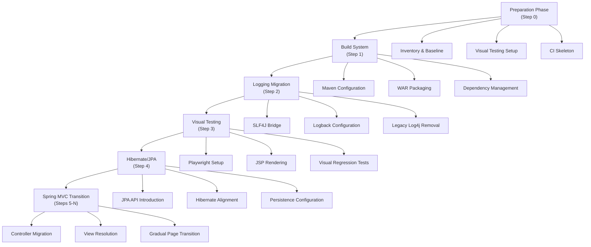
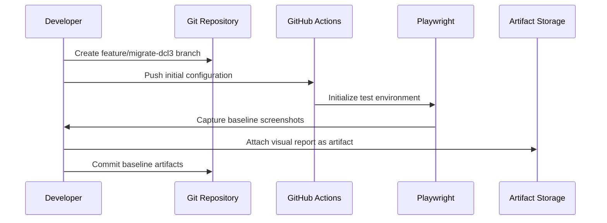
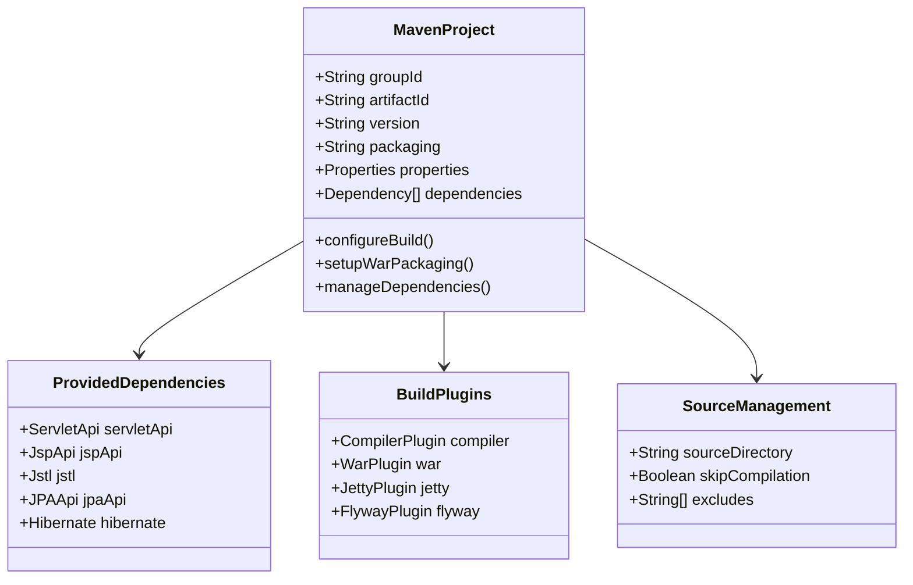
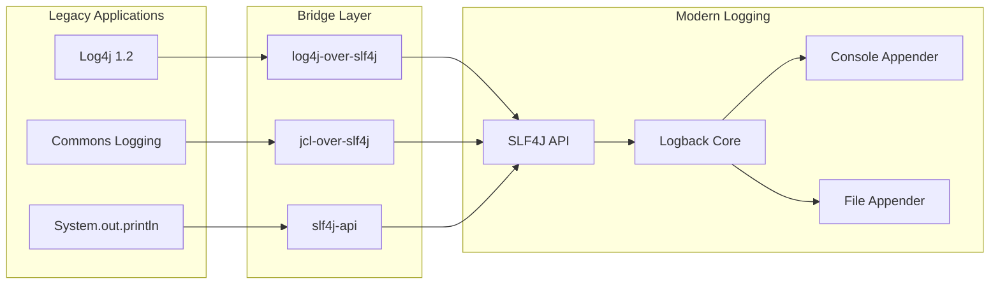
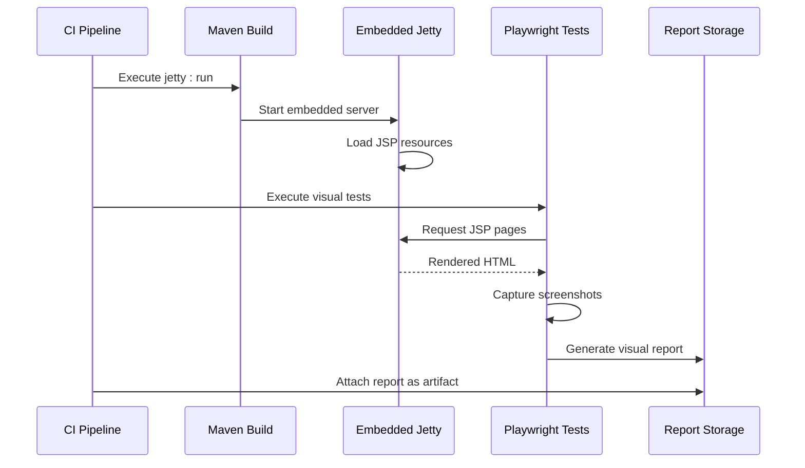
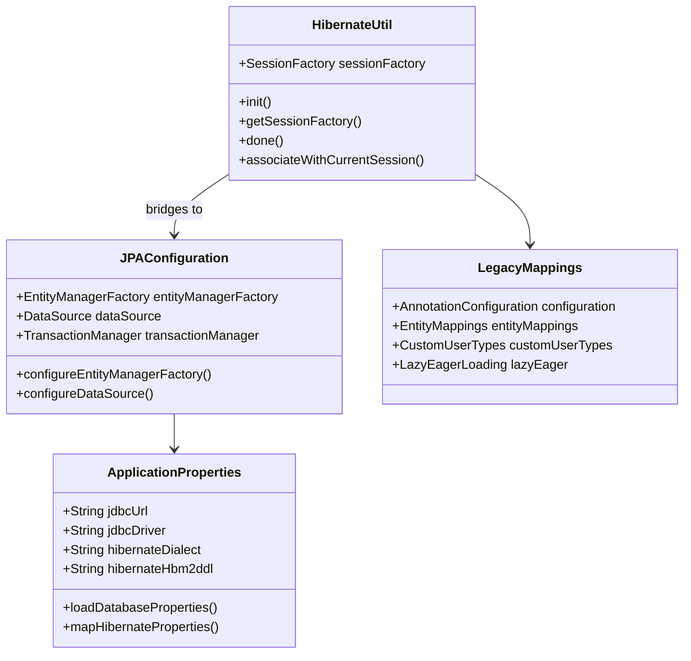
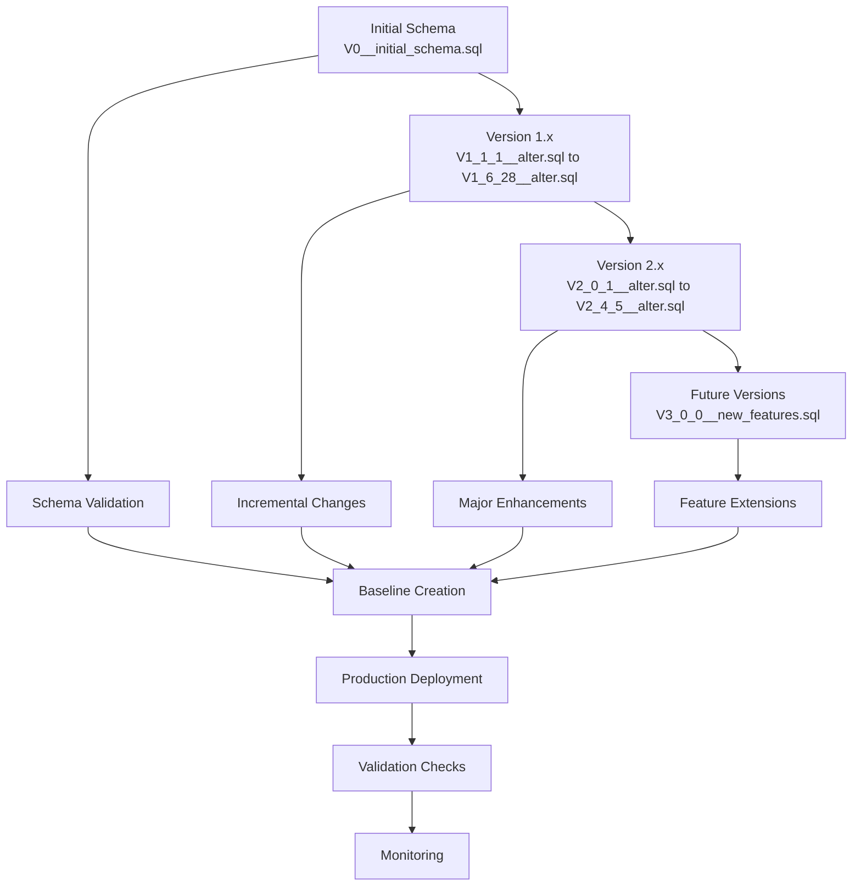
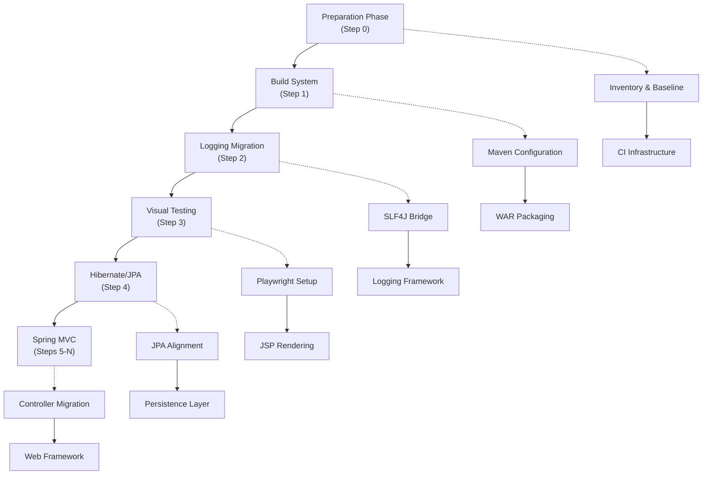
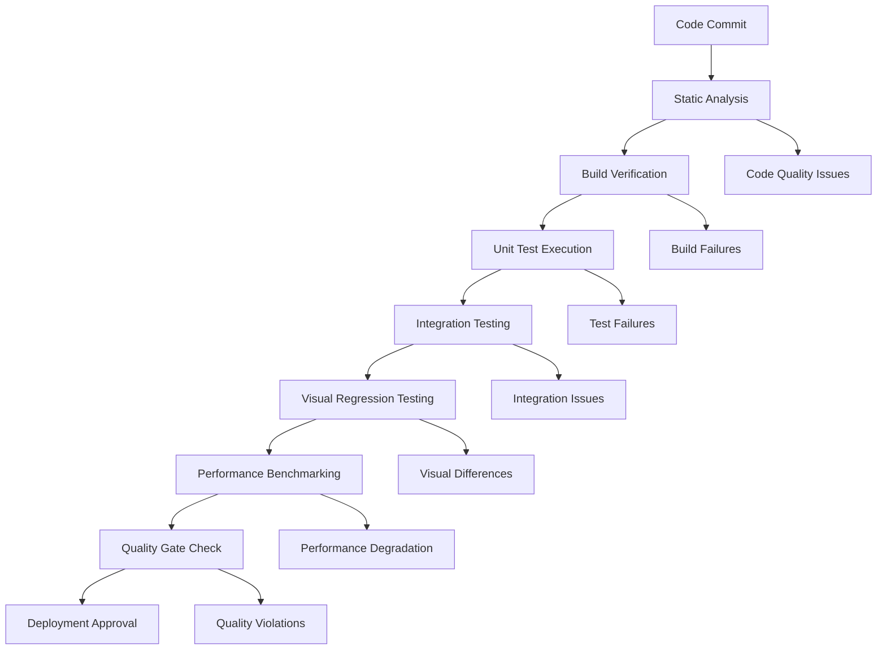

# Step-by-Step Execution of DCL_v3 Migration Process

<cite>
**Referenced Files in This Document**
- [MIGRATION_STEPS.md](file://MIGRATION_STEPS.md)
- [MIGRATION_PLAN.md](file://MIGRATION_PLAN.md)
- [pom.xml](file://pom.xml)
- [application.properties](file://src/main/resources/application.properties)
- [logback.xml](file://src/main/resources/logback.xml)
- [web.xml](file://src/main/webapp/WEB-INF/web.xml)
- [V0__initial_schema.sql](file://db/migration/V0__initial_schema.sql)
- [V1_2_1__alter.sql](file://db/migration/V1_2_1__alter.sql)
- [V1_3_1__alter.sql](file://db/migration/V1_3_1__alter.sql)
- [README.md](file://db/migration/README.md)
- [package.json](file://package.json)
- [HibernateUtil.java](file://src/main/java/net/sam/dcl/util/HibernateUtil.java)
</cite>

## Table of Contents
1. [Introduction](#introduction)
2. [Migration Overview](#migration-overview)
3. [Preparation Phase (Step 0)](#preparation-phase-step-0)
4. [Build System Introduction (Step 1)](#build-system-introduction-step-1)
5. [Logging Migration (Step 2)](#logging-migration-step-2)
6. [Visual Testing Expansion (Step 3)](#visual-testing-expansion-step-3)
7. [Hibernate/JPA Alignment (Step 4)](#hibernatejpa-alignment-step-4)
8. [Database Migration Strategy](#database-migration-strategy)
9. [Migration Task Dependencies](#migration-task-dependencies)
10. [Execution Guidelines](#execution-guidelines)
11. [Common Issues and Solutions](#common-issues-and-solutions)
12. [Verification and Validation](#verification-and-validation)
13. [Rollback Procedures](#rollback-procedures)

## Introduction

The DCL_v3 migration process represents a comprehensive modernization effort for the LINTERA Enterprise Resource Management system. This migration transforms the legacy Struts 1.x + Hibernate 3.x + JSP stack into a modern, maintainable architecture while preserving all existing functionality. The process follows a carefully orchestrated sequence of steps, each building upon the previous foundation to ensure stability and minimize risk.

The migration employs a phased approach with clear boundaries between stages, utilizing established tools like Maven, Flyway, Playwright, and Spring MVC to facilitate the transition. Each phase includes thorough validation, visual regression testing, and rollback capabilities to ensure reliability throughout the transformation.

## Migration Overview

The DCL_v3 migration follows a structured progression through multiple discrete phases, each with specific objectives, deliverables, and validation criteria. The process maintains backward compatibility with the existing system while introducing modern development practices and technologies.



**Diagram sources**
- [MIGRATION_STEPS.md](file://MIGRATION_STEPS.md#L1-L206)
- [MIGRATION_PLAN.md](file://MIGRATION_PLAN.md#L1-L102)

**Section sources**
- [MIGRATION_STEPS.md](file://MIGRATION_STEPS.md#L1-L50)
- [MIGRATION_PLAN.md](file://MIGRATION_PLAN.md#L1-L50)

## Preparation Phase (Step 0)

The preparation phase establishes the foundation for the entire migration process, creating essential infrastructure and establishing baseline measurements for validation.

### Phase Objectives

The primary goal of Step 0 is to establish a stable foundation for subsequent migration activities by capturing the current system state and setting up automated validation mechanisms.

### Task Breakdown

#### 0.1 Inventory Generation
- Generate comprehensive tree snapshots of Java sources, resources, webapp structure, database schema, and configuration files
- Create detailed JAR inventory from legacy libraries to identify dependency requirements
- Document current system architecture and component relationships

#### 0.2 Visual Testing Infrastructure
- Configure Playwright for automated visual regression testing
- Create baseline capture specifications for static HTML pages
- Establish snapshot storage under `tests/visual/__screenshots__/baseline`

#### 0.3 Continuous Integration Skeleton
- Implement GitHub Actions workflow with dedicated jobs for build, tests, and visual validation
- Configure cross-platform compatibility (Windows-latest, Ubuntu-latest, Java 17)
- Set up environment matrix for comprehensive testing coverage

#### 0.4 Threshold Agreement
- Establish visual regression detection thresholds: 0.3% maximum difference ratio, 200 maximum pixels
- Define build time targets (< 5 minutes) and WAR size targets (< 60 MB initially)
- Agree on runtime error policies (0 uncaught exceptions on tested pages)

### Implementation Details

The visual testing harness utilizes Playwright with TypeScript configuration for robust cross-browser compatibility. The baseline creation process captures static HTML pages to establish reference points for future visual comparisons.



**Diagram sources**
- [MIGRATION_STEPS.md](file://MIGRATION_STEPS.md#L33-L42)
- [package.json](file://package.json#L1-L12)

### Command Execution

The preparation phase requires specific command sequences for toolchain setup and baseline generation:

```bash
# Node toolchain initialization
npm --prefix ./dcl-3-new init -y
npm --prefix ./dcl-3-new i -D @playwright/test typescript ts-node
npx --prefix ./dcl-3-new playwright install --with-deps

# Visual baseline generation
npx --prefix ./dcl-3-new playwright test --config ./tests/visual/playwright.config.ts --update-snapshots
```

### Acceptance Criteria

- Complete inventory files present with detailed dependency listings
- CI pipeline executes successfully with all skeleton jobs passing
- Visual baseline images generated and stored as artifacts with 0 regressions
- No changes to application behavior confirmed through baseline validation

**Section sources**
- [MIGRATION_STEPS.md](file://MIGRATION_STEPS.md#L43-L85)

## Build System Introduction (Step 1)

The build system introduction phase establishes Maven as the primary build tool, enabling WAR packaging and dependency management while maintaining compatibility with the existing legacy architecture.

### Phase Objectives

Establish Maven as the foundational build system, enabling compilation, packaging, and dependency resolution without disrupting existing functionality.

### Task Implementation

#### 1.1 Maven Configuration Creation
- Create `pom.xml` with WAR packaging configuration
- Establish Java 17 compatibility with appropriate source/target versions
- Configure project metadata including group ID, artifact ID, and versioning scheme

#### 1.2 Dependency Management
- Add provided scope dependencies for servlet/jsp/jstl APIs
- Integrate SLF4J/Logback logging framework without code modifications
- Map runtime JDBC drivers while maintaining legacy library references when necessary

#### 1.3 Build Tool Configuration
- Add Maven Wrapper for consistent build environments
- Configure basic Checkstyle and SpotBugs plugins as placeholders
- Implement source directory exclusion to prevent legacy Java compilation

### Technical Architecture

The Maven configuration maintains strict separation between legacy and modern components, using provided scopes for container-provided dependencies and careful dependency management to avoid conflicts.



**Diagram sources**
- [pom.xml](file://pom.xml#L1-L283)
- [MIGRATION_STEPS.md](file://MIGRATION_STEPS.md#L86-L110)

### Dependency Mapping Strategy

The migration employs a strategic dependency mapping approach to minimize conflicts while enabling modern development practices:

| Legacy Component | Modern Replacement | Scope | Rationale |
|------------------|-------------------|-------|-----------|
| `servlet-api` | `javax.servlet-api:4.0.1` | provided | Container-provided |
| `jsp-api` | `javax.servlet.jsp-api:2.3.3` | provided | Container-provided |
| `jstl` | `javax.servlet:jstl:1.2` | runtime | Standard taglibs |
| `log4j` | `log4j-over-slf4j:2.0.13` | bridge | Legacy log4j replacement |
| `commons-logging` | `jcl-over-slf4j:2.0.13` | bridge | Commons logging bridge |
| `hibernate3` | `hibernate-core:5.6.15.Final` | provided | Hibernate alignment |

### Command Execution

```bash
# Maven build with wrapper
./mvnw -f dcl-3-new/pom.xml -DskipTests package

# Verification commands
./mvnw -f dcl-3-new/pom.xml help:effective-pom
./mvnw -f dcl-3-new/pom.xml dependency:tree
```

### Acceptance Criteria

- WAR file builds successfully containing webapp skeleton
- Build time remains under 5-minute target threshold
- Legacy JAR conflicts resolved through dependency management
- No unit tests required at this stage (focus on build success)

**Section sources**
- [MIGRATION_STEPS.md](file://MIGRATION_STEPS.md#L111-L130)
- [pom.xml](file://pom.xml#L1-L200)

## Logging Migration (Step 2)

The logging migration phase replaces Log4j 1.2 with SLF4J and Logback, establishing a modern logging infrastructure while maintaining backward compatibility with existing code.

### Phase Objectives

Replace Log4j 1.2 runtime dependencies with SLF4J/Logback bridge configuration, enabling modern logging capabilities without requiring code modifications.

### Task Implementation

#### 2.1 Dependency Addition
- Add `logback-classic`, `slf4j-api`, `jcl-over-slf4j`, and `log4j-over-slf4j` to Maven dependencies
- Configure appropriate versions for compatibility and modern features
- Ensure no duplicate logging bindings through careful dependency management

#### 2.2 Configuration Establishment
- Create `logback.xml` configuration file in resources directory
- Configure console appender with UTF-8 encoding and structured logging patterns
- Set up logger hierarchies to reduce noise from third-party libraries

#### 2.3 Conflict Resolution
- Exclude transitive dependencies from commons-logging and log4j
- Implement bridge pattern to redirect all logging frameworks to SLF4J
- Validate classpath for duplicate logging implementations

### Technical Architecture

The logging bridge architecture provides seamless transition from legacy logging frameworks to modern SLF4J/Logback combination:



**Diagram sources**
- [logback.xml](file://src/main/resources/logback.xml#L1-L25)
- [pom.xml](file://pom.xml#L45-L65)

### Configuration Details

The Logback configuration establishes comprehensive logging infrastructure with appropriate filtering and output formatting:

```xml
<!-- Pattern configuration for structured logging -->
<pattern>%d{yyyy-MM-dd HH:mm:ss.SSS} %-5level [%thread] %logger{36} - %msg%n</pattern>

<!-- Logger hierarchy configuration -->
<logger name="org.hibernate" level="WARN"/>
<logger name="org.apache" level="INFO"/>
<logger name="org.springframework" level="INFO"/>
```

### Risk Mitigation Strategies

- **Classpath Conflicts**: Implement strict dependency exclusions and verify no duplicate logging implementations
- **Runtime Behavior**: Maintain identical logging behavior through careful bridge configuration
- **Performance Impact**: Monitor logging overhead through benchmarking and optimize appenders as needed

### Command Execution

```bash
# Maven build verification
./mvnw -f dcl-3-new/pom.xml -DskipTests package

# Application startup verification
java -jar target/dcl-3-new.war
```

### Acceptance Criteria

- Application starts successfully with modern logging infrastructure
- No duplicate logging bindings detected in classpath
- Existing logging behavior preserved without code modifications
- Build verification confirms successful dependency resolution

**Section sources**
- [MIGRATION_STEPS.md](file://MIGRATION_STEPS.md#L131-L150)
- [logback.xml](file://src/main/resources/logback.xml#L1-L25)

## Visual Testing Expansion (Step 3)

The visual testing expansion phase enables JSP rendering for baseline capture using embedded Jetty server, expanding visual regression testing capabilities to include dynamic content.

### Phase Objectives

Enable JSP rendering for visual baseline capture by configuring embedded Jetty server with necessary dependencies and Playwright specifications for key JSP pages.

### Task Implementation

#### 3.1 Jetty Server Configuration
- Configure `jetty-maven-plugin` for embedded server operation
- Set up JNDI support and transaction management dependencies
- Configure server binding to port 8082 to avoid conflicts with existing services

#### 3.2 Playwright Specification Development
- Create Playwright specs for key JSP pages that render without database dependencies
- Focus on critical pages: `login.jsp`, `error.jsp`, and test pages
- Implement screenshot capture with consistent viewport and timing controls

#### 3.3 CI Integration
- Add CI job to start embedded server and execute visual tests
- Configure parallel execution with build and test jobs
- Implement artifact collection for visual regression reports

### Technical Architecture

The expanded visual testing infrastructure combines embedded Jetty server with Playwright automation for comprehensive visual validation:



**Diagram sources**
- [pom.xml](file://pom.xml#L85-L130)
- [MIGRATION_STEPS.md](file://MIGRATION_STEPS.md#L151-L170)

### JSP Rendering Challenges

The JSP rendering process faces several technical challenges that require careful configuration:

- **Taglib Dependencies**: Ensure all required taglibs are available in classpath
- **JSP Compilation**: Configure JSP compiler for embedded environment
- **Resource Loading**: Properly resolve JSP and resource paths in embedded server
- **Database Dependencies**: Limit baseline capture to pages without database requirements

### Configuration Details

The Jetty configuration ensures optimal performance and compatibility for visual testing:

```xml
<!-- Jetty configuration for visual testing -->
<configuration>
  <stopPort>8090</stopPort>
  <stopKey>stop</stopKey>
  <scanIntervalSeconds>0</scanIntervalSeconds>
  <contextPath>/</contextPath>
  <useAnnotations>false</useAnnotations>
  <webAppSourceDirectory>${project.basedir}/src/test/webapp</webAppSourceDirectory>
  <useTestScope>true</useTestScope>
  <httpConnector>
    <port>8082</port>
  </httpConnector>
</configuration>
```

### Command Execution

```bash
# Start Jetty server and run visual tests
./mvnw -f dcl-3-new/pom.xml jetty:run -DskipTests & 
npx --prefix ./dcl-3-new playwright test

# Standalone visual baseline generation
npx --prefix ./dcl-3-new playwright test --update-snapshots
```

### Acceptance Criteria

- Baseline screenshots generated for selected JSP pages with ≤ 0.3% difference threshold
- Embedded Jetty server starts successfully with JSP rendering capability
- Visual regression tests execute without runtime errors
- CI job completes successfully with visual report attachment

**Section sources**
- [MIGRATION_STEPS.md](file://MIGRATION_STEPS.md#L171-L190)
- [pom.xml](file://pom.xml#L85-L130)

## Hibernate/JPA Alignment (Step 4)

The Hibernate/JPA alignment phase introduces JPA API and aligns Hibernate configuration with modern persistence patterns while maintaining backward compatibility with existing Hibernate mappings.

### Phase Objectives

Introduce JPA 2.2 API and align Hibernate configuration through application.properties mapping, providing a foundation for future persistence layer modernization without changing existing Hibernate mappings.

### Task Implementation

#### 4.1 JPA API Integration
- Add JPA 2.2 API dependency (`javax.persistence:javax.persistence-api:2.2`)
- Configure Hibernate properties mapping through `application.properties`
- Establish externalized database configuration for future migration flexibility

#### 4.2 Configuration Alignment
- Map existing Hibernate configuration to JPA-compatible properties
- Externalize database connection settings to application.properties
- Maintain existing Hibernate mappings and behavior through configuration

#### 4.3 Infrastructure Scaffolding
- Provide skeleton `LocalSessionFactoryBean` or `EntityManagerFactory` configuration
- Establish JPA bootstrap infrastructure without runtime wiring
- Prepare foundation for gradual migration to pure JPA usage

### Technical Architecture

The JPA alignment creates a bridge between legacy Hibernate usage and modern JPA standards:



**Diagram sources**
- [HibernateUtil.java](file://src/main/java/net/sam/dcl/util/HibernateUtil.java#L1-L130)
- [application.properties](file://src/main/resources/application.properties#L1-L59)

### Configuration Mapping

The application.properties file establishes comprehensive database and JPA configuration:

```properties
# JDBC connection configuration
jdbc.driver=org.firebirdsql.jdbc.FBDriver
jdbc.url=jdbc:firebirdsql://localhost:3050/dcl.fdb?charSet=UTF-8
jdbc.user=sysdba
jdbc.password=masterkey

# Hibernate/JPA configuration
hibernate.hbm2ddl.auto=validate
hibernate.show_sql=false
hibernate.format_sql=true
hibernate.dialect=org.hibernate.dialect.FirebirdDialect
```

### Compatibility Considerations

The alignment process maintains strict compatibility with existing Hibernate functionality:

- **Mapping Preservation**: All existing Hibernate entity mappings remain unchanged
- **Behavior Consistency**: Existing lazy loading, caching, and transaction behavior maintained
- **Performance Impact**: Minimal performance overhead from JPA abstraction layer
- **Migration Path**: Clear path to pure JPA usage through gradual code migration

### Command Execution

```bash
# Build verification
./mvnw -f dcl-3-new/pom.xml -DskipTests package

# Configuration validation
./mvnw -f dcl-3-new/pom.xml dependency:tree | grep hibernate
```

### Acceptance Criteria

- JPA API integrated successfully without breaking existing Hibernate functionality
- Hibernate properties mapped correctly through application.properties
- Legacy entity mappings continue to work without modification
- Build succeeds with all dependencies resolved

**Section sources**
- [MIGRATION_STEPS.md](file://MIGRATION_STEPS.md#L191-L206)
- [application.properties](file://src/main/resources/application.properties#L1-L59)
- [HibernateUtil.java](file://src/main/java/net/sam/dcl/util/HibernateUtil.java#L1-L130)

## Database Migration Strategy

The database migration strategy employs Flyway for controlled, versioned schema evolution, providing a robust foundation for database modernization while maintaining data integrity.

### Migration Architecture

The Flyway-based migration system provides controlled database evolution through versioned SQL scripts:



**Diagram sources**
- [README.md](file://db/migration/README.md#L1-L63)
- [V0__initial_schema.sql](file://db/migration/V0__initial_schema.sql#L1-L799)

### Migration Naming Convention

Flyway migrations follow a strict naming convention for version identification and organization:

| Pattern | Example | Description |
|---------|---------|-------------|
| `V{version}__{description}.sql` | `V1_2_3__alter.sql` | Standard version format |
| `V{major}_{minor}_{patch}__{description}.sql` | `V2_1_15__alter.sql` | Semantic versioning |
| `R__{description}.sql` | `R__active_indexes.sql` | Repeatable migrations |

### Migration Execution Commands

The Flyway plugin provides comprehensive migration management capabilities:

```bash
# Inspect migration status
mvn -f dcl-3-new/pom.xml -P db-migrate \
  -Dflyway.url=jdbc:firebirdsql://localhost:3050/dcl.fdb \
  -Dflyway.user=sysdba -Dflyway.password=masterkey \
  flyway:info

# Validate migration checksums
mvn -f dcl-3-new/pom.xml -P db-migrate \
  -Dflyway.url=jdbc:firebirdsql://localhost:3050/dcl.fdb \
  -Dflyway.user=sysdba -Dflyway.password=masterkey \
  flyway:validate

# Baseline existing schema
mvn -f dcl-3-new/pom.xml -P db-migrate \
  -Dflyway.url=jdbc:firebirdsql://localhost:3050/dcl.fdb \
  -Dflyway.user=sysdba -Dflyway.password=masterkey \
  -Dflyway.baselineVersion=0 \
  flyway:baseline

# Apply migrations
mvn -f dcl-3-new/pom.xml -P db-migrate \
  -Dflyway.url=jdbc:firebirdsql://localhost:3050/dcl.fdb \
  -Dflyway.user=sysdba -Dflyway.password=masterkey \
  flyway:migrate
```

### Migration Validation Strategy

Each migration undergoes rigorous validation to ensure data integrity and backward compatibility:

- **Checksum Validation**: Verify migration script integrity through MD5 checksums
- **Idempotency Testing**: Ensure migrations can be safely reapplied
- **Backward Compatibility**: Maintain compatibility with existing application versions
- **Data Preservation**: Protect existing data during schema evolution

### Database Target Support

The migration system supports multiple database platforms through JDBC driver configuration:

| Database | Driver Class | URL Format | Character Set |
|----------|--------------|------------|---------------|
| Firebird | `org.firebirdsql.jdbc.FBDriver` | `jdbc:firebirdsql://host:3050/path` | UTF-8 |
| PostgreSQL | `org.postgresql.Driver` | `jdbc:postgresql://host:5432/dbname` | UTF-8 |
| Oracle | `oracle.jdbc.OracleDriver` | `jdbc:oracle:thin:@host:1521/ORCLPDB1` | AL32UTF8 |

**Section sources**
- [README.md](file://db/migration/README.md#L1-L63)
- [pom.xml](file://pom.xml#L131-L168)

## Migration Task Dependencies

The migration process follows a carefully orchestrated dependency chain where each phase builds upon successful completion of preceding tasks.

### Dependency Matrix



**Diagram sources**
- [MIGRATION_STEPS.md](file://MIGRATION_STEPS.md#L191-L206)

### Sequential Dependencies

Each migration phase has specific prerequisites that must be satisfied before proceeding:

#### Step 1 (Build System) Dependencies
- **Pre-requisite**: Successful completion of Step 0 preparation phase
- **Required Artifacts**: Maven wrapper, basic POM configuration, dependency inventory
- **Validation**: Build infrastructure verified through initial WAR packaging

#### Step 2 (Logging Migration) Dependencies
- **Pre-requisite**: Working Maven build system (Step 1)
- **Required Infrastructure**: Dependency management, WAR packaging capability
- **Validation**: SLF4J bridge integration verified without conflicts

#### Step 3 (Visual Testing) Dependencies
- **Pre-requisite**: Logging migration completed (Step 2)
- **Required Infrastructure**: Embedded Jetty server, Playwright configuration
- **Validation**: JSP rendering capability established for baseline capture

#### Step 4 (Hibernate/JPA) Dependencies
- **Pre-requisite**: Visual testing infrastructure established (Step 3)
- **Required Infrastructure**: JPA API integration, configuration alignment
- **Validation**: Legacy Hibernate mappings preserved through JPA bridge

### Parallel Execution Opportunities

While the migration follows a sequential approach, certain tasks can be executed in parallel to optimize timeline:

- **Preparation Tasks**: Inventory generation, CI setup, visual testing configuration
- **Infrastructure Tasks**: Build system, logging framework, database configuration
- **Testing Infrastructure**: Playwright setup, baseline creation, validation scripts

### Risk Mitigation Strategies

The dependency chain incorporates multiple risk mitigation approaches:

- **Incremental Validation**: Each phase includes acceptance criteria verification
- **Rollback Capability**: Comprehensive rollback procedures for each phase
- **Parallel Validation**: Independent validation of parallel tasks
- **Dependency Verification**: Explicit dependency checking between phases

**Section sources**
- [MIGRATION_STEPS.md](file://MIGRATION_STEPS.md#L191-L206)

## Execution Guidelines

Successful migration execution requires adherence to established procedures, quality gates, and validation protocols throughout each phase.

### Development Environment Setup

#### Prerequisites
- **Java Development Kit**: Java 17 or higher for build system compatibility
- **Node.js Environment**: Required for Playwright visual testing infrastructure
- **Database Access**: Firebird 2.1.3 or compatible database for testing
- **IDE Configuration**: Maven integration and proper project structure

#### Workspace Organization
- **Migration Branch**: Create `feature/migrate-dcl3` from current baseline
- **Working Directory**: Organize files according to migration plan structure
- **Version Control**: Implement conventional commit messages for traceability

### Execution Phases

#### Phase-by-Phase Execution Order
1. **Preparation Phase (0)**: Establish baseline and infrastructure
2. **Build System (1)**: Introduce Maven and WAR packaging
3. **Logging Migration (2)**: Replace Log4j with SLF4J bridge
4. **Visual Testing (3)**: Enable JSP rendering and baseline capture
5. **Hibernate/JPA (4)**: Align persistence layer with modern standards
6. **Framework Migration (5-N)**: Gradual transition to Spring MVC

#### Quality Gates
Each phase must satisfy specific quality gates before advancing:

- **Code Quality**: Static analysis passes without critical violations
- **Build Success**: Maven build completes successfully with all tests passing
- **Functional Validation**: Existing functionality verified through regression testing
- **Performance Metrics**: Build time and artifact size within target thresholds

### Command Execution Protocols

#### Standard Build Commands
```bash
# Clean build with dependency verification
./mvnw clean package -DskipTests

# Dependency analysis
./mvnw dependency:tree -Dverbose

# Effective POM inspection
./mvnw help:effective-pom
```

#### Visual Testing Commands
```bash
# Update visual baselines
npx playwright test --config playwright.config.ts --update-snapshots

# Execute visual regression tests
npx playwright test --config playwright.config.ts

# Generate visual report
npx playwright test --config playwright.config.ts --reporter=html
```

#### Database Migration Commands
```bash
# Migration status verification
mvn -P db-migrate flyway:info

# Migration validation
mvn -P db-migrate flyway:validate

# Production migration (approved environments only)
mvn -P db-migrate flyway:migrate
```

### Monitoring and Observability

#### Build Monitoring
- **Build Duration**: Track against 5-minute target threshold
- **Artifact Size**: Monitor WAR file size against 60 MB target
- **Memory Usage**: Monitor JVM heap usage during build process
- **Concurrency**: Optimize build parallelization for fastest completion

#### Test Monitoring
- **Test Coverage**: Track visual regression test coverage
- **Failure Rate**: Monitor test failure rates and patterns
- **Performance**: Track test execution time and resource utilization
- **Flakiness**: Identify and address intermittent test failures

**Section sources**
- [MIGRATION_STEPS.md](file://MIGRATION_STEPS.md#L86-L130)
- [package.json](file://package.json#L1-L12)

## Common Issues and Solutions

The migration process encounters various challenges that require specific mitigation strategies and resolution approaches.

### Build System Issues

#### Maven Dependency Conflicts
**Problem**: Legacy JAR conflicts with Maven Central dependencies
**Solution**: Implement explicit dependency management with exclusions
```xml
<dependency>
  <groupId>org.hibernate</groupId>
  <artifactId>hibernate-core</artifactId>
  <version>5.6.15.Final</version>
  <exclusions>
    <exclusion>
      <groupId>org.jboss.logging</groupId>
      <artifactId>jboss-logging</artifactId>
    </exclusion>
  </exclusions>
</dependency>
```

#### Compilation Failures
**Problem**: Legacy Java code incompatible with newer compiler versions
**Solution**: Use source directory exclusion and compiler configuration
```xml
<plugin>
  <groupId>org.apache.maven.plugins</groupId>
  <artifactId>maven-compiler-plugin</artifactId>
  <configuration>
    <skip>true</skip>
    <failOnError>false</failOnError>
    <excludes>
      <exclude>**/*.java</exclude>
    </excludes>
  </configuration>
</plugin>
```

### Visual Testing Challenges

#### Playwright Configuration Issues
**Problem**: Playwright unable to locate browsers or dependencies
**Solution**: Ensure proper Playwright installation and dependencies
```bash
# Install Playwright dependencies
npx playwright install --with-deps

# Verify browser installation
npx playwright install --dry-run
```

#### JSP Rendering Failures
**Problem**: JSP pages fail to render in embedded Jetty server
**Solution**: Verify taglib dependencies and JSP compiler configuration
```xml
<dependency>
  <groupId>org.eclipse.jetty</groupId>
  <artifactId>jetty-plus</artifactId>
  <version>9.4.54.v20240208</version>
</dependency>
```

### Database Migration Issues

#### Flyway Baseline Problems
**Problem**: Existing schema prevents Flyway baseline creation
**Solution**: Use baseline command with appropriate version specification
```bash
mvn -P db-migrate -Dflyway.baselineVersion=0 flyway:baseline
```

#### Migration Script Conflicts
**Problem**: Conflicting migration scripts causing validation failures
**Solution**: Review migration history and resolve conflicts manually
- Check migration checksums
- Verify script content integrity
- Resolve naming conflicts appropriately

### Logging Framework Issues

#### Bridge Configuration Problems
**Problem**: Duplicate logging bindings causing conflicts
**Solution**: Implement strict dependency exclusions
```xml
<dependency>
  <groupId>log4j</groupId>
  <artifactId>log4j</artifactId>
  <scope>provided</scope>
  <exclusions>
    <exclusion>
      <groupId>javax.mail</groupId>
      <artifactId>mail</artifactId>
    </exclusion>
  </exclusions>
</dependency>
```

#### Logback Configuration Issues
**Problem**: Logback configuration not loading properly
**Solution**: Verify configuration file placement and classpath
- Place `logback.xml` in `src/main/resources`
- Ensure no conflicting logging configurations
- Validate XML syntax and schema compliance

### Performance Optimization

#### Build Performance Issues
**Problem**: Build times exceeding target thresholds
**Solution**: Implement parallel execution and dependency optimization
- Use Maven parallel builds
- Optimize dependency resolution
- Implement incremental compilation where possible

#### Memory Management
**Problem**: Out-of-memory errors during build or testing
**Solution**: Optimize JVM memory settings and garbage collection
```bash
export MAVEN_OPTS="-Xmx2g -XX:MaxPermSize=512m"
export PLAYWRIGHT_BROWSERS_PATH=/tmp/playwright-browsers
```

### Troubleshooting Procedures

#### Diagnostic Commands
```bash
# Dependency analysis
./mvnw dependency:tree -Dverbose -Dincludes=*

# Effective configuration
./mvnw help:effective-pom

# Plugin configuration
./mvnw help:describe -Dplugin=org.flywaydb:flyway-maven-plugin

# Test execution with verbose output
npx playwright test --config playwright.config.ts --debug
```

#### Recovery Strategies
- **Partial Failure Recovery**: Rollback to previous stable state
- **Configuration Reset**: Restore from version control backup
- **Environment Refresh**: Recreate clean development environment
- **Incremental Progression**: Execute phases individually for isolation

**Section sources**
- [pom.xml](file://pom.xml#L50-L85)
- [logback.xml](file://src/main/resources/logback.xml#L1-L25)

## Verification and Validation

Comprehensive verification and validation ensure migration success through systematic testing, measurement, and quality assurance processes.

### Validation Framework

#### Multi-Level Validation Strategy
The migration process employs a multi-tiered validation approach:

1. **Technical Validation**: Build system, dependency resolution, configuration correctness
2. **Functional Validation**: Business logic preservation, existing functionality verification
3. **Performance Validation**: Build times, artifact sizes, runtime performance metrics
4. **Quality Validation**: Code quality, security scanning, vulnerability assessment

#### Automated Validation Pipeline


**Diagram sources**
- [MIGRATION_STEPS.md](file://MIGRATION_STEPS.md#L33-L42)

### Measurement Metrics

#### Build Performance Metrics
| Metric | Target | Measurement Method | Acceptance Criteria |
|--------|--------|-------------------|-------------------|
| Build Duration | < 5 minutes | Maven build timer | Must complete within threshold |
| Artifact Size | < 60 MB | WAR file size | Must meet size requirements |
| Memory Usage | Optimized | JVM heap monitoring | No memory leaks detected |
| Dependency Resolution | Complete | Dependency tree analysis | All dependencies resolved |

#### Quality Metrics
| Metric | Target | Measurement Method | Acceptance Criteria |
|--------|--------|-------------------|-------------------|
| Code Coverage | > 80% | Test coverage analysis | Adequate test coverage |
| Static Analysis | Zero critical issues | SonarQube/Checkstyle | No critical violations |
| Security Scanning | Zero vulnerabilities | Dependency scanning | No known vulnerabilities |
| Performance Regression | < 10% increase | Benchmark comparison | Performance within tolerance |

### Visual Regression Testing

#### Baseline Comparison Strategy
Visual regression testing establishes comprehensive baseline validation:

- **Static Pages**: HTML-only pages for initial baseline establishment
- **Dynamic Pages**: JSP-rendered pages for functional validation
- **Interactive Elements**: Forms, dialogs, and user interface components
- **Responsive Design**: Multi-device and viewport testing

#### Threshold Configuration
Visual differences are measured against established thresholds:
- **Pixel Ratio**: Maximum 0.3% difference ratio
- **Pixel Count**: Maximum 200 differing pixels
- **Region Sensitivity**: Configurable sensitivity per UI region
- **Acceptance Window**: Grace period for acceptable variations

### Functional Validation

#### Legacy Functionality Preservation
Ensure existing functionality remains intact through comprehensive testing:

- **Business Processes**: End-to-end workflow validation
- **Data Integrity**: Database consistency and data preservation
- **User Interfaces**: UI behavior and accessibility validation
- **Integration Points**: External system connectivity and data exchange

#### Regression Testing Strategy
Implement systematic regression testing across all migration phases:

- **Automated Regression**: Continuous integration with automated test suites
- **Manual Validation**: Exploratory testing for complex scenarios
- **User Acceptance Testing**: Stakeholder validation of migrated functionality
- **Performance Testing**: Load and stress testing for production readiness

### Validation Tools and Automation

#### Continuous Integration Integration
The validation framework integrates with CI/CD pipelines for automated quality assurance:

```yaml
# GitHub Actions workflow example
name: Migration Validation
on: [push, pull_request]
jobs:
  build:
    runs-on: ubuntu-latest
    steps:
      - uses: actions/checkout@v2
      - name: Setup Java
        uses: actions/setup-java@v2
        with:
          java-version: '17'
      - name: Build Project
        run: ./mvnw clean package
      - name: Run Tests
        run: ./mvnw test
      - name: Visual Regression
        run: npx playwright test
```

#### Quality Gate Implementation
Implement quality gates that prevent deployment until all validations pass:

- **Build Success**: Mandatory successful Maven build
- **Test Coverage**: Minimum test coverage requirements
- **Code Quality**: No critical quality violations
- **Security Scan**: No high-severity security issues
- **Performance**: No performance degradation detected

**Section sources**
- [MIGRATION_STEPS.md](file://MIGRATION_STEPS.md#L33-L42)
- [package.json](file://package.json#L1-L12)

## Rollback Procedures

Comprehensive rollback procedures ensure migration safety by providing controlled reversal mechanisms for each phase of the migration process.

### Phase-Specific Rollback Strategies

#### Preparation Phase Rollback (Step 0)
**Rollback Scope**: Remove all added CI and testing infrastructure
**Procedure**:
1. Delete visual testing configuration files
2. Remove Playwright configuration and specs
3. Delete CI workflow files
4. Clean up generated artifacts and reports
5. Restore original project structure

**Command Sequence**:
```bash
# Remove visual testing infrastructure
rm -rf tests/visual/
rm -f package.json package-lock.json
rm -f .gitignore

# Remove CI configuration
rm -rf .github/
rm -f docs/visual-baseline/

# Clean up artifacts
git clean -fd tests/visual/__screenshots__/
```

#### Build System Rollback (Step 1)
**Rollback Scope**: Remove Maven configuration and dependencies
**Procedure**:
1. Delete `pom.xml` and Maven wrapper files
2. Remove dependency exclusions and modifications
3. Restore original source directory structure
4. Clean Maven local repository cache

**Command Sequence**:
```bash
# Remove Maven configuration
rm -f pom.xml
rm -rf .mvn/
rm -f mvnw*
rm -f mvnw.cmd

# Clean Maven cache
mvn dependency:purge-local-repository
```

#### Logging Migration Rollback (Step 2)
**Rollback Scope**: Restore original logging configuration
**Procedure**:
1. Remove SLF4J and Logback dependencies
2. Restore original Log4j configuration
3. Remove logging bridge configurations
4. Clean classpath of logging artifacts

**Command Sequence**:
```bash
# Remove logging dependencies
./mvnw dependency:resolve -DexcludeTransitive=true -Dincludes=logback,slf4j

# Restore original logging configuration
rm -f src/main/resources/logback.xml
```

#### Visual Testing Rollback (Step 3)
**Rollback Scope**: Remove Playwright and JSP rendering configuration
**Procedure**:
1. Remove Playwright configuration and specs
2. Disable embedded Jetty server
3. Remove JSP rendering dependencies
4. Clean visual baseline artifacts

**Command Sequence**:
```bash
# Remove Playwright configuration
rm -rf tests/visual/
rm -f playwright.config.ts

# Disable Jetty plugin
./mvnw dependency:remove -Dartifact=org.eclipse.jetty:jetty-maven-plugin
```

#### Hibernate/JPA Rollback (Step 4)
**Rollback Scope**: Restore original Hibernate configuration
**Procedure**:
1. Remove JPA API dependencies
2. Restore Hibernate-specific configuration
3. Remove JPA configuration files
4. Revert application.properties changes

**Command Sequence**:
```bash
# Remove JPA dependencies
./mvnw dependency:remove -Dartifact=javax.persistence:javax.persistence-api

# Restore Hibernate configuration
rm -f src/main/resources/application.properties
```

### Emergency Rollback Procedures

#### Immediate Rollback (Critical Issues)
For critical issues requiring immediate resolution:

1. **Assessment**: Evaluate impact and urgency of rollback requirement
2. **Communication**: Notify stakeholders of rollback necessity
3. **Execution**: Perform emergency rollback using phase-specific procedures
4. **Validation**: Verify system stability post-rollback
5. **Investigation**: Analyze root cause of rollback necessity

#### Partial Rollback Strategy
When only specific components require rollback:

- **Isolated Rollback**: Execute rollback procedures for affected components only
- **Selective Restoration**: Restore specific configuration files or dependencies
- **Incremental Recovery**: Gradually reintroduce components after validation
- **Testing Validation**: Verify functionality after partial restoration

### Rollback Verification

#### Post-Rollback Validation Checklist
Each rollback procedure must include comprehensive validation:

- **System Stability**: Verify application startup and basic functionality
- **Configuration Integrity**: Confirm original configuration restoration
- **Dependency Resolution**: Validate dependency cleanup and resolution
- **Performance Metrics**: Monitor performance impact of rollback
- **Data Integrity**: Verify data consistency and integrity
- **Security Compliance**: Validate security configuration restoration

#### Documentation and Communication
Maintain comprehensive rollback documentation:

- **Procedure Documentation**: Detailed step-by-step rollback procedures
- **Impact Assessment**: Documentation of rollback necessity and consequences
- **Communication Records**: Stakeholder communication and approval records
- **Post-Rollback Analysis**: Lessons learned and improvement recommendations

### Prevention Strategies

#### Risk Mitigation Measures
Implement preventive measures to minimize rollback requirements:

- **Incremental Implementation**: Execute migration in small, manageable increments
- **Comprehensive Testing**: Thorough testing at each phase boundary
- **Backup Creation**: Maintain system backups before major changes
- **Stakeholder Engagement**: Regular communication with stakeholders
- **Monitoring Systems**: Implement comprehensive monitoring and alerting

#### Quality Assurance Integration
Integrate rollback procedures into quality assurance processes:

- **Pre-Commit Validation**: Automated validation before committing changes
- **Continuous Integration**: Automated rollback testing in CI pipeline
- **Performance Monitoring**: Real-time performance monitoring and alerting
- **Security Scanning**: Automated security vulnerability scanning

**Section sources**
- [MIGRATION_STEPS.md](file://MIGRATION_STEPS.md#L86-L130)