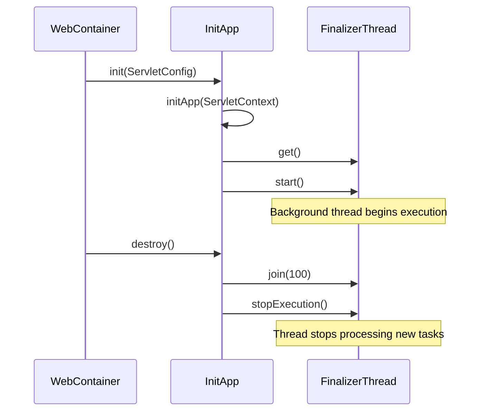
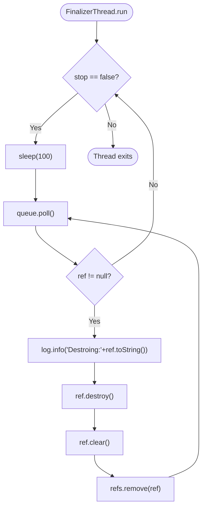
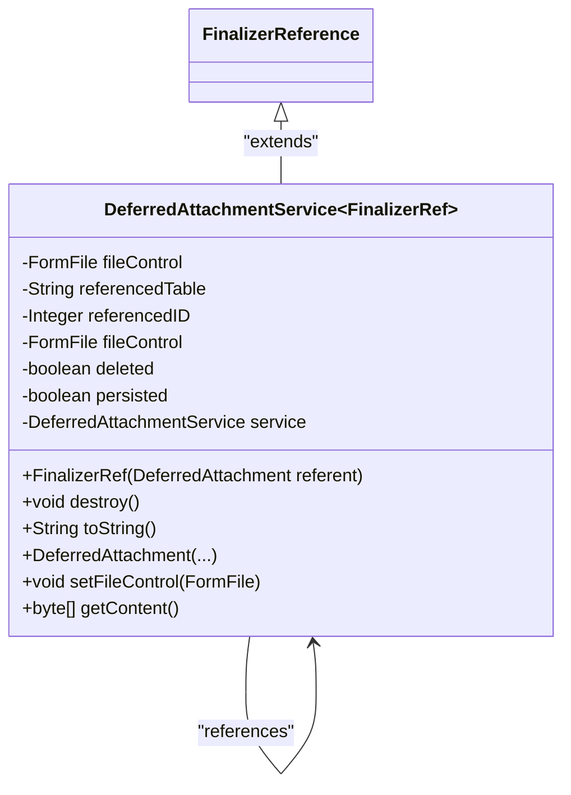

# Finalizer Thread Management

<cite>
**Referenced Files in This Document**   
- [FinalizerThread.java](file://src/main/java/net/sam/dcl/finalizer/FinalizerThread.java)
- [FinalizerReference.java](file://src/main/java/net/sam/dcl/finalizer/FinalizerReference.java)
- [InitApp.java](file://src/main/java/net/sam/dcl/servlets/InitApp.java)
- [DeferredAttachmentService.java](file://src/main/java/net/sam/dcl/service/DeferredAttachmentService.java)
- [VDbConnectionManager.java](file://src/main/java/net/sam/dcl/db/VDbConnectionManager.java)
</cite>

## Table of Contents
1. [Introduction](#introduction)
2. [FinalizerThread Architecture](#finalizerthread-architecture)
3. [Initialization and Lifecycle Management](#initialization-and-lifecycle-management)
4. [Task Queue and Execution Mechanism](#task-queue-and-execution-mechanism)
5. [Typical Cleanup Operations](#typical-cleanup-operations)
6. [Thread Safety and Exception Handling](#thread-safety-and-exception-handling)
7. [Graceful Shutdown Procedures](#graceful-shutdown-procedures)
8. [Monitoring and Logging](#monitoring-and-logging)
9. [Troubleshooting Guide](#troubleshooting-guide)
10. [Conclusion](#conclusion)

## Introduction
The FinalizerThread system in dcl_v3 provides a dedicated background processing mechanism for asynchronous resource cleanup, connection pool maintenance, and memory management tasks. This daemon thread operates outside the main request-response cycle, ensuring that resource-intensive cleanup operations do not impact application performance during normal user interactions. The system leverages Java's reference queue mechanism to detect when objects become phantom reachable, allowing for timely cleanup of resources such as temporary files, database connections, and cached data. This documentation details the architecture, implementation, and operational characteristics of the FinalizerThread system, providing comprehensive guidance for developers and system administrators.

## FinalizerThread Architecture

```mermaid
classDiagram
class FinalizerThread~T~ {
-static FinalizerThread finalizerThread
-ReferenceQueue<? super T> queue
-List<FinalizerReference<T>> refs
-boolean stop
+FinalizerThread()
+static FinalizerThread get()
+void run()
+void add(FinalizerReference ref)
+void stopExecution()
}
class FinalizerReference~T~ {
+FinalizerReference(T referent)
+abstract void destroy()
}
class DeferredAttachmentService {
+static class DeferredAttachment
+static class FinalizerRef
}
FinalizerThread --> FinalizerReference : "processes"
FinalizerReference <|-- FinalizerThread~T~.TestReference : "extends"
FinalizerReference <|-- DeferredAttachmentService.FinalizerRef : "extends"
FinalizerThread ..> DeferredAttachmentService : "used by"
```

**Diagram sources**
- [FinalizerThread.java](file://src/main/java/net/sam/dcl/finalizer/FinalizerThread.java#L0-L106)
- [FinalizerReference.java](file://src/main/java/net/sam/dcl/finalizer/FinalizerReference.java#L0-L17)
- [DeferredAttachmentService.java](file://src/main/java/net/sam/dcl/service/DeferredAttachmentService.java#L400-L539)

**Section sources**
- [FinalizerThread.java](file://src/main/java/net/sam/dcl/finalizer/FinalizerThread.java#L0-L106)
- [FinalizerReference.java](file://src/main/java/net/sam/dcl/finalizer/FinalizerReference.java#L0-L17)

## Initialization and Lifecycle Management

The FinalizerThread is initialized and started during application startup in the InitApp servlet, which is configured with a load-on-startup priority of 1 in web.xml. The thread follows a singleton pattern with a private constructor, ensuring only one instance exists throughout the application lifecycle. When the application starts, InitApp calls FinalizerThread.get().start() to begin the background processing loop. The thread is configured as a daemon thread with the name "FINALIZER", indicating it will not prevent the JVM from exiting when all other non-daemon threads have completed.

During application shutdown, the destroy() method of InitApp triggers the graceful shutdown sequence by calling shutdownApp(), which in turn stops the FinalizerThread. This lifecycle management ensures that cleanup operations are performed during both application startup and shutdown phases, maintaining system integrity across the entire application lifecycle.



**Diagram sources**
- [InitApp.java](file://src/main/java/net/sam/dcl/servlets/InitApp.java#L37-L86)
- [InitApp.java](file://src/main/java/net/sam/dcl/servlets/InitApp.java#L186-L226)
- [InitApp.java](file://src/main/java/net/sam/dcl/servlets/InitApp.java#L204-L226)

**Section sources**
- [InitApp.java](file://src/main/java/net/sam/dcl/servlets/InitApp.java#L37-L86)
- [InitApp.java](file://src/main/java/net/sam/dcl/servlets/InitApp.java#L186-L226)

## Task Queue and Execution Mechanism



**Diagram sources**
- [FinalizerThread.java](file://src/main/java/net/sam/dcl/finalizer/FinalizerThread.java#L43-L105)

**Section sources**
- [FinalizerThread.java](file://src/main/java/net/sam/dcl/finalizer/FinalizerThread.java#L43-L105)

The FinalizerThread implements a continuous execution loop that processes cleanup tasks from a reference queue. The thread uses a 100-millisecond sleep interval between processing cycles, providing a balance between responsiveness and CPU efficiency. The core mechanism relies on Java's PhantomReference and ReferenceQueue classes, where objects that need cleanup are wrapped in FinalizerReference instances and registered with the thread's reference queue. When the garbage collector determines that a referent object is phantom reachable, the corresponding FinalizerReference is enqueued for processing.

The execution loop first checks the stop flag, then polls the reference queue for available cleanup tasks. For each reference retrieved from the queue, the thread invokes the destroy() method to perform the cleanup operation, clears the reference, and removes it from the internal tracking list. This mechanism ensures that cleanup operations are performed asynchronously and do not block the main application threads.

## Typical Cleanup Operations

The FinalizerThread system is designed to handle various types of resource cleanup operations, with the DeferredAttachmentService providing a concrete example of its usage. When users upload files through the web interface, these files are temporarily stored in memory or on disk as part of the attachment process. The DeferredAttachmentService creates FinalizerReference instances for these temporary file attachments, ensuring they are properly cleaned up even if the user abandons the upload process or the session expires.

Specific cleanup operations include:
- Releasing temporary file handles and removing temporary files from the filesystem
- Closing database connections that were not properly released
- Clearing cached data structures that are no longer referenced
- Freeing memory-intensive objects that are no longer needed
- Cleaning up session-specific resources during session termination

The system's flexibility allows any resource that implements the FinalizerReference pattern to be managed by the background cleanup process, making it a versatile solution for various resource management scenarios.



**Diagram sources**
- [DeferredAttachmentService.java](file://src/main/java/net/sam/dcl/service/DeferredAttachmentService.java#L400-L539)

**Section sources**
- [DeferredAttachmentService.java](file://src/main/java/net/sam/dcl/service/DeferredAttachmentService.java#L397-L441)
- [DeferredAttachmentService.java](file://src/main/java/net/sam/dcl/service/DeferredAttachmentService.java#L493-L538)

## Thread Safety and Exception Handling

The FinalizerThread implementation incorporates several thread safety mechanisms to ensure reliable operation in a multi-threaded environment. The internal list of references (refs) is protected by synchronized blocks during add and remove operations, preventing concurrent modification exceptions. The stop flag is marked as volatile to ensure visibility across threads, allowing the shutdown signal to be properly propagated.

Exception handling within the execution loop is minimal by design, with only InterruptedException being caught and handled. This approach ensures that any unexpected exceptions during cleanup operations do not terminate the background thread, allowing it to continue processing subsequent tasks. The logging framework captures all cleanup operations, providing visibility into the thread's activities and any potential issues.

The system follows the principle of failing gracefully, where individual cleanup task failures do not affect the overall operation of the finalizer thread. This resilience is critical for a background cleanup system, as it ensures that the failure to clean up one resource does not prevent the cleanup of other resources.

**Section sources**
- [FinalizerThread.java](file://src/main/java/net/sam/dcl/finalizer/FinalizerThread.java#L43-L105)
- [FinalizerThread.java](file://src/main/java/net/sam/dcl/finalizer/FinalizerThread.java#L0-L44)

## Graceful Shutdown Procedures

The FinalizerThread implements a graceful shutdown procedure to ensure all pending cleanup tasks are processed before the thread terminates. During application shutdown, the InitApp servlet calls FinalizerThread.get().join(100) followed by stopExecution(). The join operation allows the thread up to 100 milliseconds to complete any currently executing cleanup tasks, while the stopExecution method sets the stop flag to prevent the processing of new tasks.

This two-phase shutdown approach balances the need for timely application termination with the requirement to complete essential cleanup operations. The short timeout period prevents the application from hanging indefinitely during shutdown, while still allowing sufficient time for immediate cleanup tasks to complete. After the finalizer thread stops, the application proceeds with the shutdown of other components, including the Quartz scheduler, Hibernate session factory, and database connection pool.

**Section sources**
- [InitApp.java](file://src/main/java/net/sam/dcl/servlets/InitApp.java#L204-L226)
- [FinalizerThread.java](file://src/main/java/net/sam/dcl/finalizer/FinalizerThread.java#L100-L105)

## Monitoring and Logging

The FinalizerThread system provides comprehensive logging through the Apache Commons Logging framework, with all cleanup operations recorded at the INFO level. Each time a resource is processed for cleanup, the system logs a message containing the reference's string representation, providing visibility into the types of resources being cleaned up. This logging approach enables administrators to monitor the thread's activity and verify that cleanup operations are occurring as expected.

The logging output includes both log.info statements and System.out.println calls, ensuring that cleanup activities are visible in both the application log files and the console output. This dual logging approach is particularly useful during development and troubleshooting, as it provides immediate feedback on the finalizer thread's operations.

Monitoring the finalizer thread's health can be accomplished by analyzing the frequency and types of cleanup operations in the logs. A healthy system will show regular cleanup activity, while issues such as thread starvation or infinite loops may be indicated by abnormal patterns in the log output.

**Section sources**
- [FinalizerThread.java](file://src/main/java/net/sam/dcl/finalizer/FinalizerThread.java#L43-L45)
- [InitApp.java](file://src/main/java/net/sam/dcl/servlets/InitApp.java#L204-L205)

## Troubleshooting Guide

Common issues with the FinalizerThread system include thread starvation, infinite loops, and resource leaks. Thread starvation can occur if the cleanup operations are too time-consuming, preventing the thread from processing new tasks in a timely manner. This can be identified by examining the time intervals between log entries - consistently long intervals may indicate that individual cleanup operations are taking too long.

Infinite loops are unlikely in the current implementation due to the simple polling mechanism, but could potentially occur if a cleanup operation somehow re-enqueues the same reference repeatedly. Resource leaks may occur if the FinalizerReference instances are not properly created or if the garbage collector is not running frequently enough to enqueue phantom references.

To troubleshoot finalizer thread issues:
1. Check the application logs for FinalizerThread activity patterns
2. Verify that cleanup operations are completing successfully
3. Monitor system memory usage to ensure resources are being properly released
4. Use JVM monitoring tools to examine thread states and garbage collection patterns
5. Consider increasing the logging level temporarily to capture more detailed information

If the finalizer thread becomes unresponsive, the application's graceful shutdown procedure will still terminate it after the 100-millisecond timeout, preventing the entire application from hanging during shutdown.

**Section sources**
- [FinalizerThread.java](file://src/main/java/net/sam/dcl/finalizer/FinalizerThread.java#L43-L105)
- [InitApp.java](file://src/main/java/net/sam/dcl/servlets/InitApp.java#L204-L226)

## Conclusion
The FinalizerThread system in dcl_v3 provides a robust mechanism for asynchronous resource cleanup and memory management. By operating as a dedicated background thread, it ensures that cleanup operations do not interfere with the main application flow while still providing timely release of system resources. The implementation leverages Java's reference queue mechanism to detect when objects become eligible for cleanup, providing an efficient and reliable approach to resource management.

The system's integration with the application lifecycle, from initialization in InitApp to graceful shutdown during application termination, ensures comprehensive resource management throughout the application's operation. Its use in components like DeferredAttachmentService demonstrates its effectiveness in preventing resource leaks, particularly for temporary file handling and other transient resources.

For optimal performance, developers should ensure that cleanup operations are lightweight and do not block the finalizer thread for extended periods. The current 100-millisecond sleep interval provides a reasonable balance between responsiveness and CPU efficiency, but this could be adjusted based on specific application requirements and observed performance characteristics.