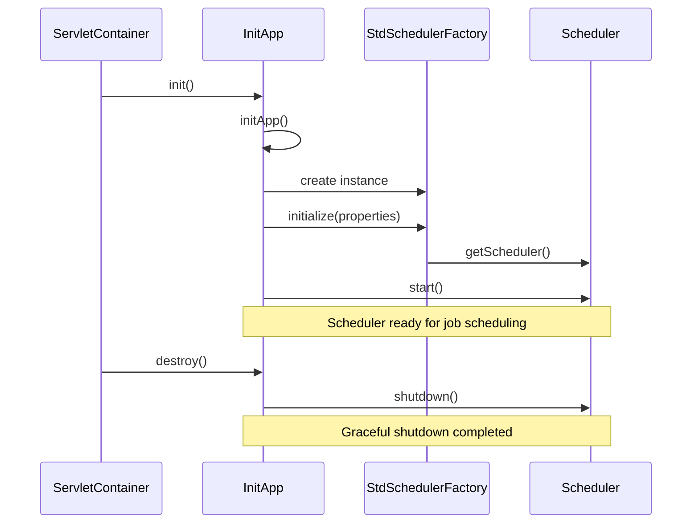
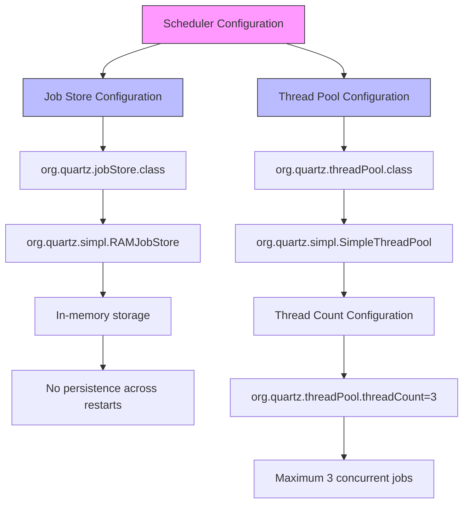
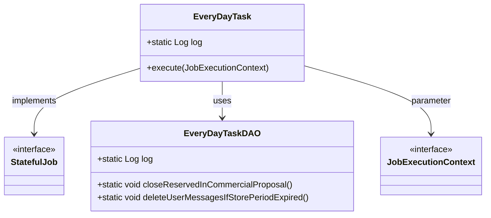
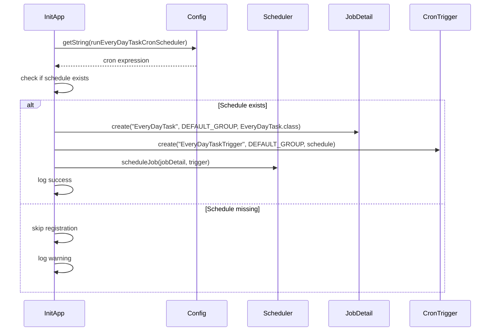
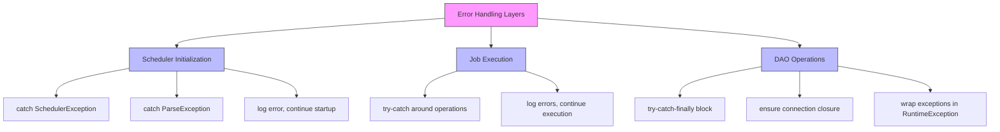

# Quartz Integration

<cite>
**Referenced Files in This Document**   
- [InitApp.java](file://src/main/java/net/sam/dcl/servlets/InitApp.java)
- [EveryDayTask.java](file://src/main/java/net/sam/dcl/tasks/EveryDayTask.java)
- [EveryDayTaskDAO.java](file://src/main/java/net/sam/dcl/dao/EveryDayTaskDAO.java)
- [Constants.java](file://src/main/java/net/sam/dcl/beans/Constants.java)
- [application.properties](file://src/main/resources/application.properties)
</cite>

## Table of Contents
1. [Introduction](#introduction)
2. [Scheduler Initialization](#scheduler-initialization)
3. [Job Store and Thread Pool Configuration](#job-store-and-thread-pool-configuration)
4. [EveryDayTask Implementation](#everydaytask-implementation)
5. [Job Registration and Scheduling](#job-registration-and-scheduling)
6. [Execution Context Management](#execution-context-management)
7. [Error Handling Strategies](#error-handling-strategies)
8. [Job Persistence and Monitoring](#job-persistence-and-monitoring)
9. [Troubleshooting Guide](#troubleshooting-guide)
10. [Conclusion](#conclusion)

## Introduction
The Quartz scheduler integration in dcl_v3 provides automated execution of daily maintenance tasks through a robust scheduling framework. The system is initialized during application startup in the InitApp servlet, where the Quartz scheduler is configured with specific job stores, thread pools, and trigger schedules. The primary scheduled job, EveryDayTask, performs critical daily operations including data cleanup and system maintenance. This documentation details the architecture, configuration, and operational aspects of the Quartz integration, providing comprehensive guidance for maintenance, extension, and troubleshooting of the scheduling system.

## Scheduler Initialization

The Quartz scheduler is initialized within the InitApp.java servlet during the application startup process. The initialization occurs in the initApp method, which is called when the servlet container starts up the web application. The scheduler is implemented as a private field within the InitApp class and is properly managed through the servlet lifecycle.

During initialization, the scheduler is configured programmatically through Java properties rather than external configuration files. The initialization process follows a structured sequence: first configuring the scheduler properties, then initializing the StdSchedulerFactory with these properties, obtaining the scheduler instance, and finally starting the scheduler. The scheduler is also properly shut down during application termination through the shutdownApp method, ensuring graceful shutdown and resource cleanup.



**Diagram sources**
- [InitApp.java](file://src/main/java/net/sam/dcl/servlets/InitApp.java#L186-L265)

**Section sources**
- [InitApp.java](file://src/main/java/net/sam/dcl/servlets/InitApp.java#L37-L86)
- [InitApp.java](file://src/main/java/net/sam/dcl/servlets/InitApp.java#L186-L265)

## Job Store and Thread Pool Configuration

The Quartz scheduler in dcl_v3 is configured with specific settings for job storage and thread management. The job store is configured to use RAMJobStore, which stores all scheduling data in memory rather than in a persistent database. This configuration choice prioritizes performance over persistence, meaning that scheduled jobs will not survive application restarts.

The thread pool is configured using SimpleThreadPool with a fixed size of three threads. This configuration limits the maximum number of concurrent job executions to three, providing resource constraints to prevent system overload. The thread pool configuration is set programmatically through the scheduler properties, with the threadCount property explicitly set to "3".

This configuration represents a balance between resource utilization and system stability, ensuring that background tasks can execute efficiently without consuming excessive system resources. However, the in-memory job store means that job definitions are not persisted across application restarts, which is an important consideration for system reliability and maintenance planning.



**Diagram sources**
- [InitApp.java](file://src/main/java/net/sam/dcl/servlets/InitApp.java#L186-L226)

**Section sources**
- [InitApp.java](file://src/main/java/net/sam/dcl/servlets/InitApp.java#L186-L226)

## EveryDayTask Implementation

The EveryDayTask class implements the StatefulJob interface from Quartz, defining a scheduled job that performs daily maintenance operations. As a stateful job, it prevents concurrent execution of the same job instance, ensuring that the maintenance tasks complete before a new instance can start. This is particularly important for data cleanup operations to prevent conflicts and data inconsistencies.

The task performs two primary functions: closing reserved items in commercial proposals and deleting expired user messages. These operations are implemented as static methods in the EveryDayTaskDAO class, which handles the database interactions. The execute method follows a structured pattern: logging the start of the task, executing the maintenance operations with appropriate error handling, and logging the completion.

Error handling within the task is implemented at the operation level, with exceptions caught and logged without preventing the execution of subsequent operations. This ensures that if one maintenance operation fails, the others will still execute, maximizing the effectiveness of the daily maintenance routine.



**Diagram sources**
- [EveryDayTask.java](file://src/main/java/net/sam/dcl/tasks/EveryDayTask.java#L16-L37)
- [EveryDayTaskDAO.java](file://src/main/java/net/sam/dcl/dao/EveryDayTaskDAO.java#L0-L58)

**Section sources**
- [EveryDayTask.java](file://src/main/java/net/sam/dcl/tasks/EveryDayTask.java#L16-L37)
- [EveryDayTaskDAO.java](file://src/main/java/net/sam/dcl/dao/EveryDayTaskDAO.java#L0-L58)

## Job Registration and Scheduling

The job registration process in dcl_v3 follows the Quartz framework's standard pattern for defining and scheduling jobs. The EveryDayTask is registered with the scheduler using a JobDetail object that specifies the job name, group, and class. The job is then associated with a CronTrigger that determines its execution schedule based on a cron expression.

The cron expression is not hardcoded but is retrieved from the application configuration through the Config.getString method, using the runEveryDayTaskCronScheduler constant from the Constants class. This design allows the schedule to be modified without code changes, providing flexibility for operations and maintenance.

The registration process includes validation to ensure that a schedule is defined before attempting to schedule the job. If the schedule string is null or empty, the job registration is skipped. This prevents errors during startup if the configuration is missing or incomplete. The successful registration is logged, providing visibility into the scheduling process.



**Diagram sources**
- [InitApp.java](file://src/main/java/net/sam/dcl/servlets/InitApp.java#L223-L265)
- [Constants.java](file://src/main/java/net/sam/dcl/beans/Constants.java#L0-L84)

**Section sources**
- [InitApp.java](file://src/main/java/net/sam/dcl/servlets/InitApp.java#L223-L265)
- [Constants.java](file://src/main/java/net/sam/dcl/beans/Constants.java#L0-L84)

## Execution Context Management

The Quartz integration in dcl_v3 manages execution context through the standard JobExecutionContext provided by the Quartz framework. The EveryDayTask implementation receives this context as a parameter to its execute method, allowing access to scheduler and trigger information if needed. However, the current implementation does not utilize the execution context for passing data or configuration to the job.

Instead, the job relies on static methods in the EveryDayTaskDAO class for data access, which obtain database connections through the VDbConnectionManager singleton. This approach simplifies the job implementation but limits flexibility in terms of dependency injection and testability. The job does not use the JobDataMap feature of Quartz to pass parameters or configuration, which could provide more flexibility for different execution scenarios.

The execution context is primarily used for logging purposes, with the job logging its start and completion. Error information is also logged when exceptions occur during task execution. This basic logging provides visibility into job execution but does not include detailed metrics or performance monitoring.

```mermaid
flowchart TD
A[Job Execution] --> B[execute(JobExecutionContext)]
B --> C{Context Usage}
C --> D[Logging: Task Started]
C --> E[Call DAO Methods]
C --> F[Logging: Task Finished]
C --> G[Error Logging]
H[JobDataMap] --> I[Not Utilized]
J[Dependency Injection] --> K[Not Implemented]
style A fill:#f9f,stroke:#333
style C fill:#bbf,stroke:#333
style H fill:#f96,stroke:#333
style J fill:#f96,stroke:#333
```

**Section sources**
- [EveryDayTask.java](file://src/main/java/net/sam/dcl/tasks/EveryDayTask.java#L16-L37)

## Error Handling Strategies

The Quartz integration implements multiple layers of error handling to ensure system stability and provide diagnostic information. At the scheduler initialization level, exceptions are caught and logged without preventing the overall application startup. SchedulerException and ParseException are caught during the scheduler setup, with error messages logged but the application continuing to initialize.

Within the EveryDayTask execution, error handling is implemented at the operation level. Each database operation is wrapped in a try-catch block, with exceptions caught and logged using the error level. This prevents a failure in one maintenance operation from stopping the execution of subsequent operations, ensuring that as much maintenance work as possible is completed.

The DAO methods implement their own error handling, with the closeReservedInCommercialProposal method wrapping exceptions in RuntimeException and ensuring that database connections are properly closed in the finally block. The deleteUserMessagesIfStorePeriodExpired method catches exceptions and logs them with the error level, allowing the task to continue execution.

This layered approach to error handling prioritizes system availability over strict error propagation, ensuring that maintenance tasks continue to execute even when individual operations fail.



**Section sources**
- [InitApp.java](file://src/main/java/net/sam/dcl/servlets/InitApp.java#L223-L265)
- [EveryDayTask.java](file://src/main/java/net/sam/dcl/tasks/EveryDayTask.java#L16-L37)
- [EveryDayTaskDAO.java](file://src/main/java/net/sam/dcl/dao/EveryDayTaskDAO.java#L0-L58)

## Job Persistence and Monitoring

The Quartz job persistence and monitoring in dcl_v3 has specific characteristics due to the configuration choices made in the system. With the RAMJobStore configuration, job definitions are not persisted across application restarts. This means that the EveryDayTask schedule must be re-established each time the application starts, which occurs through the initialization process in InitApp.java.

Monitoring of job execution is primarily achieved through logging. The system logs key events in the job lifecycle, including scheduler startup, job registration, task start, and task completion. Error conditions are also logged, providing diagnostic information for troubleshooting. However, there is no dedicated monitoring interface or metrics collection for job execution performance.

The logging approach provides basic visibility into job execution but lacks advanced monitoring features such as execution duration tracking, success/failure metrics, or alerting mechanisms. The logs are written to the application's logging system, which is configured through log4j.properties and logback.xml in the resources directory.

For production environments, this monitoring approach may need to be enhanced with additional metrics collection and alerting to ensure timely detection of job execution issues.

**Section sources**
- [InitApp.java](file://src/main/java/net/sam/dcl/servlets/InitApp.java#L223-L265)
- [EveryDayTask.java](file://src/main/java/net/sam/dcl/tasks/EveryDayTask.java#L16-L37)
- [application.properties](file://src/main/resources/application.properties#L0-L59)

## Troubleshooting Guide

This section provides guidance for troubleshooting common issues with the Quartz scheduler integration in dcl_v3.

### Misfired Triggers
Since the system uses RAMJobStore, misfired triggers during application downtime cannot be recovered. If the application is restarted, all scheduled jobs must be re-registered. To minimize the impact of misfired triggers, ensure that the cron expression for EveryDayTask is set appropriately in the configuration, and verify that the application startup process completes successfully.

### Job Concurrency Problems
The EveryDayTask is implemented as a StatefulJob, which prevents concurrent execution of the same job instance. This prevents data consistency issues but means that if a job execution takes longer than the scheduled interval, subsequent executions will be delayed. Monitor the task execution duration and adjust the schedule accordingly to prevent backlog.

### Database Lock Contention
The closeReservedInCommercialProposal operation temporarily disables and re-enables a database trigger (dcl_commercial_proposal_bu0) while executing the dcl_close_reserved_in_cpr stored procedure. This could potentially cause lock contention if other processes are accessing the same tables. Monitor database performance during job execution and consider scheduling the job during periods of low activity.

### Configuration Issues
Ensure that the runEveryDayTaskCronScheduler property is defined in the application configuration. If this property is missing or empty, the job will not be scheduled. Verify the cron expression format is correct, as invalid expressions will cause ParseException to be logged.

### Error Diagnosis
Check the application logs for messages containing "SCHEDULE:" which indicate scheduler-related events and errors. Look for "Task started" and "Task finished" messages to confirm job execution. If operations are failing, check for error messages from the EveryDayTaskDAO methods.

**Section sources**
- [InitApp.java](file://src/main/java/net/sam/dcl/servlets/InitApp.java#L223-L265)
- [EveryDayTask.java](file://src/main/java/net/sam/dcl/tasks/EveryDayTask.java#L16-L37)
- [EveryDayTaskDAO.java](file://src/main/java/net/sam/dcl/dao/EveryDayTaskDAO.java#L0-L58)

## Conclusion
The Quartz scheduler integration in dcl_v3 provides a reliable mechanism for executing daily maintenance tasks. The system is initialized during application startup in the InitApp servlet, where the scheduler is configured with an in-memory job store and a simple thread pool. The primary scheduled job, EveryDayTask, performs essential maintenance operations including data cleanup and system housekeeping.

Key characteristics of the implementation include the use of RAMJobStore (non-persistent), a fixed thread pool of three threads, and configuration-driven scheduling through the runEveryDayTaskCronScheduler property. The job implementation follows a stateful pattern to prevent concurrency issues and includes basic error handling to ensure task completion.

While the current implementation meets the basic requirements for scheduled task execution, opportunities for enhancement include implementing persistent job storage, improving monitoring and metrics collection, and adding more sophisticated error handling and alerting. The configuration-driven approach to scheduling provides flexibility for operations without requiring code changes.