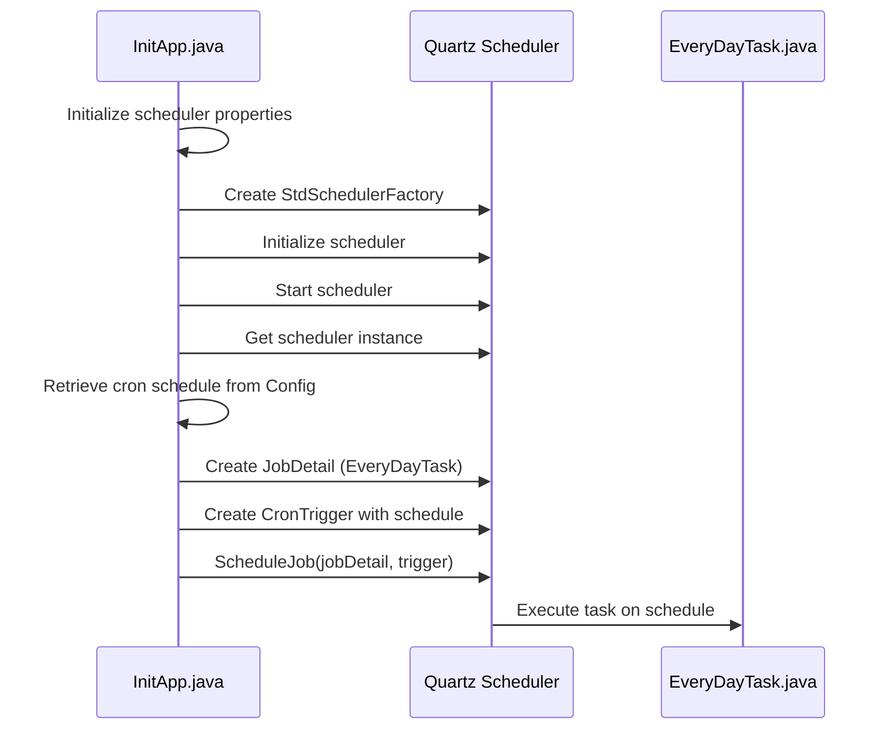
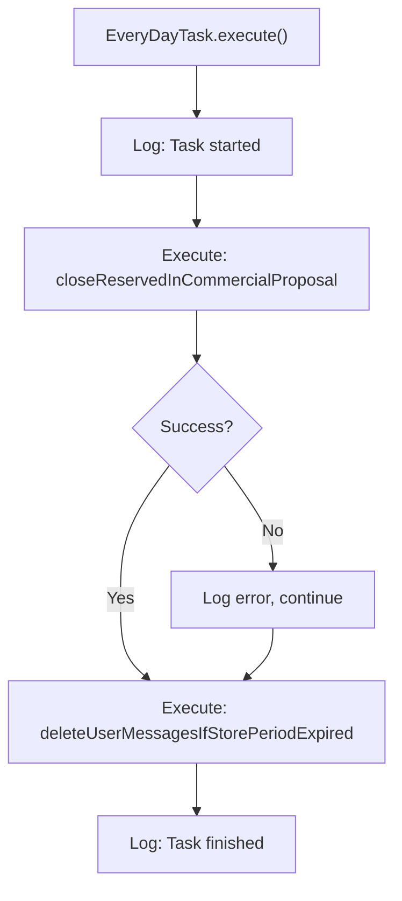
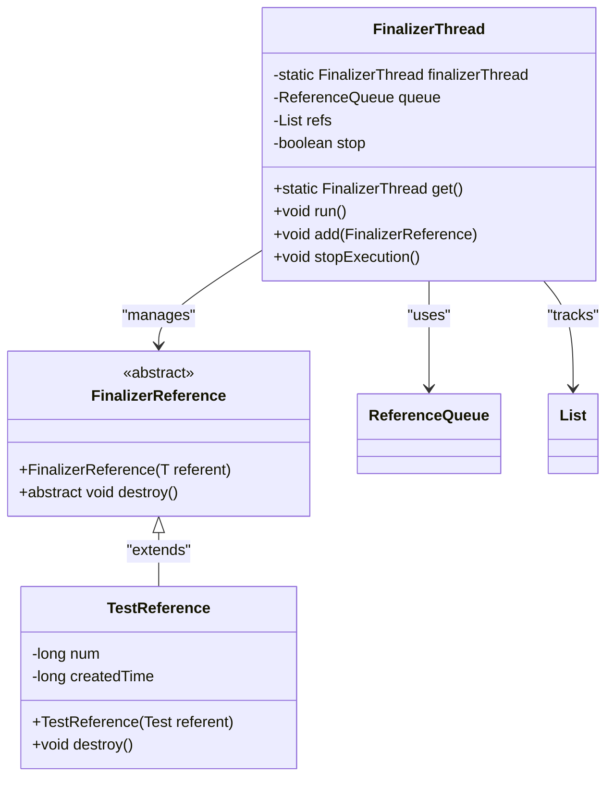
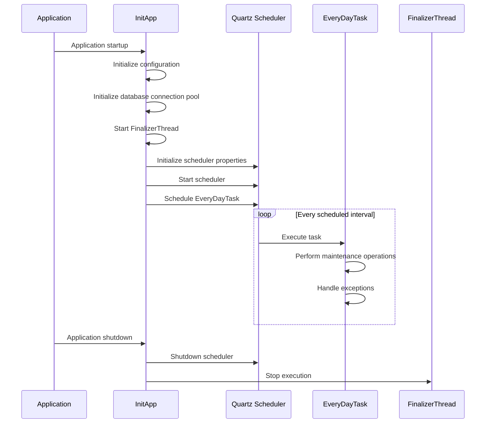

# Scheduling & Background Jobs

<cite>
**Referenced Files in This Document**   
- [InitApp.java](file://src/main/java/net/sam/dcl/servlets/InitApp.java)
- [EveryDayTask.java](file://src/main/java/net/sam/dcl/tasks/EveryDayTask.java)
- [FinalizerThread.java](file://src/main/java/net/sam/dcl/finalizer/FinalizerThread.java)
- [EveryDayTaskDAO.java](file://src/main/java/net/sam/dcl/dao/EveryDayTaskDAO.java)
- [Constants.java](file://src/main/java/net/sam/dcl/beans/Constants.java)
- [main.cfg](file://conf/main.cfg)
</cite>

## Table of Contents
1. [Introduction](#introduction)
2. [Quartz Scheduler Integration](#quartz-scheduler-integration)
3. [EveryDayTask Implementation](#everydaytask-implementation)
4. [FinalizerThread Background Processing](#finalizerthread-background-processing)
5. [Task Registration and Execution Lifecycle](#task-registration-and-execution-lifecycle)
6. [Creating New Scheduled Jobs](#creating-new-scheduled-jobs)
7. [Reliability and Error Handling](#reliability-and-error-handling)
8. [Monitoring and Troubleshooting](#monitoring-and-troubleshooting)
9. [Configuration Reference](#configuration-reference)

## Introduction
The dcl_v3 system implements a robust scheduling and background job framework using Quartz Scheduler for periodic maintenance tasks and a custom FinalizerThread for resource cleanup operations. This documentation provides comprehensive coverage of the scheduling architecture, including the initialization process, task implementations, execution lifecycle, and reliability considerations. The system is designed to handle critical daily maintenance operations such as database cleanup and message expiration while ensuring efficient background resource management.

**Section sources**
- [InitApp.java](file://src/main/java/net/sam/dcl/servlets/InitApp.java#L1-L301)
- [EveryDayTask.java](file://src/main/java/net/sam/dcl/tasks/EveryDayTask.java#L1-L39)

## Quartz Scheduler Integration
The Quartz scheduler is initialized during application startup in the InitApp servlet's initApp method. The system configures a RAMJobStore with a SimpleThreadPool containing three worker threads, providing a lightweight scheduling solution that persists jobs in memory. The scheduler is configured programmatically through Properties, setting the job store class to org.quartz.simpl.RAMJobStore and the thread pool class to org.quartz.simpl.SimpleThreadPool with a thread count of 3.

During initialization, the scheduler is started and configured to execute the EveryDayTask according to a cron expression retrieved from the application configuration. The cron schedule is obtained from the runEveryDayTaskCronScheduler property in the Constants class, allowing flexible configuration of the task execution frequency without code changes. The integration follows a standard Quartz pattern: creating a JobDetail that specifies the EveryDayTask class as the job implementation, and a CronTrigger that defines the execution schedule based on the configured cron expression.

**Diagram sources**
- [InitApp.java](file://src/main/java/net/sam/dcl/servlets/InitApp.java#L186-L265)
- [EveryDayTask.java](file://src/main/java/net/sam/dcl/tasks/EveryDayTask.java#L16-L37)

**Section sources**
- [InitApp.java](file://src/main/java/net/sam/dcl/servlets/InitApp.java#L186-L265)

## EveryDayTask Implementation
The EveryDayTask class implements the StatefulJob interface from Quartz, ensuring that only one instance of the job executes at a time, which prevents overlapping executions of maintenance operations. This implementation is crucial for database maintenance tasks that should not run concurrently to avoid data integrity issues. The task performs two primary daily maintenance operations: closing reserved items in commercial proposals and deleting expired user messages.

The execute method follows a structured pattern: logging the task start, executing the first database operation with exception handling, executing the second operation, and logging completion. The closeReservedInCommercialProposal operation temporarily deactivates a database trigger, executes a stored procedure to close reservations, and then reactivates the trigger, ensuring data consistency during the maintenance window. The deleteUserMessagesIfStorePeriodExpired method removes messages that have exceeded their retention period, helping to maintain database performance and comply with data retention policies.

**Diagram sources**
- [EveryDayTask.java](file://src/main/java/net/sam/dcl/tasks/EveryDayTask.java#L20-L36)
- [EveryDayTaskDAO.java](file://src/main/java/net/sam/dcl/dao/EveryDayTaskDAO.java#L1-L57)

**Section sources**
- [EveryDayTask.java](file://src/main/java/net/sam/dcl/tasks/EveryDayTask.java#L16-L37)
- [EveryDayTaskDAO.java](file://src/main/java/net/sam/dcl/dao/EveryDayTaskDAO.java#L1-L57)

## FinalizerThread Background Processing
The FinalizerThread provides a custom background processing mechanism for resource cleanup operations, implemented as a singleton thread that manages phantom references to objects requiring cleanup. Unlike the Quartz scheduler which handles time-based periodic tasks, the FinalizerThread handles event-driven cleanup operations, particularly for temporary resources like file uploads and attachments. The thread operates as a daemon with a 100ms sleep interval, continuously polling a ReferenceQueue for objects that have become phantom reachable.

The implementation uses a List to maintain strong references to FinalizerReference objects, preventing premature garbage collection while allowing the cleanup logic to execute when objects are no longer strongly referenced. When a reference is detected in the queue, the thread calls the destroy method on the reference, performs cleanup operations, and removes the reference from the tracking list. This pattern ensures that resources are cleaned up promptly after they are no longer needed, preventing memory leaks and temporary file accumulation.

**Diagram sources**
- [FinalizerThread.java](file://src/main/java/net/sam/dcl/finalizer/FinalizerThread.java#L16-L105)
- [FinalizerReference.java](file://src/main/java/net/sam/dcl/finalizer/FinalizerReference.java#L10-L16)

**Section sources**
- [FinalizerThread.java](file://src/main/java/net/sam/dcl/finalizer/FinalizerThread.java#L16-L105)

## Task Registration and Execution Lifecycle
The task registration process begins during application initialization in the InitApp servlet, where the Quartz scheduler is configured and started. The lifecycle follows a well-defined sequence: configuration retrieval, job detail creation, trigger creation, and job scheduling. The system retrieves the cron schedule from the application configuration using Config.getString(Constants.runEveryDayTaskCronScheduler), providing external configurability of the execution schedule.

When the cron expression matches the scheduled time, the Quartz scheduler invokes the execute method of the EveryDayTask instance. The StatefulJob interface ensures that the job instance maintains state between executions and prevents concurrent execution of the same job. After completion, the job remains registered with the scheduler and will execute again according to the cron schedule. During application shutdown, the scheduler is properly shut down in the shutdownApp method, ensuring graceful termination of any running jobs and cleanup of scheduler resources.

The FinalizerThread follows a different lifecycle pattern, starting as a daemon thread during application initialization and running continuously until application shutdown. It is registered as a singleton instance and started in the InitApp.initApp method. During shutdown, the thread is stopped by setting the stop flag to true and calling join with a timeout, allowing it to complete any ongoing cleanup operations before termination.

**Diagram sources**
- [InitApp.java](file://src/main/java/net/sam/dcl/servlets/InitApp.java#L186-L265)
- [InitApp.java](file://src/main/java/net/sam/dcl/servlets/InitApp.java#L267-L301)

**Section sources**
- [InitApp.java](file://src/main/java/net/sam/dcl/servlets/InitApp.java#L186-L301)

## Creating New Scheduled Jobs
To create a new scheduled job in the dcl_v3 system, developers should follow the established pattern demonstrated by the EveryDayTask implementation. First, create a new class that implements the Quartz Job interface (or StatefulJob if concurrent execution should be prevented). The class should include proper logging and implement the execute method with the desired business logic, following the error handling pattern of the existing implementation.

Next, register the new job in the InitApp.initApp method by adding code similar to the existing EveryDayTask registration. This involves creating a JobDetail with a unique name, specifying the new job class, creating a CronTrigger with the desired schedule (either hardcoded or retrieved from configuration), and scheduling the job with the scheduler instance. For configuration-driven schedules, add a new constant to the Constants class and reference it in the configuration file.

For jobs that require dependency injection or access to application context, consider using Quartz's JobDataMap to pass necessary services or references to the job instance. Ensure that all database operations use proper connection management with try-catch-finally blocks to guarantee connection closure, following the pattern in EveryDayTaskDAO. Test the new job thoroughly in a development environment, verifying both successful execution and proper error handling under failure conditions.

**Section sources**
- [InitApp.java](file://src/main/java/net/sam/dcl/servlets/InitApp.java#L223-L247)
- [EveryDayTask.java](file://src/main/java/net/sam/dcl/tasks/EveryDayTask.java#L16-L37)
- [Constants.java](file://src/main/java/net/sam/dcl/beans/Constants.java#L11-L84)

## Reliability and Error Handling
The scheduling system implements comprehensive error handling to ensure reliability and prevent cascading failures. In the EveryDayTask implementation, each major operation is wrapped in try-catch blocks that log errors but allow the task to continue processing subsequent operations. This fault-tolerant design ensures that a failure in one maintenance operation does not prevent other critical operations from executing.

The system uses centralized logging through Apache Commons Logging, with all scheduler-related operations and errors logged at appropriate levels (INFO for normal operation, ERROR for exceptions). The InitApp class includes exception handling for both SchedulerException and ParseException during scheduler initialization, preventing application startup failures due to configuration issues with the scheduling system.

For the FinalizerThread, error handling is implemented through the standard Thread exception handling mechanism, with any uncaught exceptions in the run method causing the thread to terminate. The destroy methods in FinalizerReference implementations should include their own error handling to prevent cleanup failures from affecting the main application flow. The system could be enhanced with additional reliability features such as job execution history tracking, failure rate monitoring, and automatic alerting for repeated job failures.

**Section sources**
- [EveryDayTask.java](file://src/main/java/net/sam/dcl/tasks/EveryDayTask.java#L20-L36)
- [InitApp.java](file://src/main/java/net/sam/dcl/servlets/InitApp.java#L248-L265)

## Monitoring and Troubleshooting
Effective monitoring of the scheduling system requires attention to several key areas. For Quartz scheduler issues, monitor the application logs for "SCHEDULE:" error messages which indicate problems with scheduler initialization, job scheduling, or parsing of cron expressions. Common issues include invalid cron expressions, database connectivity problems during job execution, and thread pool exhaustion when multiple jobs are configured to run simultaneously.

For task starvation issues, verify that the thread pool size (configured as 3 threads) is sufficient for the number of scheduled jobs. If jobs are not executing as expected, check the cron expression format and ensure the system clock is synchronized. Memory leaks in the FinalizerThread can occur if FinalizerReference objects are not properly removed from the refs list after processing, so monitor memory usage and review the destroy and cleanup logic in custom FinalizerReference implementations.

Troubleshooting steps include: verifying the cron schedule format, checking database connectivity and permissions for scheduled operations, reviewing log timestamps to confirm job execution, and validating that the FinalizerThread is running by checking for "Destroing" log messages. For persistent issues, temporarily increase logging verbosity and consider implementing additional monitoring hooks to track job execution duration and frequency.

**Section sources**
- [InitApp.java](file://src/main/java/net/sam/dcl/servlets/InitApp.java#L248-L265)
- [FinalizerThread.java](file://src/main/java/net/sam/dcl/finalizer/FinalizerThread.java#L31-L52)
- [EveryDayTask.java](file://src/main/java/net/sam/dcl/tasks/EveryDayTask.java#L20-L36)

## Configuration Reference
The scheduling system configuration is primarily controlled through the main.cfg configuration file and the Constants.java class. The runEveryDayTaskCronScheduler constant in Constants.java defines the configuration key used to retrieve the cron expression for the daily maintenance task. This value should be set in the main.cfg file using the key runEveryDayTaskCronScheduler followed by a valid cron expression.

Additional configuration parameters include deleteUserMessagesPeriod which determines how many days user messages are retained before deletion, and various thread pool settings for the Quartz scheduler. The system uses a RAMJobStore which does not require external configuration but limits job persistence to the application lifecycle. For production environments requiring job persistence across restarts, the configuration could be extended to use a JDBCJobStore with database-backed persistence.

The FinalizerThread does not require external configuration as it operates with hardcoded parameters, but the sleep interval (100ms) could be made configurable if needed for performance tuning. All configuration changes should be tested thoroughly in a non-production environment to ensure they do not adversely affect system performance or stability.

**Section sources**
- [Constants.java](file://src/main/java/net/sam/dcl/beans/Constants.java#L66-L66)
- [main.cfg](file://conf/main.cfg)
- [InitApp.java](file://src/main/java/net/sam/dcl/servlets/InitApp.java#L186-L222)