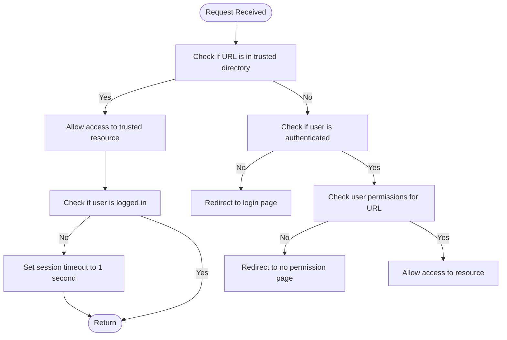
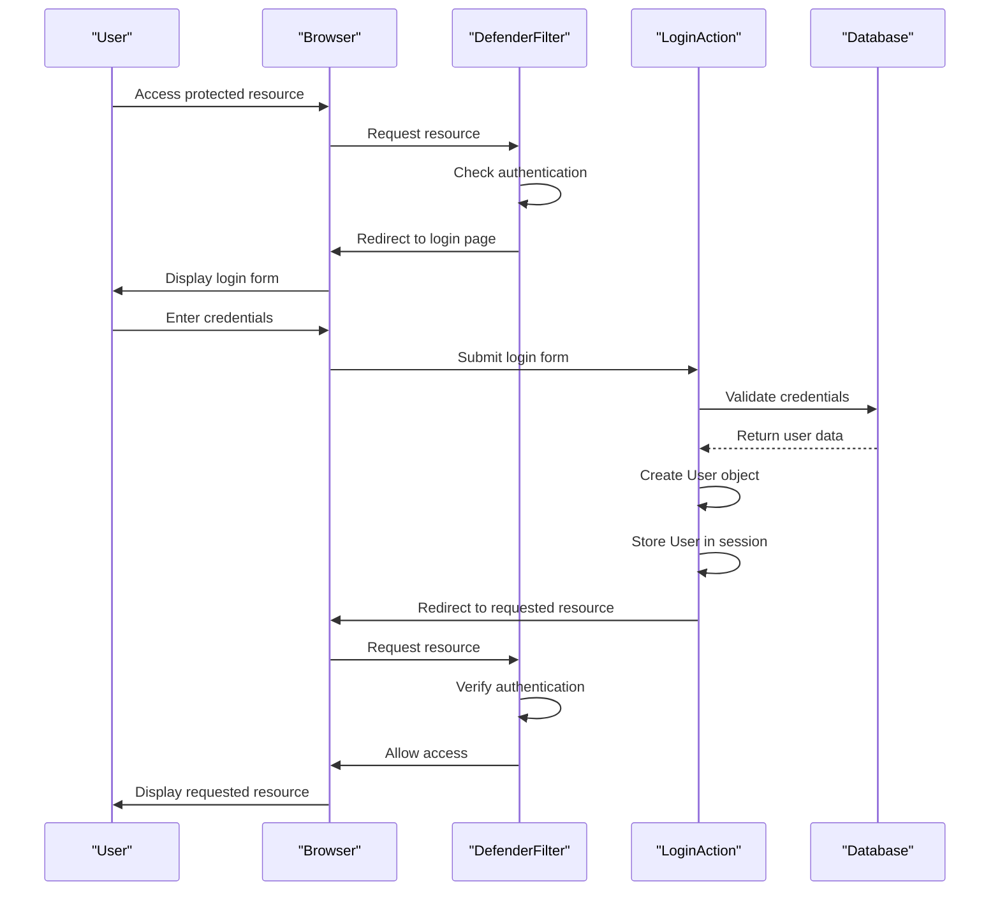
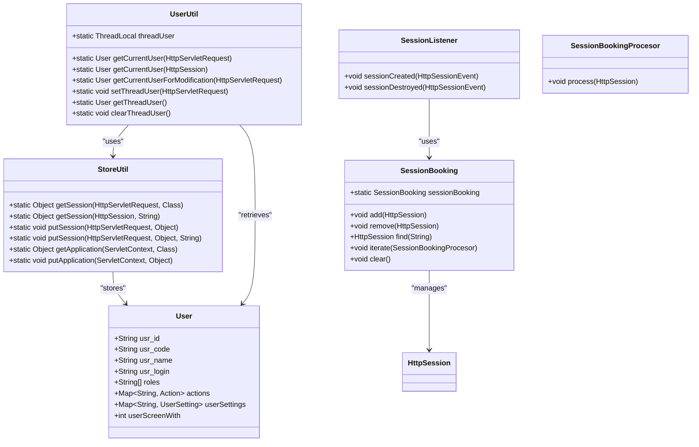
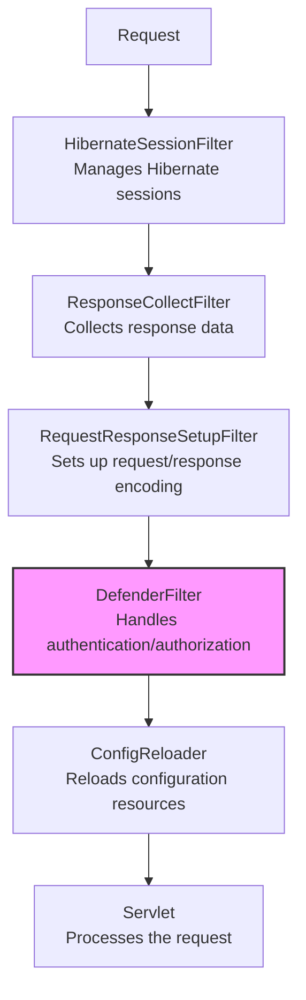
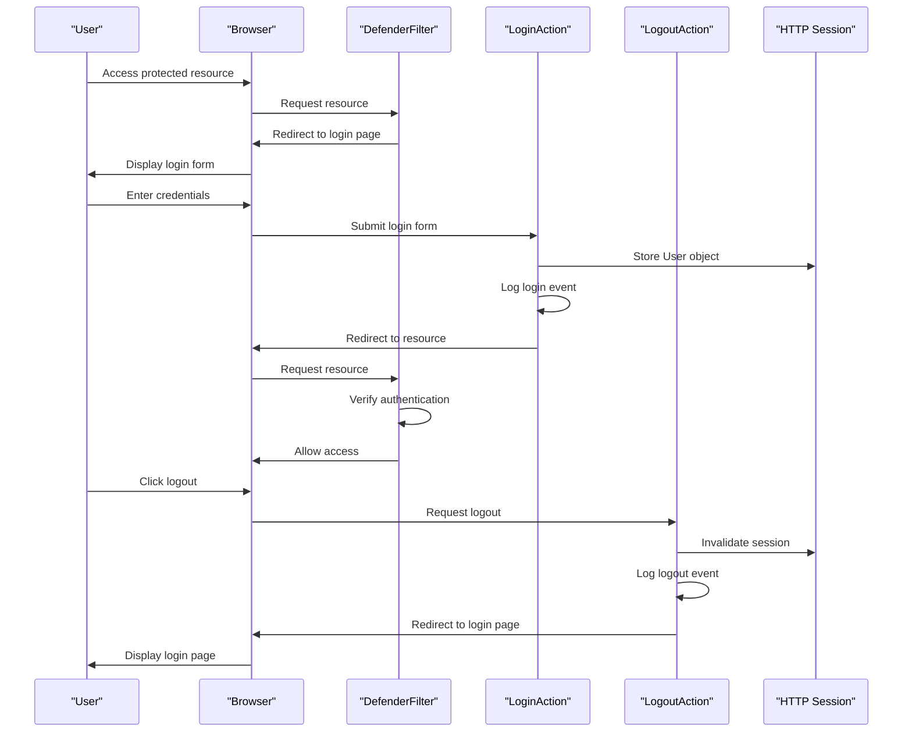

# Authentication Filter

<cite>
**Referenced Files in This Document**   
- [DefenderFilter.java](file://src/main/java/net/sam/dcl/filters/DefenderFilter.java)
- [web.xml](file://src/main/webapp/WEB-INF/web.xml)
- [PermissionChecker.java](file://src/main/java/net/sam/dcl/navigation/PermissionChecker.java)
- [LoginAction.java](file://src/main/java/net/sam/dcl/action/LoginAction.java)
- [LogoutAction.java](file://src/main/java/net/sam/dcl/action/LogoutAction.java)
- [UserUtil.java](file://src/main/java/net/sam/dcl/util/UserUtil.java)
- [StoreUtil.java](file://src/main/java/net/sam/dcl/util/StoreUtil.java)
- [login.jsp](file://src/main/webapp/jsp/login.jsp)
</cite>

## Table of Contents
1. [Introduction](#introduction)
2. [DefenderFilter Implementation](#defenderfilter-implementation)
3. [Authentication Flow](#authentication-flow)
4. [Session Management](#session-management)
5. [Security Considerations](#security-considerations)
6. [Configuration](#configuration)
7. [Error Handling](#error-handling)
8. [Integration with Login Process](#integration-with-login-process)
9. [Conclusion](#conclusion)

## Introduction
The DefenderFilter is a critical component of the DCL application's security architecture, responsible for enforcing authentication and authorization across all incoming requests. This filter intercepts requests to protected resources and validates user session state by checking for the presence of a valid user object in the session. The authentication mechanism ensures that only authenticated users with appropriate permissions can access protected resources, while unauthenticated users are redirected to the login page.

The DefenderFilter works in conjunction with other security components including the PermissionChecker utility, LoginAction, and LogoutAction to provide a comprehensive authentication and authorization system. The filter is configured through web.xml and integrates with the application's session management system to maintain user context throughout their session.

**Section sources**
- [DefenderFilter.java](file://src/main/java/net/sam/dcl/filters/DefenderFilter.java#L1-L70)
- [web.xml](file://src/main/webapp/WEB-INF/web.xml#L1-L176)

## DefenderFilter Implementation
The DefenderFilter implements the javax.servlet.Filter interface and serves as the primary authentication gatekeeper for the application. The filter's doFilter method contains the core logic for authentication and authorization checks. When a request is processed, the filter first determines if the requested resource is in a trusted directory by calling PermissionChecker.isTrusted(request). Trusted directories include /trusted.*, /includes.*, /images.*, and /test.*, which are configured in web.xml.

For requests to trusted resources, the filter allows the request to proceed through the filter chain. However, it implements a security measure by setting the session's maximum inactive interval to 1 second if the user is not logged in, effectively expiring the session quickly for unauthenticated users accessing trusted resources.

For non-trusted resources, the filter checks if the user is authenticated by calling PermissionChecker.isUserLogged(request). If the user is not authenticated, the filter redirects the request to the login page specified in the configuration. If the user is authenticated, the filter performs additional authorization checks by calling PermissionChecker.checkURL(request, withParameter) to verify the user has appropriate permissions for the requested resource.

**Diagram sources**
- [DefenderFilter.java](file://src/main/java/net/sam/dcl/filters/DefenderFilter.java#L15-L70)

**Section sources**
- [DefenderFilter.java](file://src/main/java/net/sam/dcl/filters/DefenderFilter.java#L15-L70)

## Authentication Flow
The authentication flow begins when a user attempts to access a protected resource. The DefenderFilter intercepts the request and checks the user's authentication status. If the user is not authenticated, they are redirected to the login page at /trusted/Login.do?dispatch=input. The login page presents a form where users can enter their credentials (username and password).

Upon submission, the LoginAction.process method handles the authentication request. It validates the provided credentials against the database by executing queries to load user information and verify the password. If authentication succeeds, the system creates a User object containing the user's ID, code, name, login, roles, actions, and settings. This User object is then stored in the session using StoreUtil.putSession, establishing the user's authenticated session context.

**Diagram sources**
- [DefenderFilter.java](file://src/main/java/net/sam/dcl/filters/DefenderFilter.java#L15-L70)
- [LoginAction.java](file://src/main/java/net/sam/dcl/action/LoginAction.java#L45-L120)

**Section sources**
- [DefenderFilter.java](file://src/main/java/net/sam/dcl/filters/DefenderFilter.java#L15-L70)
- [LoginAction.java](file://src/main/java/net/sam/dcl/action/LoginAction.java#L45-L120)

## Session Management
The application's session management system is designed to securely maintain user context throughout their interaction with the application. When a user successfully authenticates, their User object is stored in the HTTP session using StoreUtil.putSession. The UserUtil class provides utility methods for accessing the current user from the session, with getCurrentUser(HttpServletRequest request) and getCurrentUser(HttpSession session) methods that retrieve the User object from session attributes.

The session lifecycle is managed through several components. The SessionListener class implements HttpSessionListener to track session creation and destruction events. When a session is destroyed, the listener ensures that any locked records associated with that session are properly unlocked, preventing resource leaks. The SessionBooking class maintains a registry of active sessions, allowing the system to iterate over all active sessions when needed, such as during application shutdown.

Session timeout is handled through standard HTTP session configuration, with the DefenderFilter implementing an additional security measure for unauthenticated users accessing trusted resources by setting their session timeout to 1 second. This prevents lingering sessions for users who have not completed authentication.

**Diagram sources**
- [User.java](file://src/main/java/net/sam/dcl/beans/User.java#L1-L564)
- [StoreUtil.java](file://src/main/java/net/sam/dcl/util/StoreUtil.java#L1-L97)
- [UserUtil.java](file://src/main/java/net/sam/dcl/util/UserUtil.java#L1-L54)
- [SessionListener.java](file://src/main/java/net/sam/dcl/session/SessionListener.java#L1-L28)
- [SessionBooking.java](file://src/main/java/net/sam/dcl/session/SessionBooking.java#L1-L67)

**Section sources**
- [User.java](file://src/main/java/net/sam/dcl/beans/User.java#L1-L564)
- [StoreUtil.java](file://src/main/java/net/sam/dcl/util/StoreUtil.java#L1-L97)
- [UserUtil.java](file://src/main/java/net/sam/dcl/util/UserUtil.java#L1-L54)
- [SessionListener.java](file://src/main/java/net/sam/dcl/session/SessionListener.java#L1-L28)
- [SessionBooking.java](file://src/main/java/net/sam/dcl/session/SessionBooking.java#L1-L67)

## Security Considerations
The authentication system incorporates several security measures to protect against common vulnerabilities. The DefenderFilter provides protection against unauthorized access to protected resources by enforcing authentication checks on all incoming requests. The filter also implements role-based access control through the PermissionChecker.checkURL method, which verifies that authenticated users have appropriate permissions for the requested resource based on their roles.

Session fixation protection is implemented through the standard session management mechanisms. When a user logs in, their User object is stored in the existing session, but the system does not create a new session, which could potentially expose the application to session fixation attacks. However, the application could enhance security by invalidating the session and creating a new one upon successful authentication.

Secure cookie handling is managed through the container's session management, with session cookies following standard security practices. The application could further enhance security by configuring the session cookie with the HttpOnly and Secure flags, although this configuration would be handled at the container level rather than in the application code.

The login process includes several security validations, such as checking whether login is disabled globally, verifying that the user account is not blocked, and validating that the user has appropriate entry permissions based on their IP address (distinguishing between local and internet access). Passwords are stored in the database in encrypted form, although the specific encryption mechanism is not visible in the provided code.

**Section sources**
- [DefenderFilter.java](file://src/main/java/net/sam/dcl/filters/DefenderFilter.java#L15-L70)
- [PermissionChecker.java](file://src/main/java/net/sam/dcl/navigation/PermissionChecker.java#L1-L104)
- [LoginAction.java](file://src/main/java/net/sam/dcl/action/LoginAction.java#L1-L120)

## Configuration
The DefenderFilter is configured in the web.xml deployment descriptor with several initialization parameters that define its behavior. The filter is mapped to intercept all requests (*/*) through the filter-mapping configuration. The key configuration parameters include:

- **login-page**: Specifies the URL to which unauthenticated users are redirected. In this application, it is set to /trusted/Login.do?dispatch=input.
- **trusted-dirs**: Defines a regular expression pattern for directories that are considered trusted and do not require authentication. The pattern (\/trusted.*)|(\/includes.*)|(\/images.*)|(\/test.*) allows access to resources in the trusted, includes, images, and test directories without authentication.
- **forward-no-perm-page**: Specifies the URL to which users are redirected when they lack permission to access a resource. In this application, it is set to /trusted/NoPermission.do.

The filter is part of a chain of filters that includes HibernateSessionFilter, ResponseCollectFilter, RequestResponseSetupFilter, and ConfigReloader, each serving specific purposes in the request processing pipeline. The order of filter-mapping in web.xml determines the sequence in which these filters are applied to incoming requests.

**Diagram sources**
- [web.xml](file://src/main/webapp/WEB-INF/web.xml#L1-L176)

**Section sources**
- [web.xml](file://src/main/webapp/WEB-INF/web.xml#L1-L176)

## Error Handling
The authentication system includes comprehensive error handling for various failure scenarios. When authentication fails, the system provides specific error messages to guide users. The LoginAction class uses StrutsUtil.addError to add error messages to the context, which are then displayed to the user on the login page. Error conditions include:

- Invalid username: Displayed when the provided username does not exist in the system
- Invalid password: Displayed when the provided password does not match the stored password
- Blocked account: Displayed when the user account is blocked (usr_block = '1')
- Login disabled: Displayed when global login is disabled (App.loginDisabled = true)
- Local access blocked: Displayed when the user attempts to log in from a local IP address but local entry is disabled
- Internet access blocked: Displayed when the user attempts to log in from an internet IP address but internet entry is disabled

For authorization failures, when an authenticated user attempts to access a resource they don't have permission to access, the DefenderFilter redirects them to the no permission page specified in the forward-no-perm-page configuration parameter. The NoPermissionAction handles this request and displays an appropriate message to the user.

The system also handles session-related errors gracefully. The SessionListener ensures that when a session is destroyed (either through timeout or explicit invalidation), any resources locked by that session are properly released. The SessionsAction allows administrators to view active sessions and includes error handling for cases where a session becomes invalid during iteration.

**Section sources**
- [LoginAction.java](file://src/main/java/net/sam/dcl/action/LoginAction.java#L1-L120)
- [NoPermissionAction.java](file://src/main/java/net/sam/dcl/action/NoPermissionAction.java#L1-L19)
- [SessionListener.java](file://src/main/java/net/sam/dcl/session/SessionListener.java#L1-L28)
- [SessionsAction.java](file://src/main/java/net/sam/dcl/session/SessionsAction.java#L1-L41)

## Integration with Login Process
The DefenderFilter is tightly integrated with the login process to provide a seamless authentication experience. When an unauthenticated user attempts to access a protected resource, the DefenderFilter intercepts the request and redirects them to the login page. After successful authentication, the LoginAction stores the User object in the session and redirects the user back to the originally requested resource or to a default landing page.

The login process captures additional user information beyond just credentials. The login form includes a hidden field for userScreenWith, which captures the user's screen width via JavaScript. This information is stored in the User object and can be used for responsive design or analytics purposes. The LoginAction also logs authentication events in the database through DbLogging.logAction, providing an audit trail of user logins.

The logout process is handled by the LogoutAction, which invalidates the user's session and logs the logout event. After logout, the user is redirected back to the login page, where they can authenticate again if needed. This complete integration between the DefenderFilter, LoginAction, and LogoutAction creates a robust authentication cycle that securely manages user sessions from login to logout.

**Diagram sources**
- [DefenderFilter.java](file://src/main/java/net/sam/dcl/filters/DefenderFilter.java#L15-L70)
- [LoginAction.java](file://src/main/java/net/sam/dcl/action/LoginAction.java#L1-L120)
- [LogoutAction.java](file://src/main/java/net/sam/dcl/action/LogoutAction.java#L1-L16)

**Section sources**
- [DefenderFilter.java](file://src/main/java/net/sam/dcl/filters/DefenderFilter.java#L15-L70)
- [LoginAction.java](file://src/main/java/net/sam/dcl/action/LoginAction.java#L1-L120)
- [LogoutAction.java](file://src/main/java/net/sam/dcl/action/LogoutAction.java#L1-L16)

## Conclusion
The DefenderFilter authentication mechanism provides a robust and secure foundation for the DCL application's security architecture. By intercepting all incoming requests and validating user session state, the filter ensures that only authenticated and authorized users can access protected resources. The integration with the PermissionChecker utility enables fine-grained access control based on user roles and permissions.

The system's design follows established security patterns, including centralized authentication, session management, and comprehensive error handling. The configuration through web.xml provides flexibility in defining trusted resources and redirect targets, while the integration with the login process creates a seamless user experience.

Key strengths of the authentication system include its comprehensive coverage of all requests, its extensible permission model, and its integration with application logging for audit purposes. Potential areas for enhancement include implementing session regeneration on login to prevent session fixation attacks, adding support for remember-me functionality, and incorporating multi-factor authentication options.

Overall, the DefenderFilter and its associated components form a critical security layer that protects the application's resources while providing a user-friendly authentication experience.