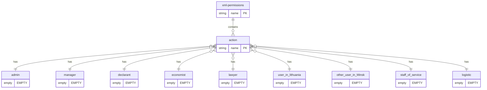
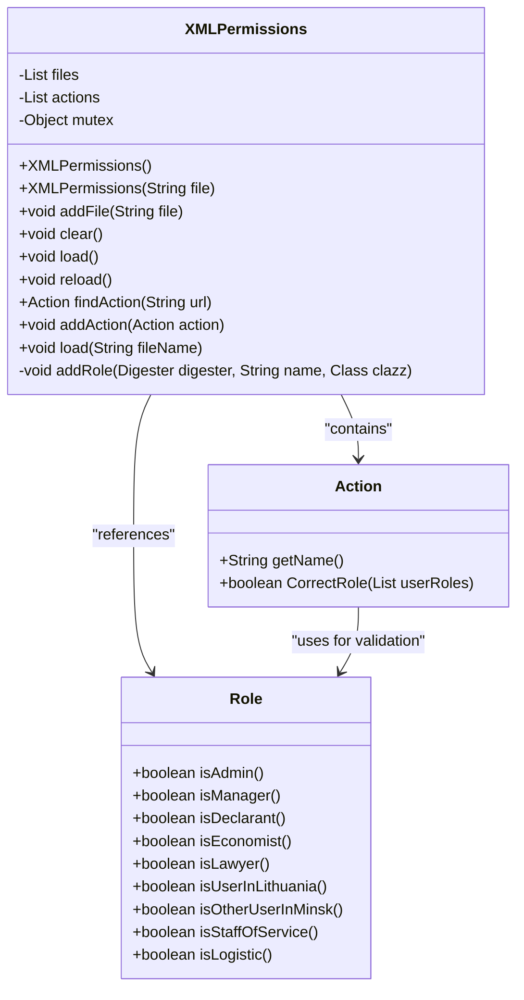
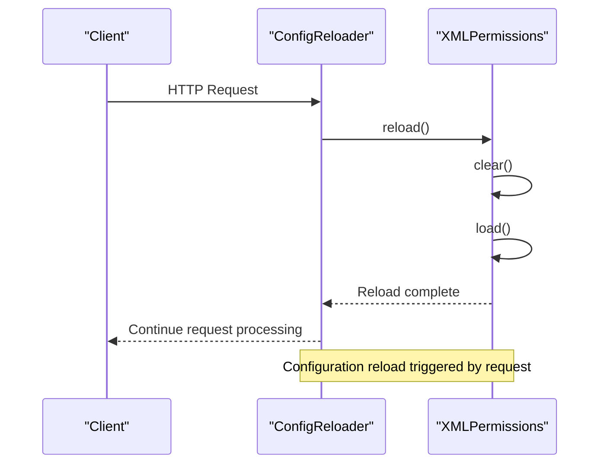
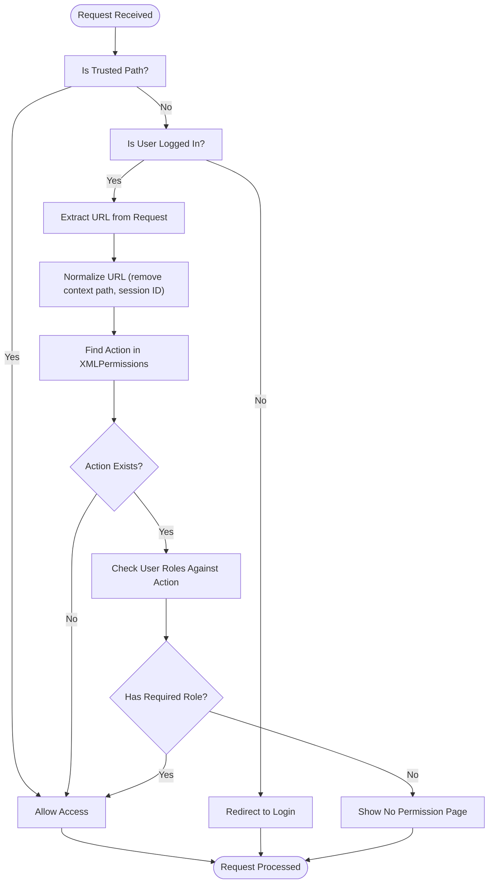

# Permission Configuration

<cite>
**Referenced Files in This Document**   
- [XMLPermissions.java](file://src/main/java/net/sam/dcl/navigation/XMLPermissions.java)
- [PermissionChecker.java](file://src/main/java/net/sam/dcl/navigation/PermissionChecker.java)
- [xml-permissions_1_1.dtd](file://src/main/webapp/WEB-INF/classes/resources/dtd/xml-permissions_1_1.dtd)
- [DefenderFilter.java](file://src/main/java/net/sam/dcl/filters/DefenderFilter.java)
- [ConfigReloader.java](file://src/main/java/net/sam/dcl/filters/ConfigReloader.java)
- [Role.java](file://src/main/java/net/sam/dcl/beans/Role.java)
- [web.xml](file://src/main/webapp/WEB-INF/web.xml)
</cite>

## Table of Contents
1. [Introduction](#introduction)
2. [XML Permission Configuration](#xml-permission-configuration)
3. [XMLPermissions Class](#xmlpermissions-class)
4. [Dynamic Reloading Mechanism](#dynamic-reloading-mechanism)
5. [Permission Checking Process](#permission-checking-process)
6. [Role-Based Access Control](#role-based-access-control)
7. [Common Issues and Troubleshooting](#common-issues-and-troubleshooting)
8. [Conclusion](#conclusion)

## Introduction
The permission configuration system in the DCL application provides a flexible and extensible mechanism for managing access control through XML-based configuration files. This system enables administrators to define URL patterns and associate them with specific user roles, allowing for fine-grained control over application functionality. The system leverages the Apache Commons Digester library to parse XML configuration files at application startup and supports dynamic reloading of permission configurations without requiring application restarts. This document details the architecture, implementation, and usage of the permission configuration system, including the XML schema, parsing mechanism, and runtime permission checking process.

**Section sources**
- [XMLPermissions.java](file://src/main/java/net/sam/dcl/navigation/XMLPermissions.java#L1-L50)
- [PermissionChecker.java](file://src/main/java/net/sam/dcl/navigation/PermissionChecker.java#L1-L20)

## XML Permission Configuration
The permission system uses XML files to define access control rules based on URL patterns and user roles. These configuration files adhere to the xml-permissions_1_1.dtd schema, which defines the structure and constraints for permission definitions. The root element of the configuration is `<xml-permissions>`, which contains multiple `<action>` elements, each representing a URL pattern that requires permission checking.

Each `<action>` element has a required `name` attribute that specifies the URL pattern to match. The URL pattern can include query parameters and supports prefix-based matching, allowing a single pattern to cover multiple related URLs. Within each `<action>` element, role-specific child elements indicate which roles have access to the specified URL pattern. The supported role elements include: `<admin>`, `<manager>`, `<declarant>`, `<economist>`, `<lawyer>`, `<user_in_lithuania>`, `<other_user_in_Minsk>`, `<staff_of_service>`, and `<logistic>`.



**Diagram sources**
- [xml-permissions_1_1.dtd](file://src/main/webapp/WEB-INF/classes/resources/dtd/xml-permissions_1_1.dtd#L1-L30)

**Section sources**
- [xml-permissions_1_1.dtd](file://src/main/webapp/WEB-INF/classes/resources/dtd/xml-permissions_1_1.dtd#L1-L30)
- [XMLPermissions.java](file://src/main/java/net/sam/dcl/navigation/XMLPermissions.java#L100-L120)

### Example XML Configuration
The following example demonstrates a valid XML permission configuration:

```xml
<?xml version="1.0" encoding="utf-8"?>
<!DOCTYPE xml-permissions SYSTEM "xml-permissions_1_1.dtd">
<xml-permissions>
  <action name="/Menu.do?current_menu_id=id.contract">
    <admin/>
    <manager/>
    <declarant/>
  </action>
  <action name="/OrderAction.do?dispatch=edit">
    <admin/>
    <manager/>
    <economist/>
  </action>
  <action name="/ReportAction.do?dispatch=generate">
    <admin/>
    <manager/>
    <lawyer/>
    <economist/>
  </action>
  <action name="/ShippingAction.do">
    <admin/>
    <manager/>
    <logistic/>
    <staff_of_service/>
  </action>
</xml-permissions>
```

In this example, different URL patterns are associated with specific roles. For instance, only administrators, managers, and declarants can access the contract menu, while report generation is restricted to administrators, managers, lawyers, and economists. The shipping functionality is accessible to administrators, managers, logistics personnel, and service staff.

**Section sources**
- [xml-permissions_1_1.dtd](file://src/main/webapp/WEB-INF/classes/resources/dtd/xml-permissions_1_1.dtd#L1-L30)

## XMLPermissions Class
The XMLPermissions class serves as the core component for loading, parsing, and managing permission configurations in the application. This class utilizes the Apache Commons Digester library to parse XML configuration files according to the xml-permissions_1_1.dtd schema. During application startup, the XMLPermissions instance reads the configuration files, processes the permission rules, and stores them in memory for efficient runtime access.

The class provides several key methods for managing permission configurations. The `load()` method reads one or more XML files and parses them into Action objects, which are stored in an internal list. The `addFile()` method allows multiple permission files to be registered with the system, enabling modular configuration management. The `findAction()` method performs prefix-based URL matching to determine if a requested URL has associated permission rules.



**Diagram sources**
- [XMLPermissions.java](file://src/main/java/net/sam/dcl/navigation/XMLPermissions.java#L19-L154)
- [Action.java](file://src/main/java/net/sam/dcl/navigation/Action.java#L1-L50)
- [Role.java](file://src/main/java/net/sam/dcl/beans/Role.java#L1-L50)

**Section sources**
- [XMLPermissions.java](file://src/main/java/net/sam/dcl/navigation/XMLPermissions.java#L19-L154)

### Loading and Parsing Mechanism
The XMLPermissions class uses the Digester framework to map XML elements to Java objects during parsing. When the `load()` method is called, it creates a Digester instance and configures it with rules that specify how to process the XML structure. The digester is set to validate against the DTD schema to ensure configuration integrity.

The parsing process begins by registering the DTD file location so the parser can validate the XML structure. Then, rules are established for creating Action objects when `<action>` elements are encountered, setting their properties from XML attributes, and adding them to the internal actions list. For each supported role, the `addRole()` method configures the digester to create role-specific objects when the corresponding XML elements are found and associate them with the parent action.

During parsing, if any errors occur (such as invalid XML structure or DTD validation failures), they are caught and logged, allowing the application to continue running with whatever valid configurations were successfully loaded. This fault-tolerant approach ensures that a single malformed configuration file does not prevent the entire permission system from functioning.

**Section sources**
- [XMLPermissions.java](file://src/main/java/net/sam/dcl/navigation/XMLPermissions.java#L100-L135)

### Role Registration Process
The `addRole()` method plays a crucial role in the parsing process by registering handlers for each role-specific element in the XML configuration. This method takes a Digester instance, a role name (as it appears in the XML), and the corresponding role class. It configures the digester with three rules:

1. `addObjectCreate`: Creates an instance of the specified role class when the corresponding XML element is encountered
2. `addSetProperties`: Sets any attributes on the created role object (though the current schema doesn't define attributes for role elements)
3. `addSetNext`: Calls the `addRole` method on the parent object (the XMLPermissions instance) to associate the created role with the current action

This pattern allows the system to be easily extended with new roles by simply adding new role elements to the DTD and corresponding classes, without modifying the core parsing logic. The role classes themselves are typically empty marker classes that inherit from a base Role class, serving as type identifiers for access control decisions.

**Section sources**
- [XMLPermissions.java](file://src/main/java/net/sam/dcl/navigation/XMLPermissions.java#L137-L148)

## Dynamic Reloading Mechanism
The permission configuration system supports dynamic reloading of configuration files without requiring application restarts. This capability is essential for production environments where permission changes need to be applied immediately without service interruption. The reloading mechanism is implemented through the `reload()` method in the XMLPermissions class, which clears the current configuration and reloads all registered files.

The reloading process is triggered by the ConfigReloader filter, which intercepts requests to specific endpoints and invokes the reload operation. This filter is configured in the web.xml file to handle requests to the /* path pattern, allowing it to respond to reload commands. When a reload is initiated, the filter calls the `reload()` method on the XMLPermissions instance stored in the application context.



**Diagram sources**
- [ConfigReloader.java](file://src/main/java/net/sam/dcl/filters/ConfigReloader.java#L1-L44)
- [XMLPermissions.java](file://src/main/java/net/sam/dcl/navigation/XMLPermissions.java#L70-L80)

The `reload()` method is implemented with thread safety in mind, using a mutex object to synchronize access to the configuration data. This prevents race conditions that could occur if multiple threads attempted to reload the configuration simultaneously or if one thread was reading permissions while another was reloading them. The method first clears the existing actions list and then reloads all registered configuration files, ensuring that the permission system always operates with a consistent set of rules.

**Section sources**
- [XMLPermissions.java](file://src/main/java/net/sam/dcl/navigation/XMLPermissions.java#L65-L80)
- [ConfigReloader.java](file://src/main/java/net/sam/dcl/filters/ConfigReloader.java#L20-L25)

## Permission Checking Process
The permission checking process is integrated into the application's request filtering mechanism through the DefenderFilter class. This filter intercepts all incoming requests (except those to trusted paths) and determines whether the authenticated user has the necessary permissions to access the requested resource. The permission check is performed by the PermissionChecker utility class, which coordinates with the XMLPermissions system to validate access.



**Diagram sources**
- [DefenderFilter.java](file://src/main/java/net/sam/dcl/filters/DefenderFilter.java#L1-L44)
- [PermissionChecker.java](file://src/main/java/net/sam/dcl/navigation/PermissionChecker.java#L1-L104)

### URL Pattern Matching
The permission system uses prefix-based URL matching to determine if a requested URL has associated permission rules. The `findAction()` method in the XMLPermissions class iterates through all loaded actions and checks if the requested URL starts with any of the action's name patterns. This approach allows a single action definition to cover multiple related URLs that share a common prefix.

For example, an action defined with the name "/Menu.do?current_menu_id=id.contract" will match requests to "/Menu.do?current_menu_id=id.contract", "/Menu.do?current_menu_id=id.contract&param=value", and any other URL that starts with the same pattern. This flexibility reduces the need for redundant configuration entries while still providing precise control over access.

The URL matching process includes normalization steps to handle variations in request URLs. The PermissionChecker removes the application context path from the URL and strips any session ID parameters (identified by ";jsessionid=") to ensure consistent matching regardless of how the request was made. This normalization prevents permission bypass through URL manipulation.

**Section sources**
- [XMLPermissions.java](file://src/main/java/net/sam/dcl/navigation/XMLPermissions.java#L37-L55)
- [PermissionChecker.java](file://src/main/java/net/sam/dcl/navigation/PermissionChecker.java#L60-L90)

### Trusted Paths Configuration
The system includes a mechanism for defining trusted paths that bypass permission checking entirely. These paths are configured in the web.xml file using the "trusted-dirs" init parameter in the DefenderFilter configuration. The parameter value is a regular expression that matches URL patterns to exclude from permission checks.

In the current configuration, the following paths are trusted:
- `/trusted.*` - Authentication and login functionality
- `/includes.*` - Static resources like JavaScript and CSS files
- `/images.*` - Image assets
- `/test.*` - Testing and diagnostic pages

This approach ensures that essential application resources and authentication functionality remain accessible without requiring permission checks, while still protecting business-critical functionality. The trusted paths configuration is initialized when the DefenderFilter is created, and the PermissionChecker uses this configuration to determine whether to skip permission validation for a given request.

**Section sources**
- [web.xml](file://src/main/webapp/WEB-INF/web.xml#L34-L45)
- [DefenderFilter.java](file://src/main/java/net/sam/dcl/filters/DefenderFilter.java#L50-L55)

## Role-Based Access Control
The permission system implements a role-based access control (RBAC) model where access to application functionality is determined by a user's assigned roles. The system defines several distinct roles, each representing a job function or responsibility level within the organization. Users can be assigned multiple roles, and permission is granted if the user has at least one of the roles specified for a particular action.

The role system is implemented through a hierarchy of role classes that extend from a base Role class. Each role (such as ADMIN, MANAGER, DECLARANT, etc.) is represented by a specific class that serves as a type identifier. The User class provides convenience methods like `isAdmin()`, `isManager()`, and `isDeclarant()` to check if a user has a particular role, making permission checks in business logic straightforward.

The role-to-action mapping is defined in the XML configuration files, where each `<action>` element contains child elements for the roles that are permitted to access that action. This separation of role definitions from their application to specific actions provides flexibility in configuring access control policies without modifying code.

**Section sources**
- [Role.java](file://src/main/java/net/sam/dcl/beans/Role.java#L1-L50)
- [User.java](file://src/main/java/net/sam/dcl/beans/User.java#L414-L482)

## Common Issues and Troubleshooting
When working with the permission configuration system, several common issues may arise that require troubleshooting. Understanding these issues and their solutions is essential for maintaining a secure and functional application.

### Incorrect URL Patterns
One common issue is incorrect URL patterns in the XML configuration files. Since the system uses prefix-based matching, patterns must be carefully designed to avoid unintended access grants or denials. For example, defining a pattern like "/Menu.do" might inadvertently grant access to all menu-related functionality, when the intent was to restrict access to a specific menu.

To troubleshoot URL pattern issues, administrators should:
1. Verify that patterns include sufficient specificity to target only the intended functionality
2. Test patterns with actual application URLs to ensure they match as expected
3. Use the most specific pattern necessary to achieve the desired access control
4. Avoid overly broad patterns that might grant unintended access

**Section sources**
- [XMLPermissions.java](file://src/main/java/net/sam/dcl/navigation/XMLPermissions.java#L37-L55)

### DTD Validation Errors
DTD validation errors can prevent configuration files from being loaded correctly. These errors typically occur when the XML structure does not conform to the xml-permissions_1_1.dtd schema. Common causes include:
- Missing required attributes (such as the `name` attribute on `<action>` elements)
- Invalid element nesting (placing role elements outside of `<action>` elements)
- Misspelled element names (using `<administrator>` instead of `<admin>`)
- Malformed XML syntax (unclosed tags, incorrect quoting)

To resolve DTD validation errors:
1. Validate the XML file against the DTD using an XML validator
2. Check for syntax errors such as unclosed tags or incorrect attribute quoting
3. Verify that all elements and attributes conform to the schema definition
4. Ensure that role element names match exactly with those defined in the DTD

**Section sources**
- [xml-permissions_1_1.dtd](file://src/main/webapp/WEB-INF/classes/resources/dtd/xml-permissions_1_1.dtd#L1-L30)
- [XMLPermissions.java](file://src/main/java/net/sam/dcl/navigation/XMLPermissions.java#L100-L120)

### Performance Implications of Frequent Reloads
Frequent reloading of permission configurations can have performance implications, particularly in high-traffic applications. Each reload operation involves:
- Parsing one or more XML files
- Validating against the DTD schema
- Creating Java objects for actions and roles
- Rebuilding the internal permission data structure

To minimize performance impact:
1. Limit reload operations to maintenance windows or periods of low activity
2. Batch multiple configuration changes together to reduce the number of reloads
3. Monitor application performance after reloads to identify any degradation
4. Consider implementing a cache or optimization for the findAction method if performance becomes an issue

The system is designed to handle reloads efficiently by synchronizing access to the configuration data, but administrators should still exercise caution when triggering reloads in production environments.

**Section sources**
- [XMLPermissions.java](file://src/main/java/net/sam/dcl/navigation/XMLPermissions.java#L65-L80)
- [ConfigReloader.java](file://src/main/java/net/sam/dcl/filters/ConfigReloader.java#L20-L25)

## Conclusion
The permission configuration system in the DCL application provides a robust and flexible mechanism for managing access control through XML-based configuration files. By leveraging the Apache Commons Digester library, the system efficiently parses configuration files at startup and supports dynamic reloading for runtime updates. The role-based access control model allows administrators to define fine-grained permissions for different user roles, ensuring that application functionality is protected according to organizational policies.

The system's architecture, with its separation of configuration, parsing, and enforcement components, provides a maintainable and extensible foundation for access control. The use of prefix-based URL matching offers flexibility in defining permission rules while maintaining performance through in-memory storage of parsed configurations. With proper configuration and management, this system effectively secures application functionality while allowing for the dynamic adjustment of access policies as business requirements evolve.