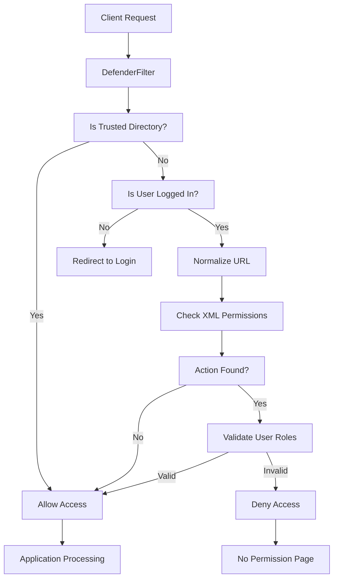
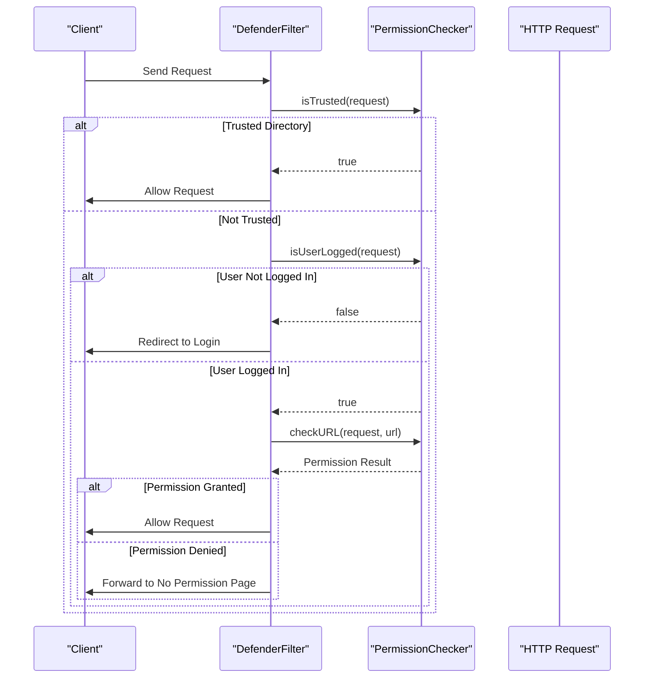
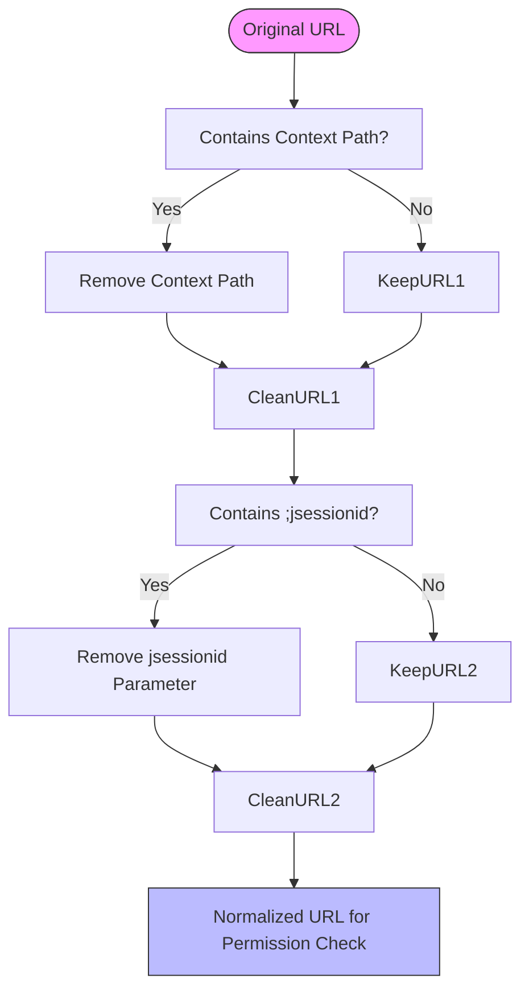
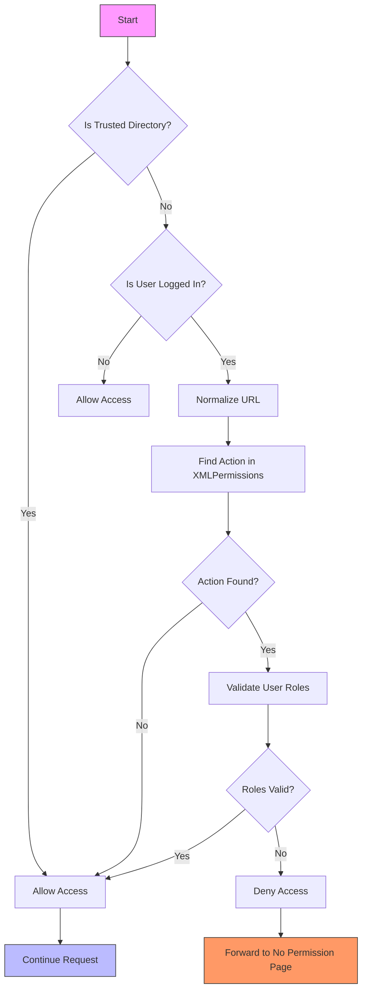
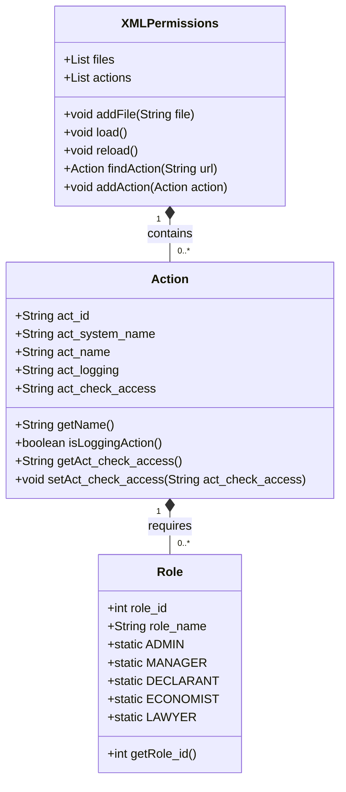
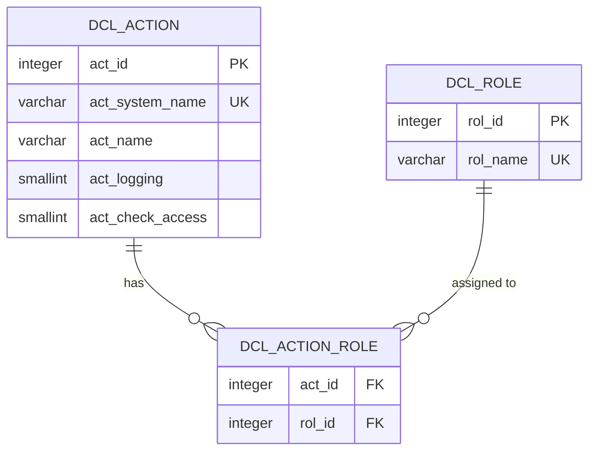
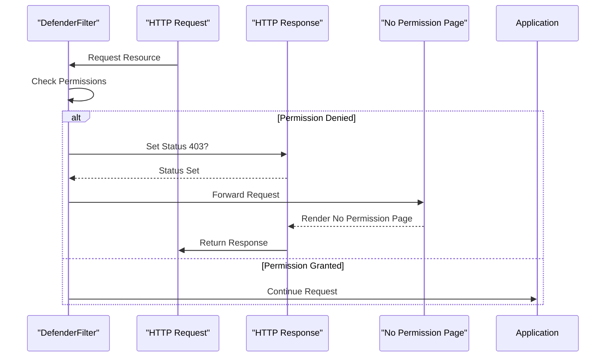

# Permission Evaluation

<cite>
**Referenced Files in This Document**   
- [DefenderFilter.java](file://src/main/java/net/sam/dcl/filters/DefenderFilter.java)
- [PermissionChecker.java](file://src/main/java/net/sam/dcl/navigation/PermissionChecker.java)
- [XMLPermissions.java](file://src/main/java/net/sam/dcl/navigation/XMLPermissions.java)
- [ControlActions.java](file://src/main/java/net/sam/dcl/navigation/ControlActions.java)
- [Action.java](file://src/main/java/net/sam/dcl/beans/Action.java)
- [User.java](file://src/main/java/net/sam/dcl/beans/User.java)
- [web.xml](file://src/main/webapp/WEB-INF/web.xml)
- [Actions.jsp](file://src/main/webapp/jsp/Actions.jsp)
- [ActionRoles.jsp](file://src/main/webapp/jsp/ActionRoles.jsp)
</cite>

## Table of Contents
1. [Introduction](#introduction)
2. [Permission Evaluation Architecture](#permission-evaluation-architecture)
3. [Request Interception and Filtering](#request-interception-and-filtering)
4. [URL Normalization Process](#url-normalization-process)
5. [Permission Checking Workflow](#permission-checking-workflow)
6. [XML-Based Permission Evaluation](#xml-based-permission-evaluation)
7. [Database-Driven Access Control](#database-driven-access-control)
8. [Role-Based Access Validation](#role-based-access-validation)
9. [Custom Permission Implementation](#custom-permission-implementation)
10. [Authorization Failure Handling](#authorization-failure-handling)
11. [Troubleshooting Common Issues](#troubleshooting-common-issues)
12. [Conclusion](#conclusion)

## Introduction
The permission evaluation and enforcement system in the DCL application provides a comprehensive security framework for controlling access to application resources. This system implements a multi-layered approach to authorization, combining URL-based filtering, role-based access control, and both XML-defined and database-driven permission models. The architecture is designed to intercept HTTP requests, normalize URLs, and evaluate access rights through a hierarchical decision process that considers trusted directories, user authentication status, and specific permission requirements. This document details the implementation of the permission system, focusing on the PermissionChecker class, URL normalization, role validation, and the fallback mechanisms between XML-based and database-driven access control.

## Permission Evaluation Architecture



**Diagram sources**
- [DefenderFilter.java](file://src/main/java/net/sam/dcl/filters/DefenderFilter.java#L1-L70)
- [PermissionChecker.java](file://src/main/java/net/sam/dcl/navigation/PermissionChecker.java#L17-L102)

**Section sources**
- [DefenderFilter.java](file://src/main/java/net/sam/dcl/filters/DefenderFilter.java#L1-L70)
- [PermissionChecker.java](file://src/main/java/net/sam/dcl/navigation/PermissionChecker.java#L17-L102)

## Request Interception and Filtering

The permission evaluation system begins with the DefenderFilter, a servlet filter that intercepts all incoming HTTP requests. This filter serves as the entry point for the security mechanism, determining whether a request should be allowed to proceed to the application or be redirected based on permission requirements.

The DefenderFilter operates according to the following logic:
1. First, it checks if the requested resource is in a trusted directory as defined in the web.xml configuration
2. If the resource is trusted, the request is allowed to proceed without further permission checks
3. If not trusted, it verifies whether the user is authenticated
4. For unauthenticated users, the request is redirected to the login page
5. For authenticated users, the system proceeds to evaluate specific permissions for the requested resource

The trusted directories are configured in the web.xml file and typically include static resources, login pages, and other publicly accessible content. This approach ensures that essential application functionality remains available while protecting sensitive operations.



**Diagram sources**
- [DefenderFilter.java](file://src/main/java/net/sam/dcl/filters/DefenderFilter.java#L1-L70)
- [web.xml](file://src/main/webapp/WEB-INF/web.xml#L34-L74)

**Section sources**
- [DefenderFilter.java](file://src/main/java/net/sam/dcl/filters/DefenderFilter.java#L1-L70)
- [web.xml](file://src/main/webapp/WEB-INF/web.xml#L34-L74)

## URL Normalization Process

Before permission evaluation, the system normalizes the requested URL to ensure consistent and secure access control. This normalization process removes potentially problematic elements and standardizes the URL format for reliable permission checking.

The URL normalization process consists of two key steps:

1. **Context Path Removal**: The system removes the application context path from the beginning of the URL. This allows permission rules to be defined relative to the application root rather than including the full deployment path, making the configuration more portable and maintainable.

2. **JSESSIONID Removal**: The system removes the jsessionid parameter from the URL. This prevents session fixation attacks and ensures that permission checks are not influenced by session identifiers in the URL. The removal process handles both cases where the jsessionid appears before or after other query parameters.

This normalization ensures that permission checks are performed on a clean, standardized URL representation, preventing bypass attempts through URL manipulation and ensuring consistent evaluation across different request formats.



**Diagram sources**
- [PermissionChecker.java](file://src/main/java/net/sam/dcl/navigation/PermissionChecker.java#L60-L85)

**Section sources**
- [PermissionChecker.java](file://src/main/java/net/sam/dcl/navigation/PermissionChecker.java#L60-L85)

## Permission Checking Workflow

The permission checking workflow follows a hierarchical decision process that evaluates access rights in a specific order. This workflow ensures that essential application functionality remains accessible while protecting sensitive operations from unauthorized access.

The workflow begins with the PermissionChecker.checkURL method, which implements the following evaluation sequence:

1. **Trusted Directory Check**: The system first determines if the requested resource is in a trusted directory. Resources in trusted directories (such as login pages, static assets, and error pages) are accessible without authentication or permission checks.

2. **Authentication Status Check**: For non-trusted resources, the system verifies whether the user is authenticated. Unauthenticated users are allowed access to certain resources, while authenticated users proceed to permission evaluation.

3. **URL Normalization**: The requested URL is normalized by removing the context path and jsessionid parameter, ensuring consistent permission evaluation.

4. **XML Permission Evaluation**: The system queries the XMLPermissions component to find a matching action for the normalized URL. If no matching action is found, access is granted by default.

5. **Role Validation**: If a matching action is found, the system validates whether the user's roles satisfy the permission requirements defined for that action.

This workflow ensures that the system maintains security while providing flexibility in access control configuration.



**Diagram sources**
- [PermissionChecker.java](file://src/main/java/net/sam/dcl/navigation/PermissionChecker.java#L17-L102)

**Section sources**
- [PermissionChecker.java](file://src/main/java/net/sam/dcl/navigation/PermissionChecker.java#L17-L102)

## XML-Based Permission Evaluation

The XML-based permission evaluation system uses configuration files to define access control rules for application resources. This approach provides a declarative way to specify which roles can access specific URLs or actions within the application.

The XMLPermissions class manages the loading and evaluation of permission rules from XML configuration files. These files define actions with associated role requirements using a structured format. Each action element specifies a URL pattern and the roles that are permitted to access it.

Key features of the XML-based permission system include:

- **Pattern Matching**: The system uses URL prefix matching to determine if a requested resource matches a defined action. This allows a single permission rule to cover multiple related URLs.
- **Role Configuration**: Permissions are defined by including role elements (admin, manager, declarant, etc.) within the action definition, specifying which roles can access the resource.
- **Dynamic Reloading**: The permission configuration can be reloaded at runtime without restarting the application, allowing for flexible permission management.

The XML configuration is parsed using Apache Commons Digester, which maps the XML elements to Java objects and builds an in-memory representation of the permission rules for efficient evaluation.



**Diagram sources**
- [XMLPermissions.java](file://src/main/java/net/sam/dcl/navigation/XMLPermissions.java#L19-L154)
- [Action.java](file://src/main/java/net/sam/dcl/beans/Action.java#L1-L103)

**Section sources**
- [XMLPermissions.java](file://src/main/java/net/sam/dcl/navigation/XMLPermissions.java#L19-L154)
- [Action.java](file://src/main/java/net/sam/dcl/beans/Action.java#L1-L103)

## Database-Driven Access Control

The system implements a fallback mechanism for database-driven access control through the ControlActions component. This provides an alternative to XML-based permissions, allowing permissions to be managed dynamically through the database.

The ControlActions class loads action definitions from the dcl_action database table, which contains information about available actions and their properties. This approach enables runtime modification of permissions without requiring changes to configuration files.

Key aspects of the database-driven access control include:

- **Action Storage**: Action definitions are stored in the dcl_action table with fields for action ID, system name, logging status, and permission checking status.
- **Dynamic Loading**: The ControlActions component loads action definitions from the database at application startup and can be reloaded during runtime.
- **Synchronization**: Changes to action definitions in the database are reflected in the application without requiring a restart, as the ControlActions component can be reloaded.

The database-driven approach complements the XML-based system, providing flexibility for environments where permissions need to be managed through administrative interfaces rather than configuration files.



**Diagram sources**
- [ControlActions.java](file://src/main/java/net/sam/dcl/navigation/ControlActions.java#L14-L126)
- [db/Alter-2.1.11.sql](file://db/Alter-2.1.11.sql#L1609-L1681)

**Section sources**
- [ControlActions.java](file://src/main/java/net/sam/dcl/navigation/ControlActions.java#L14-L126)
- [db/Alter-2.1.11.sql](file://db/Alter-2.1.11.sql#L1609-L1681)

## Role-Based Access Validation

The role-based access validation system determines whether a user has the necessary permissions to access a requested resource. This validation occurs through the CorrectRole method on Action objects, which compares the user's roles against the required permissions for the action.

The User class maintains a list of role identifiers that represent the user's permissions within the system. When evaluating access, the system checks whether the user possesses any of the roles required by the target action.

The validation process involves:
1. Retrieving the user's roles from the User object
2. Comparing these roles against the roles required by the action
3. Granting access if the user has at least one of the required roles

The system supports both individual role checks and composite role requirements, allowing for flexible permission configurations. The role validation is case-insensitive and uses role identifiers rather than names, ensuring consistent evaluation across different locales and configurations.

```mermaid
sequenceDiagram
participant User as "User Object"
participant Action as "Action Object"
participant Validator as "Role Validator"
User->>Validator : getRoles()
Validator->>Action : getRequiredRoles()
Validator->>Validator : Compare User Roles vs Required Roles
loop For each User Role
Validator->>Validator : Check if Role in Required Roles
alt Role Match Found
Validator-->>Validator : Access Granted
break
end
end
alt Access Granted
Validator-->>Action : Return true
else Access Denied
Validator-->>Action : Return false
end
```

**Diagram sources**
- [User.java](file://src/main/java/net/sam/dcl/beans/User.java#L86-L166)
- [Action.java](file://src/main/java/net/sam/dcl/beans/Action.java#L1-L103)

**Section sources**
- [User.java](file://src/main/java/net/sam/dcl/beans/User.java#L86-L166)
- [Action.java](file://src/main/java/net/sam/dcl/beans/Action.java#L1-L103)

## Custom Permission Implementation

The system provides mechanisms for implementing custom permission checks in action classes. This allows developers to extend the basic permission model with application-specific logic and conditions.

To implement custom permission checks, developers can:
1. Create action classes that extend the base DBAction class
2. Override the process method to include custom permission logic
3. Use the User object to access the current user's roles and permissions
4. Call super.process() only if the custom permission checks pass

The Action class provides methods for configuring permission requirements, including the act_check_access field which determines whether permission checking should be performed for the action. When this field is set to "1", the system will evaluate permissions; when null or not set, the action is accessible without permission checks.

Administrative interfaces allow configuration of custom permissions through the Actions and ActionRoles screens, where administrators can define which roles have access to specific actions.

```mermaid
flowchart TD
A[Custom Action Class] --> B[Extend DBAction]
B --> C[Override process() Method]
C --> D[Implement Custom Logic]
D --> E{Custom Conditions Met?}
E --> |Yes| F[Call super.process()]
E --> |No| G[Handle Authorization Failure]
F --> H[Execute Action]
G --> I[Return Error Response]
style A fill:#f9f,stroke:#333
style H fill:#bbf,stroke:#333
style I fill:#f96,stroke:#333
```

**Diagram sources**
- [ActionAction.java](file://src/main/java/net/sam/dcl/action/ActionAction.java#L1-L43)
- [ActionRolesAction.java](file://src/main/java/net/sam/dcl/action/ActionRolesAction.java#L1-L35)

**Section sources**
- [ActionAction.java](file://src/main/java/net/sam/dcl/action/ActionAction.java#L1-L43)
- [ActionRolesAction.java](file://src/main/java/net/sam/dcl/action/ActionRolesAction.java#L1-L35)

## Authorization Failure Handling

The system handles authorization failures gracefully by redirecting users to a dedicated "no permission" page. This provides a consistent user experience when access is denied and prevents information leakage about protected resources.

When a permission check fails, the DefenderFilter forwards the request to the configured noPermissionPage, which is specified in the web.xml configuration. This page informs the user that they do not have sufficient permissions to access the requested resource and may provide guidance on how to obtain the necessary access.

The system also includes mechanisms for logging authorization failures, which can be useful for security auditing and troubleshooting. The logging behavior is configurable through the act_logging field in the Action class, allowing administrators to control which actions generate audit logs.

Error handling is designed to be unobtrusive, ensuring that users are not exposed to technical details about the permission system while still receiving clear feedback about access restrictions.



**Diagram sources**
- [DefenderFilter.java](file://src/main/java/net/sam/dcl/filters/DefenderFilter.java#L43-L69)
- [web.xml](file://src/main/webapp/WEB-INF/web.xml#L34-L74)

**Section sources**
- [DefenderFilter.java](file://src/main/java/net/sam/dcl/filters/DefenderFilter.java#L43-L69)
- [web.xml](file://src/main/webapp/WEB-INF/web.xml#L34-L74)

## Troubleshooting Common Issues

### Debugging Denied Access
When users experience denied access, follow these steps to diagnose the issue:
1. Verify the user is properly authenticated and has active session
2. Check if the requested URL matches a trusted directory pattern
3. Examine the XML permission configuration for the requested action
4. Verify the user's roles include the required permissions
5. Check the database action configuration if using database-driven access control

### Understanding XML vs Database Permission Checks
The system uses XML-based permission checks as the primary mechanism, with database-driven access control available as an alternative. Key differences include:
- XML permissions are defined in configuration files and loaded at startup
- Database permissions are stored in the dcl_action table and can be modified at runtime
- XML permissions take precedence when both systems are configured
- Database permissions provide more flexibility for dynamic permission management

### Session Management for Role Evaluation
Proper session management is critical for accurate role evaluation:
1. Ensure user roles are correctly loaded during authentication
2. Verify session timeout settings do not cause premature role invalidation
3. Check that role changes are properly reflected in active sessions
4. Monitor session fixation vulnerabilities that could affect role evaluation

### Configuration Issues
Common configuration problems include:
- Incorrect trusted directory patterns in web.xml
- Missing or incorrect action definitions in XML configuration
- Database action records with incorrect act_check_access values
- Role mappings that don't match the application's role hierarchy

## Conclusion
The permission evaluation and enforcement system in the DCL application provides a robust and flexible framework for controlling access to application resources. By combining URL filtering, role-based access control, and multiple permission storage mechanisms, the system offers both security and adaptability. The architecture effectively intercepts requests through the DefenderFilter, normalizes URLs by removing context paths and session identifiers, and evaluates permissions through a hierarchical process that first checks trusted directories, then authentication status, and finally specific permission requirements. The system supports both XML-based and database-driven permission models, allowing organizations to choose the approach that best fits their operational requirements. With proper implementation and configuration, this permission system provides a solid foundation for securing application functionality while enabling flexible access control management.