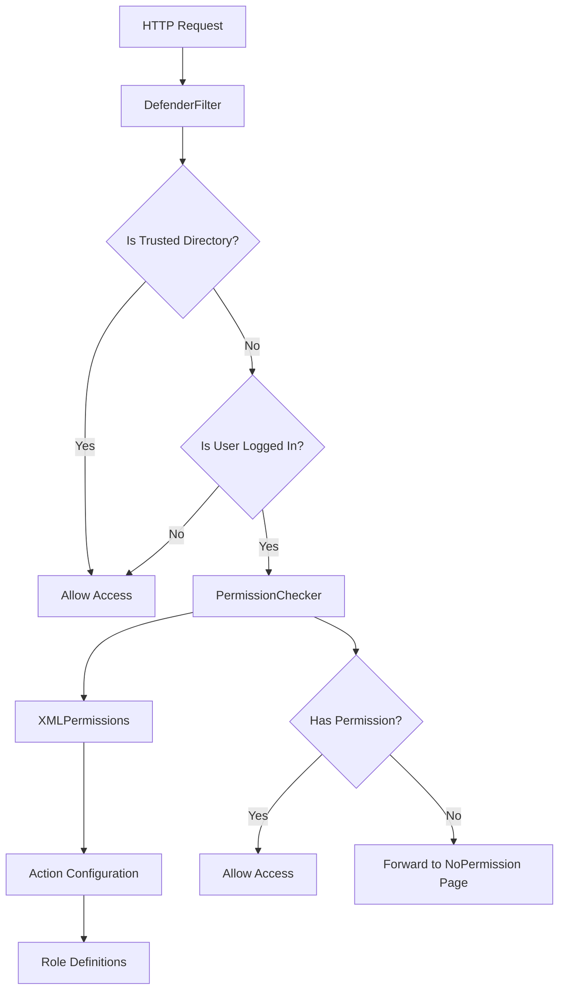
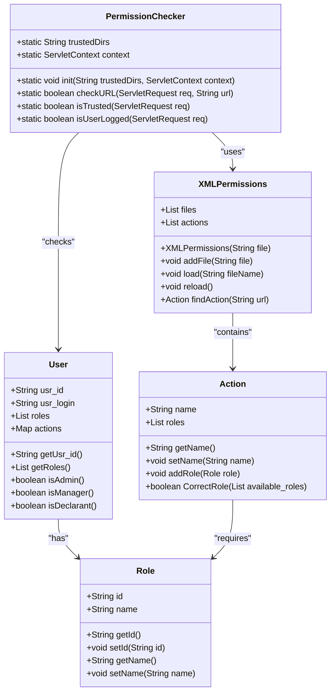
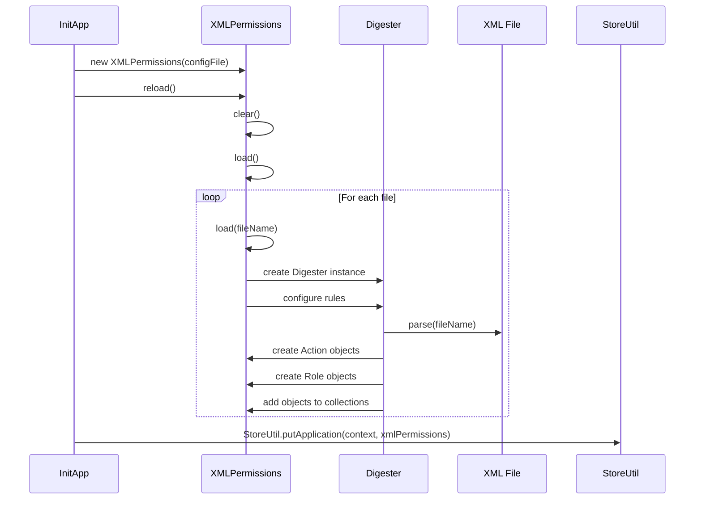
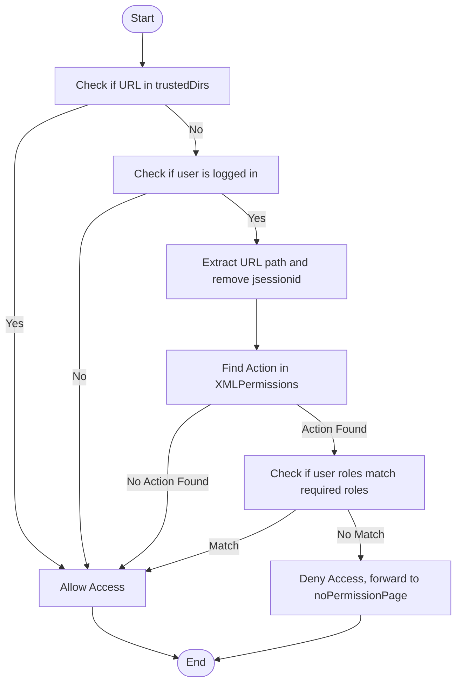
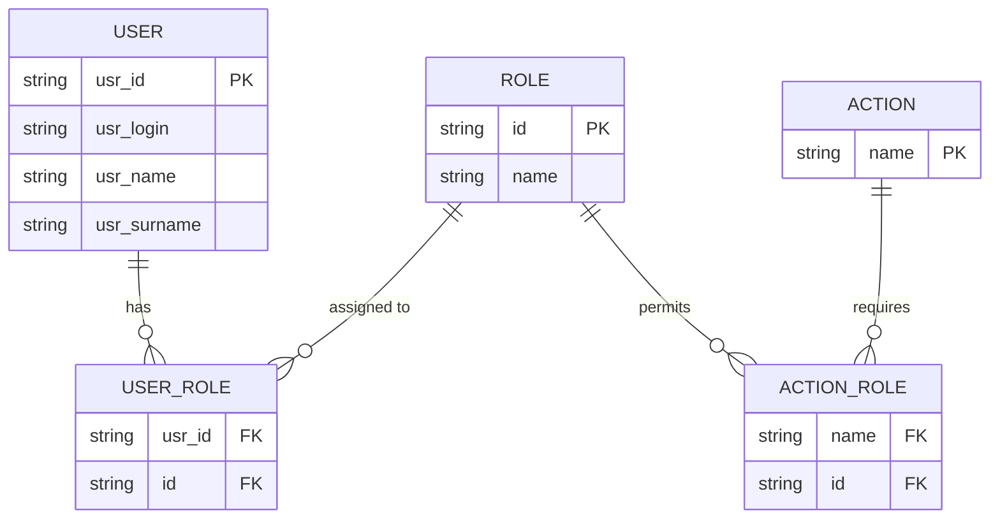

# Role-Based Access Control

<cite>
**Referenced Files in This Document**   
- [XMLPermissions.java](file://src/main/java/net/sam/dcl/navigation/XMLPermissions.java)
- [PermissionChecker.java](file://src/main/java/net/sam/dcl/navigation/PermissionChecker.java)
- [Action.java](file://src/main/java/net/sam/dcl/navigation/Action.java)
- [User.java](file://src/main/java/net/sam/dcl/beans/User.java)
- [Role.java](file://src/main/java/net/sam/dcl/beans/Role.java)
- [DefenderFilter.java](file://src/main/java/net/sam/dcl/filters/DefenderFilter.java)
- [InitApp.java](file://src/main/java/net/sam/dcl/servlets/InitApp.java)
- [ActionRolesAction.java](file://src/main/java/net/sam/dcl/action/ActionRolesAction.java)
- [NoPermissionAction.java](file://src/main/java/net/sam/dcl/action/NoPermissionAction.java)
</cite>

## Table of Contents
1. [Introduction](#introduction)
2. [Architecture Overview](#architecture-overview)
3. [Core Components](#core-components)
4. [Permission Configuration and Loading](#permission-configuration-and-loading)
5. [Permission Evaluation Process](#permission-evaluation-process)
6. [User, Role, and Action Relationships](#user-role-and-action-relationships)
7. [Hierarchical Permission Structure](#hierarchical-permission-structure)
8. [Caching and Performance](#caching-and-performance)
9. [Common Issues and Troubleshooting](#common-issues-and-troubleshooting)
10. [Conclusion](#conclusion)

## Introduction
The role-based access control (RBAC) system in the DCL application provides a comprehensive security framework for managing user access to various application resources and actions. This system implements a multi-layered approach to authorization, combining XML-based permission configuration with runtime permission checking. The architecture is designed to provide flexible, maintainable, and performant access control that can be easily configured and extended. The system leverages the concept of roles to group users with similar access requirements and defines permissions at the action level, allowing fine-grained control over application functionality.

**Section sources**
- [XMLPermissions.java](file://src/main/java/net/sam/dcl/navigation/XMLPermissions.java#L1-L20)
- [PermissionChecker.java](file://src/main/java/net/sam/dcl/navigation/PermissionChecker.java#L1-L20)

## Architecture Overview
The role-based access control system follows a layered architecture with distinct components responsible for different aspects of permission management. At the core of the system is the XMLPermissions class, which loads and manages permission definitions from XML configuration files. The PermissionChecker class serves as the central authority for evaluating access requests at runtime. The system integrates with the application's servlet filter chain through the DefenderFilter, which intercepts HTTP requests and performs authorization checks before allowing access to protected resources.

**Diagram sources**
- [DefenderFilter.java](file://src/main/java/net/sam/dcl/filters/DefenderFilter.java#L43-L69)
- [PermissionChecker.java](file://src/main/java/net/sam/dcl/navigation/PermissionChecker.java#L50-L100)
- [XMLPermissions.java](file://src/main/java/net/sam/dcl/navigation/XMLPermissions.java#L50-L100)

## Core Components
The RBAC system consists of several key components that work together to provide comprehensive access control. The XMLPermissions class is responsible for parsing XML configuration files and creating an in-memory representation of the permission hierarchy. The PermissionChecker class provides static methods for evaluating whether a user has permission to access a specific resource. The Action class represents a specific application action that may require authorization, while the Role class defines the different roles that users can be assigned to. The User class maintains information about the currently logged-in user, including their assigned roles and permissions.

**Diagram sources**
- [XMLPermissions.java](file://src/main/java/net/sam/dcl/navigation/XMLPermissions.java#L19-L154)
- [PermissionChecker.java](file://src/main/java/net/sam/dcl/navigation/PermissionChecker.java#L17-L102)
- [Action.java](file://src/main/java/net/sam/dcl/navigation/Action.java#L10-L45)
- [User.java](file://src/main/java/net/sam/dcl/beans/User.java#L86-L166)
- [Role.java](file://src/main/java/net/sam/dcl/beans/Role.java#L6-L51)

**Section sources**
- [XMLPermissions.java](file://src/main/java/net/sam/dcl/navigation/XMLPermissions.java#L19-L154)
- [PermissionChecker.java](file://src/main/java/net/sam/dcl/navigation/PermissionChecker.java#L17-L102)
- [Action.java](file://src/main/java/net/sam/dcl/navigation/Action.java#L10-L45)
- [User.java](file://src/main/java/net/sam/dcl/beans/User.java#L86-L166)
- [Role.java](file://src/main/java/net/sam/dcl/beans/Role.java#L6-L51)

## Permission Configuration and Loading
Permissions are defined in XML configuration files that specify which roles have access to specific application actions. The XML configuration follows a structured format where each action is defined with a URL pattern and a set of roles that are permitted to access it. During application startup, the InitApp servlet loads the permission configuration by creating an XMLPermissions instance and calling its reload() method. This process parses the XML file, validates it against a DTD, and creates Action objects for each defined permission. The XMLPermissions class uses Apache Commons Digester to map XML elements to Java objects, automatically creating Role instances for each role type defined in the configuration.

**Diagram sources**
- [InitApp.java](file://src/main/java/net/sam/dcl/servlets/InitApp.java#L155-L190)
- [XMLPermissions.java](file://src/main/java/net/sam/dcl/navigation/XMLPermissions.java#L100-L150)

## Permission Evaluation Process
The permission evaluation process begins when a user attempts to access a protected resource. The DefenderFilter intercepts the HTTP request and delegates to the PermissionChecker to determine if access should be granted. The PermissionChecker first checks if the requested URL matches a trusted directory pattern, in which case access is automatically granted. If the user is not logged in, access is also granted to allow login functionality. For authenticated users requesting protected resources, the PermissionChecker extracts the relevant URL path, removes session identifiers, and queries the XMLPermissions instance to find the corresponding Action. The system then checks if the user's roles match any of the roles required by the Action, granting access if there is a match.

**Diagram sources**
- [DefenderFilter.java](file://src/main/java/net/sam/dcl/filters/DefenderFilter.java#L43-L69)
- [PermissionChecker.java](file://src/main/java/net/sam/dcl/navigation/PermissionChecker.java#L50-L100)

## User, Role, and Action Relationships
The RBAC system establishes relationships between Users, Roles, and Actions to determine access rights. Users are assigned to one or more Roles, which represent job functions or responsibilities within the organization. Each Action in the system specifies which Roles are permitted to execute it. When evaluating access, the system checks if the user has any of the roles required by the requested action. The User class provides convenience methods like isAdmin(), isManager(), and isDeclarant() that check for specific roles, making it easy for application code to implement role-based logic. The Action class maintains a list of Role objects that are permitted to execute it, and provides a CorrectRole() method that checks if any of the user's roles match the required roles.

**Diagram sources**
- [User.java](file://src/main/java/net/sam/dcl/beans/User.java#L414-L482)
- [Action.java](file://src/main/java/net/sam/dcl/navigation/Action.java#L30-L45)
- [Role.java](file://src/main/java/net/sam/dcl/beans/Role.java#L6-L51)

## Hierarchical Permission Structure
The permission system implements a hierarchical structure that allows for flexible and maintainable access control. Permissions are defined at the URL level, with support for pattern matching to group related actions. The system uses a prefix-based matching approach where an action definition like "/Menu.do?current_menu_id=id.contract" will match any URL that starts with that pattern, allowing for dispatch parameters while maintaining consistent access control. This hierarchical approach enables the definition of broad permissions for entire sections of the application while still allowing for specific overrides when needed. The system also supports role inheritance through the user interface, where administrators can assign multiple roles to users, effectively combining their permissions.

**Section sources**
- [XMLPermissions.java](file://src/main/java/net/sam/dcl/navigation/XMLPermissions.java#L50-L70)
- [User.java](file://src/main/java/net/sam/dcl/beans/User.java#L414-L482)

## Caching and Performance
The RBAC system incorporates several performance optimizations to ensure efficient permission checking. The XMLPermissions class maintains an in-memory cache of all loaded permissions, eliminating the need to parse XML files on each request. The permission data is loaded once at application startup and only reloaded when explicitly requested, providing excellent runtime performance. The PermissionChecker class also caches the ServletContext reference, avoiding repeated lookups. The system uses efficient data structures like ArrayList for storing actions and roles, with O(n) lookup performance that is acceptable given the typically small number of permissions and roles in the system. For high-traffic applications, the system could be further optimized by implementing a HashMap-based lookup for actions by URL pattern.

**Section sources**
- [XMLPermissions.java](file://src/main/java/net/sam/dcl/navigation/XMLPermissions.java#L19-L154)
- [PermissionChecker.java](file://src/main/java/net/sam/dcl/navigation/PermissionChecker.java#L17-L102)

## Common Issues and Troubleshooting
Common issues with the RBAC system typically involve permission inheritance, access denial debugging, and maintaining consistency across the application. When users report access denials, administrators should first verify that the user has been assigned the correct roles and that those roles have the necessary permissions defined in the XML configuration. The system's logging capabilities in the XMLPermissions class can help diagnose parsing errors in the configuration files. For debugging access denials, developers can examine the DefenderFilter and PermissionChecker code to understand the evaluation process. To maintain permission consistency, it's important to follow a standardized approach to defining actions and roles, and to use the provided administrative interfaces like the ActionRolesAction to manage role-to-action mappings rather than modifying the XML configuration directly.

**Section sources**
- [XMLPermissions.java](file://src/main/java/net/sam/dcl/navigation/XMLPermissions.java#L140-L150)
- [DefenderFilter.java](file://src/main/java/net/sam/dcl/filters/DefenderFilter.java#L43-L69)
- [ActionRolesAction.java](file://src/main/java/net/sam/dcl/action/ActionRolesAction.java#L0-L35)

## Conclusion
The role-based access control system in the DCL application provides a robust and flexible framework for managing user permissions. By combining XML-based configuration with runtime evaluation, the system offers both maintainability and performance. The clear separation of concerns between configuration loading, permission checking, and access enforcement makes the system easy to understand and extend. The use of standard Java technologies like Servlet filters and XML parsing ensures compatibility and reliability. For future enhancements, the system could benefit from additional features like permission inheritance hierarchies, more sophisticated pattern matching for URL patterns, and improved administrative interfaces for managing permissions. Overall, the current implementation provides a solid foundation for secure application access control.