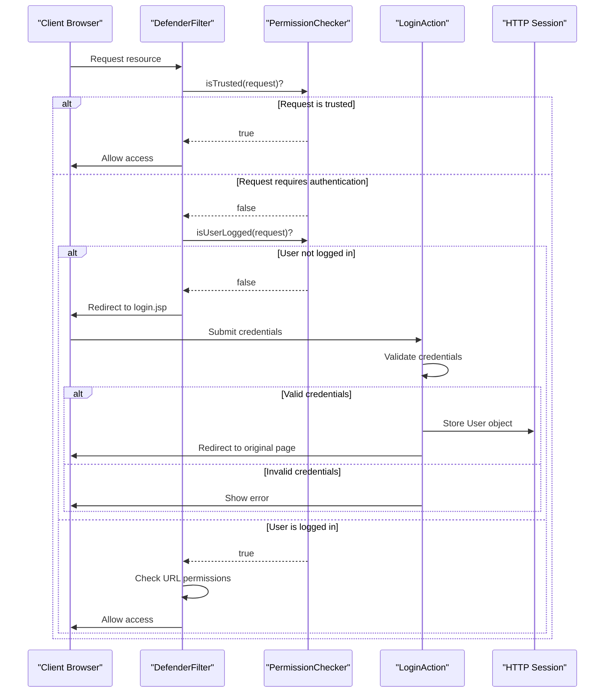
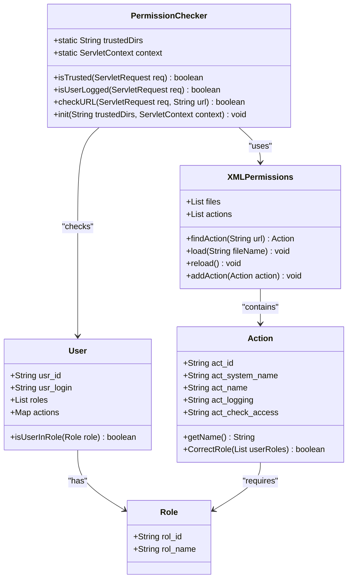

# Security & Authentication

<cite>
**Referenced Files in This Document**   
- [DefenderFilter.java](file://src/main/java/net/sam/dcl/filters/DefenderFilter.java)
- [PermissionChecker.java](file://src/main/java/net/sam/dcl/navigation/PermissionChecker.java)
- [XMLPermissions.java](file://src/main/java/net/sam/dcl/navigation/XMLPermissions.java)
- [SessionBooking.java](file://src/main/java/net/sam/dcl/session/SessionBooking.java)
- [SessionListener.java](file://src/main/java/net/sam/dcl/session/SessionListener.java)
- [LoginAction.java](file://src/main/java/net/sam/dcl/action/LoginAction.java)
- [LogoutAction.java](file://src/main/java/net/sam/dcl/action/LogoutAction.java)
- [NoPermissionAction.java](file://src/main/java/net/sam/dcl/action/NoPermissionAction.java)
- [web.xml](file://src/main/webapp/WEB-INF/web.xml)
- [login.jsp](file://src/main/webapp/jsp/login.jsp)
- [no_permission.jsp](file://src/main/webapp/jsp/no_permission.jsp)
</cite>

## Table of Contents
1. [Authentication Mechanism](#authentication-mechanism)  
2. [Role-Based Access Control](#role-based-access-control)  
3. [Session Management](#session-management)  
4. [Securing New Endpoints](#securing-new-endpoints)  
5. [Security Best Practices and Vulnerabilities](#security-best-practices-and-vulnerabilities)

## Authentication Mechanism

The dcl_v3 application implements a centralized authentication mechanism through the `DefenderFilter`, a servlet filter that intercepts all incoming HTTP requests to enforce authentication requirements. This filter is configured in the `web.xml` deployment descriptor to apply to all URL patterns (`/*`), ensuring comprehensive coverage across the application.

When a request arrives, the `DefenderFilter` first checks if the requested resource is in a "trusted" directory as defined by the `trusted-dirs` initialization parameter. Trusted directories include `/trusted.*`, `/includes.*`, `/images.*`, and `/test.*`, allowing static resources and specific trusted paths to bypass authentication. If the request matches a trusted path, it proceeds through the filter chain without authentication checks.

For non-trusted requests, the filter verifies user authentication status by calling `PermissionChecker.isUserLogged(request)`. This method checks for the presence of a valid user object in the HTTP session, which is established during the login process. If the user is not authenticated, the filter redirects the request to the login page specified by the `login-page` parameter (`/trusted/Login.do?dispatch=input`).

The authentication flow begins with the `LoginAction` class, which processes login form submissions from `login.jsp`. Upon successful authentication, the system creates a `User` object containing user details, roles, permissions, and settings, storing it in the HTTP session. The `LogoutAction` invalidates the session, effectively logging out the user and removing all session data.



**Diagram sources**  
- [DefenderFilter.java](file://src/main/java/net/sam/dcl/filters/DefenderFilter.java#L15-L69)
- [PermissionChecker.java](file://src/main/java/net/sam/dcl/navigation/PermissionChecker.java#L25-L45)
- [LoginAction.java](file://src/main/java/net/sam/dcl/action/LoginAction.java#L25-L120)

**Section sources**  
- [DefenderFilter.java](file://src/main/java/net/sam/dcl/filters/DefenderFilter.java#L15-L69)
- [web.xml](file://src/main/webapp/WEB-INF/web.xml#L34-L74)
- [LoginAction.java](file://src/main/java/net/sam/dcl/action/LoginAction.java#L25-L120)
- [login.jsp](file://src/main/webapp/jsp/login.jsp#L1-L42)

## Role-Based Access Control

The dcl_v3 application implements a sophisticated role-based access control (RBAC) system using the `XMLPermissions` and `PermissionChecker` components. This system defines permissions in XML configuration files and evaluates them at runtime to determine user access to specific application endpoints.

The `XMLPermissions` class parses XML configuration files that define actions and their required roles. Each `<action>` element in the XML specifies a URL pattern and one or more role elements (`<admin>`, `<manager>`, `<declarant>`, etc.) that are authorized to access that endpoint. The system uses Apache Commons Digester to parse these XML files and build an in-memory representation of the permission structure.

At runtime, the `PermissionChecker.checkURL()` method determines whether a user can access a specific URL. It first extracts the URL path and query parameters, normalizes the URL by removing session identifiers, and then searches the loaded permissions for a matching action. The matching algorithm uses a prefix-based approach, where it checks if the requested URL starts with any of the defined action patterns.

Once a matching action is found, the system verifies that the user has at least one of the roles specified in the action definition. The `Action.CorrectRole()` method performs this validation by comparing the user's roles against the required roles for the action. Users can have multiple roles, and access is granted if there is any overlap between the user's roles and the action's required roles.

The application defines several roles including ADMIN, MANAGER, DECLARANT, ECONOMIST, LAWYER, USER_IN_LITHUANIA, OTHER_USER_IN_MINSK, STAFF_OF_SERVICE, and LOGISTIC. These roles are implemented as Java classes that extend a base Role class, providing type safety and preventing role name typos.

Administrators can manage role-to-action mappings through the web interface using the `ActionRolesAction` and associated JSP pages (`ActionRoles.jsp`). This allows dynamic configuration of permissions without requiring code changes or application restarts.



**Diagram sources**  
- [XMLPermissions.java](file://src/main/java/net/sam/dcl/navigation/XMLPermissions.java#L19-L154)
- [PermissionChecker.java](file://src/main/java/net/sam/dcl/navigation/PermissionChecker.java#L25-L103)
- [Action.java](file://src/main/java/net/sam/dcl/beans/Action.java#L47-L103)
- [User.java](file://src/main/java/net/sam/dcl/beans/User.java#L414-L562)

**Section sources**  
- [XMLPermissions.java](file://src/main/java/net/sam/dcl/navigation/XMLPermissions.java#L19-L154)
- [PermissionChecker.java](file://src/main/java/net/sam/dcl/navigation/PermissionChecker.java#L25-L103)
- [ActionRolesAction.java](file://src/main/java/net/sam/dcl/action/ActionRolesAction.java#L1-L52)
- [ActionRoles.jsp](file://src/main/webapp/jsp/ActionRoles.jsp#L1-L56)

## Session Management

The dcl_v3 application implements a comprehensive session management system to track active user sessions and prevent concurrent logins. This system is built around the `SessionBooking` class, which maintains a registry of all active HTTP sessions across the application.

The `SessionBooking` class is implemented as a singleton with thread-safe operations, using synchronized blocks to protect its internal list of sessions. When a new user session is created, the `SessionListener` receives a `sessionCreated` event and adds the session to the `SessionBooking` registry by calling `getSessionBooking().add(session)`. Similarly, when a session is destroyed (either by timeout or explicit logout), the `SessionListener` removes it from the registry via `getSessionBooking().remove(session)`.

This centralized session tracking enables several important security features. The `SessionsAction` and `SessionsForm` classes use the `SessionBooking` registry to display a list of all active sessions in the application, allowing administrators to monitor current user activity. The `iterate()` method of `SessionBooking` accepts a `SessionBookingProcesor` callback, enabling operations to be performed on all active sessions.

The system prevents concurrent logins by checking for existing sessions when a user attempts to log in. Although the exact implementation of this check is not visible in the provided code, the presence of the `SessionBooking` registry suggests that the login process likely queries this registry to find any existing sessions for the same user and either terminates them or blocks the new login.

Session cleanup is handled automatically by the servlet container, but the application enhances this process through the `SessionListener`. When a session is destroyed, the listener not only removes it from the `SessionBooking` registry but also calls `LockedRecords.unlockWithTheSame(session.getId())` to release any database locks held by that session, preventing orphaned locks from blocking other users.

```mermaid
flowchart TD
A[User Accesses Application] --> B{Session Exists?}
B --> |No| C[Create New Session]
C --> D[SessionListener.sessionCreated()]
D --> E[SessionBooking.add(session)]
E --> F[Store User in Session]
F --> G[Access Granted]
B --> |Yes| H{Session Valid?}
H --> |Yes| I[Use Existing Session]
I --> G
H --> |No| J[Invalidate Session]
J --> C
K[User Logs Out] --> L[LogoutAction.invalidate()]
L --> M[SessionListener.sessionDestroyed()]
M --> N[LockedRecords.unlockWithTheSame()]
N --> O[SessionBooking.remove(session)]
P[Session Timeout] --> M
Q[Admin Views Sessions] --> R[SessionsAction.execute()]
R --> S[SessionBooking.iterate()]
S --> T[Filter Active Sessions]
T --> U[Display Session List]
```

**Diagram sources**  
- [SessionBooking.java](file://src/main/java/net/sam/dcl/session/SessionBooking.java#L1-L100)
- [SessionListener.java](file://src/main/java/net/sam/dcl/session/SessionListener.java#L1-L28)
- [SessionsAction.java](file://src/main/java/net/sam/dcl/session/SessionsAction.java#L1-L41)
- [LockedRecordsForm.java](file://src/main/java/net/sam/dcl/locking/LockedRecordsForm.java#L67-L148)

**Section sources**  
- [SessionBooking.java](file://src/main/java/net/sam/dcl/session/SessionBooking.java#L1-L100)
- [SessionListener.java](file://src/main/java/net/sam/dcl/session/SessionListener.java#L1-L28)
- [SessionsAction.java](file://src/main/java/net/sam/dcl/session/SessionsAction.java#L1-L41)
- [SessionsForm.java](file://src/main/java/net/sam/dcl/session/SessionsForm.java#L1-L51)

## Securing New Endpoints

To secure a new action endpoint in the dcl_v3 application, developers must follow a multi-step process that integrates with the existing security framework. First, the new action must be registered in the XML permissions configuration file. This involves adding an `<action>` element with the appropriate URL pattern and specifying the required roles.

For example, to create a new endpoint `/ReportGenerator.do` that should only be accessible to managers and administrators, add the following XML:
```xml
<action name="/ReportGenerator.do">
    <admin/>
    <manager/>
</action>
```

Next, implement the action class by extending `DBTransactionAction` and implementing `IDispatchable` to handle different dispatch types (input, process, etc.). The action will automatically be protected by the `DefenderFilter`, which will enforce authentication and authorization based on the XML configuration.

To define custom permissions beyond the standard roles, extend the `Role` class hierarchy and update the `XMLPermissions.load()` method to register the new role with the Digester. This requires adding a new `addRole()` call in the `load()` method:
```java
addRole(digester, "customRoleName", CustomRoleClass.class);
```

When handling authentication failures, the application follows a consistent pattern. The `DefenderFilter` automatically redirects unauthenticated users to the login page, while users with insufficient permissions are forwarded to the no-permission page (`/trusted/NoPermission.do`). The `NoPermissionAction` simply returns the input forward, rendering the `no_permission.jsp` page which displays a "No rights!!!" message.

For programmatic permission checks within action methods, use the `PermissionChecker` utility:
```java
if (!PermissionChecker.checkURL(request, "/specific/action.do")) {
    // Handle insufficient permissions
    return context.getMapping().findForward("no-permission");
}
```

The system also supports IP-based access restrictions through user configuration. The `LoginAction` checks `usr_local_entry` and `usr_internet_entry` fields to determine whether a user can log in from local network addresses or internet addresses, providing an additional layer of security.

**Section sources**  
- [DefenderFilter.java](file://src/main/java/net/sam/dcl/filters/DefenderFilter.java#L15-L69)
- [XMLPermissions.java](file://src/main/java/net/sam/dcl/navigation/XMLPermissions.java#L19-L154)
- [NoPermissionAction.java](file://src/main/java/net/sam/dcl/action/NoPermissionAction.java#L1-L19)
- [no_permission.jsp](file://src/main/webapp/jsp/no_permission.jsp#L1-L7)
- [LoginAction.java](file://src/main/java/net/sam/dcl/action/LoginAction.java#L25-L120)

## Security Best Practices and Vulnerabilities

The dcl_v3 application implements several security best practices while also exhibiting characteristics of a legacy system that may introduce vulnerabilities. The layered security approach with the `DefenderFilter` provides centralized control over authentication and authorization, reducing the risk of security gaps in individual components.

Key security strengths include:
- **Centralized authentication**: All requests pass through the `DefenderFilter`, ensuring consistent security enforcement
- **Role-based access control**: Fine-grained permissions defined in external XML files for easy management
- **Session tracking**: Comprehensive monitoring of active sessions through `SessionBooking`
- **Automatic cleanup**: Session destruction triggers cleanup of database locks and other resources
- **Input encoding**: Request and response encoding set to UTF-8 to prevent certain types of injection attacks

However, the application also has potential vulnerabilities typical of legacy Java web applications:
- **XML external entity (XXE) risks**: The use of Digester for XML parsing could be vulnerable to XXE attacks if not properly configured
- **Session fixation**: No apparent protection against session fixation attacks during the login process
- **Insecure direct object references**: URL-based access control could be bypassed if proper validation is not performed in action classes
- **Insufficient logging**: Limited visibility into authentication failures and access attempts
- **Hardcoded paths**: Trusted directories are hardcoded in web.xml, making them difficult to modify without redeployment

To mitigate these risks, the following best practices should be implemented:
1. Update the Digester configuration to disable external entity resolution
2. Regenerate the session ID after successful authentication to prevent session fixation
3. Implement additional authorization checks within action methods, not relying solely on URL-level security
4. Enhance logging to record authentication successes and failures with user, IP, and timestamp information
5. Implement account lockout after multiple failed login attempts to prevent brute force attacks
6. Use prepared statements consistently in all database operations to prevent SQL injection
7. Implement CSRF tokens for state-changing operations to prevent cross-site request forgery
8. Regularly review and audit the XML permissions configuration to ensure least privilege principles are followed

The application's reliance on session-stored user objects rather than token-based authentication limits its scalability and introduces session management complexity. Modernizing the authentication system to use stateless JWT tokens could improve both security and performance.

**Section sources**  
- [DefenderFilter.java](file://src/main/java/net/sam/dcl/filters/DefenderFilter.java#L15-L69)
- [XMLPermissions.java](file://src/main/java/net/sam/dcl/navigation/XMLPermissions.java#L19-L154)
- [SessionBooking.java](file://src/main/java/net/sam/dcl/session/SessionBooking.java#L1-L100)
- [LoginAction.java](file://src/main/java/net/sam/dcl/action/LoginAction.java#L25-L120)
- [web.xml](file://src/main/webapp/WEB-INF/web.xml#L1-L175)