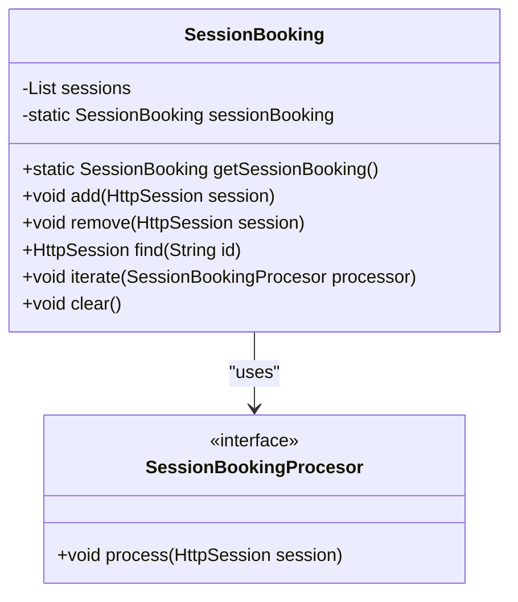
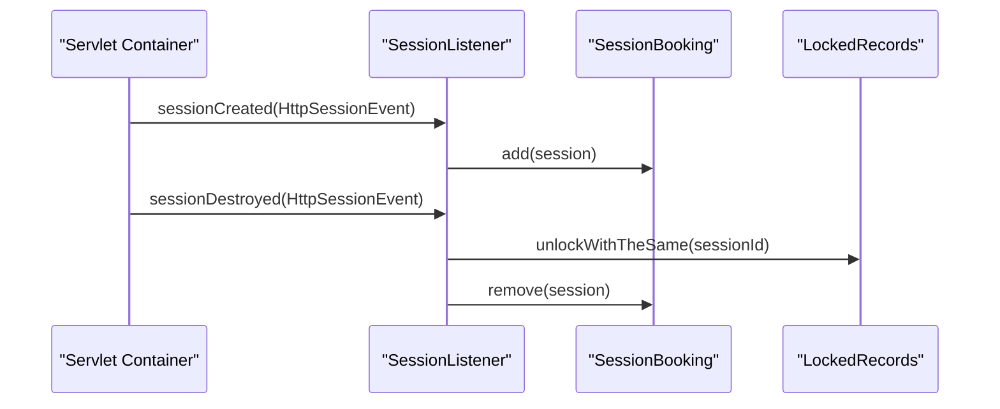
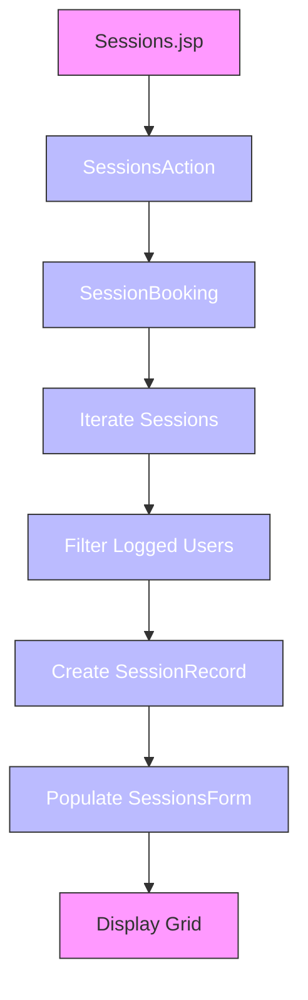
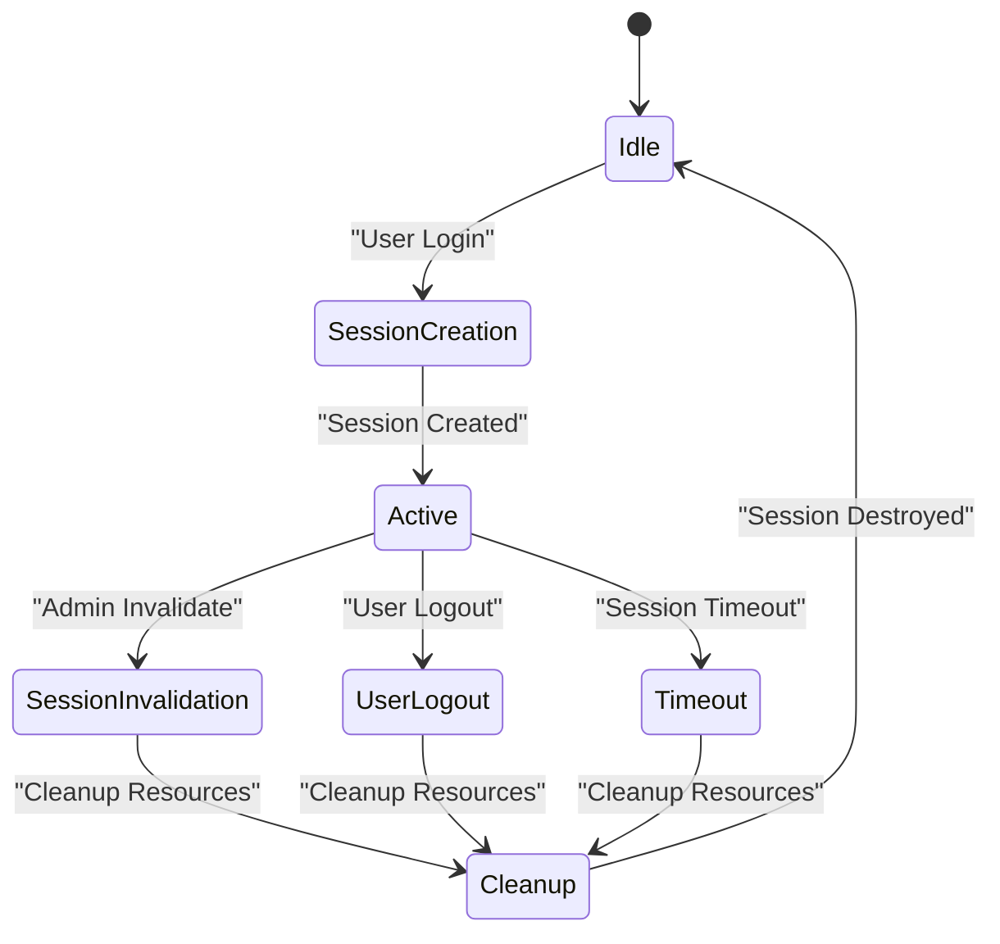
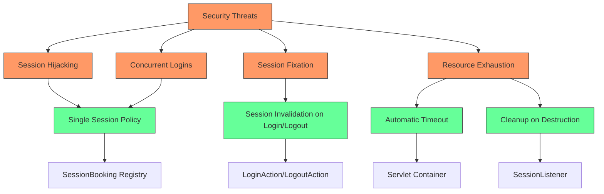
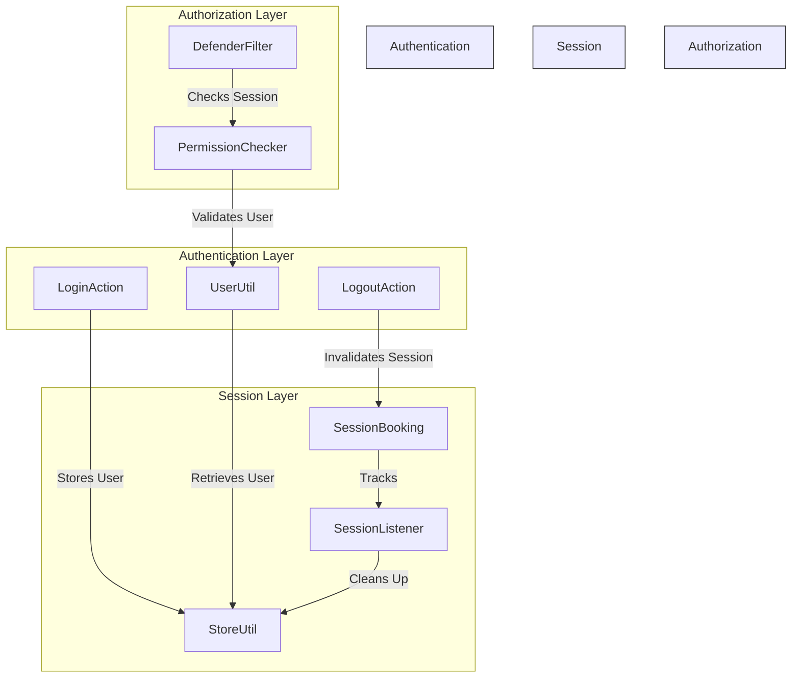

# Session Management

<cite>
**Referenced Files in This Document**   
- [SessionBooking.java](file://src/main/java/net/sam/dcl/session/SessionBooking.java)
- [SessionListener.java](file://src/main/java/net/sam/dcl/session/SessionListener.java)
- [SessionsAction.java](file://src/main/java/net/sam/dcl/session/SessionsAction.java)
- [SessionsForm.java](file://src/main/java/net/sam/dcl/session/SessionsForm.java)
- [Sessions.jsp](file://src/main/webapp/jsp/Sessions.jsp)
- [web.xml](file://src/main/webapp/WEB-INF/web.xml)
- [LoginAction.java](file://src/main/java/net/sam/dcl/action/LoginAction.java)
- [LogoutAction.java](file://src/main/java/net/sam/dcl/action/LogoutAction.java)
- [DefenderFilter.java](file://src/main/java/net/sam/dcl/filters/DefenderFilter.java)
- [PermissionChecker.java](file://src/main/java/net/sam/dcl/navigation/PermissionChecker.java)
- [UserUtil.java](file://src/main/java/net/sam/dcl/util/UserUtil.java)
- [StoreUtil.java](file://src/main/java/net/sam/dcl/util/StoreUtil.java)
</cite>

## Table of Contents
1. [Introduction](#introduction)
2. [Session Booking System](#session-booking-system)
3. [Session Listener](#session-listener)
4. [Session Management Interface](#session-management-interface)
5. [Session Lifecycle Management](#session-lifecycle-management)
6. [Security Considerations](#security-considerations)
7. [Integration with Authentication and Authorization](#integration-with-authentication-and-authorization)
8. [Conclusion](#conclusion)

## Introduction
The session management system in the DCL v3 application provides comprehensive control over user sessions, ensuring security, preventing concurrent logins, and enabling administrative oversight. The system is built around a central SessionBooking registry that maintains active sessions, with event listeners tracking session creation and destruction. Administrators can monitor and manage active sessions through a dedicated interface, while security measures protect against session hijacking and enforce single-session-per-user policies. This documentation details the architecture, implementation, and security aspects of the session management system.

## Session Booking System

The SessionBooking class serves as the central registry for active user sessions, maintaining a synchronized list of all active HttpSession objects. Implemented as a singleton, it provides thread-safe operations for adding, removing, and iterating through sessions. The system prevents concurrent logins by tracking all active sessions and allows administrators to view and manage them.

**Diagram sources**
- [SessionBooking.java](file://src/main/java/net/sam/dcl/session/SessionBooking.java#L1-L101)

**Section sources**
- [SessionBooking.java](file://src/main/java/net/sam/dcl/session/SessionBooking.java#L1-L101)

## Session Listener

The SessionListener implements the HttpSessionListener interface to automatically track session lifecycle events. When a session is created, it is registered with the SessionBooking registry. When a session is destroyed, the listener performs cleanup operations including releasing any locked records associated with the session and removing the session from the registry. This ensures proper resource management and maintains data integrity.

**Diagram sources**
- [SessionListener.java](file://src/main/java/net/sam/dcl/session/SessionListener.java#L1-L30)

**Section sources**
- [SessionListener.java](file://src/main/java/net/sam/dcl/session/SessionListener.java#L1-L30)
- [web.xml](file://src/main/webapp/WEB-INF/web.xml#L10-L14)

## Session Management Interface

The SessionsAction and Sessions.jsp components provide an administrative interface for viewing and managing active sessions. SessionsAction retrieves session data from the SessionBooking registry and populates a SessionsForm with session details including creation time, last access time, user information, and IP address. The Sessions.jsp page displays this information in a grid format, allowing administrators to monitor active sessions across the system.

**Diagram sources**
- [SessionsAction.java](file://src/main/java/net/sam/dcl/session/SessionsAction.java#L1-L42)
- [SessionsForm.java](file://src/main/java/net/sam/dcl/session/SessionsForm.java#L1-L153)
- [Sessions.jsp](file://src/main/webapp/jsp/Sessions.jsp#L1-L25)

**Section sources**
- [SessionsAction.java](file://src/main/java/net/sam/dcl/session/SessionsAction.java#L1-L42)
- [SessionsForm.java](file://src/main/java/net/sam/dcl/session/SessionsForm.java#L1-L153)
- [Sessions.jsp](file://src/main/webapp/jsp/Sessions.jsp#L1-L25)

## Session Lifecycle Management

The session management system handles the complete lifecycle of user sessions, from creation to destruction. During login, the system checks for existing sessions and prevents concurrent logins through the single-session-per-user policy. Sessions can be programmatically invalidated by administrators or through user logout actions. The system also handles session timeouts automatically through the servlet container's session management.

**Diagram sources**
- [LoginAction.java](file://src/main/java/net/sam/dcl/action/LoginAction.java#L1-L68)
- [LogoutAction.java](file://src/main/java/net/sam/dcl/action/LogoutAction.java#L1-L17)
- [SessionListener.java](file://src/main/java/net/sam/dcl/session/SessionListener.java#L1-L30)

**Section sources**
- [LoginAction.java](file://src/main/java/net/sam/dcl/action/LoginAction.java#L1-L68)
- [LogoutAction.java](file://src/main/java/net/sam/dcl/action/LogoutAction.java#L1-L17)

## Security Considerations

The session management system incorporates several security measures to protect against common threats. The single-session-per-user policy prevents concurrent logins, reducing the risk of session hijacking. Session timeout configuration is managed through the servlet container, with automatic cleanup of session resources. The system also integrates with IP-based access controls and protects against session fixation attacks through proper session invalidation during login and logout.

**Diagram sources**
- [SessionBooking.java](file://src/main/java/net/sam/dcl/session/SessionBooking.java#L1-L101)
- [LoginAction.java](file://src/main/java/net/sam/dcl/action/LoginAction.java#L1-L68)
- [LogoutAction.java](file://src/main/java/net/sam/dcl/action/LogoutAction.java#L1-L17)
- [DefenderFilter.java](file://src/main/java/net/sam/dcl/filters/DefenderFilter.java#L1-L70)

**Section sources**
- [SessionBooking.java](file://src/main/java/net/sam/dcl/session/SessionBooking.java#L1-L101)
- [LoginAction.java](file://src/main/java/net/sam/dcl/action/LoginAction.java#L1-L68)
- [LogoutAction.java](file://src/main/java/net/sam/dcl/action/LogoutAction.java#L1-L17)
- [DefenderFilter.java](file://src/main/java/net/sam/dcl/filters/DefenderFilter.java#L1-L70)

## Integration with Authentication and Authorization

The session management system is tightly integrated with the application's authentication and authorization framework. The DefenderFilter checks session validity and redirects unauthenticated users to the login page. PermissionChecker utilities verify user authentication status by checking for valid user objects in the session. User information is stored in the session using StoreUtil, and retrieved through UserUtil, creating a seamless connection between session state and user identity.

**Diagram sources**
- [LoginAction.java](file://src/main/java/net/sam/dcl/action/LoginAction.java#L1-L68)
- [LogoutAction.java](file://src/main/java/net/sam/dcl/action/LogoutAction.java#L1-L17)
- [UserUtil.java](file://src/main/java/net/sam/dcl/util/UserUtil.java#L1-L53)
- [StoreUtil.java](file://src/main/java/net/sam/dcl/util/StoreUtil.java#L1-L97)
- [DefenderFilter.java](file://src/main/java/net/sam/dcl/filters/DefenderFilter.java#L1-L70)
- [PermissionChecker.java](file://src/main/java/net/sam/dcl/navigation/PermissionChecker.java#L1-L104)

**Section sources**
- [LoginAction.java](file://src/main/java/net/sam/dcl/action/LoginAction.java#L1-L68)
- [LogoutAction.java](file://src/main/java/net/sam/dcl/action/LogoutAction.java#L1-L17)
- [UserUtil.java](file://src/main/java/net/sam/dcl/util/UserUtil.java#L1-L53)
- [StoreUtil.java](file://src/main/java/net/sam/dcl/util/StoreUtil.java#L1-L97)
- [DefenderFilter.java](file://src/main/java/net/sam/dcl/filters/DefenderFilter.java#L1-L70)
- [PermissionChecker.java](file://src/main/java/net/sam/dcl/navigation/PermissionChecker.java#L1-L104)

## Conclusion
The session management system in DCL v3 provides a robust foundation for user session control, combining centralized session tracking with comprehensive security measures. The SessionBooking registry maintains a real-time view of all active sessions, while the SessionListener ensures proper cleanup of resources when sessions end. Administrators can monitor and manage sessions through the SessionsAction and Sessions.jsp interface, providing visibility into system usage. The integration with authentication and authorization components ensures that only authenticated users can access protected resources, while security measures like the single-session-per-user policy and proper session invalidation protect against common threats. This comprehensive approach to session management enhances both security and usability in the application.