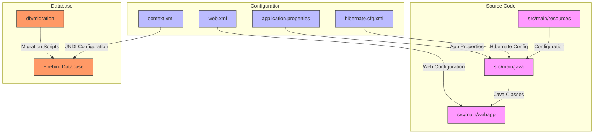
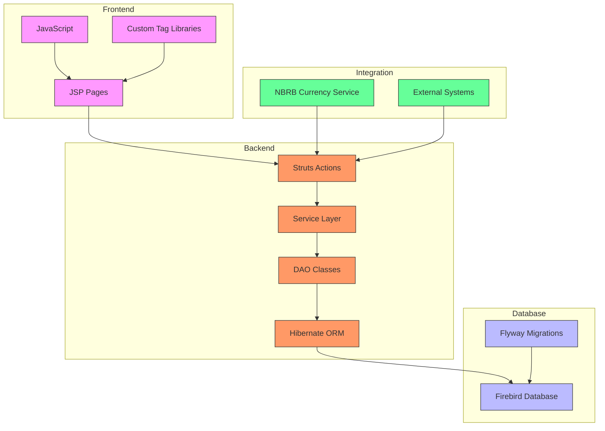
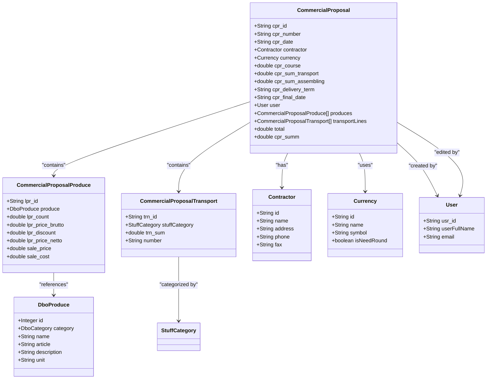
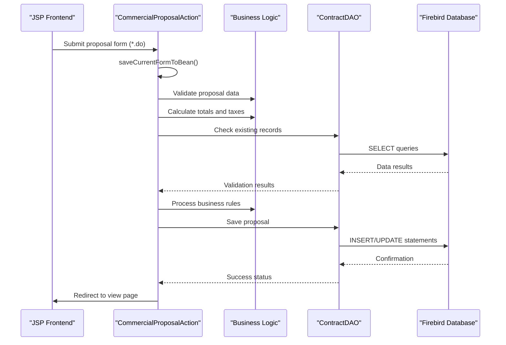
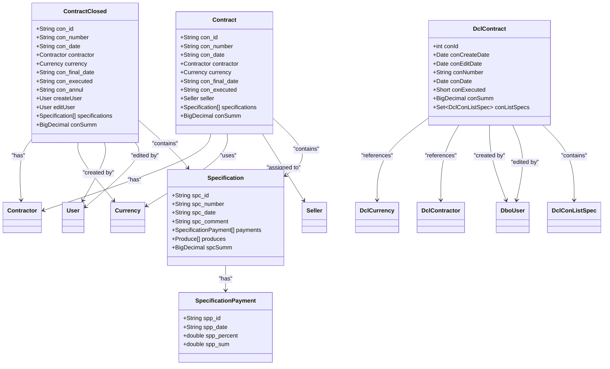
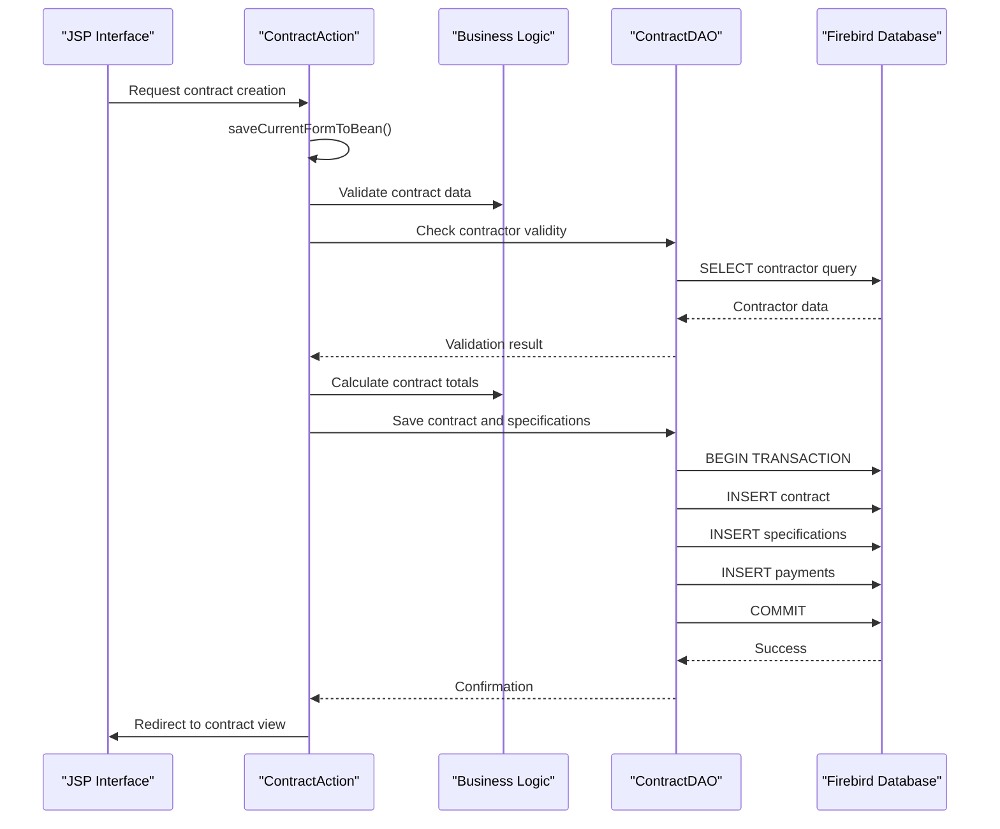
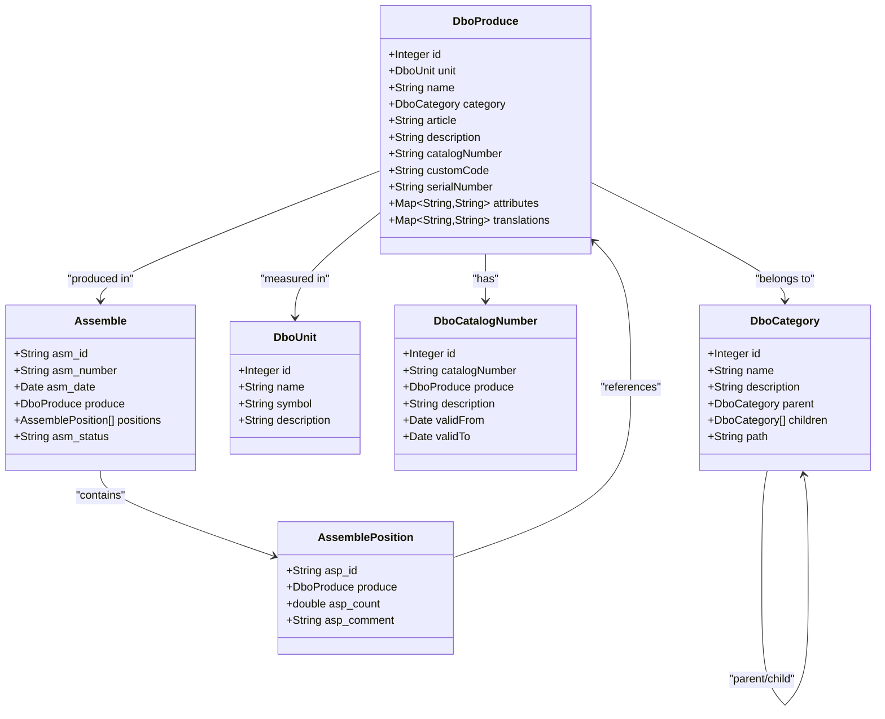
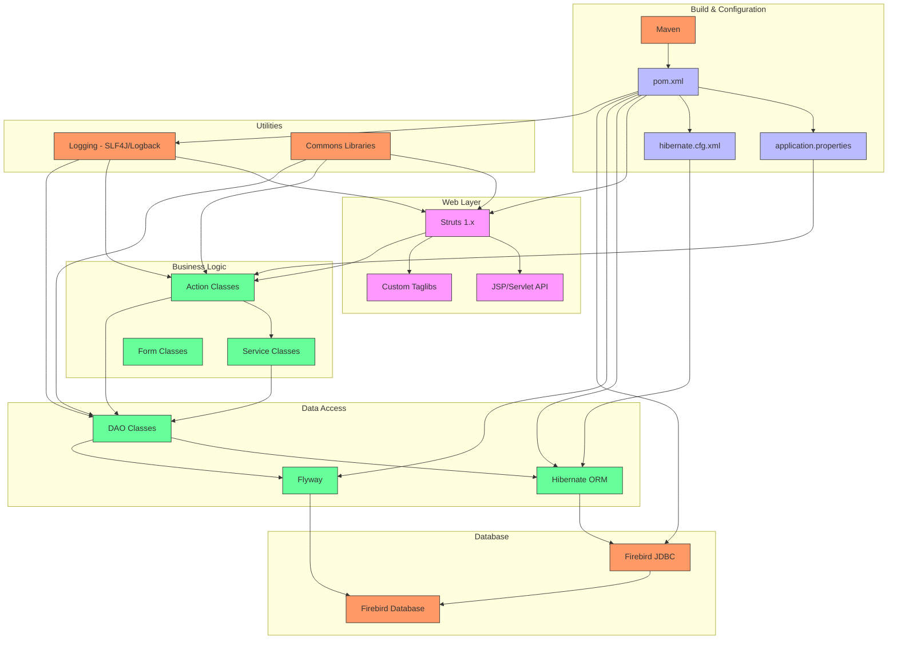

# System Overview

<cite>
**Referenced Files in This Document**   
- [pom.xml](file://pom.xml)
- [application.properties](file://src/main/resources/application.properties)
- [hibernate.cfg.xml](file://src/main/resources/hibernate.cfg.xml)
- [context.xml](file://META-INF/context.xml)
- [web.xml](file://src/main/webapp/WEB-INF/web.xml)
- [CommercialProposal.java](file://src/main/java/net/sam/dcl/beans/CommercialProposal.java)
- [ContractClosed.java](file://src/main/java/net/sam/dcl/beans/ContractClosed.java)
- [DboProduce.java](file://src/main/java/net/sam/dcl/dbo/DboProduce.java)
- [ContractAction.java](file://src/main/java/net/sam/dcl/action/ContractAction.java)
- [CommercialProposalAction.java](file://src/main/java/net/sam/dcl/action/CommercialProposalAction.java)
- [ContractDAO.java](file://src/main/java/net/sam/dcl/dao/ContractDAO.java)
- [DclContract.java](file://src/main/java/net/sam/dcl/dbo/dirty/DclContract.java)
- [CommercialProposal.jsp](file://src/main/webapp/jsp/CommercialProposal.jsp)
- [main.jsp](file://src/main/webapp/layout/main.jsp)
- [V0__initial_schema.sql](file://db/migration/V0__initial_schema.sql)
- [MIGRATION_PLAN.md](file://MIGRATION_PLAN.md)
</cite>

## Table of Contents
1. [Introduction](#introduction)
2. [Project Structure](#project-structure)
3. [Core Components](#core-components)
4. [Architecture Overview](#architecture-overview)
5. [Detailed Component Analysis](#detailed-component-analysis)
6. [Dependency Analysis](#dependency-analysis)
7. [Performance Considerations](#performance-considerations)
8. [Troubleshooting Guide](#troubleshooting-guide)
9. [Conclusion](#conclusion)

## Introduction
The dcl_v3 enterprise application is a legacy Java-based ERP system designed to manage critical business operations including contracts, shipments, commercial proposals, production assemblies, and financial tracking. Originally built on a Struts 1.x/Hibernate/Firebird technology stack, the system has evolved toward modern standards through the adoption of Maven for build management and Flyway for database migrations. The application follows a traditional three-tier architecture with a JSP/JavaScript frontend, Java-based backend actions and DAOs, and a Firebird relational database. The system is currently undergoing modernization to align with contemporary Java standards while preserving its extensive business functionality. Key domain entities such as CommercialProposal, ContractClosed, and DboProduce represent core business concepts and workflows within the organization's operational processes.

## Project Structure
The dcl_v3 application follows a standard Maven-based directory structure with clear separation between source code, configuration, and web resources. The project is organized into several key directories: src/main/java contains the Java source code organized by package (net.sam.dcl for core functionality, by.nbrb.www for currency integration); src/main/resources holds configuration files including hibernate.cfg.xml and application.properties; src/main/webapp contains the JSP frontend with WEB-INF configuration; and db/migration stores database migration scripts. The application uses a legacy Struts 1.x framework for request handling, with actions mapped to *.do URLs, while the frontend consists of JSP pages that utilize custom tag libraries for form rendering and data display. The migration infrastructure is organized under db/migration with versioned SQL scripts following Flyway conventions, indicating the system's evolution toward modern database management practices.

**Diagram sources**
- [pom.xml](file://pom.xml)
- [web.xml](file://src/main/webapp/WEB-INF/web.xml)
- [hibernate.cfg.xml](file://src/main/resources/hibernate.cfg.xml)
- [context.xml](file://META-INF/context.xml)

**Section sources**
- [pom.xml](file://pom.xml)
- [src/main/webapp/WEB-INF/web.xml](file://src/main/webapp/WEB-INF/web.xml)
- [src/main/resources/hibernate.cfg.xml](file://src/main/resources/hibernate.cfg.xml)
- [META-INF/context.xml](file://META-INF/context.xml)

## Core Components
The dcl_v3 system comprises several core components that work together to manage enterprise business processes. The CommercialProposal component handles commercial offers and quotations, allowing users to create detailed proposals with pricing, terms, and product specifications. The ContractClosed component manages finalized contracts, tracking their execution status and financial details. The DboProduce component represents producible items or goods within the system, serving as a fundamental entity for inventory and production management. These components are supported by a robust backend infrastructure including Struts actions for request processing, DAO classes for data access, and Hibernate for object-relational mapping. The system also includes specialized components for currency rate integration with the National Bank of the Republic of Belarus (NBRB), shipment tracking, and production assembly management. Configuration files such as application.properties and hibernate.cfg.xml provide essential settings for database connectivity and ORM behavior, while the migration infrastructure in db/migration enables systematic database schema evolution.

**Section sources**
- [CommercialProposal.java](file://src/main/java/net/sam/dcl/beans/CommercialProposal.java)
- [ContractClosed.java](file://src/main/java/net/sam/dcl/beans/ContractClosed.java)
- [DboProduce.java](file://src/main/java/net/sam/dcl/dbo/DboProduce.java)
- [application.properties](file://src/main/resources/application.properties)
- [hibernate.cfg.xml](file://src/main/resources/hibernate.cfg.xml)

## Architecture Overview
The dcl_v3 application follows a traditional three-tier architecture with distinct presentation, business logic, and data access layers. The frontend consists of JSP pages enhanced with custom tag libraries and JavaScript for dynamic interactions, following the Struts 1.x MVC pattern. The backend implements business logic through Struts Action classes that process user requests, validate data, and coordinate operations between the presentation and data layers. Data access is handled through DAO classes that use Hibernate for object-relational mapping, with database entities defined in the dbo package. The system connects to a Firebird database using connection pooling configured through JNDI, with database schema managed through Flyway migrations. The architecture includes several cross-cutting concerns implemented as servlet filters for authentication, request/response processing, and Hibernate session management. Configuration is externalized through properties files and XML configuration, allowing environment-specific settings without code changes.

**Diagram sources**
- [web.xml](file://src/main/webapp/WEB-INF/web.xml)
- [CommercialProposalAction.java](file://src/main/java/net/sam/dcl/action/CommercialProposalAction.java)
- [ContractDAO.java](file://src/main/java/net/sam/dcl/dao/ContractDAO.java)
- [hibernate.cfg.xml](file://src/main/resources/hibernate.cfg.xml)
- [context.xml](file://META-INF/context.xml)

## Detailed Component Analysis

### Commercial Proposal Management
The CommercialProposal component is a central business entity in the dcl_v3 system, representing commercial offers made to customers. This component manages the entire lifecycle of a commercial proposal from creation to approval, including pricing calculations, currency conversions, and document generation. The CommercialProposal class contains comprehensive properties for tracking proposal details such as customer information, pricing terms, delivery conditions, and financial calculations. The system supports complex pricing logic with features like transport cost allocation, assembly fees, and tax calculations. Workflow integration allows proposals to be converted into contracts upon approval, creating a seamless transition between sales and execution phases.

#### For Object-Oriented Components:

**Diagram sources**
- [CommercialProposal.java](file://src/main/java/net/sam/dcl/beans/CommercialProposal.java)
- [CommercialProposalProduce.java](file://src/main/java/net/sam/dcl/beans/CommercialProposalProduce.java)
- [DboProduce.java](file://src/main/java/net/sam/dcl/dbo/DboProduce.java)

#### For API/Service Components:

**Diagram sources**
- [CommercialProposalAction.java](file://src/main/java/net/sam/dcl/action/CommercialProposalAction.java)
- [ContractDAO.java](file://src/main/java/net/sam/dcl/dao/ContractDAO.java)
- [web.xml](file://src/main/webapp/WEB-INF/web.xml)

### Contract Management System
The ContractClosed component manages finalized contracts within the dcl_v3 system, providing functionality for tracking contract execution, financial status, and related specifications. This component extends the basic contract functionality with additional fields and behaviors specific to closed contracts, including execution status, financial summaries, and archival information. The system maintains relationships between contracts and their associated specifications, payments, and shipments, enabling comprehensive contract lifecycle management. The ContractAction class handles all operations related to contract management, including creation, modification, and deletion, while enforcing business rules and data integrity constraints.

#### For Object-Oriented Components:

**Diagram sources**
- [ContractClosed.java](file://src/main/java/net/sam/dcl/beans/ContractClosed.java)
- [Contract.java](file://src/main/java/net/sam/dcl/beans/Contract.java)
- [DclContract.java](file://src/main/java/net/sam/dcl/dbo/dirty/DclContract.java)
- [Specification.java](file://src/main/java/net/sam/dcl/beans/Specification.java)

#### For API/Service Components:

**Diagram sources**
- [ContractAction.java](file://src/main/java/net/sam/dcl/action/ContractAction.java)
- [ContractDAO.java](file://src/main/java/net/sam/dcl/dao/ContractDAO.java)
- [web.xml](file://src/main/webapp/WEB-INF/web.xml)

### Production and Inventory Management
The DboProduce component represents producible items or goods within the dcl_v3 system, serving as a fundamental entity for inventory and production management. This component manages detailed information about products including categorization, specifications, pricing, and relationships to other business entities. The system supports complex product hierarchies through category structures and enables tracking of production assemblies through related components. The DboProduce class includes properties for product identification, technical specifications, and business metadata, supporting comprehensive product lifecycle management.

#### For Object-Oriented Components:

**Diagram sources**
- [DboProduce.java](file://src/main/java/net/sam/dcl/dbo/DboProduce.java)
- [DboCategory.java](file://src/main/java/net/sam/dcl/dbo/DboCategory.java)
- [DboUnit.java](file://src/main/java/net/sam/dcl/dbo/DboUnit.java)
- [Assemble.java](file://src/main/java/net/sam/dcl/beans/Assemble.java)

## Dependency Analysis
The dcl_v3 application has a well-defined dependency structure that supports its modular architecture and facilitates the ongoing modernization effort. The system uses Maven as its build and dependency management tool, with dependencies declared in the pom.xml file. Key dependencies include Struts 1.x for web request handling, Hibernate 5.6 for object-relational mapping, and Flyway for database migrations. The application follows a layered architecture with clear dependency boundaries: the frontend (JSP) depends on Struts tag libraries and custom taglibs; the backend actions depend on service classes and DAOs; and the data access layer depends on Hibernate and the Firebird JDBC driver. Configuration dependencies are managed through properties files and XML configuration, with application.properties providing placeholders for database and JPA settings. The migration infrastructure depends on Flyway, with migration scripts organized in the db/migration directory and executed through the Maven Flyway plugin.

**Diagram sources**
- [pom.xml](file://pom.xml)
- [application.properties](file://src/main/resources/application.properties)
- [hibernate.cfg.xml](file://src/main/resources/hibernate.cfg.xml)
- [web.xml](file://src/main/webapp/WEB-INF/web.xml)

## Performance Considerations
The dcl_v3 application's performance characteristics are influenced by its legacy architecture and technology stack. The use of Struts 1.x with JSP frontend provides reasonable performance for typical enterprise workloads but may experience limitations under high concurrency due to the thread-per-request model. Database performance is critical to overall system responsiveness, with Hibernate's second-level cache disabled in the current configuration, potentially leading to repeated database queries for frequently accessed data. The application.properties file contains conservative JDBC settings with fetch_size=50 and batch_size=25, which may need optimization based on actual usage patterns. The Firebird database backend, while reliable, is an older version (2.1.3) that may benefit from upgrading to a more recent version for improved performance and features. The migration to Flyway for database management should improve deployment reliability and reduce downtime during schema changes. For optimal performance, consider enabling Hibernate caching, optimizing database indexes, and implementing connection pooling with appropriate sizing based on expected load.

## Troubleshooting Guide
When troubleshooting issues in the dcl_v3 application, start by examining the log files configured in log4j.properties and logback.xml, which provide detailed information about application execution and errors. Common issues often relate to database connectivity, which can be diagnosed by verifying the JNDI configuration in context.xml and ensuring the Firebird database is accessible. For Struts-related problems, check the action mappings in web.xml and ensure that form properties match the corresponding Java bean properties. When encountering Hibernate issues, verify that the entity mappings in hibernate.cfg.xml are correct and that database schema matches the expected structure. Migration issues can be diagnosed by examining the Flyway migration scripts in db/migration and checking for any failed migrations in the flyway_schema_history table. For frontend issues, verify that JavaScript files are loading correctly and that JSP custom tag libraries are properly configured in web.xml. The MIGRATION_PLAN.md document provides additional guidance for resolving migration-specific issues.

**Section sources**
- [log4j.properties](file://src/main/resources/log4j.properties)
- [logback.xml](file://src/main/resources/logback.xml)
- [context.xml](file://META-INF/context.xml)
- [web.xml](file://src/main/webapp/WEB-INF/web.xml)
- [hibernate.cfg.xml](file://src/main/resources/hibernate.cfg.xml)
- [MIGRATION_PLAN.md](file://MIGRATION_PLAN.md)

## Conclusion
The dcl_v3 enterprise application represents a mature ERP system that has evolved from a legacy Struts 1.x/Hibernate/Firebird stack toward more modern standards with Maven and Flyway. The system effectively manages core business processes including contracts, shipments, commercial proposals, production assemblies, and financial tracking through a well-structured three-tier architecture. Key components such as CommercialProposal, ContractClosed, and DboProduce provide robust functionality for their respective domains, supported by a comprehensive backend infrastructure. The ongoing modernization effort, documented in MIGRATION_PLAN.md, demonstrates a strategic approach to updating the technology stack while preserving business functionality. The system's architecture, with clear separation of concerns and externalized configuration, provides a solid foundation for future enhancements and migration to more contemporary frameworks. As the organization continues its modernization journey, the dcl_v3 application serves as a critical business asset that balances legacy stability with progressive technical improvement.